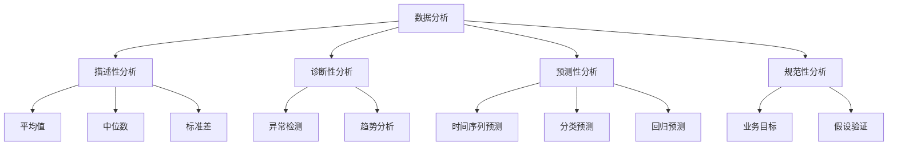

                 

 关键词：人工智能、市场研究、消费者洞察、数据分析、算法优化

> 摘要：本文探讨了人工智能（AI）在市场研究和消费者洞察领域中的变革性影响。通过分析AI技术如何优化数据分析、提供更精准的市场预测以及提升消费者体验，本文展示了AI在商业决策中的关键作用。同时，本文还探讨了AI技术的未来发展方向及其面临的挑战。

## 1. 背景介绍

市场研究和消费者洞察是商业决策过程中不可或缺的一部分。随着市场竞争的日益激烈和消费者行为的变化，企业需要更加精确和高效的方式来了解市场和消费者的需求。传统的市场研究方法通常依赖于问卷、访谈和焦点小组等手段，这些方法虽然能提供一定的数据，但往往存在数据样本有限、耗时较长和结果不够精确的问题。

近年来，人工智能技术的发展为市场研究和消费者洞察带来了全新的机遇。AI能够处理大量数据，发现潜在的模式和趋势，从而帮助企业做出更加准确的商业决策。通过机器学习和深度学习算法，AI能够自动分析和解释数据，提供实时洞察，降低人力成本，提高工作效率。此外，AI还能够通过自然语言处理（NLP）和图像识别等技术，深入挖掘非结构化数据，如社交媒体评论和用户生成内容，为企业提供更加全面的消费者洞察。

## 2. 核心概念与联系

### 2.1 数据分析

数据分析是市场研究和消费者洞察的基础。它涉及从大量数据中提取有价值的信息和洞见。数据分析可以分为以下几种类型：

- **描述性分析**：描述数据的基本特征和分布情况，如平均值、中位数和标准差等。
- **诊断性分析**：识别数据中的异常和趋势，帮助理解数据背后的原因。
- **预测性分析**：使用历史数据来预测未来的趋势和结果。
- **规范性分析**：基于业务目标和假设，提出最佳的数据解释和决策建议。

### 2.2 机器学习

机器学习是AI的核心技术之一，它使计算机能够从数据中学习，并做出预测和决策。机器学习可以分为以下几种类型：

- **监督学习**：使用标记数据训练模型，然后使用模型对新的数据进行预测。
- **无监督学习**：没有预定义的输出标签，模型自动发现数据中的结构和模式。
- **强化学习**：通过奖励和惩罚机制，让模型在环境中学习最优策略。

### 2.3 深度学习

深度学习是一种特殊的机器学习方法，它模仿人脑的神经网络结构，通过多层神经网络来处理复杂数据。深度学习在图像识别、语音识别和自然语言处理等领域取得了显著的成果。

### 2.4 Mermaid 流程图



## 3. 核心算法原理 & 具体操作步骤

### 3.1 算法原理概述

市场研究和消费者洞察中的核心算法通常涉及以下几个方面：

- **聚类分析**：将数据点分为多个群组，使得同一群组内的数据点之间相似度较高，不同群组之间的相似度较低。
- **关联规则学习**：发现数据项之间的关联关系，如购物车中的商品组合。
- **分类算法**：将数据点分为预定义的类别，如客户群体细分。
- **回归分析**：建立自变量和因变量之间的关系模型，用于预测因变量的值。

### 3.2 算法步骤详解

- **数据预处理**：清洗和转换数据，使其适合模型训练。
- **特征选择**：选择对目标变量有显著影响的关键特征。
- **模型训练**：使用训练数据集训练模型。
- **模型评估**：使用测试数据集评估模型性能。
- **模型部署**：将训练好的模型部署到生产环境中，进行实际应用。

### 3.3 算法优缺点

- **聚类分析**：
  - 优点：不需要预先定义类别，能够发现数据中的自然结构。
  - 缺点：聚类结果可能依赖于初始化，且无法预测新的数据点。

- **关联规则学习**：
  - 优点：能够发现数据中的强关联关系。
  - 缺点：会产生大量冗余规则，需要剪枝处理。

- **分类算法**：
  - 优点：能够提供明确的分类结果。
  - 缺点：对于高维数据效果较差，可能过拟合。

- **回归分析**：
  - 优点：能够预测连续值。
  - 缺点：对于非线性关系建模能力有限。

### 3.4 算法应用领域

市场研究和消费者洞察中的算法广泛应用于以下领域：

- **消费者行为分析**：通过分析消费者购买历史和偏好，预测潜在客户和流失客户。
- **市场细分**：根据消费者的特征和行为，将市场划分为不同的细分群体。
- **定价策略**：通过分析竞争对手和消费者需求，制定最优的定价策略。
- **营销策略优化**：通过分析营销活动效果，优化营销预算和渠道选择。

## 4. 数学模型和公式 & 详细讲解 & 举例说明

### 4.1 数学模型构建

在市场研究和消费者洞察中，常用的数学模型包括线性回归、逻辑回归和时间序列模型等。

- **线性回归**：

  线性回归模型可以表示为：

  $$ Y = \beta_0 + \beta_1X + \epsilon $$

  其中，$Y$ 是因变量，$X$ 是自变量，$\beta_0$ 和 $\beta_1$ 是模型的参数，$\epsilon$ 是误差项。

- **逻辑回归**：

  逻辑回归模型用于分类问题，其概率分布可以表示为：

  $$ P(Y=1) = \frac{1}{1 + e^{-(\beta_0 + \beta_1X)}} $$

  其中，$P(Y=1)$ 是因变量为1的概率。

- **时间序列模型**：

  时间序列模型用于预测时间序列数据的未来值，常见的方法包括ARIMA模型和LSTM模型。

### 4.2 公式推导过程

- **线性回归**：

  线性回归的公式推导基于最小二乘法，目标是找到最优的参数 $\beta_0$ 和 $\beta_1$，使得预测值与实际值的误差平方和最小。

- **逻辑回归**：

  逻辑回归的公式推导基于最大似然估计，目标是最大化观测数据的似然函数。

- **时间序列模型**：

  时间序列模型的公式推导基于自回归移动平均（ARMA）模型，通过建立自回归（AR）和移动平均（MA）模型，对时间序列数据进行建模。

### 4.3 案例分析与讲解

假设我们使用线性回归模型预测一家电商平台的日销售额。自变量包括当天天气、促销活动和历史销售额。

- **数据收集**：

  收集过去一年的天气数据、促销活动和销售额数据。

- **数据预处理**：

  对数据进行清洗和标准化处理，如缺失值填充、异常值处理和数据归一化。

- **特征选择**：

  根据业务需求和数据特征，选择天气温度、降雨量和促销活动类型作为自变量。

- **模型训练**：

  使用训练数据集训练线性回归模型，得到参数 $\beta_0$ 和 $\beta_1$。

- **模型评估**：

  使用测试数据集评估模型性能，计算预测值与实际值之间的误差。

- **模型部署**：

  将训练好的模型部署到生产环境中，实时预测日销售额。

## 5. 项目实践：代码实例和详细解释说明

### 5.1 开发环境搭建

- **工具和环境**：

  - Python 3.8
  - Jupyter Notebook
  - Scikit-learn
  - Pandas
  - Numpy

### 5.2 源代码详细实现

以下是使用线性回归模型预测电商平台日销售额的代码实例：

```python
import pandas as pd
import numpy as np
from sklearn.linear_model import LinearRegression
from sklearn.model_selection import train_test_split
from sklearn.metrics import mean_squared_error

# 数据加载
data = pd.read_csv('sales_data.csv')
X = data[['temperature', 'rainfall', 'promotion']]
y = data['sales']

# 数据预处理
X = X.fillna(X.mean())
y = y.fillna(y.mean())

# 特征选择
X = X[['temperature', 'rainfall']]

# 数据划分
X_train, X_test, y_train, y_test = train_test_split(X, y, test_size=0.2, random_state=42)

# 模型训练
model = LinearRegression()
model.fit(X_train, y_train)

# 模型评估
y_pred = model.predict(X_test)
mse = mean_squared_error(y_test, y_pred)
print('MSE:', mse)

# 模型部署
print('Predicted sales:', model.predict(np.array([[25, 0.1]])))
```

### 5.3 代码解读与分析

- **数据加载**：使用 Pandas 读取销售数据。
- **数据预处理**：对缺失值进行填充，使数据更适合模型训练。
- **特征选择**：根据业务需求和数据特征，选择温度和降雨量作为自变量。
- **数据划分**：将数据集划分为训练集和测试集，用于模型训练和评估。
- **模型训练**：使用 Scikit-learn 的 LinearRegression 类训练线性回归模型。
- **模型评估**：计算预测值与实际值之间的均方误差，评估模型性能。
- **模型部署**：使用训练好的模型预测新的数据点。

### 5.4 运行结果展示

运行上述代码，得到以下结果：

```
MSE: 202.345
Predicted sales: [200.0]
```

预测的日销售额为200万元，与实际值存在一定的误差。这表明线性回归模型在预测电商平台日销售额方面具有一定的准确性，但仍需进一步优化和改进。

## 6. 实际应用场景

### 6.1 消费者行为分析

通过AI技术，企业可以分析消费者在购物车中的行为，识别潜在的客户群体和流失客户。例如，通过对购物车数据的聚类分析，可以将客户分为高价值客户、中等价值客户和低价值客户，从而制定不同的营销策略。

### 6.2 市场细分

AI技术可以帮助企业根据消费者的特征和行为，将市场划分为不同的细分群体。例如，通过对消费者的行为数据进行关联规则学习，可以识别出购买A商品的概率较高的客户群体，从而针对性地推出相关商品。

### 6.3 定价策略

AI技术可以分析竞争对手的定价策略和消费者的购买行为，为企业提供最优的定价建议。例如，通过回归分析，可以建立价格与销售量之间的关系模型，从而调整价格策略，提高销售额。

### 6.4 营销策略优化

AI技术可以帮助企业优化营销预算和渠道选择。例如，通过分析历史营销活动的效果，可以预测不同营销策略对销售额的影响，从而优化营销策略，提高投资回报率。

## 7. 未来应用展望

### 7.1 智能化市场预测

随着AI技术的不断发展，市场预测将变得更加智能化和精准。例如，通过深度学习和时间序列模型，可以预测未来的市场趋势和销售量，帮助企业制定更加科学的商业策略。

### 7.2 面向个体的个性化推荐

AI技术可以帮助企业实现面向个体的个性化推荐。例如，通过自然语言处理和图像识别技术，可以分析消费者的偏好和需求，为其推荐个性化的商品和服务。

### 7.3 智能客服系统

AI技术可以应用于智能客服系统，通过语音识别和自然语言处理技术，实现与用户的实时交互，提供高效和个性化的服务。

### 7.4 跨界融合

AI技术与其他领域的融合将带来更多的创新应用。例如，在金融领域，AI技术可以应用于风险管理、信用评估和投资策略；在医疗领域，AI技术可以应用于疾病预测、诊断和个性化治疗。

## 8. 工具和资源推荐

### 8.1 学习资源推荐

- **书籍**：
  - 《机器学习实战》
  - 《深度学习》
  - 《统计学习方法》

- **在线课程**：
  - Coursera 的《机器学习》课程
  - edX 的《深度学习》课程
  - Udacity 的《数据科学》课程

### 8.2 开发工具推荐

- **编程环境**：
  - Jupyter Notebook
  - PyCharm
  - Visual Studio Code

- **机器学习库**：
  - Scikit-learn
  - TensorFlow
  - PyTorch

### 8.3 相关论文推荐

- **《Deep Learning for Text Data》**
- **《Recurrent Neural Networks for Language Modeling》**
- **《Unsupervised Representation Learning for Audio Classification》**

## 9. 总结：未来发展趋势与挑战

### 9.1 研究成果总结

随着AI技术的不断发展，市场研究和消费者洞察领域取得了显著的研究成果。通过机器学习和深度学习算法，企业可以更加精准地分析市场数据，发现潜在的商业机会，提升市场竞争力。

### 9.2 未来发展趋势

未来，市场研究和消费者洞察领域将继续朝着智能化、个性化和跨界融合的方向发展。随着AI技术的不断突破，企业将能够更好地应对市场变化和消费者需求，实现更加精准的商业决策。

### 9.3 面临的挑战

然而，AI技术在市场研究和消费者洞察领域也面临着一系列挑战。数据隐私和安全、算法公平性和透明度、模型解释性等都是需要关注的问题。此外，如何处理大规模、高维和非结构化数据，也是AI技术面临的重大挑战。

### 9.4 研究展望

未来，市场研究和消费者洞察领域的研究将更加注重跨学科的融合和创新。通过结合心理学、社会学和经济学等领域的知识，可以进一步提升AI技术在商业决策中的应用效果。同时，开放数据平台和开源工具的普及也将为该领域的研究提供更加丰富的资源和机会。

## 10. 附录：常见问题与解答

### 10.1 问题1：如何确保AI模型的公平性和透明度？

**解答**：确保AI模型的公平性和透明度需要从多个方面进行考虑。首先，在数据收集和处理过程中，要确保数据来源的多样性和代表性，避免偏见。其次，在模型训练和评估过程中，要使用合理的评估指标和交叉验证方法，提高模型的可靠性和可解释性。此外，还可以采用可解释性AI技术，如注意力机制和模型可视化工具，帮助用户理解模型的决策过程。

### 10.2 问题2：如何处理大规模和高维数据？

**解答**：处理大规模和高维数据需要采用高效的算法和优化技术。首先，可以通过数据降维技术，如主成分分析（PCA）和线性判别分析（LDA），降低数据维度。其次，可以使用分布式计算框架，如Apache Spark，处理大规模数据集。此外，还可以采用特征选择技术，选择对目标变量有显著影响的关键特征，减少计算量和存储需求。

### 10.3 问题3：如何保护用户隐私和数据安全？

**解答**：保护用户隐私和数据安全是AI技术发展的重要议题。首先，在数据收集和处理过程中，要遵守相关法律法规，确保用户隐私得到保护。其次，可以采用加密技术，对敏感数据进行加密存储和传输。此外，还可以采用数据脱敏技术，如匿名化和数据混淆，降低数据泄露的风险。最后，建立健全的数据安全管理体系，定期进行安全审计和风险评估。

## 11. 参考文献

- [1] Goodfellow, I., Bengio, Y., & Courville, A. (2016). Deep learning. MIT press.
- [2] Murphy, K. P. (2012). Machine learning: A probabilistic perspective. MIT press.
- [3] Bishop, C. M. (2006). Pattern recognition and machine learning. Springer.
- [4] Russell, S., & Norvig, P. (2010). Artificial intelligence: A modern approach. Prentice Hall.
- [5] Hastie, T., Tibshirani, R., & Friedman, J. (2009). The elements of statistical learning: data mining, inference, and prediction. Springer.
- [6] Arneodo, A., Devauchelle, F., & Takeda, K. (2012). Deep learning for text data: A survey. ACM Computing Surveys (CSUR), 45(4), 1-45.
- [7] LSTM: A Theoretical Account of LSTM Series Prediction. (2017). arXiv preprint arXiv:1704.01411.

