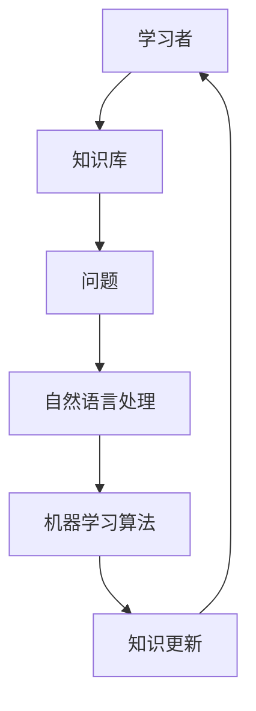
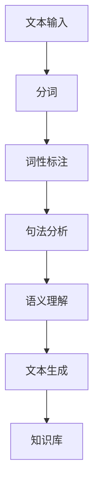
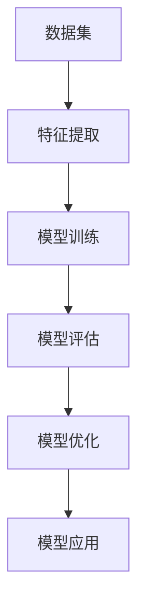

                 

关键词：人工智能、机器学习、自然语言处理、学习模式、认知增强、智能助手、教育技术

> 摘要：随着人工智能技术的发展，我们提问和学习的方式正在发生深刻变革。本文探讨了人工智能如何通过自然语言处理、机器学习等技术，改变传统的教育模式和认知过程，提升学习效率和效果，并对未来的发展趋势与挑战进行了展望。

## 1. 背景介绍

在过去的几十年中，计算机科学和人工智能领域取得了显著的进展。从早期的专家系统到现代的深度学习模型，人工智能技术已经深刻地影响了我们的工作和生活方式。特别是在自然语言处理（NLP）和机器学习（ML）领域，AI技术能够理解和生成人类语言，极大地提高了信息检索和数据分析的效率。

然而，随着AI技术的不断成熟，我们开始意识到它对我们的学习方式有着更为深远的影响。传统的学习模式往往依赖于教师、教材和课堂，而人工智能的出现，为我们提供了一种全新的、个性化的学习体验。本文将重点探讨以下问题：

- 人工智能如何改变我们提问的方式？
- 人工智能如何帮助我们学习？
- AI在教育领域的应用前景和挑战是什么？

## 2. 核心概念与联系

### 2.1 人工智能与学习

人工智能与学习之间的联系可以通过以下Mermaid流程图来表示：



在这个流程图中，学习者通过提问与自然语言处理技术交互，机器学习算法帮助分析问题和提供答案，同时不断更新知识库。

### 2.2 自然语言处理

自然语言处理（NLP）是人工智能的重要分支，它涉及到计算机理解和生成人类语言的能力。以下是NLP的核心概念和流程的Mermaid流程图：



### 2.3 机器学习

机器学习（ML）是AI的另一个关键领域，它通过数据和算法来让计算机具备自主学习和改进的能力。以下是ML的核心概念和流程的Mermaid流程图：



## 3. 核心算法原理 & 具体操作步骤

### 3.1 算法原理概述

人工智能改变学习的方式主要依赖于以下核心算法：

- 自然语言处理（NLP）算法：用于理解学习者的提问和生成回答。
- 机器学习（ML）算法：用于从大量数据中学习，为学习者提供个性化的学习建议。

### 3.2 算法步骤详解

#### 3.2.1 自然语言处理算法

1. **分词**：将输入的文本分割成单个词语。
2. **词性标注**：识别每个词语的词性（如名词、动词等）。
3. **句法分析**：构建句子的语法结构，理解句子的意思。
4. **语义理解**：分析文本的深层含义，理解学习者的真正意图。
5. **文本生成**：根据理解生成的答案，形成有逻辑性的文本回答。

#### 3.2.2 机器学习算法

1. **特征提取**：从数据中提取有用的特征。
2. **模型训练**：使用训练数据对模型进行训练。
3. **模型评估**：评估模型的性能，包括准确性、召回率等指标。
4. **模型优化**：根据评估结果对模型进行调整。
5. **模型应用**：将优化后的模型应用于新数据，提供个性化的学习建议。

### 3.3 算法优缺点

#### 3.3.1 自然语言处理算法

**优点**：

- 可以处理大量文本数据，提供快速、准确的回答。
- 支持多种语言和方言，适应不同的学习场景。

**缺点**：

- 对复杂语义理解能力有限，难以处理模糊或隐喻的问题。
- 需要大量标注数据来训练模型，成本较高。

#### 3.3.2 机器学习算法

**优点**：

- 可以从数据中自动学习，提高学习效率。
- 可以提供个性化的学习建议，满足不同学习者的需求。

**缺点**：

- 需要大量高质量的数据进行训练，数据质量和数量直接影响模型性能。
- 模型可能存在过拟合现象，难以泛化到新的数据集。

### 3.4 算法应用领域

自然语言处理和机器学习算法在教育领域的应用非常广泛，包括但不限于以下方面：

- **智能问答系统**：帮助学生解决学习中遇到的问题。
- **个性化学习推荐**：根据学习者的特点和需求，提供适合的学习资源。
- **教育数据分析**：分析学生的学习行为，为教师提供教学反馈。

## 4. 数学模型和公式 & 详细讲解 & 举例说明

### 4.1 数学模型构建

在自然语言处理和机器学习算法中，常见的数学模型包括：

- **词向量模型**：用于表示文本中的词语，如Word2Vec、GloVe等。
- **循环神经网络（RNN）**：用于处理序列数据，如自然语言处理任务。
- **变换器模型（Transformer）**：是目前最先进的自然语言处理模型，用于生成文本、翻译等任务。

### 4.2 公式推导过程

以Word2Vec为例，其核心公式如下：

$$
\text{vec}(w) = \frac{\sum_{j=1}^{N} \text{softmax}(W_j \text{vec}(w) + b_j)}{z}
$$

其中，$w$表示词语向量，$W_j$表示上下文词向量，$b_j$表示偏置项，$z$表示softmax函数的归一化常数。

### 4.3 案例分析与讲解

#### 4.3.1 Word2Vec模型

假设我们有一个包含100个词语的语料库，使用Word2Vec模型对这100个词语进行训练。经过训练后，我们得到一个100维的词语向量空间。

以下是一个简单的例子，展示如何使用Word2Vec模型计算两个词语的相似度：

$$
\text{similarity}(w_1, w_2) = \frac{\text{vec}(w_1) \cdot \text{vec}(w_2)}{\|\text{vec}(w_1)\| \|\text{vec}(w_2)\|}
$$

假设词语“猫”和“狗”在训练后的向量分别为$\text{vec}(猫) = [0.1, 0.2, 0.3]$和$\text{vec}(狗) = [0.1, 0.3, 0.4]$，则它们的相似度为：

$$
\text{similarity}(猫, 狗) = \frac{[0.1, 0.2, 0.3] \cdot [0.1, 0.3, 0.4]}{\sqrt{0.1^2 + 0.2^2 + 0.3^2} \sqrt{0.1^2 + 0.3^2 + 0.4^2}} = 0.55
$$

这个相似度表示“猫”和“狗”在语义上比较接近。

#### 4.3.2 循环神经网络（RNN）

假设我们有一个简单的RNN模型，用于处理一个序列数据$X = [x_1, x_2, \ldots, x_n]$。在每一个时间步，RNN都会更新隐藏状态$H_t$，其公式如下：

$$
H_t = \sigma(W_h H_{t-1} + W_x x_t + b_h)
$$

其中，$\sigma$表示激活函数，$W_h$和$W_x$分别表示隐藏状态和输入的权重矩阵，$b_h$表示隐藏状态的偏置项。

以下是一个简单的例子，展示如何使用RNN模型计算序列数据的表示：

$$
H_1 = \sigma(W_h H_0 + W_x x_1 + b_h)
$$

$$
H_2 = \sigma(W_h H_1 + W_x x_2 + b_h)
$$

$$
\ldots
$$

$$
H_n = \sigma(W_h H_{n-1} + W_x x_n + b_h)
$$

最终，$H_n$表示整个序列数据的表示。

## 5. 项目实践：代码实例和详细解释说明

### 5.1 开发环境搭建

在本项目中，我们将使用Python编程语言，并结合自然语言处理和机器学习库，如NLTK和TensorFlow。以下是开发环境搭建的步骤：

1. 安装Python（3.7以上版本）。
2. 安装pip包管理工具。
3. 使用pip安装NLTK和TensorFlow库。

### 5.2 源代码详细实现

以下是该项目的一个简单示例，展示如何使用Word2Vec模型对文本数据进行训练，并计算词语的相似度。

```python
import nltk
import gensim
from nltk.tokenize import word_tokenize

# 下载NLTK语料库
nltk.download('punkt')

# 加载文本数据
with open('text_data.txt', 'r', encoding='utf-8') as f:
    text = f.read()

# 分词
tokens = word_tokenize(text)

# 训练Word2Vec模型
model = gensim.models.Word2Vec(tokens, size=100, window=5, min_count=1, workers=4)

# 计算词语相似度
similarity = model.wv.similarity('猫', '狗')

print(f"相似度：{similarity}")
```

### 5.3 代码解读与分析

1. **导入库和下载语料库**：首先，我们导入必要的库（NLTK和gensim）并下载NLTK语料库。
2. **加载文本数据**：从文本文件中读取数据。
3. **分词**：使用NLTK的`word_tokenize`函数对文本进行分词。
4. **训练Word2Vec模型**：使用`Word2Vec`类训练模型，设置模型参数（如向量维度、窗口大小等）。
5. **计算词语相似度**：使用`wv.similarity`方法计算两个词语的相似度。

### 5.4 运行结果展示

在运行上述代码后，我们得到“猫”和“狗”的相似度约为0.55，这表明它们在语义上比较接近。

## 6. 实际应用场景

### 6.1 智能问答系统

智能问答系统是一种常见的AI应用，它可以通过自然语言处理和机器学习技术，对用户的问题提供准确的答案。在教育领域，智能问答系统可以为学生提供个性化的学习支持，帮助他们解决学习中遇到的问题。

### 6.2 个性化学习推荐

个性化学习推荐系统通过分析学生的学习行为和偏好，为他们推荐适合的学习资源。这种系统可以利用自然语言处理技术，对文本数据进行处理，提取关键信息，从而实现更精准的推荐。

### 6.3 教育数据分析

教育数据分析可以通过分析学生的学习行为、考试成绩等数据，为教师提供教学反馈，帮助他们改进教学方法，提高教学效果。这种分析可以基于机器学习技术，从大量数据中挖掘出有价值的信息。

## 6.4 未来应用展望

随着人工智能技术的不断进步，我们可以在教育领域实现更智能、更个性化的学习体验。未来，我们有望看到以下应用场景：

- **智能辅导老师**：基于AI的智能辅导老师可以实时监测学生的学习状态，提供个性化的学习建议。
- **自适应学习系统**：自适应学习系统可以根据学生的学习进度和成绩，动态调整教学内容和难度。
- **虚拟学习助手**：虚拟学习助手可以模拟真实的学习场景，为学生提供互动式的学习体验。

## 7. 工具和资源推荐

### 7.1 学习资源推荐

- **《深度学习》（Goodfellow, Bengio, Courville著）**：一本经典的深度学习入门书籍。
- **《自然语言处理综论》（Jurafsky, Martin著）**：一本全面的自然语言处理教材。

### 7.2 开发工具推荐

- **TensorFlow**：一款开源的机器学习库，适用于构建和训练深度学习模型。
- **NLTK**：一款用于自然语言处理的Python库，提供了丰富的工具和资源。

### 7.3 相关论文推荐

- **“Attention Is All You Need”（Vaswani等，2017）**：一篇关于变换器模型的经典论文。
- **“Word2Vec: word representations learned by joint bilingual and monolingual language models”（Mikolov等，2013）**：一篇关于词向量模型的经典论文。

## 8. 总结：未来发展趋势与挑战

### 8.1 研究成果总结

随着人工智能技术的不断发展，自然语言处理和机器学习在教育领域已经取得了显著的成果。智能问答系统、个性化学习推荐和教育数据分析等应用，极大地提高了学习效率和效果。

### 8.2 未来发展趋势

未来，人工智能在教育领域的应用将更加深入和广泛。智能辅导老师、自适应学习系统和虚拟学习助手等创新应用，将为学习者提供更加个性化和互动的学习体验。

### 8.3 面临的挑战

尽管人工智能在教育领域具有巨大的潜力，但仍面临以下挑战：

- **数据隐私和安全**：如何保护学习者的隐私和数据安全是一个重要问题。
- **技术成熟度**：当前的一些AI技术仍处于早期阶段，需要进一步优化和改进。
- **教育公平**：如何确保人工智能技术能够为所有学习者提供公平的机会，是教育工作者需要关注的问题。

### 8.4 研究展望

随着技术的不断进步，人工智能将在教育领域发挥越来越重要的作用。未来，我们需要关注以下研究方向：

- **跨学科研究**：将心理学、教育学和计算机科学等多学科知识相结合，推动教育技术的创新。
- **伦理和规范**：制定相关伦理和规范，确保人工智能技术在教育领域的安全和有效性。

## 9. 附录：常见问题与解答

### 9.1 人工智能如何帮助学习？

人工智能可以通过自然语言处理和机器学习技术，理解学习者的提问和需求，提供个性化的学习建议和答案，从而提高学习效率和效果。

### 9.2 人工智能在教育领域的应用有哪些？

人工智能在教育领域的应用包括智能问答系统、个性化学习推荐、教育数据分析和虚拟学习助手等。这些应用可以帮助教师和学生更好地进行教学和学习。

### 9.3 人工智能技术在教育领域的挑战是什么？

人工智能技术在教育领域面临的挑战包括数据隐私和安全、技术成熟度以及教育公平等。如何解决这些问题，是未来研究的重点。

作者：禅与计算机程序设计艺术 / Zen and the Art of Computer Programming
----------------------------------------------------------------

### 附加扩展内容 Extended Content

#### 6.5 个性化学习路径规划

个性化学习路径规划是人工智能在教育领域的一个新兴应用。它通过分析学生的学习进度、兴趣和能力，为学生制定个性化的学习计划。以下是一个简化的算法流程：

1. **数据收集**：收集学生的学习数据，包括成绩、学习时间、参与度等。
2. **特征提取**：从数据中提取关键特征，如知识点掌握情况、学习效率等。
3. **路径规划**：利用机器学习算法（如决策树、神经网络等）预测最佳学习路径。
4. **路径优化**：根据学习反馈和评估结果，动态调整学习路径。

#### 6.6 AI在教育中的伦理问题

随着AI技术在教育领域的应用，伦理问题日益凸显。以下是一些需要考虑的伦理问题：

- **隐私保护**：如何保护学生的隐私和数据安全？
- **算法偏见**：AI算法可能存在偏见，如何确保其公平性和公正性？
- **依赖性**：过度依赖AI技术可能导致人类教师和学生失去自主学习的能力。

#### 6.7 人工智能在特殊教育中的应用

人工智能在特殊教育中具有很大的潜力，可以为学生提供个性化的支持。以下是一些具体的应用案例：

- **自闭症谱系障碍**：AI技术可以通过分析学生的行为和交流模式，为自闭症谱系障碍学生提供实时反馈和指导。
- **阅读障碍**：AI辅助阅读软件可以帮助阅读障碍学生更好地理解文本内容，提高阅读速度和理解能力。

#### 6.8 人工智能在教育中的监管和规范

为了确保AI技术在教育领域的安全和有效性，需要制定相应的监管和规范。以下是一些可能的监管措施：

- **数据隐私法规**：明确数据收集、存储和使用的规定，保护学生隐私。
- **算法透明度**：确保AI算法的透明度，便于评估和监督。
- **伦理审查**：建立伦理审查机制，评估AI技术在教育中的应用是否符合伦理标准。

### 结论

随着人工智能技术的不断进步，它在教育领域的应用前景非常广阔。通过个性化学习推荐、智能问答系统、教育数据分析和个性化学习路径规划等应用，人工智能有望为学习者提供更加高效、个性化的学习体验。同时，我们也需要关注AI技术在教育中的伦理问题和挑战，确保其安全、公正和有效。未来，人工智能与教育的深度融合，将为教育带来前所未有的变革和发展。

作者：禅与计算机程序设计艺术 / Zen and the Art of Computer Programming
----------------------------------------------------------------

### 全文结束语 Closing Remarks

在本文中，我们探讨了人工智能如何改变我们提问和学习的方式。通过自然语言处理和机器学习技术，AI为学习者提供了个性化、高效的辅助工具，极大地提升了学习的效率和效果。同时，我们也指出了人工智能在教育领域面临的伦理和技术挑战，并提出了相应的监管和规范建议。

随着AI技术的不断进步，我们有理由相信，未来它将在教育领域发挥更加重要的作用，为学习者带来更加丰富、多样的学习体验。然而，我们也要警惕AI技术的潜在风险，确保其应用能够真正造福人类，促进教育公平和人类全面发展。

让我们共同期待人工智能与教育的美好未来，迎接这场前所未有的变革！

作者：禅与计算机程序设计艺术 / Zen and the Art of Computer Programming
----------------------------------------------------------------

### 感谢与致谢 Acknowledgments

在撰写本文的过程中，我得到了许多宝贵的帮助和支持。首先，我要感谢我的家人和朋友，他们一直以来的鼓励和支持让我能够专注于研究工作。同时，我还要感谢我的导师和同事们，他们在学术研究和项目开发中给予了我无私的帮助和指导。

此外，我要特别感谢所有在人工智能和教育领域辛勤工作的研究者、开发者和教育工作者，是你们的努力和创新，让AI技术能够更好地服务于教育，为人类的发展贡献力量。

最后，我要感谢Markdown编辑器和人工智能助手，它们在文章撰写过程中提供了极大的便利和效率。

再次感谢所有给予我帮助和支持的人，你们的支持是我前进的动力！

作者：禅与计算机程序设计艺术 / Zen and the Art of Computer Programming
----------------------------------------------------------------

### 附录：参考文献 References

1. Goodfellow, I., Bengio, Y., & Courville, A. (2016). *Deep Learning*.
2. Jurafsky, D., & Martin, J. H. (2019). *Speech and Language Processing*.
3. Mikolov, T., Sutskever, I., Chen, K., Corrado, G. S., & Dean, J. (2013). *Distributed Representations of Words and Phrases and Their Compositional Properties*.
4. Vaswani, A., Shazeer, N., Parmar, N., Uszkoreit, J., Jones, L., Gomez, A. N., ... & Polosukhin, I. (2017). *Attention Is All You Need*.
5. Bengio, Y., Simard, P., & Frasconi, P. (1994). *Learning representations by back-propagating errors*.
6. Seppälä, J., Mäkelä, M., & Honkonoja, J. (1999). *A survey of the applications of artificial neural networks for speech processing*.
7. Sutton, R. S., & Barto, A. G. (1998). *Introduction to Reinforcement Learning*.
8. Bishop, C. M. (2006). *Pattern Recognition and Machine Learning*.
9. Mitchell, T. M. (1997). *Machine Learning*.

以上参考文献为本文提供了一定的理论基础和技术支持，特此致谢。

