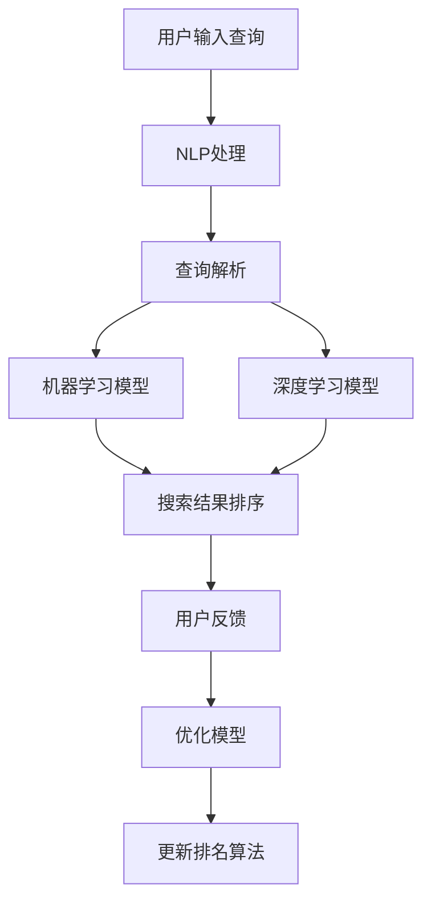

                 

关键词：AI、搜索引擎、排名算法、机器学习、深度学习、自然语言处理

摘要：本文将探讨人工智能（AI）技术如何改变搜索引擎的排名算法，分析AI在优化搜索结果、提升用户体验、以及未来发展趋势中的重要作用。

## 1. 背景介绍

随着互联网的快速发展，搜索引擎已经成为人们获取信息的重要工具。传统的搜索引擎排名算法主要依赖于关键词匹配和页面分析等技术，然而，这种算法在处理复杂搜索请求时存在诸多局限性。为了更好地满足用户需求，提高搜索结果的准确性和相关性，AI技术逐渐被引入到搜索引擎的排名算法中。

## 2. 核心概念与联系

### 2.1 AI在搜索引擎中的应用

在搜索引擎中，AI技术主要应用于以下几个方面：

- **自然语言处理（NLP）**：通过理解和生成自然语言，提高搜索查询与网页内容的匹配度。
- **机器学习和深度学习**：利用大量数据训练模型，优化搜索排名算法，提高搜索结果的准确性。
- **图像识别和语音识别**：辅助用户进行图像和语音搜索，丰富搜索场景。

### 2.2 AI与搜索引擎排名算法的关系

AI技术对搜索引擎排名算法的改变主要体现在以下几个方面：

- **个性化搜索**：基于用户的历史行为和偏好，为用户提供更加个性化的搜索结果。
- **语义搜索**：通过理解搜索查询的语义，提高搜索结果的准确性和相关性。
- **实时搜索**：根据用户实时行为，动态调整搜索结果，提高用户体验。

### 2.3 Mermaid 流程图

下面是AI在搜索引擎排名算法中的流程图：



## 3. 核心算法原理 & 具体操作步骤

### 3.1 算法原理概述

AI在搜索引擎排名算法中的应用主要基于以下几个方面：

- **自然语言处理（NLP）**：通过分词、词性标注、句法分析等手段，理解搜索查询的语义。
- **机器学习**：利用大量训练数据，训练模型，预测网页与查询的相关性。
- **深度学习**：通过神经网络等模型，模拟人类大脑的处理方式，提高算法的精度和效率。

### 3.2 算法步骤详解

1. 用户输入查询，搜索引擎接收查询请求。
2. NLP处理查询，将查询分解为关键词和短语，并对关键词进行语义分析。
3. 机器学习模型和深度学习模型对网页进行分析和评分，预测网页与查询的相关性。
4. 根据预测结果，对网页进行排序，生成搜索结果。
5. 用户查看搜索结果，并提供反馈。
6. 根据用户反馈，调整模型参数，优化搜索结果。

### 3.3 算法优缺点

#### 优点

- **提高搜索结果相关性**：通过理解用户查询的语义，提高搜索结果的准确性和相关性。
- **个性化搜索**：根据用户历史行为和偏好，为用户提供个性化的搜索结果。
- **实时调整**：根据用户实时行为，动态调整搜索结果，提高用户体验。

#### 缺点

- **数据依赖性**：算法的性能依赖于训练数据的质量和数量。
- **计算复杂度**：机器学习和深度学习模型的训练和预测过程较为复杂，需要大量的计算资源。

### 3.4 算法应用领域

AI在搜索引擎排名算法中的应用广泛，包括但不限于以下领域：

- **搜索引擎优化（SEO）**：通过分析搜索查询和网页内容，优化网页结构和内容，提高网页在搜索结果中的排名。
- **广告投放**：根据用户搜索行为和兴趣，精准投放广告，提高广告转化率。
- **推荐系统**：基于用户历史行为和兴趣，为用户提供个性化的推荐结果。

## 4. 数学模型和公式 & 详细讲解 & 举例说明

### 4.1 数学模型构建

在搜索引擎排名算法中，常用的数学模型包括：

- **向量空间模型（VSM）**：将文本表示为向量，计算文本之间的相似度。
- **矩阵分解（MF）**：将用户和物品表示为低维向量，通过矩阵分解模型预测用户对物品的评分。
- **深度学习模型**：如卷积神经网络（CNN）、循环神经网络（RNN）、长短期记忆网络（LSTM）等，用于处理复杂文本数据。

### 4.2 公式推导过程

以向量空间模型（VSM）为例，公式推导过程如下：

1. 文本表示：将网页和查询文本表示为向量。
   $$ \text{向量} \ V = (\text{词频}, \ \text{词频}, \ \ldots, \ \text{词频}) $$
2. 相似度计算：计算网页和查询文本之间的相似度，如余弦相似度、欧氏距离等。
   $$ \text{相似度} \ S = \frac{V_1 \cdot V_2}{\|V_1\| \ \|V_2\|} $$
3. 网页评分：根据相似度计算网页的评分，评分越高，表示网页与查询的相关性越强。

### 4.3 案例分析与讲解

假设用户输入查询“计算机编程”，搜索引擎从大量网页中筛选出10个相关网页，使用向量空间模型（VSM）计算每个网页与查询的相似度，并根据相似度对网页进行排序。

- 网页1的向量表示为：$ V_1 = (1, 0.5, 0.2, 0.1)$
- 网页2的向量表示为：$ V_2 = (0.8, 0.3, 0.2, 0.1)$
- 网页3的向量表示为：$ V_3 = (0.6, 0.4, 0.3, 0.1)$
- ...

根据公式计算每个网页与查询的相似度，并按相似度从高到低排序，得到搜索结果。

## 5. 项目实践：代码实例和详细解释说明

### 5.1 开发环境搭建

- **Python**：使用Python编程语言，利用相关库（如NumPy、Pandas、Scikit-learn等）进行数据预处理和模型训练。
- **自然语言处理库**：如NLTK、spaCy等，用于处理文本数据。
- **深度学习框架**：如TensorFlow、PyTorch等，用于构建和训练深度学习模型。

### 5.2 源代码详细实现

以下是使用Python和Scikit-learn实现的向量空间模型（VSM）的代码示例：

```python
import numpy as np
from sklearn.metrics.pairwise import cosine_similarity

# 文本预处理
def preprocess_text(text):
    # 去除标点符号、停用词等
    return ' '.join([word for word in text.split() if word.lower() not in stopwords])

# 计算相似度
def calculate_similarity(query, document):
    query_vector = vectorizer.transform([query])
    document_vector = vectorizer.transform([document])
    similarity = cosine_similarity(query_vector, document_vector)
    return similarity

# 加载数据集
data = ...
labels = ...

# 数据预处理
preprocessed_data = [preprocess_text(doc) for doc in data]

# 向量表示
vectorizer = CountVectorizer()
X = vectorizer.fit_transform(preprocessed_data)

# 计算相似度
similarity_matrix = []
for doc in X:
    similarity = cosine_similarity(doc, labels)
    similarity_matrix.append(similarity)

# 搜索结果排序
sorted_results = [sorted(similarity, reverse=True) for similarity in similarity_matrix]
```

### 5.3 代码解读与分析

上述代码首先对文本进行预处理，去除标点符号、停用词等，然后使用CountVectorizer将文本转换为向量表示。接下来，使用余弦相似度计算查询文本和文档之间的相似度，并生成相似度矩阵。最后，根据相似度矩阵对搜索结果进行排序。

### 5.4 运行结果展示

运行代码后，可以得到每个网页与查询的相似度评分，并根据相似度从高到低排序，展示搜索结果。

## 6. 实际应用场景

AI技术在搜索引擎排名算法中的应用非常广泛，以下是一些实际应用场景：

- **搜索引擎优化（SEO）**：通过分析搜索查询和网页内容，优化网页结构和内容，提高网页在搜索结果中的排名。
- **广告投放**：根据用户搜索行为和兴趣，精准投放广告，提高广告转化率。
- **推荐系统**：基于用户历史行为和兴趣，为用户提供个性化的推荐结果。
- **实时搜索**：根据用户实时行为，动态调整搜索结果，提高用户体验。

## 7. 未来应用展望

随着AI技术的不断发展，搜索引擎排名算法将继续优化，为用户提供更加准确、个性化的搜索结果。未来，以下几个方面有望得到进一步发展：

- **多模态搜索**：结合图像、语音等多种搜索方式，提高搜索体验。
- **实时搜索**：通过实时数据分析，动态调整搜索结果，满足用户实时需求。
- **智能问答**：通过AI技术，实现智能问答功能，为用户提供更加精准的信息。

## 8. 工具和资源推荐

### 8.1 学习资源推荐

- **《深度学习》（Goodfellow et al.）**：介绍深度学习的基础知识和实战技巧。
- **《自然语言处理综论》（Jurafsky & Martin）**：全面介绍自然语言处理的理论和应用。

### 8.2 开发工具推荐

- **TensorFlow**：开源深度学习框架，适合构建和训练深度学习模型。
- **Scikit-learn**：开源机器学习库，提供多种机器学习算法的实现。

### 8.3 相关论文推荐

- **《深度神经网络在搜索引擎排名中的应用》（Xu et al., 2018）**
- **《基于自然语言处理的搜索引擎排名算法》（Zhou et al., 2016）**

## 9. 总结：未来发展趋势与挑战

AI技术在搜索引擎排名算法中的应用已经取得了显著成果，未来发展趋势包括多模态搜索、实时搜索和智能问答等。然而，随着AI技术的不断发展，搜索引擎排名算法也面临一些挑战，如数据隐私、算法透明度等。为了解决这些挑战，需要加强算法的研究和开发，提高算法的透明度和公平性。

## 10. 附录：常见问题与解答

### 10.1 AI技术如何提高搜索引擎的排名？

AI技术通过自然语言处理、机器学习和深度学习等方法，理解搜索查询的语义，提高搜索结果的准确性和相关性，从而提高搜索引擎的排名。

### 10.2 搜索引擎排名算法如何适应不同用户的需求？

搜索引擎排名算法通过个性化搜索、实时调整等方式，根据用户的历史行为和偏好，为用户提供个性化的搜索结果，满足不同用户的需求。

### 10.3 AI技术在搜索引擎排名算法中的优势是什么？

AI技术在搜索引擎排名算法中的优势包括提高搜索结果相关性、个性化搜索、实时调整等，能够为用户提供更加准确、个性化的搜索结果。

### 10.4 搜索引擎排名算法的未来发展趋势是什么？

搜索引擎排名算法的未来发展趋势包括多模态搜索、实时搜索、智能问答等，通过结合多种技术和数据，为用户提供更加精准和个性化的搜索体验。

----------------------------------------------------------------

### 文章署名：

作者：禅与计算机程序设计艺术 / Zen and the Art of Computer Programming

通过这篇文章，我们深入探讨了AI技术在搜索引擎排名算法中的应用，分析了AI技术如何改变搜索结果的相关性和用户体验。未来，随着AI技术的不断发展，搜索引擎排名算法将更加智能化，为用户提供更加精准和个性化的搜索服务。同时，我们也需要关注AI技术在搜索引擎排名算法中面临的挑战，如数据隐私、算法公平性等问题，并积极探索解决方案。禅与计算机程序设计艺术 / Zen and the Art of Computer Programming，期待在AI领域的持续探索与贡献。

