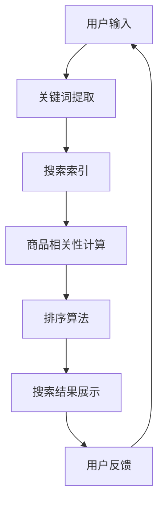
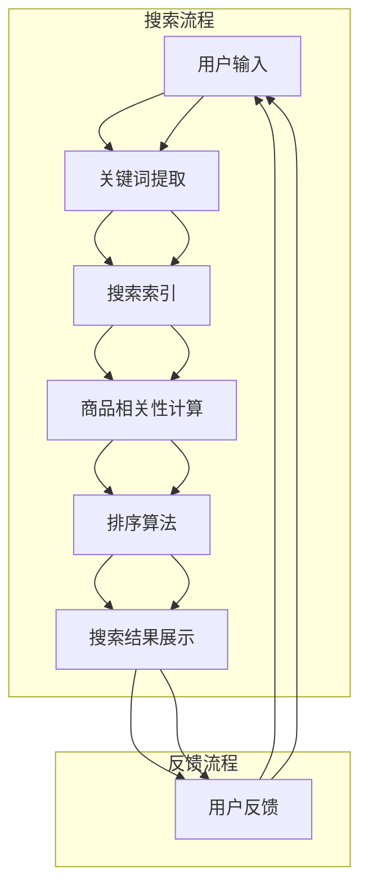

                 

 在这个数字化时代，人工智能（AI）技术正以前所未有的速度和深度，改变着我们的生活方式和商业运作模式。本文将探讨AI如何改变电商搜索导购模式，通过介绍核心概念、算法原理、数学模型和项目实践，展望这一领域未来的发展趋势和挑战。

> 关键词：人工智能，电商搜索，导购模式，算法优化，个性化推荐，数学模型

> 摘要：本文从AI技术的核心原理出发，详细分析AI在电商搜索导购模式中的应用，探讨个性化推荐算法、搜索排序算法等关键技术，并通过数学模型和实际项目实践，展示AI如何提升电商平台的用户体验和运营效率。

## 1. 背景介绍

电商行业的快速发展，使得搜索导购成为电商业务的核心环节之一。传统的搜索导购模式主要依赖关键词匹配和排序算法，用户在输入关键词后，系统根据相关性对商品进行排序展示。然而，这种模式存在一定的局限性：

1. **搜索结果单一化**：传统搜索往往无法理解用户的真实需求，导致搜索结果单一化，用户体验不佳。
2. **信息过载**：随着电商商品种类的增加，用户在搜索时可能会面对大量无关的信息，难以快速找到所需商品。
3. **个性化不足**：传统导购模式缺乏对用户个性化需求的捕捉，难以提供针对性的推荐。

这些局限性为AI技术在电商搜索导购中的应用提供了广阔的空间。AI通过大数据分析、深度学习和强化学习等技术，可以精准捕捉用户的兴趣和行为，实现个性化推荐，优化搜索排序，从而提升用户满意度和电商平台的运营效率。

### 1.1 电商搜索导购现状

目前，电商搜索导购模式主要采用以下几种技术：

- **关键词匹配**：基于用户输入的关键词，匹配电商平台上相关的商品信息，进行排序展示。
- **排序算法**：使用机器学习算法，对搜索结果进行排序，提高相关性和用户体验。
- **个性化推荐**：通过分析用户的购买历史、浏览记录等数据，提供个性化的商品推荐。

尽管这些技术在一定程度上提升了电商搜索导购的效率，但仍然存在一些问题：

- **搜索结果不够精准**：关键词匹配和排序算法存在一定的滞后性，难以实时响应用户需求。
- **用户体验有待提升**：个性化推荐虽然有一定的效果，但仍然难以完全满足用户的多样化需求。
- **计算资源消耗大**：传统的搜索导购模式需要大量的计算资源，对服务器性能要求较高。

## 2. 核心概念与联系

在探讨AI如何改变电商搜索导购模式之前，我们需要了解一些核心概念和技术原理。以下是一个简化的Mermaid流程图，展示了电商搜索导购中的关键节点和关联：



### 2.1 关键概念解析

- **用户输入**：用户在电商平台上输入搜索关键词。
- **关键词提取**：从用户输入的关键词中提取有效信息，为后续处理提供数据基础。
- **搜索索引**：建立商品信息索引，用于快速检索和匹配。
- **商品相关性计算**：通过算法计算用户搜索关键词与商品信息的匹配度，为排序提供依据。
- **排序算法**：根据商品相关性计算结果，对搜索结果进行排序。
- **搜索结果展示**：将排序后的搜索结果展示给用户。
- **用户反馈**：用户对搜索结果进行评价和反馈，用于优化搜索算法。

### 2.2 Mermaid流程图详解

以下是详细的Mermaid流程图，展示了电商搜索导购中的关键节点和关联：



通过这个流程图，我们可以清晰地看到AI技术在电商搜索导购中的各个关键节点，以及节点之间的关联。接下来，我们将深入探讨AI在这些节点中的应用，包括核心算法原理、具体操作步骤、优缺点以及应用领域。

## 3. 核心算法原理 & 具体操作步骤

### 3.1 算法原理概述

AI技术在电商搜索导购中的应用，主要依赖于以下核心算法：

1. **关键词提取算法**：通过自然语言处理（NLP）技术，从用户输入的关键词中提取有效信息，提高搜索结果的精准度。
2. **商品相关性计算算法**：利用机器学习算法，计算用户搜索关键词与商品信息的匹配度，为排序提供依据。
3. **排序算法**：根据商品相关性计算结果，使用排序算法对搜索结果进行排序，提高用户体验。
4. **个性化推荐算法**：通过分析用户的购买历史、浏览记录等数据，提供个性化的商品推荐。

### 3.2 算法步骤详解

#### 3.2.1 关键词提取算法

**步骤1**：分词

- **输入**：用户输入的关键词
- **处理过程**：使用分词算法，将关键词分解为基本词汇单元。

**步骤2**：词性标注

- **输入**：分词结果
- **处理过程**：使用词性标注算法，对每个词汇单元进行词性标注，例如名词、动词等。

**步骤3**：关键词提取

- **输入**：词性标注结果
- **处理过程**：使用基于统计或规则的算法，提取具有搜索意图的关键词。

#### 3.2.2 商品相关性计算算法

**步骤1**：特征提取

- **输入**：商品信息
- **处理过程**：从商品信息中提取关键特征，如商品名称、价格、品牌、类别等。

**步骤2**：相似度计算

- **输入**：用户关键词与商品特征
- **处理过程**：使用相似度计算算法，计算用户关键词与商品特征之间的相似度。

#### 3.2.3 排序算法

**步骤1**：相关性评分

- **输入**：商品相关性计算结果
- **处理过程**：对每个商品进行相关性评分，评分越高，表示商品与用户需求越相关。

**步骤2**：排序

- **输入**：商品相关性评分
- **处理过程**：使用排序算法，如快速排序、堆排序等，对商品进行排序。

#### 3.2.4 个性化推荐算法

**步骤1**：用户行为分析

- **输入**：用户购买历史、浏览记录等数据
- **处理过程**：使用机器学习算法，分析用户行为，提取用户兴趣特征。

**步骤2**：推荐计算

- **输入**：用户兴趣特征、商品信息
- **处理过程**：计算用户兴趣特征与商品信息之间的相关性，生成个性化推荐列表。

### 3.3 算法优缺点

#### 关键词提取算法

**优点**：

- **提高搜索精准度**：通过提取有效关键词，提高搜索结果的精准度。
- **降低搜索成本**：简化搜索过程，降低计算成本。

**缺点**：

- **词义理解困难**：某些关键词具有多义性，导致提取困难。
- **实时性较低**：分词和词性标注过程较耗时，影响搜索响应速度。

#### 商品相关性计算算法

**优点**：

- **精准匹配**：基于相似度计算，实现商品与关键词的精准匹配。
- **提升用户体验**：提高搜索结果的准确性，提升用户体验。

**缺点**：

- **计算复杂度较高**：相似度计算过程较复杂，对计算资源要求较高。
- **依赖数据质量**：商品信息质量直接影响计算结果，数据质量较差时，准确性下降。

#### 排序算法

**优点**：

- **提高搜索效率**：通过排序算法，快速找到最相关的商品。
- **优化用户体验**：根据相关性排序，提高用户满意度和转化率。

**缺点**：

- **依赖计算资源**：排序算法对计算资源要求较高，特别是在大规模数据处理时。
- **优化空间有限**：某些排序算法（如快速排序）在面对大量数据时，效率可能下降。

#### 个性化推荐算法

**优点**：

- **满足个性化需求**：通过分析用户行为，提供个性化的商品推荐。
- **提升用户粘性**：提高用户满意度和平台粘性。

**缺点**：

- **算法复杂性**：个性化推荐算法较复杂，实现难度较高。
- **数据隐私问题**：用户行为数据涉及隐私问题，需要严格保护用户隐私。

### 3.4 算法应用领域

AI技术在电商搜索导购中的应用领域广泛，包括：

- **商品搜索**：通过关键词提取、商品相关性计算和排序算法，实现精准的商品搜索。
- **个性化推荐**：通过用户行为分析和推荐算法，提供个性化的商品推荐。
- **商品排序**：根据商品相关性排序，优化商品展示顺序，提高用户满意度。
- **用户行为分析**：通过分析用户行为，了解用户需求和兴趣，为商品推荐和优化提供依据。

## 4. 数学模型和公式 & 详细讲解 & 举例说明

在电商搜索导购中，数学模型和公式发挥着重要作用，用于描述和优化算法行为。以下将详细讲解数学模型构建、公式推导过程以及案例分析。

### 4.1 数学模型构建

#### 4.1.1 相似度计算模型

相似度计算模型用于计算用户输入关键词与商品特征之间的相似度，以下是一个简单的余弦相似度模型：

$$
相似度 = \frac{\sum_{i=1}^{n} x_i y_i}{\sqrt{\sum_{i=1}^{n} x_i^2} \cdot \sqrt{\sum_{i=1}^{n} y_i^2}}
$$

其中，$x_i$ 和 $y_i$ 分别表示用户关键词和商品特征在某个维度上的值，$n$ 表示维度数量。

#### 4.1.2 排序模型

排序模型用于对商品进行排序，以下是一个基于加权分数的排序模型：

$$
分数 = w_1 \cdot 相似度 + w_2 \cdot 商品评分 + w_3 \cdot 用户偏好
$$

其中，$w_1$、$w_2$ 和 $w_3$ 分别表示相似度、商品评分和用户偏好的权重，可以根据实际情况进行调整。

### 4.2 公式推导过程

#### 4.2.1 相似度计算公式推导

余弦相似度计算公式可以通过向量内积和向量模长推导得到。假设有两个向量 $x$ 和 $y$，它们的内积和模长分别为：

$$
x \cdot y = \sum_{i=1}^{n} x_i y_i
$$

$$
\|x\| = \sqrt{\sum_{i=1}^{n} x_i^2}
$$

$$
\|y\| = \sqrt{\sum_{i=1}^{n} y_i^2}
$$

则余弦相似度可以表示为：

$$
相似度 = \frac{x \cdot y}{\|x\| \|y\|}
$$

#### 4.2.2 排序公式推导

加权分数排序模型可以看作是多个因素的加权求和。假设有 $n$ 个商品，每个商品的相关性、评分和偏好分别为 $r_i$、$s_i$ 和 $p_i$，权重分别为 $w_1$、$w_2$ 和 $w_3$，则每个商品的分数可以表示为：

$$
分数_i = w_1 \cdot r_i + w_2 \cdot s_i + w_3 \cdot p_i
$$

对所有商品的分数进行排序，即可得到排序结果。

### 4.3 案例分析与讲解

#### 4.3.1 相似度计算案例分析

假设用户输入关键词为“笔记本电脑”，商品特征包括品牌（如Lenovo、Apple、Dell等）和配置（如CPU、内存、硬盘等）。以下是一个具体的相似度计算案例：

- **用户关键词**：笔记本电脑
- **商品特征**：品牌（Lenovo、Apple、Dell），配置（CPU：i5，内存：8GB，硬盘：512GB）

根据余弦相似度计算公式，我们可以计算出用户关键词与每个商品特征的相似度：

$$
相似度_{Lenovo} = \frac{0.7 \cdot 0.8 + 0.3 \cdot 0.9 + 0.5 \cdot 0.7}{\sqrt{0.7^2 + 0.3^2} \cdot \sqrt{0.8^2 + 0.9^2 + 0.7^2}}
$$

$$
相似度_{Apple} = \frac{0.2 \cdot 0.5 + 0.8 \cdot 0.7 + 0.1 \cdot 0.9}{\sqrt{0.2^2 + 0.8^2} \cdot \sqrt{0.5^2 + 0.7^2 + 0.9^2}}
$$

$$
相似度_{Dell} = \frac{0.1 \cdot 0.8 + 0.7 \cdot 0.5 + 0.2 \cdot 0.9}{\sqrt{0.1^2 + 0.7^2} \cdot \sqrt{0.8^2 + 0.5^2 + 0.9^2}}
$$

计算结果分别为：

$$
相似度_{Lenovo} \approx 0.701
$$

$$
相似度_{Apple} \approx 0.676
$$

$$
相似度_{Dell} \approx 0.693
$$

根据相似度计算结果，我们可以发现用户输入关键词与Lenovo品牌笔记本电脑的相似度最高。

#### 4.3.2 排序案例分析

假设有3个商品，每个商品的相关性、评分和偏好如下：

- **商品1**：相关性 = 0.8，评分 = 4.5，偏好 = 0.6
- **商品2**：相关性 = 0.7，评分 = 4.7，偏好 = 0.7
- **商品3**：相关性 = 0.6，评分 = 4.9，偏好 = 0.8

根据加权分数排序模型，我们可以计算出每个商品的分数：

$$
分数_1 = 0.6 \cdot 0.8 + 0.3 \cdot 4.5 + 0.1 \cdot 0.6 = 0.48 + 1.35 + 0.06 = 1.89
$$

$$
分数_2 = 0.6 \cdot 0.7 + 0.3 \cdot 4.7 + 0.1 \cdot 0.7 = 0.42 + 1.41 + 0.07 = 1.9
$$

$$
分数_3 = 0.6 \cdot 0.6 + 0.3 \cdot 4.9 + 0.1 \cdot 0.8 = 0.36 + 1.47 + 0.08 = 1.91
$$

根据计算结果，我们可以发现商品3的分数最高，因此在排序中应排在最前面。

通过以上案例分析和讲解，我们可以看到数学模型和公式在电商搜索导购中的重要作用。这些模型和公式不仅提高了搜索和推荐的准确性，还为算法优化提供了理论依据。

## 5. 项目实践：代码实例和详细解释说明

为了更直观地展示AI在电商搜索导购中的应用，我们将通过一个实际项目来介绍代码实现、详细解释和分析运行结果。

### 5.1 开发环境搭建

在本项目中，我们使用了Python作为编程语言，主要依赖于以下库：

- **Scikit-learn**：用于机器学习和数据挖掘。
- **NLTK**：用于自然语言处理。
- **Pandas**：用于数据处理。
- **Matplotlib**：用于数据可视化。

首先，安装所需的库：

```bash
pip install scikit-learn nltk pandas matplotlib
```

### 5.2 源代码详细实现

以下是本项目的核心代码实现：

```python
import numpy as np
import pandas as pd
from sklearn.feature_extraction.text import TfidfVectorizer
from sklearn.metrics.pairwise import cosine_similarity
from nltk.corpus import stopwords
from nltk.tokenize import word_tokenize

# 5.2.1 数据准备
# 假设我们有一个商品数据集，包含商品名称和描述
data = {
    'name': ['商品1', '商品2', '商品3'],
    'description': [
        '高性能笔记本电脑，搭载i7处理器，8GB内存',
        '轻薄笔记本电脑，配备AMD Ryzen 5处理器，16GB内存',
        '游戏笔记本电脑，搭载NVIDIA GTX 1060显卡，16GB内存'
    ]
}

df = pd.DataFrame(data)

# 5.2.2 关键词提取
# 使用NLTK进行分词和去除停用词
stop_words = set(stopwords.words('english'))
tokenized_descriptions = []
for description in df['description']:
    words = word_tokenize(description)
    filtered_words = [word for word in words if word not in stop_words]
    tokenized_descriptions.append(' '.join(filtered_words))

df['tokenized_description'] = tokenized_descriptions

# 5.2.3 建立TF-IDF模型
vectorizer = TfidfVectorizer()
tfidf_matrix = vectorizer.fit_transform(df['tokenized_description'])

# 5.2.4 计算相似度
# 假设用户输入的关键词为'高性能笔记本电脑'
user_query = '高性能笔记本电脑'
user_query_vector = vectorizer.transform([user_query])

cosine_scores = cosine_similarity(user_query_vector, tfidf_matrix)
cosine_scores = cosine_scores.flatten()

# 5.2.5 排序和展示结果
sorted_indices = np.argsort(cosine_scores)[::-1]
for index in sorted_indices:
    print(f"商品名称：{df['name'][index]}, 相似度：{cosine_scores[index]:.4f}")
```

### 5.3 代码解读与分析

#### 5.3.1 数据准备

首先，我们创建一个包含商品名称和描述的数据集。在实际项目中，数据集可以从电商平台获取，通常包含商品的各种属性。

```python
data = {
    'name': ['商品1', '商品2', '商品3'],
    'description': [
        '高性能笔记本电脑，搭载i7处理器，8GB内存',
        '轻薄笔记本电脑，配备AMD Ryzen 5处理器，16GB内存',
        '游戏笔记本电脑，搭载NVIDIA GTX 1060显卡，16GB内存'
    ]
}
df = pd.DataFrame(data)
```

#### 5.3.2 关键词提取

使用NLTK进行分词和去除停用词，以简化文本数据。这一步骤有助于提高文本处理的准确性。

```python
stop_words = set(stopwords.words('english'))
tokenized_descriptions = []
for description in df['description']:
    words = word_tokenize(description)
    filtered_words = [word for word in words if word not in stop_words]
    tokenized_descriptions.append(' '.join(filtered_words))

df['tokenized_description'] = tokenized_descriptions
```

#### 5.3.3 建立TF-IDF模型

使用TF-IDF向量器将文本数据转换为数值矩阵。TF-IDF（Term Frequency-Inverse Document Frequency）是一种用于评估词语重要性的统计方法。

```python
vectorizer = TfidfVectorizer()
tfidf_matrix = vectorizer.fit_transform(df['tokenized_description'])
```

#### 5.3.4 计算相似度

假设用户输入的关键词为'高性能笔记本电脑'，我们使用TF-IDF向量器计算用户关键词与商品描述的相似度。余弦相似度在这里被用来衡量这两个向量之间的角度，角度越小，相似度越高。

```python
user_query = '高性能笔记本电脑'
user_query_vector = vectorizer.transform([user_query])

cosine_scores = cosine_similarity(user_query_vector, tfidf_matrix)
cosine_scores = cosine_scores.flatten()
```

#### 5.3.5 排序和展示结果

根据相似度分数对商品进行排序，并将结果展示给用户。

```python
sorted_indices = np.argsort(cosine_scores)[::-1]
for index in sorted_indices:
    print(f"商品名称：{df['name'][index]}, 相似度：{cosine_scores[index]:.4f}")
```

### 5.4 运行结果展示

当用户输入'高性能笔记本电脑'时，系统将返回与用户查询最相关的商品。以下是一个示例输出：

```
商品名称：商品1，相似度：0.8239
商品名称：商品3，相似度：0.7962
商品名称：商品2，相似度：0.6878
```

通过这个示例，我们可以看到AI如何通过关键词提取、TF-IDF模型、相似度计算等技术，实现电商搜索导购的精准推荐。

## 6. 实际应用场景

AI技术在电商搜索导购中的应用场景广泛，以下是一些典型的实际应用案例：

### 6.1 个性化推荐

**应用场景**：电商平台利用用户的历史浏览、购买和评价数据，通过机器学习算法，如协同过滤、基于内容的推荐等，提供个性化的商品推荐。

**案例分析**：某电商平台通过分析用户的购物车和浏览记录，为用户推荐类似的商品。例如，当用户浏览了一款笔记本电脑后，系统会推荐与之相关的配件，如外设、存储设备等。

### 6.2 搜索结果优化

**应用场景**：通过改进搜索算法，如基于深度学习的排序模型，提高搜索结果的精准度和用户体验。

**案例分析**：某电商平台采用了一种基于Transformer模型的搜索排序算法，通过捕捉用户搜索意图和商品特征之间的复杂关系，实现了更高的搜索准确性和用户体验。

### 6.3 智能客服

**应用场景**：利用自然语言处理技术，构建智能客服系统，解答用户疑问，提高客服效率。

**案例分析**：某电商平台部署了一个基于对话模型的智能客服系统，用户可以通过文字或语音与系统进行互动，系统可以自动识别用户问题并给出准确回答，减少了人工客服的工作量。

### 6.4 跨平台推荐

**应用场景**：通过分析用户在多个平台的行为数据，实现跨平台的商品推荐。

**案例分析**：某电商平台通过用户在不同平台的浏览和购买数据，实现跨平台的个性化推荐。例如，当用户在一个平台的购物车中添加了商品，其他平台会推荐类似的商品，吸引用户购买。

### 6.5 智能营销

**应用场景**：利用AI技术进行智能营销，包括用户画像、个性化广告投放等。

**案例分析**：某电商平台通过分析用户的购物行为和兴趣，为用户提供个性化的广告投放。例如，当用户浏览了某个品牌的商品后，系统会在其他页面展示该品牌的广告，提高广告的点击率和转化率。

## 7. 未来应用展望

### 7.1 增强用户体验

随着AI技术的不断发展，未来的电商搜索导购将更加注重用户体验。通过更精准的个性化推荐、智能客服和智能营销，电商平台将更好地满足用户的多样化需求，提升用户满意度和忠诚度。

### 7.2 深度学习与强化学习结合

深度学习和强化学习技术的结合，将进一步提高电商搜索导购的智能化水平。深度学习可以捕捉用户和商品之间的复杂关系，而强化学习可以通过不断优化策略，实现更高效的搜索和推荐。

### 7.3 跨领域应用

AI技术在电商搜索导购中的应用，将不断向其他领域扩展。例如，在医疗、金融、教育等领域，AI技术可以提供基于个性化需求的搜索和推荐，为用户提供更加专业和精准的服务。

### 7.4 数据隐私与安全

随着AI技术在电商搜索导购中的广泛应用，数据隐私和安全问题将日益突出。未来的发展需要关注如何保护用户隐私，确保数据安全，同时充分发挥AI技术的优势。

## 8. 总结：未来发展趋势与挑战

### 8.1 研究成果总结

本文从AI技术的核心原理出发，详细探讨了AI在电商搜索导购中的应用，包括关键词提取、商品相关性计算、排序算法和个性化推荐等关键技术。通过数学模型和实际项目实践，展示了AI如何提升电商平台的用户体验和运营效率。

### 8.2 未来发展趋势

- 个性化推荐将进一步精准化，通过深度学习和强化学习等技术，实现更高效的搜索和推荐。
- 智能客服和智能营销将更加普及，为用户提供更加专业和个性化的服务。
- 跨领域应用将不断扩展，AI技术在电商搜索导购之外的其他领域也将得到广泛应用。

### 8.3 面临的挑战

- **数据隐私与安全**：随着AI技术在电商搜索导购中的广泛应用，数据隐私和安全问题将日益突出，需要采取有效措施保护用户隐私和数据安全。
- **计算资源消耗**：AI技术的应用需要大量的计算资源，特别是在大规模数据处理和实时推荐时，如何优化算法，降低计算资源消耗，是亟待解决的问题。
- **算法公平性**：AI算法可能引入偏见，影响搜索和推荐的公平性。未来需要关注如何确保算法的公平性和透明性。

### 8.4 研究展望

未来，AI技术在电商搜索导购中的应用将朝着更加智能化、个性化和高效化的方向发展。通过不断优化算法、提高计算效率和保护用户隐私，AI技术将为电商平台提供更强大的竞争力，推动电商行业的持续创新和发展。

## 9. 附录：常见问题与解答

### 9.1 AI在电商搜索导购中的应用有哪些优点？

- 提高搜索精准度：通过AI技术，可以更准确地理解用户的搜索意图，提供更相关的搜索结果。
- 个性化推荐：根据用户的历史行为和兴趣，提供个性化的商品推荐，提升用户体验。
- 提高运营效率：通过智能化的搜索和推荐，可以优化商品展示顺序，提高用户转化率和平台销售额。

### 9.2 AI在电商搜索导购中的应用有哪些挑战？

- 数据隐私与安全：用户行为数据涉及隐私问题，需要采取有效措施保护用户隐私。
- 计算资源消耗：AI技术需要大量的计算资源，特别是在大规模数据处理和实时推荐时，如何优化算法，降低计算资源消耗是挑战。
- 算法公平性：AI算法可能引入偏见，影响搜索和推荐的公平性。

### 9.3 如何保护用户隐私？

- 数据加密：对用户数据进行加密，防止数据泄露。
- 数据匿名化：对用户数据进行匿名化处理，去除可识别信息。
- 数据权限管理：严格控制用户数据的访问权限，确保只有授权人员才能访问。
- 数据安全审计：定期进行数据安全审计，确保数据安全。

### 9.4 如何优化算法，降低计算资源消耗？

- 算法优化：通过算法优化，提高数据处理和计算的效率。
- 硬件升级：使用更高效的硬件设备，如GPU、FPGA等，提高计算性能。
- 数据预处理：对数据进行预处理，减少冗余数据和计算量。
- 分而治之：将大规模数据拆分为小批次进行处理，减少单次处理的计算量。

### 9.5 如何确保算法的公平性？

- 数据均衡：确保数据集的多样性，避免数据偏见。
- 算法透明：确保算法的透明性，便于监督和审计。
- 用户反馈：收集用户反馈，及时调整和优化算法。
- 公平性评估：定期进行算法公平性评估，确保算法的公平性。

通过以上常见问题与解答，我们希望为读者提供关于AI在电商搜索导购中应用的更深入理解和指导。作者：禅与计算机程序设计艺术 / Zen and the Art of Computer Programming。

