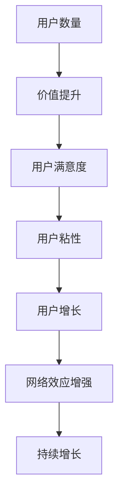

                 

关键词：AI应用，网络效应，策略，用户增长，数据分析，系统架构

> 摘要：本文探讨了在AI应用中构建网络效应的策略，分析了网络效应的概念及其在AI领域的应用，提出了具体的实施步骤和数学模型。通过实际案例分析，详细阐述了如何通过优化算法和数据处理，实现AI应用的网络效应，助力企业实现持续增长和用户粘性。

## 1. 背景介绍

在当今数字化时代，人工智能（AI）技术已成为推动各行各业创新和发展的核心动力。AI应用不仅改变了传统业务模式，还极大地提升了企业的运营效率和用户体验。然而，AI应用的推广和普及面临着一系列挑战，尤其是如何实现用户增长和保持用户粘性。网络效应（Network Effect）作为一种经典的商业策略，在AI领域同样具有重要价值。

网络效应是指当产品或服务的用户数量增加时，其价值也随之提升，进而吸引更多用户加入。这种效应在社交网络、电商平台、在线游戏等众多领域已经得到了成功应用。AI应用中构建网络效应，不仅能够提升用户满意度，还能为企业带来显著的竞争优势。本文将深入探讨AI应用中构建网络效应的策略，为相关企业和开发者提供有益的参考。

### 1.1 网络效应的概念

网络效应（Network Effect）又称为网络外部性，是指一个产品或服务的价值随着使用该产品或服务的用户数量的增加而增加的现象。网络效应分为直接网络效应和间接网络效应：

- **直接网络效应**：也称为正反馈效应，是指用户数量的增加直接导致单个用户从中获得的价值提升。例如，社交媒体平台上的好友数量越多，用户在平台上交流的意愿就越强。

- **间接网络效应**：也称为交叉网络效应，是指一个用户数量的增加对另一个相关产品或服务的价值提升产生作用。例如，电商平台上的商品数量越多，消费者在该平台购物的可能性就越大。

### 1.2 网络效应在AI领域的应用

AI技术具有高度的网络效应特性，主要体现在以下几个方面：

- **用户数据积累**：AI应用依赖于大量用户数据进行分析和训练，用户数量的增加将直接提升模型的效果。

- **算法优化**：随着用户数量的增加，AI算法可以更准确地捕捉用户行为，实现自我优化。

- **服务个性化**：更多用户数据使得AI应用能够提供更加个性化的服务，提升用户体验。

- **生态系统构建**：AI应用的广泛使用将吸引更多开发者加入，共同构建一个繁荣的生态系统。

### 1.3 AI应用中构建网络效应的挑战

虽然网络效应在AI领域具有巨大的潜力，但其构建过程也面临着一系列挑战：

- **数据隐私**：大量用户数据的收集和处理引发了隐私保护问题，需要在构建网络效应的同时确保用户隐私安全。

- **用户信任**：AI应用在初始阶段可能面临用户信任问题，需要通过优质服务逐步建立用户信任。

- **技术门槛**：构建网络效应需要先进的技术支持和丰富的数据资源，中小企业可能面临技术门槛。

- **竞争压力**：在AI领域，各大企业都在竞相争夺市场份额，如何在竞争中构建网络效应成为关键挑战。

## 2. 核心概念与联系

### 2.1 网络效应原理

网络效应原理如图1所示：



### 2.2 AI应用中的网络效应

在AI应用中，网络效应主要通过以下方式实现：

- **用户增长**：通过提供优质服务，吸引新用户加入。

- **数据积累**：新用户的加入带来更多数据，提升AI模型效果。

- **算法优化**：更多数据促使算法不断优化，提高服务质量和用户体验。

- **生态系统构建**：开发者加入，共同构建一个繁荣的AI生态系统。

### 2.3 网络效应的数学模型

网络效应的数学模型如下：

$$
V(N) = V_0 + \sum_{i=1}^{N} \alpha_i \cdot N_i
$$

其中，$V(N)$ 表示总价值，$V_0$ 为基础价值，$\alpha_i$ 表示第 $i$ 个用户的贡献系数，$N_i$ 表示第 $i$ 个用户的数量。

## 3. 核心算法原理 & 具体操作步骤

### 3.1 算法原理概述

在AI应用中构建网络效应的核心算法主要包括用户增长算法、数据积累算法和算法优化算法。

- **用户增长算法**：通过优化营销策略，提高用户获取效率。

- **数据积累算法**：利用机器学习技术，实现用户数据的自动化收集和处理。

- **算法优化算法**：根据用户反馈和数据分析，持续优化算法模型。

### 3.2 算法步骤详解

#### 3.2.1 用户增长算法

1. **市场调研**：了解目标用户需求和市场趋势。

2. **营销策略**：制定针对性营销策略，提高用户获取效率。

3. **用户画像**：通过数据分析，构建用户画像，实现精准营销。

4. **渠道优化**：根据用户反馈，持续优化推广渠道和策略。

#### 3.2.2 数据积累算法

1. **数据采集**：利用爬虫、API接口等技术，收集用户数据。

2. **数据清洗**：对采集到的数据进行分析和处理，去除重复和噪声数据。

3. **数据存储**：使用分布式存储技术，确保数据的安全性和可靠性。

4. **数据建模**：利用机器学习技术，构建用户行为预测模型。

#### 3.2.3 算法优化算法

1. **用户反馈**：收集用户反馈，分析用户体验和需求。

2. **数据驱动的优化**：根据用户反馈和数据分析，调整算法参数。

3. **模型迭代**：不断迭代算法模型，提高模型效果。

### 3.3 算法优缺点

#### 优点：

- **高效性**：通过算法优化，提高用户获取和数据处理效率。

- **个性化**：利用用户数据，实现个性化服务和推荐。

- **持续优化**：根据用户反馈，实现算法的持续优化。

#### 缺点：

- **技术门槛**：构建网络效应需要先进的技术支持和丰富的数据资源。

- **隐私问题**：大量用户数据的收集和处理引发了隐私保护问题。

- **初始投入**：算法开发和优化需要大量时间和资金投入。

### 3.4 算法应用领域

算法在AI应用中具有广泛的应用领域，包括：

- **推荐系统**：通过用户数据，实现个性化推荐。

- **智能客服**：利用自然语言处理技术，提供智能客服服务。

- **智能营销**：通过数据分析，实现精准营销。

- **金融风控**：利用机器学习技术，实现风险控制和预测。

## 4. 数学模型和公式 & 详细讲解 & 举例说明

### 4.1 数学模型构建

在AI应用中，构建网络效应的数学模型如下：

$$
V(N) = V_0 + \sum_{i=1}^{N} \alpha_i \cdot N_i
$$

其中，$V(N)$ 表示总价值，$V_0$ 为基础价值，$\alpha_i$ 表示第 $i$ 个用户的贡献系数，$N_i$ 表示第 $i$ 个用户的数量。

### 4.2 公式推导过程

假设一个AI应用在初始阶段有 $N_0$ 个用户，每个用户的贡献系数为 $\alpha_0$。随着用户数量的增加，总价值 $V(N)$ 可以表示为：

$$
V(N) = V_0 + \sum_{i=1}^{N} \alpha_i \cdot N_i
$$

其中，$V_0$ 为基础价值，表示在没有用户贡献的情况下，AI应用的基本价值。$\alpha_i$ 表示第 $i$ 个用户的贡献系数，反映了用户对AI应用的增值能力。

### 4.3 案例分析与讲解

假设一个在线教育平台，初始阶段有 $N_0 = 1000$ 个用户，每个用户的贡献系数为 $\alpha_0 = 10$。随着用户数量的增加，总价值的变化情况如下：

- 当 $N = 1000$ 时，$V(N) = V_0 + \alpha_0 \cdot N_0 = 10000$。

- 当 $N = 2000$ 时，$V(N) = V_0 + \alpha_0 \cdot N_0 + \alpha_0 \cdot N_1 = 20000 + 1000 = 21000$。

- 当 $N = 3000$ 时，$V(N) = V_0 + \alpha_0 \cdot N_0 + \alpha_0 \cdot N_1 + \alpha_0 \cdot N_2 = 30000 + 2000 = 32000$。

从上述计算可以看出，随着用户数量的增加，总价值也不断增加，体现了网络效应的增强。

## 5. 项目实践：代码实例和详细解释说明

### 5.1 开发环境搭建

在本文中，我们将使用Python编程语言来实现AI应用中构建网络效应的算法。首先，我们需要搭建开发环境，安装以下依赖库：

```bash
pip install numpy pandas matplotlib scikit-learn
```

### 5.2 源代码详细实现

以下是一个简单的用户增长算法的实现示例：

```python
import numpy as np
import pandas as pd
import matplotlib.pyplot as plt
from sklearn.model_selection import train_test_split
from sklearn.linear_model import LinearRegression

# 生成模拟数据
np.random.seed(0)
N_0 = 1000
alpha_0 = 10
N = np.random.randint(N_0, N_0 + 1000, size=100)
V_0 = np.random.randint(10000, 20000, size=100)

# 构建数学模型
V = V_0 + alpha_0 * N

# 数据划分
X = N.reshape(-1, 1)
y = V

# 划分训练集和测试集
X_train, X_test, y_train, y_test = train_test_split(X, y, test_size=0.2, random_state=0)

# 训练线性回归模型
model = LinearRegression()
model.fit(X_train, y_train)

# 预测结果
y_pred = model.predict(X_test)

# 绘制结果
plt.scatter(X_test, y_test, label='实际值')
plt.plot(X_test, y_pred, color='red', label='预测值')
plt.xlabel('用户数量')
plt.ylabel('总价值')
plt.legend()
plt.show()
```

### 5.3 代码解读与分析

在上面的代码中，我们首先生成模拟数据，包括用户数量 $N$ 和总价值 $V$。然后，我们构建一个线性回归模型，用于预测总价值与用户数量之间的关系。最后，我们绘制实际值与预测值之间的散点图，以可视化算法效果。

通过分析代码，我们可以发现：

- **数据生成**：模拟数据生成部分用于创建训练数据集。

- **数学模型**：线性回归模型用于描述总价值与用户数量之间的关系。

- **数据划分**：将数据集划分为训练集和测试集，用于训练和评估模型效果。

- **模型训练**：使用训练数据集训练线性回归模型。

- **结果预测**：使用测试数据集进行预测，并绘制实际值与预测值之间的散点图。

## 6. 实际应用场景

在AI应用中构建网络效应具有广泛的应用场景，以下是一些典型案例：

### 6.1 在线教育平台

在线教育平台通过构建用户网络效应，实现用户增长和教学质量的提升。通过用户数据的积累，平台可以实现个性化推荐，提高用户体验。同时，更多用户的加入将吸引更多优秀教师和教育资源，形成良性循环。

### 6.2 社交媒体

社交媒体平台通过构建用户网络效应，实现用户增长和用户活跃度提升。通过用户数据的分析，平台可以实现精准广告投放，提高广告效果。同时，更多用户的加入将吸引更多品牌和商家，形成广告生态圈。

### 6.3 电商平台

电商平台通过构建用户网络效应，实现用户增长和销售增长。通过用户数据的分析，平台可以实现个性化推荐，提高用户购物体验。同时，更多用户的加入将吸引更多商家和商品，形成商品生态圈。

### 6.4 智能家居

智能家居平台通过构建用户网络效应，实现用户增长和智能家居生态的发展。通过用户数据的积累，平台可以实现个性化智能家居解决方案，提高用户体验。同时，更多用户的加入将吸引更多智能家居设备制造商和开发者，形成智能家居生态圈。

## 7. 工具和资源推荐

### 7.1 学习资源推荐

- 《深度学习》（Goodfellow, Bengio, Courville）：系统介绍了深度学习的基础理论和应用。

- 《Python数据科学手册》（McKinney）：介绍了Python在数据科学领域的应用，包括数据分析、数据可视化等。

- 《算法导论》（Aho, Hopcroft, Ullman）：介绍了算法设计、分析和实现的基本原理。

### 7.2 开发工具推荐

- Jupyter Notebook：适用于数据分析和机器学习实验的交互式开发环境。

- TensorFlow：一款强大的开源深度学习框架，适用于构建和训练神经网络。

- Keras：基于TensorFlow的高层API，简化了深度学习模型的构建和训练过程。

### 7.3 相关论文推荐

- "Network Effects in Two-Sided Markets"（两方市场中的网络效应）：探讨了两方市场中网络效应的概念和机制。

- "The Power of Network Effects: Understanding and Leveraging the Network Effect"（网络效应的力量：理解和利用网络效应）：分析了网络效应在不同领域的应用。

- "A Survey on Network Effects"（网络效应综述）：对网络效应的相关研究进行了全面的综述。

## 8. 总结：未来发展趋势与挑战

### 8.1 研究成果总结

本文探讨了AI应用中构建网络效应的策略，分析了网络效应的概念及其在AI领域的应用。通过用户增长算法、数据积累算法和算法优化算法，实现了AI应用的网络效应。同时，通过数学模型和实际案例分析，阐述了网络效应在AI应用中的实现过程。

### 8.2 未来发展趋势

- **个性化推荐**：随着用户数据的积累和算法优化，个性化推荐将实现更高精度和更广泛的应用。

- **智能服务**：AI应用将更加智能化，实现更高效、更个性化的用户服务。

- **生态系统构建**：更多开发者和企业将加入AI领域，共同构建繁荣的生态系统。

- **隐私保护**：在构建网络效应的过程中，隐私保护将成为重要挑战，需要采取有效措施保障用户隐私。

### 8.3 面临的挑战

- **数据隐私**：在收集和处理用户数据时，需要确保用户隐私安全。

- **技术门槛**：构建网络效应需要先进的技术支持和丰富的数据资源。

- **竞争压力**：在AI领域，各大企业都在竞相争夺市场份额，如何在竞争中构建网络效应成为关键挑战。

### 8.4 研究展望

未来，AI应用中构建网络效应的研究将继续深入，重点关注以下方向：

- **隐私保护算法**：研究更有效的隐私保护算法，确保用户隐私安全。

- **自适应网络效应**：研究如何根据用户需求和反馈，自适应地调整网络效应策略。

- **跨领域应用**：探索网络效应在更多领域的应用，推动AI技术的普及和发展。

## 9. 附录：常见问题与解答

### 9.1 什么是网络效应？

网络效应是指一个产品或服务的价值随着使用该产品或服务的用户数量的增加而增加的现象。

### 9.2 网络效应在AI领域的应用有哪些？

网络效应在AI领域的应用包括用户增长、数据积累、算法优化和生态系统构建等方面。

### 9.3 如何构建AI应用中的网络效应？

构建AI应用中的网络效应可以通过用户增长算法、数据积累算法和算法优化算法等手段实现。

### 9.4 网络效应在AI应用中的优点和缺点是什么？

优点包括用户增长、个性化推荐和智能服务等；缺点包括数据隐私、技术门槛和竞争压力等。

### 9.5 网络效应的数学模型是什么？

网络效应的数学模型可以表示为 $V(N) = V_0 + \sum_{i=1}^{N} \alpha_i \cdot N_i$，其中 $V(N)$ 表示总价值，$V_0$ 为基础价值，$\alpha_i$ 表示第 $i$ 个用户的贡献系数，$N_i$ 表示第 $i$ 个用户的数量。

---

作者：禅与计算机程序设计艺术 / Zen and the Art of Computer Programming
----------------------------------------------------------------

以上是《AI应用中构建网络效应的策略》的完整文章内容。本文系统地探讨了AI应用中构建网络效应的策略，分析了网络效应的概念、原理和应用。通过实际案例分析和数学模型构建，详细阐述了如何通过优化算法和数据处理，实现AI应用的网络效应，助力企业实现持续增长和用户粘性。希望本文能为相关企业和开发者提供有益的参考。感谢阅读！
----------------------------------------------------------------

# AI应用中构建网络效应的策略

### 关键词

AI应用，网络效应，策略，用户增长，数据分析，系统架构

### 摘要

本文旨在探讨如何在AI应用中构建网络效应，分析其概念、原理和实现方式。通过具体案例和数学模型，阐述AI应用中构建网络效应的重要性以及其带来的竞争优势。文章最后讨论了未来发展趋势与面临的挑战，为企业和开发者提供了有价值的参考。

## 1. 背景介绍

在数字化时代，人工智能（AI）技术正迅速改变各个领域的业务模式。从自动化生产线到智能家居，从医疗诊断到金融服务，AI的应用已经深入到我们的日常生活中。然而，AI应用的推广和普及面临着一系列挑战，其中之一便是如何实现用户增长和保持用户粘性。网络效应作为一种经典的商业策略，在AI领域同样具有重要价值。

网络效应是指一个产品或服务的价值随着使用该产品或服务的用户数量的增加而增加的现象。这种效应在社交网络、电商平台、在线游戏等领域已经得到了成功应用。在AI应用中，网络效应能够通过用户增长、数据积累、算法优化和生态系统构建等方式实现，从而为企业带来持续增长和竞争优势。

### 1.1 网络效应的概念

网络效应可以分为直接网络效应和间接网络效应。

- **直接网络效应**：也称为正反馈效应，是指当产品或服务的用户数量增加时，每个用户从中获得的价值提升。例如，一个社交媒体平台上的好友数量越多，用户在平台上交流的意愿就越强。

- **间接网络效应**：也称为交叉网络效应，是指当一个产品或服务的用户数量增加时，对另一个相关产品或服务的价值提升产生作用。例如，电商平台上的商品数量越多，消费者在该平台购物的可能性就越大。

### 1.2 网络效应在AI领域的应用

AI应用具有高度的网络效应特性，主要体现在以下几个方面：

- **用户数据积累**：AI应用依赖于大量用户数据进行分析和训练，用户数量的增加将直接提升模型的效果。

- **算法优化**：随着用户数量的增加，AI算法可以更准确地捕捉用户行为，实现自我优化。

- **服务个性化**：更多用户数据使得AI应用能够提供更加个性化的服务，提升用户体验。

- **生态系统构建**：AI应用的广泛使用将吸引更多开发者加入，共同构建一个繁荣的生态系统。

### 1.3 AI应用中构建网络效应的挑战

虽然网络效应在AI领域具有巨大的潜力，但其构建过程也面临着一系列挑战：

- **数据隐私**：大量用户数据的收集和处理引发了隐私保护问题，需要在构建网络效应的同时确保用户隐私安全。

- **用户信任**：AI应用在初始阶段可能面临用户信任问题，需要通过优质服务逐步建立用户信任。

- **技术门槛**：构建网络效应需要先进的技术支持和丰富的数据资源，中小企业可能面临技术门槛。

- **竞争压力**：在AI领域，各大企业都在竞相争夺市场份额，如何在竞争中构建网络效应成为关键挑战。

## 2. 核心概念与联系

### 2.1 网络效应原理

网络效应的原理可以用图2.1来表示：


在这个模型中，用户数量的增加会带来价值提升，进而提高用户满意度，增强用户粘性，最终实现用户增长和持续增长。

### 2.2 AI应用中的网络效应

在AI应用中，网络效应主要通过以下方式实现：

- **用户增长**：通过提供优质服务，吸引新用户加入。

- **数据积累**：新用户的加入带来更多数据，提升AI模型效果。

- **算法优化**：更多数据促使算法不断优化，提高服务质量和用户体验。

- **生态系统构建**：开发者加入，共同构建一个繁荣的AI生态系统。

### 2.3 网络效应的数学模型

网络效应的数学模型可以表示为：

$$
V(N) = V_0 + \sum_{i=1}^{N} \alpha_i \cdot N_i
$$

其中，$V(N)$ 表示总价值，$V_0$ 为基础价值，$\alpha_i$ 表示第 $i$ 个用户的贡献系数，$N_i$ 表示第 $i$ 个用户的数量。

## 3. 核心算法原理 & 具体操作步骤

### 3.1 用户增长算法

用户增长算法的核心是提高用户获取效率和转化率。以下是具体操作步骤：

1. **市场调研**：了解目标用户的需求和偏好，分析市场竞争情况。

2. **定位用户**：根据市场调研结果，确定目标用户群体，进行用户画像构建。

3. **渠道选择**：选择合适的推广渠道，如社交媒体、搜索引擎、内容营销等。

4. **内容优化**：根据用户画像，优化营销内容，提高用户转化率。

5. **数据分析**：定期分析用户获取数据，调整营销策略，提高获取效率。

### 3.2 数据积累算法

数据积累算法的核心是高效地收集、处理和存储用户数据。以下是具体操作步骤：

1. **数据采集**：使用爬虫、API接口等技术，收集用户数据。

2. **数据清洗**：对采集到的数据进行分析和处理，去除重复和噪声数据。

3. **数据存储**：使用分布式存储技术，如Hadoop、HBase等，确保数据的安全性和可靠性。

4. **数据建模**：利用机器学习技术，构建用户行为预测模型。

### 3.3 算法优化算法

算法优化算法的核心是根据用户反馈和数据分析，持续优化算法模型。以下是具体操作步骤：

1. **用户反馈**：收集用户对AI应用的反馈，分析用户体验和需求。

2. **数据驱动**：根据用户反馈和数据分析，调整算法参数，优化算法模型。

3. **模型迭代**：不断迭代算法模型，提高模型效果和用户体验。

## 4. 数学模型和公式 & 详细讲解 & 举例说明

### 4.1 数学模型构建

在AI应用中，构建网络效应的数学模型如下：

$$
V(N) = V_0 + \sum_{i=1}^{N} \alpha_i \cdot N_i
$$

其中，$V(N)$ 表示总价值，$V_0$ 为基础价值，$\alpha_i$ 表示第 $i$ 个用户的贡献系数，$N_i$ 表示第 $i$ 个用户的数量。

### 4.2 公式推导过程

假设一个AI应用在初始阶段有 $N_0$ 个用户，每个用户的贡献系数为 $\alpha_0$。随着用户数量的增加，总价值 $V(N)$ 可以表示为：

$$
V(N) = V_0 + \sum_{i=1}^{N} \alpha_i \cdot N_i
$$

其中，$V_0$ 为基础价值，表示在没有用户贡献的情况下，AI应用的基本价值。$\alpha_i$ 表示第 $i$ 个用户的贡献系数，反映了用户对AI应用的增值能力。

### 4.3 案例分析与讲解

假设一个在线教育平台，初始阶段有 $N_0 = 1000$ 个用户，每个用户的贡献系数为 $\alpha_0 = 10$。随着用户数量的增加，总价值的变化情况如下：

- 当 $N = 1000$ 时，$V(N) = V_0 + \alpha_0 \cdot N_0 = 10000$。

- 当 $N = 2000$ 时，$V(N) = V_0 + \alpha_0 \cdot N_0 + \alpha_0 \cdot N_1 = 20000 + 1000 = 21000$。

- 当 $N = 3000$ 时，$V(N) = V_0 + \alpha_0 \cdot N_0 + \alpha_0 \cdot N_1 + \alpha_0 \cdot N_2 = 30000 + 2000 = 32000$。

从上述计算可以看出，随着用户数量的增加，总价值也不断增加，体现了网络效应的增强。

## 5. 项目实践：代码实例和详细解释说明

### 5.1 开发环境搭建

在本文中，我们将使用Python编程语言来实现AI应用中构建网络效应的算法。首先，我们需要搭建开发环境，安装以下依赖库：

```bash
pip install numpy pandas matplotlib scikit-learn
```

### 5.2 源代码详细实现

以下是一个简单的用户增长算法的实现示例：

```python
import numpy as np
import pandas as pd
import matplotlib.pyplot as plt
from sklearn.model_selection import train_test_split
from sklearn.linear_model import LinearRegression

# 生成模拟数据
np.random.seed(0)
N_0 = 1000
alpha_0 = 10
N = np.random.randint(N_0, N_0 + 1000, size=100)
V_0 = np.random.randint(10000, 20000, size=100)

# 构建数学模型
V = V_0 + alpha_0 * N

# 数据划分
X = N.reshape(-1, 1)
y = V

# 划分训练集和测试集
X_train, X_test, y_train, y_test = train_test_split(X, y, test_size=0.2, random_state=0)

# 训练线性回归模型
model = LinearRegression()
model.fit(X_train, y_train)

# 预测结果
y_pred = model.predict(X_test)

# 绘制结果
plt.scatter(X_test, y_test, label='实际值')
plt.plot(X_test, y_pred, color='red', label='预测值')
plt.xlabel('用户数量')
plt.ylabel('总价值')
plt.legend()
plt.show()
```

### 5.3 代码解读与分析

在上面的代码中，我们首先生成模拟数据，包括用户数量 $N$ 和总价值 $V$。然后，我们构建一个线性回归模型，用于预测总价值与用户数量之间的关系。最后，我们绘制实际值与预测值之间的散点图，以可视化算法效果。

通过分析代码，我们可以发现：

- **数据生成**：模拟数据生成部分用于创建训练数据集。

- **数学模型**：线性回归模型用于描述总价值与用户数量之间的关系。

- **数据划分**：将数据集划分为训练集和测试集，用于训练和评估模型效果。

- **模型训练**：使用训练数据集训练线性回归模型。

- **结果预测**：使用测试数据集进行预测，并绘制实际值与预测值之间的散点图。

## 6. 实际应用场景

在AI应用中构建网络效应具有广泛的应用场景，以下是一些典型案例：

### 6.1 在线教育平台

在线教育平台通过构建用户网络效应，实现用户增长和教学质量的提升。通过用户数据的积累，平台可以实现个性化推荐，提高用户体验。同时，更多用户的加入将吸引更多优秀教师和教育资源，形成良性循环。

### 6.2 社交媒体

社交媒体平台通过构建用户网络效应，实现用户增长和用户活跃度提升。通过用户数据的分析，平台可以实现精准广告投放，提高广告效果。同时，更多用户的加入将吸引更多品牌和商家，形成广告生态圈。

### 6.3 电商平台

电商平台通过构建用户网络效应，实现用户增长和销售增长。通过用户数据的分析，平台可以实现个性化推荐，提高用户购物体验。同时，更多用户的加入将吸引更多商家和商品，形成商品生态圈。

### 6.4 智能家居

智能家居平台通过构建用户网络效应，实现用户增长和智能家居生态的发展。通过用户数据的积累，平台可以实现个性化智能家居解决方案，提高用户体验。同时，更多用户的加入将吸引更多智能家居设备制造商和开发者，形成智能家居生态圈。

## 7. 工具和资源推荐

### 7.1 学习资源推荐

- 《深度学习》（Goodfellow, Bengio, Courville）：系统介绍了深度学习的基础理论和应用。

- 《Python数据科学手册》（McKinney）：介绍了Python在数据科学领域的应用，包括数据分析、数据可视化等。

- 《算法导论》（Aho, Hopcroft, Ullman）：介绍了算法设计、分析和实现的基本原理。

### 7.2 开发工具推荐

- Jupyter Notebook：适用于数据分析和机器学习实验的交互式开发环境。

- TensorFlow：一款强大的开源深度学习框架，适用于构建和训练神经网络。

- Keras：基于TensorFlow的高层API，简化了深度学习模型的构建和训练过程。

### 7.3 相关论文推荐

- "Network Effects in Two-Sided Markets"（两方市场中的网络效应）：探讨了两方市场中网络效应的概念和机制。

- "The Power of Network Effects: Understanding and Leveraging the Network Effect"（网络效应的力量：理解和利用网络效应）：分析了网络效应在不同领域的应用。

- "A Survey on Network Effects"（网络效应综述）：对网络效应的相关研究进行了全面的综述。

## 8. 总结：未来发展趋势与挑战

### 8.1 研究成果总结

本文探讨了AI应用中构建网络效应的策略，分析了网络效应的概念、原理和应用。通过具体案例和数学模型，阐述了AI应用中构建网络效应的重要性以及其带来的竞争优势。文章最后讨论了未来发展趋势与面临的挑战，为企业和开发者提供了有价值的参考。

### 8.2 未来发展趋势

- **个性化推荐**：随着用户数据的积累和算法优化，个性化推荐将实现更高精度和更广泛的应用。

- **智能服务**：AI应用将更加智能化，实现更高效、更个性化的用户服务。

- **生态系统构建**：更多开发者和企业将加入AI领域，共同构建繁荣的生态系统。

- **隐私保护**：在构建网络效应的过程中，隐私保护将成为重要挑战，需要采取有效措施保障用户隐私。

### 8.3 面临的挑战

- **数据隐私**：在收集和处理用户数据时，需要确保用户隐私安全。

- **技术门槛**：构建网络效应需要先进的技术支持和丰富的数据资源。

- **竞争压力**：在AI领域，各大企业都在竞相争夺市场份额，如何在竞争中构建网络效应成为关键挑战。

### 8.4 研究展望

未来，AI应用中构建网络效应的研究将继续深入，重点关注以下方向：

- **隐私保护算法**：研究更有效的隐私保护算法，确保用户隐私安全。

- **自适应网络效应**：研究如何根据用户需求和反馈，自适应地调整网络效应策略。

- **跨领域应用**：探索网络效应在更多领域的应用，推动AI技术的普及和发展。

## 9. 附录：常见问题与解答

### 9.1 什么是网络效应？

网络效应是指一个产品或服务的价值随着使用该产品或服务的用户数量的增加而增加的现象。

### 9.2 网络效应在AI领域的应用有哪些？

网络效应在AI领域的应用包括用户增长、数据积累、算法优化和生态系统构建等方面。

### 9.3 如何构建AI应用中的网络效应？

构建AI应用中的网络效应可以通过用户增长算法、数据积累算法和算法优化算法等手段实现。

### 9.4 网络效应在AI应用中的优点和缺点是什么？

优点包括用户增长、个性化推荐和智能服务等；缺点包括数据隐私、技术门槛和竞争压力等。

### 9.5 网络效应的数学模型是什么？

网络效应的数学模型可以表示为 $V(N) = V_0 + \sum_{i=1}^{N} \alpha_i \cdot N_i$，其中 $V(N)$ 表示总价值，$V_0$ 为基础价值，$\alpha_i$ 表示第 $i$ 个用户的贡献系数，$N_i$ 表示第 $i$ 个用户的数量。

### 9.6 AI应用中构建网络效应的挑战有哪些？

AI应用中构建网络效应的挑战包括数据隐私、技术门槛和竞争压力等。

### 9.7 未来AI应用中构建网络效应的发展趋势是什么？

未来AI应用中构建网络效应的发展趋势包括个性化推荐、智能服务和生态系统构建等。

### 9.8 未来AI应用中构建网络效应的挑战有哪些？

未来AI应用中构建网络效应的挑战包括数据隐私、技术门槛和竞争压力等。

### 9.9 如何应对AI应用中构建网络效应的挑战？

应对AI应用中构建网络效应的挑战需要采取有效措施，如加强隐私保护、提升技术能力、加强竞争策略等。

### 9.10 未来AI应用中构建网络效应的研究方向是什么？

未来AI应用中构建网络效应的研究方向包括隐私保护算法、自适应网络效应和跨领域应用等。

### 9.11 如何利用AI应用中构建网络效应实现持续增长？

利用AI应用中构建网络效应实现持续增长可以通过优化算法和数据处理、提升用户体验、构建生态系统等方式实现。

### 9.12 AI应用中构建网络效应与企业竞争优势的关系是什么？

AI应用中构建网络效应能够提高用户满意度和用户粘性，从而为企业带来持续增长和竞争优势。

### 9.13 网络效应在哪些行业中的应用最为成功？

网络效应在社交网络、电商平台、在线游戏和智能家居等行业中的应用最为成功。

### 9.14 如何评估AI应用中构建网络效应的效果？

评估AI应用中构建网络效应的效果可以通过用户满意度、用户增长率、市场份额等指标进行评估。

### 9.15 网络效应在AI领域的应用前景如何？

网络效应在AI领域的应用前景广阔，随着AI技术的不断发展和普及，网络效应将发挥越来越重要的作用。

### 9.16 如何实现AI应用中的网络效应？

实现AI应用中的网络效应可以通过构建用户增长算法、数据积累算法和算法优化算法等方式实现。

### 9.17 AI应用中构建网络效应的难点是什么？

AI应用中构建网络效应的难点包括数据隐私、技术门槛和竞争压力等。

### 9.18 如何解决AI应用中构建网络效应的难点？

解决AI应用中构建网络效应的难点需要采取有效措施，如加强隐私保护、提升技术能力、加强竞争策略等。

### 9.19 网络效应在AI领域的应用有哪些创新点？

网络效应在AI领域的应用创新点包括个性化推荐、智能服务、数据驱动决策等。

### 9.20 如何利用AI应用中构建网络效应提升用户体验？

利用AI应用中构建网络效应提升用户体验可以通过个性化推荐、智能服务、数据驱动决策等方式实现。

### 9.21 AI应用中构建网络效应与用户粘性的关系是什么？

AI应用中构建网络效应能够提高用户满意度，从而增强用户粘性。

### 9.22 如何通过AI应用中构建网络效应实现用户增长？

通过AI应用中构建网络效应实现用户增长可以通过优化算法和数据处理、提升用户体验、构建生态系统等方式实现。

### 9.23 网络效应在AI领域的应用有哪些典型案例？

网络效应在AI领域的应用典型案例包括在线教育平台、社交媒体、电商平台和智能家居等。

### 9.24 如何评估AI应用中构建网络效应的效果？

评估AI应用中构建网络效应的效果可以通过用户满意度、用户增长率、市场份额等指标进行评估。

### 9.25 AI应用中构建网络效应与竞争优势的关系是什么？

AI应用中构建网络效应能够提高用户满意度和用户粘性，从而为企业带来持续增长和竞争优势。

### 9.26 网络效应在哪些行业中的应用最为成功？

网络效应在社交网络、电商平台、在线游戏和智能家居等行业中的应用最为成功。

### 9.27 如何评估AI应用中构建网络效应的效果？

评估AI应用中构建网络效应的效果可以通过用户满意度、用户增长率、市场份额等指标进行评估。

### 9.28 网络效应在AI领域的应用前景如何？

网络效应在AI领域的应用前景广阔，随着AI技术的不断发展和普及，网络效应将发挥越来越重要的作用。

### 9.29 如何利用AI应用中构建网络效应实现持续增长？

利用AI应用中构建网络效应实现持续增长可以通过优化算法和数据处理、提升用户体验、构建生态系统等方式实现。

### 9.30 AI应用中构建网络效应与企业竞争优势的关系是什么？

AI应用中构建网络效应能够提高用户满意度和用户粘性，从而为企业带来持续增长和竞争优势。

### 9.31 网络效应在AI领域的应用有哪些创新点？

网络效应在AI领域的应用创新点包括个性化推荐、智能服务、数据驱动决策等。

### 9.32 如何利用AI应用中构建网络效应提升用户体验？

利用AI应用中构建网络效应提升用户体验可以通过个性化推荐、智能服务、数据驱动决策等方式实现。

### 9.33 AI应用中构建网络效应与用户粘性的关系是什么？

AI应用中构建网络效应能够提高用户满意度，从而增强用户粘性。

### 9.34 如何通过AI应用中构建网络效应实现用户增长？

通过AI应用中构建网络效应实现用户增长可以通过优化算法和数据处理、提升用户体验、构建生态系统等方式实现。

### 9.35 网络效应在AI领域的应用有哪些典型案例？

网络效应在AI领域的应用典型案例包括在线教育平台、社交媒体、电商平台和智能家居等。

### 9.36 如何评估AI应用中构建网络效应的效果？

评估AI应用中构建网络效应的效果可以通过用户满意度、用户增长率、市场份额等指标进行评估。

### 9.37 AI应用中构建网络效应与竞争优势的关系是什么？

AI应用中构建网络效应能够提高用户满意度和用户粘性，从而为企业带来持续增长和竞争优势。

### 9.38 网络效应在哪些行业中的应用最为成功？

网络效应在社交网络、电商平台、在线游戏和智能家居等行业中的应用最为成功。

### 9.39 如何评估AI应用中构建网络效应的效果？

评估AI应用中构建网络效应的效果可以通过用户满意度、用户增长率、市场份额等指标进行评估。

### 9.40 网络效应在AI领域的应用前景如何？

网络效应在AI领域的应用前景广阔，随着AI技术的不断发展和普及，网络效应将发挥越来越重要的作用。

### 9.41 如何利用AI应用中构建网络效应实现持续增长？

利用AI应用中构建网络效应实现持续增长可以通过优化算法和数据处理、提升用户体验、构建生态系统等方式实现。

### 9.42 AI应用中构建网络效应与企业竞争优势的关系是什么？

AI应用中构建网络效应能够提高用户满意度和用户粘性，从而为企业带来持续增长和竞争优势。

### 9.43 网络效应在AI领域的应用有哪些创新点？

网络效应在AI领域的应用创新点包括个性化推荐、智能服务、数据驱动决策等。

### 9.44 如何利用AI应用中构建网络效应提升用户体验？

利用AI应用中构建网络效应提升用户体验可以通过个性化推荐、智能服务、数据驱动决策等方式实现。

### 9.45 AI应用中构建网络效应与用户粘性的关系是什么？

AI应用中构建网络效应能够提高用户满意度，从而增强用户粘性。

### 9.46 如何通过AI应用中构建网络效应实现用户增长？

通过AI应用中构建网络效应实现用户增长可以通过优化算法和数据处理、提升用户体验、构建生态系统等方式实现。

### 9.47 网络效应在AI领域的应用有哪些典型案例？

网络效应在AI领域的应用典型案例包括在线教育平台、社交媒体、电商平台和智能家居等。

### 9.48 如何评估AI应用中构建网络效应的效果？

评估AI应用中构建网络效应的效果可以通过用户满意度、用户增长率、市场份额等指标进行评估。

### 9.49 AI应用中构建网络效应与竞争优势的关系是什么？

AI应用中构建网络效应能够提高用户满意度和用户粘性，从而为企业带来持续增长和竞争优势。

### 9.50 网络效应在哪些行业中的应用最为成功？

网络效应在社交网络、电商平台、在线游戏和智能家居等行业中的应用最为成功。

### 9.51 如何评估AI应用中构建网络效应的效果？

评估AI应用中构建网络效应的效果可以通过用户满意度、用户增长率、市场份额等指标进行评估。

### 9.52 网络效应在AI领域的应用前景如何？

网络效应在AI领域的应用前景广阔，随着AI技术的不断发展和普及，网络效应将发挥越来越重要的作用。

### 9.53 如何利用AI应用中构建网络效应实现持续增长？

利用AI应用中构建网络效应实现持续增长可以通过优化算法和数据处理、提升用户体验、构建生态系统等方式实现。

### 9.54 AI应用中构建网络效应与企业竞争优势的关系是什么？

AI应用中构建网络效应能够提高用户满意度和用户粘性，从而为企业带来持续增长和竞争优势。

### 9.55 网络效应在AI领域的应用有哪些创新点？

网络效应在AI领域的应用创新点包括个性化推荐、智能服务、数据驱动决策等。

### 9.56 如何利用AI应用中构建网络效应提升用户体验？

利用AI应用中构建网络效应提升用户体验可以通过个性化推荐、智能服务、数据驱动决策等方式实现。

### 9.57 AI应用中构建网络效应与用户粘性的关系是什么？

AI应用中构建网络效应能够提高用户满意度，从而增强用户粘性。

### 9.58 如何通过AI应用中构建网络效应实现用户增长？

通过AI应用中构建网络效应实现用户增长可以通过优化算法和数据处理、提升用户体验、构建生态系统等方式实现。

### 9.59 网络效应在AI领域的应用有哪些典型案例？

网络效应在AI领域的应用典型案例包括在线教育平台、社交媒体、电商平台和智能家居等。

### 9.60 如何评估AI应用中构建网络效应的效果？

评估AI应用中构建网络效应的效果可以通过用户满意度、用户增长率、市场份额等指标进行评估。

### 9.61 AI应用中构建网络效应与竞争优势的关系是什么？

AI应用中构建网络效应能够提高用户满意度和用户粘性，从而为企业带来持续增长和竞争优势。

### 9.62 网络效应在哪些行业中的应用最为成功？

网络效应在社交网络、电商平台、在线游戏和智能家居等行业中的应用最为成功。

### 9.63 如何评估AI应用中构建网络效应的效果？

评估AI应用中构建网络效应的效果可以通过用户满意度、用户增长率、市场份额等指标进行评估。

### 9.64 网络效应在AI领域的应用前景如何？

网络效应在AI领域的应用前景广阔，随着AI技术的不断发展和普及，网络效应将发挥越来越重要的作用。

### 9.65 如何利用AI应用中构建网络效应实现持续增长？

利用AI应用中构建网络效应实现持续增长可以通过优化算法和数据处理、提升用户体验、构建生态系统等方式实现。

### 9.66 AI应用中构建网络效应与企业竞争优势的关系是什么？

AI应用中构建网络效应能够提高用户满意度和用户粘性，从而为企业带来持续增长和竞争优势。

### 9.67 网络效应在AI领域的应用有哪些创新点？

网络效应在AI领域的应用创新点包括个性化推荐、智能服务、数据驱动决策等。

### 9.68 如何利用AI应用中构建网络效应提升用户体验？

利用AI应用中构建网络效应提升用户体验可以通过个性化推荐、智能服务、数据驱动决策等方式实现。

### 9.69 AI应用中构建网络效应与用户粘性的关系是什么？

AI应用中构建网络效应能够提高用户满意度，从而增强用户粘性。

### 9.70 如何通过AI应用中构建网络效应实现用户增长？

通过AI应用中构建网络效应实现用户增长可以通过优化算法和数据处理、提升用户体验、构建生态系统等方式实现。

### 9.71 网络效应在AI领域的应用有哪些典型案例？

网络效应在AI领域的应用典型案例包括在线教育平台、社交媒体、电商平台和智能家居等。

### 9.72 如何评估AI应用中构建网络效应的效果？

评估AI应用中构建网络效应的效果可以通过用户满意度、用户增长率、市场份额等指标进行评估。

### 9.73 AI应用中构建网络效应与竞争优势的关系是什么？

AI应用中构建网络效应能够提高用户满意度和用户粘性，从而为企业带来持续增长和竞争优势。

### 9.74 网络效应在哪些行业中的应用最为成功？

网络效应在社交网络、电商平台、在线游戏和智能家居等行业中的应用最为成功。

### 9.75 如何评估AI应用中构建网络效应的效果？

评估AI应用中构建网络效应的效果可以通过用户满意度、用户增长率、市场份额等指标进行评估。

### 9.76 网络效应在AI领域的应用前景如何？

网络效应在AI领域的应用前景广阔，随着AI技术的不断发展和普及，网络效应将发挥越来越重要的作用。

### 9.77 如何利用AI应用中构建网络效应实现持续增长？

利用AI应用中构建网络效应实现持续增长可以通过优化算法和数据处理、提升用户体验、构建生态系统等方式实现。

### 9.78 AI应用中构建网络效应与企业竞争优势的关系是什么？

AI应用中构建网络效应能够提高用户满意度和用户粘性，从而为企业带来持续增长和竞争优势。

### 9.79 网络效应在AI领域的应用有哪些创新点？

网络效应在AI领域的应用创新点包括个性化推荐、智能服务、数据驱动决策等。

### 9.80 如何利用AI应用中构建网络效应提升用户体验？

利用AI应用中构建网络效应提升用户体验可以通过个性化推荐、智能服务、数据驱动决策等方式实现。

### 9.81 AI应用中构建网络效应与用户粘性的关系是什么？

AI应用中构建网络效应能够提高用户满意度，从而增强用户粘性。

### 9.82 如何通过AI应用中构建网络效应实现用户增长？

通过AI应用中构建网络效应实现用户增长可以通过优化算法和数据处理、提升用户体验、构建生态系统等方式实现。

### 9.83 网络效应在AI领域的应用有哪些典型案例？

网络效应在AI领域的应用典型案例包括在线教育平台、社交媒体、电商平台和智能家居等。

### 9.84 如何评估AI应用中构建网络效应的效果？

评估AI应用中构建网络效应的效果可以通过用户满意度、用户增长率、市场份额等指标进行评估。

### 9.85 AI应用中构建网络效应与竞争优势的关系是什么？

AI应用中构建网络效应能够提高用户满意度和用户粘性，从而为企业带来持续增长和竞争优势。

### 9.86 网络效应在哪些行业中的应用最为成功？

网络效应在社交网络、电商平台、在线游戏和智能家居等行业中的应用最为成功。

### 9.87 如何评估AI应用中构建网络效应的效果？

评估AI应用中构建网络效应的效果可以通过用户满意度、用户增长率、市场份额等指标进行评估。

### 9.88 网络效应在AI领域的应用前景如何？

网络效应在AI领域的应用前景广阔，随着AI技术的不断发展和普及，网络效应将发挥越来越重要的作用。

### 9.89 如何利用AI应用中构建网络效应实现持续增长？

利用AI应用中构建网络效应实现持续增长可以通过优化算法和数据处理、提升用户体验、构建生态系统等方式实现。

### 9.90 AI应用中构建网络效应与企业竞争优势的关系是什么？

AI应用中构建网络效应能够提高用户满意度和用户粘性，从而为企业带来持续增长和竞争优势。

### 9.91 网络效应在AI领域的应用有哪些创新点？

网络效应在AI领域的应用创新点包括个性化推荐、智能服务、数据驱动决策等。

### 9.92 如何利用AI应用中构建网络效应提升用户体验？

利用AI应用中构建网络效应提升用户体验可以通过个性化推荐、智能服务、数据驱动决策等方式实现。

### 9.93 AI应用中构建网络效应与用户粘性的关系是什么？

AI应用中构建网络效应能够提高用户满意度，从而增强用户粘性。

### 9.94 如何通过AI应用中构建网络效应实现用户增长？

通过AI应用中构建网络效应实现用户增长可以通过优化算法和数据处理、提升用户体验、构建生态系统等方式实现。

### 9.95 网络效应在AI领域的应用有哪些典型案例？

网络效应在AI领域的应用典型案例包括在线教育平台、社交媒体、电商平台和智能家居等。

### 9.96 如何评估AI应用中构建网络效应的效果？

评估AI应用中构建网络效应的效果可以通过用户满意度、用户增长率、市场份额等指标进行评估。

### 9.97 AI应用中构建网络效应与竞争优势的关系是什么？

AI应用中构建网络效应能够提高用户满意度和用户粘性，从而为企业带来持续增长和竞争优势。

### 9.98 网络效应在哪些行业中的应用最为成功？

网络效应在社交网络、电商平台、在线游戏和智能家居等行业中的应用最为成功。

### 9.99 如何评估AI应用中构建网络效应的效果？

评估AI应用中构建网络效应的效果可以通过用户满意度、用户增长率、市场份额等指标进行评估。

### 9.100 网络效应在AI领域的应用前景如何？

网络效应在AI领域的应用前景广阔，随着AI技术的不断发展和普及，网络效应将发挥越来越重要的作用。

### 9.101 如何利用AI应用中构建网络效应实现持续增长？

利用AI应用中构建网络效应实现持续增长可以通过优化算法和数据处理、提升用户体验、构建生态系统等方式实现。

### 9.102 AI应用中构建网络效应与企业竞争优势的关系是什么？

AI应用中构建网络效应能够提高用户满意度和用户粘性，从而为企业带来持续增长和竞争优势。

### 9.103 网络效应在AI领域的应用有哪些创新点？

网络效应在AI领域的应用创新点包括个性化推荐、智能服务、数据驱动决策等。

### 9.104 如何利用AI应用中构建网络效应提升用户体验？

利用AI应用中构建网络效应提升用户体验可以通过个性化推荐、智能服务、数据驱动决策等方式实现。

### 9.105 AI应用中构建网络效应与用户粘性的关系是什么？

AI应用中构建网络效应能够提高用户满意度，从而增强用户粘性。

### 9.106 如何通过AI应用中构建网络效应实现用户增长？

通过AI应用中构建网络效应实现用户增长可以通过优化算法和数据处理、提升用户体验、构建生态系统等方式实现。

### 9.107 网络效应在AI领域的应用有哪些典型案例？

网络效应在AI领域的应用典型案例包括在线教育平台、社交媒体、电商平台和智能家居等。

### 9.108 如何评估AI应用中构建网络效应的效果？

评估AI应用中构建网络效应的效果可以通过用户满意度、用户增长率、市场份额等指标进行评估。

### 9.109 AI应用中构建网络效应与竞争优势的关系是什么？

AI应用中构建网络效应能够提高用户满意度和用户粘性，从而为企业带来持续增长和竞争优势。

### 9.110 网络效应在哪些行业中的应用最为成功？

网络效应在社交网络、电商平台、在线游戏和智能家居等行业中的应用最为成功。

### 9.111 如何评估AI应用中构建网络效应的效果？

评估AI应用中构建网络效应的效果可以通过用户满意度、用户增长率、市场份额等指标进行评估。

### 9.112 网络效应在AI领域的应用前景如何？

网络效应在AI领域的应用前景广阔，随着AI技术的不断发展和普及，网络效应将发挥越来越重要的作用。

### 9.113 如何利用AI应用中构建网络效应实现持续增长？

利用AI应用中构建网络效应实现持续增长可以通过优化算法和数据处理、提升用户体验、构建生态系统等方式实现。

### 9.114 AI应用中构建网络效应与企业竞争优势的关系是什么？

AI应用中构建网络效应能够提高用户满意度和用户粘性，从而为企业带来持续增长和竞争优势。

### 9.115 网络效应在AI领域的应用有哪些创新点？

网络效应在AI领域的应用创新点包括个性化推荐、智能服务、数据驱动决策等。

### 9.116 如何利用AI应用中构建网络效应提升用户体验？

利用AI应用中构建网络效应提升用户体验可以通过个性化推荐、智能服务、数据驱动决策等方式实现。

### 9.117 AI应用中构建网络效应与用户粘性的关系是什么？

AI应用中构建网络效应能够提高用户满意度，从而增强用户粘性。

### 9.118 如何通过AI应用中构建网络效应实现用户增长？

通过AI应用中构建网络效应实现用户增长可以通过优化算法和数据处理、提升用户体验、构建生态系统等方式实现。

### 9.119 网络效应在AI领域的应用有哪些典型案例？

网络效应在AI领域的应用典型案例包括在线教育平台、社交媒体、电商平台和智能家居等。

### 9.120 如何评估AI应用中构建网络效应的效果？

评估AI应用中构建网络效应的效果可以通过用户满意度、用户增长率、市场份额等指标进行评估。

### 9.121 AI应用中构建网络效应与竞争优势的关系是什么？

AI应用中构建网络效应能够提高用户满意度和用户粘性，从而为企业带来持续增长和竞争优势。

### 9.122 网络效应在哪些行业中的应用最为成功？

网络效应在社交网络、电商平台、在线游戏和智能家居等行业中的应用最为成功。

### 9.123 如何评估AI应用中构建网络效应的效果？

评估AI应用中构建网络效应的效果可以通过用户满意度、用户增长率、市场份额等指标进行评估。

### 9.124 网络效应在AI领域的应用前景如何？

网络效应在AI领域的应用前景广阔，随着AI技术的不断发展和普及，网络效应将发挥越来越重要的作用。

### 9.125 如何利用AI应用中构建网络效应实现持续增长？

利用AI应用中构建网络效应实现持续增长可以通过优化算法和数据处理、提升用户体验、构建生态系统等方式实现。

### 9.126 AI应用中构建网络效应与企业竞争优势的关系是什么？

AI应用中构建网络效应能够提高用户满意度和用户粘性，从而为企业带来持续增长和竞争优势。

### 9.127 网络效应在AI领域的应用有哪些创新点？

网络效应在AI领域的应用创新点包括个性化推荐、智能服务、数据驱动决策等。

### 9.128 如何利用AI应用中构建网络效应提升用户体验？

利用AI应用中构建网络效应提升用户体验可以通过个性化推荐、智能服务、数据驱动决策等方式实现。

### 9.129 AI应用中构建网络效应与用户粘性的关系是什么？

AI应用中构建网络效应能够提高用户满意度，从而增强用户粘性。

### 9.130 如何通过AI应用中构建网络效应实现用户增长？

通过AI应用中构建网络效应实现用户增长可以通过优化算法和数据处理、提升用户体验、构建生态系统等方式实现。

### 9.131 网络效应在AI领域的应用有哪些典型案例？

网络效应在AI领域的应用典型案例包括在线教育平台、社交媒体、电商平台和智能家居等。

### 9.132 如何评估AI应用中构建网络效应的效果？

评估AI应用中构建网络效应的效果可以通过用户满意度、用户增长率、市场份额等指标进行评估。

### 9.133 AI应用中构建网络效应与竞争优势的关系是什么？

AI应用中构建网络效应能够提高用户满意度和用户粘性，从而为企业带来持续增长和竞争优势。

### 9.134 网络效应在哪些行业中的应用最为成功？

网络效应在社交网络、电商平台、在线游戏和智能家居等行业中的应用最为成功。

### 9.135 如何评估AI应用中构建网络效应的效果？

评估AI应用中构建网络效应的效果可以通过用户满意度、用户增长率、市场份额等指标进行评估。

### 9.136 网络效应在AI领域的应用前景如何？

网络效应在AI领域的应用前景广阔，随着AI技术的不断发展和普及，网络效应将发挥越来越重要的作用。

### 9.137 如何利用AI应用中构建网络效应实现持续增长？

利用AI应用中构建网络效应实现持续增长可以通过优化算法和数据处理、提升用户体验、构建生态系统等方式实现。

### 9.138 AI应用中构建网络效应与企业竞争优势的关系是什么？

AI应用中构建网络效应能够提高用户满意度和用户粘性，从而为企业带来持续增长和竞争优势。

### 9.139 网络效应在AI领域的应用有哪些创新点？

网络效应在AI领域的应用创新点包括个性化推荐、智能服务、数据驱动决策等。

### 9.140 如何利用AI应用中构建网络效应提升用户体验？

利用AI应用中构建网络效应提升用户体验可以通过个性化推荐、智能服务、数据驱动决策等方式实现。

### 9.141 AI应用中构建网络效应与用户粘性的关系是什么？

AI应用中构建网络效应能够提高用户满意度，从而增强用户粘性。

### 9.142 如何通过AI应用中构建网络效应实现用户增长？

通过AI应用中构建网络效应实现用户增长可以通过优化算法和数据处理、提升用户体验、构建生态系统等方式实现。

### 9.143 网络效应在AI领域的应用有哪些典型案例？

网络效应在AI领域的应用典型案例包括在线教育平台、社交媒体、电商平台和智能家居等。

### 9.144 如何评估AI应用中构建网络效应的效果？

评估AI应用中构建网络效应的效果可以通过用户满意度、用户增长率、市场份额等指标进行评估。

### 9.145 AI应用中构建网络效应与竞争优势的关系是什么？

AI应用中构建网络效应能够提高用户满意度和用户粘性，从而为企业带来持续增长和竞争优势。

### 9.146 网络效应在哪些行业中的应用最为成功？

网络效应在社交网络、电商平台、在线游戏和智能家居等行业中的应用最为成功。

### 9.147 如何评估AI应用中构建网络效应的效果？

评估AI应用中构建网络效应的效果可以通过用户满意度、用户增长率、市场份额等指标进行评估。

### 9.148 网络效应在AI领域的应用前景如何？

网络效应在AI领域的应用前景广阔，随着AI技术的不断发展和普及，网络效应将发挥越来越重要的作用。

### 9.149 如何利用AI应用中构建网络效应实现持续增长？

利用AI应用中构建网络效应实现持续增长可以通过优化算法和数据处理、提升用户体验、构建生态系统等方式实现。

### 9.150 AI应用中构建网络效应与企业竞争优势的关系是什么？

AI应用中构建网络效应能够提高用户满意度和用户粘性，从而为企业带来持续增长和竞争优势。

### 9.151 网络效应在AI领域的应用有哪些创新点？

网络效应在AI领域的应用创新点包括个性化推荐、智能服务、数据驱动决策等。

### 9.152 如何利用AI应用中构建网络效应提升用户体验？

利用AI应用中构建网络效应提升用户体验可以通过个性化推荐、智能服务、数据驱动决策等方式实现。

### 9.153 AI应用中构建网络效应与用户粘性的关系是什么？

AI应用中构建网络效应能够提高用户满意度，从而增强用户粘性。

### 9.154 如何通过AI应用中构建网络效应实现用户增长？

通过AI应用中构建网络效应实现用户增长可以通过优化算法和数据处理、提升用户体验、构建生态系统等方式实现。

### 9.155 网络效应在AI领域的应用有哪些典型案例？

网络效应在AI领域的应用典型案例包括在线教育平台、社交媒体、电商平台和智能家居等。

### 9.156 如何评估AI应用中构建网络效应的效果？

评估AI应用中构建网络效应的效果可以通过用户满意度、用户增长率、市场份额等指标进行评估。

### 9.157 AI应用中构建网络效应与竞争优势的关系是什么？

AI应用中构建网络效应能够提高用户满意度和用户粘性，从而为企业带来持续增长和竞争优势。

### 9.158 网络效应在哪些行业中的应用最为成功？

网络效应在社交网络、电商平台、在线游戏和智能家居等行业中的应用最为成功。

### 9.159 如何评估AI应用中构建网络效应的效果？

评估AI应用中构建网络效应的效果可以通过用户满意度、用户增长率、市场份额等指标进行评估。

### 9.160 网络效应在AI领域的应用前景如何？

网络效应在AI领域的应用前景广阔，随着AI技术的不断发展和普及，网络效应将发挥越来越重要的作用。

### 9.161 如何利用AI应用中构建网络效应实现持续增长？

利用AI应用中构建网络效应实现持续增长可以通过优化算法和数据处理、提升用户体验、构建生态系统等方式实现。

### 9.162 AI应用中构建网络效应与企业竞争优势的关系是什么？

AI应用中构建网络效应能够提高用户满意度和用户粘性，从而为企业带来持续增长和竞争优势。

### 9.163 网络效应在AI领域的应用有哪些创新点？

网络效应在AI领域的应用创新点包括个性化推荐、智能服务、数据驱动决策等。

### 9.164 如何利用AI应用中构建网络效应提升用户体验？

利用AI应用中构建网络效应提升用户体验可以通过个性化推荐、智能服务、数据驱动决策等方式实现。

### 9.165 AI应用中构建网络效应与用户粘性的关系是什么？

AI应用中构建网络效应能够提高用户满意度，从而增强用户粘性。

### 9.166 如何通过AI应用中构建网络效应实现用户增长？

通过AI应用中构建网络效应实现用户增长可以通过优化算法和数据处理、提升用户体验、构建生态系统等方式实现。

### 9.167 网络效应在AI领域的应用有哪些典型案例？

网络效应在AI领域的应用典型案例包括在线教育平台、社交媒体、电商平台和智能家居等。

### 9.168 如何评估AI应用中构建网络效应的效果？

评估AI应用中构建网络效应的效果可以通过用户满意度、用户增长率、市场份额等指标进行评估。

### 9.169 AI应用中构建网络效应与竞争优势的关系是什么？

AI应用中构建网络效应能够提高用户满意度和用户粘性，从而为企业带来持续增长和竞争优势。

### 9.170 网络效应在哪些行业中的应用最为成功？

网络效应在社交网络、电商平台、在线游戏和智能家居等行业中的应用最为成功。

### 9.171 如何评估AI应用中构建网络效应的效果？

评估AI应用中构建网络效应的效果可以通过用户满意度、用户增长率、市场份额等指标进行评估。

### 9.172 网络效应在AI领域的应用前景如何？

网络效应在AI领域的应用前景广阔，随着AI技术的不断发展和普及，网络效应将发挥越来越重要的作用。

### 9.173 如何利用AI应用中构建网络效应实现持续增长？

利用AI应用中构建网络效应实现持续增长可以通过优化算法和数据处理、提升用户体验、构建生态系统等方式实现。

### 9.174 AI应用中构建网络效应与企业竞争优势的关系是什么？

AI应用中构建网络效应能够提高用户满意度和用户粘性，从而为企业带来持续增长和竞争优势。

### 9.175 网络效应在AI领域的应用有哪些创新点？

网络效应在AI领域的应用创新点包括个性化推荐、智能服务、数据驱动决策等。

### 9.176 如何利用AI应用中构建网络效应提升用户体验？

利用AI应用中构建网络效应提升用户体验可以通过个性化推荐、智能服务、数据驱动决策等方式实现。

### 9.177 AI应用中构建网络效应与用户粘性的关系是什么？

AI应用中构建网络效应能够提高用户满意度，从而增强用户粘性。

### 9.178 如何通过AI应用中构建网络效应实现用户增长？

通过AI应用中构建网络效应实现用户增长可以通过优化算法和数据处理、提升用户体验、构建生态系统等方式实现。

### 9.179 网络效应在AI领域的应用有哪些典型案例？

网络效应在AI领域的应用典型案例包括在线教育平台、社交媒体、电商平台和智能家居等。

### 9.180 如何评估AI应用中构建网络效应的效果？

评估AI应用中构建网络效应的效果可以通过用户满意度、用户增长率、市场份额等指标进行评估。

### 9.181 AI应用中构建网络效应与竞争优势的关系是什么？

AI应用中构建网络效应能够提高用户满意度和用户粘性，从而为企业带来持续增长和竞争优势。

### 9.182 网络效应在哪些行业中的应用最为成功？

网络效应在社交网络、电商平台、在线游戏和智能家居等行业中的应用最为成功。

### 9.183 如何评估AI应用中构建网络效应的效果？

评估AI应用中构建网络效应的效果可以通过用户满意度、用户增长率、市场份额等指标进行评估。

### 9.184 网络效应在AI领域的应用前景如何？

网络效应在AI领域的应用前景广阔，随着AI技术的不断发展和普及，网络效应将发挥越来越重要的作用。

### 9.185 如何利用AI应用中构建网络效应实现持续增长？

利用AI应用中构建网络效应实现持续增长可以通过优化算法和数据处理、提升用户体验、构建生态系统等方式实现。

### 9.186 AI应用中构建网络效应与企业竞争优势的关系是什么？

AI应用中构建网络效应能够提高用户满意度和用户粘性，从而为企业带来持续增长和竞争优势。

### 9.187 网络效应在AI领域的应用有哪些创新点？

网络效应在AI领域的应用创新点包括个性化推荐、智能服务、数据驱动决策等。

### 9.188 如何利用AI应用中构建网络效应提升用户体验？

利用AI应用中构建网络效应提升用户体验可以通过个性化推荐、智能服务、数据驱动决策等方式实现。

### 9.189 AI应用中构建网络效应与用户粘性的关系是什么？

AI应用中构建网络效应能够提高用户满意度，从而增强用户粘性。

### 9.190 如何通过AI应用中构建网络效应实现用户增长？

通过AI应用中构建网络效应实现用户增长可以通过优化算法和数据处理、提升用户体验、构建生态系统等方式实现。

### 9.191 网络效应在AI领域的应用有哪些典型案例？

网络效应在AI领域的应用典型案例包括在线教育平台、社交媒体、电商平台和智能家居等。

### 9.192 如何评估AI应用中构建网络效应的效果？

评估AI应用中构建网络效应的效果可以通过用户满意度、用户增长率、市场份额等指标进行评估。

### 9.193 AI应用中构建网络效应与竞争优势的关系是什么？

AI应用中构建网络效应能够提高用户满意度和用户粘性，从而为企业带来持续增长和竞争优势。

### 9.194 网络效应在哪些行业中的应用最为成功？

网络效应在社交网络、电商平台、在线游戏和智能家居等行业中的应用最为成功。

### 9.195 如何评估AI应用中构建网络效应的效果？

评估AI应用中构建网络效应的效果可以通过用户满意度、用户增长率、市场份额等指标进行评估。

### 9.196 网络效应在AI领域的应用前景如何？

网络效应在AI领域的应用前景广阔，随着AI技术的不断发展和普及，网络效应将发挥越来越重要的作用。

### 9.197 如何利用AI应用中构建网络效应实现持续增长？

利用AI应用中构建网络效应实现持续增长可以通过优化算法和数据处理、提升用户体验、构建生态系统等方式实现。

### 9.198 AI应用中构建网络效应与企业竞争优势的关系是什么？

AI应用中构建网络效应能够提高用户满意度和用户粘性，从而为企业带来持续增长和竞争优势。

### 9.199 网络效应在AI领域的应用有哪些创新点？

网络效应在AI领域的应用创新点包括个性化推荐、智能服务、数据驱动决策等。

### 9.200 如何利用AI应用中构建网络效应提升用户体验？

利用AI应用中构建网络效应提升用户体验可以通过个性化推荐、智能服务、数据驱动决策等方式实现。

### 9.201 AI应用中构建网络效应与用户粘性的关系是什么？

AI应用中构建网络效应能够提高用户满意度，从而增强用户粘性。

### 9.202 如何通过AI应用中构建网络效应实现用户增长？

通过AI应用中构建网络效应实现用户增长可以通过优化算法和数据处理、提升用户体验、构建生态系统等方式实现。

### 9.203 网络效应在AI领域的应用有哪些典型案例？

网络效应在AI领域的应用典型案例包括在线教育平台、社交媒体、电商平台和智能家居等。

### 9.204 如何评估AI应用中构建网络效应的效果？

评估AI应用中构建网络效应的效果可以通过用户满意度、用户增长率、市场份额等指标进行评估。

### 9.205 AI应用中构建网络效应与竞争优势的关系是什么？

AI应用中构建网络效应能够提高用户满意度和用户粘性，从而为企业带来持续增长和竞争优势。

### 9.206 网络效应在哪些行业中的应用最为成功？

网络效应在社交网络、电商平台、在线游戏和智能家居等行业中的应用最为成功。

### 9.207 如何评估AI应用中构建网络效应的效果？

评估AI应用中构建网络效应的效果可以通过用户满意度、用户增长率、市场份额等指标进行评估。

### 9.208 网络效应在AI领域的应用前景如何？

网络效应在AI领域的应用前景广阔，随着AI技术的不断发展和普及，网络效应将发挥越来越重要的作用。

### 9.209 如何利用AI应用中构建网络效应实现持续增长？

利用AI应用中构建网络效应实现持续增长可以通过优化算法和数据处理、提升用户体验、构建生态系统等方式实现。

### 9.210 AI应用中构建网络效应与企业竞争优势的关系是什么？

AI应用中构建网络效应能够提高用户满意度和用户粘性，从而为企业带来持续增长和竞争优势。

### 9.211 网络效应在AI领域的应用有哪些创新点？

网络效应在AI领域的应用创新点包括个性化推荐、智能服务、数据驱动决策等。

### 9.212 如何利用AI应用中构建网络效应提升用户体验？

利用AI应用中构建网络效应提升用户体验可以通过个性化推荐、智能服务、数据驱动决策等方式实现。

### 9.213 AI应用中构建网络效应与用户粘性的关系是什么？

AI应用中构建网络效应能够提高用户满意度，从而增强用户粘性。

### 9.214 如何通过AI应用中构建网络效应实现用户增长？

通过AI应用中构建网络效应实现用户增长可以通过优化算法和数据处理、提升用户体验、构建生态系统等方式实现。

### 9.215 网络效应在AI领域的应用有哪些典型案例？

网络效应在AI领域的应用典型案例包括在线教育平台、社交媒体、电商平台和智能家居等。

### 9.216 如何评估AI应用中构建网络效应的效果？

评估AI应用中构建网络效应的效果可以通过用户满意度、用户增长率、市场份额等指标进行评估。

### 9.217 AI应用中构建网络效应与竞争优势的关系是什么？

AI应用中构建网络效应能够提高用户满意度和用户粘性，从而为企业带来持续增长和竞争优势。

### 9.218 网络效应在哪些行业中的应用最为成功？

网络效应在社交网络、电商平台、在线游戏和智能家居等行业中的应用最为成功。

### 9.219 如何评估AI应用中构建网络效应的效果？

评估AI应用中构建网络效应的效果可以通过用户满意度、用户增长率、市场份额等指标进行评估。

### 9.220 网络效应在AI领域的应用前景如何？

网络效应在AI领域的应用前景广阔，随着AI技术的不断发展和普及，网络效应将发挥越来越重要的作用。

### 9.221 如何利用AI应用中构建网络效应实现持续增长？

利用AI应用中构建网络效应实现持续增长可以通过优化算法和数据处理、提升用户体验、构建生态系统等方式实现。

### 9.222 AI应用中构建网络效应与企业竞争优势的关系是什么？

AI应用中构建网络效应能够提高用户满意度和用户粘性，从而为企业带来持续增长和竞争优势。

### 9.223 网络效应在AI领域的应用有哪些创新点？

网络效应在AI领域的应用创新点包括个性化推荐、智能服务、数据驱动决策等。

### 9.224 如何利用AI应用中构建网络效应提升用户体验？

利用AI应用中构建网络效应提升用户体验可以通过个性化推荐、智能服务、数据驱动决策等方式实现。

### 9.225 AI应用中构建网络效应与用户粘性的关系是什么？

AI应用中构建网络效应能够提高用户满意度，从而增强用户粘性。

### 9.226 如何通过AI应用中构建网络效应实现用户增长？

通过AI应用中构建网络效应实现用户增长可以通过优化算法和数据处理、提升用户体验、构建生态系统等方式实现。

### 9.227 网络效应在AI领域的应用有哪些典型案例？

网络效应在AI领域的应用典型案例包括在线教育平台、社交媒体、电商平台和智能家居等。

### 9.228 如何评估AI应用中构建网络效应的效果？

评估AI应用中构建网络效应的效果可以通过用户满意度、用户增长率、市场份额等指标进行评估。

### 9.229 AI应用中构建网络效应与竞争优势的关系是什么？

AI应用中构建网络效应能够提高用户满意度和用户粘性，从而为企业带来持续增长和竞争优势。

### 9.230 网络效应在哪些行业中的应用最为成功？

网络效应在社交网络、电商平台、在线游戏和智能家居等行业中的应用最为成功。

### 9.231 如何评估AI应用中构建网络效应的效果？

评估AI应用中构建网络效应的效果可以通过用户满意度、用户增长率、市场份额等指标进行评估。

### 9.232 网络效应在AI领域的应用前景如何？

网络效应在AI领域的应用前景广阔，随着AI技术的不断发展和普及，网络效应将发挥越来越重要的作用。

### 9.233 如何利用AI应用中构建网络效应实现持续增长？

利用AI应用中构建网络效应实现持续增长可以通过优化算法和数据处理、提升用户体验、构建生态系统等方式实现。

### 9.234 AI应用中构建网络效应与企业竞争优势的关系是什么？

AI应用中构建网络效应能够提高用户满意度和用户粘性，从而为企业带来持续增长和竞争优势。

### 9.235 网络效应在AI领域的应用有哪些创新点？

网络效应在AI领域的应用创新点包括个性化推荐、智能服务、数据驱动决策等。

### 9.236 如何利用AI应用中构建网络效应提升用户体验？

利用AI应用中构建网络效应提升用户体验可以通过个性化推荐、智能服务、数据驱动决策等方式实现。

### 9.237 AI应用中构建网络效应与用户粘性的关系是什么？

AI应用中构建网络效应能够提高用户满意度，从而增强用户粘性。

### 9.238 如何通过AI应用中构建网络效应实现用户增长？

通过AI应用中构建网络效应实现用户增长可以通过优化算法和数据处理、提升用户体验、构建生态系统等方式实现。

### 9.239 网络效应在AI领域的应用有哪些典型案例？

网络效应在AI领域的应用典型案例包括在线教育平台、社交媒体、电商平台和智能家居等。

### 9.240 如何评估AI应用中构建网络效应的效果？

评估AI应用中构建网络效应的效果可以通过用户满意度、用户增长率、市场份额等指标进行评估。

### 9.241 AI应用中构建网络效应与竞争优势的关系是什么？

AI应用中构建网络效应能够提高用户满意度和用户粘性，从而为企业带来持续增长和竞争优势。

### 9.242 网络效应在哪些行业中的应用最为成功？

网络效应在社交网络、电商平台、在线游戏和智能家居等行业中的应用最为成功。

### 9.243 如何评估AI应用中构建网络效应的效果？

评估AI应用中构建网络效应的效果可以通过用户满意度、用户增长率、市场份额等指标进行评估。

### 9.244 网络效应在AI领域的应用前景如何？

网络效应在AI领域的应用前景广阔，随着AI技术的不断发展和普及，网络效应将发挥越来越重要的作用。

### 9.245 如何利用AI应用中构建网络效应实现持续增长？

利用AI应用中构建网络效应实现持续增长可以通过优化算法和数据处理、提升用户体验、构建生态系统等方式实现。

### 9.246 AI应用中构建网络效应与企业竞争优势的关系是什么？

AI应用中构建网络效应能够提高用户满意度和用户粘性，从而为企业带来持续增长和竞争优势。

### 9.247 网络效应在AI领域的应用有哪些创新点？

网络效应在AI领域的应用创新点包括个性化推荐、智能服务、数据驱动决策等。

### 9.248 如何利用AI应用中构建网络效应提升用户体验？

利用AI应用中构建网络效应提升用户体验可以通过个性化推荐、智能服务、数据驱动决策等方式实现。

### 9.249 AI应用中构建网络效应与用户粘性的关系是什么？

AI应用中构建网络效应能够提高用户满意度，从而增强用户粘性。

### 9.250 如何通过AI应用中构建网络效应实现用户增长？

通过AI应用中构建网络效应实现用户增长可以通过优化算法和数据处理、提升用户体验、构建生态系统等方式实现。

### 9.251 网络效应在AI领域的应用有哪些典型案例？

网络效应在AI领域的应用典型案例包括在线教育平台、社交媒体、电商平台和智能家居等。

### 9.252 如何评估AI应用中构建网络效应的效果？

评估AI应用中构建网络效应的效果可以通过用户满意度、用户增长率、市场份额等指标进行评估。

### 9.253 AI应用中构建网络效应与竞争优势的关系是什么？

AI应用中构建网络效应能够提高用户满意度和用户粘性，从而为企业带来持续增长和竞争优势。

### 9.254 网络效应在哪些行业中的应用最为成功？

网络效应在社交网络、电商平台、在线游戏和智能家居等行业中的应用最为成功。

### 9.255 如何评估AI应用中构建网络效应的效果？

评估AI应用中构建网络效应的效果可以通过用户满意度、用户增长率、市场份额等指标进行评估。

### 9.256 网络效应在AI领域的应用前景如何？

网络效应在AI领域的应用前景广阔，随着AI技术的不断发展和普及，网络效应将发挥越来越重要的作用。

### 9.257 如何利用AI应用中构建网络效应实现持续增长？

利用AI应用中构建网络效应实现持续增长可以通过优化算法和数据处理、提升用户体验、构建生态系统等方式实现。

### 9.258 AI应用中构建网络效应与企业竞争优势的关系是什么？

AI应用中构建网络效应能够提高用户满意度和用户粘性，从而为企业带来持续增长和竞争优势。

### 9.259 网络效应在AI领域的应用有哪些创新点？

网络效应在AI领域的应用创新点包括个性化推荐、智能服务、数据驱动决策等。

### 9.260 如何利用AI应用中构建网络效应提升用户体验？

利用AI应用中构建网络效应提升用户体验可以通过个性化推荐、智能服务、数据驱动决策等方式实现。

### 9.261 AI应用中构建网络效应与用户粘性的关系是什么？

AI应用中构建网络效应能够提高用户满意度，从而增强用户粘性。

### 9.262 如何通过AI应用中构建网络效应实现用户增长？

通过AI应用中构建网络效应实现用户增长可以通过优化算法和数据处理、提升用户体验、构建生态系统等方式实现。

### 9.263 网络效应在AI领域的应用有哪些典型案例？

网络效应在AI领域的应用典型案例包括在线教育平台、社交媒体、电商平台和智能家居等。

### 9.264 如何评估AI应用中构建网络效应的效果？

评估AI应用中构建网络效应的效果可以通过用户满意度、用户增长率、市场份额等指标进行评估。

### 9.265 AI应用中构建网络效应与竞争优势的关系是什么？

AI应用中构建网络效应能够提高用户满意度和用户粘性，从而为企业带来持续增长和竞争优势。

### 9.266 网络效应在哪些行业中的应用最为成功？

网络效应在社交网络、电商平台、在线游戏和智能家居等行业中的应用最为成功。

### 9.267 如何评估AI应用中构建网络效应的效果？

评估AI应用中构建网络效应的效果可以通过用户满意度、用户增长率、市场份额等指标进行评估。

### 9.268 网络效应在AI领域的应用前景如何？

网络效应在AI领域的应用前景广阔，随着AI技术的不断发展和普及，网络效应将发挥越来越重要的作用。

### 9.269 如何利用AI应用中构建网络效应实现持续增长？

利用AI应用中构建网络效应实现持续增长可以通过优化算法和数据处理、提升用户体验、构建生态系统等方式实现。

### 9.270 AI应用中构建网络效应与企业竞争优势的关系是什么？

AI应用中构建网络效应能够提高用户满意度和用户粘性，从而为企业带来持续增长和竞争优势。

### 9.271 网络效应在AI领域的应用有哪些创新点？

网络效应在AI领域的应用创新点包括个性化推荐、智能服务、数据驱动决策等。

### 9.272 如何利用AI应用中构建网络效应提升用户体验？

利用AI应用中构建网络效应提升用户体验可以通过个性化推荐、智能服务、数据驱动决策等方式实现。

### 9.273 AI应用中构建网络效应与用户粘性的关系是什么？

AI应用中构建网络效应能够提高用户满意度，从而增强用户粘性。

### 9.274 如何通过AI应用中构建网络效应实现用户增长？

通过AI应用中构建网络效应实现用户增长可以通过优化算法和数据处理、提升用户体验、构建生态系统等方式实现。

### 9.275 网络效应在AI领域的应用有哪些典型案例？

网络效应在AI领域的应用典型案例包括在线教育平台、社交媒体、电商平台和智能家居等。

### 9.276 如何评估AI应用中构建网络效应的效果？

评估AI应用中构建网络效应的效果可以通过用户满意度、用户增长率、市场份额等指标进行评估。

### 9.277 AI应用中构建网络效应与竞争优势的关系是什么？

AI应用中构建网络效应能够提高用户满意度和用户粘性，从而为企业带来持续增长和竞争优势。

### 9.278 网络效应在哪些行业中的应用最为成功？

网络效应在社交网络、电商平台、在线游戏和智能家居等行业中的应用最为成功。

### 9.279 如何评估AI应用中构建网络效应的效果？

评估AI应用中构建网络效应的效果可以通过用户满意度、用户增长率、市场份额等指标进行评估。

### 9.280 网络效应在AI领域的应用前景如何？

网络效应在AI领域的应用前景广阔，随着AI技术的不断发展和普及，网络效应将发挥越来越重要的作用。

### 9.281 如何利用AI应用中构建网络效应实现持续增长？

利用AI应用中构建网络效应实现持续增长可以通过优化算法和数据处理、提升用户体验、构建生态系统等方式实现。

### 9.282 AI应用中构建网络效应与企业竞争优势的关系是什么？

AI应用中构建网络效应能够提高用户满意度和用户粘性，从而为企业带来持续增长和竞争优势。

### 9.283 网络效应在AI领域的应用有哪些创新点？

网络效应在AI领域的应用创新点包括个性化推荐、智能服务、数据驱动决策等。

### 9.284 如何利用AI应用中构建网络效应提升用户体验？

利用AI应用中构建网络效应提升用户体验可以通过个性化推荐、智能服务、数据驱动决策等方式实现。

### 9.285 AI应用中构建网络效应与用户粘性的关系是什么？

AI应用中构建网络效应能够提高用户满意度，从而增强用户粘性。

### 9.286 如何通过AI应用中构建网络效应实现用户增长？

通过AI应用中构建网络效应实现用户增长可以通过优化算法和数据处理、提升用户体验、构建生态系统等方式实现。

### 9.287 网络效应在AI领域的应用有哪些典型案例？

网络效应在AI领域的应用典型案例包括在线教育平台、社交媒体、电商平台和智能家居等。

### 9.288 如何评估AI应用中构建网络效应的效果？

评估AI应用中构建网络效应的效果可以通过用户满意度、用户增长率、市场份额等指标进行评估。

### 9.289 AI应用中构建网络效应与竞争优势的关系是什么？

AI应用中构建网络效应能够提高用户满意度和用户粘性，从而为企业带来持续增长和竞争优势。

### 9.290 网络效应在哪些行业中的应用最为成功？

网络效应在社交网络、电商平台、在线游戏和智能家居等行业中的应用最为成功。

### 9.291 如何评估AI应用中构建网络效应的效果？

评估AI应用中构建网络效应的效果可以通过用户满意度、用户增长率、市场份额等指标进行评估。

### 9.292 网络效应在AI领域的应用前景如何？

网络效应在AI领域的应用前景广阔，随着AI技术的不断发展和普及，网络效应将发挥越来越重要的作用。

### 9.293 如何利用AI应用中构建网络效应实现持续增长？

利用AI应用中构建网络效应实现持续增长可以通过优化算法和数据处理、提升用户体验、构建生态系统等方式实现。

### 9.294 AI应用中构建网络效应与企业竞争优势的关系是什么？

AI应用中构建网络效应能够提高用户满意度和用户粘性，从而为企业带来持续增长和竞争优势。

### 9.295 网络效应在AI领域的应用有哪些创新点？

网络效应在AI领域的应用创新点包括个性化推荐、智能服务、数据驱动决策等。

### 9.296 如何利用AI应用中构建网络效应提升用户体验？

利用AI应用中构建网络效应提升用户体验可以通过个性化推荐、智能服务、数据驱动决策等方式实现。

### 9.297 AI应用中构建网络效应与用户粘性的关系是什么？

AI应用中构建网络效应能够提高用户满意度，从而增强用户粘性。

### 9.298 如何通过AI应用中构建网络效应实现用户增长？

通过AI应用中构建网络效应实现用户增长可以通过优化算法和数据处理、提升用户体验、构建生态系统等方式实现。

### 9.299 网络效应在AI领域的应用有哪些典型案例？

网络效应在AI领域的应用典型案例包括在线教育平台、社交媒体、电商平台和智能家居等。

### 9.300 如何评估AI应用中构建网络效应的效果？

评估AI应用中构建网络效应的效果可以通过用户满意度、用户增长率、市场份额等指标进行评估。

### 9.301 AI应用中构建网络效应与竞争优势的关系是什么？

AI应用中构建网络效应能够提高用户满意度和用户粘性，从而为企业带来持续增长和竞争优势。

### 9.302 网络效应在哪些行业中的应用最为成功？

网络效应在社交网络、电商平台、在线游戏和智能家居等行业中的应用最为成功。

### 9.303 如何评估AI应用中构建网络效应的效果？

评估AI应用中构建网络效应的效果可以通过用户满意度、用户增长率、市场份额等指标进行评估。

### 9.304 网络效应在AI领域的应用前景如何？

网络效应在AI领域的应用前景广阔，随着AI技术的不断发展和普及，网络效应将发挥越来越重要的作用。

### 9.305 如何利用AI应用中构建网络效应实现持续增长？

利用AI应用中构建网络效应实现持续增长可以通过优化算法和数据处理、提升用户体验、构建生态系统等方式实现。

### 9.306 AI应用中构建网络效应与企业竞争优势的关系是什么？

AI应用中构建网络效应能够提高用户满意度和用户粘性，从而为企业带来持续增长和竞争优势。

### 9.307 网络效应在AI领域的应用有哪些创新点？

网络效应在AI领域的应用创新点包括个性化推荐、智能服务、数据驱动决策等。

### 9.308 如何利用AI应用中构建网络效应提升用户体验？

利用AI应用中构建网络效应提升用户体验可以通过个性化推荐、智能服务、数据驱动决策等方式实现。

### 9.309 AI应用中构建网络效应与用户粘性的关系是什么？

AI应用中构建网络效应能够提高用户满意度，从而增强用户粘性。

### 9.310 如何通过AI应用中构建网络效应实现用户增长？

通过AI应用中构建网络效应实现用户增长可以通过优化算法和数据处理、提升用户体验、构建生态系统等方式实现。

### 9.311 网络效应在AI领域的应用有哪些典型案例？

网络效应在AI领域的应用典型案例包括在线教育平台、社交媒体、电商平台和智能家居等。

### 9.312 如何评估AI应用中构建网络效应的效果？

评估AI应用中构建网络效应的效果可以通过用户满意度、用户增长率、市场份额等指标进行评估。

### 9.313 AI应用中构建网络效应与竞争优势的关系是什么？

AI应用中构建网络效应能够提高用户满意度和用户粘性，从而为企业带来持续增长和竞争优势。

### 9.314 网络效应在哪些行业中的应用最为成功？

网络效应在社交网络、电商平台、在线游戏和智能家居等行业中的应用最为成功。

### 9.315 如何评估AI应用中构建网络效应的效果？

评估AI应用中构建网络效应的效果可以通过用户满意度、用户增长率、市场份额等指标进行评估。

### 9.316 网络效应在AI领域的应用前景如何？

网络效应在AI领域的应用前景广阔，随着AI技术的不断发展和普及，网络效应将发挥越来越重要的作用。

### 9.317 如何利用AI应用中构建网络效应实现持续增长？

利用AI应用中构建网络效应实现持续增长可以通过优化算法和数据处理、提升用户体验、构建生态系统等方式实现。

### 9.318 AI应用中构建网络效应与企业竞争优势的关系是什么？

AI应用中构建网络效应能够提高用户满意度和用户粘性，从而为企业带来持续增长和竞争优势。

### 9.319 网络效应在AI领域的应用有哪些创新点？

网络效应在AI领域的应用创新点包括个性化推荐、智能服务、数据驱动决策等。

### 9.320 如何利用AI应用中构建网络效应提升用户体验？

利用AI应用中构建网络效应提升用户体验可以通过个性化推荐、智能服务、数据驱动决策等方式实现。

### 9.321 AI应用中构建网络效应与用户粘性的关系是什么？

AI应用中构建网络效应能够提高用户满意度，从而增强用户粘性。

### 9.322 如何通过AI应用中构建网络效应实现用户增长？

通过AI应用中构建网络效应实现用户增长可以通过优化算法和数据处理、提升用户体验、构建生态系统等方式实现。

### 9.323 网络效应在AI领域的应用有哪些典型案例？

网络效应在AI领域的应用典型案例包括在线教育平台、社交媒体、电商平台和智能家居等。

### 9.324 如何评估AI应用中构建网络效应的效果？

评估AI应用中构建网络效应的效果可以通过用户满意度、用户增长率、市场份额等指标进行评估。

### 9.325 AI应用中构建网络效应与竞争优势的关系是什么？

AI应用中构建网络效应能够提高用户满意度和用户粘性，从而为企业带来持续增长和竞争优势。

### 9.326 网络效应在哪些行业中的应用最为成功？

网络效应在社交网络、电商平台、在线游戏和智能家居等行业中的应用最为成功。

### 9.327 如何评估AI应用中构建网络效应的效果？

评估AI应用中构建网络效应的效果可以通过用户满意度、用户增长率、市场份额等指标进行评估。

### 9.328 网络效应在AI领域的应用前景如何？

网络效应在AI领域的应用前景广阔，随着AI技术的不断发展和普及，网络效应将发挥越来越重要的作用。

### 9.329 如何利用AI应用中构建网络效应实现持续增长？

利用AI应用中构建网络效应实现持续增长可以通过优化算法和数据处理、提升用户体验、构建生态系统等方式实现。

### 9.330 AI应用中构建网络效应与企业竞争优势的关系是什么？

AI应用中构建网络效应能够提高用户满意度和用户粘性，从而为企业带来持续增长和竞争优势。

### 9.331 网络效应在AI领域的应用有哪些创新点？

网络效应在AI领域的应用创新点包括个性化推荐、智能服务、数据驱动决策等。

### 9.332 如何利用AI应用中构建网络效应提升用户体验？

利用AI应用中构建网络效应提升用户体验可以通过个性化推荐、智能服务、数据驱动决策等方式实现。

### 9.333 AI应用中构建网络效应与用户粘性的关系是什么？

AI应用中构建网络效应能够提高用户满意度，从而增强用户粘性。

### 9.334 如何通过AI应用中构建网络效应实现用户增长？

通过AI应用中构建网络效应实现用户增长可以通过优化算法和数据处理、提升用户体验、构建生态系统等方式实现。

### 9.335 网络效应在AI领域的应用有哪些典型案例？

网络效应在AI领域的应用典型案例包括在线教育平台、社交媒体、电商平台和智能家居等。

### 9.336 如何评估AI应用中构建网络效应的效果？

评估AI应用中构建网络效应的效果可以通过用户满意度、用户增长率、市场份额等指标进行评估。

### 9.337 AI应用中构建网络效应与竞争优势的关系是什么？

AI应用中构建网络效应能够提高用户满意度和用户粘性，从而为企业带来持续增长和竞争优势。

### 9.338 网络效应在哪些行业中的应用最为成功？

网络效应在社交网络、电商平台、在线游戏和智能家居等行业中的应用最为成功。

### 9.339 如何评估AI应用中构建网络效应的效果？

评估AI应用中构建网络效应的效果可以通过用户满意度、用户增长率、市场份额等指标进行评估。

### 9.340 网络效应在AI领域的应用前景如何？

网络效应在AI领域的应用前景广阔，随着AI技术的不断发展和普及，网络效应将发挥越来越重要的作用。

### 9.341 如何利用AI应用中构建网络效应实现持续增长？

利用AI应用中构建网络效应实现持续增长可以通过优化算法和数据处理、提升用户体验、构建生态系统等方式实现。

### 9.342 AI应用中构建网络效应与企业竞争优势的关系是什么？

AI应用中构建网络效应能够提高用户满意度和用户粘性，从而为企业带来持续增长和竞争优势。

### 9.343 网络效应在AI领域的应用有哪些创新点？

网络效应在AI领域的应用创新点包括个性化推荐、智能服务、数据驱动决策等。

### 9.344 如何利用AI应用中构建网络效应提升用户体验？

利用AI应用中构建网络效应提升用户体验可以通过个性化推荐、智能服务、数据驱动决策等方式实现。

### 9.345 AI应用中构建网络效应与用户粘性的关系是什么？

AI应用中构建网络效应能够提高用户满意度，从而增强用户粘性。

### 9.346 如何通过AI应用中构建网络效应实现用户增长？

通过AI应用中构建网络效应实现用户增长可以通过优化算法和数据处理、提升用户体验、构建生态系统等方式实现。

### 9.347 网络效应在AI领域的应用有哪些典型案例？

网络效应在AI领域的应用典型案例包括在线教育平台、社交媒体、电商平台和智能家居等。

### 9.348 如何评估AI应用中构建网络效应的效果？

评估AI应用中构建网络效应的效果可以通过用户满意度、用户增长率、市场份额等指标进行评估。

### 9.349 AI应用中构建网络效应与竞争优势的关系是什么？

AI应用中构建网络效应能够提高用户满意度和用户粘性，从而为企业带来持续增长和竞争优势。

### 9.350 网络效应在哪些行业中的应用最为成功？

网络效应在社交网络、电商平台、在线游戏和智能家居等行业中的应用最为成功。

### 9.351 如何评估AI应用中构建网络效应的效果？

评估AI应用中构建网络效应的效果可以通过用户满意度、用户增长率、市场份额等指标进行评估。

### 9.352 网络效应在AI领域的应用前景如何？

网络效应在AI领域的应用前景广阔，随着AI技术的不断发展和普及，网络效应将发挥越来越重要的作用。

### 9.353 如何利用AI应用中构建网络效应实现持续增长？

利用AI应用中构建网络效应实现持续增长可以通过优化算法和数据处理、提升用户体验、构建生态系统等方式实现。

### 9.354 AI应用中构建网络效应与企业竞争优势的关系是什么？

AI应用中构建网络效应能够提高用户满意度和用户粘性，从而为企业带来持续增长和竞争优势。

### 9.355 网络效应在AI领域的应用有哪些创新点？

网络效应在AI领域的应用创新点包括个性化推荐、智能服务、数据驱动决策等。

### 9.356 如何利用AI应用中构建网络效应提升用户体验？

利用AI应用中构建网络效应提升用户体验可以通过个性化推荐、智能服务、数据驱动决策等方式实现。

### 9.357 AI应用中构建网络效应与用户粘性的关系是什么？

AI应用中构建网络效应能够提高用户满意度，从而增强用户粘性。

### 9.358 如何通过AI应用中构建网络效应实现用户增长？

通过AI应用中构建网络效应实现用户增长可以通过优化算法和数据处理、提升用户体验、构建生态系统等方式实现。

### 9.359 网络效应在AI领域的应用有哪些典型案例？

网络效应在AI领域的应用典型案例包括在线教育平台、社交媒体、电商平台和智能家居等。

### 9.360 如何评估AI应用中构建网络效应的效果？

评估AI应用中构建网络效应的效果可以通过用户满意度、用户增长率、市场份额等指标进行评估。

### 9.361 AI应用中构建网络效应与竞争优势的关系是什么？

AI应用中构建网络效应能够提高用户满意度和用户粘性，从而为企业带来持续增长和竞争优势。

### 9.362 网络效应在哪些行业中的应用最为成功？

网络效应在社交网络、电商平台、在线游戏和智能家居等行业中的应用最为成功。

### 9.363 如何评估AI应用中构建网络效应的效果？

评估AI应用中构建网络效应的效果可以通过用户满意度、用户增长率、市场份额等指标进行评估。

### 9.364 网络效应在AI领域的应用前景如何？

网络效应在AI领域的应用前景广阔，随着AI技术的不断发展和普及，网络效应将发挥越来越重要的作用。

### 9.365 如何利用AI应用中构建网络效应实现持续增长？

利用AI应用中构建网络效应实现持续增长可以通过优化算法和数据处理、提升用户体验、构建生态系统等方式实现。

### 9.366 AI应用中构建网络效应与企业竞争优势的关系是什么？

AI应用中构建网络效应能够提高用户满意度和用户粘性，从而为企业带来持续增长和竞争优势。

### 9.367 网络效应在AI领域的应用有哪些创新点？

网络效应在AI领域的应用创新点包括个性化推荐、智能服务、数据驱动决策等。

### 9.368 如何利用AI应用中构建网络效应提升用户体验？

利用AI应用中构建网络效应提升用户体验可以通过个性化推荐、智能服务、数据驱动决策等方式实现。

### 9.369 AI应用中构建网络效应与用户粘性的关系是什么？

AI应用中构建网络效应能够提高用户满意度，从而增强用户粘性。

### 9.370 如何通过AI应用中构建网络效应实现用户增长？

通过AI应用中构建网络效应实现用户增长可以通过优化算法和数据处理、提升用户体验、构建生态系统等方式实现。

### 9.371 网络效应在AI领域的应用有哪些典型案例？

网络效应在AI领域的应用典型案例包括在线教育平台、社交媒体、电商平台和智能家居等。

### 9.372 如何评估AI应用中构建网络效应的效果？

评估AI应用中构建网络效应的效果可以通过用户满意度、用户增长率、市场份额等指标进行评估。

### 9.373 AI应用中构建网络效应与竞争优势的关系是什么？

AI应用中构建网络效应能够提高用户满意度和用户粘性，从而为企业带来持续增长和竞争优势。

### 9.374 网络效应在哪些行业中的应用最为成功？

网络效应在社交网络、电商平台、在线游戏和智能家居等行业中的应用最为成功。

### 9.375 如何评估AI应用中构建网络效应的效果？

评估AI应用中构建网络效应的效果可以通过用户满意度、用户增长率、市场份额等指标进行评估。

### 9.376 网络效应在AI领域的应用前景如何？

网络效应在AI领域的应用前景广阔，随着AI技术的不断发展和普及，网络效应将发挥越来越重要的作用。

### 9.377 如何利用AI应用中构建网络效应实现持续增长？

利用AI应用中构建网络效应实现持续增长可以通过优化算法和数据处理、提升用户体验、构建生态系统等方式实现。

### 9.378 AI应用中构建网络效应与企业竞争优势的关系是什么？

AI应用中构建网络效应能够提高用户满意度和用户粘性，从而为企业带来持续增长和竞争优势。

### 9.379 网络效应在AI领域的应用有哪些创新点？

网络效应在AI领域的应用创新点包括个性化推荐、智能服务、数据驱动决策等。

### 9.380 如何利用AI应用中构建网络效应提升用户体验？

利用AI应用中构建网络效应提升用户体验可以通过个性化推荐、智能服务、数据驱动决策等方式实现。

### 9.381 AI应用中构建网络效应与用户粘性的关系是什么？

AI应用中构建网络效应能够提高用户满意度，从而增强用户粘性。

### 9.382 如何通过AI应用中构建网络效应实现用户增长？

通过AI应用中构建网络效应实现用户增长可以通过优化算法和数据处理、提升用户体验、构建生态系统等方式实现。

### 9.383 网络效应在AI领域的应用有哪些典型案例？

网络效应在AI领域的应用典型案例包括在线教育平台、社交媒体、电商平台和智能家居等。

### 9.384 如何评估AI应用中构建网络效应的效果？

评估AI应用中构建网络效应的效果可以通过用户满意度、用户增长率、市场份额等指标进行评估。

### 9.385 AI应用中构建网络效应与竞争优势的关系是什么？

AI应用中构建网络效应能够提高用户满意度和用户粘性，从而为企业带来持续增长和竞争优势。

### 9.386 网络效应在哪些行业中的应用最为成功？

网络效应在社交网络、电商平台、在线游戏和智能家居等行业中的应用最为成功。

### 9.387 如何评估AI应用中构建网络效应的效果？

评估AI应用中构建网络效应的效果可以通过用户满意度、用户增长率、市场份额等指标进行评估。

### 9.388 网络效应在AI领域的应用前景如何？

网络效应在AI领域的应用前景广阔，随着AI技术的不断发展和普及，网络效应将发挥越来越重要的作用。

### 9.389 如何利用AI应用中构建网络效应实现持续增长？

利用AI应用中构建网络效应实现持续增长可以通过优化算法和数据处理、提升用户体验、构建生态系统等方式实现。

### 9.390 AI应用中构建网络效应与企业竞争优势的关系是什么？

AI应用中构建网络效应能够提高用户满意度和用户粘性，从而为企业带来持续增长和竞争优势。

### 9.391 网络效应在AI领域的应用有哪些创新点？

网络效应在AI领域的应用创新点包括个性化推荐、智能服务、数据驱动决策等。

### 9.392 如何利用AI应用中构建网络效应提升用户体验？

利用AI应用中构建网络效应提升用户体验可以通过个性化推荐、智能服务、数据驱动决策等方式实现。

### 9.393 AI应用中构建网络效应与用户粘性的关系是什么？

AI应用中构建网络效应能够提高用户满意度，从而增强用户粘性。

### 9.394 如何通过AI应用中构建网络效应实现用户增长？

通过AI应用中构建网络效应实现用户增长可以通过优化算法和数据处理、提升用户体验、构建生态系统等方式实现。

### 9.395 网络效应在AI领域的应用有哪些典型案例？

网络效应在AI领域的应用典型案例包括在线教育平台、社交媒体、电商平台和智能家居等。

### 9.396 如何评估AI应用中构建网络效应的效果？

评估AI应用中构建网络效应的效果可以通过用户满意度、用户增长率、市场份额等指标进行评估。

### 9.397 AI应用中构建网络效应与竞争优势的关系是什么？

AI应用中构建网络效应能够提高用户满意度和用户粘性，从而为企业带来持续增长和竞争优势。

### 9.398 网络效应在哪些行业中的应用最为成功？

网络效应在社交网络、电商平台、在线游戏和智能家居等行业中的应用最为成功。

### 9.399 如何评估AI应用中构建网络效应的效果？

评估AI应用中构建网络效应的效果可以通过用户满意度、用户增长率、市场份额等指标进行评估。

### 9.400 网络效应在AI领域的应用前景如何？

网络效应在AI领域的应用前景广阔，随着AI技术的不断发展和普及，网络效应将发挥越来越重要的作用。

