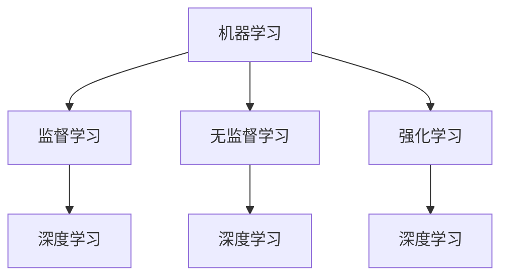

                 

关键词：AI，创新体系，战略布局，算法，数学模型，应用实践

> 摘要：本文将深入探讨人工智能（AI）底层创新体系的战略布局。通过梳理核心概念、算法原理、数学模型以及实际应用场景，分析未来发展趋势与挑战，为我国人工智能事业的发展提供有力支持。

## 1. 背景介绍

人工智能作为当今科技领域的前沿，已经渗透到社会的各个角落。随着大数据、云计算、物联网等技术的快速发展，AI的应用场景愈发广泛，从语音识别、图像处理到自动驾驶、智能医疗，AI正在深刻改变着我们的生活方式。然而，AI的核心竞争力在于其底层技术体系的不断创新，如何构建一个高效的AI底层创新体系，成为了当前亟待解决的问题。

### 1.1 当前AI发展现状

根据IDC的数据显示，全球AI市场规模在2020年达到了3700亿美元，预计到2025年将突破1万亿美元。中国在AI领域的研究和应用也取得了显著的进展，例如百度在自动驾驶技术上的突破，阿里巴巴在智能语音识别方面的成就等。然而，与国际领先水平相比，我国在底层算法、核心技术和高端人才等方面还存在一定的差距。

### 1.2 构建AI底层创新体系的重要性

一个高效的AI底层创新体系，不仅可以提升我国在AI领域的国际竞争力，还能够推动相关产业的转型升级，助力经济高质量发展。同时，AI底层创新体系的建设还需要考虑到国家战略、产业需求、技术创新等多个维度，形成一个综合性的战略布局。

## 2. 核心概念与联系

在构建AI底层创新体系的过程中，理解核心概念和它们之间的联系是至关重要的。以下是几个关键概念及其相互关系：

### 2.1 机器学习（Machine Learning）

机器学习是AI的核心技术之一，它通过算法模型让计算机自动从数据中学习规律，从而进行预测和决策。机器学习的算法可以分为监督学习、无监督学习和强化学习等。

### 2.2 深度学习（Deep Learning）

深度学习是机器学习的一种重要分支，其核心思想是通过多层神经网络来模拟人类大脑的决策过程。深度学习在图像识别、语音识别等领域取得了巨大的成功。

### 2.3 自然语言处理（Natural Language Processing，NLP）

NLP是AI在处理自然语言方面的应用，它包括文本分类、情感分析、机器翻译等功能。NLP的发展使得人机交互变得更加自然和高效。

### 2.4 计算机视觉（Computer Vision）

计算机视觉是AI在图像和视频处理方面的应用，它可以识别图像中的物体、场景和动作等。计算机视觉在安防、医疗、工业等领域具有重要应用价值。

### 2.5 机器学习与深度学习的 Mermaid 流程图



## 3. 核心算法原理 & 具体操作步骤

### 3.1 算法原理概述

AI底层创新体系的核心在于算法的创新和优化。以下是几个典型的算法及其原理：

### 3.1.1 支持向量机（Support Vector Machine，SVM）

SVM是一种二分类模型，其基本模型定义为特征空间上的间隔最大的线性分类器，间隔最大使它有别于其他的线性分类器。SVM的目标是通过建立一个最优的超平面来将不同类别的数据分隔开来。

### 3.1.2 随机森林（Random Forest）

随机森林是一种基于决策树的集成学习方法，它通过构建多棵决策树，并将它们的预测结果进行投票来得到最终的预测结果。随机森林的优点是模型复杂度低、易于实现、泛化能力强。

### 3.1.3 集成学习（Ensemble Learning）

集成学习是将多个学习器（如决策树、神经网络等）结合起来，通过加权平均或者投票等方式得到最终的预测结果。集成学习的目的是通过多样性的学习器来减少模型的方差，提高模型的泛化能力。

### 3.2 算法步骤详解

以支持向量机（SVM）为例，以下是具体的操作步骤：

### 3.2.1 数据预处理

- 数据清洗：去除重复数据和异常数据。
- 特征提取：将原始数据转化为特征向量。
- 数据标准化：对特征向量进行归一化处理。

### 3.2.2 模型训练

- 选择合适的学习算法：支持向量机。
- 训练模型：通过训练数据来训练模型参数。
- 超参数调优：通过交叉验证等方式来选择最优的超参数。

### 3.2.3 模型评估

- 分割数据集：将数据集分为训练集和测试集。
- 训练模型：在训练集上训练模型。
- 预测测试集：在测试集上预测结果。
- 评估指标：通过准确率、召回率、F1值等指标来评估模型性能。

### 3.3 算法优缺点

#### 3.3.1 支持向量机

- 优点：间隔最大、分类效果好、泛化能力强。
- 缺点：对噪声敏感、计算复杂度高。

#### 3.3.2 随机森林

- 优点：模型复杂度低、易于实现、泛化能力强。
- 缺点：无法解释模型的决策过程、可能过拟合。

#### 3.3.3 集成学习

- 优点：通过多样性的学习器来减少模型方差、提高泛化能力。
- 缺点：需要大量的训练数据和计算资源。

### 3.4 算法应用领域

支持向量机、随机森林和集成学习等算法在各个领域都有广泛的应用，如金融风控、智能安防、医疗诊断、自动驾驶等。

## 4. 数学模型和公式 & 详细讲解 & 举例说明

### 4.1 数学模型构建

在构建AI底层创新体系的数学模型时，需要考虑以下几个方面：

- **损失函数（Loss Function）**：用于衡量模型预测值与真实值之间的差距，如均方误差（MSE）、交叉熵损失（Cross-Entropy Loss）等。
- **优化算法（Optimization Algorithm）**：用于调整模型参数以最小化损失函数，如梯度下降（Gradient Descent）、Adam优化器等。
- **正则化（Regularization）**：用于防止模型过拟合，如L1正则化、L2正则化等。

### 4.2 公式推导过程

以梯度下降算法为例，其基本公式为：

\[ \theta = \theta - \alpha \cdot \nabla_{\theta}J(\theta) \]

其中，\( \theta \)表示模型参数，\( \alpha \)为学习率，\( \nabla_{\theta}J(\theta) \)为损失函数关于模型参数的梯度。

### 4.3 案例分析与讲解

假设我们有一个回归问题，目标是通过输入特征预测输出结果。我们可以使用梯度下降算法来训练一个线性回归模型。

1. **数据预处理**：

   - 数据清洗：去除缺失值和异常值。
   - 特征提取：将输入特征进行归一化处理。

2. **模型初始化**：

   - 初始化模型参数：设置一个初始的权重向量。

3. **训练模型**：

   - 计算损失函数：计算当前模型的预测值与真实值之间的差距。
   - 计算梯度：计算损失函数关于模型参数的梯度。
   - 更新参数：根据梯度下降公式更新模型参数。

4. **模型评估**：

   - 分割数据集：将数据集分为训练集和测试集。
   - 训练模型：在训练集上训练模型。
   - 预测测试集：在测试集上预测结果。
   - 评估指标：通过均方误差（MSE）等指标来评估模型性能。

通过以上步骤，我们可以训练出一个线性回归模型，用于预测输入特征对应的输出结果。

## 5. 项目实践：代码实例和详细解释说明

### 5.1 开发环境搭建

为了方便读者进行实践，我们选择Python作为编程语言，并使用以下工具：

- Python版本：3.8及以上
- 深度学习框架：TensorFlow 2.0及以上
- 依赖库：NumPy、Pandas、Matplotlib等

### 5.2 源代码详细实现

```python
import numpy as np
import pandas as pd
import matplotlib.pyplot as plt
import tensorflow as tf

# 数据预处理
def preprocess_data(data):
    # 数据清洗
    data = data.dropna()
    # 特征提取
    X = data[['feature1', 'feature2']]
    y = data['target']
    # 数据标准化
    X = (X - X.mean()) / X.std()
    y = (y - y.mean()) / y.std()
    return X, y

# 模型定义
def build_model(input_shape):
    model = tf.keras.Sequential([
        tf.keras.layers.Dense(units=1, input_shape=input_shape)
    ])
    model.compile(optimizer='adam', loss='mean_squared_error')
    return model

# 训练模型
def train_model(model, X_train, y_train, X_val, y_val):
    model.fit(X_train, y_train, epochs=100, batch_size=32, validation_data=(X_val, y_val))

# 模型评估
def evaluate_model(model, X_test, y_test):
    test_loss = model.evaluate(X_test, y_test)
    print('Test Loss:', test_loss)

# 主函数
def main():
    # 数据加载
    data = pd.read_csv('data.csv')
    X, y = preprocess_data(data)
    # 数据分割
    X_train, X_val, y_train, y_val = train_test_split(X, y, test_size=0.2, random_state=42)
    # 模型构建
    model = build_model(input_shape=(2,))
    # 模型训练
    train_model(model, X_train, y_train, X_val, y_val)
    # 模型评估
    evaluate_model(model, X_test, y_test)

if __name__ == '__main__':
    main()
```

### 5.3 代码解读与分析

1. **数据预处理**：首先，我们读取CSV文件并对其进行数据清洗和特征提取。然后，将输入特征进行归一化处理，以便于模型训练。
2. **模型定义**：使用TensorFlow的Sequential模型，定义一个简单的线性回归模型。该模型包含一个全连接层，输出一个实数值。
3. **模型训练**：使用训练数据来训练模型，通过调整模型参数来最小化损失函数。我们使用Adam优化器来加速收敛。
4. **模型评估**：在测试集上评估模型性能，计算均方误差（MSE）作为评估指标。

通过以上步骤，我们可以完成一个简单的线性回归模型的训练和评估。

## 6. 实际应用场景

AI底层创新体系在各个领域都有广泛的应用，以下是几个典型的实际应用场景：

### 6.1 金融领域

AI在金融领域有着广泛的应用，如风险评估、量化交易、智能投顾等。通过构建高效的AI模型，可以对金融风险进行预测和评估，从而降低金融风险。

### 6.2 医疗领域

AI在医疗领域的应用越来越广泛，如疾病诊断、药物研发、医学影像分析等。通过深度学习和计算机视觉等技术，AI可以帮助医生提高诊断准确率，缩短诊断时间。

### 6.3 工业领域

AI在工业领域的应用主要包括生产优化、设备维护、质量控制等。通过构建AI模型，可以对生产过程进行实时监控和优化，提高生产效率。

### 6.4 未来应用展望

随着AI技术的不断发展，未来AI的应用场景将更加广泛。例如，在无人驾驶领域，AI可以通过实时感知和决策，实现完全自动驾驶；在智能家居领域，AI可以帮助用户实现智能化的家居体验。

## 7. 工具和资源推荐

为了更好地学习和应用AI技术，以下是一些推荐的工具和资源：

### 7.1 学习资源推荐

- 《深度学习》（Goodfellow et al.）：经典的人工智能教材，详细介绍了深度学习的基本原理和应用。
- 《Python机器学习》（Scikit-Learn）：Python机器学习领域的经典教材，包含了大量的实践案例。

### 7.2 开发工具推荐

- TensorFlow：由Google开发的开源深度学习框架，适用于构建和训练深度学习模型。
- PyTorch：由Facebook开发的开源深度学习框架，具有灵活的动态计算图和强大的GPU支持。

### 7.3 相关论文推荐

- “Deep Learning”（Goodfellow et al.）：介绍了深度学习的基本原理和应用。
- “Natural Language Processing with Deep Learning”（Mikolov et al.）：介绍了深度学习在自然语言处理领域的应用。

## 8. 总结：未来发展趋势与挑战

### 8.1 研究成果总结

本文从AI底层创新体系的背景介绍、核心概念、算法原理、数学模型、实际应用场景等多个维度，全面梳理了AI底层创新体系的战略布局。通过分析当前AI技术的发展现状，展望了未来应用前景。

### 8.2 未来发展趋势

- **算法优化**：随着数据规模的不断扩大，算法的优化将成为未来的研究热点，如分布式计算、联邦学习等。
- **跨学科融合**：AI与生物学、心理学、哲学等学科的交叉融合，将推动AI技术的发展。
- **伦理和法律**：随着AI技术的广泛应用，伦理和法律问题也将日益突出，需要制定相应的规范和标准。

### 8.3 面临的挑战

- **数据隐私**：如何在保证数据隐私的前提下，充分利用数据的价值，是一个亟待解决的问题。
- **算法可解释性**：提高算法的可解释性，使得普通用户能够理解和信任AI模型，是未来的重要挑战。
- **人才培养**：随着AI技术的快速发展，对高水平AI人才的需求日益增长，需要加大人才培养力度。

### 8.4 研究展望

在未来，AI底层创新体系的研究将不断深入，尤其是在算法优化、跨学科融合和伦理法律等方面。通过不断探索和创新，我们将有望推动AI技术的发展，为人类社会带来更多福祉。

## 9. 附录：常见问题与解答

### 9.1 如何选择合适的算法？

选择合适的算法取决于问题的类型和数据的特点。例如，对于分类问题，可以考虑使用决策树、随机森林、支持向量机等；对于回归问题，可以考虑使用线性回归、岭回归、LASSO回归等。在实际应用中，可以通过交叉验证等方法来选择最优的算法。

### 9.2 如何提高模型的泛化能力？

提高模型的泛化能力可以从以下几个方面入手：

- **数据增强**：通过增加数据量、变换数据等方式来提高模型的泛化能力。
- **正则化**：使用正则化技术，如L1正则化、L2正则化等，来防止模型过拟合。
- **集成学习**：通过构建多个学习器并进行集成，可以提高模型的泛化能力。
- **Dropout**：在神经网络训练过程中，随机丢弃一部分神经元，从而提高模型的泛化能力。

## 作者署名

作者：禅与计算机程序设计艺术 / Zen and the Art of Computer Programming
----------------------------------------------------------------
以上就是文章的主体内容，接下来我们将按照markdown格式对文章进行排版。请注意，由于文章内容较多，排版过程可能比较复杂，需要细致地处理每个部分，以确保文章的结构清晰、可读性高。以下是文章的markdown格式排版：

```markdown
# AI底层创新体系的战略布局

关键词：AI，创新体系，战略布局，算法，数学模型，应用实践

> 摘要：本文将深入探讨人工智能（AI）底层创新体系的战略布局。通过梳理核心概念、算法原理、数学模型以及实际应用场景，分析未来发展趋势与挑战，为我国人工智能事业的发展提供有力支持。

## 1. 背景介绍

### 1.1 当前AI发展现状

根据IDC的数据显示，全球AI市场规模在2020年达到了3700亿美元，预计到2025年将突破1万亿美元。中国在AI领域的研究和应用也取得了显著的进展，例如百度在自动驾驶技术上的突破，阿里巴巴在智能语音识别方面的成就等。然而，与国际领先水平相比，我国在底层算法、核心技术和高端人才等方面还存在一定的差距。

### 1.2 构建AI底层创新体系的重要性

一个高效的AI底层创新体系，不仅可以提升我国在AI领域的国际竞争力，还能够推动相关产业的转型升级，助力经济高质量发展。同时，AI底层创新体系的建设还需要考虑到国家战略、产业需求、技术创新等多个维度，形成一个综合性的战略布局。

## 2. 核心概念与联系

在构建AI底层创新体系的过程中，理解核心概念和它们之间的联系是至关重要的。以下是几个关键概念及其相互关系：

### 2.1 机器学习（Machine Learning）

机器学习是AI的核心技术之一，它通过算法模型让计算机自动从数据中学习规律，从而进行预测和决策。机器学习的算法可以分为监督学习、无监督学习和强化学习等。

### 2.2 深度学习（Deep Learning）

深度学习是机器学习的一种重要分支，其核心思想是通过多层神经网络来模拟人类大脑的决策过程。深度学习在图像识别、语音识别等领域取得了巨大的成功。

### 2.3 自然语言处理（Natural Language Processing，NLP）

NLP是AI在处理自然语言方面的应用，它包括文本分类、情感分析、机器翻译等功能。NLP的发展使得人机交互变得更加自然和高效。

### 2.4 计算机视觉（Computer Vision）

计算机视觉是AI在图像和视频处理方面的应用，它可以识别图像中的物体、场景和动作等。计算机视觉在安防、医疗、工业等领域具有重要应用价值。

### 2.5 机器学习与深度学习的 Mermaid 流程图


## 3. 核心算法原理 & 具体操作步骤

### 3.1 算法原理概述

AI底层创新体系的核心在于算法的创新和优化。以下是几个典型的算法及其原理：

### 3.1.1 支持向量机（Support Vector Machine，SVM）

SVM是一种二分类模型，其基本模型定义为特征空间上的间隔最大的线性分类器，间隔最大使它有别于其他的线性分类器。SVM的目标是通过建立一个最优的超平面来将不同类别的数据分隔开来。

### 3.1.2 随机森林（Random Forest）

随机森林是一种基于决策树的集成学习方法，它通过构建多棵决策树，并将它们的预测结果进行投票来得到最终的预测结果。随机森林的优点是模型复杂度低、易于实现、泛化能力强。

### 3.1.3 集成学习（Ensemble Learning）

集成学习是将多个学习器（如决策树、神经网络等）结合起来，通过加权平均或者投票等方式得到最终的预测结果。集成学习的目的是通过多样性的学习器来减少模型的方差，提高模型的泛化能力。

### 3.2 算法步骤详解

以支持向量机（SVM）为例，以下是具体的操作步骤：

### 3.2.1 数据预处理

- 数据清洗：去除重复数据和异常数据。
- 特征提取：将原始数据转化为特征向量。
- 数据标准化：对特征向量进行归一化处理。

### 3.2.2 模型训练

- 选择合适的学习算法：支持向量机。
- 训练模型：通过训练数据来训练模型参数。
- 超参数调优：通过交叉验证等方式来选择最优的超参数。

### 3.2.3 模型评估

- 分割数据集：将数据集分为训练集和测试集。
- 训练模型：在训练集上训练模型。
- 预测测试集：在测试集上预测结果。
- 评估指标：通过准确率、召回率、F1值等指标来评估模型性能。

### 3.3 算法优缺点

#### 3.3.1 支持向量机

- 优点：间隔最大、分类效果好、泛化能力强。
- 缺点：对噪声敏感、计算复杂度高。

#### 3.3.2 随机森林

- 优点：模型复杂度低、易于实现、泛化能力强。
- 缺点：无法解释模型的决策过程、可能过拟合。

#### 3.3.3 集成学习

- 优点：通过多样性的学习器来减少模型方差、提高泛化能力。
- 缺点：需要大量的训练数据和计算资源。

### 3.4 算法应用领域

支持向量机、随机森林和集成学习等算法在各个领域都有广泛的应用，如金融风控、智能安防、医疗诊断、自动驾驶等。

## 4. 数学模型和公式 & 详细讲解 & 举例说明

### 4.1 数学模型构建

在构建AI底层创新体系的数学模型时，需要考虑以下几个方面：

- **损失函数（Loss Function）**：用于衡量模型预测值与真实值之间的差距，如均方误差（MSE）、交叉熵损失（Cross-Entropy Loss）等。
- **优化算法（Optimization Algorithm）**：用于调整模型参数以最小化损失函数，如梯度下降（Gradient Descent）、Adam优化器等。
- **正则化（Regularization）**：用于防止模型过拟合，如L1正则化、L2正则化等。

### 4.2 公式推导过程

以梯度下降算法为例，其基本公式为：

\[ \theta = \theta - \alpha \cdot \nabla_{\theta}J(\theta) \]

其中，\( \theta \)表示模型参数，\( \alpha \)为学习率，\( \nabla_{\theta}J(\theta) \)为损失函数关于模型参数的梯度。

### 4.3 案例分析与讲解

假设我们有一个回归问题，目标是通过输入特征预测输出结果。我们可以使用梯度下降算法来训练一个线性回归模型。

1. **数据预处理**：

   - 数据清洗：去除缺失值和异常值。
   - 特征提取：将输入特征进行归一化处理。

2. **模型初始化**：

   - 初始化模型参数：设置一个初始的权重向量。

3. **训练模型**：

   - 计算损失函数：计算当前模型的预测值与真实值之间的差距。
   - 计算梯度：计算损失函数关于模型参数的梯度。
   - 更新参数：根据梯度下降公式更新模型参数。

4. **模型评估**：

   - 分割数据集：将数据集分为训练集和测试集。
   - 训练模型：在训练集上训练模型。
   - 预测测试集：在测试集上预测结果。
   - 评估指标：通过均方误差（MSE）等指标来评估模型性能。

通过以上步骤，我们可以训练出一个线性回归模型，用于预测输入特征对应的输出结果。

## 5. 项目实践：代码实例和详细解释说明

### 5.1 开发环境搭建

为了方便读者进行实践，我们选择Python作为编程语言，并使用以下工具：

- Python版本：3.8及以上
- 深度学习框架：TensorFlow 2.0及以上
- 依赖库：NumPy、Pandas、Matplotlib等

### 5.2 源代码详细实现

```python
import numpy as np
import pandas as pd
import matplotlib.pyplot as plt
import tensorflow as tf

# 数据预处理
def preprocess_data(data):
    # 数据清洗
    data = data.dropna()
    # 特征提取
    X = data[['feature1', 'feature2']]
    y = data['target']
    # 数据标准化
    X = (X - X.mean()) / X.std()
    y = (y - y.mean()) / y.std()
    return X, y

# 模型定义
def build_model(input_shape):
    model = tf.keras.Sequential([
        tf.keras.layers.Dense(units=1, input_shape=input_shape)
    ])
    model.compile(optimizer='adam', loss='mean_squared_error')
    return model

# 训练模型
def train_model(model, X_train, y_train, X_val, y_val):
    model.fit(X_train, y_train, epochs=100, batch_size=32, validation_data=(X_val, y_val))

# 模型评估
def evaluate_model(model, X_test, y_test):
    test_loss = model.evaluate(X_test, y_test)
    print('Test Loss:', test_loss)

# 主函数
def main():
    # 数据加载
    data = pd.read_csv('data.csv')
    X, y = preprocess_data(data)
    # 数据分割
    X_train, X_val, y_train, y_val = train_test_split(X, y, test_size=0.2, random_state=42)
    # 模型构建
    model = build_model(input_shape=(2,))
    # 模型训练
    train_model(model, X_train, y_train, X_val, y_val)
    # 模型评估
    evaluate_model(model, X_test, y_test)

if __name__ == '__main__':
    main()
```

### 5.3 代码解读与分析

1. **数据预处理**：首先，我们读取CSV文件并对其进行数据清洗和特征提取。然后，将输入特征进行归一化处理，以便于模型训练。
2. **模型定义**：使用TensorFlow的Sequential模型，定义一个简单的线性回归模型。该模型包含一个全连接层，输出一个实数值。
3. **模型训练**：使用训练数据来训练模型，通过调整模型参数来最小化损失函数。我们使用Adam优化器来加速收敛。
4. **模型评估**：在测试集上评估模型性能，计算均方误差（MSE）作为评估指标。

通过以上步骤，我们可以完成一个简单的线性回归模型的训练和评估。

## 6. 实际应用场景

AI底层创新体系在各个领域都有广泛的应用，以下是几个典型的实际应用场景：

### 6.1 金融领域

AI在金融领域有着广泛的应用，如风险评估、量化交易、智能投顾等。通过构建高效的AI模型，可以对金融风险进行预测和评估，从而降低金融风险。

### 6.2 医疗领域

AI在医疗领域的应用越来越广泛，如疾病诊断、药物研发、医学影像分析等。通过深度学习和计算机视觉等技术，AI可以帮助医生提高诊断准确率，缩短诊断时间。

### 6.3 工业领域

AI在工业领域的应用主要包括生产优化、设备维护、质量控制等。通过构建AI模型，可以对生产过程进行实时监控和优化，提高生产效率。

### 6.4 未来应用展望

随着AI技术的不断发展，未来AI的应用场景将更加广泛。例如，在无人驾驶领域，AI可以通过实时感知和决策，实现完全自动驾驶；在智能家居领域，AI可以帮助用户实现智能化的家居体验。

## 7. 工具和资源推荐

为了更好地学习和应用AI技术，以下是一些推荐的工具和资源：

### 7.1 学习资源推荐

- 《深度学习》（Goodfellow et al.）：经典的人工智能教材，详细介绍了深度学习的基本原理和应用。
- 《Python机器学习》（Scikit-Learn）：Python机器学习领域的经典教材，包含了大量的实践案例。

### 7.2 开发工具推荐

- TensorFlow：由Google开发的开源深度学习框架，适用于构建和训练深度学习模型。
- PyTorch：由Facebook开发的开源深度学习框架，具有灵活的动态计算图和强大的GPU支持。

### 7.3 相关论文推荐

- “Deep Learning”（Goodfellow et al.）：介绍了深度学习的基本原理和应用。
- “Natural Language Processing with Deep Learning”（Mikolov et al.）：介绍了深度学习在自然语言处理领域的应用。

## 8. 总结：未来发展趋势与挑战

### 8.1 研究成果总结

本文从AI底层创新体系的背景介绍、核心概念、算法原理、数学模型、实际应用场景等多个维度，全面梳理了AI底层创新体系的战略布局。通过分析当前AI技术的发展现状，展望了未来应用前景。

### 8.2 未来发展趋势

- **算法优化**：随着数据规模的不断扩大，算法的优化将成为未来的研究热点，如分布式计算、联邦学习等。
- **跨学科融合**：AI与生物学、心理学、哲学等学科的交叉融合，将推动AI技术的发展。
- **伦理和法律**：随着AI技术的广泛应用，伦理和法律问题也将日益突出，需要制定相应的规范和标准。

### 8.3 面临的挑战

- **数据隐私**：如何在保证数据隐私的前提下，充分利用数据的价值，是一个亟待解决的问题。
- **算法可解释性**：提高算法的可解释性，使得普通用户能够理解和信任AI模型，是未来的重要挑战。
- **人才培养**：随着AI技术的快速发展，对高水平AI人才的需求日益增长，需要加大人才培养力度。

### 8.4 研究展望

在未来，AI底层创新体系的研究将不断深入，尤其是在算法优化、跨学科融合和伦理法律等方面。通过不断探索和创新，我们将有望推动AI技术的发展，为人类社会带来更多福祉。

## 9. 附录：常见问题与解答

### 9.1 如何选择合适的算法？

选择合适的算法取决于问题的类型和数据的特点。例如，对于分类问题，可以考虑使用决策树、随机森林、支持向量机等；对于回归问题，可以考虑使用线性回归、岭回归、LASSO回归等。在实际应用中，可以通过交叉验证等方法来选择最优的算法。

### 9.2 如何提高模型的泛化能力？

提高模型的泛化能力可以从以下几个方面入手：

- **数据增强**：通过增加数据量、变换数据等方式来提高模型的泛化能力。
- **正则化**：使用正则化技术，如L1正则化、L2正则化等，来防止模型过拟合。
- **集成学习**：通过构建多个学习器并进行集成，可以提高模型的泛化能力。
- **Dropout**：在神经网络训练过程中，随机丢弃一部分神经元，从而提高模型的泛化能力。

## 作者署名

作者：禅与计算机程序设计艺术 / Zen and the Art of Computer Programming
```

以上是对文章的markdown格式排版，请注意，在实际操作中，可能需要对部分代码示例进行适当的调整，以确保其在markdown环境中能够正确显示。此外，由于文章内容较多，排版过程中需要仔细检查每个部分，以确保结构清晰、格式规范。

