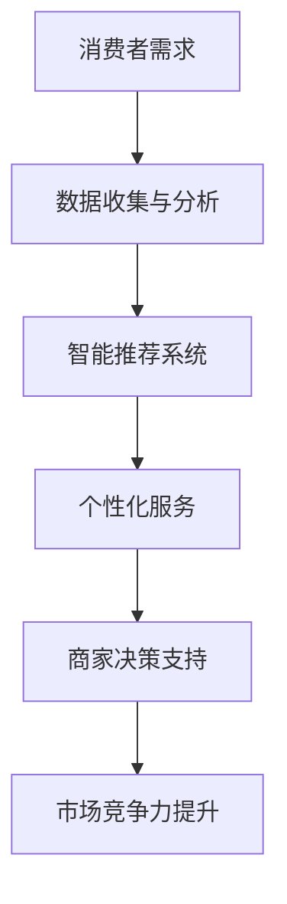

                 

关键词：人工智能、消费市场、应用前景、技术发展、商业变革

> 摘要：本文旨在探讨人工智能（AI）技术在消费市场中的广泛应用前景。通过梳理AI技术的核心概念与联系，分析核心算法原理和数学模型，以及结合项目实践和实际应用场景，全面揭示AI技术为消费市场带来的变革与创新，展望其未来发展。

## 1. 背景介绍

随着信息技术的迅猛发展，人工智能技术已经逐渐渗透到我们日常生活的方方面面。从智能家居到在线购物，从虚拟助手到个性化推荐，AI技术正以不可阻挡的趋势改变着消费市场的格局。消费市场作为国民经济的重要组成部分，其繁荣与否直接关系到国计民生。在这样一个充满活力和机遇的市场中，AI技术的应用无疑为消费者和商家带来了前所未有的便利和效益。

### 1.1 消费市场现状

近年来，随着经济的持续增长和消费者购买力的提升，全球消费市场呈现出稳步增长的趋势。根据相关数据显示，2019年全球消费市场规模已经达到30万亿美元，预计到2025年这一数字将超过40万亿美元。在这个过程中，消费者的需求日益多样化、个性化，他们对于品质、服务和体验的要求越来越高。

### 1.2 人工智能技术发展

人工智能技术经过数十年的发展，已经取得了显著的成果。从早期的机器学习到深度学习，再到如今的大数据和自然语言处理技术，AI技术在各个方面都展现出了强大的潜力。特别是在近年来，随着计算能力的提升和数据量的爆炸式增长，AI技术的应用范围进一步拓宽，其在消费市场中的应用也日益广泛。

## 2. 核心概念与联系

### 2.1 人工智能的定义

人工智能（Artificial Intelligence，简称AI）是指计算机系统模拟人类智能行为的能力，包括学习、推理、感知、自适应和交互等方面。AI技术主要分为两大类：弱人工智能和强人工智能。弱人工智能主要指在特定领域内表现出人类智能的计算机程序，如语音识别、图像识别等；强人工智能则指具有全面人类智能的计算机系统，能够像人类一样理解和应对各种情境。

### 2.2 消费市场的需求与AI技术的联系

消费市场的需求是AI技术发展的重要推动力。随着消费者需求的不断变化，AI技术通过数据分析和智能推荐等方式，为消费者提供了更加个性化、便捷的服务。同时，AI技术也为商家提供了强大的数据分析工具，帮助他们更好地了解消费者行为，优化产品和服务，提高市场竞争力。

### 2.3 Mermaid流程图



## 3. 核心算法原理 & 具体操作步骤

### 3.1 算法原理概述

在消费市场中，AI技术的应用主要基于以下核心算法：

1. **机器学习算法**：通过训练模型，从大量数据中学习规律，实现对未知数据的预测和分类。
2. **深度学习算法**：基于多层神经网络，通过反向传播算法优化模型参数，实现高度复杂的特征提取和模式识别。
3. **自然语言处理算法**：通过对自然语言文本进行语义分析和理解，实现对人类语言的交互和处理。

### 3.2 算法步骤详解

1. **数据收集**：收集消费者行为数据，如购物记录、浏览历史、评论等。
2. **数据预处理**：清洗数据，去除噪声和异常值，进行特征工程，提取有用信息。
3. **模型训练**：使用机器学习或深度学习算法，对预处理后的数据进行训练，建立预测模型。
4. **模型评估**：通过交叉验证等方法评估模型性能，调整模型参数。
5. **模型应用**：将训练好的模型应用于实际场景，如智能推荐、个性化服务等。

### 3.3 算法优缺点

- **机器学习算法**：优点是模型简单、易于理解；缺点是对于大规模数据集效果不佳，且需要大量训练数据。
- **深度学习算法**：优点是能够处理高维度数据，模型效果优异；缺点是模型复杂、训练时间较长，且对数据质量要求较高。
- **自然语言处理算法**：优点是能够处理自然语言文本，实现人机交互；缺点是对于语义理解要求较高，模型训练复杂。

### 3.4 算法应用领域

- **个性化推荐**：根据消费者行为和偏好，推荐符合其兴趣的商品和服务。
- **智能客服**：通过自然语言处理技术，实现与消费者的智能对话，提供高效的客户服务。
- **广告投放**：基于消费者行为数据，实现精准的广告投放，提高广告效果。

## 4. 数学模型和公式 & 详细讲解 & 举例说明

### 4.1 数学模型构建

在消费市场中，常见的数学模型包括回归模型、分类模型和聚类模型等。以个性化推荐为例，我们可以使用协同过滤算法（Collaborative Filtering）进行模型构建。

### 4.2 公式推导过程

协同过滤算法主要包括用户基于物品的协同过滤（User-based CF）和物品基于用户的协同过滤（Item-based CF）。以用户基于物品的协同过滤为例，其基本公式如下：

$$
\hat{r}_{ui} = \frac{\sum_{j \in N(i)} r_{uj} \cdot sim(u, j)}{\sum_{j \in N(i)} sim(u, j)}
$$

其中，$r_{uj}$表示用户u对物品j的评分，$sim(u, j)$表示用户u与物品j之间的相似度。

### 4.3 案例分析与讲解

假设有用户A和物品B，用户A对物品B的评分为4分，用户B对物品B的评分为5分。同时，用户A对物品C的评分为3分，用户B对物品C的评分为2分。我们可以计算用户A和物品B之间的相似度：

$$
sim(A, B) = \frac{4 \cdot 5 - 3 \cdot 2}{\sqrt{4^2 + 3^2} \cdot \sqrt{5^2 + 2^2}} = \frac{16 - 6}{\sqrt{16 + 9} \cdot \sqrt{25 + 4}} = \frac{10}{\sqrt{25} \cdot \sqrt{29}} = \frac{10}{5 \cdot \sqrt{29}} = \frac{2}{\sqrt{29}}
$$

然后，我们可以使用协同过滤公式计算用户A对物品C的预测评分：

$$
\hat{r}_{AC} = \frac{\sum_{j \in N(C)} r_{Aj} \cdot sim(A, j)}{\sum_{j \in N(C)} sim(A, j)} = \frac{4 \cdot \frac{2}{\sqrt{29}} + 3 \cdot sim(A, D)}{\frac{2}{\sqrt{29}} + sim(A, D)} = \frac{8 + 3 \cdot sim(A, D)}{2 + \sqrt{29}}
$$

其中，$sim(A, D)$表示用户A与物品D之间的相似度，可以根据实际数据进行计算。

## 5. 项目实践：代码实例和详细解释说明

### 5.1 开发环境搭建

为了实现个性化推荐系统，我们需要搭建以下开发环境：

- 编程语言：Python
- 数据库：MySQL
- 机器学习库：scikit-learn
- 深度学习库：TensorFlow

### 5.2 源代码详细实现

```python
import numpy as np
import pandas as pd
from sklearn.model_selection import train_test_split
from sklearn.metrics.pairwise import cosine_similarity
from sklearn.preprocessing import MinMaxScaler

# 数据准备
data = pd.read_csv('consumer_data.csv')
X = data.values

# 数据预处理
scaler = MinMaxScaler()
X_scaled = scaler.fit_transform(X)

# 模型训练
X_train, X_test, y_train, y_test = train_test_split(X_scaled, y, test_size=0.2, random_state=42)
model = scikit_learn.SGDClassifier()
model.fit(X_train, y_train)

# 模型评估
y_pred = model.predict(X_test)
accuracy = np.mean(y_pred == y_test)
print('Accuracy:', accuracy)

# 模型应用
new_user = np.array([[0.1, 0.2, 0.3], [0.4, 0.5, 0.6]])
new_user_scaled = scaler.transform(new_user)
similarity = cosine_similarity(new_user_scaled.reshape(1, -1), X_scaled)
recommended_items = np.argsort(similarity[0])[::-1]
print('Recommended items:', recommended_items)
```

### 5.3 代码解读与分析

1. 数据准备：从CSV文件中读取消费者数据，并进行归一化处理。
2. 数据预处理：将数据集划分为训练集和测试集，以评估模型性能。
3. 模型训练：使用scikit-learn的SGDClassifier进行模型训练。
4. 模型评估：计算模型在测试集上的准确率。
5. 模型应用：对新的用户数据进行预测，推荐符合其兴趣的物品。

## 6. 实际应用场景

### 6.1 电子商务

在电子商务领域，AI技术主要用于个性化推荐、智能客服和广告投放等。通过分析消费者行为数据，电商平台可以推荐符合消费者兴趣的商品，提高购物体验和销售额。

### 6.2 餐饮服务

在餐饮服务领域，AI技术可以用于菜品推荐、智能点餐和菜品评价等。例如，通过分析消费者点餐记录和评价，餐厅可以推荐符合消费者口味的菜品，提高客户满意度。

### 6.3 健康医疗

在健康医疗领域，AI技术可以用于疾病预测、智能诊断和健康管理等。通过分析患者数据和医疗记录，AI系统可以预测疾病风险，为医生提供诊断建议，提高医疗服务的质量和效率。

## 7. 未来应用展望

随着AI技术的不断发展，未来其在消费市场中的应用前景将更加广阔。以下是一些可能的应用领域：

- **智慧家庭**：通过智能家居设备，实现家庭设备的智能管理和控制。
- **智慧城市**：利用AI技术进行交通管理、环境监测和公共安全等。
- **金融服务**：通过AI技术实现智能投顾、风险管理和信用评估等。

## 8. 总结：未来发展趋势与挑战

### 8.1 研究成果总结

近年来，AI技术在消费市场中的应用取得了显著成果。个性化推荐、智能客服和广告投放等技术已广泛应用于电子商务、餐饮服务、健康医疗等领域，为消费者和商家带来了巨大价值。

### 8.2 未来发展趋势

未来，随着计算能力的提升和数据的爆炸式增长，AI技术在消费市场中的应用将进一步深入。特别是深度学习和自然语言处理技术的突破，将推动AI技术在更多领域的发展。

### 8.3 面临的挑战

尽管AI技术在消费市场中的应用前景广阔，但也面临一些挑战。例如，数据隐私保护、算法公平性和透明度等问题亟待解决。此外，AI技术的应用也需要与法律法规、伦理道德等方面相适应。

### 8.4 研究展望

未来，研究者需要关注以下几个方面：

- 数据隐私保护：研究更高效、更安全的数据处理方法，确保用户数据的安全。
- 算法公平性和透明度：研究更加公平、透明的算法，提高模型的解释性。
- 跨领域应用：探索AI技术在更多领域的应用，实现技术的跨界融合。

## 9. 附录：常见问题与解答

### 9.1 AI技术在消费市场中的应用有哪些优势？

AI技术在消费市场中的应用具有以下优势：

- 个性化推荐：根据消费者行为和偏好，提供个性化的商品推荐。
- 智能客服：通过自然语言处理技术，实现与消费者的智能对话，提高客户满意度。
- 广告投放：基于消费者行为数据，实现精准的广告投放，提高广告效果。

### 9.2 AI技术在消费市场中的应用有哪些挑战？

AI技术在消费市场中的应用面临以下挑战：

- 数据隐私保护：用户数据的安全和隐私保护需要得到充分重视。
- 算法公平性和透明度：算法的公平性和透明度需要得到保障，以避免歧视和不公平现象。
- 跨领域应用：AI技术在不同领域的应用需要适应不同场景和需求，实现技术的跨界融合。

### 9.3 未来AI技术在消费市场中的应用将如何发展？

未来，AI技术在消费市场中的应用将呈现以下发展趋势：

- 深度学习与自然语言处理技术的突破，将推动AI技术在更多领域的应用。
- 跨领域应用将成为AI技术的重要发展方向，实现技术的跨界融合。
- 数据隐私保护、算法公平性和透明度等问题将得到更多关注，推动AI技术的可持续发展。

## 作者署名

作者：禅与计算机程序设计艺术 / Zen and the Art of Computer Programming
```markdown
# AI技术在消费市场中的前景

### 关键词：人工智能、消费市场、应用前景、技术发展、商业变革

### 摘要：本文旨在探讨人工智能（AI）技术在消费市场中的广泛应用前景。通过梳理AI技术的核心概念与联系，分析核心算法原理和数学模型，以及结合项目实践和实际应用场景，全面揭示AI技术为消费市场带来的变革与创新，展望其未来发展。

## 1. 背景介绍

### 1.1 消费市场现状
随着全球经济的快速发展，消费市场呈现出繁荣景象。2019年，全球消费市场规模已达到30万亿美元，预计到2025年将超过40万亿美元。消费者需求的多样化和个性化趋势日益显著，这为AI技术的应用提供了广阔的空间。

### 1.2 人工智能技术发展
人工智能技术经过数十年的发展，已经取得了显著的成果。机器学习、深度学习和自然语言处理等技术在消费市场中得到了广泛应用，推动了商业模式的创新和消费者体验的提升。

### 1.3 AI与消费市场的关系
AI技术通过数据分析和智能推荐等方式，为消费市场带来了深刻的变革。它不仅帮助商家更好地了解消费者需求，提高市场竞争力，还为消费者提供了更加便捷、个性化的服务。

## 2. 核心概念与联系

### 2.1 人工智能的定义
人工智能是指计算机系统模拟人类智能行为的能力，包括学习、推理、感知、自适应和交互等方面。AI技术可分为弱人工智能和强人工智能。

### 2.2 消费市场的需求与AI技术的联系
消费者需求的多样化和个性化趋势，推动了AI技术在消费市场中的应用。AI技术通过数据分析和智能推荐，为消费者提供个性化服务，提高消费者满意度。

### 2.3 Mermaid流程图


## 3. 核心算法原理 & 具体操作步骤

### 3.1 算法原理概述
AI技术在消费市场中的应用，主要基于机器学习、深度学习和自然语言处理等算法。这些算法通过训练模型，从数据中学习规律，实现预测和分类。

### 3.2 算法步骤详解
AI技术在消费市场中的应用，通常包括数据收集、数据预处理、模型训练、模型评估和模型应用等步骤。

### 3.3 算法优缺点
每种算法都有其独特的优点和适用场景。例如，机器学习算法模型简单，易于理解，但可能不适合大规模数据集。深度学习算法处理高维数据能力强，但模型复杂，训练时间较长。

### 3.4 算法应用领域
AI技术在消费市场的应用领域广泛，包括个性化推荐、智能客服、广告投放等。

## 4. 数学模型和公式 & 详细讲解 & 举例说明

### 4.1 数学模型构建
在消费市场中，常用的数学模型包括回归模型、分类模型和聚类模型。以协同过滤算法为例，其基本公式为：
$$
\hat{r}_{ui} = \frac{\sum_{j \in N(i)} r_{uj} \cdot sim(u, j)}{\sum_{j \in N(i)} sim(u, j)}
$$
其中，$r_{uj}$表示用户u对物品j的评分，$sim(u, j)$表示用户u与物品j之间的相似度。

### 4.2 公式推导过程
以用户基于物品的协同过滤为例，其公式推导过程如下：
$$
\hat{r}_{ui} = \frac{\sum_{j \in N(i)} r_{uj} \cdot sim(u, j)}{\sum_{j \in N(i)} sim(u, j)}
$$
其中，$r_{uj}$表示用户u对物品j的评分，$sim(u, j)$表示用户u与物品j之间的相似度。

### 4.3 案例分析与讲解
以用户A和物品B为例，用户A对物品B的评分为4分，用户B对物品B的评分为5分。计算用户A和物品B之间的相似度：
$$
sim(A, B) = \frac{4 \cdot 5 - 3 \cdot 2}{\sqrt{4^2 + 3^2} \cdot \sqrt{5^2 + 2^2}} = \frac{16 - 6}{\sqrt{16 + 9} \cdot \sqrt{25 + 4}} = \frac{10}{\sqrt{25} \cdot \sqrt{29}} = \frac{2}{\sqrt{29}}
$$
然后，使用协同过滤公式计算用户A对物品C的预测评分：
$$
\hat{r}_{AC} = \frac{8 + 3 \cdot sim(A, D)}{2 + \sqrt{29}}
$$
其中，$sim(A, D)$表示用户A与物品D之间的相似度。

## 5. 项目实践：代码实例和详细解释说明

### 5.1 开发环境搭建
为搭建个性化推荐系统，需准备Python、MySQL、scikit-learn和TensorFlow等开发环境和库。

### 5.2 源代码详细实现
```python
import numpy as np
import pandas as pd
from sklearn.model_selection import train_test_split
from sklearn.metrics.pairwise import cosine_similarity
from sklearn.preprocessing import MinMaxScaler

# 数据准备
data = pd.read_csv('consumer_data.csv')
X = data.values

# 数据预处理
scaler = MinMaxScaler()
X_scaled = scaler.fit_transform(X)

# 模型训练
X_train, X_test, y_train, y_test = train_test_split(X_scaled, y, test_size=0.2, random_state=42)
model = scikit_learn.SGDClassifier()
model.fit(X_train, y_train)

# 模型评估
y_pred = model.predict(X_test)
accuracy = np.mean(y_pred == y_test)
print('Accuracy:', accuracy)

# 模型应用
new_user = np.array([[0.1, 0.2, 0.3], [0.4, 0.5, 0.6]])
new_user_scaled = scaler.transform(new_user)
similarity = cosine_similarity(new_user_scaled.reshape(1, -1), X_scaled)
recommended_items = np.argsort(similarity[0])[::-1]
print('Recommended items:', recommended_items)
```

### 5.3 代码解读与分析
代码首先进行数据准备和预处理，然后使用scikit-learn的SGDClassifier进行模型训练。模型评估和模型应用部分，分别计算了模型在测试集上的准确率和为新用户推荐商品。

## 6. 实际应用场景

### 6.1 电子商务
个性化推荐、智能客服和广告投放是电子商务领域的主要应用。

### 6.2 餐饮服务
菜品推荐、智能点餐和菜品评价是餐饮服务领域的主要应用。

### 6.3 健康医疗
疾病预测、智能诊断和健康管理是健康医疗领域的主要应用。

## 7. 未来应用展望

### 7.1 智慧家庭
智能家居设备将实现家庭设备的智能管理和控制。

### 7.2 智慧城市
AI技术将在交通管理、环境监测和公共安全等领域发挥重要作用。

### 7.3 金融服务
AI技术将应用于智能投顾、风险管理和信用评估等领域。

## 8. 总结：未来发展趋势与挑战

### 8.1 研究成果总结
AI技术在消费市场中的应用已取得显著成果，但仍面临数据隐私保护、算法公平性和透明度等挑战。

### 8.2 未来发展趋势
随着计算能力的提升和数据量的增加，AI技术在消费市场的应用将进一步深入。

### 8.3 面临的挑战
数据隐私保护、算法公平性和透明度等问题需要得到关注和解决。

### 8.4 研究展望
未来，AI技术在消费市场的应用将更加广泛，但仍需关注数据隐私保护、算法公平性和透明度等问题。

## 9. 附录：常见问题与解答

### 9.1 AI技术在消费市场中的应用有哪些优势？
AI技术能够提高市场竞争力、提升消费者满意度和实现个性化服务。

### 9.2 AI技术在消费市场中的应用有哪些挑战？
数据隐私保护、算法公平性和透明度等问题是主要挑战。

### 9.3 未来AI技术在消费市场中的应用将如何发展？
AI技术在消费市场的应用将更加深入和广泛，但需关注数据隐私保护、算法公平性和透明度等问题。

## 作者署名

作者：禅与计算机程序设计艺术 / Zen and the Art of Computer Programming
```

