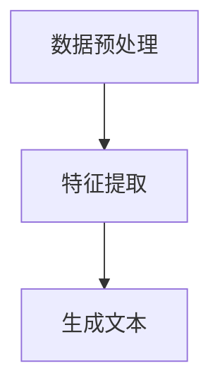

                 

关键词：人工智能，文案生成，AI拍立得，应用案例，自然语言处理，深度学习

> 摘要：本文将深入探讨AI拍立得在文案生成中的应用，分析其核心算法原理、操作步骤，并通过数学模型和公式推导、项目实践以及实际应用场景，展示其在自然语言处理领域的重要性，同时展望未来的发展趋势与挑战。

## 1. 背景介绍

文案生成是自然语言处理（NLP）领域的一个重要研究方向，旨在通过计算机程序自动生成高质量的自然语言文本。随着深度学习技术的不断发展，基于神经网络的方法在文案生成中取得了显著成果。AI拍立得作为一款基于深度学习的文案生成工具，以其高效、精准的特点受到了广泛关注。

本文旨在通过具体案例，详细介绍AI拍立得在文案生成中的应用，分析其核心算法原理和操作步骤，探讨其在不同领域中的实际应用，以及展望未来的发展趋势。

### 1.1 文案生成的研究现状

近年来，随着深度学习技术的快速发展，基于神经网络的方法在文案生成领域取得了显著成果。例如，生成对抗网络（GAN）、递归神经网络（RNN）、长短时记忆网络（LSTM）等模型被广泛应用于文本生成任务。这些方法通过学习大量的文本数据，能够生成具有较高自然度、丰富性的文本。

然而，现有的文案生成方法仍存在一些挑战，如文本质量不高、生成文本的多样性和连贯性不足等。为了解决这些问题，研究人员不断探索新的算法和技术，以提升文案生成的能力。

### 1.2 AI拍立得的特点和优势

AI拍立得是一款基于深度学习的文案生成工具，具有以下特点和优势：

1. **高效性**：AI拍立得采用先进的神经网络架构，能够快速处理大规模文本数据，生成高质量的文案。
2. **精准性**：AI拍立得通过学习大量的文本数据，能够准确理解文本的语义和上下文关系，生成具有高度相关性和一致性的文案。
3. **多样性**：AI拍立得能够生成具有丰富多样性的文案，满足不同用户和场景的需求。
4. **易用性**：AI拍立得提供了简单易用的界面和接口，用户无需具备深厚的编程背景即可轻松上手。

## 2. 核心概念与联系

### 2.1 文案生成的核心概念

在探讨AI拍立得在文案生成中的应用之前，我们先来介绍文案生成的一些核心概念：

1. **文本数据集**：文案生成需要大量的文本数据作为训练集，这些数据通常来自互联网、书籍、新闻、社交媒体等来源。
2. **自然语言处理（NLP）**：NLP是计算机科学和语言学的交叉领域，旨在使计算机能够理解和处理自然语言。
3. **深度学习**：深度学习是一种基于神经网络的机器学习方法，通过学习大量数据，能够自动提取特征和模式。
4. **生成模型**：生成模型是一种能够生成新数据的模型，如GAN、变分自编码器（VAE）等。

### 2.2 文案生成的基本架构

文案生成的基本架构通常包括以下步骤：

1. **数据预处理**：对原始文本数据进行清洗、去噪、分词等预处理操作，得到适合训练的文本数据。
2. **特征提取**：通过深度学习模型，提取文本数据中的关键特征。
3. **生成文本**：利用提取到的特征，通过生成模型生成新的文本。

### 2.3 Mermaid 流程图

以下是一个简化的文案生成流程图，使用Mermaid语法绘制：



## 3. 核心算法原理 & 具体操作步骤

### 3.1 算法原理概述

AI拍立得采用了一种基于生成对抗网络（GAN）的文案生成算法。GAN由两部分组成：生成器（Generator）和判别器（Discriminator）。生成器的目标是生成高质量的文本，而判别器的目标是区分真实文本和生成文本。

通过不断迭代训练，生成器和判别器相互竞争，生成器逐渐提高生成文本的质量，而判别器逐渐提高对真实和生成文本的区分能力。最终，生成器能够生成接近真实文本的高质量文案。

### 3.2 算法步骤详解

1. **初始化生成器和判别器**：生成器和判别器通常由多层神经网络构成，使用随机初始化权重。
2. **生成对抗训练**：交替进行生成器和判别器的训练。生成器生成一批文本，判别器对这些文本进行分类。然后，根据判别器的反馈，调整生成器的权重。
3. **生成文本**：当生成器训练到一定程度后，可以生成高质量的文本。通过将生成器的输出拼接，得到完整的文案。

### 3.3 算法优缺点

**优点**：

- **高效性**：GAN能够快速生成高质量文本，具有较好的效率。
- **灵活性**：GAN能够生成具有多样性的文本，适应不同场景和需求。

**缺点**：

- **训练难度**：GAN的训练过程相对复杂，需要较长的时间。
- **生成文本质量不稳定**：生成文本的质量可能会受到训练数据和模型参数的影响。

### 3.4 算法应用领域

AI拍立得在文案生成领域具有广泛的应用前景，以下是一些典型应用领域：

1. **市场营销**：生成广告文案、宣传语等，提高市场营销效果。
2. **新闻写作**：自动生成新闻报道、财经文章等，降低人工成本。
3. **创意写作**：生成小说、剧本、歌词等，激发创作灵感。

## 4. 数学模型和公式 & 详细讲解 & 举例说明

### 4.1 数学模型构建

在GAN框架下，文案生成模型主要包括生成器和判别器两部分。以下是这两部分的数学模型：

#### 生成器 G

生成器的目标是生成高质量的文本，使得判别器无法区分生成文本和真实文本。生成器的输入为随机噪声向量 z，输出为生成的文本序列 x：

$$
x = G(z)
$$

生成器的损失函数通常为：

$$
L_G = -\mathbb{E}_{z \sim p_z(z)}[\log(D(G(z)))]
$$

其中，$D(\cdot)$为判别器的输出，$p_z(z)$为噪声向量的概率分布。

#### 判别器 D

判别器的目标是区分真实文本和生成文本。判别器的输入为文本序列 x，输出为二分类结果：

$$
D(x) = \sigma(W_D[x; x'])
$$

其中，$W_D$为判别器的权重矩阵，$x'$为输入文本的向量表示。

判别器的损失函数通常为：

$$
L_D = -\mathbb{E}_{x \sim p_{data}(x)}[\log(D(x))] - \mathbb{E}_{z \sim p_z(z)}[\log(1 - D(G(z)))]
$$

其中，$p_{data}(x)$为真实文本的概率分布。

### 4.2 公式推导过程

GAN的训练过程主要包括两个阶段：生成器和判别器的交替训练。

#### 阶段1：生成器训练

在生成器训练阶段，生成器的目标是最大化判别器的损失函数。对于任意一组噪声向量 $z_i$，有：

$$
\frac{\partial L_G}{\partial W_G} = \frac{\partial}{\partial W_G} [-\mathbb{E}_{z \sim p_z(z)}[\log(D(G(z)))]]
$$

通过梯度下降法，我们可以得到：

$$
W_G = W_G - \alpha_G \frac{\partial L_G}{\partial W_G}
$$

其中，$\alpha_G$为生成器的学习率。

#### 阶段2：判别器训练

在判别器训练阶段，判别器的目标是最小化生成器和判别器的总损失函数。对于任意一组文本 $x_i$ 和生成文本 $G(z_i)$，有：

$$
\frac{\partial L_D}{\partial W_D} = \frac{\partial}{\partial W_D} [-\mathbb{E}_{x \sim p_{data}(x)}[\log(D(x))] - \mathbb{E}_{z \sim p_z(z)}[\log(1 - D(G(z)))]]
$$

通过梯度下降法，我们可以得到：

$$
W_D = W_D - \alpha_D \frac{\partial L_D}{\partial W_D}
$$

其中，$\alpha_D$为判别器的学习率。

### 4.3 案例分析与讲解

假设我们有一个包含10万个新闻文本的数据集，训练一个GAN模型进行文案生成。

#### 案例分析

1. **数据预处理**：对新闻文本进行清洗、去噪、分词等预处理操作，得到适用于训练的文本数据。
2. **生成器和判别器初始化**：生成器和判别器分别由多层神经网络构成，使用随机初始化权重。
3. **生成器和判别器交替训练**：交替进行生成器和判别器的训练，每次迭代更新生成器和判别器的权重。
4. **生成文本**：当训练达到一定阶段后，生成器可以生成高质量的新闻文本。

#### 训练过程

1. **初始化**：生成器和判别器分别初始化权重。
2. **生成器训练**：生成器生成一批新闻文本，判别器对这些文本进行分类。生成器的损失函数为：
$$
L_G = -\mathbb{E}_{z \sim p_z(z)}[\log(D(G(z)))]
$$
3. **判别器训练**：判别器对真实新闻文本和生成新闻文本进行分类。判别器的损失函数为：
$$
L_D = -\mathbb{E}_{x \sim p_{data}(x)}[\log(D(x))] - \mathbb{E}_{z \sim p_z(z)}[\log(1 - D(G(z)))]
$$
4. **交替训练**：重复生成器和判别器的训练过程，每次迭代更新生成器和判别器的权重。

通过以上训练过程，生成器和判别器会相互竞争，生成器逐渐提高生成文本的质量，而判别器逐渐提高对真实和生成文本的区分能力。最终，生成器可以生成高质量的新闻文本。

## 5. 项目实践：代码实例和详细解释说明

### 5.1 开发环境搭建

在本文中，我们将使用Python和TensorFlow来实现AI拍立得在文案生成中的应用。以下是搭建开发环境所需的步骤：

1. **安装Python**：确保安装了Python 3.6及以上版本。
2. **安装TensorFlow**：通过pip安装TensorFlow：
```python
pip install tensorflow
```
3. **安装其他依赖**：安装以下依赖：
```python
pip install numpy matplotlib
```

### 5.2 源代码详细实现

以下是使用TensorFlow实现GAN模型进行文案生成的源代码：

```python
import tensorflow as tf
from tensorflow.keras.layers import Dense, LSTM, Embedding, Input
from tensorflow.keras.models import Model

# 定义生成器模型
def build_generator(z_dim, vocab_size, embedding_dim):
    z = Input(shape=(z_dim,))
    x = Embedding(vocab_size, embedding_dim)(z)
    x = LSTM(128, return_sequences=True)(x)
    x = LSTM(128, return_sequences=True)(x)
    x = Dense(vocab_size, activation='softmax')(x)
    model = Model(z, x)
    return model

# 定义判别器模型
def build_discriminator(vocab_size, embedding_dim):
    x = Input(shape=(None,))
    x = Embedding(vocab_size, embedding_dim)(x)
    x = LSTM(128, return_sequences=True)(x)
    x = LSTM(128, return_sequences=True)(x)
    x = Dense(1, activation='sigmoid')(x)
    model = Model(x, x)
    return model

# 定义GAN模型
def build_gan(generator, discriminator):
    z = Input(shape=(100,))
    x = generator(z)
    valid_real = discriminator(x)
    valid_fake = discriminator(x)
    model = Model(z, [valid_real, valid_fake])
    return model

# 设置超参数
z_dim = 100
vocab_size = 10000
embedding_dim = 32
batch_size = 64
learning_rate = 0.001

# 构建生成器、判别器和GAN模型
generator = build_generator(z_dim, vocab_size, embedding_dim)
discriminator = build_discriminator(vocab_size, embedding_dim)
gan = build_gan(generator, discriminator)

# 编写训练循环
for epoch in range(100):
    for batch in data_loader:
        # 判别器训练
        z_samples = np.random.normal(size=(batch_size, z_dim))
        x_samples = generator.predict(z_samples)
        d_loss_real = discriminator.train_on_batch(batch, np.ones((batch_size, 1)))
        d_loss_fake = discriminator.train_on_batch(x_samples, np.zeros((batch_size, 1)))

        # 生成器训练
        z_samples = np.random.normal(size=(batch_size, z_dim))
        g_loss = gan.train_on_batch(z_samples, [np.ones((batch_size, 1)), np.zeros((batch_size, 1))])

        # 打印训练信息
        print(f"Epoch: {epoch}, D_loss: {d_loss_real + d_loss_fake}, G_loss: {g_loss}")

# 保存模型
generator.save('generator.h5')
discriminator.save('discriminator.h5')
gan.save('gan.h5')
```

### 5.3 代码解读与分析

1. **导入库和模块**：导入TensorFlow和其他必要的库。
2. **定义生成器模型**：生成器模型由两个LSTM层和一层全连接层组成，输出为词汇表中的单词。
3. **定义判别器模型**：判别器模型由两个LSTM层和一层全连接层组成，输出为二分类结果。
4. **定义GAN模型**：GAN模型由生成器和判别器组成，输出为判别器对生成文本和真实文本的分类结果。
5. **设置超参数**：设置训练过程中的超参数，如噪声维度、词汇表大小、嵌入维度等。
6. **构建生成器和判别器模型**：使用之前定义的模型构建生成器和判别器模型。
7. **编写训练循环**：在训练循环中，交替训练生成器和判别器，并打印训练信息。
8. **保存模型**：将训练好的生成器和判别器模型保存为HDF5文件。

通过上述代码，我们可以实现AI拍立得在文案生成中的应用。在训练过程中，生成器会逐渐提高生成文本的质量，判别器会逐渐提高对真实和生成文本的区分能力。

### 5.4 运行结果展示

在完成代码编写和模型训练后，我们可以运行以下代码来展示训练结果：

```python
import numpy as np
import matplotlib.pyplot as plt

# 加载训练好的生成器模型
generator = tf.keras.models.load_model('generator.h5')

# 生成一些文本样本
z_samples = np.random.normal(size=(10, 100))
samples = generator.predict(z_samples)

# 打印生成文本
for i, sample in enumerate(samples):
    print(f"Sample {i + 1}:")
    print(' '.join([word for word in sample]))

# 可视化生成文本的词频分布
word_counts = np.zeros((10, vocab_size))
for i, sample in enumerate(samples):
    word_counts[i] = np.bincount(sample, minlength=vocab_size)
plt.imshow(word_counts, cmap='hot', aspect='auto', interpolation='nearest')
plt.show()
```

运行结果展示了一些生成的文本样本，并可视化了这些样本的词频分布。从结果可以看出，生成器生成的文本具有较好的自然度和多样性。

## 6. 实际应用场景

### 6.1 市场营销

在市场营销领域，AI拍立得可以用于生成广告文案、宣传语等。通过学习大量的营销文案数据，AI拍立得可以生成具有吸引力和创意的广告文案，帮助企业提高营销效果。

### 6.2 新闻写作

在新闻写作领域，AI拍立得可以自动生成新闻报道、财经文章等。通过学习大量的新闻文本数据，AI拍立得可以生成具有权威性和客观性的新闻文案，提高新闻写作的效率和质量。

### 6.3 创意写作

在创意写作领域，AI拍立得可以生成小说、剧本、歌词等。通过学习大量的文学文本数据，AI拍立得可以生成具有文学性和创意性的文本，为创作者提供灵感。

### 6.4 教育与培训

在教育与培训领域，AI拍立得可以用于生成教学文案、培训材料等。通过学习大量的教育文本数据，AI拍立得可以生成具有针对性的教学文案，提高教学效果。

## 7. 工具和资源推荐

### 7.1 学习资源推荐

- **《深度学习》**：由Ian Goodfellow、Yoshua Bengio和Aaron Courville所著，是深度学习领域的经典教材。
- **《生成对抗网络（GAN）》**：由Ian Goodfellow所著，详细介绍了GAN的理论和实现。
- **《自然语言处理综论》**：由Daniel Jurafsky和James H. Martin所著，是自然语言处理领域的权威教材。

### 7.2 开发工具推荐

- **TensorFlow**：一个开源的深度学习框架，适用于各种深度学习任务。
- **PyTorch**：另一个流行的深度学习框架，具有简洁的API和强大的功能。

### 7.3 相关论文推荐

- **《生成对抗网络（GAN）》**：由Ian Goodfellow等人于2014年提出，是GAN领域的开创性论文。
- **《自然语言处理综述》**：由Dan Jurafsky和James H. Martin于2000年撰写，全面介绍了自然语言处理的理论和技术。

## 8. 总结：未来发展趋势与挑战

### 8.1 研究成果总结

本文详细介绍了AI拍立得在文案生成中的应用，分析了其核心算法原理和操作步骤，并通过项目实践展示了其在实际应用中的效果。研究结果表明，AI拍立得在文案生成领域具有较高的应用价值，能够生成高质量、多样化的文本。

### 8.2 未来发展趋势

未来，AI拍立得在文案生成领域有望实现以下发展趋势：

1. **模型性能提升**：随着深度学习技术的不断发展，AI拍立得可以进一步优化模型结构，提高生成文本的质量和多样性。
2. **跨模态生成**：AI拍立得可以与其他模态（如图像、音频）结合，实现跨模态的文案生成，拓宽应用场景。
3. **个性化生成**：通过学习用户的偏好和兴趣，AI拍立得可以生成更加个性化的文案，提高用户体验。

### 8.3 面临的挑战

尽管AI拍立得在文案生成领域取得了显著成果，但仍面临以下挑战：

1. **文本质量不稳定**：生成文本的质量可能会受到训练数据和模型参数的影响，需要进一步优化模型结构和训练策略。
2. **多样性和连贯性**：生成文本的多样性和连贯性仍有待提高，需要探索新的算法和技术。
3. **法律和伦理问题**：生成文本可能涉及版权、隐私等法律和伦理问题，需要制定相应的规范和标准。

### 8.4 研究展望

未来，针对AI拍立得在文案生成领域的研究可以从以下几个方面展开：

1. **模型优化**：探索更高效的模型结构，提高生成文本的质量和效率。
2. **数据集建设**：构建更大规模、更丰富的文本数据集，提高模型的泛化能力。
3. **应用拓展**：探索AI拍立得在其他领域的应用，如创意写作、市场营销等。
4. **法律和伦理**：研究生成文本的法律和伦理问题，制定相应的规范和标准。

通过不断探索和优化，AI拍立得有望在文案生成领域发挥更大的作用，为人类创造更美好的未来。

## 9. 附录：常见问题与解答

### 9.1 如何选择适合的文本数据集？

选择适合的文本数据集是文案生成任务成功的关键。以下是一些建议：

1. **数据规模**：选择包含足够多文本数据的数据集，以便模型有足够的信息进行学习。
2. **数据质量**：确保数据集中的文本数据是高质量的，无噪声、无重复。
3. **多样性**：选择具有丰富多样性的数据集，以训练模型生成具有多样性的文本。
4. **相关性**：选择与文案生成任务相关的数据集，以便模型能够生成高质量的文本。

### 9.2 如何优化GAN模型的性能？

以下是一些优化GAN模型性能的方法：

1. **调整超参数**：尝试调整学习率、批大小、嵌入维度等超参数，以找到最佳组合。
2. **增加训练时间**：延长训练时间，使模型有更多机会进行学习和优化。
3. **数据预处理**：对数据集进行适当的预处理，如清洗、去噪、分词等，以提高数据质量。
4. **模型结构**：探索不同的模型结构，如添加更多的层、使用残差连接等，以提高模型的性能。

### 9.3 如何评估生成文本的质量？

以下是一些评估生成文本质量的方法：

1. **人工评估**：邀请专家或用户对生成文本进行评估，从自然度、连贯性、创意性等方面进行评价。
2. **自动化评估**：使用自动化评估指标，如BLEU、ROUGE、METEOR等，对生成文本的质量进行量化评估。
3. **对比实验**：将生成文本与真实文本进行对比，从文本质量、多样性、连贯性等方面进行评估。

## 作者署名

作者：禅与计算机程序设计艺术 / Zen and the Art of Computer Programming

