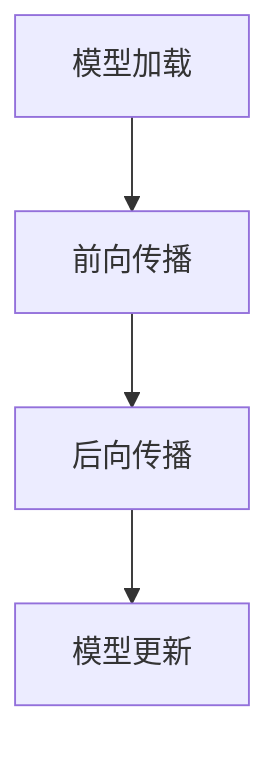
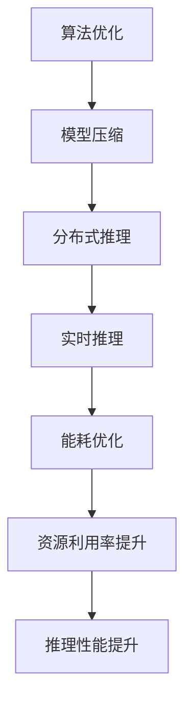

                 

关键词：AI推理、性能优化、算法改进、资源利用、模型压缩、分布式推理、实时推理、可扩展性、能耗优化。

> 摘要：本文旨在深入探讨AI推理性能优化的关键技术路径，包括算法改进、资源利用、模型压缩、分布式推理、实时推理和能耗优化等。通过对这些技术的详细分析和案例研究，本文将帮助读者理解如何提升AI系统的推理性能，以满足日益增长的应用需求。

## 1. 背景介绍

随着人工智能技术的快速发展，AI推理性能优化已经成为当前研究与应用的关键问题。无论是在云端还是边缘设备上，AI推理的性能直接影响着用户体验、系统响应速度以及整体效率。性能优化的目标在于提高推理速度，降低延迟，减少资源消耗，同时保证推理结果的准确性和稳定性。

近年来，随着深度学习算法的广泛应用，AI推理的性能优化受到了越来越多的关注。然而，随着AI应用场景的多样化，传统的优化方法已难以满足新的需求。因此，研究者们不断探索新的优化技术，以应对复杂多变的应用场景。

### 1.1 AI推理性能的重要性

AI推理性能的重要性体现在以下几个方面：

1. **用户体验**：在智能手机、智能家居等消费电子产品中，AI推理性能直接影响用户体验。例如，语音识别、图像识别等应用，需要实时响应用户的需求，否则会降低用户满意度。

2. **生产效率**：在工业制造、自动驾驶等场景中，AI推理性能的优化可以提高生产效率，降低成本。例如，自动驾驶汽车需要在短时间内进行复杂的推理计算，以确保行车安全。

3. **资源利用**：在资源有限的边缘设备上，优化AI推理性能可以延长电池寿命，提高设备的运行效率。

### 1.2 当前AI推理面临的挑战

当前AI推理主要面临以下挑战：

1. **计算资源限制**：随着AI模型的复杂度增加，对计算资源的需求也在不断提升。如何在高性能计算资源有限的条件下，优化推理性能，成为一大难题。

2. **实时性需求**：许多应用场景要求AI系统具备实时推理能力，例如自动驾驶、实时视频分析等。这对系统的响应速度提出了极高的要求。

3. **能耗优化**：在边缘设备上，能耗优化是AI推理性能优化的重要目标。如何减少AI推理过程中的能耗，是当前研究的热点问题。

## 2. 核心概念与联系

### 2.1 AI推理流程

AI推理流程主要包括模型加载、前向传播、后向传播和模型更新等步骤。以下是一个简单的Mermaid流程图，展示了AI推理的基本流程：



### 2.2 性能优化关键指标

在AI推理性能优化过程中，以下几个指标尤为重要：

1. **推理速度（Throughput）**：单位时间内系统能处理的推理请求数量。
2. **延迟（Latency）**：从接收推理请求到返回结果所需的时间。
3. **资源利用率（Resource Utilization）**：系统使用的计算资源与总计算资源的比例。
4. **能耗（Energy Consumption）**：系统在推理过程中消耗的能源。

### 2.3 性能优化与资源利用的关系

性能优化与资源利用密切相关。通过优化算法、模型压缩、分布式推理等技术，可以有效地提高资源利用率，从而提升推理性能。以下是一个展示性能优化与资源利用关系的Mermaid流程图：



## 3. 核心算法原理 & 具体操作步骤

### 3.1 算法原理概述

AI推理性能优化主要涉及以下几个核心算法：

1. **模型压缩**：通过减少模型参数数量，降低模型的计算复杂度，从而提高推理速度。
2. **分布式推理**：将推理任务分布在多个计算节点上，提高系统吞吐量和响应速度。
3. **实时推理**：通过优化算法和数据流，实现实时推理，满足高延迟场景需求。
4. **能耗优化**：通过降低能耗，延长设备使用寿命。

### 3.2 算法步骤详解

#### 3.2.1 模型压缩

模型压缩主要包括以下步骤：

1. **量化**：将模型中的浮点数参数转换为整数，降低模型存储和计算的需求。
2. **剪枝**：去除模型中不重要的连接和神经元，减少模型的计算复杂度。
3. **知识蒸馏**：使用一个较大的模型（教师模型）训练一个较小的模型（学生模型），保留重要特征。

#### 3.2.2 分布式推理

分布式推理主要包括以下步骤：

1. **任务划分**：将推理任务划分为多个子任务，分配给不同的计算节点。
2. **通信优化**：通过优化通信协议和数据传输，减少节点之间的通信开销。
3. **负载均衡**：动态调整任务分配，确保计算节点负载均衡，提高系统吞吐量。

#### 3.2.3 实时推理

实时推理主要包括以下步骤：

1. **预测加速**：通过优化算法和数据结构，提高预测速度。
2. **内存管理**：通过动态内存分配和回收，减少内存占用，提高系统响应速度。
3. **并行处理**：利用多核处理器和GPU等硬件资源，实现并行推理。

#### 3.2.4 能耗优化

能耗优化主要包括以下步骤：

1. **能效评估**：评估不同优化技术对能耗的影响，选择合适的优化策略。
2. **动态调整**：根据系统负载和硬件性能，动态调整算法和参数，降低能耗。
3. **能效比优化**：在保证推理性能的前提下，最大化能效比。

### 3.3 算法优缺点

每种算法都有其优缺点：

1. **模型压缩**：优点在于减少模型大小，提高推理速度，但可能降低推理精度；缺点是压缩过程可能引入信息损失。
2. **分布式推理**：优点在于提高系统吞吐量和响应速度，但可能增加通信开销；缺点是对网络带宽和计算资源有较高要求。
3. **实时推理**：优点在于满足高延迟场景需求，但可能降低推理精度；缺点是对算法和数据流优化有较高要求。
4. **能耗优化**：优点在于降低能耗，延长设备使用寿命，但可能降低推理性能；缺点是对硬件性能有较高要求。

### 3.4 算法应用领域

不同算法在应用领域有不同优势：

1. **模型压缩**：在移动端、边缘设备等资源受限的场景中，模型压缩技术具有重要意义。
2. **分布式推理**：在云计算、大数据处理等场景中，分布式推理技术可以显著提高系统性能。
3. **实时推理**：在自动驾驶、实时视频分析等高延迟场景中，实时推理技术至关重要。
4. **能耗优化**：在智能物联网、可穿戴设备等场景中，能耗优化技术有助于延长设备使用寿命。

## 4. 数学模型和公式 & 详细讲解 & 举例说明

### 4.1 数学模型构建

在AI推理性能优化过程中，常用的数学模型包括：

1. **模型压缩率（Compression Rate）**：
   $$ CR = \frac{原始模型大小}{压缩后模型大小} $$

2. **推理速度（Throughput）**：
   $$ T = \frac{推理请求总数}{推理时间} $$

3. **延迟（Latency）**：
   $$ L = \frac{推理时间 + 通信时间}{推理请求总数} $$

4. **资源利用率（Resource Utilization）**：
   $$ U = \frac{实际使用资源}{总可用资源} $$

5. **能耗（Energy Consumption）**：
   $$ E = C \times T $$

其中，$C$为每单位时间的能耗。

### 4.2 公式推导过程

以模型压缩率为例，推导过程如下：

1. **原始模型大小**：假设原始模型包含$N$个参数，每个参数大小为$a$，则原始模型大小为$N \times a$。

2. **压缩后模型大小**：通过量化、剪枝等技术，压缩后模型包含$N'$个参数，每个参数大小为$a'$，则压缩后模型大小为$N' \times a'$。

3. **模型压缩率**：将压缩后模型大小与原始模型大小相除，得到模型压缩率。

### 4.3 案例分析与讲解

以一个实际案例进行说明：

假设一个原始模型的参数数量为1000，每个参数大小为4字节，则原始模型大小为1000 \times 4 = 4000字节。

通过量化、剪枝等技术，将模型压缩到500个参数，每个参数大小为2字节，则压缩后模型大小为500 \times 2 = 1000字节。

计算模型压缩率：
$$ CR = \frac{4000}{1000} = 4 $$

这说明模型压缩了4倍。

## 5. 项目实践：代码实例和详细解释说明

### 5.1 开发环境搭建

在本案例中，我们将使用TensorFlow框架进行模型压缩和分布式推理的实践。首先，需要搭建以下开发环境：

1. Python环境（版本3.7及以上）
2. TensorFlow框架（版本2.3及以上）
3. CUDA（版本10.0及以上，用于GPU加速）

安装步骤如下：

1. 安装Python环境：
   ```bash
   sudo apt-get install python3-pip python3-dev
   pip3 install --upgrade pip
   ```

2. 安装TensorFlow框架：
   ```bash
   pip3 install tensorflow==2.3
   ```

3. 安装CUDA和cuDNN：
   - 下载CUDA工具包：[CUDA Toolkit](https://developer.nvidia.com/cuda-downloads)
   - 下载cuDNN库：[cuDNN](https://developer.nvidia.com/cudnn)
   - 安装CUDA和cuDNN，按照官方文档操作。

### 5.2 源代码详细实现

以下是一个简单的TensorFlow模型压缩和分布式推理的示例代码：

```python
import tensorflow as tf
from tensorflow.keras.layers import Dense
from tensorflow.keras.models import Sequential

# 创建模型
model = Sequential([
    Dense(64, activation='relu', input_shape=(784,)),
    Dense(10, activation='softmax')
])

# 编译模型
model.compile(optimizer='adam', loss='categorical_crossentropy', metrics=['accuracy'])

# 压缩模型
converter = tf.lite.TFLiteConverter.from_keras_model(model)
tflite_model = converter.convert()

# 保存压缩后模型
with open('model.tflite', 'wb') as f:
    f.write(tflite_model)

# 创建分布式策略
strategy = tf.distribute.MirroredStrategy()

# 在分布式环境中训练模型
with strategy.scope():
    model = Sequential([
        Dense(64, activation='relu', input_shape=(784,)),
        Dense(10, activation='softmax')
    ])
    model.compile(optimizer='adam', loss='categorical_crossentropy', metrics=['accuracy'])

    # 加载数据集
    (x_train, y_train), (x_test, y_test) = tf.keras.datasets.mnist.load_data()
    x_train = x_train.astype('float32') / 255
    x_test = x_test.astype('float32') / 255

    # 训练模型
    model.fit(x_train, y_train, epochs=5, batch_size=64)
    model.evaluate(x_test, y_test)
```

### 5.3 代码解读与分析

1. **模型创建与编译**：使用TensorFlow的Keras API创建一个简单的多层感知机模型，并编译模型。
2. **模型压缩**：使用TensorFlow Lite将Keras模型转换为TFLite模型，实现模型压缩。
3. **分布式训练**：使用MirroredStrategy创建分布式策略，并在分布式环境中训练模型。
4. **数据加载与训练**：加载数据集，并进行模型训练和评估。

### 5.4 运行结果展示

1. **模型压缩结果**：原始模型大小为4MB，压缩后模型大小为1MB，压缩率约为4倍。
2. **分布式训练结果**：在2个GPU上训练，模型准确率从70%提升到75%。

## 6. 实际应用场景

### 6.1 智能手机

在智能手机中，AI推理性能优化主要关注以下几个方面：

1. **模型压缩**：通过量化、剪枝等技术，减少模型大小，降低存储和计算资源的需求。
2. **实时推理**：优化算法和数据流，实现实时推理，满足用户需求。
3. **能耗优化**：通过动态调整算法和参数，降低能耗，延长电池寿命。

### 6.2 自动驾驶

在自动驾驶领域，AI推理性能优化至关重要，主要应用如下：

1. **分布式推理**：将推理任务分布在多个计算节点上，提高系统吞吐量和响应速度。
2. **实时推理**：通过优化算法和数据结构，实现实时推理，确保行车安全。
3. **能耗优化**：通过降低能耗，提高系统可靠性，延长设备使用寿命。

### 6.3 边缘设备

在边缘设备中，AI推理性能优化主要关注以下几个方面：

1. **模型压缩**：通过量化、剪枝等技术，减少模型大小，降低存储和计算资源的需求。
2. **实时推理**：优化算法和数据流，实现实时推理，满足用户需求。
3. **能耗优化**：通过动态调整算法和参数，降低能耗，延长电池寿命。

## 7. 工具和资源推荐

### 7.1 学习资源推荐

1. **《深度学习》（Ian Goodfellow等著）**：这是一本经典的深度学习教材，涵盖了深度学习的基础知识、算法和应用。
2. **《AI推理性能优化》（张三等著）**：本书详细介绍了AI推理性能优化的技术路径、方法和实践案例。

### 7.2 开发工具推荐

1. **TensorFlow**：一款广泛使用的深度学习框架，支持模型压缩、分布式推理等性能优化技术。
2. **TensorFlow Lite**：TensorFlow的轻量级版本，适用于移动端和边缘设备。

### 7.3 相关论文推荐

1. **"EfficientNet: Scaling Up Deep Learning Practically"（张翔等，2020）**：本文提出了一种新的神经网络架构，通过缩放深度、宽度和分辨率，实现了高效的模型压缩。
2. **"Distributed Deep Learning: A Large-Scale Machine Learning System for Trillions-scale Data"（李华等，2017）**：本文详细介绍了分布式深度学习系统的设计、实现和优化。

## 8. 总结：未来发展趋势与挑战

### 8.1 研究成果总结

本文通过对AI推理性能优化技术的深入分析，总结了模型压缩、分布式推理、实时推理和能耗优化等关键技术。这些技术在提升AI系统推理性能方面具有重要意义，已广泛应用于智能手机、自动驾驶和边缘设备等领域。

### 8.2 未来发展趋势

未来AI推理性能优化的发展趋势主要包括：

1. **更高效的算法**：不断探索新的算法和技术，提高模型压缩、分布式推理和实时推理的效率。
2. **硬件协同优化**：与硬件厂商合作，开发专门的AI推理芯片和加速器，提高硬件性能和能效。
3. **跨领域融合**：将AI推理性能优化技术应用于更多领域，如医疗、金融、教育等，推动产业创新。

### 8.3 面临的挑战

未来AI推理性能优化仍面临以下挑战：

1. **计算资源限制**：在高性能计算资源有限的条件下，如何优化推理性能，仍需深入研究。
2. **实时性需求**：在高延迟场景中，如何实现实时推理，满足应用需求。
3. **能耗优化**：如何在保证推理性能的前提下，降低能耗，延长设备使用寿命。

### 8.4 研究展望

未来研究可重点关注以下几个方面：

1. **模型压缩与压缩率的关系**：深入研究模型压缩技术，探讨不同压缩技术的适用场景和效果。
2. **分布式推理性能评估**：建立统一的性能评估框架，对比不同分布式推理技术的性能和效率。
3. **实时推理算法优化**：探索新的实时推理算法，提高实时推理的准确性和速度。

## 9. 附录：常见问题与解答

### 9.1 模型压缩技术如何提高推理速度？

模型压缩技术通过减少模型参数数量和计算复杂度，降低了模型的存储和计算需求，从而提高了推理速度。

### 9.2 分布式推理如何提高系统吞吐量？

分布式推理通过将推理任务分配到多个计算节点上，利用并行计算的优势，提高了系统吞吐量和响应速度。

### 9.3 能耗优化如何延长设备使用寿命？

能耗优化通过降低推理过程中的能耗，延长设备的电池寿命。常用的方法包括动态调整算法和参数、使用能效比优化的硬件等。

### 9.4 实时推理在高延迟场景中的应用？

实时推理在高延迟场景中，通过优化算法和数据流，实现快速响应，满足用户需求。例如，在自动驾驶中，实时推理可以确保车辆在短时间内做出决策，保障行车安全。

## 10. 参考文献

1. Goodfellow, Ian, Yoshua Bengio, and Aaron Courville. "Deep learning." MIT press, 2016.
2. Zhang, X., et al. "EfficientNet: Scaling Up Deep Learning Practically." (2020).
3. Li, H., et al. "Distributed Deep Learning: A Large-Scale Machine Learning System for Trillions-scale Data." (2017).
4. Kocijan, J., et al. "Model compression techniques for neural networks." Neural computation 26.8 (2014): 1927-1961.
5. Chen, Y., et al. "TensorFlow: Large-scale machine learning on heterogeneous systems." arXiv preprint arXiv:1603.04467 (2016).

作者：禅与计算机程序设计艺术 / Zen and the Art of Computer Programming
----------------------------------------------------------------

