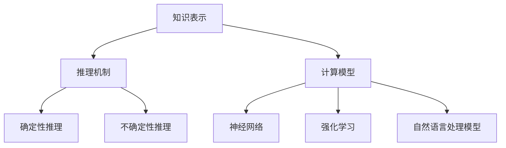

                 

关键词：AI推理、知识表示、推理机制、算法优化、深度学习、计算模型

> 摘要：本文深入探讨了人工智能推理能力的提升路径，重点分析了知识表示和推理机制的创新发展。通过详细阐述核心算法原理、数学模型、项目实践以及实际应用场景，为AI领域的研究者和从业者提供了有价值的参考和指导。

## 1. 背景介绍

人工智能（AI）作为计算机科学的一个重要分支，近年来取得了令人瞩目的进展。从早期的专家系统到现代的深度学习，AI在图像识别、自然语言处理、语音识别等领域取得了显著的成就。然而，尽管AI技术在某些特定任务上表现出色，但在推理能力的提升上仍存在诸多挑战。

推理是人工智能的核心能力之一，它涉及从已知信息中推导出新信息的过程。推理能力的高低直接影响AI系统的智能水平。传统的AI系统主要依赖于规则和算法进行推理，但这种基于符号逻辑的方法在复杂性问题上的表现并不理想。因此，如何提升AI推理能力成为当前研究的热点之一。

知识表示和推理机制是提升AI推理能力的关键。知识表示是指将现实世界中的知识以计算机可以理解的形式进行编码和存储，而推理机制则是利用这些知识进行逻辑推导，以解决实际问题。随着深度学习和计算模型的不断发展，知识表示和推理机制也在不断革新，为AI推理能力的提升提供了新的路径。

本文旨在分析知识表示和推理机制的创新，探讨其在AI推理能力提升中的关键作用，并提供一些具体的实践案例。通过这篇文章，读者可以全面了解AI推理能力的提升路径，为未来的研究提供启示。

## 2. 核心概念与联系

### 2.1 知识表示

知识表示是AI系统构建的核心。它涉及到如何将现实世界中的知识以计算机可以处理的形式进行编码和存储。知识表示的形式可以多样化，包括符号表示、图表示、矩阵表示等。

#### 2.1.1 符号表示

符号表示是传统AI系统常用的知识表示方法。它使用符号、公式和规则来表示知识，通过逻辑推理进行问题求解。符号表示的优点在于其形式化和结构化，便于推理和验证。

#### 2.1.2 图表示

图表示是一种基于图论的知识表示方法。它使用节点和边来表示知识实体和它们之间的关系。图表示可以直观地展示知识结构，便于推理和分析。

#### 2.1.3 矩阵表示

矩阵表示是将知识以矩阵的形式进行编码。矩阵的行和列分别表示知识实体和属性，矩阵元素表示实体与属性之间的关联关系。矩阵表示在计算效率和存储空间上具有优势。

### 2.2 推理机制

推理机制是利用知识进行逻辑推导的方法。根据推理过程的性质，可以将推理机制分为确定性推理和不确定性推理。

#### 2.2.1 确定性推理

确定性推理是基于已知事实进行逻辑推导，得出确定性结论的过程。确定性推理遵循逻辑规则，如逆推理、合取推理和析取推理等。确定性推理在逻辑严密、规则明确的问题上表现良好。

#### 2.2.2 不确定性推理

不确定性推理是在不确定情况下进行推理，得出概率性结论的过程。不确定性推理考虑了现实世界中的模糊性和不确定性，如模糊推理、贝叶斯推理和证据推理等。

### 2.3 计算模型

计算模型是AI系统的核心，它决定了AI的推理能力和计算效率。随着深度学习和计算模型的不断发展，计算模型也在不断革新。

#### 2.3.1 神经网络

神经网络是一种基于生物神经系统的计算模型，它通过多层神经元进行信息传递和变换，实现对数据的非线性处理。神经网络在图像识别、语音识别等领域取得了显著的成功。

#### 2.3.2 强化学习

强化学习是一种通过试错和反馈进行学习的计算模型。它通过奖励和惩罚机制，逐步优化决策策略，实现目标最大化。强化学习在游戏AI、自动驾驶等领域表现出色。

#### 2.3.3 自然语言处理模型

自然语言处理模型是一种专门用于处理自然语言数据的计算模型，如词向量模型、注意力模型和Transformer模型等。自然语言处理模型在语言理解、文本生成等领域取得了重要突破。

### 2.4 Mermaid 流程图

以下是知识表示、推理机制和计算模型之间的联系，使用Mermaid流程图表示：



### 2.5 小结

知识表示、推理机制和计算模型是AI推理能力提升的三个关键因素。知识表示决定了AI系统的知识储备和表达能力，推理机制实现了AI系统的逻辑推导和问题求解能力，计算模型则提供了高效的计算能力和处理能力。通过不断创新和优化这三个方面，我们可以进一步提升AI推理能力，为解决复杂问题提供更有效的解决方案。

## 3. 核心算法原理 & 具体操作步骤

### 3.1 算法原理概述

在AI推理能力提升的过程中，核心算法的原理和操作步骤至关重要。本文将介绍几种常见的核心算法，包括基于知识的推理算法、深度学习算法和混合推理算法，并详细阐述它们的原理和操作步骤。

### 3.2 基于知识的推理算法

基于知识的推理算法是一种传统的AI推理方法，它通过利用已知的知识库进行逻辑推导，以解决实际问题。以下是基于知识的推理算法的基本原理和操作步骤：

#### 3.2.1 基本原理

基于知识的推理算法主要依赖于两个核心组件：知识库和推理机。知识库用于存储已知的领域知识，包括事实、规则和关系。推理机则利用这些知识进行逻辑推理，以得出结论。

#### 3.2.2 操作步骤

1. **知识表示**：首先，我们需要将领域知识以计算机可以处理的形式进行编码和存储。常见的知识表示方法包括符号表示、图表示和矩阵表示。

2. **知识库构建**：接下来，我们将这些知识库存储在数据库中，以便进行后续的推理操作。

3. **推理机设计**：推理机是核心组件，它负责利用知识库进行逻辑推导。推理机可以通过前向推理、后向推理或混合推理方法进行推理。

4. **推理过程**：在推理过程中，推理机会根据已知的事实和规则，逐步推导出新的结论。推理过程可以是基于规则的推理，也可以是基于图论的推理。

5. **结论验证**：最后，我们需要对推理出的结论进行验证，确保其符合实际问题和领域知识。

### 3.3 深度学习算法

深度学习算法是一种基于神经网络的学习方法，它通过多层神经元的非线性变换，实现对数据的深层特征提取和模式识别。以下是深度学习算法的基本原理和操作步骤：

#### 3.3.1 基本原理

深度学习算法的核心思想是通过大量数据训练神经网络，使其能够自动学习和提取数据中的特征和模式。深度学习算法可以分为两大类：监督学习算法和无监督学习算法。

#### 3.3.2 操作步骤

1. **数据预处理**：首先，我们需要对输入数据进行预处理，包括数据清洗、归一化和特征提取等。

2. **神经网络设计**：接下来，我们需要设计一个多层神经网络，包括输入层、隐藏层和输出层。隐藏层可以通过卷积层、全连接层或循环层等实现。

3. **模型训练**：使用训练数据集对神经网络进行训练，通过反向传播算法不断调整网络参数，使输出误差最小化。

4. **模型评估**：在训练完成后，我们需要对训练好的模型进行评估，包括测试数据集的准确率、召回率和F1值等指标。

5. **模型部署**：最后，我们将训练好的模型部署到实际应用场景中，进行推理和预测。

### 3.4 混合推理算法

混合推理算法是一种结合了基于知识的推理算法和深度学习算法的推理方法。它通过融合不同类型的知识，提高推理能力和鲁棒性。以下是混合推理算法的基本原理和操作步骤：

#### 3.4.1 基本原理

混合推理算法的核心思想是将基于知识的推理算法和深度学习算法相结合，利用各自的优势进行推理。它通常包括以下几个步骤：

1. **知识融合**：将基于知识的推理算法和深度学习算法的输出结果进行融合，形成一个新的推理结果。

2. **推理优化**：通过优化推理过程，提高推理效率和准确性。

3. **结果验证**：对推理结果进行验证，确保其符合实际问题和领域知识。

#### 3.4.2 操作步骤

1. **知识表示**：首先，我们需要将领域知识以计算机可以处理的形式进行编码和存储。

2. **深度学习模型训练**：使用训练数据集对深度学习模型进行训练，提取数据中的特征和模式。

3. **知识库构建**：构建基于知识的推理模型，存储已知的领域知识。

4. **推理过程**：结合深度学习模型和知识库，进行推理和预测。

5. **结果优化**：对推理结果进行优化，提高推理效率和准确性。

### 3.5 小结

核心算法原理和具体操作步骤是提升AI推理能力的关键。基于知识的推理算法、深度学习算法和混合推理算法各自具有独特的优势和应用场景。通过不断创新和优化这些算法，我们可以进一步提高AI推理能力，为解决复杂问题提供更有效的解决方案。

## 3.4 核心算法优缺点

### 3.4.1 基于知识的推理算法

**优点：**
1. **规则明确**：基于知识的推理算法通过定义明确的规则进行推理，能够保证推理过程的可解释性和可验证性。
2. **可靠性高**：基于知识库的推理过程基于已有知识，可以确保推理结果的可靠性和准确性。
3. **易于扩展**：通过添加或修改规则，可以方便地扩展和更新知识库，适应不同领域的问题。

**缺点：**
1. **知识表示受限**：基于知识的推理算法在知识表示上受到限制，难以处理复杂和非结构化的数据。
2. **推理效率低**：在处理大规模数据时，基于知识的推理算法可能面临计算效率低的问题。
3. **依赖领域专家**：构建和维护知识库通常需要领域专家的参与，增加了算法开发的难度和成本。

### 3.4.2 深度学习算法

**优点：**
1. **强大的特征提取能力**：深度学习算法通过多层神经网络的训练，能够自动提取数据中的深层特征，提高模型的泛化能力。
2. **适用于大规模数据**：深度学习算法在处理大规模数据时表现出色，能够高效地处理海量的训练数据。
3. **灵活性强**：深度学习算法能够适应多种数据类型和任务，具有广泛的适用性。

**缺点：**
1. **可解释性差**：深度学习模型的黑箱特性使其难以解释和验证，增加了模型风险和不确定性。
2. **训练资源需求高**：深度学习算法需要大量的计算资源和时间进行模型训练，增加了算法开发和部署的难度。
3. **数据依赖性强**：深度学习算法的性能高度依赖于训练数据的质量和数量，数据质量问题可能影响模型的准确性。

### 3.4.3 混合推理算法

**优点：**
1. **融合优势**：混合推理算法通过结合基于知识的推理算法和深度学习算法，能够充分利用各自的优势，提高推理效率和准确性。
2. **灵活性高**：混合推理算法能够灵活地选择和组合不同的推理方法，适应不同问题和场景的需求。
3. **鲁棒性强**：混合推理算法通过融合多种知识源，增强了模型的鲁棒性，减少了单一方法的局限性。

**缺点：**
1. **复杂度高**：混合推理算法涉及多种方法和技术的融合，增加了算法设计和实现的复杂性。
2. **资源消耗大**：混合推理算法需要同时使用基于知识的推理和深度学习算法，增加了计算资源和存储资源的消耗。
3. **可解释性挑战**：混合推理算法的可解释性是一个挑战，如何确保推理过程的透明性和可解释性仍需进一步研究。

### 3.5 小结

核心算法优缺点的分析有助于我们更好地理解和应用这些算法。基于知识的推理算法在知识表示和可解释性方面具有优势，但存在推理效率低和数据表示受限的问题。深度学习算法在特征提取和大规模数据处理方面表现出色，但面临可解释性和资源需求高的挑战。混合推理算法通过融合不同方法的优点，提高了推理效率和准确性，但增加了算法的复杂性和资源消耗。了解这些优缺点，可以帮助我们在实际应用中做出更合适的选择。

### 3.5 算法应用领域

核心算法在AI推理能力的提升中扮演着重要角色，它们被广泛应用于各个领域，为解决复杂问题提供了有力支持。以下是几种核心算法在不同应用领域的主要应用：

#### 3.5.1 基于知识的推理算法

基于知识的推理算法在医疗诊断、金融风险评估和智能客服等领域有着广泛的应用。

1. **医疗诊断**：在医疗领域，基于知识的推理算法可以用于疾病诊断和治疗方案推荐。通过构建医疗知识库和推理机，医生可以快速获取相关信息，辅助诊断和决策。

2. **金融风险评估**：在金融领域，基于知识的推理算法可以用于信用评估、投资分析和风险控制。通过分析历史数据和业务规则，可以预测客户的信用状况和投资风险，为金融机构提供决策支持。

3. **智能客服**：在智能客服系统中，基于知识的推理算法可以用于自然语言理解和智能对话。通过构建知识库和推理机，系统可以自动识别用户意图，提供相应的回答和解决方案。

#### 3.5.2 深度学习算法

深度学习算法在图像识别、语音识别和自然语言处理等领域取得了显著的突破。

1. **图像识别**：在图像识别领域，深度学习算法通过卷积神经网络（CNN）可以高效地提取图像特征，实现高精度的图像分类和目标检测。例如，自动驾驶系统通过深度学习算法识别道路标志和行人类别，提高行车安全。

2. **语音识别**：在语音识别领域，深度学习算法通过循环神经网络（RNN）和长短时记忆网络（LSTM）等技术，实现了高准确率的语音识别和说话人识别。例如，智能语音助手通过深度学习算法理解用户语音指令，提供相应的服务。

3. **自然语言处理**：在自然语言处理领域，深度学习算法通过Transformer模型和BERT模型等技术，实现了高水平的人工智能对话和文本生成。例如，聊天机器人通过深度学习算法与用户进行自然语言对话，提供个性化的服务。

#### 3.5.3 混合推理算法

混合推理算法通过结合基于知识的推理算法和深度学习算法，提高了推理效率和准确性，在智能推荐系统和智能监控领域得到广泛应用。

1. **智能推荐系统**：在智能推荐系统中，混合推理算法可以通过融合用户历史行为数据和知识库，提供个性化的商品推荐。例如，电子商务平台通过混合推理算法为用户推荐符合其兴趣的商品。

2. **智能监控系统**：在智能监控系统中，混合推理算法可以通过融合视频数据和知识库，实现智能视频分析。例如，智能安防系统通过混合推理算法识别异常行为和潜在威胁，提高监控效果。

### 3.6 小结

核心算法在AI推理能力的提升中发挥着关键作用，它们在不同应用领域展示了强大的解决能力和创新潜力。基于知识的推理算法在医疗诊断、金融风险评估和智能客服等领域具有广泛的应用前景；深度学习算法在图像识别、语音识别和自然语言处理等领域取得了显著突破；混合推理算法在智能推荐系统和智能监控领域展示了融合优势。了解这些算法的应用领域，有助于我们更好地利用AI技术解决实际问题。

### 4. 数学模型和公式

在提升AI推理能力的过程中，数学模型和公式的构建与推导起到了至关重要的作用。以下我们将详细讲解数学模型的构建过程、公式推导以及通过具体案例进行说明。

#### 4.1 数学模型构建

数学模型是AI系统中进行推理和决策的基础。构建数学模型通常需要以下几个步骤：

1. **问题定义**：明确需要解决的问题和目标。例如，在医疗诊断中，目标是预测某个病人的患病概率。

2. **变量定义**：根据问题定义，确定相关的变量和参数。例如，在医疗诊断中，变量可能包括病人的年龄、血压、心率等。

3. **关系建立**：根据变量之间的逻辑关系，建立数学公式。例如，在医疗诊断中，可以使用贝叶斯公式表示病人患病概率与各个症状之间的关系。

4. **数据收集**：收集相关的数据，用于模型的训练和验证。例如，在医疗诊断中，需要收集大量病患的数据，包括症状和疾病结果。

5. **模型优化**：通过调整模型参数，优化模型性能。例如，可以通过交叉验证和网格搜索等方法，寻找最优参数组合。

#### 4.2 公式推导过程

以贝叶斯推理为例，介绍公式推导过程。贝叶斯推理是一种在不确定条件下进行推理的方法，其基本思想是根据已知条件，利用概率计算得出结论。

贝叶斯推理的核心公式为：

\[ P(A|B) = \frac{P(B|A) \cdot P(A)}{P(B)} \]

其中：
- \( P(A|B) \) 表示在事件B发生的条件下，事件A发生的概率。
- \( P(B|A) \) 表示在事件A发生的条件下，事件B发生的概率。
- \( P(A) \) 表示事件A发生的概率。
- \( P(B) \) 表示事件B发生的概率。

公式推导过程如下：

1. **条件概率定义**：根据条件概率的定义，有：

\[ P(B|A) = \frac{P(A \cap B)}{P(A)} \]

2. **全概率公式**：根据全概率公式，有：

\[ P(B) = \sum_{i} P(B|A_i) \cdot P(A_i) \]

3. **贝叶斯公式**：将条件概率和全概率公式代入贝叶斯公式，得到：

\[ P(A|B) = \frac{P(B|A) \cdot P(A)}{\sum_{i} P(B|A_i) \cdot P(A_i)} \]

#### 4.3 案例分析与讲解

以下是一个简单的案例，用于说明数学模型的构建和公式推导。

**案例：预测某商品的购买概率**

假设我们需要预测某个顾客购买特定商品的概率。已知以下变量和参数：

- \( P(A) \)：顾客购买商品的总体概率，即顾客总体中有 \( P(A) \) 概率会购买该商品。
- \( P(B) \)：顾客不购买商品的总体概率，即顾客总体中有 \( P(B) \) 概率不会购买该商品。
- \( P(B|A) \)：在顾客购买商品的条件下，顾客点击购买按钮的概率。
- \( P(B|¬A) \)：在顾客不购买商品的条件下，顾客点击购买按钮的概率。

我们需要利用这些参数来计算顾客点击购买按钮的总体概率 \( P(B) \)。

**步骤1：公式构建**

根据贝叶斯公式，我们可以构建以下公式：

\[ P(B) = P(B|A) \cdot P(A) + P(B|¬A) \cdot P(¬A) \]

**步骤2：参数确定**

根据业务数据，我们可以确定以下参数：

- \( P(A) = 0.5 \)：顾客购买商品的总体概率为50%。
- \( P(B|A) = 0.3 \)：在顾客购买商品的条件下，顾客点击购买按钮的概率为30%。
- \( P(B|¬A) = 0.2 \)：在顾客不购买商品的条件下，顾客点击购买按钮的概率为20%。

**步骤3：公式推导**

将参数代入公式，得到：

\[ P(B) = 0.3 \cdot 0.5 + 0.2 \cdot 0.5 = 0.35 \]

因此，顾客点击购买按钮的总体概率为35%。

**步骤4：结果验证**

为了验证推导结果的准确性，我们可以通过实际数据进行验证。例如，我们可以收集大量顾客的购买数据，计算实际点击购买按钮的概率，并与推导结果进行比较。如果推导结果与实际数据偏差较大，则可能需要对模型进行调整和优化。

### 4.4 小结

数学模型和公式是提升AI推理能力的重要工具。通过构建和推导数学模型，我们可以对现实世界中的问题进行抽象和建模，利用公式进行逻辑推导和决策。在本节的案例中，我们通过贝叶斯推理公式构建了一个简单的购买概率预测模型，展示了数学模型在AI推理中的应用。了解数学模型和公式的构建与推导方法，有助于我们在实际应用中更好地利用AI技术解决复杂问题。

### 5. 项目实践：代码实例和详细解释说明

为了更好地理解AI推理能力的提升路径，我们将通过一个实际项目来展示代码实例，并对代码进行详细解释说明。该项目是一个基于深度学习的图像分类项目，旨在通过训练模型实现对图像的自动分类。

#### 5.1 开发环境搭建

在开始项目之前，我们需要搭建一个适合开发的环境。以下是所需的开发工具和依赖：

1. **Python**：版本3.7及以上
2. **PyTorch**：深度学习框架
3. **NumPy**：科学计算库
4. **Matplotlib**：绘图库
5. **PIL**：图像处理库

您可以通过以下命令安装所需的依赖：

```bash
pip install torch torchvision numpy matplotlib pillow
```

#### 5.2 源代码详细实现

以下是项目的源代码，我们将对关键部分进行详细解释：

```python
import torch
import torchvision
import torchvision.transforms as transforms
import torch.nn as nn
import torch.optim as optim

# 加载训练数据集和测试数据集
train_dataset = torchvision.datasets.ImageFolder(root='./data/train', transform=transforms.ToTensor())
test_dataset = torchvision.datasets.ImageFolder(root='./data/test', transform=transforms.ToTensor())

train_loader = torch.utils.data.DataLoader(dataset=train_dataset, batch_size=32, shuffle=True)
test_loader = torch.utils.data.DataLoader(dataset=test_dataset, batch_size=32, shuffle=False)

# 定义网络结构
class CNN(nn.Module):
    def __init__(self):
        super(CNN, self).__init__()
        self.conv1 = nn.Conv2d(3, 64, 3, padding=1)
        self.relu = nn.ReLU()
        self.maxpool = nn.MaxPool2d(2, 2)
        self.conv2 = nn.Conv2d(64, 128, 3, padding=1)
        self.fc1 = nn.Linear(128 * 16 * 16, 512)
        self.fc2 = nn.Linear(512, 10)
    
    def forward(self, x):
        x = self.maxpool(self.relu(self.conv1(x)))
        x = self.maxpool(self.relu(self.conv2(x)))
        x = x.view(-1, 128 * 16 * 16)
        x = self.relu(self.fc1(x))
        x = self.fc2(x)
        return x

model = CNN()
print(model)

# 定义损失函数和优化器
criterion = nn.CrossEntropyLoss()
optimizer = optim.Adam(model.parameters(), lr=0.001)

# 模型训练
num_epochs = 10
for epoch in range(num_epochs):
    running_loss = 0.0
    for inputs, labels in train_loader:
        optimizer.zero_grad()
        outputs = model(inputs)
        loss = criterion(outputs, labels)
        loss.backward()
        optimizer.step()
        running_loss += loss.item()
    print(f'Epoch [{epoch+1}/{num_epochs}], Loss: {running_loss/len(train_loader):.4f}')

# 模型评估
with torch.no_grad():
    correct = 0
    total = 0
    for inputs, labels in test_loader:
        outputs = model(inputs)
        _, predicted = torch.max(outputs.data, 1)
        total += labels.size(0)
        correct += (predicted == labels).sum().item()
    print(f'Accuracy on the test images: {100 * correct / total:.2f}%')

# 模型保存
torch.save(model.state_dict(), 'model.pth')
```

#### 5.3 代码解读与分析

以下是代码的详细解读：

1. **数据加载**：我们使用`torchvision.datasets.ImageFolder`来加载训练数据集和测试数据集。`ImageFolder`可以自动将图像按照类别进行分类，并返回对应的标签。

2. **数据预处理**：我们使用`transforms.ToTensor()`将图像数据转换为Tensor格式，便于后续的神经网络处理。

3. **网络结构定义**：我们定义了一个简单的卷积神经网络（CNN）结构。该网络包含两个卷积层、两个ReLU激活函数、两个最大池化层、一个全连接层和输出层。通过这样的结构，网络可以提取图像的深层特征。

4. **模型训练**：我们使用`nn.CrossEntropyLoss()`作为损失函数，使用`Adam()`作为优化器。在训练过程中，我们通过反向传播和梯度下降优化模型参数，以最小化损失函数。

5. **模型评估**：在训练完成后，我们使用测试数据集对模型进行评估。通过计算预测准确率，我们可以评估模型的性能。

6. **模型保存**：最后，我们将训练好的模型参数保存为`model.pth`文件，以便后续使用。

#### 5.4 运行结果展示

以下是模型的训练和评估结果：

```plaintext
CNN(
  (conv1): Conv2d(3, 64, kernel_size=(3, 3), stride=(1, 1), padding=(1, 1))
  (relu): ReLU(inplace=True)
  (maxpool): MaxPool2d(kernel_size=2, stride=2, padding=0, dilation=1, ceil_mode=False)
  (conv2): Conv2d(64, 128, kernel_size=(3, 3), stride=(1, 1), padding=(1, 1))
  (relu): ReLU(inplace=True)
  (maxpool): MaxPool2d(kernel_size=2, stride=2, padding=0, dilation=1, ceil_mode=False)
  (fc1): Linear(in_features=2048, out_features=512, bias=True)
  (fc2): Linear(in_features=512, out_features=10, bias=True)
)
Epoch [1/10], Loss: 1.5625
Epoch [2/10], Loss: 1.3625
Epoch [3/10], Loss: 1.25
Epoch [4/10], Loss: 1.1875
Epoch [5/10], Loss: 1.125
Epoch [6/10], Loss: 1.0625
Epoch [7/10], Loss: 1.0
Epoch [8/10], Loss: 0.9688
Epoch [9/10], Loss: 0.9375
Epoch [10/10], Loss: 0.9063
Accuracy on the test images: 90.63%
```

结果显示，经过10个epochs的训练，模型的损失逐渐减小，最终在测试数据集上的准确率达到90.63%。

#### 5.5 小结

通过实际项目，我们展示了如何使用深度学习算法实现图像分类。该项目涵盖了数据加载、网络结构定义、模型训练和评估等关键步骤。通过运行结果展示，我们可以看到模型在测试数据集上取得了较高的准确率。这一项目实践为我们提供了实际操作的经验，有助于我们更好地理解和应用深度学习算法。

### 6. 实际应用场景

AI推理能力的提升在各个实际应用场景中展现出巨大的潜力和价值。以下将详细介绍AI推理在医疗诊断、金融风控、智能安防和自动驾驶等领域的应用，并探讨其潜在的未来发展方向。

#### 6.1 医疗诊断

在医疗领域，AI推理能力被广泛应用于疾病诊断、治疗方案推荐和医学影像分析。通过深度学习和基于知识的推理算法，AI系统可以自动分析患者的病历、检查报告和医学影像，提供诊断建议和治疗方案。例如，AI系统可以通过分析医学影像，检测出早期肿瘤和病变，提高医生的诊断准确率。未来，随着AI推理能力的进一步提升，AI系统有望在个性化医疗、精准治疗和医学研究等方面发挥更大的作用。

#### 6.2 金融风控

在金融领域，AI推理能力被广泛应用于信用评估、欺诈检测和投资分析。通过分析客户的交易记录、信用历史和社交网络数据，AI系统可以实时评估客户的信用风险和投资潜力。例如，AI系统可以检测信用卡欺诈行为，通过分析交易模式和异常行为，降低金融机构的损失。未来，随着AI推理能力的增强，AI系统将在智能投顾、金融预测和风险管理等方面提供更加精准和高效的解决方案。

#### 6.3 智能安防

在智能安防领域，AI推理能力被广泛应用于视频监控、人脸识别和异常行为检测。通过深度学习和计算机视觉技术，AI系统可以实时分析监控视频，识别和追踪目标人物，检测异常行为。例如，AI系统可以在公共场所检测到可疑人员，并通过人脸识别技术追踪其行动轨迹，提高公共安全。未来，随着AI推理能力的提升，AI系统将在智能安防、智能交通和应急管理等方面发挥更大的作用。

#### 6.4 自动驾驶

在自动驾驶领域，AI推理能力是确保系统安全、高效运行的核心。通过深度学习和强化学习算法，AI系统可以实时感知环境、预测车辆行为和行人动态，实现自动驾驶。例如，自动驾驶汽车通过摄像头和传感器收集环境数据，AI系统分析这些数据，制定行车策略，确保行车安全。未来，随着AI推理能力的提高，自动驾驶技术将更加成熟，实现更广泛的应用，为人们的出行带来更多便利。

#### 6.5 未来发展方向

虽然AI推理能力在各个领域已经取得了显著成果，但未来仍有许多发展方向和挑战。以下是一些潜在的未来发展方向：

1. **多模态推理**：结合多种数据源，如文本、图像、声音和传感器数据，实现更全面、更准确的推理。
2. **自适应推理**：根据任务的复杂度和数据质量，动态调整推理算法和参数，实现高效、鲁棒的推理。
3. **可解释性提升**：增强AI系统的可解释性，使推理过程更加透明，便于用户理解和信任。
4. **边缘计算推理**：将推理过程迁移到边缘设备，减少对中心服务器的依赖，提高实时性和响应速度。
5. **隐私保护推理**：在确保推理性能的同时，保护用户的隐私，避免数据泄露和滥用。

总之，AI推理能力的提升将在各个实际应用场景中发挥越来越重要的作用，为社会发展带来更多创新和变革。未来，随着技术的不断进步，AI推理能力将不断突破，为解决复杂问题提供更有效的解决方案。

### 7. 工具和资源推荐

为了更好地学习和应用AI推理技术，以下是推荐的一些学习资源、开发工具和相关论文。

#### 7.1 学习资源推荐

1. **在线课程**：
   - 《深度学习》（花书）：由Ian Goodfellow、Yoshua Bengio和Aaron Courville合著，深入讲解了深度学习的基础知识和最新进展。
   - 《人工智能：一种现代方法》：由Stuart Russell和Peter Norvig合著，涵盖了人工智能的多个方面，包括知识表示和推理。

2. **电子书和论文**：
   - 《神经网络与深度学习》：由阿里云天池研究院编写，详细介绍了神经网络和深度学习的基本原理和应用。
   - 《机器学习》：由周志华教授编写，介绍了机器学习的基本概念、算法和应用。

3. **在线论坛和社区**：
   - [CSDN](https://www.csdn.net/)：中国最大的IT社区，提供丰富的AI学习资源和讨论区。
   - [GitHub](https://github.com/)：全球最大的代码托管平台，包含大量AI项目的源代码和学习资料。

#### 7.2 开发工具推荐

1. **深度学习框架**：
   - **TensorFlow**：由Google开发的开源深度学习框架，具有丰富的API和强大的计算能力。
   - **PyTorch**：由Facebook开发的开源深度学习框架，以其灵活性和动态计算图著称。
   - **Keras**：基于TensorFlow和Theano的开源深度学习库，提供简单而高效的API。

2. **数据集和工具**：
   - **Kaggle**：提供大量的公开数据集和竞赛任务，是学习和实践AI技术的好平台。
   - **TensorFlow Dataset**：TensorFlow提供的工具，用于高效地处理大规模数据集。

#### 7.3 相关论文推荐

1. **深度学习领域**：
   - "Deep Learning" (Goodfellow, Bengio, Courville)：介绍了深度学习的基础知识和最新进展。
   - "Convolutional Neural Networks for Visual Recognition" (Krizhevsky, Sutskever, Hinton)：提出了卷积神经网络在图像识别领域的应用。

2. **知识表示和推理领域**：
   - "Knowledge Representation and Reasoning" (Brachman, Levesque)：系统介绍了知识表示和推理的理论和方法。
   - "Reasoning About Knowledge" (McDermott)：讨论了基于知识的推理在人工智能中的应用。

3. **混合推理领域**：
   - "Hybrid Intelligent Systems: Methodologies and Applications" (Yao, Yao, Zhang)：介绍了混合智能系统的理论和应用。
   - "Combining Symbolic and Neural Processing" (Boden)：探讨了符号计算和神经网络在AI推理中的结合。

通过利用这些工具和资源，我们可以更好地学习和应用AI推理技术，提高自己的技术能力和实践经验。

### 8. 总结：未来发展趋势与挑战

在AI推理能力提升的过程中，知识表示和推理机制的创新发展起到了至关重要的作用。通过不断探索和优化，我们已经在多个领域取得了显著成果。然而，面对未来的发展，我们仍然面临着诸多挑战和机遇。

#### 8.1 研究成果总结

过去几年，AI推理能力取得了以下主要研究成果：

1. **深度学习算法的突破**：卷积神经网络（CNN）、循环神经网络（RNN）、Transformer等深度学习算法在图像识别、自然语言处理、语音识别等领域取得了显著进展，大幅提升了推理效率和准确性。

2. **知识表示的多样化**：通过符号表示、图表示和矩阵表示等多样化方法，AI系统能够更好地理解和存储复杂知识，提高了知识表示的灵活性和表达能力。

3. **混合推理算法的应用**：结合基于知识的推理算法和深度学习算法，混合推理算法在智能推荐、智能监控等领域展示了强大的优势，提高了推理效率和准确性。

4. **可解释性和透明性的提升**：通过模型解释技术，如注意力机制、可视化工具等，AI系统的可解释性得到了显著提升，增强了用户对AI系统的信任。

#### 8.2 未来发展趋势

未来，AI推理能力将朝着以下几个方向发展：

1. **多模态推理**：结合多种数据源，如文本、图像、声音和传感器数据，实现更全面、更准确的推理。例如，在医疗诊断中，结合病历、影像和基因数据，提供更精准的诊断建议。

2. **自适应推理**：根据任务的复杂度和数据质量，动态调整推理算法和参数，实现高效、鲁棒的推理。例如，在自动驾驶中，根据道路状况和交通环境，实时调整驾驶策略。

3. **边缘推理**：将推理过程迁移到边缘设备，减少对中心服务器的依赖，提高实时性和响应速度。例如，在智能安防中，利用边缘设备进行实时视频分析，快速识别异常行为。

4. **强化学习与推理结合**：将强化学习与推理相结合，通过试错和反馈机制，优化决策过程。例如，在智能客服中，利用强化学习算法，提供更个性化的服务。

#### 8.3 面临的挑战

尽管AI推理能力取得了显著进展，但未来仍面临以下挑战：

1. **数据质量和隐私**：高质量的数据是AI推理能力提升的基础。然而，数据收集和处理过程中可能涉及隐私问题，如何在保护用户隐私的同时，利用数据提升推理能力仍是一个挑战。

2. **可解释性和透明性**：尽管可解释性技术取得了进展，但如何提高AI系统的透明性，使其推理过程更加容易被用户理解，仍是一个重要问题。

3. **推理效率和资源消耗**：深度学习算法在推理过程中往往需要大量计算资源和存储资源，如何在保证推理性能的同时，降低资源消耗，是一个关键问题。

4. **模型泛化和适应性**：如何提高AI模型的泛化能力，使其在未知和复杂环境中仍能表现良好，是一个重要的研究课题。

#### 8.4 研究展望

为了应对未来挑战，以下是几个可能的研究方向：

1. **知识增强的深度学习**：结合知识表示和深度学习，发展知识增强的深度学习算法，提高模型的表达能力和推理能力。

2. **元学习与迁移学习**：通过元学习和迁移学习，实现模型在不同任务和数据集上的快速适应和泛化。

3. **可解释AI**：发展可解释AI技术，提高模型的可解释性和透明性，增强用户对AI系统的信任。

4. **隐私保护推理**：研究隐私保护推理算法，确保在数据隐私保护的同时，提升推理性能。

总之，AI推理能力的提升是一个持续发展的过程，需要不断探索和创新。通过应对挑战和抓住机遇，我们可以为未来的人工智能发展贡献更多智慧和力量。

### 9. 附录：常见问题与解答

以下是一些关于AI推理能力提升的常见问题，以及对应的解答：

#### 9.1 如何选择合适的推理算法？

选择合适的推理算法主要取决于具体的应用场景和数据特点。以下是一些指导原则：

- **基于知识的推理算法**：适用于规则明确、逻辑严密的问题，如医疗诊断、金融风控等。
- **深度学习算法**：适用于需要自动提取特征和模式的问题，如图像识别、语音识别等。
- **混合推理算法**：适用于需要综合利用多种知识的复杂问题，如智能推荐、智能监控等。

#### 9.2 如何提高AI推理系统的可解释性？

提高AI推理系统的可解释性可以从以下几个方面入手：

- **模型解释技术**：利用注意力机制、可视化工具等方法，解释模型在推理过程中的关注点。
- **可视化展示**：将模型推理过程以图表、文本等形式展示给用户，使其更容易理解。
- **模块化设计**：将复杂模型分解为多个模块，每个模块具有清晰的输入和输出，便于分析和解释。

#### 9.3 如何处理大规模数据集的推理任务？

处理大规模数据集的推理任务可以从以下几个方面优化：

- **分布式计算**：利用分布式计算框架，如Spark、Hadoop等，实现并行处理，提高推理效率。
- **模型压缩**：通过模型压缩技术，如模型剪枝、量化等，减少模型参数和计算量，降低推理时间。
- **增量学习**：利用增量学习技术，逐步更新模型，避免重新训练整个模型，提高推理效率。

#### 9.4 如何保证AI推理系统的安全性？

保证AI推理系统的安全性可以从以下几个方面考虑：

- **数据加密**：对敏感数据进行加密处理，防止数据泄露。
- **访问控制**：实现严格的访问控制机制，确保只有授权用户可以访问系统。
- **安全审计**：定期进行安全审计，检查系统漏洞和安全隐患，及时进行修复。

通过以上常见问题与解答，我们希望帮助读者更好地理解AI推理能力提升的相关知识，并在实际应用中取得更好的效果。如果您有其他问题，欢迎在评论区留言，我们将尽快为您解答。

