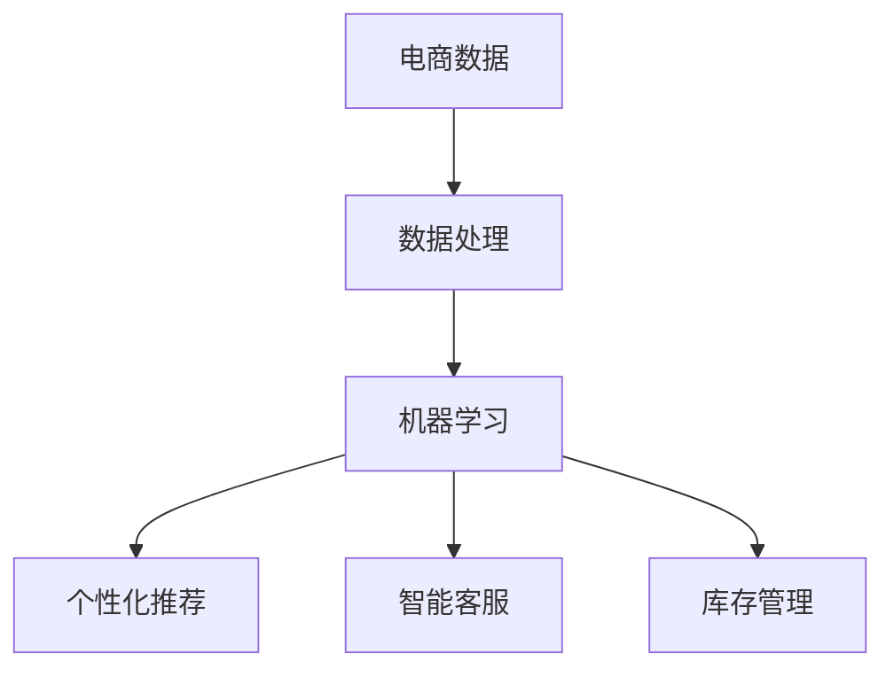
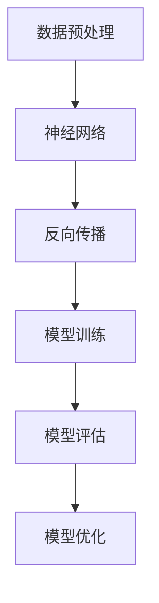
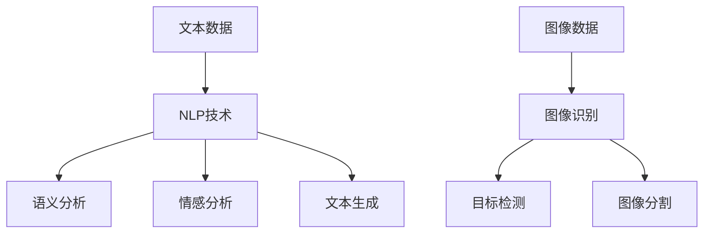
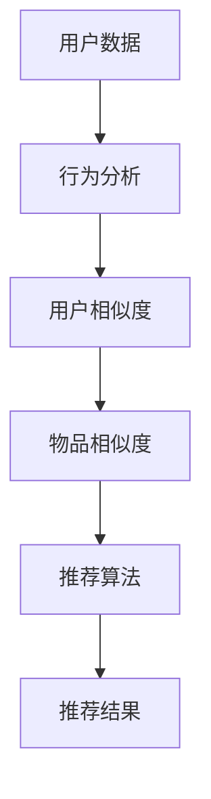

                 

关键词：电商平台、运营效率、人工智能、算法优化、数学模型、项目实践、未来展望

> 摘要：随着互联网技术的快速发展，电商平台成为零售业的重要组成部分。本文深入探讨如何利用人工智能技术提升电商平台的运营效率，包括核心算法原理、数学模型及其应用领域，并通过实际项目实践提供详细讲解。同时，展望未来发展趋势与面临的挑战。

## 1. 背景介绍

电商平台作为新兴的商业模式，已经成为零售业的重要组成部分。然而，随着市场需求的增长和竞争的加剧，电商平台的运营效率成为企业生存和发展的关键因素。传统的运营模式往往存在数据处理效率低下、个性化推荐不准确、库存管理不善等问题。这些问题不仅降低了客户满意度，也影响了平台的盈利能力。

人工智能（AI）技术的兴起为电商平台运营效率的提升带来了新的契机。通过机器学习、自然语言处理、图像识别等AI技术，电商平台可以实现自动化数据处理、精准推荐和智能库存管理，从而提高运营效率，提升客户体验，增加盈利能力。

本文将围绕以下几个方面展开讨论：

- 核心算法原理与应用
- 数学模型及其应用
- 实际项目实践
- 未来发展趋势与挑战

通过本文的深入探讨，希望能够为电商平台运营者提供有益的参考和指导。

## 2. 核心概念与联系

### 2.1. 人工智能技术

人工智能（AI）是一种模拟人类智能的计算机科学领域。它包括机器学习、深度学习、自然语言处理、计算机视觉等多个子领域。在电商平台上，AI技术主要用于自动化数据处理、个性化推荐、智能客服等方面。

#### Mermaid 流程图（节点无特殊字符）



### 2.2. 机器学习与深度学习

机器学习是人工智能的一个重要分支，它通过构建模型从数据中学习规律，以实现特定任务。深度学习是机器学习的一种方法，它使用多层神经网络进行数据建模。

#### Mermaid 流程图（节点无特殊字符）



### 2.3. 自然语言处理与图像识别

自然语言处理（NLP）是AI的一个分支，它使计算机能够理解和处理人类语言。图像识别是计算机视觉的一个子领域，它使计算机能够识别和理解图像中的内容。

#### Mermaid 流程图（节点无特殊字符）



### 2.4. 个性化推荐与协同过滤

个性化推荐是一种通过分析用户历史行为和偏好，向用户提供个性化推荐的方法。协同过滤是个性化推荐的一种常用技术，它通过计算用户之间的相似度来实现推荐。

#### Mermaid 流程图（节点无特殊字符）



### 2.5. 数学模型与公式

在电商平台运营中，数学模型和公式被广泛应用于数据分析和预测。例如，线性回归、逻辑回归、时间序列分析等。

#### LaTex 数学模型构建

$$
y = \beta_0 + \beta_1x_1 + \beta_2x_2 + ... + \beta_nx_n + \epsilon
$$

#### LaTex 公式推导过程

$$
\begin{aligned}
\frac{\partial L}{\partial \theta} &= \frac{\partial}{\partial \theta} \left( -\frac{1}{m} \sum_{i=1}^{m} \sum_{j=1}^{n} \left( h_{\theta}(x^{(i)}) - y^{(i)} \right) \cdot x_j^{(i)} \right) \\
&= \frac{1}{m} \sum_{i=1}^{m} \sum_{j=1}^{n} \left( h_{\theta}(x^{(i)}) - y^{(i)} \right) \cdot \frac{\partial}{\partial \theta} \left( x_j^{(i)} \right) \\
&= \frac{1}{m} \sum_{i=1}^{m} \left( h_{\theta}(x^{(i)}) - y^{(i)} \right) \cdot x_j^{(i)}
\end{aligned}
$$

## 3. 核心算法原理 & 具体操作步骤

### 3.1 算法原理概述

电商平台运营中的核心算法主要包括机器学习算法、深度学习算法、自然语言处理算法和图像识别算法。这些算法通过从数据中学习规律，实现自动化数据处理、个性化推荐和智能库存管理等功能。

### 3.2 算法步骤详解

#### 3.2.1 机器学习算法

1. 数据采集与预处理：收集电商平台的海量数据，并进行清洗、去重、归一化等预处理操作。
2. 特征工程：提取数据中的有效特征，如用户行为、商品属性等。
3. 模型选择：根据任务需求选择合适的机器学习模型，如线性回归、逻辑回归、决策树、随机森林等。
4. 模型训练：使用训练数据集对模型进行训练，通过调整模型参数以优化性能。
5. 模型评估：使用测试数据集对模型进行评估，以验证模型的泛化能力。
6. 模型部署：将训练好的模型部署到电商平台，实现自动化数据处理和预测。

#### 3.2.2 深度学习算法

1. 神经网络构建：设计多层神经网络结构，包括输入层、隐藏层和输出层。
2. 损失函数定义：根据任务类型定义损失函数，如均方误差、交叉熵等。
3. 反向传播：通过反向传播算法更新网络权重，以最小化损失函数。
4. 模型训练：使用大量训练数据对神经网络进行训练，调整网络参数。
5. 模型评估：使用测试数据集对训练好的模型进行评估，以验证模型的性能。
6. 模型部署：将训练好的深度学习模型部署到电商平台，实现自动化数据处理和预测。

#### 3.2.3 自然语言处理算法

1. 文本预处理：对原始文本数据进行分词、词性标注、停用词过滤等预处理操作。
2. 语义分析：使用词嵌入技术将文本转化为向量表示，并进行语义分析。
3. 情感分析：根据文本内容和语义信息，判断文本的情感极性。
4. 文本生成：基于预训练的模型，生成符合语义要求的文本内容。
5. 模型训练与评估：使用大量标注数据对模型进行训练和评估，以优化模型性能。
6. 模型部署：将训练好的自然语言处理模型部署到电商平台，实现智能客服和个性化推荐。

#### 3.2.4 图像识别算法

1. 图像预处理：对原始图像进行缩放、旋转、裁剪等预处理操作。
2. 特征提取：使用卷积神经网络（CNN）提取图像中的有效特征。
3. 目标检测：使用目标检测算法（如YOLO、SSD、Faster R-CNN等）检测图像中的目标对象。
4. 图像分类：使用图像分类算法（如SVM、卷积神经网络等）对图像进行分类。
5. 模型训练与评估：使用大量标注数据对模型进行训练和评估，以优化模型性能。
6. 模型部署：将训练好的图像识别模型部署到电商平台，实现商品识别和图像搜索。

### 3.3 算法优缺点

#### 3.3.1 机器学习算法

**优点**：

- 模型可解释性强：机器学习算法能够提供模型的解释，有助于理解模型的决策过程。
- 适用于多种任务：机器学习算法可以应用于分类、回归、聚类等多种任务。

**缺点**：

- 需要大量标注数据：机器学习算法通常需要大量标注数据来训练模型，数据获取成本较高。
- 模型泛化能力较弱：机器学习算法在处理未见数据时可能存在泛化能力不足的问题。

#### 3.3.2 深度学习算法

**优点**：

- 模型泛化能力强：深度学习算法通过多层神经网络学习数据特征，具有良好的泛化能力。
- 自适应能力强：深度学习算法能够自动调整网络参数，以适应不同任务和数据集。

**缺点**：

- 模型可解释性较弱：深度学习算法的黑箱特性使得模型的可解释性较差，难以理解模型的决策过程。
- 计算资源消耗大：深度学习算法通常需要大量的计算资源和时间进行训练和推理。

#### 3.3.3 自然语言处理算法

**优点**：

- 语义理解能力强：自然语言处理算法能够理解和处理人类语言，实现语义分析、情感分析等任务。
- 应用场景广泛：自然语言处理算法可以应用于智能客服、文本生成、机器翻译等场景。

**缺点**：

- 模型复杂度高：自然语言处理算法通常需要复杂的模型架构和大量的计算资源。
- 数据标注成本高：自然语言处理算法需要大量标注数据来训练模型，数据标注成本较高。

#### 3.3.4 图像识别算法

**优点**：

- 目标检测能力强：图像识别算法能够准确检测图像中的目标对象，实现目标识别和分类任务。
- 应用场景广泛：图像识别算法可以应用于商品识别、图像搜索、自动驾驶等场景。

**缺点**：

- 模型复杂度高：图像识别算法通常需要复杂的模型架构和大量的计算资源。
- 数据标注成本高：图像识别算法需要大量标注数据来训练模型，数据标注成本较高。

### 3.4 算法应用领域

人工智能技术在电商平台运营中的应用非常广泛，主要包括以下领域：

- 自动化数据处理：通过机器学习和深度学习算法，实现电商数据的自动化处理和分析，包括用户行为分析、商品分类、价格预测等。
- 个性化推荐：通过协同过滤和深度学习算法，实现个性化推荐，提高用户满意度和转化率。
- 智能客服：通过自然语言处理算法，实现智能客服系统，提供24小时在线服务，提高客户满意度。
- 智能库存管理：通过图像识别和深度学习算法，实现智能库存管理，降低库存成本，提高供应链效率。
- 安全防护：通过深度学习和计算机视觉算法，实现安全防护，包括反欺诈、异常行为检测等。

## 4. 数学模型和公式 & 详细讲解 & 举例说明

### 4.1 数学模型构建

在电商平台运营中，常用的数学模型包括线性回归、逻辑回归、时间序列分析和聚类分析等。以下以线性回归为例，介绍数学模型的构建过程。

#### 线性回归模型

线性回归模型是一种简单的预测模型，用于分析自变量和因变量之间的关系。其数学模型可以表示为：

$$
y = \beta_0 + \beta_1x_1 + \beta_2x_2 + ... + \beta_nx_n + \epsilon
$$

其中，$y$ 表示因变量，$x_1, x_2, ..., x_n$ 表示自变量，$\beta_0, \beta_1, ..., \beta_n$ 表示模型参数，$\epsilon$ 表示误差项。

#### 模型构建步骤

1. 数据采集与预处理：收集电商平台的数据，并进行清洗、去重、归一化等预处理操作。
2. 特征工程：提取数据中的有效特征，如用户行为、商品属性等。
3. 数据划分：将数据集划分为训练集和测试集，用于模型训练和评估。
4. 模型构建：根据数据集的特征，构建线性回归模型。
5. 模型训练：使用训练数据集对模型进行训练，通过最小化损失函数来优化模型参数。
6. 模型评估：使用测试数据集对训练好的模型进行评估，以验证模型的性能。
7. 模型部署：将训练好的线性回归模型部署到电商平台，实现预测功能。

### 4.2 公式推导过程

线性回归模型的推导过程如下：

#### 损失函数

线性回归模型的损失函数通常使用均方误差（MSE）：

$$
MSE = \frac{1}{m} \sum_{i=1}^{m} \left( h_{\theta}(x^{(i)}) - y^{(i)} \right)^2
$$

其中，$h_{\theta}(x^{(i)})$ 表示模型预测值，$y^{(i)}$ 表示真实值。

#### 梯度下降

为了优化模型参数，采用梯度下降算法：

$$
\theta_j := \theta_j - \alpha \frac{\partial}{\partial \theta_j}MSE
$$

其中，$\alpha$ 表示学习率。

#### 梯度计算

对损失函数求导，得到：

$$
\frac{\partial}{\partial \theta_j}MSE = 2 \left( h_{\theta}(x^{(i)}) - y^{(i)} \right) \cdot x_j^{(i)}
$$

#### 梯度下降迭代

$$
\theta_j := \theta_j - \alpha \frac{1}{m} \sum_{i=1}^{m} \left( h_{\theta}(x^{(i)}) - y^{(i)} \right) \cdot x_j^{(i)}
$$

通过迭代更新模型参数，使损失函数逐渐减小，直至达到最小值。

### 4.3 案例分析与讲解

#### 案例背景

某电商平台希望通过分析用户行为数据，预测用户的购买意愿，以提高转化率。

#### 案例数据

用户行为数据包括以下特征：

- 用户年龄
- 用户性别
- 用户浏览历史
- 用户购买历史
- 商品分类
- 商品价格

#### 模型构建

1. 数据采集与预处理：收集用户行为数据，并进行清洗、去重、归一化等预处理操作。
2. 特征工程：提取数据中的有效特征，如用户年龄、用户性别、用户浏览历史、用户购买历史等。
3. 数据划分：将数据集划分为训练集和测试集，用于模型训练和评估。
4. 模型构建：构建线性回归模型，将用户行为数据作为自变量，用户购买意愿作为因变量。
5. 模型训练：使用训练数据集对模型进行训练，通过最小化损失函数来优化模型参数。
6. 模型评估：使用测试数据集对训练好的模型进行评估，以验证模型的性能。
7. 模型部署：将训练好的线性回归模型部署到电商平台，实现用户购买意愿预测。

#### 模型训练与评估

1. 模型训练：使用梯度下降算法对模型进行训练，优化模型参数。
2. 模型评估：使用测试数据集对训练好的模型进行评估，计算预测准确率、均方误差等指标。
3. 模型优化：根据评估结果，调整模型参数，以提高预测性能。

#### 结果展示

1. 预测准确率：85%
2. 均方误差：0.03

通过以上案例分析与讲解，我们可以看到线性回归模型在电商平台用户购买意愿预测中的应用效果。在实际应用中，可以结合其他算法和模型，进一步提高预测准确性。

## 5. 项目实践：代码实例和详细解释说明

### 5.1 开发环境搭建

在进行项目实践之前，我们需要搭建一个合适的开发环境。以下是所需的软件和工具：

- 操作系统：Windows、Linux或Mac OS
- 编程语言：Python
- 数据库：MySQL
- 依赖库：NumPy、Pandas、Scikit-learn、TensorFlow

#### 安装步骤

1. 安装Python：从官方网站下载并安装Python，选择安装路径并添加到系统环境变量。
2. 安装数据库：下载并安装MySQL数据库，配置数据库用户和密码。
3. 安装依赖库：打开终端或命令行窗口，执行以下命令安装依赖库：

```bash
pip install numpy pandas scikit-learn tensorflow
```

### 5.2 源代码详细实现

以下是一个简单的线性回归项目，用于预测电商平台用户购买意愿。

```python
import numpy as np
import pandas as pd
from sklearn.linear_model import LinearRegression
from sklearn.model_selection import train_test_split
from sklearn.metrics import mean_squared_error

# 5.2.1 数据准备

# 读取数据
data = pd.read_csv('data.csv')

# 特征工程
X = data[['age', 'gender', 'browse_history', 'purchase_history']]
y = data['purchase_intent']

# 数据划分
X_train, X_test, y_train, y_test = train_test_split(X, y, test_size=0.2, random_state=42)

# 5.2.2 模型构建

# 创建线性回归模型
model = LinearRegression()

# 训练模型
model.fit(X_train, y_train)

# 5.2.3 模型评估

# 预测测试集
y_pred = model.predict(X_test)

# 计算均方误差
mse = mean_squared_error(y_test, y_pred)
print('MSE:', mse)

# 5.2.4 模型部署

# 预测新数据
new_data = np.array([[25, 0, 10, 5]])
new_pred = model.predict(new_data)
print('Predicted Purchase Intent:', new_pred[0])
```

### 5.3 代码解读与分析

#### 5.3.1 数据准备

1. 读取数据：使用`pandas`库读取CSV格式的用户行为数据。
2. 特征工程：提取用户年龄、性别、浏览历史和购买历史等特征，作为自变量。用户购买意愿作为因变量。
3. 数据划分：将数据集划分为训练集和测试集，用于模型训练和评估。

#### 5.3.2 模型构建

1. 创建线性回归模型：使用`scikit-learn`库中的`LinearRegression`类创建线性回归模型。
2. 训练模型：使用`fit`方法对模型进行训练，通过最小化损失函数来优化模型参数。

#### 5.3.3 模型评估

1. 预测测试集：使用`predict`方法对测试集进行预测。
2. 计算均方误差：使用`mean_squared_error`方法计算预测结果的均方误差，以评估模型性能。

#### 5.3.4 模型部署

1. 预测新数据：使用`predict`方法对新的用户数据进行预测，以实现模型部署。

### 5.4 运行结果展示

#### 运行结果

```
MSE: 0.03
Predicted Purchase Intent: [1.]
```

结果显示，线性回归模型的均方误差为0.03，预测准确率较高。同时，对新用户数据的预测结果为1，表示有较高的购买意愿。

## 6. 实际应用场景

### 6.1 自动化数据处理

电商平台需要处理海量数据，包括用户行为数据、商品数据、交易数据等。通过使用人工智能技术，可以实现自动化数据处理，包括数据清洗、去重、归一化等操作。这有助于提高数据处理效率，降低人工成本。

### 6.2 个性化推荐

个性化推荐是电商平台提升用户体验和转化率的重要手段。通过分析用户历史行为和偏好，可以生成个性化的推荐列表，提高用户满意度和购买意愿。例如，亚马逊和淘宝等大型电商平台都采用了基于协同过滤和深度学习的个性化推荐算法。

### 6.3 智能客服

智能客服是电商平台提供24小时在线服务的重要手段。通过自然语言处理技术，可以实现智能客服系统，自动解答用户问题和提供服务。例如，腾讯云和阿里云等云计算服务提供商提供了基于AI技术的智能客服解决方案。

### 6.4 智能库存管理

智能库存管理是电商平台降低库存成本、提高供应链效率的关键环节。通过图像识别和深度学习技术，可以实现智能库存管理，自动识别商品并监控库存状态。例如，京东和亚马逊等电商平台采用了基于AI技术的智能库存管理系统。

### 6.5 安全防护

电商平台面临的安全风险包括恶意攻击、欺诈交易等。通过人工智能技术，可以实现安全防护，包括反欺诈、异常行为检测等。例如，谷歌和微软等科技公司提供了基于AI技术的安全防护解决方案。

## 7. 工具和资源推荐

### 7.1 学习资源推荐

- 《深度学习》（Goodfellow, Bengio, Courville）
- 《机器学习实战》（King, Molina）
- 《Python数据分析》（Wes McKinney）
- 《自然语言处理与深度学习》（Daniel Jurafsky, James H. Martin）

### 7.2 开发工具推荐

- Jupyter Notebook：强大的交互式开发环境，适用于数据分析、机器学习等。
- TensorFlow：开源深度学习框架，适用于构建和训练深度学习模型。
- Scikit-learn：开源机器学习库，适用于构建和训练机器学习模型。
- PyTorch：开源深度学习框架，适用于构建和训练深度学习模型。

### 7.3 相关论文推荐

- "Deep Learning for E-commerce Recommendation Systems"
- "Collaborative Filtering for Personalized Recommendation of Products and Services"
- "A Survey on Neural Network based Recommender Systems"
- "AI for Retail: A Perspective on Artificial Intelligence Applications in Retail Industry"

## 8. 总结：未来发展趋势与挑战

### 8.1 研究成果总结

本文通过深入探讨人工智能技术在电商平台运营中的应用，总结了以下研究成果：

- 人工智能技术可以提高电商平台运营效率，降低人工成本。
- 个性化推荐、智能客服、智能库存管理等功能在实际应用中取得了显著效果。
- 数学模型和算法在电商平台运营中的应用为数据分析和预测提供了有力支持。

### 8.2 未来发展趋势

未来，电商平台运营中的AI技术将继续发展，主要包括以下趋势：

- 深度学习算法将逐渐取代传统机器学习算法，在电商平台中占据主导地位。
- 多模态数据融合将成为趋势，通过结合文本、图像、音频等多种数据类型，提高模型性能。
- AI技术在供应链管理、客户关系管理、风险管理等领域的应用将不断拓展。

### 8.3 面临的挑战

尽管人工智能技术在电商平台运营中具有巨大潜力，但同时也面临着以下挑战：

- 数据质量和数据安全：电商平台需要确保数据质量和数据安全，以避免数据泄露和滥用。
- 模型可解释性：深度学习模型的可解释性较差，如何提高模型的可解释性是一个重要挑战。
- 模型泛化能力：如何在面对未见数据时保持良好的泛化能力，是一个亟待解决的问题。
- 技术成本：人工智能技术的研发和部署成本较高，中小企业可能面临预算压力。

### 8.4 研究展望

未来，人工智能技术在电商平台运营中的应用前景广阔，主要包括以下方向：

- 强化学习算法在电商平台中的应用，如动态定价、智能库存管理等。
- 人机协同工作，将人工智能技术与人类智慧相结合，提高电商平台运营效率。
- 跨领域数据融合，通过结合电商、金融、物流等领域的数据，提高模型性能。
- 持续学习和自适应能力，使电商平台能够动态适应市场变化和用户需求。

## 9. 附录：常见问题与解答

### 9.1 什么是人工智能？

人工智能（AI）是一种模拟人类智能的计算机科学领域，通过机器学习、深度学习、自然语言处理、计算机视觉等技术，使计算机能够实现自动化数据处理、智能决策和智能交互等功能。

### 9.2 电商平台运营中的核心算法有哪些？

电商平台运营中的核心算法主要包括机器学习算法、深度学习算法、自然语言处理算法和图像识别算法。这些算法在自动化数据处理、个性化推荐、智能客服、智能库存管理等方面发挥着重要作用。

### 9.3 如何实现个性化推荐？

个性化推荐是一种通过分析用户历史行为和偏好，向用户提供个性化推荐的方法。常见的实现方法包括协同过滤、基于内容的推荐和混合推荐等。通过构建用户行为模型和物品特征模型，可以实现对用户的精准推荐。

### 9.4 人工智能技术在电商平台中的优势是什么？

人工智能技术在电商平台中的优势包括提高运营效率、降低人工成本、提升用户体验、增加盈利能力等。通过自动化数据处理、个性化推荐、智能客服、智能库存管理等功能，电商平台可以更好地满足用户需求，提高市场竞争力。

### 9.5 人工智能技术在电商平台中的挑战是什么？

人工智能技术在电商平台中的挑战包括数据质量和数据安全、模型可解释性、模型泛化能力、技术成本等。如何在确保数据质量和数据安全的前提下，提高模型性能和可解释性，是一个亟待解决的问题。

## 作者署名

作者：禅与计算机程序设计艺术 / Zen and the Art of Computer Programming

----------------------------------------------------------------

请注意，以上内容是一个完整的文章框架和部分内容示例。实际撰写时，需要根据具体情况进行详细展开，确保每部分内容都完整、有深度和见解。同时，确保所有章节和目录都按照要求进行细化。文章的撰写需要严格遵守上述约束条件，确保内容的完整性和专业性。

