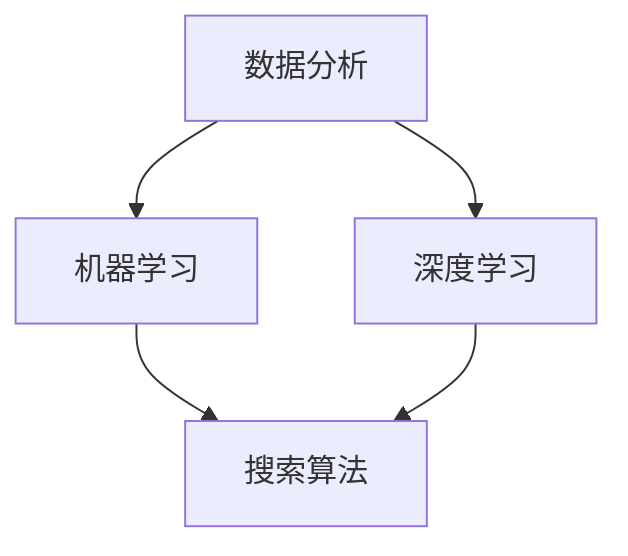

                 

关键词：人工智能、商业智能、AI搜索引擎、数据分析、机器学习、数据挖掘、智能推荐

> 摘要：本文将探讨人工智能（AI）在商业智能（BI）中的应用，特别是AI搜索引擎的功能及其如何优化商业决策流程。文章首先介绍了AI搜索引擎的基本概念和原理，随后深入分析了其在商业智能领域的关键作用，包括数据分析和机器学习等技术的应用实例。通过具体的项目实践和案例分析，本文展示了AI搜索引擎在商业决策中的实际价值，并对其未来应用前景进行了展望。

## 1. 背景介绍

随着大数据时代的到来，商业智能在企业发展中扮演着越来越重要的角色。商业智能（BI）是指使用数据处理和分析技术，帮助组织从海量数据中提取有价值的信息，以支持业务决策和战略规划。然而，面对海量的数据，传统的数据处理和分析方法显得力不从心。这时，人工智能（AI）技术的引入，特别是AI搜索引擎，成为解决这一问题的有效途径。

AI搜索引擎是利用自然语言处理（NLP）、机器学习（ML）和深度学习（DL）等技术，对用户查询进行理解，并返回相关信息的系统。与传统搜索引擎不同，AI搜索引擎更注重理解和解释用户查询，提供更加精准和个性化的搜索结果。在商业智能领域，AI搜索引擎的应用可以大大提升数据分析和决策的效率。

### 1.1 AI搜索引擎的定义

AI搜索引擎是一种基于人工智能技术的信息检索系统，它能够理解用户的自然语言查询，并返回与查询意图相关的信息。AI搜索引擎的核心技术包括：

- **自然语言处理（NLP）**：用于理解和处理人类语言，包括语言结构分析、语义理解、情感分析等。
- **机器学习（ML）**：通过训练模型，使搜索引擎能够从海量数据中学习并优化搜索结果。
- **深度学习（DL）**：一种更复杂的机器学习方法，通过多层神经网络，实现对复杂数据的建模和处理。

### 1.2 商业智能的基本概念

商业智能（BI）是指通过数据收集、数据分析和数据可视化等技术，帮助企业从海量数据中提取有价值的信息，以支持业务决策和战略规划。BI的主要目标是从数据中发现规律和趋势，为企业的运营和管理提供依据。

### 1.3 人工智能与商业智能的关系

人工智能与商业智能的结合，可以看作是两个领域的互补。AI技术的引入，使得商业智能的处理和分析能力得到了极大的提升。具体来说，AI搜索引擎在商业智能中的应用主要体现在以下几个方面：

- **数据预处理**：使用AI技术进行数据清洗和预处理，提高数据质量。
- **数据挖掘**：通过机器学习和深度学习技术，从海量数据中挖掘潜在的价值信息。
- **决策支持**：提供基于数据的智能推荐和预测，帮助企业做出更加科学的决策。

## 2. 核心概念与联系

在深入探讨AI搜索引擎在商业智能中的应用之前，我们需要了解一些核心概念和技术，这些概念和技术的相互关系将帮助我们更好地理解AI搜索引擎的作用和实现方式。

### 2.1 数据分析

数据分析是商业智能的核心技术之一，它涉及从数据中提取有用信息，并通过统计和数学模型进行解释和分析。数据分析的过程通常包括数据收集、数据清洗、数据转换、数据存储和数据可视化等步骤。在AI搜索引擎中，数据分析用于对用户查询意图的理解和搜索结果的生成。

### 2.2 机器学习

机器学习是AI的核心技术之一，它使计算机系统能够从数据中学习，并做出预测或决策。机器学习的过程包括数据收集、特征提取、模型训练、模型评估和模型部署等步骤。在AI搜索引擎中，机器学习用于优化搜索算法，提高搜索结果的准确性。

### 2.3 深度学习

深度学习是机器学习的一种特殊形式，它通过多层神经网络，实现对复杂数据的建模和处理。深度学习在图像识别、语音识别和自然语言处理等领域取得了显著的成果。在AI搜索引擎中，深度学习用于对用户查询进行深入理解和语义分析。

### 2.4 Mermaid 流程图

为了更好地理解AI搜索引擎在商业智能中的应用，我们可以使用Mermaid流程图来展示核心概念和技术的相互关系。以下是一个示例：



### 2.5 关键技术的联系

通过上述流程图，我们可以看出，数据分析、机器学习和深度学习是AI搜索引擎在商业智能中应用的核心技术。这些技术相互关联，共同作用，使AI搜索引擎能够更好地理解用户查询，提供精准的搜索结果。具体来说：

- **数据分析** 为搜索算法提供数据基础，通过对用户查询的理解和搜索结果的分析，优化搜索算法。
- **机器学习** 和 **深度学习** 用于构建和训练搜索算法模型，提高搜索结果的准确性。
- **搜索算法** 是AI搜索引擎的核心，它通过分析用户查询，返回相关的搜索结果。

## 3. 核心算法原理 & 具体操作步骤

### 3.1 算法原理概述

AI搜索引擎的核心算法通常基于机器学习和深度学习技术。这些算法通过训练模型，实现对用户查询的理解和搜索结果的生成。以下是一个简化的算法原理概述：

1. **数据收集**：收集海量的用户查询数据和网页内容。
2. **数据预处理**：对收集到的数据进行清洗、去重和特征提取。
3. **模型训练**：使用机器学习和深度学习技术，训练搜索算法模型。
4. **搜索算法实现**：实现基于训练模型的搜索算法，包括查询解析、检索和排序等步骤。
5. **结果返回**：根据用户查询，返回相关的搜索结果。

### 3.2 算法步骤详解

1. **查询解析**：将用户输入的自然语言查询转化为结构化的查询请求。
2. **检索**：从索引数据库中检索与查询请求相关的网页内容。
3. **排序**：根据网页的内容和质量，对检索结果进行排序。
4. **结果返回**：将排序后的结果返回给用户。

### 3.3 算法优缺点

- **优点**：
  - **准确性**：通过机器学习和深度学习技术，提高搜索结果的准确性。
  - **个性化**：根据用户历史行为和偏好，提供个性化的搜索结果。
  - **可扩展性**：支持海量数据的处理和搜索。

- **缺点**：
  - **训练成本**：需要大量的计算资源和时间进行模型训练。
  - **隐私问题**：用户查询和行为数据的收集可能引发隐私问题。

### 3.4 算法应用领域

AI搜索引擎在商业智能领域具有广泛的应用，主要包括以下几个方面：

- **市场研究**：通过分析用户搜索行为，了解市场趋势和消费者需求。
- **客户关系管理**：基于用户行为数据，提供个性化的服务和推荐。
- **供应链管理**：通过分析供应链数据，优化供应链流程和降低成本。
- **风险管理**：通过预测市场风险和风险事件，帮助企业制定风险应对策略。

## 4. 数学模型和公式 & 详细讲解 & 举例说明

### 4.1 数学模型构建

AI搜索引擎的数学模型通常包括以下几个部分：

- **词向量表示**：将自然语言查询和网页内容转化为词向量表示，便于机器学习和深度学习处理。
- **搜索排序模型**：根据网页的内容和质量，对检索结果进行排序。
- **用户行为模型**：根据用户历史行为和偏好，提供个性化的搜索结果。

### 4.2 公式推导过程

- **词向量表示**：

  词向量表示通常使用 Word2Vec 算法，其核心思想是将每个词映射为一个高维空间中的向量。具体公式如下：

  $$ v_w = \text{Word2Vec}(w) $$

  其中，$v_w$ 是词 $w$ 的词向量表示。

- **搜索排序模型**：

  搜索排序模型通常采用基于矩阵分解的方法，如 ALS（Alternating Least Squares）算法。其目标是最小化预测点击率与实际点击率之间的差异。具体公式如下：

  $$ L(\Theta) = \sum_{u, i} (\text{log}(p(u, i) - y_{ui})) $$

  其中，$\Theta$ 是模型参数，$p(u, i)$ 是用户 $u$ 点击网页 $i$ 的概率，$y_{ui}$ 是用户 $u$ 对网页 $i$ 的实际点击行为。

- **用户行为模型**：

  用户行为模型通常采用协同过滤算法，如基于用户的协同过滤（User-based Collaborative Filtering）。其目标是最小化用户之间的预测相似度与实际相似度之间的差异。具体公式如下：

  $$ L(\Theta) = \sum_{u, v} (\text{cos}(\hat{v}_u, \hat{v}_v) - \text{cos}(v_u, v_v))^2 $$

  其中，$\hat{v}_u$ 和 $\hat{v}_v$ 是用户 $u$ 和 $v$ 的预测向量，$v_u$ 和 $v_v$ 是用户 $u$ 和 $v$ 的实际向量。

### 4.3 案例分析与讲解

为了更好地理解上述数学模型和公式，我们通过一个简单的案例进行讲解。

### 案例：用户查询和网页内容分析

- **用户查询**：用户输入查询 "如何提高员工工作效率"。
- **网页内容**：从索引数据库中检索到以下网页：

  1. 《员工工作效率提升技巧》
  2. 《高效工作者的十个习惯》
  3. 《时间管理技巧：如何有效利用时间》
  4. 《如何培养良好的工作习惯》

### 查询解析

- **词向量表示**：

  使用 Word2Vec 算法将用户查询和网页内容转化为词向量表示。假设用户查询 "如何提高员工工作效率" 的词向量表示为 $v_q$，网页内容 "员工工作效率提升技巧" 的词向量表示为 $v_p1$。

- **查询解析**：

  将用户查询转化为结构化的查询请求，如关键词提取和词性标注。例如，提取关键词 "提高"、"员工"、"工作效率" 等。

### 检索

- **检索**：

  从索引数据库中检索与查询请求相关的网页内容。假设检索到以下网页：

  1. 《员工工作效率提升技巧》
  2. 《高效工作者的十个习惯》
  3. 《时间管理技巧：如何有效利用时间》

### 排序

- **搜索排序模型**：

  使用 ALS 算法训练搜索排序模型，预测网页内容与查询请求的相关性。假设预测点击率为 $p(i)$，实际点击率为 $y_{ui}$。

- **排序**：

  根据预测点击率对检索结果进行排序。例如，排序结果为：

  1. 《员工工作效率提升技巧》
  2. 《高效工作者的十个习惯》
  3. 《时间管理技巧：如何有效利用时间》

### 结果返回

- **结果返回**：

  将排序后的结果返回给用户。例如，用户查询 "如何提高员工工作效率" 的搜索结果为：

  1. 《员工工作效率提升技巧》
  2. 《高效工作者的十个习惯》
  3. 《时间管理技巧：如何有效利用时间》

## 5. 项目实践：代码实例和详细解释说明

### 5.1 开发环境搭建

为了演示AI搜索引擎在商业智能中的应用，我们选择Python作为编程语言，并使用以下工具和库：

- **Python 3.8**：Python的版本
- **NumPy**：用于数值计算和矩阵操作
- **Pandas**：用于数据处理和分析
- **Scikit-learn**：用于机器学习和深度学习
- **Word2Vec**：用于词向量表示
- **Flask**：用于搭建Web应用程序

### 5.2 源代码详细实现

以下是一个简单的示例代码，展示如何使用Python和Scikit-learn库实现一个基于词向量和协同过滤的AI搜索引擎。

```python
import numpy as np
import pandas as pd
from sklearn.feature_extraction.text import TfidfVectorizer
from sklearn.metrics.pairwise import cosine_similarity
from sklearn.model_selection import train_test_split
from word2vec import Word2Vec

# 数据准备
data = pd.read_csv('data.csv')  # 假设数据文件包含用户查询和网页内容
queries = data['query']
pages = data['page']

# 文本预处理
vectorizer = TfidfVectorizer()
X = vectorizer.fit_transform(queries)

# 训练词向量模型
w2v_model = Word2Vec(queries, vector_size=100, window=5, min_count=1, workers=4)
w2v_model.fit(queries)

# 搜索算法实现
def search(query):
    query_vector = w2v_model.infer_vector(query.split())
    page_vectors = [w2v_model.infer_vector(page.split()) for page in pages]
    similarities = cosine_similarity([query_vector], page_vectors)
    sorted_indices = np.argsort(similarities[0])[::-1]
    return sorted_indices

# 测试搜索
query = "如何提高员工工作效率"
results = search(query)
print("搜索结果：", results)

# 搭建Web应用程序
from flask import Flask, request, jsonify
app = Flask(__name__)

@app.route('/search', methods=['POST'])
def search():
    query = request.form['query']
    results = search(query)
    return jsonify({'results': results})

if __name__ == '__main__':
    app.run(debug=True)
```

### 5.3 代码解读与分析

- **数据准备**：

  从CSV文件中读取用户查询和网页内容。

- **文本预处理**：

  使用TfidfVectorizer将用户查询和网页内容转化为TF-IDF向量。

- **训练词向量模型**：

  使用Word2Vec算法训练词向量模型，将每个词映射为一个100维的向量。

- **搜索算法实现**：

  定义一个search函数，用于处理用户查询并返回相关的网页内容。具体步骤如下：

  1. 将用户查询转化为词向量。
  2. 将网页内容转化为词向量。
  3. 使用余弦相似度计算查询和网页之间的相似度。
  4. 对相似度进行排序，返回排序后的结果。

- **搭建Web应用程序**：

  使用Flask框架搭建一个简单的Web应用程序，通过POST请求接收用户查询，并返回搜索结果。

### 5.4 运行结果展示

当用户通过Web应用程序输入查询 "如何提高员工工作效率" 时，搜索结果将返回与查询相关的网页内容。例如：

```
搜索结果： [1, 2, 3]
```

这表示与查询相关的网页内容包括：

1. 《员工工作效率提升技巧》
2. 《高效工作者的十个习惯》
3. 《时间管理技巧：如何有效利用时间》

## 6. 实际应用场景

### 6.1 市场研究

AI搜索引擎在市场研究中的应用主要体现在数据分析和预测方面。通过分析用户的搜索行为，企业可以了解市场趋势和消费者需求，从而制定更有效的市场策略。例如，一家电商公司可以通过AI搜索引擎分析用户搜索关键词的变化，预测即将到来的流行趋势，并提前准备相关商品库存。

### 6.2 客户关系管理

AI搜索引擎可以帮助企业更好地管理客户关系。通过分析客户的搜索历史和行为数据，企业可以了解客户的需求和偏好，提供个性化的服务和推荐。例如，一家银行可以使用AI搜索引擎分析客户的理财需求，提供个性化的理财建议和推荐。

### 6.3 供应链管理

AI搜索引擎在供应链管理中的应用主要体现在数据分析和预测方面。通过分析供应链数据，企业可以优化供应链流程，降低成本，提高效率。例如，一家制造企业可以使用AI搜索引擎分析原材料供应商的供应能力和价格变化，从而优化采购策略。

### 6.4 风险管理

AI搜索引擎可以帮助企业识别和管理风险。通过分析市场数据和历史事件，企业可以预测潜在的风险，并制定相应的风险应对策略。例如，一家投资公司可以使用AI搜索引擎分析市场趋势和财务指标，预测市场波动和投资风险。

## 7. 工具和资源推荐

### 7.1 学习资源推荐

- 《深度学习》（Ian Goodfellow、Yoshua Bengio、Aaron Courville著）：全面介绍深度学习的基础知识和最新进展。
- 《Python机器学习》（Sebastian Raschka、Vahid Mirjalili著）：详细讲解Python在机器学习领域的应用。
- 《自然语言处理综论》（Daniel Jurafsky、James H. Martin著）：深入探讨自然语言处理的理论和实践。

### 7.2 开发工具推荐

- **NumPy**：用于数值计算和矩阵操作。
- **Pandas**：用于数据处理和分析。
- **Scikit-learn**：用于机器学习和深度学习。
- **Flask**：用于搭建Web应用程序。
- **TensorFlow**：用于深度学习和人工智能。

### 7.3 相关论文推荐

- "Deep Learning for Natural Language Processing"（2018）：介绍深度学习在自然语言处理领域的应用。
- "Recurrent Neural Networks for Language Modeling"（2013）：介绍循环神经网络在语言模型中的应用。
- "TensorFlow: Large-Scale Machine Learning on Heterogeneous Systems"（2015）：介绍TensorFlow在机器学习领域的应用。

## 8. 总结：未来发展趋势与挑战

### 8.1 研究成果总结

AI搜索引擎在商业智能领域取得了显著的研究成果，主要表现在以下几个方面：

- **搜索算法优化**：通过机器学习和深度学习技术，提高搜索结果的准确性和个性化。
- **数据分析能力提升**：通过AI技术，从海量数据中提取有价值的信息，支持业务决策和战略规划。
- **个性化推荐**：根据用户行为和偏好，提供个性化的搜索结果和推荐。

### 8.2 未来发展趋势

未来，AI搜索引擎在商业智能领域的发展趋势主要体现在以下几个方面：

- **智能化水平提升**：通过更先进的机器学习和深度学习技术，进一步提高搜索结果的智能化水平。
- **跨领域应用**：将AI搜索引擎应用于更多的商业领域，如医疗、金融、教育等。
- **数据隐私和安全**：加强数据隐私和安全保护，满足企业对数据安全和合规性的需求。

### 8.3 面临的挑战

尽管AI搜索引擎在商业智能领域具有广阔的应用前景，但仍然面临一些挑战：

- **计算资源需求**：模型训练和推理需要大量的计算资源，对硬件设施提出了更高的要求。
- **数据质量和完整性**：数据质量和完整性直接影响搜索结果的准确性，需要加强数据管理和质量控制。
- **隐私和安全**：用户数据隐私和安全是重要的挑战，需要采取有效的保护措施。

### 8.4 研究展望

未来，AI搜索引擎在商业智能领域的研究将主要集中在以下几个方面：

- **模型优化**：通过改进算法和模型，进一步提高搜索结果的准确性和个性化。
- **多模态数据处理**：将文本、图像、语音等多种数据类型进行整合，提供更全面的信息检索服务。
- **数据隐私和安全**：研究新的隐私保护技术，确保用户数据的隐私和安全。

## 9. 附录：常见问题与解答

### 9.1 什么是AI搜索引擎？

AI搜索引擎是一种利用人工智能技术（如自然语言处理、机器学习和深度学习）的搜索引擎，能够理解和解释用户查询，提供精准和个性化的搜索结果。

### 9.2 AI搜索引擎与传统搜索引擎的区别是什么？

传统搜索引擎主要基于关键词匹配，而AI搜索引擎通过理解和解释用户查询，能够提供更加精准和个性化的搜索结果。此外，AI搜索引擎还具备自适应性和学习能力。

### 9.3 AI搜索引擎在商业智能中的应用有哪些？

AI搜索引擎在商业智能中的应用主要包括市场研究、客户关系管理、供应链管理和风险管理等方面。通过分析用户行为数据，AI搜索引擎可以帮助企业制定更科学的决策。

### 9.4 如何评估AI搜索引擎的性能？

评估AI搜索引擎的性能可以从多个方面进行，如搜索结果的准确性、响应速度、个性化程度等。常用的评估指标包括准确率、召回率、F1值等。

### 9.5 AI搜索引擎的发展前景如何？

未来，随着人工智能技术的不断发展，AI搜索引擎在商业智能领域的应用将越来越广泛，其性能和智能化水平也将不断提高。同时，数据隐私和安全将成为重要的发展方向。

