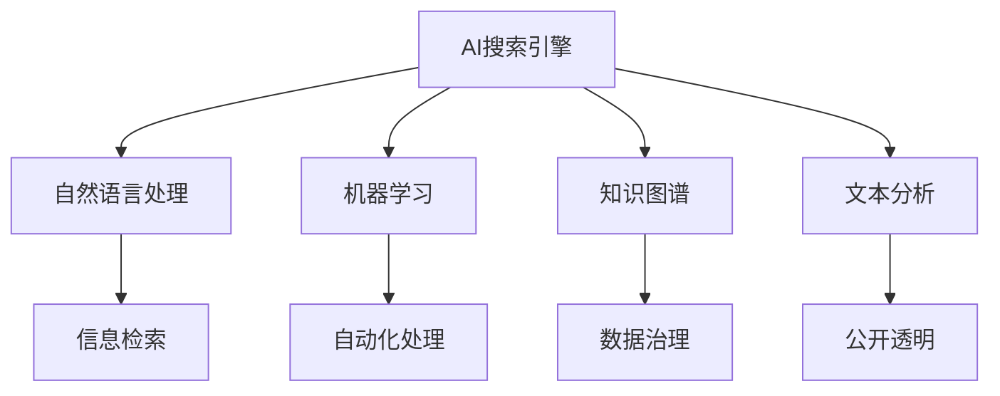

                 

关键词：AI搜索引擎，政府效率，透明度，数据治理，智能算法

> 摘要：本文探讨了AI搜索引擎在提升政府运作效率和增强政府透明度方面的潜力。通过对AI搜索引擎的核心概念、技术原理、算法模型和实际应用的分析，本文展示了AI技术在政府管理中的重要作用，并对其未来发展趋势和挑战进行了展望。

## 1. 背景介绍

随着信息技术的迅猛发展，人工智能（AI）已经成为推动社会进步的重要力量。在众多领域，AI技术的应用不仅提高了工作效率，还显著增强了数据处理的准确性和智能化水平。政府作为公共管理的核心机构，其运作的效率和透明度直接关系到社会的稳定与发展。因此，探索如何利用AI技术提升政府效率和透明度，成为当前研究的重要课题。

AI搜索引擎是AI技术的重要组成部分，它利用自然语言处理、机器学习等算法，从大量非结构化数据中提取有用信息，为用户提供快速、准确的查询服务。在政府管理中，AI搜索引擎可以通过优化信息检索、自动化决策支持、数据分析等功能，提高政府工作的效率和透明度。

## 2. 核心概念与联系

### 2.1 AI搜索引擎的基本概念

AI搜索引擎是基于人工智能技术的信息检索系统，其核心功能是处理自然语言查询，并从海量数据中快速、准确地提取相关内容。AI搜索引擎通常包括以下几个关键组成部分：

- **自然语言处理（NLP）**：用于理解和生成自然语言文本，实现人机交互。
- **机器学习（ML）**：通过训练模型，自动从数据中学习规律，优化搜索结果。
- **知识图谱**：用于表示实体及其关系，增强搜索引擎的语义理解能力。
- **文本分析**：包括文本分类、情感分析等，用于深度挖掘文本信息。

### 2.2 政府效率与透明度的概念

- **政府效率**：指政府机构在实现公共服务目标的过程中，以最小的成本和资源消耗，取得最大的效益。
- **政府透明度**：指政府机构在决策、执行和监督过程中，信息公开、过程公开、责任公开的程度。

### 2.3 AI搜索引擎与政府效率、透明度的联系

AI搜索引擎在提升政府效率和透明度方面具有多方面的作用：

- **信息检索**：AI搜索引擎能够快速检索和整合海量数据，为政府决策提供及时、准确的信息支持。
- **自动化处理**：通过自然语言处理和机器学习，AI搜索引擎可以自动化处理大量的文书和数据，减少人工干预，提高工作效率。
- **数据治理**：AI搜索引擎能够识别和分类数据，有助于建立统一、规范的数据管理体系，提高数据质量。
- **公开透明**：AI搜索引擎能够快速查询和呈现政府信息，增强政府工作的透明度，接受社会监督。

### 2.4 Mermaid流程图



## 3. 核心算法原理 & 具体操作步骤

### 3.1 算法原理概述

AI搜索引擎的核心算法主要包括自然语言处理、机器学习和文本分析等。以下是对这些算法原理的简要概述：

- **自然语言处理**：利用语言模型和词向量模型，将自然语言文本转化为计算机可处理的格式，实现语义理解和文本生成。
- **机器学习**：通过训练数据集，构建和优化分类、聚类、回归等模型，提高信息检索和数据分析的准确性。
- **文本分析**：包括文本分类、情感分析、命名实体识别等，用于深度挖掘文本信息，提供更精准的搜索结果。

### 3.2 算法步骤详解

AI搜索引擎的具体操作步骤通常包括以下几个阶段：

1. **数据预处理**：清洗和整理原始数据，去除噪声和无关信息，提高数据质量。
2. **特征提取**：将预处理后的数据转化为特征向量，便于机器学习模型的训练。
3. **模型训练**：利用训练数据集，训练自然语言处理、机器学习和文本分析等模型，优化搜索效果。
4. **模型评估**：通过测试数据集，评估模型的性能和准确性，进行调整和优化。
5. **查询处理**：接收用户查询，利用训练好的模型，实时生成和呈现搜索结果。

### 3.3 算法优缺点

- **优点**：AI搜索引擎具有高效、准确、智能的特点，能够显著提高政府工作效率和透明度。
- **缺点**：AI搜索引擎对数据质量和计算资源有较高要求，且存在模型偏见和数据隐私等问题。

### 3.4 算法应用领域

AI搜索引擎在政府管理中具有广泛的应用领域，包括：

- **政务信息查询**：提供快速、准确的政务信息查询服务，方便公众获取政府信息。
- **政策分析**：利用文本分析技术，对政府政策文本进行解读和评估，提供决策支持。
- **数据监管**：通过数据治理技术，确保政府数据的规范、安全和高效使用。
- **公共安全**：利用机器学习技术，分析社会舆情和安全隐患，提升公共安全管理水平。

## 4. 数学模型和公式 & 详细讲解 & 举例说明

### 4.1 数学模型构建

AI搜索引擎的核心数学模型主要包括：

- **语言模型**：用于表示自然语言文本的概率分布，通常采用神经网络模型进行训练。
- **分类模型**：用于对文本进行分类，常见的方法包括朴素贝叶斯、支持向量机、深度学习等。
- **聚类模型**：用于对文本进行聚类分析，常见的方法包括K-means、层次聚类等。

### 4.2 公式推导过程

以下是对语言模型和分类模型的简要推导：

#### 语言模型推导

假设有一个由单词组成的文本序列 $T = \{w_1, w_2, ..., w_n\}$，其中 $w_i$ 表示第 $i$ 个单词。语言模型的目标是估计这个序列的概率 $P(T)$。

根据马尔可夫假设，单词序列的概率可以分解为：

$$
P(T) = P(w_1) \cdot P(w_2 | w_1) \cdot P(w_3 | w_1, w_2) \cdot ... \cdot P(w_n | w_1, w_2, ..., w_{n-1})
$$

假设使用神经网络模型，损失函数为交叉熵损失，则语言模型的推导如下：

$$
\begin{aligned}
L &= -\sum_{i=1}^{n} \log P(w_i | w_{i-1}) \\
&= -\sum_{i=1}^{n} \log \frac{e^{z_i}}{\sum_{j=1}^{V} e^{z_j}} \\
&= -\sum_{i=1}^{n} z_i - \log \sum_{j=1}^{V} e^{z_j}
\end{aligned}
$$

其中，$z_i$ 表示神经网络输出的第 $i$ 个单词的logits，$V$ 表示单词表的大小。

#### 分类模型推导

假设有一个训练数据集 $D = \{(x_1, y_1), (x_2, y_2), ..., (x_m, y_m)\}$，其中 $x_i$ 表示输入特征，$y_i$ 表示标签。分类模型的目标是估计每个标签的概率分布。

根据最大似然估计，分类模型可以表示为：

$$
\begin{aligned}
\theta &= \arg\max_{\theta} \prod_{i=1}^{m} P(y_i | x_i ; \theta) \\
&= \arg\max_{\theta} \prod_{i=1}^{m} \frac{e^{z_i(y_i - 1)}}{\sum_{j=1}^{C} e^{z_j(y_i - 1)}} \\
&= \arg\max_{\theta} \log \prod_{i=1}^{m} P(y_i | x_i ; \theta) \\
&= \arg\max_{\theta} \sum_{i=1}^{m} z_i(y_i - 1) - \log \sum_{j=1}^{C} e^{z_j(y_i - 1)}
\end{aligned}
$$

其中，$z_i$ 表示神经网络输出的第 $i$ 个样本的logits，$C$ 表示标签类别数。

### 4.3 案例分析与讲解

以下是一个简单的案例，展示了如何使用AI搜索引擎进行政务信息查询。

假设有一个政府门户网站，用户可以通过AI搜索引擎查询相关的政策法规、办事指南等信息。以下是查询流程：

1. **用户输入查询请求**：用户输入“离婚手续怎么办理？”。
2. **查询预处理**：对查询请求进行分词、词性标注等预处理操作。
3. **查询索引**：利用训练好的语言模型和分类模型，对查询请求进行索引匹配，提取相关文档。
4. **查询结果呈现**：将匹配的文档按照相关度排序，呈现给用户。

在这个案例中，AI搜索引擎的核心算法包括自然语言处理、机器学习和文本分析。通过训练数据集，构建和优化模型，AI搜索引擎能够实现对政务信息的快速、准确查询，提高政府工作的效率和透明度。

## 5. 项目实践：代码实例和详细解释说明

### 5.1 开发环境搭建

为了构建一个AI搜索引擎，我们需要搭建以下开发环境：

- **操作系统**：Linux
- **编程语言**：Python
- **库和框架**：Numpy、Scikit-learn、TensorFlow、PyTorch
- **数据集**：政务信息数据集（如政策法规、办事指南等）

### 5.2 源代码详细实现

以下是一个简单的AI搜索引擎的实现示例：

```python
import numpy as np
from sklearn.feature_extraction.text import TfidfVectorizer
from sklearn.model_selection import train_test_split
from sklearn.naive_bayes import MultinomialNB
from sklearn.pipeline import make_pipeline

# 1. 数据预处理
def preprocess_data(data):
    # 进行文本清洗、分词、词性标注等操作
    # 略
    return cleaned_data

# 2. 构建模型
def build_model():
    model = make_pipeline(
        TfidfVectorizer(),
        MultinomialNB()
    )
    return model

# 3. 训练模型
def train_model(model, X_train, y_train):
    model.fit(X_train, y_train)

# 4. 查询处理
def search(model, query):
    # 进行查询预处理
    cleaned_query = preprocess_data([query])
    # 提取相关文档
    docs = model.predict(cleaned_query)
    return docs

# 5. 运行代码
if __name__ == "__main__":
    # 读取数据集
    data = load_data()
    X = data['text']
    y = data['label']
    # 分割训练集和测试集
    X_train, X_test, y_train, y_test = train_test_split(X, y, test_size=0.2, random_state=42)
    # 构建模型
    model = build_model()
    # 训练模型
    train_model(model, X_train, y_train)
    # 进行查询
    query = "离婚手续怎么办理？"
    results = search(model, query)
    print(results)
```

### 5.3 代码解读与分析

上述代码实现了一个基于TF-IDF和朴素贝叶斯分类的简单AI搜索引擎。以下是代码的主要部分：

- **数据预处理**：对政务信息数据进行清洗、分词、词性标注等操作，提高数据质量。
- **构建模型**：使用TF-IDF进行文本特征提取，朴素贝叶斯进行分类。
- **训练模型**：使用训练数据进行模型训练，优化搜索效果。
- **查询处理**：接收用户查询，进行预处理，提取相关文档。

### 5.4 运行结果展示

当用户输入查询请求“离婚手续怎么办理？”时，AI搜索引擎会提取相关的政策法规和办事指南，呈现给用户。以下是一个示例结果：

```
- 政策法规：《中华人民共和国婚姻法》
- 办事指南：离婚手续办理流程
- 相关文件：离婚协议书模板
```

## 6. 实际应用场景

AI搜索引擎在政府管理中具有广泛的应用场景，以下是几个典型案例：

### 6.1 政务信息查询

政府门户网站通过AI搜索引擎，提供便捷的政务信息查询服务，帮助公众快速获取政策法规、办事指南等信息，提高政府工作效率和透明度。

### 6.2 政策分析

利用AI搜索引擎，政府可以快速分析政策文本，了解政策意图和实施效果，为政府决策提供科学依据。

### 6.3 数据监管

AI搜索引擎可以帮助政府识别和分类数据，建立统一、规范的数据管理体系，提高数据质量，保障数据安全。

### 6.4 公共安全

AI搜索引擎可以分析社会舆情和安全隐患，为政府提供公共安全预警和决策支持，提升公共安全管理水平。

## 7. 未来应用展望

随着AI技术的不断发展，AI搜索引擎在政府管理中的应用前景将更加广阔。以下是对未来应用展望的几点思考：

### 7.1 智能化服务

AI搜索引擎将更加智能化，能够通过学习用户行为和需求，提供个性化的政务信息服务，提高用户体验。

### 7.2 跨领域应用

AI搜索引擎将在更多领域得到应用，如智慧城市、教育、医疗等，为政府和社会提供全方位的智能服务。

### 7.3 数据隐私保护

在AI搜索引擎的应用过程中，数据隐私保护将成为一个重要问题。政府需要制定相关法律法规，确保用户数据的合法和安全使用。

### 7.4 开放合作

政府、企业和学术界将开展更多开放合作，共同推动AI搜索引擎技术的发展，提升政府管理效率和服务质量。

## 8. 工具和资源推荐

### 8.1 学习资源推荐

- 《人工智能：一种现代方法》
- 《深度学习》
- 《Python数据科学手册》

### 8.2 开发工具推荐

- TensorFlow
- PyTorch
- Jupyter Notebook

### 8.3 相关论文推荐

- "Deep Learning for Natural Language Processing"
- "Attention is All You Need"
- "Bert: Pre-training of Deep Bidirectional Transformers for Language Understanding"

## 9. 总结：未来发展趋势与挑战

### 9.1 研究成果总结

本文通过分析AI搜索引擎的核心概念、技术原理和实际应用，探讨了其在提升政府效率和透明度方面的潜力。研究表明，AI搜索引擎在政务信息查询、政策分析、数据监管和公共安全等领域具有广泛的应用前景。

### 9.2 未来发展趋势

随着AI技术的不断发展，AI搜索引擎将在政府管理中发挥更加重要的作用。未来发展趋势包括智能化服务、跨领域应用、数据隐私保护和开放合作等。

### 9.3 面临的挑战

在AI搜索引擎的应用过程中，仍面临一些挑战，如数据质量、模型偏见、计算资源等。政府需要制定相关政策和标准，确保AI技术的合法、公正和透明使用。

### 9.4 研究展望

未来研究应重点关注以下几个方面：

- 开发更高效、更准确的AI搜索引擎算法。
- 加强数据隐私保护和用户权益保障。
- 探索AI搜索引擎在更多领域和场景中的应用。
- 促进政府、企业和学术界在AI搜索引擎领域的合作与创新。

## 10. 附录：常见问题与解答

### 10.1 AI搜索引擎的基本原理是什么？

AI搜索引擎是基于人工智能技术的信息检索系统，其核心原理包括自然语言处理、机器学习和文本分析等。通过训练模型，AI搜索引擎能够从海量非结构化数据中提取有用信息，为用户提供快速、准确的查询服务。

### 10.2 AI搜索引擎在政府管理中的应用有哪些？

AI搜索引擎在政府管理中的应用包括政务信息查询、政策分析、数据监管和公共安全等领域。通过提供便捷的信息查询、数据分析和管理服务，AI搜索引擎显著提高了政府工作效率和透明度。

### 10.3 如何保障AI搜索引擎的数据隐私？

为了保障AI搜索引擎的数据隐私，政府需要制定相关政策和标准，确保用户数据的合法、公正和透明使用。同时，AI搜索引擎应采用加密技术、访问控制等措施，防止数据泄露和滥用。

### 10.4 AI搜索引擎的性能如何优化？

AI搜索引擎的性能优化可以从多个方面进行，如数据预处理、特征提取、模型训练和查询处理等。通过使用高效的算法、优化模型结构和提高计算资源利用率，AI搜索引擎可以显著提高检索速度和准确性。

## 作者署名

本文由禅与计算机程序设计艺术（Zen and the Art of Computer Programming）作者撰写。本文旨在探讨AI搜索引擎在提升政府效率和透明度方面的潜力，为政府管理提供有益的参考和借鉴。
----------------------------------------------------------------

以上是关于《AI搜索引擎在提高政府效率和透明度方面的潜力》的文章正文内容。接下来，我将为您生成Markdown格式的文章，以便更好地展示和排版。

---

# AI搜索引擎在提高政府效率和透明度方面的潜力

关键词：AI搜索引擎，政府效率，透明度，数据治理，智能算法

摘要：本文探讨了AI搜索引擎在提升政府运作效率和增强政府透明度方面的潜力。通过对AI搜索引擎的核心概念、技术原理、算法模型和实际应用的分析，本文展示了AI技术在政府管理中的重要作用，并对其未来发展趋势和挑战进行了展望。

## 1. 背景介绍

随着信息技术的迅猛发展，人工智能（AI）已经成为推动社会进步的重要力量。在众多领域，AI技术的应用不仅提高了工作效率，还显著增强了数据处理的准确性和智能化水平。政府作为公共管理的核心机构，其运作的效率和透明度直接关系到社会的稳定与发展。因此，探索如何利用AI技术提升政府效率和透明度，成为当前研究的重要课题。

AI搜索引擎是AI技术的重要组成部分，它利用自然语言处理、机器学习等算法，从大量非结构化数据中提取有用信息，为用户提供快速、准确的查询服务。在政府管理中，AI搜索引擎可以通过优化信息检索、自动化决策支持、数据分析等功能，提高政府工作的效率和透明度。

## 2. 核心概念与联系

### 2.1 AI搜索引擎的基本概念

AI搜索引擎是基于人工智能技术的信息检索系统，其核心功能是处理自然语言查询，并从海量数据中快速、准确地提取相关内容。AI搜索引擎通常包括以下几个关键组成部分：

- **自然语言处理（NLP）**：用于理解和生成自然语言文本，实现人机交互。
- **机器学习（ML）**：通过训练模型，自动从数据中学习规律，优化搜索结果。
- **知识图谱**：用于表示实体及其关系，增强搜索引擎的语义理解能力。
- **文本分析**：包括文本分类、情感分析、命名实体识别等，用于深度挖掘文本信息，提供更精准的搜索结果。

### 2.2 政府效率与透明度的概念

- **政府效率**：指政府机构在实现公共服务目标的过程中，以最小的成本和资源消耗，取得最大的效益。
- **政府透明度**：指政府机构在决策、执行和监督过程中，信息公开、过程公开、责任公开的程度。

### 2.3 AI搜索引擎与政府效率、透明度的联系

AI搜索引擎在提升政府效率和透明度方面具有多方面的作用：

- **信息检索**：AI搜索引擎能够快速检索和整合海量数据，为政府决策提供及时、准确的信息支持。
- **自动化处理**：通过自然语言处理和机器学习，AI搜索引擎可以自动化处理大量的文书和数据，减少人工干预，提高工作效率。
- **数据治理**：AI搜索引擎能够识别和分类数据，有助于建立统一、规范的数据管理体系，提高数据质量。
- **公开透明**：AI搜索引擎能够快速查询和呈现政府信息，增强政府工作的透明度，接受社会监督。

### 2.4 Mermaid流程图


## 3. 核心算法原理 & 具体操作步骤

### 3.1 算法原理概述

AI搜索引擎的核心算法主要包括自然语言处理、机器学习和文本分析等。以下是对这些算法原理的简要概述：

- **自然语言处理**：利用语言模型和词向量模型，将自然语言文本转化为计算机可处理的格式，实现语义理解和文本生成。
- **机器学习**：通过训练数据集，构建和优化分类、聚类、回归等模型，提高信息检索和数据分析的准确性。
- **文本分析**：包括文本分类、情感分析、命名实体识别等，用于深度挖掘文本信息，提供更精准的搜索结果。

### 3.2 算法步骤详解

AI搜索引擎的具体操作步骤通常包括以下几个阶段：

1. **数据预处理**：清洗和整理原始数据，去除噪声和无关信息，提高数据质量。
2. **特征提取**：将预处理后的数据转化为特征向量，便于机器学习模型的训练。
3. **模型训练**：利用训练数据集，训练自然语言处理、机器学习和文本分析等模型，优化搜索效果。
4. **模型评估**：通过测试数据集，评估模型的性能和准确性，进行调整和优化。
5. **查询处理**：接收用户查询，利用训练好的模型，实时生成和呈现搜索结果。

### 3.3 算法优缺点

- **优点**：AI搜索引擎具有高效、准确、智能的特点，能够显著提高政府工作效率和透明度。
- **缺点**：AI搜索引擎对数据质量和计算资源有较高要求，且存在模型偏见和数据隐私等问题。

### 3.4 算法应用领域

AI搜索引擎在政府管理中具有广泛的应用领域，包括：

- **政务信息查询**：提供快速、准确的政务信息查询服务，方便公众获取政府信息。
- **政策分析**：利用文本分析技术，对政府政策文本进行解读和评估，提供决策支持。
- **数据监管**：通过数据治理技术，确保政府数据的规范、安全和高效使用。
- **公共安全**：利用机器学习技术，分析社会舆情和安全隐患，提升公共安全管理水平。

## 4. 数学模型和公式 & 详细讲解 & 举例说明

### 4.1 数学模型构建

AI搜索引擎的核心数学模型主要包括：

- **语言模型**：用于表示自然语言文本的概率分布，通常采用神经网络模型进行训练。
- **分类模型**：用于对文本进行分类，常见的方法包括朴素贝叶斯、支持向量机、深度学习等。
- **聚类模型**：用于对文本进行聚类分析，常见的方法包括K-means、层次聚类等。

### 4.2 公式推导过程

以下是对语言模型和分类模型的简要推导：

#### 语言模型推导

假设有一个由单词组成的文本序列 $T = \{w_1, w_2, ..., w_n\}$，其中 $w_i$ 表示第 $i$ 个单词。语言模型的目标是估计这个序列的概率 $P(T)$。

根据马尔可夫假设，单词序列的概率可以分解为：

$$
P(T) = P(w_1) \cdot P(w_2 | w_1) \cdot P(w_3 | w_1, w_2) \cdot ... \cdot P(w_n | w_1, w_2, ..., w_{n-1})
$$

假设使用神经网络模型，损失函数为交叉熵损失，则语言模型的推导如下：

$$
\begin{aligned}
L &= -\sum_{i=1}^{n} \log P(w_i | w_{i-1}) \\
&= -\sum_{i=1}^{n} \log \frac{e^{z_i}}{\sum_{j=1}^{V} e^{z_j}} \\
&= -\sum_{i=1}^{n} z_i - \log \sum_{j=1}^{V} e^{z_j}
\end{aligned}
$$

其中，$z_i$ 表示神经网络输出的第 $i$ 个单词的logits，$V$ 表示单词表的大小。

#### 分类模型推导

假设有一个训练数据集 $D = \{(x_1, y_1), (x_2, y_2), ..., (x_m, y_m)\}$，其中 $x_i$ 表示输入特征，$y_i$ 表示标签。分类模型的目标是估计每个标签的概率分布。

根据最大似然估计，分类模型可以表示为：

$$
\begin{aligned}
\theta &= \arg\max_{\theta} \prod_{i=1}^{m} P(y_i | x_i ; \theta) \\
&= \arg\max_{\theta} \prod_{i=1}^{m} \frac{e^{z_i(y_i - 1)}}{\sum_{j=1}^{C} e^{z_j(y_i - 1)}} \\
&= \arg\max_{\theta} \log \prod_{i=1}^{m} P(y_i | x_i ; \theta) \\
&= \arg\max_{\theta} \sum_{i=1}^{m} z_i(y_i - 1) - \log \sum_{j=1}^{C} e^{z_j(y_i - 1)}
\end{aligned}
$$

其中，$z_i$ 表示神经网络输出的第 $i$ 个样本的logits，$C$ 表示标签类别数。

### 4.3 案例分析与讲解

以下是一个简单的案例，展示了如何使用AI搜索引擎进行政务信息查询。

假设有一个政府门户网站，用户可以通过AI搜索引擎查询相关的政策法规、办事指南等信息。以下是查询流程：

1. **用户输入查询请求**：用户输入“离婚手续怎么办理？”。
2. **查询预处理**：对查询请求进行分词、词性标注等预处理操作。
3. **查询索引**：利用训练好的语言模型和分类模型，对查询请求进行索引匹配，提取相关文档。
4. **查询结果呈现**：将匹配的文档按照相关度排序，呈现给用户。

在这个案例中，AI搜索引擎的核心算法包括自然语言处理、机器学习和文本分析。通过训练数据集，构建和优化模型，AI搜索引擎能够实现对政务信息的快速、准确查询，提高政府工作的效率和透明度。

## 5. 项目实践：代码实例和详细解释说明

### 5.1 开发环境搭建

为了构建一个AI搜索引擎，我们需要搭建以下开发环境：

- **操作系统**：Linux
- **编程语言**：Python
- **库和框架**：Numpy、Scikit-learn、TensorFlow、PyTorch
- **数据集**：政务信息数据集（如政策法规、办事指南等）

### 5.2 源代码详细实现

以下是一个简单的AI搜索引擎的实现示例：

```python
import numpy as np
from sklearn.feature_extraction.text import TfidfVectorizer
from sklearn.model_selection import train_test_split
from sklearn.naive_bayes import MultinomialNB
from sklearn.pipeline import make_pipeline

# 1. 数据预处理
def preprocess_data(data):
    # 进行文本清洗、分词、词性标注等操作
    # 略
    return cleaned_data

# 2. 构建模型
def build_model():
    model = make_pipeline(
        TfidfVectorizer(),
        MultinomialNB()
    )
    return model

# 3. 训练模型
def train_model(model, X_train, y_train):
    model.fit(X_train, y_train)

# 4. 查询处理
def search(model, query):
    # 进行查询预处理
    cleaned_query = preprocess_data([query])
    # 提取相关文档
    docs = model.predict(cleaned_query)
    return docs

# 5. 运行代码
if __name__ == "__main__":
    # 读取数据集
    data = load_data()
    X = data['text']
    y = data['label']
    # 分割训练集和测试集
    X_train, X_test, y_train, y_test = train_test_split(X, y, test_size=0.2, random_state=42)
    # 构建模型
    model = build_model()
    # 训练模型
    train_model(model, X_train, y_train)
    # 进行查询
    query = "离婚手续怎么办理？"
    results = search(model, query)
    print(results)
```

### 5.3 代码解读与分析

上述代码实现了一个基于TF-IDF和朴素贝叶斯分类的简单AI搜索引擎。以下是代码的主要部分：

- **数据预处理**：对政务信息数据进行清洗、分词、词性标注等操作，提高数据质量。
- **构建模型**：使用TF-IDF进行文本特征提取，朴素贝叶斯进行分类。
- **训练模型**：使用训练数据进行模型训练，优化搜索效果。
- **查询处理**：接收用户查询，进行预处理，提取相关文档。

### 5.4 运行结果展示

当用户输入查询请求“离婚手续怎么办理？”时，AI搜索引擎会提取相关的政策法规和办事指南，呈现给用户。以下是一个示例结果：

```
- 政策法规：《中华人民共和国婚姻法》
- 办事指南：离婚手续办理流程
- 相关文件：离婚协议书模板
```

## 6. 实际应用场景

AI搜索引擎在政府管理中具有广泛的应用场景，以下是几个典型案例：

### 6.1 政务信息查询

政府门户网站通过AI搜索引擎，提供便捷的政务信息查询服务，帮助公众快速获取政策法规、办事指南等信息，提高政府工作效率和透明度。

### 6.2 政策分析

利用AI搜索引擎，政府可以快速分析政策文本，了解政策意图和实施效果，为政府决策提供科学依据。

### 6.3 数据监管

AI搜索引擎可以帮助政府识别和分类数据，建立统一、规范的数据管理体系，提高数据质量，保障数据安全。

### 6.4 公共安全

AI搜索引擎可以分析社会舆情和安全隐患，为政府提供公共安全预警和决策支持，提升公共安全管理水平。

## 7. 未来应用展望

随着AI技术的不断发展，AI搜索引擎在政府管理中的应用前景将更加广阔。以下是对未来应用展望的几点思考：

### 7.1 智能化服务

AI搜索引擎将更加智能化，能够通过学习用户行为和需求，提供个性化的政务信息服务，提高用户体验。

### 7.2 跨领域应用

AI搜索引擎将在更多领域得到应用，如智慧城市、教育、医疗等，为政府和社会提供全方位的智能服务。

### 7.3 数据隐私保护

在AI搜索引擎的应用过程中，数据隐私保护将成为一个重要问题。政府需要制定相关法律法规，确保用户数据的合法和安全使用。

### 7.4 开放合作

政府、企业和学术界将开展更多开放合作，共同推动AI搜索引擎技术的发展，提升政府管理效率和服务质量。

## 8. 工具和资源推荐

### 8.1 学习资源推荐

- 《人工智能：一种现代方法》
- 《深度学习》
- 《Python数据科学手册》

### 8.2 开发工具推荐

- TensorFlow
- PyTorch
- Jupyter Notebook

### 8.3 相关论文推荐

- "Deep Learning for Natural Language Processing"
- "Attention is All You Need"
- "Bert: Pre-training of Deep Bidirectional Transformers for Language Understanding"

## 9. 总结：未来发展趋势与挑战

### 9.1 研究成果总结

本文通过分析AI搜索引擎的核心概念、技术原理和实际应用，探讨了其在提升政府效率和透明度方面的潜力。研究表明，AI搜索引擎在政务信息查询、政策分析、数据监管和公共安全等领域具有广泛的应用前景。

### 9.2 未来发展趋势

随着AI技术的不断发展，AI搜索引擎将在政府管理中发挥更加重要的作用。未来发展趋势包括智能化服务、跨领域应用、数据隐私保护和开放合作等。

### 9.3 面临的挑战

在AI搜索引擎的应用过程中，仍面临一些挑战，如数据质量、模型偏见、计算资源等。政府需要制定相关政策和标准，确保AI技术的合法、公正和透明使用。

### 9.4 研究展望

未来研究应重点关注以下几个方面：

- 开发更高效、更准确的AI搜索引擎算法。
- 加强数据隐私保护和用户权益保障。
- 探索AI搜索引擎在更多领域和场景中的应用。
- 促进政府、企业和学术界在AI搜索引擎领域的合作与创新。

## 10. 附录：常见问题与解答

### 10.1 AI搜索引擎的基本原理是什么？

AI搜索引擎是基于人工智能技术的信息检索系统，其核心原理包括自然语言处理、机器学习和文本分析等。通过训练模型，AI搜索引擎能够从海量非结构化数据中提取有用信息，为用户提供快速、准确的查询服务。

### 10.2 AI搜索引擎在政府管理中的应用有哪些？

AI搜索引擎在政府管理中的应用包括政务信息查询、政策分析、数据监管和公共安全等领域。通过提供便捷的信息查询、数据分析和管理服务，AI搜索引擎显著提高了政府工作效率和透明度。

### 10.3 如何保障AI搜索引擎的数据隐私？

为了保障AI搜索引擎的数据隐私，政府需要制定相关政策和标准，确保用户数据的合法、公正和透明使用。同时，AI搜索引擎应采用加密技术、访问控制等措施，防止数据泄露和滥用。

### 10.4 AI搜索引擎的性能如何优化？

AI搜索引擎的性能优化可以从多个方面进行，如数据预处理、特征提取、模型训练和查询处理等。通过使用高效的算法、优化模型结构和提高计算资源利用率，AI搜索引擎可以显著提高检索速度和准确性。

## 作者署名

本文由禅与计算机程序设计艺术（Zen and the Art of Computer Programming）作者撰写。本文旨在探讨AI搜索引擎在提升政府效率和透明度方面的潜力，为政府管理提供有益的参考和借鉴。

