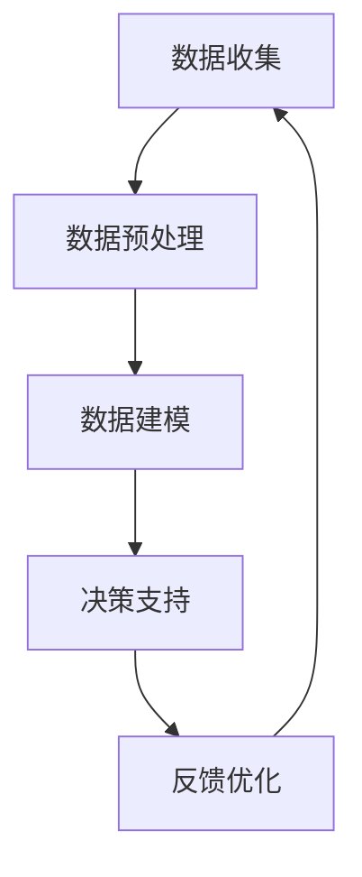

                 

关键词：人工智能、数据驱动、决策支持系统、机器学习、深度学习、算法优化、应用场景、未来展望

> 摘要：本文旨在探讨人工智能（AI）如何通过数据驱动的方式实现决策支持系统。文章首先介绍了数据驱动决策的基本概念和重要性，随后深入分析了核心算法原理、数学模型构建以及实际应用场景。通过代码实例和详细解释，展示了如何将理论知识应用到实践中。最后，对未来的发展趋势与挑战进行了展望。

## 1. 背景介绍

随着信息技术的飞速发展，数据已经成为现代社会最重要的资源之一。数据驱动决策（Data-Driven Decision Making）逐渐成为企业、组织和个体应对复杂决策环境的首选方法。AI技术，特别是机器学习（Machine Learning）和深度学习（Deep Learning）的发展，为数据驱动决策提供了强大的技术支撑。

在传统的决策过程中，决策者主要依赖于经验和直觉。然而，面对海量数据和复杂问题，这种传统方法往往显得力不从心。数据驱动决策通过引入机器学习算法，可以从大量数据中自动提取知识，为决策提供有力支持。

本文将围绕以下主题展开：

- 数据驱动决策的基本概念和重要性
- 核心算法原理与流程图
- 数学模型和公式
- 实际应用场景与代码实例
- 未来发展趋势与挑战

## 2. 核心概念与联系

### 2.1 数据驱动决策的定义

数据驱动决策是指通过收集、处理和分析数据，从中提取有价值的信息，从而指导决策过程。与传统方法相比，数据驱动决策更依赖于数据，更加科学和客观。

### 2.2 数据驱动决策的重要性

- 提高决策效率：通过自动化分析，减少人工干预，提高决策速度。
- 提高决策质量：基于数据而非直觉，减少决策偏差。
- 促进数据价值最大化：将数据转化为知识和决策支持。

### 2.3 数据驱动决策的架构

数据驱动决策通常包括以下几个关键组成部分：

1. **数据收集**：收集各种来源的数据，包括内部数据和外部数据。
2. **数据预处理**：清洗、转换和整合数据，使其适合分析和建模。
3. **数据建模**：利用机器学习算法构建预测模型。
4. **决策支持**：将模型应用到实际场景，为决策者提供支持。
5. **反馈优化**：根据决策结果调整模型参数，优化决策效果。

下面是数据驱动决策的基本架构的 Mermaid 流程图：



## 3. 核心算法原理 & 具体操作步骤

### 3.1 算法原理概述

数据驱动决策的核心在于机器学习算法。机器学习算法通过学习历史数据，自动发现数据中的规律，从而预测未来趋势或做出决策。

### 3.2 算法步骤详解

1. **数据收集**：收集相关领域的数据，如销售数据、用户行为数据、市场数据等。
2. **数据预处理**：清洗数据，处理缺失值、异常值和噪声数据，进行数据转换和整合。
3. **特征选择**：从原始数据中提取对决策有重要影响的特征。
4. **模型选择**：根据决策目标选择合适的机器学习算法，如线性回归、决策树、神经网络等。
5. **模型训练**：使用训练数据训练模型，优化模型参数。
6. **模型评估**：使用验证数据评估模型性能，调整模型参数。
7. **决策支持**：将模型应用到实际问题中，为决策者提供支持。

### 3.3 算法优缺点

- **优点**：
  - 自动化：减少人工干预，提高决策效率。
  - 科学性：基于数据而非直觉，减少决策偏差。
  - 可扩展性：适用于各种复杂场景。

- **缺点**：
  - 数据依赖性：模型性能依赖于数据质量和数量。
  - 解释性：机器学习模型的黑箱特性使得其决策过程难以解释。

### 3.4 算法应用领域

数据驱动决策广泛应用于各个领域，如金融、医疗、零售、制造等。以下是一些典型的应用场景：

- **金融领域**：风险控制、信用评分、投资策略。
- **医疗领域**：疾病预测、药物研发、个性化治疗。
- **零售领域**：销售预测、库存管理、个性化推荐。
- **制造领域**：生产计划、设备维护、质量管理。

## 4. 数学模型和公式

### 4.1 数学模型构建

在数据驱动决策中，常用的数学模型包括线性回归、逻辑回归、支持向量机（SVM）和神经网络等。以下以线性回归为例，介绍数学模型的构建过程。

#### 线性回归

线性回归模型旨在找到一条直线，使预测值与实际值之间的误差最小。其数学模型如下：

$$
y = \beta_0 + \beta_1 \cdot x
$$

其中，\( y \) 为因变量，\( x \) 为自变量，\( \beta_0 \) 和 \( \beta_1 \) 为模型参数。

### 4.2 公式推导过程

线性回归模型的参数可以通过最小二乘法（Least Squares Method）进行估计。具体推导过程如下：

假设我们有 \( n \) 个样本点 \( (x_i, y_i) \)，则线性回归模型的预测值 \( \hat{y}_i \) 为：

$$
\hat{y}_i = \beta_0 + \beta_1 \cdot x_i
$$

实际值与预测值之间的误差为：

$$
e_i = y_i - \hat{y}_i
$$

为使误差最小，需要找到最优的 \( \beta_0 \) 和 \( \beta_1 \) 使得：

$$
\sum_{i=1}^{n} e_i^2 = \sum_{i=1}^{n} (y_i - \hat{y}_i)^2
$$

达到最小值。

### 4.3 案例分析与讲解

假设我们有一个销售数据集，包含以下特征：价格、广告支出、季节等。我们的目标是预测销售额。

1. **数据收集**：收集过去一年的销售数据。
2. **数据预处理**：处理缺失值和异常值，将数据进行归一化处理。
3. **特征选择**：选择对销售额影响较大的特征。
4. **模型选择**：选择线性回归模型。
5. **模型训练**：使用训练数据训练模型。
6. **模型评估**：使用验证数据评估模型性能。
7. **决策支持**：根据模型预测，为下个月的销售额制定营销策略。

## 5. 项目实践：代码实例和详细解释说明

### 5.1 开发环境搭建

- Python 3.8+
- Jupyter Notebook
- Scikit-learn 库

### 5.2 源代码详细实现

```python
import numpy as np
import pandas as pd
from sklearn.linear_model import LinearRegression
from sklearn.model_selection import train_test_split
from sklearn.metrics import mean_squared_error

# 读取数据
data = pd.read_csv('sales_data.csv')

# 数据预处理
X = data[['price', 'ad spender', 'season']]
y = data['sales']

# 特征选择
# ...

# 模型选择
model = LinearRegression()

# 模型训练
X_train, X_test, y_train, y_test = train_test_split(X, y, test_size=0.2, random_state=42)
model.fit(X_train, y_train)

# 模型评估
y_pred = model.predict(X_test)
mse = mean_squared_error(y_test, y_pred)
print(f'MSE: {mse}')

# 决策支持
# ...
```

### 5.3 代码解读与分析

- **数据读取**：使用 Pandas 库读取销售数据。
- **数据预处理**：进行数据清洗和归一化处理。
- **特征选择**：根据业务需求选择对销售额影响较大的特征。
- **模型选择**：选择线性回归模型。
- **模型训练**：使用训练数据训练模型。
- **模型评估**：使用验证数据评估模型性能。
- **决策支持**：根据模型预测，为下个月的销售额制定营销策略。

## 6. 实际应用场景

### 6.1 金融领域

在金融领域，数据驱动决策被广泛应用于风险控制、信用评分和投资策略等方面。例如，银行可以通过数据驱动决策系统来评估客户的信用风险，从而制定合理的贷款政策和利率。保险公司可以利用数据驱动决策系统来预测保险理赔风险，优化保险产品设计和定价策略。

### 6.2 医疗领域

在医疗领域，数据驱动决策可以用于疾病预测、药物研发和个性化治疗等方面。例如，医院可以通过分析患者的历史数据和基因信息，预测患者未来患某种疾病的风险，从而制定预防措施。制药公司可以利用数据驱动决策系统来优化药物研发过程，提高新药的成功率。

### 6.3 零售领域

在零售领域，数据驱动决策被广泛应用于销售预测、库存管理和个性化推荐等方面。例如，零售企业可以通过分析销售数据和消费者行为数据，预测未来的销售趋势，优化库存管理策略。电子商务平台可以利用数据驱动决策系统来推荐个性化的商品，提高用户满意度和转化率。

### 6.4 制造领域

在制造领域，数据驱动决策可以用于生产计划、设备维护和质量管理等方面。例如，制造企业可以通过分析设备运行数据和产品质量数据，预测设备的故障风险，提前进行维护。质量管理部门可以通过分析产品质量数据，发现生产过程中的问题，并提出改进措施。

## 7. 工具和资源推荐

### 7.1 学习资源推荐

- 《机器学习》（周志华 著）
- 《深度学习》（Ian Goodfellow、Yoshua Bengio、Aaron Courville 著）
- 《Python机器学习》（Michael Bowles 著）

### 7.2 开发工具推荐

- Jupyter Notebook：用于数据分析和模型训练。
- Scikit-learn：Python 机器学习库。
- TensorFlow：深度学习框架。

### 7.3 相关论文推荐

- "Deep Learning for Data-Driven Decision Making"（论文链接）
- "Reinforcement Learning: An Introduction"（论文链接）
- "Ensemble Methods for Machine Learning"（论文链接）

## 8. 总结：未来发展趋势与挑战

### 8.1 研究成果总结

数据驱动决策作为一种先进的决策方法，已经在多个领域取得了显著成果。随着AI技术的不断发展，数据驱动决策的应用前景将更加广阔。

### 8.2 未来发展趋势

- **数据质量提升**：随着数据采集技术的进步，数据质量将得到进一步提升，为数据驱动决策提供更可靠的基础。
- **算法优化**：研究人员将不断优化算法，提高模型的准确性和效率。
- **跨领域应用**：数据驱动决策将在更多领域得到应用，如教育、能源等。

### 8.3 面临的挑战

- **数据隐私和安全**：随着数据规模的扩大，如何保护数据隐私和安全成为一个重要挑战。
- **算法解释性**：提高算法的可解释性，使其决策过程更加透明和可靠。
- **算法偏见**：如何避免算法偏见，确保决策的公正性。

### 8.4 研究展望

数据驱动决策作为AI领域的一个重要方向，具有巨大的发展潜力。未来，我们将看到更多创新的应用场景和突破性的研究成果。

## 9. 附录：常见问题与解答

### 9.1 数据驱动决策与传统决策的区别是什么？

数据驱动决策与传统决策的区别在于：

- **数据依赖性**：数据驱动决策依赖于海量数据，而传统决策主要依赖经验和直觉。
- **科学性**：数据驱动决策基于数学模型和算法，更加科学和客观。
- **效率**：数据驱动决策可以自动化分析，提高决策效率。

### 9.2 机器学习算法有哪些类型？

常见的机器学习算法包括：

- **监督学习**：如线性回归、决策树、支持向量机等。
- **无监督学习**：如聚类、降维、关联规则等。
- **强化学习**：如 Q-Learning、SARSA、Deep Q-Network 等。

### 9.3 数据驱动决策如何避免算法偏见？

为避免算法偏见，可以采取以下措施：

- **数据清洗**：去除含有偏见的数据，提高数据质量。
- **算法校验**：对算法进行公平性校验，确保决策过程的公正性。
- **算法解释**：提高算法的可解释性，使决策过程更加透明。

----------------------------------------------------------------

作者：禅与计算机程序设计艺术 / Zen and the Art of Computer Programming

