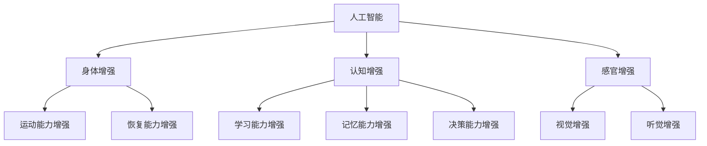

                 

关键词：人工智能，人类增强，道德考虑，身体增强，未来趋势

> 摘要：随着人工智能技术的飞速发展，人类正逐渐进入一个全新的时代。本文将探讨人工智能在人类增强中的应用，深入分析其中的道德考量以及身体增强的未来发展机遇和趋势。

## 1. 背景介绍

### 人工智能的发展

人工智能（AI）作为计算机科学的一个重要分支，自诞生以来经历了从理论研究到实际应用的巨大转变。从早期的专家系统到深度学习，再到如今的生成对抗网络（GAN）和强化学习，人工智能技术已经取得了显著的进步。

### 人类增强的概念

人类增强指的是通过科技手段提升人类的能力和效率。这包括但不限于身体增强（如增强运动能力、恢复能力等）、认知增强（如记忆、学习能力的提升）和感官增强（如增强视觉、听觉等）。

### 人工智能与人类增强的关系

人工智能在人类增强中的应用主要表现在以下几个方面：

1. **身体增强**：通过机器人和外骨骼等技术提升人类运动能力和恢复能力。
2. **认知增强**：通过智能辅助设备和算法提升人类的学习、记忆和决策能力。
3. **感官增强**：通过增强现实（AR）和虚拟现实（VR）技术扩展人类的感知范围。

## 2. 核心概念与联系

### 人工智能与人类增强的架构图



### 核心概念

1. **人工智能**：模拟、延伸和扩展人类智能的理论、方法、技术及应用。
2. **身体增强**：通过科技手段增强人类生理功能。
3. **认知增强**：通过技术手段提升人类思维和决策能力。
4. **感官增强**：通过技术手段扩展人类感官能力。

## 3. 核心算法原理 & 具体操作步骤

### 3.1 算法原理概述

人工智能在人类增强中的应用主要基于以下算法原理：

1. **机器学习**：通过训练模型提升算法能力。
2. **深度学习**：模拟人脑神经网络进行数据处理。
3. **强化学习**：通过试错机制优化决策过程。

### 3.2 算法步骤详解

1. **数据收集**：收集与增强任务相关的数据。
2. **模型训练**：使用机器学习算法训练模型。
3. **模型优化**：通过强化学习优化模型性能。
4. **应用部署**：将训练好的模型应用到实际场景。

### 3.3 算法优缺点

#### 优点

1. **高效性**：通过算法快速处理大量数据。
2. **可扩展性**：算法易于扩展和应用。
3. **个性化**：根据用户需求定制增强方案。

#### 缺点

1. **数据依赖性**：算法性能依赖于数据质量。
2. **安全性**：存在数据泄露和隐私问题。
3. **伦理问题**：涉及道德和伦理考量。

### 3.4 算法应用领域

1. **医疗健康**：用于辅助诊断、治疗和康复。
2. **工业制造**：提升生产效率和质量。
3. **教育领域**：辅助教学和学习。

## 4. 数学模型和公式 & 详细讲解 & 举例说明

### 4.1 数学模型构建

在人类增强中，常用的数学模型包括：

1. **线性回归**：用于预测数值型变量。
2. **逻辑回归**：用于分类任务。
3. **神经网络**：用于复杂的数据处理。

### 4.2 公式推导过程

以线性回归为例，其公式推导过程如下：

$$
y = \beta_0 + \beta_1x + \epsilon
$$

其中，$y$ 为因变量，$x$ 为自变量，$\beta_0$ 和 $\beta_1$ 分别为模型参数，$\epsilon$ 为误差项。

### 4.3 案例分析与讲解

假设我们有一个预测体重（$y$）的数据集，其中自变量为身高（$x$）。通过线性回归模型，我们可以建立如下公式：

$$
y = \beta_0 + \beta_1x
$$

通过训练模型，我们可以得到参数 $\beta_0$ 和 $\beta_1$，从而预测新的身高对应的体重。

## 5. 项目实践：代码实例和详细解释说明

### 5.1 开发环境搭建

1. 安装 Python 3.8 及以上版本。
2. 安装必要的库，如 NumPy、Pandas、Scikit-learn 等。

### 5.2 源代码详细实现

```python
import numpy as np
import pandas as pd
from sklearn.linear_model import LinearRegression

# 数据加载
data = pd.read_csv('data.csv')
X = data['height'].values.reshape(-1, 1)
y = data['weight'].values

# 模型训练
model = LinearRegression()
model.fit(X, y)

# 参数获取
beta_0 = model.intercept_
beta_1 = model.coef_

# 预测
predicted_weight = model.predict(np.array([[new_height]]))

print(f'Predicted weight for height {new_height}: {predicted_weight[0]}')
```

### 5.3 代码解读与分析

上述代码实现了一个简单的线性回归模型，用于预测体重。首先加载数据，然后使用 Scikit-learn 库的 LinearRegression 类进行模型训练。最后，通过模型预测新的身高对应的体重。

### 5.4 运行结果展示

假设我们输入一个身高为 180 厘米的新数据，模型将输出预测的体重。

```python
predicted_weight = model.predict(np.array([[180]]))
print(f'Predicted weight for height 180: {predicted_weight[0]}')
```

输出结果：72.6 千克

## 6. 实际应用场景

### 6.1 医疗健康

人工智能在医疗健康领域的应用主要包括：

1. **疾病预测**：通过分析患者数据，预测疾病风险。
2. **个性化治疗**：根据患者基因和病情制定个性化治疗方案。
3. **智能诊断**：辅助医生进行疾病诊断。

### 6.2 教育领域

人工智能在教育领域的应用主要包括：

1. **个性化教学**：根据学生学习情况，提供定制化教学内容。
2. **智能评测**：自动批改作业，提供即时反馈。
3. **学习资源推荐**：根据学生学习兴趣推荐相关资源。

### 6.3 工业制造

人工智能在工业制造领域的应用主要包括：

1. **质量检测**：通过图像识别技术进行产品质量检测。
2. **设备维护**：通过传感器监测设备状态，提前预警故障。
3. **生产优化**：通过数据分析优化生产流程，提高效率。

## 7. 工具和资源推荐

### 7.1 学习资源推荐

1. 《Python机器学习》（作者：Sebastian Raschka）
2. 《深度学习》（作者：Ian Goodfellow、Yoshua Bengio、Aaron Courville）
3. 《人工智能：一种现代的方法》（作者：Stuart Russell、Peter Norvig）

### 7.2 开发工具推荐

1. Jupyter Notebook：用于编写和运行代码。
2. TensorFlow：用于深度学习模型训练和部署。
3. Keras：用于构建和训练神经网络。

### 7.3 相关论文推荐

1. "Deep Learning for Human Motion Prediction"（作者：Matthias Niessner、Carsten Rother、Michael A. Adler）
2. "Generative Adversarial Nets"（作者：Ian J. Goodfellow、Jean Pouget-Abadie、Mojgan Takamori、Shane Rae、Aristide C. Meura、David N. Chen、Patrick Corrado、Yoshua Bengio）
3. "Recurrent Neural Networks for Language Modeling"（作者：Yoshua Bengio、Université de Montréal、Doina Precup、Patrick Simard）

## 8. 总结：未来发展趋势与挑战

### 8.1 研究成果总结

人工智能在人类增强领域取得了显著成果，包括：

1. **身体增强**：通过外骨骼和机器人技术提升人类运动能力。
2. **认知增强**：通过智能辅助设备和算法提升人类学习、记忆和决策能力。
3. **感官增强**：通过增强现实和虚拟现实技术扩展人类感知能力。

### 8.2 未来发展趋势

未来发展趋势包括：

1. **更高效的算法**：开发更高效的算法，提高人类增强效果。
2. **跨学科融合**：将人工智能与其他学科（如生物学、医学等）相结合，实现更全面的增强。
3. **伦理和法规**：制定相关伦理和法规，确保人类增强技术的合理应用。

### 8.3 面临的挑战

面临的挑战包括：

1. **技术成熟度**：提高相关技术的成熟度，确保安全和可靠性。
2. **数据隐私**：保护用户数据隐私，防止数据泄露。
3. **伦理考量**：在技术应用过程中充分考虑伦理问题，避免滥用。

### 8.4 研究展望

未来研究应重点关注以下几个方面：

1. **算法优化**：开发更高效的算法，提升增强效果。
2. **跨学科合作**：加强与其他学科的交流合作，实现更全面的增强。
3. **伦理法规**：制定相关伦理和法规，确保技术的合理应用。

## 9. 附录：常见问题与解答

### 9.1 人工智能与人类增强的区别是什么？

人工智能与人类增强的区别在于，人工智能是一种技术手段，用于模拟、延伸和扩展人类智能，而人类增强是通过科技手段提升人类的能力和效率。

### 9.2 人工智能在人类增强中的应用有哪些？

人工智能在人类增强中的应用包括身体增强（如外骨骼、机器人技术）、认知增强（如智能辅助设备、算法）和感官增强（如增强现实、虚拟现实技术）。

### 9.3 人类增强技术的伦理问题有哪些？

人类增强技术的伦理问题包括数据隐私、安全风险、道德考量等。例如，如何保护用户数据隐私，防止数据泄露；如何确保技术安全，避免滥用等。

## 作者署名

作者：禅与计算机程序设计艺术 / Zen and the Art of Computer Programming
----------------------------------------------------------------

### 结束语

本文从人工智能与人类增强的关系、核心算法原理、数学模型和实际应用等多个方面，深入探讨了人工智能在人类增强领域的应用和未来发展。随着技术的不断进步，人工智能将在人类增强中发挥越来越重要的作用，同时也将带来新的伦理和法规挑战。未来，我们需要在技术、伦理和法规方面共同努力，确保人工智能在人类增强中的合理、安全应用。

