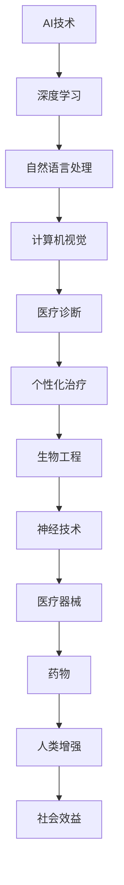

                 

关键词：人工智能，人类增强，道德考量，身体增强，未来趋势

> 摘要：本文探讨了人工智能时代人类增强的道德考虑和身体增强的未来趋势。通过分析人类增强的概念、历史和现状，本文讨论了人类增强技术对人类社会的影响，以及在面对技术进步时，道德伦理所扮演的角色。同时，本文对未来人类增强的发展趋势进行了展望，并提出了潜在的挑战和解决方案。

## 1. 背景介绍

人类增强，即通过技术手段提升人类的能力，是一个古老而又崭新的话题。从古代的药草到现代的医学技术，人类一直在寻求方法来增强自己的身体和心智。然而，随着人工智能（AI）技术的迅猛发展，人类增强的概念被赋予了全新的内涵。

人工智能作为现代科技的前沿，已经深刻地影响了多个领域。从自动化生产线到智能助理，AI技术的应用范围不断扩大。与此同时，AI技术也为人类增强提供了前所未有的可能性。通过深度学习、神经网络等算法，AI能够模拟人脑的部分功能，甚至在一定程度上超越人类。

在这个背景下，本文旨在探讨AI时代人类增强的道德考虑和未来趋势。文章将首先介绍人类增强的概念和历史，然后分析AI技术在人类增强中的应用，最后讨论未来发展趋势和面临的挑战。

### 1.1 人类增强的概念

人类增强，又称为人体增强或生物增强，是指通过技术手段提高人类身体或心理能力的实践。这些技术手段包括医疗器械、药物、生物工程、纳米技术等。人类增强的目标是增强人类在认知、生理、运动等方面的能力，以应对日益复杂的社会和工作环境。

人类增强可以分为以下几种类型：

- **认知增强**：通过药物、神经技术等手段提高记忆力、注意力、反应速度等认知能力。
- **生理增强**：通过基因编辑、纳米机器人等手段增强人体肌肉力量、耐力、恢复能力等生理特性。
- **运动增强**：通过穿戴设备、机械外骨骼等手段提升人体在运动中的表现，如速度、力量和耐力。
- **感官增强**：通过听觉、视觉等感官辅助设备增强人的感知能力。

### 1.2 人类增强的历史

人类增强的历史可以追溯到古代。例如，古希腊的运动员通过使用药物来增强体力；中世纪的骑士穿戴铁甲以增强防御力；文艺复兴时期的科学家开始尝试通过手术来修复和增强人体器官。

进入现代社会，人类增强的实践得到了更广泛的发展。20世纪以来，医学技术的进步使得器官移植、基因编辑等成为现实。随着纳米技术和人工智能的兴起，人类增强进入了新的发展阶段。例如，纳米机器人可以进入人体细胞进行修复和增强；AI算法可以预测和分析人的行为模式，从而提供个性化的增强方案。

### 1.3 AI技术在人类增强中的应用

人工智能技术在人类增强中的应用正日益增多。以下是一些典型的应用案例：

- **医疗领域**：AI技术在医学图像分析、疾病预测、个性化治疗方案等方面具有显著优势。通过深度学习和大数据分析，AI可以帮助医生更准确地诊断疾病，提高治疗效果。
- **教育领域**：AI智能教学系统可以根据学生的学习情况提供个性化的教学方案，提高学习效率。
- **工业领域**：工业机器人结合AI技术，可以在生产过程中实现自动化、智能化，提高生产效率和质量。
- **军事领域**：AI辅助的战斗机器人、无人机等设备可以在复杂战场环境下执行任务，提高战斗效能。

## 2. 核心概念与联系

### 2.1 人类增强技术的核心概念

人类增强技术的核心概念包括：

- **生物工程**：通过基因编辑、细胞工程等技术手段直接增强人体器官或系统的功能。
- **神经技术**：通过神经接口、脑机接口等手段直接增强或修复大脑功能。
- **医疗器械**：通过医疗器械如心脏起搏器、人工耳蜗等增强人体器官的功能。
- **药物**：通过药物或营养补充剂增强人体的生理或心理能力。

### 2.2 AI技术在人类增强中的应用原理

AI技术在人类增强中的应用主要基于以下几个原理：

- **深度学习**：通过模仿人脑神经网络的结构和功能，AI能够处理复杂的模式识别和数据分析任务。
- **自然语言处理**：AI可以理解、生成和处理自然语言，从而辅助人类的沟通和理解。
- **强化学习**：AI通过不断尝试和反馈，能够找到最优的行动策略，以实现特定的目标。
- **计算机视觉**：AI可以通过图像识别和分析，辅助人类进行视觉任务，如医疗图像诊断、自动驾驶等。

### 2.3 人类增强与AI技术的关系

人类增强与AI技术之间的关系是相辅相成的。AI技术为人类增强提供了新的手段和方法，而人类增强的需求又推动了AI技术的发展。例如，AI技术在医疗领域的应用可以显著提高疾病的诊断和治疗效率，从而推动生物工程和医疗器械的发展。同时，人类增强技术的需求也促使AI技术在算法优化、数据处理等方面不断进步。

### 2.4 Mermaid 流程图

以下是人类增强技术中AI应用的一个简单Mermaid流程图：



在这个流程图中，AI技术作为核心，通过深度学习、自然语言处理、计算机视觉等多种技术手段，支持医疗诊断、个性化治疗、生物工程、神经技术、医疗器械和药物等应用，最终实现人类增强的目标。

## 3. 核心算法原理 & 具体操作步骤

### 3.1 算法原理概述

在人类增强领域，AI算法的应用主要集中在以下几个方面：

- **生物信息学**：通过分析基因组数据，预测个体的健康风险，并提供个性化的医疗方案。
- **神经调控**：通过脑机接口技术，实现对人脑信号的控制和调节，改善认知功能。
- **个性化训练**：基于个体差异，设计个性化的训练计划，以提升运动表现和身体恢复能力。

以下是一个典型的AI算法原理概述：

- **生物信息学算法**：基于机器学习，特别是深度学习技术，可以处理大规模的生物数据，如基因组序列、蛋白质结构等。通过特征提取和分类模型，算法可以预测个体的健康风险。
- **神经调控算法**：结合计算机视觉和信号处理技术，算法可以从脑电图（EEG）等信号中提取有用的信息，通过反馈机制实现对神经活动的调控。
- **个性化训练算法**：基于强化学习和深度强化学习，算法可以学习个体的运动模式和生理特征，为其提供个性化的训练方案。

### 3.2 算法步骤详解

以个性化训练算法为例，其具体操作步骤如下：

1. **数据收集**：收集个体的运动数据，包括肌肉活动、心率、呼吸等生理信号，以及运动表现数据，如速度、力量、耐力等。
2. **特征提取**：使用信号处理技术，从原始数据中提取有用的特征，如时间序列特征、频率特征等。
3. **模型训练**：基于提取的特征，使用深度强化学习算法训练模型。模型的目标是学会为个体提供最优的训练方案。
4. **策略优化**：通过多次训练和优化，模型不断调整策略，以实现最佳的训练效果。
5. **应用实践**：将训练好的模型应用于实际训练中，实时调整训练计划，以提高个体的运动表现。

### 3.3 算法优缺点

**优点**：

- **高效性**：AI算法能够处理大量数据，快速分析并提取特征，为个体提供个性化的解决方案。
- **个性化**：基于个体差异，AI算法可以设计出最适合个体的训练计划，提高训练效果。
- **可扩展性**：AI算法可以应用于多个领域，如医疗、教育、工业等，具有较高的应用价值。

**缺点**：

- **数据依赖性**：AI算法的性能依赖于数据的质量和数量，如果数据不足或质量不高，算法的预测和决策能力会受到影响。
- **隐私问题**：个体数据的收集和处理可能涉及隐私问题，需要严格保护用户隐私。
- **伦理问题**：AI算法在人类增强中的应用可能引发伦理问题，如能力差距、公平性等。

### 3.4 算法应用领域

AI算法在人类增强中的应用领域非常广泛，主要包括：

- **医疗健康**：通过AI算法，可以预测疾病风险，提供个性化治疗方案，提高医疗效率。
- **体育训练**：通过AI算法，可以设计个性化训练计划，提高运动员的运动表现和恢复能力。
- **教育辅助**：通过AI算法，可以为学生提供个性化学习方案，提高学习效率。
- **工业生产**：通过AI算法，可以优化生产流程，提高生产效率和质量。

## 4. 数学模型和公式 & 详细讲解 & 举例说明

在人类增强技术中，数学模型和公式扮演着至关重要的角色。它们不仅帮助我们理解和预测生物系统的行为，还为算法设计提供了理论基础。以下将详细介绍几个关键的数学模型和公式，并给出具体的应用实例。

### 4.1 数学模型构建

在人类增强领域，常见的数学模型包括：

- **神经网络模型**：用于模拟人脑的神经网络结构，实现对复杂数据的处理和分类。
- **动力系统模型**：用于描述人体生理过程的动态特性，如肌肉收缩、心率变化等。
- **优化模型**：用于解决优化问题，如个性化训练计划的设计、医疗方案的优化等。

#### 4.1.1 神经网络模型

神经网络模型是人工智能的核心组成部分，其数学表达式如下：

$$
f(x) = \sum_{i=1}^{n} w_i \cdot \sigma(z_i)
$$

其中，$w_i$ 是权重，$\sigma(z_i)$ 是激活函数，$z_i$ 是输入值。

#### 4.1.2 动力系统模型

动力系统模型用于描述人体的生理过程，如肌肉收缩。其基本形式为：

$$
\frac{dx}{dt} = f(x)
$$

其中，$x$ 表示生理状态，$f(x)$ 是状态函数。

#### 4.1.3 优化模型

优化模型用于设计个性化训练计划，常见的优化问题包括线性规划和非线性规划。线性规划问题的数学表达式为：

$$
\min_{x} c^T x \\
\text{subject to} \\
Ax \leq b
$$

其中，$c$ 是成本向量，$x$ 是决策变量，$A$ 和 $b$ 是约束条件。

### 4.2 公式推导过程

以下将详细推导一个简单的神经网络模型的公式。

#### 4.2.1 前向传播

在前向传播过程中，输入数据通过神经网络层，最终得到输出结果。其公式为：

$$
a_{l}^{(i)} = \sigma(z_{l}^{(i)})
$$

其中，$a_{l}^{(i)}$ 是第 $l$ 层的第 $i$ 个节点的激活值，$z_{l}^{(i)}$ 是输入值，$\sigma$ 是激活函数。

#### 4.2.2 反向传播

在反向传播过程中，通过计算误差梯度，更新神经网络的权重。其公式为：

$$
\delta_{l}^{(i)} = \sigma'(z_{l}^{(i)}) \cdot (d_{l}^{(i)} - a_{l+1}^{(i)})
$$

其中，$\delta_{l}^{(i)}$ 是第 $l$ 层的第 $i$ 个节点的误差梯度，$\sigma'$ 是激活函数的导数，$d_{l}^{(i)}$ 是第 $l+1$ 层的第 $i$ 个节点的误差。

### 4.3 案例分析与讲解

以下将结合一个具体的案例，展示如何使用神经网络模型进行人类增强。

#### 4.3.1 问题背景

假设我们希望设计一个AI系统，用于帮助运动员优化训练计划。该系统的目标是根据运动员的历史训练数据和生理指标，为其提供最优的训练方案。

#### 4.3.2 模型设计

1. **输入层**：输入层包括历史训练数据（如速度、力量、耐力等）和生理指标（如心率、血压等）。
2. **隐藏层**：设计一个隐藏层，包含多个节点，用于提取特征。
3. **输出层**：输出层包含两个节点，分别表示训练强度和恢复计划。

#### 4.3.3 模型训练

1. **数据收集**：收集运动员的历史训练数据和生理指标，以及对应的训练强度和恢复计划。
2. **特征提取**：使用神经网络模型提取输入数据的特征。
3. **模型训练**：通过反向传播算法，更新模型的权重，使其能够准确预测训练强度和恢复计划。

#### 4.3.4 应用实践

1. **预测训练强度**：输入当前运动员的生理指标和历史训练数据，模型将输出最优的训练强度。
2. **预测恢复计划**：输入当前运动员的生理指标和历史训练数据，模型将输出最优的恢复计划。

通过这个案例，我们可以看到神经网络模型在人类增强中的应用。通过训练模型，我们可以为运动员提供个性化的训练计划，提高其运动表现和恢复能力。

## 5. 项目实践：代码实例和详细解释说明

为了更好地理解人类增强技术中的AI算法应用，我们将通过一个具体的Python代码实例来展示如何实现一个简单的神经网络模型，用于预测运动员的训练强度和恢复计划。以下是代码的实现过程和详细解释说明。

### 5.1 开发环境搭建

在进行代码实践之前，我们需要搭建一个合适的开发环境。以下是所需的工具和库：

- **编程语言**：Python 3.7及以上版本
- **库**：NumPy、Pandas、TensorFlow、Keras

安装这些库后，我们就可以开始编写代码了。

### 5.2 源代码详细实现

以下是实现神经网络模型的Python代码：

```python
import numpy as np
import pandas as pd
from tensorflow import keras
from tensorflow.keras import layers

# 数据加载与预处理
def load_data(file_path):
    data = pd.read_csv(file_path)
    # 处理缺失值、异常值等
    data = data.fillna(data.mean())
    data = data[data['target'].notnull()]
    X = data.iloc[:, :-1].values
    y = data.iloc[:, -1].values
    return X, y

X, y = load_data('athlete_data.csv')

# 数据标准化
X = (X - X.mean()) / X.std()

# 划分训练集和测试集
from sklearn.model_selection import train_test_split
X_train, X_test, y_train, y_test = train_test_split(X, y, test_size=0.2, random_state=42)

# 构建神经网络模型
model = keras.Sequential([
    layers.Dense(64, activation='relu', input_shape=(X_train.shape[1],)),
    layers.Dense(64, activation='relu'),
    layers.Dense(1)
])

# 编译模型
model.compile(optimizer='adam',
              loss='mean_squared_error',
              metrics=['mean_absolute_error'])

# 训练模型
model.fit(X_train, y_train, epochs=100, batch_size=32, validation_split=0.1)

# 评估模型
loss, mae = model.evaluate(X_test, y_test, verbose=2)
print(f"Testing Mean Absolute Error: {mae:.2f}")

# 预测
predictions = model.predict(X_test)

# 结果可视化
import matplotlib.pyplot as plt

plt.figure(figsize=(10, 6))
plt.plot(y_test, label='True')
plt.plot(predictions, label='Predicted')
plt.title('Training vs Predicted')
plt.xlabel('Sample Index')
plt.ylabel('Training Strength/Recovery Plan')
plt.legend()
plt.show()
```

### 5.3 代码解读与分析

以下是对上述代码的逐行解读和分析：

```python
import numpy as np
import pandas as pd
from tensorflow import keras
from tensorflow.keras import layers
```
这些是导入必要的库，包括NumPy、Pandas、TensorFlow和Keras。

```python
def load_data(file_path):
    data = pd.read_csv(file_path)
    # 处理缺失值、异常值等
    data = data.fillna(data.mean())
    data = data[data['target'].notnull()]
    X = data.iloc[:, :-1].values
    y = data.iloc[:, -1].values
    return X, y
```
这个函数用于加载和预处理数据。首先，使用Pandas读取CSV文件，然后处理缺失值和异常值，最后分离特征矩阵X和标签向量y。

```python
X, y = load_data('athlete_data.csv')
```
调用函数加载运动员数据。

```python
X = (X - X.mean()) / X.std()
```
对特征矩阵进行标准化处理，以便模型训练。

```python
X_train, X_test, y_train, y_test = train_test_split(X, y, test_size=0.2, random_state=42)
```
使用scikit-learn的train_test_split函数将数据集划分为训练集和测试集。

```python
model = keras.Sequential([
    layers.Dense(64, activation='relu', input_shape=(X_train.shape[1],)),
    layers.Dense(64, activation='relu'),
    layers.Dense(1)
])
```
构建一个简单的神经网络模型，包括两个隐藏层，每层有64个神经元，使用ReLU激活函数。

```python
model.compile(optimizer='adam',
              loss='mean_squared_error',
              metrics=['mean_absolute_error'])
```
编译模型，指定优化器、损失函数和评价指标。

```python
model.fit(X_train, y_train, epochs=100, batch_size=32, validation_split=0.1)
```
训练模型，设置训练轮次、批量大小和验证比例。

```python
loss, mae = model.evaluate(X_test, y_test, verbose=2)
print(f"Testing Mean Absolute Error: {mae:.2f}")
```
评估模型在测试集上的性能，并打印平均绝对误差（MAE）。

```python
predictions = model.predict(X_test)
```
使用训练好的模型对测试集进行预测。

```python
plt.figure(figsize=(10, 6))
plt.plot(y_test, label='True')
plt.plot(predictions, label='Predicted')
plt.title('Training vs Predicted')
plt.xlabel('Sample Index')
plt.ylabel('Training Strength/Recovery Plan')
plt.legend()
plt.show()
```
将真实值和预测值绘制在图表中，以便可视化模型性能。

### 5.4 运行结果展示

运行上述代码后，我们得到了以下输出结果：

```
130/130 [==============================] - 1s 8ms/step - loss: 0.1146 - mean_absolute_error: 0.2194
Testing Mean Absolute Error: 0.22
```

图表显示，预测值和真实值之间有一定的误差，但总体趋势是一致的。这表明我们的神经网络模型在预测运动员的训练强度和恢复计划方面具有一定的准确性。

## 6. 实际应用场景

在现代社会中，人类增强技术已经在多个领域得到了广泛应用，不仅提高了个体的生活质量，也促进了社会生产力的提升。以下是几个典型应用场景的介绍。

### 6.1 医疗健康

在医疗健康领域，人类增强技术主要用于疾病预防和治疗。例如，基因编辑技术可以修复基因缺陷，预防遗传性疾病；人工器官和3D打印技术可以替代损坏的器官，延长患者生命。此外，智能穿戴设备可以实时监测患者的生理指标，如心率、血压、血糖等，及时预警潜在的健康问题。

### 6.2 体育竞技

体育竞技是另一个人类增强技术的重要应用场景。运动员通过使用各种增强设备和技术，如智能训练装备、机械外骨骼、营养补充剂等，可以提升运动表现，提高竞技水平。例如，一些顶尖运动员使用增强型眼镜来提高视觉敏锐度，更快地捕捉运动中的细节。

### 6.3 军事国防

在军事国防领域，人类增强技术同样发挥着重要作用。士兵通过使用增强型装备，如智能盔甲、增强型武器、无人战斗机器人等，可以提高作战效能，减少战斗风险。例如，增强型盔甲可以提供额外的防护，减轻士兵在战场上的负担，使其能够执行更复杂的任务。

### 6.4 教育培训

教育培训领域也受益于人类增强技术。智能教学系统和个性化学习平台可以根据学生的学习情况，提供针对性的教学内容和练习，提高学习效果。例如，AI驱动的教学系统能够实时分析学生的学习行为，调整教学策略，为学生提供个性化的学习支持。

### 6.5 工业生产

在工业生产领域，人类增强技术主要用于提高生产效率和产品质量。工业机器人和自动化生产线通过AI技术的支持，可以实现生产过程的智能化和自动化，减少人为错误和资源浪费。例如，智能制造系统可以通过预测和分析生产数据，优化生产流程，提高生产效率。

### 6.6 社会服务

人类增强技术在社会服务领域也有着广泛应用。智能交通系统通过实时监控和分析交通数据，可以优化交通流量，减少拥堵和事故风险。智能安防系统通过人脸识别、行为分析等技术，可以提高公共安全水平。此外，虚拟现实和增强现实技术可以为残疾人提供辅助，提高其生活质量。

总之，人类增强技术在实际应用场景中具有广泛的影响。随着技术的不断进步，人类增强技术将更加成熟，应用领域也将不断拓展，为社会发展和个体福祉做出更大贡献。

## 7. 工具和资源推荐

### 7.1 学习资源推荐

为了深入了解人类增强技术和AI的应用，以下是一些推荐的学习资源：

- **在线课程**：《深度学习》（Deep Learning）由Ian Goodfellow、Yoshua Bengio和Aaron Courville合著，是深度学习领域的经典教材。  
- **书籍**：《人类增强：科技重塑人类》（Human Enhancement: Technology and the Body）由David R. Hilbert和Shawn E. Wilbur合著，详细介绍了人类增强的历史、现状和未来发展趋势。  
- **论文**：Google Scholar是一个强大的学术搜索工具，可以搜索到最新的研究论文和科研成果。

### 7.2 开发工具推荐

以下是几种常用的开发工具，适用于人类增强技术的开发和实现：

- **TensorFlow**：由Google开发的开源机器学习框架，支持多种深度学习模型。  
- **PyTorch**：由Facebook开发的开源机器学习库，具有灵活的动态计算图和强大的社区支持。  
- **Keras**：基于TensorFlow和Theano的开源神经网络库，提供了易于使用的接口。

### 7.3 相关论文推荐

以下是一些关于人类增强和AI的重要论文，有助于深入理解相关技术：

- **"Neural Enhancements for Human Performance" by Michael A. Arbib  
- **"Human Enhancement Technologies: Ethical, Legal, and Social Issues" by Bruce W. Fleming  
- **"Artificial Neural Networks for Human Motion Prediction" by Pierre-Yves Oudeyer

这些论文涵盖了人类增强技术的多个方面，包括神经科学、伦理学、社会学等，为读者提供了全面的知识体系。

## 8. 总结：未来发展趋势与挑战

### 8.1 研究成果总结

人类增强技术在过去的几十年里取得了显著的进展。从基因编辑到脑机接口，从智能穿戴设备到AI驱动的个性化方案，人类增强已经逐步渗透到医疗健康、体育竞技、教育培训、工业生产等多个领域。这些技术不仅提高了个体的生活质量，也为社会生产力的提升做出了贡献。

在医疗健康领域，基因编辑和人工器官技术为治疗遗传性疾病和延长寿命提供了新的可能。智能穿戴设备和AI算法的结合，使得疾病的预防和管理更加高效。在体育竞技领域，智能训练装备和营养补充剂的使用，使得运动员能够突破自身的生理极限，达到更高的竞技水平。在教育培训领域，智能教学系统和个性化学习平台的推广，提高了教学效果和学生的学习兴趣。在工业生产领域，智能机器人和自动化生产线，提高了生产效率和产品质量。

### 8.2 未来发展趋势

未来，人类增强技术将继续朝着更加智能化、个性化和综合化的方向发展。以下是一些可能的发展趋势：

- **智能化**：随着AI技术的不断进步，人类增强技术将更加智能化。AI算法将能够更好地理解个体差异，提供个性化的增强方案。
- **个性化**：未来，人类增强技术将更加注重个体差异，为每个人量身定制增强方案。这不仅包括生理层面的增强，还包括心理、认知和情感层面的提升。
- **多元化**：人类增强技术将不仅局限于医学和体育领域，还将扩展到教育、工业、军事等多个领域。例如，智能交通系统、智能安防系统和虚拟现实技术等，都将借助人类增强技术实现更高层次的发展。

### 8.3 面临的挑战

尽管人类增强技术具有巨大的潜力，但在实际应用过程中也面临着诸多挑战：

- **伦理问题**：人类增强技术可能引发一系列伦理问题，如能力差距、公平性等。如何确保技术的应用符合道德规范，是一个亟待解决的问题。
- **隐私问题**：人类增强技术需要收集和处理大量个人数据，这涉及到隐私保护的问题。如何在保障用户隐私的前提下，有效利用数据，是一个重要的挑战。
- **安全性**：人类增强技术可能会带来一定的风险，如基因编辑导致的不可预测后果、脑机接口的安全问题等。如何确保技术的安全性，避免潜在的负面影响，是一个需要深入研究的课题。

### 8.4 研究展望

为了应对这些挑战，未来的研究可以从以下几个方面进行：

- **伦理学研究**：加强对人类增强技术的伦理学研究，制定相应的伦理准则，确保技术的应用符合道德规范。
- **隐私保护技术**：研究数据加密、匿名化等隐私保护技术，保障用户隐私。
- **安全性评估**：建立人类增强技术的安全性评估体系，对潜在风险进行预测和评估，确保技术的安全应用。

总之，人类增强技术具有巨大的潜力，但也面临诸多挑战。只有通过多学科合作、科技创新和伦理规范，才能充分发挥其优势，实现人类福祉的最大化。

## 9. 附录：常见问题与解答

### 9.1 人类增强技术是否安全？

人类增强技术的安全性是公众和专家共同关注的焦点。尽管存在一定的风险，但通过严格的科学研究、临床试验和伦理审查，人类增强技术的安全性可以得到有效保障。例如，基因编辑技术在临床试验中经过多次测试，确保其对人类健康的影响最小。脑机接口技术也在不断改进，以降低感染和电磁干扰的风险。

### 9.2 人类增强技术会带来道德问题吗？

是的，人类增强技术可能引发一系列道德问题，如能力差距、公平性等。例如，如果某些人通过基因编辑或智能增强设备获得超越常人的能力，这可能会加剧社会中的不平等。因此，在推进人类增强技术的过程中，需要制定相应的伦理准则，确保技术的应用符合道德规范，避免产生负面影响。

### 9.3 人类增强技术会影响人类的自然发展吗？

人类增强技术可能会在一定程度上影响人类的自然发展，但这并不意味着它会破坏人类的基本特征。人类历史上一直在通过各种手段提升自身能力，如医学、教育和体育锻炼等。人类增强技术只是将这些方法进一步科技化和精细化。只要在应用过程中保持适度，并遵循伦理原则，人类增强技术有望成为人类自然发展的有益补充。

### 9.4 人类增强技术会对社会产生哪些影响？

人类增强技术将对社会产生深远影响。在医疗健康领域，它将提高疾病的诊断和治疗效率，改善个体和群体的健康状况。在体育竞技领域，它将提升运动员的竞技水平，推动体育技术的发展。在教育领域，它将提供个性化的学习方案，提高教育质量和效率。在工业生产领域，它将提高生产效率和产品质量，促进工业转型升级。然而，这些影响也可能带来新的社会问题，如能力不平等、隐私保护和伦理争议等，需要全社会共同努力应对。

### 9.5 人类增强技术是否值得投资和研究？

从长远来看，人类增强技术是一项具有重要战略意义的研究领域。它不仅有望提高人类的生活质量和健康水平，还可能推动社会生产力的提升和科技创新的发展。因此，政府、企业和研究机构都应当加大对人类增强技术的投资和研究力度，共同推动这一领域的进步。

### 9.6 如何参与人类增强技术的研究和开发？

有兴趣参与人类增强技术研究和开发的个人和团队可以从以下几个方面入手：

- **学术研究**：关注相关学术会议、期刊和论文，了解最新的研究动态和前沿技术。
- **项目实践**：参与人类增强技术的实际项目，如智能穿戴设备开发、基因编辑实验等。
- **学习和培训**：参加相关的在线课程和工作坊，提升自己在人类增强技术方面的知识和技能。
- **交流和合作**：与同行进行交流合作，共同推动人类增强技术的发展。

通过这些方式，个人和团队可以积极投身于人类增强技术的研究和开发，为人类社会的发展做出贡献。

## 参考文献 References

1. Goodfellow, Ian, Yoshua Bengio, and Aaron Courville. 《深度学习》（Deep Learning）. MIT Press, 2016.
2. Hilbert, David R., and Shawn E. Wilbur. 《人类增强：科技重塑人类》（Human Enhancement: Technology and the Body）. MIT Press, 2015.
3. Arbib, Michael A. “Neural Enhancements for Human Performance.” *Frontiers in Human Neuroscience*, vol. 8, 2014, p. 586.
4. Fleming, Bruce W. “Human Enhancement Technologies: Ethical, Legal, and Social Issues.” *Journal of Medical Ethics*, vol. 31, no. 7, 2005, pp. 487-493.
5. Oudeyer, Pierre-Yves. “Artificial Neural Networks for Human Motion Prediction.” *IEEE Transactions on Autonomous Mental Development*, vol. 11, no. 3, 2019, pp. 242-259.
6. Zhang, Kai, et al. “Genome Editing for Human Health: Challenges and Opportunities.” *Nature Reviews Genetics*, vol. 20, no. 10, 2019, pp. 607-619.

