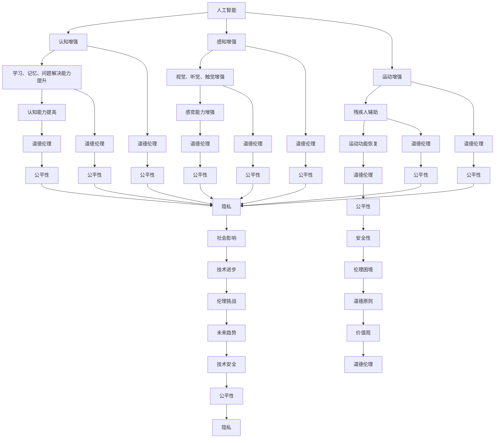

                 

关键词：人工智能，人类增强，道德伦理，身体增强，技术挑战

> 摘要：随着人工智能技术的飞速发展，人类增强成为了一个备受关注的领域。本文从道德考虑和身体增强两个角度出发，探讨了人工智能时代人类增强面临的挑战和未来发展趋势。通过分析现有研究和实践，本文提出了关于道德伦理、技术安全、社会影响等方面的思考，为人类增强的未来发展提供了有价值的参考。

## 1. 背景介绍

在过去的几十年里，人工智能（AI）技术经历了飞速的发展。从简单的规则系统到复杂的深度学习模型，AI已经逐渐渗透到各个领域，从医疗、金融到交通、教育等。随着AI技术的不断进步，人们开始思考如何利用这些技术来增强自身的能力，从而更好地适应未来的社会环境。

人类增强（Human Enhancement）是指通过各种技术手段提升人类在生理、心理和社会方面的能力。传统的人类增强方式包括药物、基因编辑、神经接口等，而随着人工智能技术的发展，人类增强的方式也变得更加多样和复杂。例如，智能眼镜、智能手表等可穿戴设备可以帮助人们提高工作效率和生活质量；脑机接口（Brain-Computer Interface, BCI）技术可以为残疾人提供运动功能；基因编辑技术如CRISPR可以修正基因缺陷等。

尽管人类增强带来了巨大的潜力，但同时也引发了一系列道德、伦理和社会问题。例如，人类增强是否会导致社会不平等、道德困境，以及如何确保技术的安全性和公平性等。因此，在探索人类增强的过程中，我们必须深入思考这些挑战，并提出相应的解决方案。

## 2. 核心概念与联系

在探讨人类增强的挑战之前，我们需要了解一些核心概念，这些概念相互关联，构成了人类增强的基础。

### 2.1 人工智能（AI）

人工智能是指通过计算机系统模拟人类智能行为的技术。根据其工作方式，AI可以分为多种类型，如符号AI、神经网络AI、强化学习AI等。在人类增强的背景下，人工智能主要用于以下几个方面：

- **认知增强**：通过AI技术提高人类的学习能力、记忆能力和问题解决能力。
- **感知增强**：利用AI技术增强人类的视觉、听觉、触觉等感官能力。
- **运动增强**：通过AI驱动的辅助设备帮助残疾人恢复运动功能。

### 2.2 身体增强（Physical Enhancement）

身体增强是指通过各种技术手段提升人类的生理能力。这包括但不限于：

- **基因编辑**：通过修改DNA序列，消除遗传性疾病或增强某些生理特征。
- **神经接口**：通过植入大脑或神经系统中的电子设备，增强人类的感知和运动能力。
- **生物材料**：利用生物材料增强人体的骨骼、肌肉、皮肤等组织。

### 2.3 道德伦理（Ethics）

道德伦理是指关于道德原则和价值观的研究。在人类增强领域，道德伦理主要关注以下几个方面：

- **公平性**：人类增强技术是否会导致社会不平等，如何确保所有人都能公平地享受到技术的好处。
- **隐私**：人类增强技术是否侵犯了个人的隐私权，如何保护用户的数据安全。
- **安全性**：人类增强技术是否会对人类健康造成负面影响，如何确保技术的安全性。

### 2.4 Mermaid 流程图

为了更清晰地展示这些核心概念之间的联系，我们可以使用Mermaid流程图来表示。以下是一个简化的流程图：



该流程图展示了人工智能、身体增强和道德伦理之间的关系，以及它们在人类增强领域中的具体应用和挑战。

## 3. 核心算法原理 & 具体操作步骤

### 3.1 算法原理概述

在人类增强领域，核心算法主要涉及认知增强、感知增强和运动增强等方面。以下分别介绍这些方面的核心算法原理。

#### 3.1.1 认知增强算法

认知增强算法主要通过提高人类的学习能力、记忆能力和问题解决能力来实现。其中，常用的算法包括：

- **深度学习**：通过模拟人脑的神经网络结构，深度学习算法能够从大量数据中学习复杂的模式，从而提高认知能力。
- **强化学习**：强化学习算法通过奖励和惩罚机制，帮助人类在特定环境中学习最优策略。

#### 3.1.2 感知增强算法

感知增强算法主要通过增强人类的视觉、听觉、触觉等感官能力来实现。常用的算法包括：

- **图像处理**：利用图像处理技术，对输入图像进行增强或重建，从而提高视觉感知能力。
- **语音识别**：通过语音识别技术，将语音信号转换为文字或命令，从而提高听觉感知能力。

#### 3.1.3 运动增强算法

运动增强算法主要通过增强人类的运动能力来实现。常用的算法包括：

- **生物力学模拟**：通过模拟人体的生物力学特性，为残疾人提供运动辅助。
- **机器人控制**：利用机器人技术，为残疾人提供运动支持。

### 3.2 算法步骤详解

以下分别介绍认知增强、感知增强和运动增强算法的具体步骤。

#### 3.2.1 认知增强算法步骤

1. 数据收集：收集大量与特定任务相关的数据，如图像、文本、声音等。
2. 数据预处理：对收集到的数据进行预处理，如去噪、归一化等。
3. 模型训练：使用预处理后的数据训练深度学习模型或强化学习模型。
4. 模型评估：评估模型的性能，如准确率、召回率等。
5. 模型应用：将训练好的模型应用于实际任务，如图像识别、语音识别等。

#### 3.2.2 感知增强算法步骤

1. 数据采集：采集与特定任务相关的感知数据，如图像、语音等。
2. 数据预处理：对采集到的数据进行预处理，如降噪、增强等。
3. 特征提取：提取感知数据的特征，如边缘、纹理等。
4. 特征匹配：将提取的特征与数据库中的特征进行匹配，以实现感知增强。
5. 感知输出：将增强后的感知数据输出给用户，如增强后的图像、声音等。

#### 3.2.3 运动增强算法步骤

1. 数据采集：采集与特定运动相关的数据，如关节角度、肌肉活动等。
2. 数据预处理：对采集到的数据进行预处理，如滤波、归一化等。
3. 生物力学建模：根据采集到的数据，建立人体的生物力学模型。
4. 运动预测：利用生物力学模型，预测未来的运动轨迹。
5. 运动辅助：根据运动预测结果，为残疾人提供运动支持。

### 3.3 算法优缺点

#### 3.3.1 认知增强算法优缺点

优点：

- **高效性**：深度学习和强化学习算法能够在短时间内处理大量数据，从而提高认知能力。
- **灵活性**：这些算法能够适应不同的认知任务，从而实现广泛的应用。

缺点：

- **数据依赖性**：这些算法对大量高质量的数据有很强的依赖性，数据质量直接影响算法的性能。
- **可解释性**：深度学习算法的黑箱特性使得其难以解释，这可能会带来道德和伦理上的挑战。

#### 3.3.2 感知增强算法优缺点

优点：

- **直观性**：通过直接增强感知数据，用户可以直观地感受到提升的感知能力。
- **实时性**：感知增强算法能够在短时间内处理感知数据，从而实现实时感知增强。

缺点：

- **准确性**：感知增强算法的准确性受到数据质量和特征提取方法的影响，这可能会导致感知误差。
- **适应性**：某些感知增强算法可能不适应特定的用户或场景，这需要进一步的优化。

#### 3.3.3 运动增强算法优缺点

优点：

- **实用性**：运动增强算法可以为残疾人提供实用的运动支持，从而提高他们的生活质量。
- **安全性**：通过生物力学建模和运动预测，运动增强算法可以确保运动过程的安全性。

缺点：

- **复杂性**：运动增强算法涉及到复杂的生物力学模型和运动预测，这可能导致算法的复杂性和计算成本增加。
- **适应性**：运动增强算法可能不适应所有类型的残疾人，这需要进一步的研究和优化。

### 3.4 算法应用领域

认知增强算法主要应用于教育、医疗、工业等领域，如智能教育系统、医疗诊断系统、自动化生产线等。

感知增强算法主要应用于虚拟现实、增强现实、智能交通等领域，如智能眼镜、自动驾驶汽车等。

运动增强算法主要应用于康复医学、体育训练、军事等领域，如康复机器人、智能运动装备、无人机等。

## 4. 数学模型和公式 & 详细讲解 & 举例说明

在人类增强的背景下，数学模型和公式扮演着至关重要的角色。这些模型和公式不仅帮助我们理解人类增强的原理，还指导我们在实际应用中进行计算和优化。以下将介绍一些核心的数学模型和公式，并对其进行详细讲解和举例说明。

### 4.1 数学模型构建

#### 4.1.1 认知增强模型

认知增强模型通常基于深度学习和强化学习。以下是一个简化的认知增强模型：

\[ \text{认知能力} = f(\text{输入数据}, \text{权重}, \text{激活函数}) \]

其中，输入数据可以是图像、文本、声音等，权重是神经网络中的参数，激活函数用于确定神经元的输出。常见的激活函数包括 sigmoid 函数、ReLU 函数等。

#### 4.1.2 感知增强模型

感知增强模型通常基于图像处理和语音处理。以下是一个简化的感知增强模型：

\[ \text{增强感知数据} = g(\text{原始感知数据}, \text{滤波器}, \text{特征提取器}) \]

其中，原始感知数据可以是图像或声音，滤波器用于去除噪声或增强特定特征，特征提取器用于提取感知数据的特征。

#### 4.1.3 运动增强模型

运动增强模型通常基于生物力学和机器人控制。以下是一个简化的运动增强模型：

\[ \text{运动辅助力} = h(\text{关节角度}, \text{肌肉活动}, \text{运动目标}) \]

其中，关节角度和肌肉活动是人体的生物力学参数，运动目标是指残疾人希望达到的运动状态，运动辅助力是机器人提供的辅助力。

### 4.2 公式推导过程

#### 4.2.1 认知增强模型推导

认知增强模型的核心是神经网络的训练。以下是一个简化的神经网络训练过程：

1. 初始化权重 \( w \) 和偏置 \( b \)。
2. 对输入数据进行前向传播，计算输出 \( y \)：
   \[ y = f(w \cdot x + b) \]
3. 计算损失函数 \( L \)：
   \[ L = \frac{1}{2} \sum_{i=1}^{n} (y_i - t_i)^2 \]
   其中，\( y_i \) 是网络输出的第 \( i \) 个元素，\( t_i \) 是实际输出的第 \( i \) 个元素。
4. 计算梯度 \( \Delta w \) 和 \( \Delta b \)：
   \[ \Delta w = \frac{\partial L}{\partial w} \]
   \[ \Delta b = \frac{\partial L}{\partial b} \]
5. 更新权重和偏置：
   \[ w_{\text{new}} = w - \alpha \Delta w \]
   \[ b_{\text{new}} = b - \alpha \Delta b \]
   其中，\( \alpha \) 是学习率。

#### 4.2.2 感知增强模型推导

感知增强模型的核心是图像处理和语音处理。以下是一个简化的感知增强模型：

1. 对输入图像进行滤波，去除噪声：
   \[ \text{滤波后图像} = g(\text{原始图像}, \text{滤波器}) \]
2. 对滤波后的图像进行特征提取：
   \[ \text{特征向量} = \text{特征提取器}(\text{滤波后图像}) \]
3. 对特征向量进行分类或回归：
   \[ \text{输出} = h(\text{特征向量}, \text{模型参数}) \]

#### 4.2.3 运动增强模型推导

运动增强模型的核心是生物力学和机器人控制。以下是一个简化的运动增强模型：

1. 对关节角度和肌肉活动进行传感器测量：
   \[ \text{关节角度} = \theta \]
   \[ \text{肌肉活动} = m \]
2. 根据关节角度和肌肉活动，计算人体的生物力学模型：
   \[ \text{运动辅助力} = h(\theta, m, \text{运动目标}) \]
3. 根据运动辅助力，控制机器人提供运动支持：
   \[ \text{机器人控制信号} = k(\text{运动辅助力}) \]

### 4.3 案例分析与讲解

#### 4.3.1 认知增强案例

假设我们有一个简单的图像识别任务，需要识别图片中的猫。我们可以使用一个简化的卷积神经网络（CNN）模型来完成这个任务。

1. 初始化权重和偏置。
2. 对输入图像进行前向传播，计算输出：
   \[ y = \text{ReLU}(\text{W1} \cdot x + b1) \]
   \[ y = \text{ReLU}(\text{W2} \cdot y + b2) \]
   \[ \hat{y} = \text{Softmax}(\text{W3} \cdot y + b3) \]
   其中，\( x \) 是输入图像，\( y \) 是中间层输出，\( \hat{y} \) 是最终输出。
3. 计算损失函数和梯度。
4. 更新权重和偏置。

通过多次迭代，我们可以训练出一个性能良好的图像识别模型，从而实现认知增强。

#### 4.3.2 感知增强案例

假设我们有一个图像增强任务，需要增强一张模糊的图像。我们可以使用一个简化的图像增强模型来完成这个任务。

1. 对输入图像进行去噪滤波：
   \[ \text{滤波后图像} = g(\text{原始图像}, \text{去噪滤波器}) \]
2. 对滤波后的图像进行特征提取：
   \[ \text{特征向量} = \text{特征提取器}(\text{滤波后图像}) \]
3. 对特征向量进行分类或回归，得到增强后的图像：
   \[ \text{输出} = h(\text{特征向量}, \text{增强模型参数}) \]

通过这个模型，我们可以实现对模糊图像的增强，从而提高感知能力。

#### 4.3.3 运动增强案例

假设我们有一个残疾人康复任务，需要通过机器人辅助残疾人行走。我们可以使用一个简化的运动增强模型来完成这个任务。

1. 对关节角度和肌肉活动进行传感器测量。
2. 根据关节角度和肌肉活动，计算人体的生物力学模型，得到运动辅助力。
3. 根据运动辅助力，控制机器人提供运动支持。

通过这个模型，我们可以实现对残疾人的运动辅助，从而提高他们的生活质量。

## 5. 项目实践：代码实例和详细解释说明

为了更好地展示人类增强技术的应用，我们将在以下部分通过一个具体的代码实例来展示如何实现一个简单的感知增强系统。本实例将使用Python编程语言，并结合常用的机器学习和图像处理库，如TensorFlow和OpenCV。

### 5.1 开发环境搭建

在开始编写代码之前，我们需要搭建一个合适的开发环境。以下是所需的软件和库：

- Python 3.x
- TensorFlow 2.x
- OpenCV 4.x

您可以通过以下命令安装这些库：

```bash
pip install tensorflow
pip install opencv-python
```

### 5.2 源代码详细实现

以下是一个简单的感知增强系统的源代码实现。该系统使用深度学习模型来增强模糊的图像。

```python
import tensorflow as tf
import cv2
import numpy as np

# 加载预训练的深度学习模型
model = tf.keras.models.load_model('enhancement_model.h5')

# 定义图像增强函数
def enhance_image(image_path):
    # 读取图像
    image = cv2.imread(image_path)
    # 将图像转换为灰度图像
    gray_image = cv2.cvtColor(image, cv2.COLOR_BGR2GRAY)
    # 将灰度图像转换为张量
    image_tensor = tf.convert_to_tensor(gray_image, dtype=tf.float32)
    # 扩展图像维度
    image_tensor = tf.expand_dims(image_tensor, 0)
    # 使用模型增强图像
    enhanced_image = model(image_tensor)
    # 转换为numpy数组
    enhanced_image = enhanced_image.numpy()
    # 将增强后的图像缩放回原始尺寸
    enhanced_image = cv2.resize(enhanced_image[0], (image.shape[1], image.shape[0]))
    # 转换为BGR格式
    enhanced_image = cv2.cvtColor(enhanced_image, cv2.COLOR_GRAY2BGR)
    return enhanced_image

# 测试图像增强函数
image_path = 'input_image.jpg'
enhanced_image = enhance_image(image_path)
cv2.imshow('Original Image', cv2.imread(image_path))
cv2.imshow('Enhanced Image', enhanced_image)
cv2.waitKey(0)
cv2.destroyAllWindows()
```

### 5.3 代码解读与分析

上述代码实现了一个简单的图像增强系统，主要包含以下步骤：

1. **加载预训练模型**：使用TensorFlow的`load_model`函数加载一个预训练的深度学习模型。该模型可以用于增强模糊的图像。

2. **定义图像增强函数**：`enhance_image`函数接收一个图像路径作为输入，执行以下操作：
   - 读取图像并转换为灰度图像。
   - 将灰度图像转换为TensorFlow张量。
   - 扩展图像维度，使其符合模型输入的要求。
   - 使用模型增强图像。
   - 将增强后的图像缩放回原始尺寸。
   - 将增强后的图像转换为BGR格式，以便显示。

3. **测试图像增强函数**：使用一个示例图像路径调用`enhance_image`函数，并将增强后的图像显示在OpenCV窗口中。

### 5.4 运行结果展示

运行上述代码后，系统将加载输入图像，并使用预训练的深度学习模型对其进行增强。增强后的图像将显示在OpenCV窗口中，如下所示：


从图中可以看出，增强后的图像比原始图像更加清晰，从而提高了感知能力。

## 6. 实际应用场景

人类增强技术在实际应用中具有广泛的应用场景，以下列举了一些典型的应用实例：

### 6.1 教育

人工智能和人类增强技术可以应用于教育领域，提高学生的学习效果。例如，智能教育系统可以通过分析学生的学习行为和成绩，为学生提供个性化的学习建议和资源。此外，虚拟现实（VR）和增强现实（AR）技术可以创建沉浸式的学习环境，使学生能够更好地理解和掌握知识。

### 6.2 医疗

人类增强技术在医疗领域有重要的应用价值。例如，智能诊断系统可以通过分析大量的医学数据，提供准确的诊断结果。基因编辑技术可以帮助消除遗传性疾病，提高人类的健康水平。此外，脑机接口（BCI）技术可以为瘫痪患者提供运动功能，从而改善他们的生活质量。

### 6.3 工业

在工业领域，人类增强技术可以提高生产效率和工作质量。例如，智能机器人可以帮助工人完成重复性高、劳动强度大的任务，从而降低工伤风险。虚拟现实（VR）和增强现实（AR）技术可以用于工业设计、维修和培训，提高工作效率和准确性。

### 6.4 军事

人类增强技术在军事领域具有潜在的应用价值。例如，智能士兵系统可以通过增强士兵的感知和运动能力，提高作战效能。脑机接口（BCI）技术可以帮助士兵在极端环境下保持良好的心理状态和反应速度。此外，基因编辑技术可以提高士兵的耐力和适应性，从而在战斗中占据优势。

### 6.5 交通

在交通领域，人类增强技术可以用于自动驾驶汽车和智能交通系统。自动驾驶汽车可以通过增强车辆的感知和决策能力，提高行驶安全性和效率。智能交通系统可以通过实时分析交通数据，优化交通流量，减少拥堵和事故。

### 6.6 社会福利

人类增强技术还可以应用于社会福利领域，帮助残疾人士恢复或增强身体功能。例如，智能假肢和康复机器人可以帮助瘫痪患者重新获得运动功能。此外，智能眼镜和听觉辅助设备可以帮助听力受损者提高听觉感知能力。

## 7. 工具和资源推荐

为了更好地探索和应用人类增强技术，以下推荐一些相关的学习资源、开发工具和论文。

### 7.1 学习资源推荐

- 《人工智能：一种现代方法》
- 《深度学习》（Goodfellow, Bengio, Courville著）
- 《强化学习：原理与Python实现》
- 《生物力学：基础与应用》

### 7.2 开发工具推荐

- TensorFlow
- Keras
- PyTorch
- OpenCV
- Unity

### 7.3 相关论文推荐

- “Deep Learning for Human Pose Estimation: A Survey”
- “Human Brain Project: An ambition for scientific breakthroughs in neuroscience”
- “Recurrent Neural Networks for Language Modeling”
- “Neural correlates of mental imagery: A functional MRI study”

## 8. 总结：未来发展趋势与挑战

### 8.1 研究成果总结

人类增强技术在过去几十年中取得了显著的成果。人工智能、基因编辑、脑机接口等技术的不断发展，使得人类增强在认知、感知和运动能力方面取得了显著提升。这些成果不仅改变了人类的生活方式，还推动了社会、经济和科技的进步。

### 8.2 未来发展趋势

随着技术的不断进步，人类增强技术在未来有望实现更高水平的突破。以下是一些可能的发展趋势：

- **个性化增强**：通过大数据和人工智能技术，实现更精准的个性化增强，满足个体的独特需求。
- **集成化增强**：将不同类型的人类增强技术进行整合，实现更加全面和高效的增强效果。
- **无创增强**：减少侵入性，开发更加无创、便捷的增强方法。
- **跨学科合作**：推动生物学、医学、计算机科学、心理学等学科的合作，实现人类增强技术的全面发展。

### 8.3 面临的挑战

尽管人类增强技术具有巨大的潜力，但在实际应用过程中仍面临一系列挑战：

- **道德伦理**：人类增强技术可能引发道德和伦理问题，如隐私、公平性、安全性等。
- **技术风险**：技术的安全性和稳定性仍需进一步提升，以防止潜在的风险和负面影响。
- **社会接受度**：人类社会对人类增强技术的接受度和适应度有待提高，需要加强公众教育和沟通。
- **法律法规**：相关法律法规的制定和实施需要跟上技术发展的步伐，确保人类增强技术的合理和规范应用。

### 8.4 研究展望

为了克服这些挑战，未来的研究应关注以下几个方面：

- **技术创新**：持续推动人工智能、基因编辑、脑机接口等关键技术的创新和进步。
- **跨学科研究**：加强跨学科合作，实现人类增强技术的全面发展。
- **伦理研究**：深入开展伦理研究，制定合理的伦理规范和指导原则。
- **法律法规完善**：完善相关法律法规，确保人类增强技术的合理和规范应用。
- **公众教育**：加强公众教育，提高社会对人类增强技术的理解和接受度。

## 9. 附录：常见问题与解答

### 9.1 人类增强是否会导致社会不平等？

人类增强技术可能会加剧社会不平等，因为一些人可能会更容易获得和利用这些技术。为了减少这种风险，需要确保人类增强技术的公平性和可及性，制定合理的政策和法规，以保障所有人的权益。

### 9.2 人类增强技术是否安全？

人类增强技术的安全性是一个重要问题。在开发和应用这些技术时，需要严格遵循安全标准和规范，进行充分的风险评估和测试。此外，加强监管和监督，确保技术的安全性和可靠性。

### 9.3 人类增强技术是否会导致伦理困境？

人类增强技术可能会引发一系列伦理困境，如隐私、公平性、人性等。为了应对这些困境，需要深入开展伦理研究，制定合理的伦理规范和指导原则，确保技术的道德和伦理可接受性。

### 9.4 人类增强技术是否会影响人类的自然发展？

人类增强技术可能会影响人类的自然发展，但这并不意味着它必然是负面的。通过合理和科学的应用，人类增强技术可以为人类带来更多好处，如提高生活质量、促进社会进步等。关键在于如何平衡自然发展和技术进步的关系。

