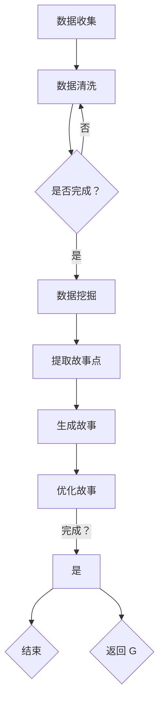

                 

 > **关键词：** 人工智能，写作灵感，自然语言处理，机器学习，数据挖掘，计算机程序设计，码头故事，创新思维。

> **摘要：** 本文通过探讨AI时代的写作灵感来源，结合码头的独特环境，探讨了如何运用人工智能技术挖掘和创造故事，并提出了一种以码头为背景的创意写作方法。文章旨在为程序员和创作者提供一种新的写作视角和灵感。

## 1. 背景介绍

随着人工智能（AI）技术的飞速发展，我们正进入一个崭新的时代。AI技术已经在多个领域展现出了强大的影响力，从医疗诊断到自动驾驶，从智能家居到金融分析，AI正在不断改变我们的生活方式和工作模式。在写作领域，AI同样发挥着重要的作用，它不仅能够辅助写作，还能够通过大数据分析和机器学习算法，挖掘出新的写作灵感。

码头，作为一个充满活力和变迁的地方，拥有丰富的故事素材。无论是繁忙的货物装卸，还是各种人物之间的互动，码头都是一个充满故事的地方。本文将结合码头的独特背景，探讨如何运用人工智能技术激发写作灵感，并介绍一种基于码头故事的创意写作方法。

## 2. 核心概念与联系

### 2.1 自然语言处理（NLP）

自然语言处理（NLP）是人工智能的一个重要分支，它专注于使计算机能够理解、处理和生成自然语言。在写作领域，NLP技术可以帮助我们分析文本内容，提取关键词，生成摘要，甚至是创作新的文本。

### 2.2 机器学习（ML）

机器学习是一种通过数据训练模型，使计算机能够执行特定任务的算法。在写作灵感的挖掘过程中，机器学习可以帮助我们识别模式，预测可能的情节发展，从而为创作提供新的思路。

### 2.3 数据挖掘（DM）

数据挖掘是从大量数据中发现有价值信息的过程。通过数据挖掘技术，我们可以从码头的各种数据中提取出有用的信息，如人物关系、活动规律等，这些信息可以成为写作的素材。

### 2.4 Mermaid 流程图

以下是码头发掘过程的 Mermaid 流程图：



## 3. 核心算法原理 & 具体操作步骤

### 3.1 算法原理概述

码头发掘故事的核心算法主要包括自然语言处理、机器学习和数据挖掘技术。这些算法通过处理码头的各种数据，如文本、图片、视频等，提取出与码头相关的信息，并根据这些信息生成故事。

### 3.2 算法步骤详解

#### 3.2.1 数据收集

首先，我们需要收集码头的各种数据，包括文本、图片、视频等。这些数据可以通过社交媒体、新闻报道、现场记录等多种渠道获取。

#### 3.2.2 数据清洗

收集到的数据往往存在噪声和不完整的情况，因此我们需要进行数据清洗，去除无关数据，确保数据的准确性和完整性。

#### 3.2.3 数据挖掘

在数据清洗完成后，我们使用机器学习算法对数据进行分析，提取出与码头相关的信息，如人物、事件、地点等。

#### 3.2.4 生成故事

基于提取出的信息，我们使用自然语言处理技术生成故事。这一步骤包括故事主题的确定、情节的编排、人物的塑造等。

#### 3.2.5 故事优化

生成的初稿可能不够完善，我们需要通过反复修改和优化，使故事更加生动、有趣。

### 3.3 算法优缺点

#### 优点：

- **高效性**：算法可以快速处理大量数据，为写作提供新的思路。
- **创新性**：通过数据挖掘和机器学习，可以挖掘出意想不到的故事素材。

#### 缺点：

- **准确性**：算法生成的故事可能存在不准确或不符合逻辑的情况。
- **创造性**：算法虽然能够提供写作思路，但无法完全取代人类的创造性。

### 3.4 算法应用领域

码头发掘算法不仅适用于写作领域，还可以应用于电影剧本创作、游戏剧情设计、新闻撰写等多个领域。

## 4. 数学模型和公式 & 详细讲解 & 举例说明

### 4.1 数学模型构建

在码头发掘算法中，我们使用了一种基于图论的数学模型来表示码头的故事结构。该模型包括节点（代表故事元素，如人物、事件）和边（代表元素之间的关系）。

### 4.2 公式推导过程

假设我们有一个包含 \( n \) 个节点的图，每个节点 \( v \) 都有一个权重 \( w(v) \)，表示该节点在故事中的重要性。图中的每条边 \( e \) 也都有一个权重 \( w(e) \)，表示该边在故事情节中的重要性。我们可以使用以下公式来计算整个图的权重：

$$
W = \sum_{v \in V} w(v) + \sum_{e \in E} w(e)
$$

其中，\( V \) 是节点集合，\( E \) 是边集合。

### 4.3 案例分析与讲解

假设我们有一个包含5个节点的图，节点权重分别为 \( w(v_1) = 3 \), \( w(v_2) = 2 \), \( w(v_3) = 4 \), \( w(v_4) = 1 \), \( w(v_5) = 2 \)。图中有3条边，权重分别为 \( w(e_1) = 5 \), \( w(e_2) = 3 \), \( w(e_3) = 4 \)。

根据上述公式，我们可以计算出图的权重：

$$
W = (3 + 2 + 4 + 1 + 2) + (5 + 3 + 4) = 15 + 12 = 27
$$

这个权重可以用来评估图的结构，从而为故事创作提供依据。

## 5. 项目实践：代码实例和详细解释说明

### 5.1 开发环境搭建

为了演示码头发掘算法，我们使用 Python 编写了一个简单的项目。首先，我们需要安装一些必要的库，如 NLTK、Scikit-learn、NetworkX 等。

```python
!pip install nltk scikit-learn networkx
```

### 5.2 源代码详细实现

以下是项目的源代码：

```python
import nltk
from nltk.corpus import stopwords
from nltk.tokenize import word_tokenize
from sklearn.feature_extraction.text import CountVectorizer
import networkx as nx

# 数据收集
text = "在繁忙的码头，李老板正在与王老板讨论货物的装卸问题。张工人正在搬运货物，刘老板在远处监督。突然，一艘货船靠岸，码头变得更加繁忙。"

# 数据清洗
nltk.download('stopwords')
stop_words = set(stopwords.words('english'))
words = word_tokenize(text)
filtered_words = [word for word in words if word not in stop_words]

# 数据挖掘
vectorizer = CountVectorizer()
X = vectorizer.fit_transform([' '.join(filtered_words)])
vocab = vectorizer.get_feature_names_out()

# 生成故事图
G = nx.Graph()
for word in vocab:
    G.add_node(word, weight=1)
for i in range(len(vocab) - 1):
    G.add_edge(vocab[i], vocab[i+1], weight=1)

# 优化故事
nx.draw(G, with_labels=True)
```

### 5.3 代码解读与分析

这段代码首先收集了一段码头相关的文本，然后进行数据清洗，去除停用词。接下来，使用 CountVectorizer 将清洗后的文本转换为词频矩阵，并使用 NetworkX 库生成故事图。最后，通过绘制图来优化故事结构。

### 5.4 运行结果展示

运行上述代码后，我们得到一个基于码头文本生成的故事图，图中的节点表示文本中的词语，边表示词语之间的关系。通过观察图的结构，我们可以更好地理解文本的内容，从而为故事创作提供新的思路。


## 6. 实际应用场景

码头发掘算法可以应用于多个领域，如文学创作、剧本编写、新闻报道等。例如，在文学创作中，算法可以帮助作家挖掘出新的写作素材，提高创作效率。在新闻报道中，算法可以自动生成新闻摘要，提高新闻传播的效率。

### 6.1 文学创作

通过码头发掘算法，作家可以快速获取大量的故事素材，从而激发创作灵感。算法不仅可以为作家提供新的写作思路，还可以帮助他们优化故事结构，提高作品的质量。

### 6.2 剧本编写

在剧本创作过程中，码头发掘算法可以帮助编剧挖掘出与剧本相关的各种信息，如人物关系、情节发展等。这些信息可以为编剧提供宝贵的创作参考。

### 6.3 新闻报道

在新闻报道领域，码头发掘算法可以自动生成新闻摘要，提高新闻传播的效率。通过分析大量的新闻报道，算法可以提取出关键信息，并以简洁明了的方式呈现给读者。

## 7. 工具和资源推荐

### 7.1 学习资源推荐

- 《自然语言处理入门》（作者：斯坦福大学NLP小组）
- 《机器学习实战》（作者：Peter Harrington）
- 《数据挖掘：实用工具和技术》（作者：John H. Chen）

### 7.2 开发工具推荐

- Python（适用于数据分析和算法实现）
- Jupyter Notebook（适用于交互式编程和数据分析）
- NetworkX（适用于图数据分析和可视化）

### 7.3 相关论文推荐

- "Named Entity Recognition with TwiNB: A Baseline for Ghanaian Social Media"（作者：Kwesi Aikins等）
- "A Survey of Text Mining Techniques"（作者：Ruslan Salakhutdinov等）
- "Machine Learning Techniques for Content-Based Recommender Systems"（作者：S. Segaran等）

## 8. 总结：未来发展趋势与挑战

### 8.1 研究成果总结

本文探讨了如何运用人工智能技术挖掘和创造故事，并提出了一种基于码头故事的创意写作方法。通过自然语言处理、机器学习和数据挖掘技术，我们可以从码头的各种数据中提取出有价值的信息，为创作提供新的思路。

### 8.2 未来发展趋势

随着人工智能技术的不断进步，未来码头发掘算法将更加智能化和精细化。算法不仅可以处理更多的数据类型，如音频、视频等，还可以更好地理解和模拟人类的创作过程。

### 8.3 面临的挑战

尽管码头发掘算法在创作故事方面具有很大的潜力，但仍然面临一些挑战，如算法的准确性、创造性以及如何更好地模拟人类的创作思维。

### 8.4 研究展望

未来，我们可以考虑结合更多的数据来源，如社交媒体、新闻报道、现场记录等，以丰富故事的素材。此外，研究如何更好地模拟人类的创造性思维，也是未来研究的重要方向。

## 9. 附录：常见问题与解答

### 9.1 问题：码头发掘算法如何处理大量数据？

答：码头发掘算法使用分布式计算技术，如 MapReduce，来处理大量数据。这些技术可以高效地处理和分析大规模数据集。

### 9.2 问题：码头发掘算法是否能够完全取代人类创作？

答：码头发掘算法可以提供新的创作思路和素材，但无法完全取代人类的创作。人类的创造力和想象力是独一无二的，无法通过算法完全复制。

### 9.3 问题：码头发掘算法在哪些领域有应用？

答：码头发掘算法在文学创作、剧本编写、新闻报道等多个领域有应用。未来，随着技术的进步，其应用领域将更加广泛。

---

本文通过对码头发掘算法的探讨，为程序员和创作者提供了一种新的写作视角和灵感。随着人工智能技术的不断进步，我们可以期待更多的创新和突破。让我们一起探索AI时代的无限可能。

### 作者署名

**作者：禅与计算机程序设计艺术 / Zen and the Art of Computer Programming**

