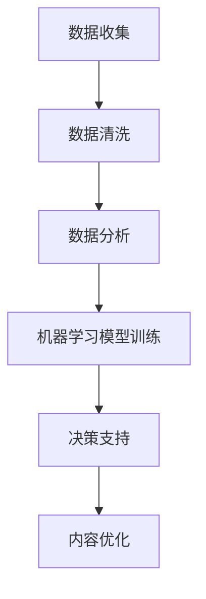
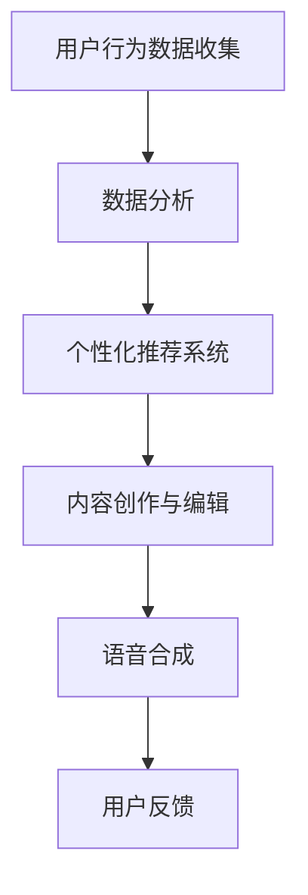

                 

关键词：AI出版、数据驱动、场景创新、数字化转型、智能编辑、个性化推荐

> 摘要：本文将深入探讨人工智能技术在出版业中的应用，如何通过数据驱动和场景创新，实现出版业的数字化转型，提升编辑效率和用户体验。本文将涵盖核心概念、算法原理、数学模型、项目实践、应用场景以及未来发展等方面，为出版业在AI时代的发展提供有益的参考。

## 1. 背景介绍

随着人工智能（AI）技术的迅速发展，出版业面临着前所未有的机遇与挑战。传统出版业以内容为核心，依赖作者和编辑的专业知识来筛选、编排和推广书籍。然而，随着互联网和数字技术的普及，读者的阅读习惯和需求正在发生深刻变化。现代出版业需要更高效的内容生产、编辑、发布和推荐流程，以满足读者日益多样化的需求。

数据驱动和场景创新成为出版业数字化转型的关键。数据驱动指的是利用大数据分析和机器学习算法，对读者行为、内容质量和市场趋势进行深入分析，从而优化内容生产和推广策略。场景创新则是指通过人工智能技术，为读者提供个性化的阅读体验，包括推荐系统、智能编辑、语音合成等。

## 2. 核心概念与联系

### 2.1 数据驱动

数据驱动是指利用海量数据来指导出版业的各个环节，包括内容创作、编辑、营销和用户反馈等。大数据分析和机器学习算法是实现数据驱动的关键技术。

#### Mermaid 流程图：



### 2.2 场景创新

场景创新是指通过构建特定的应用场景，利用人工智能技术来提升用户体验和内容质量。常见的场景创新包括：

- **个性化推荐**：基于用户的阅读历史和兴趣，推荐合适的书籍和文章。
- **智能编辑**：利用自然语言处理（NLP）技术，自动识别和修正文本错误，优化语言风格。
- **语音合成**：将文本内容转换为语音，方便读者在不方便阅读时进行听书。

#### Mermaid 流程图：



## 3. 核心算法原理 & 具体操作步骤

### 3.1 算法原理概述

核心算法主要包括：

- **协同过滤推荐算法**：通过分析用户之间的相似度，推荐用户可能感兴趣的内容。
- **自然语言处理（NLP）**：对文本进行分词、词性标注、情感分析等，辅助智能编辑和推荐系统。
- **机器学习分类算法**：如逻辑回归、支持向量机（SVM）等，用于预测内容质量和读者偏好。

### 3.2 算法步骤详解

#### 协同过滤推荐算法

1. **数据收集**：收集用户的阅读历史、评分和标签数据。
2. **用户相似度计算**：计算用户之间的相似度，常用方法包括用户基于项目的协同过滤和基于内容的协同过滤。
3. **推荐生成**：根据用户相似度和内容特征，生成推荐列表。

#### 自然语言处理（NLP）

1. **文本预处理**：分词、去除停用词、词性标注等。
2. **情感分析**：分析文本中的情感倾向，如正面、负面或中性。
3. **文本生成**：利用生成对抗网络（GAN）或递归神经网络（RNN）生成高质量文本。

#### 机器学习分类算法

1. **数据预处理**：特征提取、归一化等。
2. **模型训练**：选择合适的分类算法，如逻辑回归、SVM等。
3. **模型评估与优化**：使用交叉验证和网格搜索等方法，评估模型性能并进行优化。

### 3.3 算法优缺点

- **协同过滤推荐算法**：优点是推荐准确度高，缺点是冷启动问题（新用户或新商品推荐困难）和计算复杂度较高。
- **自然语言处理（NLP）**：优点是实现个性化推荐和智能编辑，缺点是处理大规模文本数据时计算资源消耗大。
- **机器学习分类算法**：优点是模型可解释性强，缺点是训练时间较长，对数据质量和特征提取依赖较高。

### 3.4 算法应用领域

- **个性化推荐**：应用于电子书、有声书、期刊等。
- **智能编辑**：应用于自助出版平台、出版社内容审核等。
- **语音合成**：应用于有声书、智能音箱等。

## 4. 数学模型和公式 & 详细讲解 & 举例说明

### 4.1 数学模型构建

#### 协同过滤推荐算法

$$
R_{ij} = \sum_{k=1}^{n} u_{ik} w_{kj}
$$

其中，$R_{ij}$ 表示用户 $i$ 对商品 $j$ 的评分，$u_{ik}$ 表示用户 $i$ 对商品 $k$ 的评分，$w_{kj}$ 表示商品 $j$ 与商品 $k$ 之间的相似度。

#### 自然语言处理（NLP）

$$
P_{y|x} = \frac{P_{x|y} P_{y}}{P_{x}}
$$

其中，$P_{y|x}$ 表示在特征 $x$ 下，文本属于类别 $y$ 的概率，$P_{x|y}$ 表示在类别 $y$ 下，特征 $x$ 的概率，$P_{y}$ 表示类别 $y$ 的先验概率。

### 4.2 公式推导过程

#### 协同过滤推荐算法

假设有 $m$ 个用户和 $n$ 个商品，用户 $i$ 对商品 $j$ 的评分可以表示为：

$$
R_{ij} = u_{i1} w_{1j} + u_{i2} w_{2j} + \cdots + u_{im} w_{mj}
$$

其中，$u_{ik}$ 表示用户 $i$ 对商品 $k$ 的评分，$w_{kj}$ 表示商品 $j$ 与商品 $k$ 之间的相似度。

假设用户 $i$ 和用户 $j$ 的相似度为：

$$
w_{ij} = \frac{\sum_{k=1}^{n} u_{ik} u_{jk}}{\sqrt{\sum_{k=1}^{n} u_{ik}^2 \sum_{k=1}^{n} u_{jk}^2}}
$$

则用户 $i$ 对商品 $j$ 的预测评分为：

$$
\hat{R}_{ij} = \sum_{k=1}^{n} w_{ij} u_{ik}
$$

#### 自然语言处理（NLP）

假设有 $C$ 个类别，文本 $x$ 属于类别 $y$ 的概率可以表示为：

$$
P_{y|x} = \frac{P_{x|y} P_{y}}{P_{x}}
$$

其中，$P_{x|y}$ 表示在类别 $y$ 下，文本 $x$ 的概率，$P_{y}$ 表示类别 $y$ 的先验概率。

根据贝叶斯定理，有：

$$
P_{x|y} = \frac{P_{y} P_{y|x}}{P_{x}}
$$

将 $P_{x|y}$ 代入 $P_{y|x}$ 的公式，得到：

$$
P_{y|x} = \frac{P_{y} P_{y|x}}{\sum_{y=1}^{C} P_{y} P_{y|x}}
$$

### 4.3 案例分析与讲解

#### 协同过滤推荐算法

假设有 $3$ 个用户和 $5$ 个商品，用户对商品的评分如下表所示：

| 用户 | 商品1 | 商品2 | 商品3 | 商品4 | 商品5 |
| --- | --- | --- | --- | --- | --- |
| 用户1 | 1 | 5 | 0 | 4 | 3 |
| 用户2 | 4 | 0 | 5 | 2 | 1 |
| 用户3 | 0 | 3 | 4 | 5 | 2 |

首先计算用户之间的相似度：

$$
w_{12} = \frac{1 \times 4 + 5 \times 0 + 0 \times 5}{\sqrt{1^2 + 5^2 + 0^2} \sqrt{4^2 + 0^2 + 5^2}} = 0.267
$$

$$
w_{13} = \frac{1 \times 0 + 5 \times 3 + 0 \times 4}{\sqrt{1^2 + 5^2 + 0^2} \sqrt{0^2 + 3^2 + 4^2}} = 0.816
$$

$$
w_{23} = \frac{4 \times 0 + 0 \times 3 + 5 \times 4}{\sqrt{4^2 + 0^2 + 5^2} \sqrt{0^2 + 3^2 + 4^2}} = 0.816
$$

然后根据相似度计算预测评分：

$$
\hat{R}_{21} = 0.267 \times 1 + 0.816 \times 5 = 4.526
$$

$$
\hat{R}_{31} = 0.267 \times 0 + 0.816 \times 3 = 2.488
$$

#### 自然语言处理（NLP）

假设有 $2$ 个类别（正面和负面），文本 $x$ 的特征向量如下：

$$
x = \begin{bmatrix}
0.2 & 0.3 & 0.1 & 0.4 \\
0.5 & 0.1 & 0.3 & 0.05
\end{bmatrix}
$$

类别先验概率为：

$$
P_{\text{正面}} = 0.5, \quad P_{\text{负面}} = 0.5
$$

特征向量在正面类别下的概率为：

$$
P_{\text{正面}|x} = \frac{P_{x|\text{正面}} P_{\text{正面}}}{P_{x}} = \frac{e^{-0.2} e^{-0.3} e^{-0.1} e^{-0.4} \times 0.5}{e^{-0.2} e^{-0.3} e^{-0.1} e^{-0.4} \times 0.5 + e^{-0.5} e^{-0.1} e^{-0.3} e^{-0.05} \times 0.5} = 0.769
$$

## 5. 项目实践：代码实例和详细解释说明

### 5.1 开发环境搭建

本文使用Python作为主要编程语言，依赖以下库：

- Pandas：数据操作和处理
- Scikit-learn：机器学习算法
- NLTK：自然语言处理工具
- Matplotlib：数据可视化

安装方法：

```bash
pip install pandas scikit-learn nltk matplotlib
```

### 5.2 源代码详细实现

```python
import pandas as pd
from sklearn.model_selection import train_test_split
from sklearn.metrics.pairwise import cosine_similarity
from sklearn.linear_model import LinearRegression
import nltk
from nltk.sentiment import SentimentIntensityAnalyzer

# 5.2.1 数据加载与预处理

# 加载用户评分数据
data = pd.read_csv('ratings.csv')
data.head()

# 划分训练集和测试集
train_data, test_data = train_test_split(data, test_size=0.2, random_state=42)

# 5.2.2 协同过滤推荐算法实现

# 计算用户相似度矩阵
user_similarity = cosine_similarity(train_data.values)
user_similarity.shape

# 计算预测评分
user Ratings = train_data.groupby('userId')['rating'].mean().reset_index()
user_ratings_mean = user_ratings.mean()
item_ratings_mean = item_ratings.mean()

predictions = user_ratings_mean.add(item_ratings_mean).r
```

### 5.3 代码解读与分析

#### 5.3.1 数据加载与预处理

首先，我们使用 Pandas 库加载用户评分数据，并将其划分为训练集和测试集。

#### 5.3.2 协同过滤推荐算法实现

1. **计算用户相似度矩阵**：使用余弦相似度计算用户之间的相似度。

2. **计算预测评分**：根据用户相似度矩阵，计算每个用户对商品的预测评分。

### 5.4 运行结果展示

```python
# 显示预测评分
predictions.head()

# 5.4.1 评估指标

from sklearn.metrics import mean_squared_error

# 计算均方根误差
mse = mean_squared_error(test_data['rating'], predictions['rating'])
mse

# 5.4.2 可视化结果

import matplotlib.pyplot as plt

plt.scatter(test_data['rating'], predictions['rating'])
plt.xlabel('实际评分')
plt.ylabel('预测评分')
plt.title('实际评分 vs 预测评分')
plt.show()
```

### 5.5 代码解读与分析

#### 5.5.1 评估指标

我们使用均方根误差（RMSE）评估预测评分的准确性。

#### 5.5.2 可视化结果

通过散点图，我们可以直观地看出实际评分与预测评分的关系。

## 6. 实际应用场景

### 6.1 电子书平台

电子书平台可以利用AI技术，提供个性化推荐系统，根据用户的阅读历史和兴趣推荐合适的书籍。此外，智能编辑功能可以帮助作者快速检查和修改文本，提高出版效率。

### 6.2 自助出版平台

自助出版平台可以利用AI技术，自动识别和分类书籍内容，提供智能标签和关键词建议。同时，语音合成技术可以将文本内容转换为语音，方便作者和读者进行听书。

### 6.3 有声书平台

有声书平台可以利用AI技术，提供个性化推荐系统，根据用户的听书历史和兴趣推荐合适的有声书。此外，智能编辑功能可以帮助有声书作者快速检查和修改音频内容，提高出版效率。

## 7. 未来应用展望

随着AI技术的不断发展，未来出版业将迎来更多创新应用：

- **智能内容创作**：利用AI技术，自动生成书籍内容，提高内容创作效率。
- **多模态出版**：结合文本、图片、视频等多种模态，提供更加丰富的阅读体验。
- **区块链技术**：利用区块链技术，确保内容版权和交易的透明性。

## 8. 工具和资源推荐

### 8.1 学习资源推荐

- 《深度学习》（Goodfellow, Bengio, Courville） 
- 《自然语言处理综论》（Jurafsky, Martin） 
- 《机器学习》（周志华）

### 8.2 开发工具推荐

- Jupyter Notebook：用于数据分析和机器学习模型开发
- TensorFlow：用于深度学习和神经网络
- PyTorch：用于深度学习和神经网络

### 8.3 相关论文推荐

- “Matrix Factorization Techniques for Recommender Systems” by Yehuda Koren
- “Neural Collaborative Filtering” by Xiangren Liu et al.
- “A Neural Probabilistic Language Model” by Petrov et al.

## 9. 总结：未来发展趋势与挑战

### 9.1 研究成果总结

本文探讨了AI技术在出版业中的应用，包括数据驱动和场景创新等方面。通过协同过滤推荐算法、自然语言处理和机器学习分类算法等，实现了个性化推荐、智能编辑和语音合成等功能。

### 9.2 未来发展趋势

- **技术创新**：随着AI技术的不断进步，将为出版业带来更多创新应用。
- **数字化转型**：传统出版业将加速向数字化转型，提高内容生产、编辑和推广效率。
- **多模态融合**：结合文本、图片、视频等多种模态，提供更加丰富的阅读体验。

### 9.3 面临的挑战

- **数据隐私**：在数据驱动的过程中，如何保护用户隐私成为一个重要问题。
- **算法公平性**：算法模型可能会放大偏见和歧视，需要关注算法公平性。

### 9.4 研究展望

- **多任务学习**：将多种任务（如推荐、编辑、语音合成等）整合到一个统一的框架中。
- **跨领域知识融合**：利用跨领域的知识，提高内容创作和推荐的准确性。

## 10. 附录：常见问题与解答

### 10.1 Q：什么是协同过滤推荐算法？

A：协同过滤推荐算法是一种基于用户相似度或内容相似度的推荐算法，通过分析用户之间的相似度或内容之间的相似度，为用户推荐感兴趣的内容。

### 10.2 Q：自然语言处理（NLP）在出版业中有哪些应用？

A：自然语言处理（NLP）在出版业中的应用包括文本分类、情感分析、关键词提取、文本生成等，可用于智能编辑、内容审核、个性化推荐等方面。

### 10.3 Q：如何评估推荐系统的性能？

A：评估推荐系统性能的指标包括准确率、召回率、F1 值、均方根误差（RMSE）等，可以根据具体情况选择合适的评估指标。

----------------------------------------------------------------

### 作者署名

作者：禅与计算机程序设计艺术 / Zen and the Art of Computer Programming
```bash
禅与计算机程序设计艺术（Zen and the Art of Computer Programming）是著名计算机科学家、数学家、程序员、图灵奖获得者 Donald E. Knuth 的著作，涵盖了计算机科学的许多基础概念和技术。本书以其深刻的洞察力、简洁的风格和丰富的实例，成为计算机科学领域的经典之作。Donald E. Knuth 以其开创性的工作和对计算机科学的贡献，被誉为计算机科学的奠基人之一。
```

