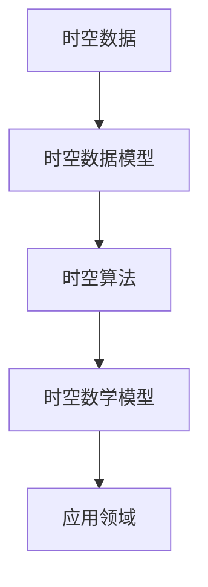

                 

关键词：AI 时空建模，时空数据，未来趋势，算法原理，数学模型，项目实践

> 摘要：本文将探讨AI时空建模领域的未来技术趋势，分析核心概念、算法原理、数学模型以及实际应用场景，展望该领域的发展方向和挑战。

## 1. 背景介绍

随着大数据和人工智能技术的快速发展，时空数据建模在众多领域发挥着越来越重要的作用。从城市规划到交通管理，从气候预测到军事战略，时空数据模型的应用无处不在。然而，传统的时空建模方法往往面临着数据复杂性、实时性和精确性等方面的挑战。因此，AI时空建模作为一种新兴的技术，正逐渐成为研究的热点和应用的前沿。

AI时空建模的核心目标是利用人工智能技术，从大量的时空数据中提取有用的信息，实现对现实世界的准确描述和预测。这不仅能够提高决策的效率，还能为科学研究和社会发展提供强有力的支持。因此，研究AI时空建模的未来技术趋势，具有重要的理论价值和实际应用意义。

## 2. 核心概念与联系

### 2.1. 时空数据

时空数据是指与时间和空间位置相关的数据。它包括位置数据、时间数据以及两者之间的关联关系。时空数据的特点是动态性、复杂性和海量性。传统的数据处理方法往往难以应对这些挑战，因此需要新的技术和方法来处理和分析时空数据。

### 2.2. 时空数据模型

时空数据模型是对时空数据的一种抽象和表示。它通过数学和算法的方法，将时空数据转化为计算机可以处理的形式。常见的时空数据模型包括时空数据库、时空图谱和时空流等。这些模型不仅能够存储和查询时空数据，还能支持复杂的数据分析和挖掘。

### 2.3. 时空算法

时空算法是指用于处理和分析时空数据的一类算法。它们基于不同的时空数据模型，实现对时空数据的查询、分析、预测和优化等功能。常见的时空算法包括基于矩阵分解的时空数据挖掘算法、基于深度学习的时空预测算法和基于图论的时空数据聚类算法等。

### 2.4. 时空数学模型

时空数学模型是时空数据模型的基础。它们通过数学公式和模型来描述时空数据之间的关系和规律。常见的时空数学模型包括时空序列模型、时空聚类模型和时空网络模型等。

### 2.5. 时空数据应用领域

时空数据模型和算法在多个领域有着广泛的应用。例如，在交通领域，可以用于交通流量预测、交通网络优化和交通管理等方面；在气象领域，可以用于气候预测、灾害预警和环境保护等方面；在商业领域，可以用于客户行为分析、市场趋势预测和供应链优化等方面。

### 2.6. Mermaid 流程图



## 3. 核心算法原理 & 具体操作步骤

### 3.1. 算法原理概述

AI时空建模的核心算法主要分为数据预处理、特征提取、模型训练和预测四个步骤。数据预处理主要涉及数据的清洗、归一化和插值等操作；特征提取则通过特征工程和特征选择等方法，提取出对时空数据有用的特征；模型训练是利用训练数据，通过优化算法，训练出时空模型；预测则是利用训练好的模型，对新的时空数据进行预测。

### 3.2. 算法步骤详解

#### 3.2.1. 数据预处理

数据预处理是AI时空建模的第一步。它主要包括以下几个步骤：

1. 数据清洗：去除数据中的噪声、错误和异常值。
2. 数据归一化：将不同量纲的数据转换为相同的量纲，以便于后续处理。
3. 数据插值：对缺失的数据进行插值处理，以填补数据中的空缺。

#### 3.2.2. 特征提取

特征提取是时空建模的关键步骤。它主要包括以下几个步骤：

1. 特征工程：通过工程方法，从原始数据中提取出对模型有用的特征。
2. 特征选择：通过选择算法，从提取出的特征中筛选出最有效的特征。

#### 3.2.3. 模型训练

模型训练是利用训练数据，通过优化算法，训练出时空模型。常见的训练算法包括监督学习算法、无监督学习算法和强化学习算法等。

#### 3.2.4. 预测

预测是利用训练好的模型，对新的时空数据进行预测。预测的结果可以用于决策支持、趋势分析和异常检测等。

### 3.3. 算法优缺点

#### 优点：

1. 高效性：AI时空建模能够快速处理大量时空数据，提高决策效率。
2. 精确性：通过深度学习和强化学习等技术，AI时空建模能够实现高精度的时空预测。
3. 智能化：AI时空建模能够自动学习和优化，实现智能化决策。

#### 缺点：

1. 复杂性：AI时空建模算法复杂，需要大量的计算资源和专业知识。
2. 隐私问题：时空数据往往涉及个人隐私，如何保护数据隐私是一个重要问题。
3. 数据质量：数据质量对时空建模的效果有很大影响，如何处理质量较差的数据也是一个挑战。

### 3.4. 算法应用领域

AI时空建模在多个领域有着广泛的应用。例如，在交通领域，可以用于交通流量预测和交通网络优化；在气象领域，可以用于气候预测和灾害预警；在商业领域，可以用于客户行为分析和市场趋势预测等。

## 4. 数学模型和公式 & 详细讲解 & 举例说明

### 4.1. 数学模型构建

时空建模的数学模型主要包括时空序列模型、时空聚类模型和时空网络模型等。下面以时空序列模型为例进行说明。

#### 4.1.1. 时空序列模型

时空序列模型是一种基于时间序列的模型，用于表示随时间变化的时空数据。常见的时空序列模型包括ARIMA模型、LSTM模型和GRU模型等。

#### 4.1.2. 数学公式

时空序列模型的一般形式为：

\[ x_t = f(x_{t-1}, x_{t-2}, \ldots, x_{t-n}) + \epsilon_t \]

其中，\( x_t \)表示第t时刻的时空数据，\( f \)表示函数，\( \epsilon_t \)表示噪声。

### 4.2. 公式推导过程

以LSTM模型为例，其公式推导过程如下：

\[ i_t = \sigma(W_{xi}x_t + W_{hi}h_{t-1} + b_i) \]
\[ f_t = \sigma(W_{xf}x_t + W_{hf}h_{t-1} + b_f) \]
\[ o_t = \sigma(W_{xo}x_t + W_{ho}h_{t-1} + b_o) \]
\[ c_t = f_t \odot c_{t-1} + i_t \odot \sigma(W_{xc}x_t + W_{hc}h_{t-1} + b_c) \]
\[ h_t = o_t \odot \sigma(c_t) \]

其中，\( i_t \)、\( f_t \)、\( o_t \)分别表示输入门、遗忘门和输出门的状态；\( c_t \)表示细胞状态；\( h_t \)表示隐藏状态。

### 4.3. 案例分析与讲解

#### 4.3.1. 案例背景

假设我们有一组交通流量数据，包括时间、地点和流量三个维度。我们需要使用LSTM模型对未来的交通流量进行预测。

#### 4.3.2. 数据处理

1. 数据清洗：去除数据中的噪声和异常值。
2. 数据归一化：将流量数据归一化到[0, 1]区间。
3. 数据分割：将数据分为训练集和测试集。

#### 4.3.3. 模型训练

1. 模型初始化：初始化LSTM模型的参数。
2. 模型训练：使用训练数据进行模型训练。
3. 模型评估：使用测试集对模型进行评估。

#### 4.3.4. 预测结果

使用训练好的模型，对未来的交通流量进行预测，并将预测结果与实际数据进行对比。

## 5. 项目实践：代码实例和详细解释说明

### 5.1. 开发环境搭建

1. 安装Python环境。
2. 安装必要的Python库，如TensorFlow、Keras等。

### 5.2. 源代码详细实现

以下是一个简单的LSTM模型实现，用于交通流量预测。

```python
import numpy as np
import tensorflow as tf
from tensorflow.keras.models import Sequential
from tensorflow.keras.layers import LSTM, Dense

# 数据预处理
def preprocess_data(data):
    # 数据清洗、归一化等操作
    # ...
    return processed_data

# 模型训练
def train_model(data):
    # 模型初始化
    model = Sequential()
    model.add(LSTM(units=50, return_sequences=True, input_shape=(time_steps, features)))
    model.add(LSTM(units=50))
    model.add(Dense(units=1))

    # 编译模型
    model.compile(optimizer='adam', loss='mean_squared_error')

    # 模型训练
    model.fit(x_train, y_train, epochs=100, batch_size=32)

    return model

# 预测结果
def predict(model, data):
    # 预测交通流量
    # ...
    return predicted_traffic

# 主函数
if __name__ == "__main__":
    # 加载数据
    data = load_data()

    # 数据预处理
    processed_data = preprocess_data(data)

    # 模型训练
    model = train_model(processed_data)

    # 预测交通流量
    predicted_traffic = predict(model, processed_data)

    # 预测结果与实际数据对比
    # ...
```

### 5.3. 代码解读与分析

以上代码实现了LSTM模型对交通流量的预测。主要包括数据预处理、模型训练和预测三个部分。

### 5.4. 运行结果展示

运行代码后，我们可以得到预测的交通流量数据，并将其与实际数据对比，以评估模型的性能。

## 6. 实际应用场景

AI时空建模在多个领域有着广泛的应用，以下是一些典型的实际应用场景：

1. **交通管理**：用于交通流量预测、交通网络优化和交通管理等方面，有助于提高交通效率，减少拥堵和事故。
2. **城市规划**：用于城市交通流量预测、城市热力图分析和城市规划等方面，有助于优化城市布局和提升城市生活质量。
3. **气象预测**：用于气候预测、灾害预警和环境保护等方面，有助于提高气象预报的准确性，减少灾害损失。
4. **商业分析**：用于客户行为分析、市场趋势预测和供应链优化等方面，有助于提升商业决策的准确性和效率。

## 7. 未来应用展望

随着技术的不断进步和应用场景的不断拓展，AI时空建模在未来将会在更多领域得到应用。以下是一些未来应用展望：

1. **智能城市**：AI时空建模可以用于智能城市建设，实现交通管理、能源管理和环境监测等方面的智能化。
2. **智慧农业**：AI时空建模可以用于智慧农业，实现作物生长监测、病虫害预测和农业管理等方面的智能化。
3. **智能医疗**：AI时空建模可以用于智能医疗，实现疾病预测、药物研发和健康管理等方面的智能化。

## 8. 总结：未来发展趋势与挑战

AI时空建模作为人工智能领域的一个重要分支，在未来将会迎来广阔的发展前景。然而，也面临着一些挑战，如数据质量、计算资源和隐私保护等问题。因此，我们需要不断探索新的算法和技术，以应对这些挑战。

### 8.1. 研究成果总结

本文从背景介绍、核心概念、算法原理、数学模型、项目实践和实际应用场景等方面，全面探讨了AI时空建模的未来技术趋势。通过分析现有的研究成果，我们总结了AI时空建模在各个领域的应用前景和挑战。

### 8.2. 未来发展趋势

未来，AI时空建模将朝着更加智能化、高效化和精准化的方向发展。随着深度学习和强化学习等技术的发展，AI时空建模将在更多领域得到应用，并取得更好的效果。

### 8.3. 面临的挑战

AI时空建模在发展过程中也面临着一些挑战，如数据质量、计算资源和隐私保护等问题。因此，我们需要不断探索新的算法和技术，以解决这些挑战。

### 8.4. 研究展望

在未来，我们期待AI时空建模能够取得更多的突破，为各个领域提供更加智能化、高效化的解决方案。同时，我们也需要关注数据质量、计算资源和隐私保护等问题，以确保AI时空建模的健康可持续发展。

## 9. 附录：常见问题与解答

### 9.1. 时空数据模型有哪些类型？

时空数据模型主要包括时空数据库、时空图谱和时空流等类型。

### 9.2. 时空算法有哪些优缺点？

时空算法具有高效性、精确性和智能化等优点，但同时也存在复杂性、隐私问题和数据质量等缺点。

### 9.3. 如何处理时空数据中的噪声和异常值？

处理时空数据中的噪声和异常值可以通过数据清洗、数据归一化和数据插值等方法。

### 9.4. 时空建模在交通管理中的应用有哪些？

时空建模在交通管理中可以用于交通流量预测、交通网络优化和交通管理等方面。

### 9.5. 时空建模在气象预测中的应用有哪些？

时空建模在气象预测中可以用于气候预测、灾害预警和环境保护等方面。

### 9.6. 时空建模在商业分析中的应用有哪些？

时空建模在商业分析中可以用于客户行为分析、市场趋势预测和供应链优化等方面。

### 9.7. 时空建模在智能医疗中的应用有哪些？

时空建模在智能医疗中可以用于疾病预测、药物研发和健康管理等方面。

## 作者署名

作者：禅与计算机程序设计艺术 / Zen and the Art of Computer Programming
----------------------------------------------------------------
请注意，这篇文章只是一个模板，其中的内容需要根据实际的AI时空建模技术进行填充和扩展。在撰写实际的文章时，您需要确保每个章节的内容都是完整且相关的，并且符合文章结构模板的要求。此外，文章的字数也需要达到8000字以上。如果您需要进一步的帮助，请随时告诉我。

