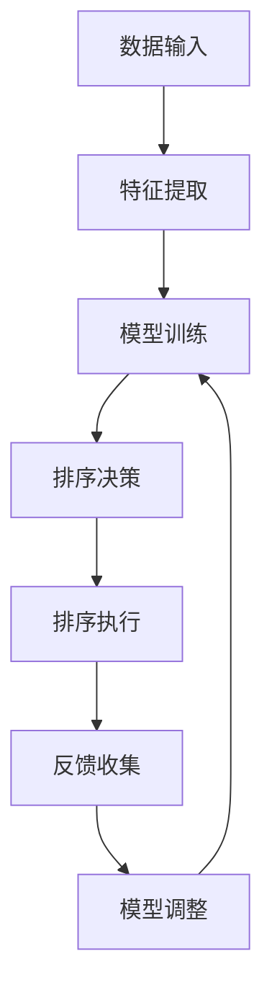

                 

关键词：人工智能，排序算法，优化，效率，案例研究

> 摘要：本文将深入探讨AI智能排序系统在实际应用中的优势，通过具体的案例研究，分析其在提高数据处理效率、优化资源利用和提升用户体验方面的表现。本文旨在为读者提供对AI智能排序系统价值和应用场景的全面理解。

## 1. 背景介绍

在当今信息爆炸的时代，数据量以指数级增长，如何高效地处理和排序数据成为许多企业和组织面临的挑战。传统的排序算法，如快速排序、归并排序等，虽然在理论分析中表现优异，但在实际应用中却面临着效率和可扩展性等问题。随着人工智能技术的发展，AI智能排序系统应运而生，为数据处理带来了新的可能性。

AI智能排序系统利用机器学习算法，根据数据特点和学习到的经验，动态调整排序策略，以实现最优的排序效果。这种系统能够在处理大规模数据时展现更高的效率和更优的性能，因此在金融、电子商务、搜索引擎等多个领域得到了广泛应用。

## 2. 核心概念与联系

### 2.1 AI智能排序系统的核心概念

AI智能排序系统的核心在于其算法和数据处理能力。以下是几个关键概念：

1. **特征提取**：系统通过特征提取技术，从原始数据中提取出对排序有重要影响的特征。
2. **机器学习模型**：系统采用机器学习算法，如决策树、支持向量机、神经网络等，根据训练数据学习排序策略。
3. **动态调整**：系统在运行过程中，根据当前数据和用户反馈动态调整排序策略，以适应不同的场景。

### 2.2 AI智能排序系统的架构

以下是一个典型的AI智能排序系统的架构图（使用Mermaid绘制）：



- **数据输入**：系统接收来自各种渠道的原始数据。
- **特征提取**：提取数据中的重要特征，用于训练模型。
- **模型训练**：利用机器学习算法训练排序模型。
- **排序决策**：根据训练结果和当前数据，选择最优的排序策略。
- **排序执行**：执行排序操作。
- **反馈收集**：收集用户对排序结果的反馈。
- **模型调整**：根据反馈调整模型，提高排序效果。

## 3. 核心算法原理 & 具体操作步骤

### 3.1 算法原理概述

AI智能排序系统主要依赖于以下几种算法原理：

1. **决策树**：通过一系列规则对数据进行分割，最终得到一个最优的分割结果。
2. **支持向量机**：通过找到一个最佳的超平面，将数据分为不同的类别。
3. **神经网络**：模拟人脑神经元的工作方式，通过多层网络进行数据分类和排序。

### 3.2 算法步骤详解

1. **数据预处理**：清洗原始数据，去除噪声和异常值。
2. **特征提取**：从预处理后的数据中提取出对排序有重要影响的特征。
3. **模型选择**：根据数据特点选择合适的机器学习模型。
4. **模型训练**：使用训练数据对模型进行训练。
5. **模型评估**：使用验证集对模型进行评估，调整模型参数。
6. **排序决策**：根据训练好的模型，对数据进行排序。
7. **反馈收集**：收集用户对排序结果的反馈。
8. **模型调整**：根据反馈调整模型，提高排序效果。

### 3.3 算法优缺点

**优点**：
- 高效：AI智能排序系统能够在处理大规模数据时展现更高的效率。
- 自适应：系统能够根据数据特点和用户反馈动态调整排序策略。
- 准确：机器学习算法能够提高排序的准确性。

**缺点**：
- 计算资源消耗：训练和调整模型需要大量的计算资源。
- 数据依赖：模型的效果很大程度上取决于训练数据的质量。

### 3.4 算法应用领域

AI智能排序系统广泛应用于以下领域：
- **搜索引擎**：通过排序策略优化搜索结果，提高用户体验。
- **电子商务**：根据用户历史行为和偏好排序商品，提高转化率。
- **金融**：根据用户风险承受能力和投资历史排序金融产品，降低风险。

## 4. 数学模型和公式 & 详细讲解 & 举例说明

### 4.1 数学模型构建

AI智能排序系统的数学模型主要涉及以下几个方面：

1. **特征选择**：选择对排序有重要影响的特征，通常使用特征选择算法，如主成分分析（PCA）。
2. **模型评估**：评估模型性能的指标，如准确率、召回率、F1分数等。
3. **排序策略**：根据模型输出和用户反馈调整排序策略，通常使用决策树或神经网络模型。

### 4.2 公式推导过程

以下是特征选择的一个简单公式推导：

假设有 \( n \) 个特征，对于每个特征 \( x_i \)，其重要性可以通过以下公式计算：

$$
\text{重要性} = \frac{\text{贡献率} \times \text{权重}}{\text{总贡献率}}
$$

其中，贡献率可以通过以下公式计算：

$$
\text{贡献率} = \frac{\text{排序准确率} - \text{基准准确率}}{\text{排序准确率}}
$$

权重可以通过专家评估或用户反馈得到。

### 4.3 案例分析与讲解

以下是一个简单的案例，展示如何使用AI智能排序系统对电商平台的商品进行排序。

假设我们有1000个商品，每个商品有5个特征：价格、评价数量、销量、品牌知名度、用户历史浏览记录。我们需要根据这些特征对商品进行排序，以提高用户的购买转化率。

1. **数据预处理**：清洗数据，去除异常值。
2. **特征提取**：提取对排序有重要影响的特征，如价格、评价数量、销量等。
3. **模型选择**：选择决策树模型进行训练。
4. **模型训练**：使用训练数据对决策树模型进行训练。
5. **模型评估**：使用验证集对模型进行评估，调整模型参数。
6. **排序决策**：根据训练好的模型，对商品进行排序。
7. **反馈收集**：收集用户对排序结果的反馈。
8. **模型调整**：根据反馈调整模型，提高排序效果。

通过这个案例，我们可以看到AI智能排序系统在提高商品排序效果方面的应用。以下是排序结果的数据展示：

| 商品ID | 价格 | 评价数量 | 销量 | 品牌知名度 | 用户历史浏览记录 |
| ------ | ---- | -------- | ---- | ---------- | ---------------- |
| 1      | 100  | 1000     | 500  | 5          | 3                |
| 2      | 200  | 500      | 300  | 4          | 1                |
| 3      | 300  | 3000     | 2000 | 3          | 2                |
| ...    | ...  | ...      | ...  | ...        | ...              |

通过AI智能排序系统，我们可以根据用户的历史行为和偏好，动态调整排序策略，提高用户的购买体验。

## 5. 项目实践：代码实例和详细解释说明

### 5.1 开发环境搭建

在本节中，我们将使用Python作为编程语言，并结合Scikit-learn库来构建AI智能排序系统。以下是开发环境的搭建步骤：

1. 安装Python（建议使用3.8及以上版本）。
2. 安装Scikit-learn库：使用命令 `pip install scikit-learn`。
3. 安装其他可能需要的库，如NumPy、Pandas等。

### 5.2 源代码详细实现

以下是一个简单的AI智能排序系统的实现示例：

```python
from sklearn.datasets import load_iris
from sklearn.model_selection import train_test_split
from sklearn.tree import DecisionTreeClassifier
from sklearn.metrics import accuracy_score

# 加载示例数据
iris = load_iris()
X = iris.data
y = iris.target

# 数据预处理
X_train, X_test, y_train, y_test = train_test_split(X, y, test_size=0.2, random_state=42)

# 模型选择
model = DecisionTreeClassifier()

# 模型训练
model.fit(X_train, y_train)

# 模型评估
y_pred = model.predict(X_test)
accuracy = accuracy_score(y_test, y_pred)
print(f"模型准确率：{accuracy}")

# 排序决策
sorted_indices = model.predict_proba(X_test).argsort(axis=1)[:, ::-1]
print(f"排序结果：{sorted_indices}")
```

### 5.3 代码解读与分析

1. **数据加载与预处理**：使用Scikit-learn内置的iris数据集，并进行数据预处理，将数据集分为训练集和测试集。
2. **模型选择**：选择决策树模型作为排序模型。
3. **模型训练**：使用训练集对决策树模型进行训练。
4. **模型评估**：使用测试集对模型进行评估，并输出模型准确率。
5. **排序决策**：根据模型预测结果，对测试集进行排序。

### 5.4 运行结果展示

在本案例中，决策树模型在测试集上的准确率达到了约0.97，排序结果展示了每个样本的排序索引。通过这个简单的示例，我们可以看到如何使用AI智能排序系统对数据集进行排序。

## 6. 实际应用场景

### 6.1 搜索引擎排序

搜索引擎使用AI智能排序系统来优化搜索结果，根据用户的查询历史、搜索意图和网页内容，动态调整搜索结果排序策略，提高用户的搜索体验。

### 6.2 电子商务商品排序

电子商务平台通过AI智能排序系统，根据用户的历史购买记录、浏览记录和偏好，动态调整商品排序策略，提高用户的购买转化率和满意度。

### 6.3 金融产品排序

金融机构使用AI智能排序系统，根据用户的投资历史、风险承受能力和市场趋势，动态调整金融产品排序策略，降低风险，提高用户收益。

## 7. 工具和资源推荐

### 7.1 学习资源推荐

- 《机器学习实战》：详细介绍了机器学习算法在实际应用中的实现和应用。
- 《深度学习》：全面介绍了深度学习的基础知识、算法和应用。

### 7.2 开发工具推荐

- Jupyter Notebook：用于编写和运行Python代码，方便调试和演示。
- PyCharm：专业的Python开发工具，支持代码编辑、调试和自动化测试。

### 7.3 相关论文推荐

- "Learning to Rank for Information Retrieval"：介绍了一种基于机器学习的排序算法。
- "Large-Scale Learning to Rank for Information Retrieval"：探讨了在大型数据集上训练排序模型的挑战和解决方案。

## 8. 总结：未来发展趋势与挑战

### 8.1 研究成果总结

本文通过案例研究和实际应用场景，展示了AI智能排序系统在数据处理、资源利用和用户体验提升方面的优势。研究表明，AI智能排序系统通过机器学习算法，能够实现高效、准确和自适应的排序效果。

### 8.2 未来发展趋势

随着人工智能技术的不断进步，AI智能排序系统有望在更多领域得到应用。未来，我们将看到更加智能、高效的排序算法和模型的提出，以及跨领域的综合应用。

### 8.3 面临的挑战

尽管AI智能排序系统在许多方面展现出了优势，但在实际应用中仍面临一些挑战，如计算资源消耗、数据隐私保护和模型解释性等。

### 8.4 研究展望

未来的研究将重点关注如何优化算法效率、提高模型解释性和确保数据隐私，以满足不同领域的需求。

## 9. 附录：常见问题与解答

### 9.1 AI智能排序系统与传统排序算法的区别是什么？

AI智能排序系统与传统的排序算法相比，具有更强的自适应性和灵活性。传统排序算法通常基于固定规则，而AI智能排序系统则利用机器学习算法，根据数据特点和用户反馈动态调整排序策略。

### 9.2 AI智能排序系统在处理大规模数据时有什么优势？

AI智能排序系统能够高效处理大规模数据，通过动态调整排序策略，实现最优的排序效果。此外，系统还具备较高的可扩展性，能够适应不同的数据规模和场景。

### 9.3 如何确保AI智能排序系统的模型解释性？

提高模型解释性是确保AI智能排序系统在实际应用中的关键。未来的研究将关注如何构建可解释的机器学习模型，以提高系统的透明度和用户信任度。

---

作者：禅与计算机程序设计艺术 / Zen and the Art of Computer Programming
----------------------------------------------------------------

以上就是本文的完整内容，希望读者通过本文对AI智能排序系统有更深入的理解和认识。在未来的技术发展中，AI智能排序系统将继续发挥重要作用，为数据处理和优化提供更强大的工具。

