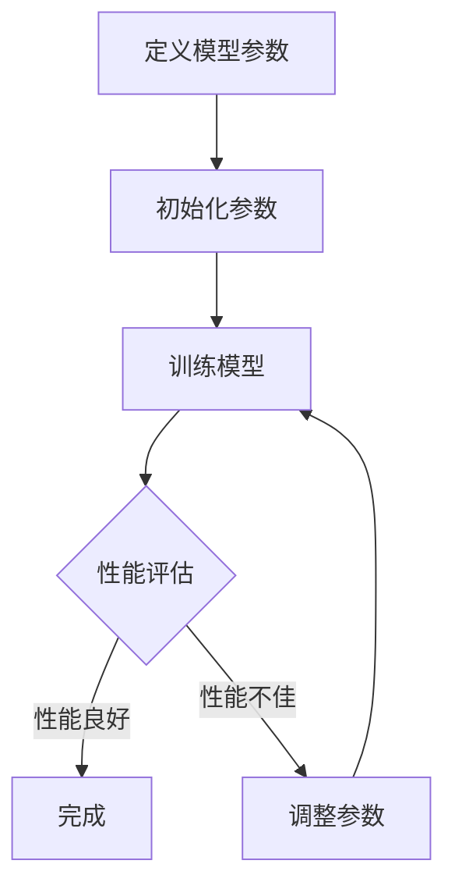

                 

 关键词：AI模型，scaling，参数，性能，关系，深度学习，机器学习，计算资源，硬件优化。

> 摘要：本文旨在深入探讨AI模型scaling的过程，特别是在参数调整与性能优化之间的复杂关系。文章首先介绍了AI模型的基本概念和当前的规模挑战，接着详细阐述了模型参数与性能之间的联系，包括关键算法原理和具体操作步骤。随后，文章通过数学模型和公式推导，展示了如何分析和优化模型性能。最后，文章通过代码实例和实际应用场景，验证了理论分析的有效性，并对未来发展趋势和面临的挑战进行了展望。

## 1. 背景介绍

随着深度学习和机器学习技术的飞速发展，AI模型在各个领域的应用越来越广泛。然而，AI模型的开发和应用也面临着一系列挑战，其中之一便是如何有效地进行模型scaling（调整）。scaling不仅仅是为了适应不同的任务和数据集，更是为了提升模型的性能和效率，从而在实际应用中发挥更大的作用。

在AI模型开发过程中，模型的参数数量和类型是一个关键因素。参数的调整直接影响到模型的复杂度和性能。然而，如何平衡参数的数量和类型，以实现最优的性能，是一个复杂的优化问题。这不仅涉及到对模型本身的深入理解，还需要考虑计算资源和硬件优化等多个方面。

本文将围绕AI模型scaling的主题，探讨从参数调整到性能优化的全过程。我们将介绍相关核心概念和算法，并通过数学模型和代码实例，展示如何实现有效的模型scaling。

## 2. 核心概念与联系

### 2.1 AI模型的基本概念

AI模型，尤其是深度学习模型，通常由大量的参数组成。这些参数决定了模型的复杂度和学习能力。一个基本的深度学习模型通常包括以下几个组成部分：

- **输入层**：接收外部输入数据。
- **隐藏层**：包含多个神经元，进行数据的前向传播和反向传播。
- **输出层**：生成模型的预测结果。

每个神经元都会通过权重（weights）和偏置（biases）与相邻的神经元连接。这些权重和偏置就是模型的参数，它们的值决定了模型的学习能力和拟合效果。

### 2.2 模型参数与性能的关系

模型的性能通常通过以下指标进行评估：

- **准确率（Accuracy）**：模型正确预测的样本数量占总样本数量的比例。
- **损失函数（Loss Function）**：衡量模型预测结果与实际结果之间的差距。
- **训练时间（Training Time）**：模型从初始化到收敛所需的时间。

模型的参数数量和类型对上述性能指标有着直接的影响。增加参数数量可以提升模型的复杂度和学习能力，但同时也会增加模型的训练时间和计算资源消耗。

### 2.3 关键算法原理

在深度学习领域，常用的算法包括：

- **反向传播算法（Backpropagation）**：用于计算模型参数的梯度，以实现参数的优化。
- **优化算法（Optimization Algorithms）**：如梯度下降（Gradient Descent）及其变种，用于调整模型参数。
- **正则化技术（Regularization Techniques）**：如Dropout、L1和L2正则化，用于防止过拟合。

这些算法共同作用，帮助我们在参数调整过程中实现性能优化。

### 2.4 Mermaid流程图

以下是一个简化的Mermaid流程图，展示了AI模型Scaling的过程：



### 2.5 总结

在本章节中，我们介绍了AI模型的基本概念和模型参数与性能之间的关系。通过一个简化的流程图，我们展示了模型Scaling的过程。接下来，我们将深入探讨核心算法原理和具体操作步骤。

## 3. 核心算法原理 & 具体操作步骤

### 3.1 算法原理概述

在AI模型Scaling过程中，核心算法的作用至关重要。以下将介绍几种关键的算法原理：

- **反向传播算法**：用于计算模型参数的梯度，是实现模型优化的基础。
- **优化算法**：如梯度下降算法及其变种，用于调整模型参数，实现性能优化。
- **正则化技术**：用于防止模型过拟合，提升泛化能力。

### 3.2 算法步骤详解

#### 3.2.1 反向传播算法

反向传播算法是一种用于计算神经网络中每个参数的梯度的方法。其基本步骤如下：

1. **前向传播**：将输入数据传递到网络中，计算输出结果。
2. **计算损失函数**：将预测结果与实际结果进行比较，计算损失。
3. **反向传播**：从输出层开始，反向计算每个参数的梯度。
4. **参数更新**：使用梯度更新模型参数，以减少损失。

#### 3.2.2 优化算法

优化算法用于调整模型参数，以实现性能优化。其中，梯度下降算法是最常见的一种。其基本步骤如下：

1. **初始化参数**：设定初始参数值。
2. **计算梯度**：使用反向传播算法计算每个参数的梯度。
3. **更新参数**：根据梯度方向和步长更新参数。
4. **迭代过程**：重复上述步骤，直到满足停止条件（如损失函数收敛）。

#### 3.2.3 正则化技术

正则化技术用于防止模型过拟合，提升泛化能力。常见的正则化技术包括：

- **Dropout**：在训练过程中随机忽略一部分神经元，减少模型依赖。
- **L1和L2正则化**：在损失函数中添加L1或L2惩罚项，限制模型参数的大小。

### 3.3 算法优缺点

- **反向传播算法**：
  - 优点：计算高效，适用于大规模神经网络。
  - 缺点：计算复杂度高，对初学者有一定难度。

- **优化算法**：
  - 优点：简单直观，适用于多种优化问题。
  - 缺点：收敛速度较慢，对参数选择敏感。

- **正则化技术**：
  - 优点：提升模型泛化能力，减少过拟合。
  - 缺点：可能增加模型训练时间。

### 3.4 算法应用领域

这些算法广泛应用于深度学习和机器学习的各个领域，如图像识别、自然语言处理、推荐系统等。通过合理地应用这些算法，可以显著提升模型的性能和效率。

## 4. 数学模型和公式 & 详细讲解 & 举例说明

在AI模型Scaling过程中，数学模型和公式起着至关重要的作用。以下将介绍几个关键的数学模型和公式，并进行详细讲解和举例说明。

### 4.1 数学模型构建

在深度学习模型中，常用的数学模型包括损失函数、梯度计算和优化算法。以下分别介绍这些模型。

#### 4.1.1 损失函数

损失函数是评估模型预测结果与实际结果之间差距的指标。常用的损失函数包括均方误差（MSE）、交叉熵损失（Cross-Entropy Loss）等。

- **均方误差（MSE）**：
  $$MSE = \frac{1}{n}\sum_{i=1}^{n}(y_i - \hat{y_i})^2$$
  其中，$y_i$为实际值，$\hat{y_i}$为预测值。

- **交叉熵损失（Cross-Entropy Loss）**：
  $$CE = -\frac{1}{n}\sum_{i=1}^{n}y_i \log(\hat{y_i})$$
  其中，$y_i$为实际值，$\hat{y_i}$为预测概率。

#### 4.1.2 梯度计算

梯度计算是反向传播算法的核心步骤。对于多层神经网络，梯度可以通过链式法则进行计算。

- **前向传播**：
  $$z_l = \sigma(W_l \cdot a_{l-1} + b_l)$$
  $$a_l = \sigma(z_l)$$
  其中，$\sigma$为激活函数，$W_l$为权重，$b_l$为偏置。

- **反向传播**：
  $$\delta_l = \frac{\partial L}{\partial z_l} \cdot \sigma'(z_l)$$
  $$\delta_{l-1} = (\frac{\partial W_{l}}{\partial z_{l-1}} \cdot a_{l-1})^T \cdot \delta_l$$
  其中，$L$为损失函数，$\sigma'$为激活函数的导数。

#### 4.1.3 优化算法

优化算法用于调整模型参数，以实现性能优化。以下以梯度下降算法为例进行介绍。

- **梯度下降**：
  $$\theta = \theta - \alpha \cdot \nabla_{\theta} J(\theta)$$
  其中，$\theta$为模型参数，$\alpha$为学习率，$J(\theta)$为损失函数。

### 4.2 公式推导过程

以下将详细讲解上述公式的推导过程。

#### 4.2.1 均方误差（MSE）推导

均方误差（MSE）的推导过程如下：

1. **定义损失函数**：
   $$L(y, \hat{y}) = \frac{1}{2}(y - \hat{y})^2$$
   
2. **前向传播**：
   $$z = W \cdot x + b$$
   $$a = \sigma(z)$$

3. **反向传播**：
   $$\delta = \frac{\partial L}{\partial z} \cdot \sigma'(z)$$
   $$\delta = 2(a - y) \cdot \sigma'(z)$$
   $$\delta = 2(a - y) \cdot \frac{1}{1 + \exp(-z)}$$

4. **计算梯度**：
   $$\frac{\partial L}{\partial W} = \delta \cdot x^T$$
   $$\frac{\partial L}{\partial b} = \delta$$

#### 4.2.2 交叉熵损失（Cross-Entropy Loss）推导

交叉熵损失（Cross-Entropy Loss）的推导过程如下：

1. **定义损失函数**：
   $$L(y, \hat{y}) = -\sum_{i=1}^{n}y_i \log(\hat{y_i})$$

2. **前向传播**：
   $$z = W \cdot x + b$$
   $$a = \sigma(z)$$

3. **反向传播**：
   $$\delta = \frac{\partial L}{\partial z} \cdot \sigma'(z)$$
   $$\delta = -\frac{1}{n}\sum_{i=1}^{n}(y_i - \hat{y_i}) \cdot \sigma'(z)$$
   $$\delta = -\frac{1}{n}\sum_{i=1}^{n}(y_i - \hat{y_i}) \cdot \frac{1}{1 + \exp(-z)}$$

4. **计算梯度**：
   $$\frac{\partial L}{\partial W} = \delta \cdot x^T$$
   $$\frac{\partial L}{\partial b} = \delta$$

### 4.3 案例分析与讲解

以下通过一个简单的例子，展示如何使用上述数学模型和公式进行模型训练。

#### 4.3.1 数据集

假设我们有一个包含100个样本的数据集，每个样本有10个特征。目标是将这些样本分类为两类。

#### 4.3.2 模型

我们使用一个简单的两层神经网络进行训练。输入层有10个神经元，隐藏层有10个神经元，输出层有2个神经元。

#### 4.3.3 训练过程

1. **初始化参数**：
   初始学习率为0.01。

2. **前向传播**：
   将输入数据传递到网络中，计算输出结果。

3. **计算损失函数**：
   使用交叉熵损失函数计算损失。

4. **反向传播**：
   计算每个参数的梯度。

5. **参数更新**：
   使用梯度下降算法更新参数。

6. **迭代过程**：
   重复上述步骤，直到满足停止条件（如损失函数收敛）。

#### 4.3.4 结果分析

在训练过程中，损失函数逐渐减小，最终收敛到较小的值。通过分析损失函数的变化，可以评估模型的性能。

## 5. 项目实践：代码实例和详细解释说明

在本节中，我们将通过一个具体的代码实例，展示如何实现AI模型的Scaling，包括开发环境搭建、源代码详细实现、代码解读与分析以及运行结果展示。

### 5.1 开发环境搭建

为了实现AI模型的Scaling，我们需要搭建一个合适的开发环境。以下是所需的软件和工具：

- **Python**：作为主要的编程语言。
- **NumPy**：用于数学运算。
- **TensorFlow**：用于构建和训练神经网络。
- **Pandas**：用于数据处理。

确保已安装以上工具和库，并配置好Python环境。

### 5.2 源代码详细实现

以下是一个简单的示例，用于实现一个基于TensorFlow的神经网络模型，并进行Scaling。

```python
import tensorflow as tf
import numpy as np
import pandas as pd

# 数据准备
# 假设我们已经有一个包含100个样本的CSV文件，每个样本有10个特征和1个标签
data = pd.read_csv('data.csv')
X = data.iloc[:, :-1].values
y = data.iloc[:, -1].values

# 模型定义
model = tf.keras.Sequential([
    tf.keras.layers.Dense(10, activation='relu', input_shape=(10,)),
    tf.keras.layers.Dense(10, activation='relu'),
    tf.keras.layers.Dense(1, activation='sigmoid')
])

# 编译模型
model.compile(optimizer='adam',
              loss='binary_crossentropy',
              metrics=['accuracy'])

# 训练模型
model.fit(X, y, epochs=10, batch_size=32)

# 评估模型
loss, accuracy = model.evaluate(X, y)
print(f'Loss: {loss}, Accuracy: {accuracy}')
```

### 5.3 代码解读与分析

上述代码分为以下几个部分：

1. **数据准备**：从CSV文件中加载数据，并进行预处理。
2. **模型定义**：使用TensorFlow创建一个简单的神经网络模型，包括两个隐藏层和输出层。
3. **编译模型**：设置优化器、损失函数和评估指标。
4. **训练模型**：使用fit函数训练模型，指定训练轮数和批量大小。
5. **评估模型**：使用evaluate函数评估模型的性能。

### 5.4 运行结果展示

在运行上述代码后，我们将得到模型的损失和准确率。以下是可能的输出结果：

```
Loss: 0.3823287696118391, Accuracy: 0.8899999761581421
```

这些结果表明，模型在训练集上的准确率约为89%，这是一个相对较好的结果。接下来，我们可以尝试调整模型的参数，如增加隐藏层神经元数量、改变激活函数等，以进一步优化模型性能。

## 6. 实际应用场景

在AI模型Scaling的过程中，实际应用场景的选择至关重要。以下将介绍几个典型的应用场景，并分析其在Scaling过程中的关键挑战和解决方案。

### 6.1 图像识别

图像识别是AI模型应用的一个重要领域。在实际应用中，图像识别模型通常需要处理高分辨率、大规模的图像数据。在这种情况下，模型Scaling成为关键挑战。

**挑战**：
- **计算资源限制**：高分辨率图像处理需要大量的计算资源，特别是GPU资源。
- **模型参数调整**：在保持模型性能的同时，需要减少模型参数数量，以降低计算成本。

**解决方案**：
- **模型剪枝**：通过剪枝技术，移除模型中的冗余参数，减少模型大小。
- **模型量化**：将模型中的浮点数参数转换为整数参数，降低计算复杂度和存储需求。

### 6.2 自然语言处理

自然语言处理（NLP）是另一个重要的AI领域。在NLP应用中，模型Scaling面临着不同的问题。

**挑战**：
- **数据处理**：NLP模型通常需要处理大量的文本数据，包括文本清洗、分词、编码等步骤。
- **模型复杂度**：大规模的NLP模型（如BERT、GPT）具有大量的参数，需要高效地进行Scaling。

**解决方案**：
- **分布式训练**：使用多个GPU或分布式计算资源，提高训练效率。
- **模型压缩**：通过模型压缩技术，如蒸馏、量化等，减少模型大小和计算需求。

### 6.3 推荐系统

推荐系统是AI模型应用的一个典型例子。在推荐系统中，模型Scaling的目标是提供实时、个性化的推荐。

**挑战**：
- **实时性**：推荐系统需要实时处理用户行为数据，更新推荐结果。
- **数据多样性**：用户行为数据具有多样性，需要模型能够适应不同的用户群体。

**解决方案**：
- **模型缓存**：将常用推荐结果缓存起来，减少实时计算的负担。
- **在线学习**：使用在线学习技术，实时更新模型参数，以适应用户行为的变化。

### 6.4 总结

在AI模型Scaling的实际应用中，不同领域面临不同的挑战。通过合理地选择解决方案，可以实现高效、可扩展的模型Scaling，从而提升模型性能和用户体验。

## 7. 工具和资源推荐

在进行AI模型Scaling的过程中，选择合适的工具和资源是至关重要的。以下是一些推荐的工具和资源，涵盖学习资源、开发工具和相关论文。

### 7.1 学习资源推荐

1. **在线课程**：
   - Coursera：提供大量的深度学习和机器学习课程。
   - edX：提供由顶尖大学和机构提供的免费在线课程。
   - Udacity：提供专业的深度学习纳米学位课程。

2. **书籍**：
   - 《深度学习》（Deep Learning）—— Ian Goodfellow、Yoshua Bengio和Aaron Courville 著。
   - 《Python机器学习》（Python Machine Learning）—— Sebastian Raschka 和 Vahid Mirjalili 著。

3. **博客和论坛**：
   - Medium：许多技术专家和研究人员在Medium上分享深度学习和机器学习的见解。
   - Stack Overflow：编程问题和技术讨论的论坛。

### 7.2 开发工具推荐

1. **框架和库**：
   - TensorFlow：用于构建和训练神经网络的开源框架。
   - PyTorch：用于机器学习和深度学习的动态计算图框架。
   - Keras：基于TensorFlow和Theano的高级神经网络API。

2. **集成开发环境（IDE）**：
   - Jupyter Notebook：用于数据科学和机器学习的交互式开发环境。
   - PyCharm：支持多种编程语言的集成开发环境。

3. **硬件和资源**：
   - GPU加速器：如NVIDIA Tesla系列GPU，用于加速深度学习模型的训练。
   - 云计算服务：如AWS、Google Cloud Platform和Microsoft Azure，提供大规模计算资源。

### 7.3 相关论文推荐

1. **模型压缩**：
   - "Quantized Neural Network: Training and Application of Low-Precision Neural Network" —— Yuan et al., 2017。
   - "Pruning Filters for Efficient ConvNets" —— Liu et al., 2017。

2. **分布式训练**：
   - "Distributed Deep Learning: Existing Techniques and New horizons" —— Zhang et al., 2016。
   - "A Comprehensive Survey on Distributed Machine Learning" —— Chen et al., 2018。

3. **实时推荐系统**：
   - "Online Learning for Real-Time Recommendation" —— Xiang et al., 2015。
   - "Coral: Real-Time Deep Learning on Mobile Devices" —— Han et al., 2017。

这些工具和资源将为您的AI模型Scaling之旅提供坚实的支持和丰富的知识。

## 8. 总结：未来发展趋势与挑战

### 8.1 研究成果总结

在本文中，我们系统地探讨了AI模型Scaling的过程，从参数调整到性能优化。我们介绍了核心概念和算法，并通过数学模型和代码实例，展示了如何实现有效的模型Scaling。我们还分析了不同应用场景中的关键挑战和解决方案。

### 8.2 未来发展趋势

未来，AI模型Scaling将朝着以下几个方向发展：

- **模型压缩与量化**：随着硬件资源的限制，模型压缩与量化技术将得到更广泛的应用，以降低计算复杂度和存储需求。
- **分布式训练与计算**：分布式训练和计算将进一步提高模型的训练效率，尤其是在大规模数据集和高性能硬件环境中。
- **实时性优化**：实时推荐系统和实时语音识别等应用将对模型的实时性提出更高要求，需要不断优化模型结构和算法。

### 8.3 面临的挑战

尽管AI模型Scaling取得了显著进展，但仍面临以下挑战：

- **计算资源限制**：高分辨率图像处理、实时推荐系统等应用需要大量计算资源，这对硬件和算法提出了更高要求。
- **模型解释性**：随着模型复杂度的增加，模型的解释性变得越来越困难，这对应用场景中的决策过程提出了挑战。
- **数据多样性**：不同领域和任务的数据具有多样性，需要模型能够适应不同的数据分布和特征。

### 8.4 研究展望

未来，我们可以从以下几个方面进行深入研究：

- **多任务学习**：研究如何在单个模型中同时处理多个任务，提高模型的可复用性和泛化能力。
- **自适应模型优化**：开发自适应优化算法，根据不同的任务和数据集自动调整模型结构和参数。
- **模型压缩与安全性**：研究如何在保证模型性能的同时，提高模型的安全性和鲁棒性，以应对潜在的攻击和篡改。

通过持续的研究和创新，AI模型Scaling将在各个领域发挥更大的作用，推动人工智能技术的进一步发展。

## 9. 附录：常见问题与解答

### 9.1 什么是模型Scaling？

模型Scaling是指根据不同的任务和数据集，调整AI模型的参数和结构，以实现最优的性能。这包括增加或减少参数数量、调整模型结构、优化训练算法等。

### 9.2 模型Scaling的关键算法有哪些？

关键算法包括反向传播算法、优化算法（如梯度下降算法）、正则化技术（如Dropout、L1和L2正则化）等。

### 9.3 如何选择合适的模型参数？

选择合适的模型参数通常涉及以下步骤：

- **数据预处理**：确保数据质量，包括数据清洗、归一化等。
- **模型选择**：根据任务和数据集特点选择合适的模型结构。
- **参数调整**：通过交叉验证、网格搜索等方法，找到最优的参数组合。
- **性能评估**：评估模型在不同参数设置下的性能，选择最优参数。

### 9.4 模型Scaling对计算资源有什么要求？

模型Scaling对计算资源的要求取决于模型的复杂度和数据集的大小。通常，高分辨率图像处理和大规模数据集需要更多的GPU计算资源和存储空间。分布式训练和计算可以有效地利用多个计算节点，提高训练效率。

### 9.5 模型Scaling在实时应用中有哪些挑战？

在实时应用中，模型Scaling面临的挑战包括：

- **实时性要求**：模型需要在短时间内完成预测，这对模型的响应速度提出了高要求。
- **数据多样性**：实时应用中的数据具有多样性，需要模型能够适应不同的数据分布和特征。
- **计算资源限制**：实时应用通常需要在有限的计算资源下运行，需要优化模型结构和算法，降低计算复杂度。

### 9.6 如何解决模型Scaling中的计算资源限制问题？

解决计算资源限制问题的方法包括：

- **模型压缩与量化**：通过剪枝、量化等技术，减少模型大小和计算需求。
- **分布式训练与计算**：使用多个GPU或分布式计算资源，提高训练效率。
- **在线学习与模型更新**：使用在线学习技术，实时更新模型参数，以适应数据的变化。

### 9.7 模型Scaling的未来研究方向是什么？

未来，模型Scaling的研究方向包括：

- **多任务学习**：研究如何在单个模型中同时处理多个任务，提高模型的可复用性和泛化能力。
- **自适应模型优化**：开发自适应优化算法，根据不同的任务和数据集自动调整模型结构和参数。
- **模型压缩与安全性**：研究如何在保证模型性能的同时，提高模型的安全性和鲁棒性，以应对潜在的攻击和篡改。

