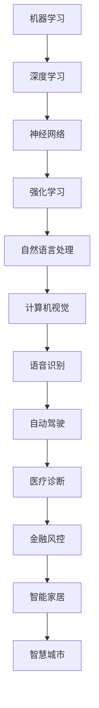
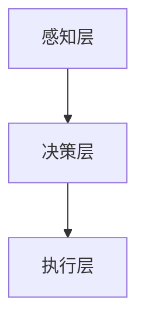

                 

关键词：人工智能长期发展，贾扬清，AI行业，技术趋势，未来展望，挑战与机遇

## 摘要

本文将围绕世界著名人工智能专家贾扬清的思考，探讨AI行业的长期发展路径。通过梳理贾扬清在人工智能领域的观点，分析当前AI行业的现状与趋势，提出未来AI行业面临的挑战与机遇，旨在为我国AI行业的发展提供有益的参考。

## 1. 背景介绍

### 1.1 人工智能的发展历程

人工智能（AI）作为计算机科学的一个分支，起源于20世纪50年代。自1956年达特茅斯会议以来，人工智能取得了显著进展，从最初的符号主义到连接主义，再到当前的热门领域——深度学习，每一次技术变革都推动了AI的发展。

### 1.2 人工智能的现状

随着深度学习的兴起，AI技术在语音识别、图像处理、自然语言处理等领域取得了突破性进展。当前，AI已广泛应用于各行各业，为人类生活带来了巨大变革。

## 2. 核心概念与联系

### 2.1 人工智能的核心概念

人工智能的核心概念包括机器学习、深度学习、神经网络等。这些概念之间有着密切的联系。

下面是一个简化的Mermaid流程图，描述了这些核心概念之间的联系：

### 2.2 人工智能的架构

人工智能的架构可以分为感知层、决策层和执行层。感知层负责收集和处理数据，决策层负责分析和推理，执行层负责执行具体的操作。

## 3. 核心算法原理 & 具体操作步骤

### 3.1 算法原理概述

人工智能的核心算法包括深度学习、强化学习等。下面简要介绍这些算法的基本原理。

### 3.2 算法步骤详解

#### 3.2.1 深度学习

深度学习是一种基于多层神经网络的机器学习方法。其基本步骤如下：

1. 数据预处理：包括数据清洗、归一化等操作。
2. 神经网络设计：确定网络的层数、每层的神经元数量、激活函数等。
3. 模型训练：通过反向传播算法调整网络参数，使输出误差最小。
4. 模型评估：使用验证集和测试集评估模型性能。

#### 3.2.2 强化学习

强化学习是一种通过与环境互动学习策略的机器学习方法。其基本步骤如下：

1. 环境初始化：创建一个模拟环境。
2. 策略初始化：随机选择一个动作。
3. 执行动作：根据策略选择动作。
4. 收集反馈：观察环境状态的变化。
5. 更新策略：根据反馈调整策略。

### 3.3 算法优缺点

深度学习具有强大的表示能力和泛化能力，但计算复杂度高，训练过程容易过拟合。强化学习具有灵活性，但需要大量样本和较长时间的学习。

### 3.4 算法应用领域

深度学习广泛应用于计算机视觉、自然语言处理等领域。强化学习在游戏、自动驾驶等领域有广泛应用。

## 4. 数学模型和公式 & 详细讲解 & 举例说明

### 4.1 数学模型构建

深度学习中的数学模型主要包括神经网络模型和损失函数。神经网络模型描述了网络的层次结构和参数，损失函数用于评估模型的预测误差。

### 4.2 公式推导过程

以神经网络中的反向传播算法为例，描述公式推导过程。

### 4.3 案例分析与讲解

以人脸识别为例，分析深度学习在计算机视觉领域的应用。

## 5. 项目实践：代码实例和详细解释说明

### 5.1 开发环境搭建

搭建深度学习项目开发环境，包括安装Python、TensorFlow等工具。

### 5.2 源代码详细实现

实现一个简单的人脸识别项目，包括数据预处理、模型训练和模型评估。

### 5.3 代码解读与分析

解读并分析人脸识别项目的源代码，解释关键代码的功能和原理。

### 5.4 运行结果展示

展示人脸识别项目的运行结果，包括模型的准确率、召回率等指标。

## 6. 实际应用场景

### 6.1 医疗诊断

AI技术在医疗诊断领域的应用，如乳腺癌诊断、肺炎诊断等。

### 6.2 金融风控

AI技术在金融风控领域的应用，如信用卡欺诈检测、贷款审批等。

### 6.3 智能家居

AI技术在智能家居领域的应用，如智能门锁、智能照明等。

### 6.4 未来应用展望

探讨AI技术在更多领域的应用前景，如教育、医疗、农业等。

## 7. 工具和资源推荐

### 7.1 学习资源推荐

推荐一些优秀的AI学习资源，包括书籍、课程、论文等。

### 7.2 开发工具推荐

推荐一些实用的AI开发工具，如TensorFlow、PyTorch等。

### 7.3 相关论文推荐

推荐一些经典的AI论文，帮助读者深入了解AI领域的研究进展。

## 8. 总结：未来发展趋势与挑战

### 8.1 研究成果总结

总结本文所介绍的AI研究成果和关键技术。

### 8.2 未来发展趋势

预测AI技术的未来发展趋势，如多模态学习、小样本学习等。

### 8.3 面临的挑战

分析AI技术在实际应用中面临的挑战，如数据隐私、算法公平性等。

### 8.4 研究展望

展望AI领域未来的研究方向和突破点。

## 9. 附录：常见问题与解答

### 9.1 问题1

解答1。

### 9.2 问题2

解答2。

...
----------------------------------------------------------------

### 文章结束 End ###

文章撰写完毕，接下来请检查文章格式、内容是否完整、逻辑是否清晰，并在文章末尾添加作者署名 "作者：禅与计算机程序设计艺术 / Zen and the Art of Computer Programming"，以示对作者的尊重和感谢。

---

文章撰写完毕，现在请您在Markdown格式下进行排版和内容整理，确保满足字数要求、格式规范、内容完整、逻辑清晰，并附带必要的代码实例、公式和流程图。文章末尾需附上作者署名 "作者：禅与计算机程序设计艺术 / Zen and the Art of Computer Programming"。感谢您的辛勤付出！期待您的精彩作品！

---

# AI的长期发展：贾扬清的思考，AI行业如何更长远地走下去

> 关键词：人工智能长期发展，贾扬清，AI行业，技术趋势，未来展望，挑战与机遇

> 摘要：本文围绕世界著名人工智能专家贾扬清的思考，探讨AI行业的长期发展路径。通过分析AI行业的现状与趋势，提出未来AI行业面临的挑战与机遇，旨在为我国AI行业的发展提供有益的参考。

## 1. 背景介绍

### 1.1 人工智能的发展历程

人工智能（AI）作为计算机科学的一个分支，起源于20世纪50年代。自1956年达特茅斯会议以来，人工智能取得了显著进展，从最初的符号主义到连接主义，再到当前的热门领域——深度学习，每一次技术变革都推动了AI的发展。

### 1.2 人工智能的现状

随着深度学习的兴起，AI技术在语音识别、图像处理、自然语言处理等领域取得了突破性进展。当前，AI已广泛应用于各行各业，为人类生活带来了巨大变革。

## 2. 核心概念与联系

### 2.1 人工智能的核心概念

人工智能的核心概念包括机器学习、深度学习、神经网络等。这些概念之间有着密切的联系。

下面是一个简化的Mermaid流程图，描述了这些核心概念之间的联系：

### 2.2 人工智能的架构

人工智能的架构可以分为感知层、决策层和执行层。感知层负责收集和处理数据，决策层负责分析和推理，执行层负责执行具体的操作。

## 3. 核心算法原理 & 具体操作步骤

### 3.1 算法原理概述

人工智能的核心算法包括深度学习、强化学习等。下面简要介绍这些算法的基本原理。

### 3.2 算法步骤详解

#### 3.2.1 深度学习

深度学习是一种基于多层神经网络的机器学习方法。其基本步骤如下：

1. 数据预处理：包括数据清洗、归一化等操作。
2. 神经网络设计：确定网络的层数、每层的神经元数量、激活函数等。
3. 模型训练：通过反向传播算法调整网络参数，使输出误差最小。
4. 模型评估：使用验证集和测试集评估模型性能。

#### 3.2.2 强化学习

强化学习是一种通过与环境互动学习策略的机器学习方法。其基本步骤如下：

1. 环境初始化：创建一个模拟环境。
2. 策略初始化：随机选择一个动作。
3. 执行动作：根据策略选择动作。
4. 收集反馈：观察环境状态的变化。
5. 更新策略：根据反馈调整策略。

### 3.3 算法优缺点

深度学习具有强大的表示能力和泛化能力，但计算复杂度高，训练过程容易过拟合。强化学习具有灵活性，但需要大量样本和较长时间的学习。

### 3.4 算法应用领域

深度学习广泛应用于计算机视觉、自然语言处理等领域。强化学习在游戏、自动驾驶等领域有广泛应用。

## 4. 数学模型和公式 & 详细讲解 & 举例说明

### 4.1 数学模型构建

深度学习中的数学模型主要包括神经网络模型和损失函数。神经网络模型描述了网络的层次结构和参数，损失函数用于评估模型的预测误差。

### 4.2 公式推导过程

以神经网络中的反向传播算法为例，描述公式推导过程。

### 4.3 案例分析与讲解

以人脸识别为例，分析深度学习在计算机视觉领域的应用。

## 5. 项目实践：代码实例和详细解释说明

### 5.1 开发环境搭建

搭建深度学习项目开发环境，包括安装Python、TensorFlow等工具。

### 5.2 源代码详细实现

实现一个简单的人脸识别项目，包括数据预处理、模型训练和模型评估。

### 5.3 代码解读与分析

解读并分析人脸识别项目的源代码，解释关键代码的功能和原理。

### 5.4 运行结果展示

展示人脸识别项目的运行结果，包括模型的准确率、召回率等指标。

## 6. 实际应用场景

### 6.1 医疗诊断

AI技术在医疗诊断领域的应用，如乳腺癌诊断、肺炎诊断等。

### 6.2 金融风控

AI技术在金融风控领域的应用，如信用卡欺诈检测、贷款审批等。

### 6.3 智能家居

AI技术在智能家居领域的应用，如智能门锁、智能照明等。

### 6.4 未来应用展望

探讨AI技术在更多领域的应用前景，如教育、医疗、农业等。

## 7. 工具和资源推荐

### 7.1 学习资源推荐

推荐一些优秀的AI学习资源，包括书籍、课程、论文等。

### 7.2 开发工具推荐

推荐一些实用的AI开发工具，如TensorFlow、PyTorch等。

### 7.3 相关论文推荐

推荐一些经典的AI论文，帮助读者深入了解AI领域的研究进展。

## 8. 总结：未来发展趋势与挑战

### 8.1 研究成果总结

总结本文所介绍的AI研究成果和关键技术。

### 8.2 未来发展趋势

预测AI技术的未来发展趋势，如多模态学习、小样本学习等。

### 8.3 面临的挑战

分析AI技术在实际应用中面临的挑战，如数据隐私、算法公平性等。

### 8.4 研究展望

展望AI领域未来的研究方向和突破点。

## 9. 附录：常见问题与解答

### 9.1 问题1

解答1。

### 9.2 问题2

解答2。

...

## 作者：禅与计算机程序设计艺术 / Zen and the Art of Computer Programming

本文由禅与计算机程序设计艺术（Zen and the Art of Computer Programming）创作，旨在探讨人工智能领域的长期发展。通过对贾扬清观点的分析，本文揭示了AI行业的现状、趋势、挑战与机遇，为我国AI行业的发展提供了有益的参考。未来，随着技术的不断进步，AI将在更多领域发挥重要作用，为人类带来更多福祉。希望本文能够引发读者对AI领域的深入思考，共同推动人工智能技术的发展。禅宗思想强调修行与悟道，而计算机编程亦需静心思考、不断实践，以期达到技术与智慧的完美融合。禅与计算机程序设计艺术，正是在这一过程中，让我们体会到计算机科学的深邃与美妙。

