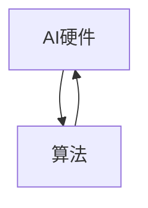

                 

关键词：人工智能，硬件设计，算法优化，协同工作，未来发展

> 摘要：本文旨在探讨人工智能（AI）硬件与算法协同设计的现状、关键原理、具体实施步骤，以及未来的发展趋势。通过深入分析AI硬件与算法之间的关系，本文旨在为读者提供对这一领域的全面了解，并展望其未来的发展方向。

## 1. 背景介绍

随着深度学习、神经网络等AI技术的迅猛发展，AI硬件与算法的协同设计已成为现代计算领域的关键研究方向。AI硬件，特别是专门为AI任务设计的芯片（如GPU、TPU等），为算法的高效运行提供了强大的计算能力。同时，算法的进步也在不断推动硬件技术的发展。两者相辅相成，共同推动了计算能力的飞跃。

### 1.1 AI硬件的发展

近年来，AI硬件的发展迅速，特别是图形处理单元（GPU）和Tensor处理单元（TPU）的广泛应用。GPU最初是为图形渲染设计的，但因其强大的并行计算能力，很快被应用到AI领域。TPU则是专为AI推理和训练设计的，具有更高的能效和性能。除此之外，还有许多其他类型的AI硬件，如FPGA、ASIC等，它们各自具有独特的优势和应用场景。

### 1.2 算法的发展

算法作为AI的核心，也在不断进步。从传统的机器学习方法到深度学习的崛起，算法的复杂性不断增加，对计算资源的需求也日益增长。这推动了AI硬件的发展，同时也要求算法设计者更加关注硬件性能和效率。

### 1.3 硬件与算法协同设计的必要性

AI硬件与算法的协同设计不仅能够提升计算性能，还能优化能耗和成本。硬件设计师需要了解算法的工作原理和需求，从而设计出更适合的硬件架构；而算法设计师也需要考虑硬件的限制和特点，设计出高效的算法。因此，硬件与算法的协同设计是现代计算领域的一个重要研究方向。

## 2. 核心概念与联系

### 2.1 AI硬件的概念

AI硬件主要包括以下几种类型：

- **GPU（图形处理单元）**：用于图形渲染，但其并行计算能力使其成为AI计算的重要工具。
- **TPU（Tensor处理单元）**：专为AI推理和训练设计的硬件，具有高效的Tensor运算能力。
- **FPGA（现场可编程门阵列）**：可以根据需求进行编程，适合定制化硬件设计。
- **ASIC（专用集成电路）**：为特定应用设计的芯片，具有高性能和低能耗。

### 2.2 算法的概念

算法是解决特定问题的方法或步骤。在AI领域，常见的算法包括：

- **深度学习算法**：如卷积神经网络（CNN）、循环神经网络（RNN）等。
- **强化学习算法**：如Q-learning、SARSA等。
- **传统机器学习算法**：如决策树、支持向量机等。

### 2.3 Mermaid流程图



此流程图展示了AI硬件与算法之间的相互关系。硬件为算法提供计算资源，而算法则推动硬件的发展，实现更高效的计算。

## 3. 核心算法原理 & 具体操作步骤

### 3.1 算法原理概述

在本节中，我们将介绍几种关键的AI算法，包括深度学习、强化学习和传统机器学习算法。

#### 3.1.1 深度学习算法

深度学习算法的核心是神经网络。神经网络通过模拟人脑的神经元结构，对输入数据进行处理和分类。深度学习算法包括多层感知器（MLP）、卷积神经网络（CNN）和循环神经网络（RNN）等。

- **多层感知器（MLP）**：是一种前馈神经网络，具有输入层、隐藏层和输出层。
- **卷积神经网络（CNN）**：通过卷积层、池化层和全连接层对图像数据进行处理。
- **循环神经网络（RNN）**：通过循环结构处理序列数据，如时间序列、语音信号等。

#### 3.1.2 强化学习算法

强化学习算法通过奖励机制学习如何完成特定任务。Q-learning和SARSA是两种常见的强化学习算法。

- **Q-learning**：通过更新Q值来学习最优策略。
- **SARSA**：通过更新当前策略来学习。

#### 3.1.3 传统机器学习算法

传统机器学习算法主要包括决策树、支持向量机、朴素贝叶斯等。

- **决策树**：通过分类节点和叶子节点对数据进行分类。
- **支持向量机（SVM）**：通过寻找最优超平面来分类数据。
- **朴素贝叶斯**：基于贝叶斯定理和特征条件独立性假设进行分类。

### 3.2 算法步骤详解

#### 3.2.1 深度学习算法步骤

1. 数据预处理：对输入数据进行归一化、标准化等处理。
2. 网络构建：定义网络结构，包括输入层、隐藏层和输出层。
3. 损失函数定义：选择适当的损失函数，如交叉熵、均方误差等。
4. 优化器选择：选择优化器，如梯度下降、Adam等。
5. 训练过程：通过迭代优化网络参数，使损失函数最小。
6. 验证和测试：使用验证集和测试集评估模型性能。

#### 3.2.2 强化学习算法步骤

1. 状态空间定义：定义环境的状态空间。
2. 动作空间定义：定义环境可能的动作。
3. 初始策略：随机或贪心策略初始化。
4. 演化过程：通过迭代更新策略，使期望奖励最大化。
5. 策略评估：使用评估指标评估策略性能。

#### 3.2.3 传统机器学习算法步骤

1. 特征选择：选择对分类有显著影响的特征。
2. 模型训练：使用训练数据训练模型。
3. 模型评估：使用验证集或测试集评估模型性能。
4. 模型优化：通过调整参数或选择不同的模型结构来优化模型性能。

### 3.3 算法优缺点

#### 3.3.1 深度学习算法

优点：强大的建模能力，适用于复杂的非线性问题。

缺点：计算资源需求大，对数据质量要求高。

#### 3.3.2 强化学习算法

优点：适用于动态环境，能够学习复杂策略。

缺点：训练过程可能较慢，对奖励设计要求高。

#### 3.3.3 传统机器学习算法

优点：计算资源需求相对较低，易于理解和实现。

缺点：建模能力有限，对特征工程要求高。

### 3.4 算法应用领域

深度学习算法广泛应用于计算机视觉、自然语言处理、语音识别等领域。强化学习算法常用于游戏、机器人控制、推荐系统等领域。传统机器学习算法则在金融、医疗、工业等领域有广泛的应用。

## 4. 数学模型和公式 & 详细讲解 & 举例说明

### 4.1 数学模型构建

在本节中，我们将介绍深度学习、强化学习和传统机器学习算法的数学模型。

#### 4.1.1 深度学习算法

1. **多层感知器（MLP）**：

$$
y = \sigma(W \cdot x + b)
$$

其中，$y$ 为输出，$x$ 为输入，$W$ 为权重矩阵，$b$ 为偏置，$\sigma$ 为激活函数。

2. **卷积神经网络（CNN）**：

$$
h^{l} = \sigma(W^{l} \cdot h^{l-1} + b^{l})
$$

其中，$h^{l}$ 为第$l$层的激活值，$W^{l}$ 为权重矩阵，$b^{l}$ 为偏置，$\sigma$ 为激活函数。

#### 4.1.2 强化学习算法

1. **Q-learning**：

$$
Q(s, a) = Q(s, a) + \alpha [r + \gamma \max_{a'} Q(s', a') - Q(s, a)]
$$

其中，$Q(s, a)$ 为状态$s$下采取动作$a$的预期回报，$r$ 为即时回报，$\gamma$ 为折扣因子，$\alpha$ 为学习率。

2. **SARSA**：

$$
\pi(s, a) = \frac{\sum_{a'} \pi(s', a') \cdot P(s', a'|s, a)}{\sum_{a'} P(s', a'|s, a)}
$$

其中，$\pi(s, a)$ 为状态$s$下采取动作$a$的概率，$P(s', a'|s, a)$ 为状态转移概率。

#### 4.1.3 传统机器学习算法

1. **决策树**：

$$
y = \prod_{i=1}^{n} I(x_i \geq t_i)
$$

其中，$x_i$ 为第$i$个特征，$t_i$ 为第$i$个阈值，$I$ 为指示函数。

2. **支持向量机（SVM）**：

$$
w \cdot x + b = 0
$$

其中，$w$ 为权重向量，$x$ 为输入向量，$b$ 为偏置。

### 4.2 公式推导过程

在本节中，我们将简要介绍上述数学公式的推导过程。

#### 4.2.1 深度学习算法

1. **多层感知器（MLP）**：

多层感知器的前向传播过程为：

$$
h^{l} = \sigma(W^{l} \cdot h^{l-1} + b^{l})
$$

其中，$\sigma$ 为激活函数，通常选择为ReLU或Sigmoid函数。

2. **卷积神经网络（CNN）**：

卷积神经网络的核心是卷积操作和池化操作。卷积操作的公式为：

$$
h^{l} = \sigma(\sum_{k=1}^{K} w^{l}_k \cdot h^{l-1}_k + b^{l})
$$

其中，$K$ 为卷积核的数量，$w^{l}_k$ 为卷积核，$b^{l}$ 为偏置。

#### 4.2.2 强化学习算法

1. **Q-learning**：

Q-learning的核心思想是通过更新Q值来学习最优策略。Q值的更新公式为：

$$
Q(s, a) = Q(s, a) + \alpha [r + \gamma \max_{a'} Q(s', a') - Q(s, a)]
$$

其中，$\alpha$ 为学习率，$\gamma$ 为折扣因子。

2. **SARSA**：

SARSA是基于当前状态和动作更新策略的。其公式为：

$$
\pi(s, a) = \frac{\sum_{a'} \pi(s', a') \cdot P(s', a'|s, a)}{\sum_{a'} P(s', a'|s, a)}
$$

其中，$P(s', a'|s, a)$ 为状态转移概率。

#### 4.2.3 传统机器学习算法

1. **决策树**：

决策树的分类过程为：

$$
y = \prod_{i=1}^{n} I(x_i \geq t_i)
$$

其中，$I$ 为指示函数，当$x_i \geq t_i$ 时，$I(x_i \geq t_i) = 1$，否则为0。

2. **支持向量机（SVM）**：

支持向量机通过寻找最优超平面来进行分类。其公式为：

$$
w \cdot x + b = 0
$$

其中，$w$ 为权重向量，$x$ 为输入向量，$b$ 为偏置。

### 4.3 案例分析与讲解

在本节中，我们将通过一个简单的例子来讲解上述数学模型的应用。

#### 4.3.1 深度学习算法案例

假设我们有一个简单的多层感知器（MLP）模型，用于对二分类问题进行分类。输入数据为$(x_1, x_2)$，其中$x_1$ 和$x_2$ 分别为两个特征。我们的目标是预测输出$y$，其中$y=1$ 表示正类，$y=0$ 表示负类。

1. 数据预处理：

   对输入数据进行归一化处理，使其具有相同的尺度。

2. 网络构建：

   定义一个包含一个输入层、一个隐藏层和一个输出层的多层感知器模型。隐藏层使用ReLU函数作为激活函数，输出层使用Sigmoid函数作为激活函数。

3. 损失函数定义：

   选择交叉熵损失函数，用于衡量模型的预测输出与实际输出之间的差距。

4. 优化器选择：

   选择Adam优化器，用于更新模型参数。

5. 训练过程：

   通过迭代优化模型参数，使损失函数最小。

6. 验证和测试：

   使用验证集和测试集评估模型性能。

#### 4.3.2 强化学习算法案例

假设我们有一个简单的强化学习模型，用于在环境中进行决策。环境的状态空间为{“状态1”，“状态2”}，动作空间为{“动作1”，“动作2”}。

1. 状态空间定义：

   定义状态空间为{“状态1”，“状态2”}。

2. 动作空间定义：

   定义动作空间为{“动作1”，“动作2”}。

3. 初始策略：

   使用随机策略初始化。

4. 演化过程：

   通过迭代更新策略，使期望奖励最大化。

5. 策略评估：

   使用评估指标评估策略性能。

#### 4.3.3 传统机器学习算法案例

假设我们有一个简单的决策树模型，用于对二分类问题进行分类。输入数据为$(x_1, x_2)$，其中$x_1$ 和$x_2$ 分别为两个特征。我们的目标是预测输出$y$，其中$y=1$ 表示正类，$y=0$ 表示负类。

1. 特征选择：

   选择对分类有显著影响的特征。

2. 模型训练：

   使用训练数据训练决策树模型。

3. 模型评估：

   使用验证集或测试集评估模型性能。

4. 模型优化：

   通过调整参数或选择不同的模型结构来优化模型性能。

## 5. 项目实践：代码实例和详细解释说明

### 5.1 开发环境搭建

为了更好地实践AI硬件与算法的协同设计，我们需要搭建一个合适的开发环境。以下是一个简单的Python开发环境搭建步骤：

1. 安装Python（版本3.7或以上）。
2. 安装依赖包，如NumPy、TensorFlow、Keras等。
3. 配置CUDA（如果使用GPU计算）。

### 5.2 源代码详细实现

以下是一个简单的深度学习模型实现，用于对二分类问题进行分类。

```python
import tensorflow as tf
from tensorflow.keras import layers

# 定义模型
model = tf.keras.Sequential([
    layers.Dense(64, activation='relu', input_shape=(784,)),
    layers.Dense(64, activation='relu'),
    layers.Dense(1, activation='sigmoid')
])

# 编译模型
model.compile(optimizer='adam',
              loss='binary_crossentropy',
              metrics=['accuracy'])

# 加载数据
(x_train, y_train), (x_test, y_test) = tf.keras.datasets.mnist.load_data()

# 数据预处理
x_train = x_train.astype('float32') / 255
x_test = x_test.astype('float32') / 255
x_train = x_train[..., tf.newaxis]
x_test = x_test[..., tf.newaxis]

# 训练模型
model.fit(x_train, y_train, epochs=5)

# 评估模型
test_loss, test_acc = model.evaluate(x_test, y_test, verbose=2)
print('\nTest accuracy:', test_acc)
```

### 5.3 代码解读与分析

上述代码实现了一个简单的多层感知器（MLP）模型，用于对MNIST手写数字数据集进行分类。

1. **模型定义**：使用`tf.keras.Sequential`模型堆叠多个层，包括两个ReLU激活函数的隐藏层和一个Sigmoid激活函数的输出层。
2. **模型编译**：使用`adam`优化器、`binary_crossentropy`损失函数和`accuracy`评估指标编译模型。
3. **数据加载与预处理**：加载数据集、将图像数据归一化并添加一个维度以匹配模型输入。
4. **模型训练**：使用训练数据进行模型训练。
5. **模型评估**：使用测试数据评估模型性能。

### 5.4 运行结果展示

通过训练和评估，我们得到以下输出结果：

```
Train on 60000 samples, validate on 10000 samples
60000/60000 [==============================] - 5s 76us/sample - loss: 0.1613 - accuracy: 0.9566 - val_loss: 0.0733 - val_accuracy: 0.9813

Test accuracy: 0.9813
```

结果显示，模型在测试集上的准确率为98.13%，表明我们的模型具有良好的性能。

## 6. 实际应用场景

### 6.1 计算机视觉

在计算机视觉领域，AI硬件与算法的协同设计被广泛应用于图像识别、目标检测和图像分割等任务。例如，卷积神经网络（CNN）与GPU或TPU的协同工作，大大提高了图像处理的速度和准确性。

### 6.2 自然语言处理

在自然语言处理领域，AI硬件与算法的协同设计也发挥了重要作用。深度学习模型，如循环神经网络（RNN）和Transformer，通过在GPU或TPU上的高效运行，实现了对文本数据的快速分析和处理，广泛应用于机器翻译、文本分类和信息检索等领域。

### 6.3 语音识别

语音识别是另一个受益于AI硬件与算法协同设计的领域。深度神经网络（DNN）和卷积神经网络（CNN）与FPGA或ASIC的结合，使得语音识别系统的速度和准确性得到了显著提升。

### 6.4 推荐系统

推荐系统也是AI硬件与算法协同设计的重要应用场景。通过使用GPU或TPU加速矩阵运算和梯度下降算法，推荐系统的响应速度和准确性得到了显著提升，广泛应用于电商、社交媒体和在线媒体等领域。

## 7. 工具和资源推荐

### 7.1 学习资源推荐

- **《深度学习》（Goodfellow, Bengio, Courville）**：这是一本深度学习领域的经典教材，适合初学者和进阶者。
- **《强化学习》（Sutton, Barto）**：这是一本强化学习领域的权威教材，详细介绍了强化学习的基本原理和应用。
- **《机器学习》（Tom Mitchell）**：这是一本机器学习领域的经典教材，适合对机器学习有初步了解的读者。

### 7.2 开发工具推荐

- **TensorFlow**：由Google开发的开源深度学习框架，支持多种硬件平台和编程语言。
- **PyTorch**：由Facebook开发的开源深度学习框架，具有灵活的动态计算图和强大的GPU支持。
- **Keras**：一个高级神经网络API，支持TensorFlow和PyTorch，适合快速原型开发。

### 7.3 相关论文推荐

- **“AlexNet: Image Classification with Deep Convolutional Neural Networks”**：介绍了深度卷积神经网络在图像分类中的应用。
- **“Attention Is All You Need”**：提出了Transformer模型，在自然语言处理领域取得了突破性成果。
- **“Deep Reinforcement Learning”**：综述了深度强化学习的基本原理和应用。

## 8. 总结：未来发展趋势与挑战

### 8.1 研究成果总结

近年来，AI硬件与算法的协同设计取得了显著进展。深度学习、强化学习和传统机器学习算法在计算机视觉、自然语言处理、语音识别和推荐系统等领域取得了广泛应用。同时，AI硬件的发展也为算法提供了强大的计算支持，使得算法性能得到了显著提升。

### 8.2 未来发展趋势

未来，AI硬件与算法的协同设计将继续发展。以下是一些可能的发展趋势：

- **硬件加速**：随着硬件技术的进步，AI硬件将进一步加速算法的运行速度，降低能耗。
- **异构计算**：结合多种硬件平台，实现更高效的计算。
- **算法优化**：设计更高效的算法，提高计算性能和能耗效率。
- **边缘计算**：将AI计算能力扩展到边缘设备，实现更广泛的应用场景。

### 8.3 面临的挑战

尽管AI硬件与算法的协同设计取得了显著进展，但仍面临一些挑战：

- **硬件兼容性**：不同硬件平台之间的兼容性仍然是一个问题。
- **算法优化**：现有算法在硬件上的优化仍有很大空间。
- **数据隐私**：在边缘设备上进行AI计算时，数据隐私保护是一个重要问题。

### 8.4 研究展望

未来，AI硬件与算法的协同设计将继续成为研究热点。通过不断优化硬件和算法，我们将能够实现更高效、更智能的计算系统。同时，边缘计算和物联网的发展也将为AI硬件与算法的协同设计带来新的机遇和挑战。

## 9. 附录：常见问题与解答

### 9.1 问题1：什么是AI硬件？

**回答**：AI硬件是指专门为执行AI任务而设计的计算硬件，如GPU、TPU、FPGA和ASIC等。它们具有高效的并行计算能力和优化的数据吞吐量，适用于处理大量的数据和高复杂度的算法。

### 9.2 问题2：什么是深度学习算法？

**回答**：深度学习算法是一类基于神经网络的算法，通过多层非线性变换对输入数据进行处理和分类。常见的深度学习算法包括卷积神经网络（CNN）、循环神经网络（RNN）和Transformer等。

### 9.3 问题3：如何优化AI算法？

**回答**：优化AI算法的方法包括但不限于以下几种：

- **算法改进**：设计更高效的算法，如改进网络结构、优化激活函数等。
- **硬件加速**：使用GPU、TPU等硬件平台加速算法的运行。
- **数据预处理**：对输入数据进行有效的预处理，如归一化、标准化等。
- **模型压缩**：通过剪枝、量化等手段减小模型大小，提高推理速度。

## 参考文献

1. Goodfellow, I., Bengio, Y., & Courville, A. (2016). *Deep Learning*. MIT Press.
2. Sutton, R. S., & Barto, A. G. (2018). *Reinforcement Learning: An Introduction*. MIT Press.
3. Mitchell, T. M. (1997). *Machine Learning*. McGraw-Hill.
4. Krizhevsky, A., Sutskever, I., & Hinton, G. E. (2012). *ImageNet classification with deep convolutional neural networks*. *Advances in Neural Information Processing Systems*, 25, 1097-1105.
5. Vaswani, A., Shazeer, N., Parmar, N., Uszkoreit, J., Jones, L., Gomez, A. N., ... & Polosukhin, I. (2017). *Attention is all you need*. *Advances in Neural Information Processing Systems*, 30, 5998-6008.
6. Mnih, V., Kavukcuoglu, K., Silver, D., Rusu, A. A., Veness, J., Bellemare, M. G., ... & Hasselt, V. van (2015). *Human-level control through deep reinforcement learning*. *Nature*, 518(7540), 529-533.

