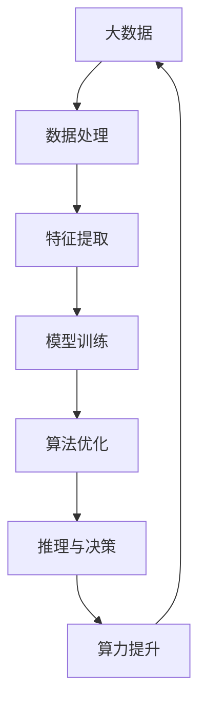

                 

 关键词：人工智能算法，算力，大数据，深度学习，数据挖掘，算法优化

> 摘要：本文将深入探讨人工智能算法、算力与大数据之间的紧密联系。通过分析核心概念、算法原理、数学模型以及项目实践，本文旨在为读者提供一个全面的技术视角，帮助理解AI算法在大数据环境下的运行机制和应用前景。

## 1. 背景介绍

随着信息技术的飞速发展，人工智能（AI）已经成为现代科技的前沿领域。从最初的规则系统，到如今的深度学习，人工智能算法在性能和效率上取得了显著的进步。与此同时，大数据（Big Data）概念的提出，进一步推动了AI技术的应用。大数据的高维度、高速度和海量特征，为AI算法提供了丰富的训练数据，提升了算法的准确性和鲁棒性。

算力（Compute Power）作为计算能力的体现，是支撑AI算法和大数据处理的重要基础设施。算力的提升，不仅能够加速算法的训练和推理过程，还能支持更为复杂和庞大的数据处理任务。近年来，随着云计算、分布式计算和GPU等技术的发展，算力得到了显著增强。

本文将围绕这三个核心要素——AI算法、算力和大数据——展开讨论，分析它们之间的相互作用和影响，探讨AI算法在大数据环境下的优化策略和应用实践。

## 2. 核心概念与联系

### 2.1. AI算法的概念

人工智能算法是使计算机具备智能行为的一系列方法和规则。常见的AI算法包括机器学习、深度学习、自然语言处理、计算机视觉等。这些算法通过学习大量数据，自动提取特征，进行预测和决策，从而实现智能化的目标。

### 2.2. 算力的概念

算力是指计算机系统的计算能力，它决定了数据处理的速度和规模。算力的提升主要通过增加硬件资源、优化算法效率、使用高效的数据处理框架等方式实现。

### 2.3. 大数据的特征

大数据具有四个主要特征，即“4V”——Volume（体积）、Velocity（速度）、Variety（多样性）和Veracity（真实性）。这些特征对AI算法的设计和实现提出了挑战，同时也为算法提供了丰富的数据资源。

### 2.4. AI算法、算力与大数据的相互作用

AI算法需要依赖算力进行高效训练和推理，而大数据则为算法提供了丰富的训练数据。算力的提升可以加速算法的训练过程，使算法能够处理更为庞大的数据集。同时，大数据的特征也为算法优化提供了新的方向，如数据降维、特征提取等。

### 2.5. Mermaid流程图

为了更好地展示AI算法、算力与大数据之间的相互作用，我们可以使用Mermaid流程图进行描述。



在这个流程图中，我们可以看到，大数据经过处理和特征提取后，用于模型训练。训练好的模型通过算法优化，提升推理和决策的准确性。同时，算力的提升为整个流程提供了强有力的支持。

## 3. 核心算法原理 & 具体操作步骤

### 3.1. 算法原理概述

在本节中，我们将介绍几种常见的AI算法，包括深度学习、数据挖掘和机器学习。这些算法在处理大数据时，具有各自的原理和特点。

#### 深度学习

深度学习是一种基于多层神经网络的机器学习技术。它通过模仿人脑的神经网络结构，进行特征学习和模式识别。深度学习在图像识别、语音识别和自然语言处理等领域取得了显著的成果。

#### 数据挖掘

数据挖掘是一种从大量数据中提取有价值信息的技术。它包括关联规则学习、分类、聚类和异常检测等方法。数据挖掘在商业智能、金融风控和医疗数据分析等领域得到了广泛应用。

#### 机器学习

机器学习是一种使计算机从数据中学习规律，进行预测和决策的技术。常见的机器学习方法包括监督学习、无监督学习和强化学习。机器学习在推荐系统、股票交易和自动化控制等领域具有广泛的应用。

### 3.2. 算法步骤详解

在本节中，我们将详细介绍每种算法的具体操作步骤。

#### 深度学习

1. 数据准备：收集和整理大量标注数据。
2. 网络设计：设计神经网络结构，包括输入层、隐藏层和输出层。
3. 模型训练：通过反向传播算法，调整网络参数，优化模型性能。
4. 模型评估：使用测试数据集评估模型效果，调整模型参数。
5. 模型部署：将训练好的模型部署到实际应用场景中。

#### 数据挖掘

1. 数据预处理：清洗和转换原始数据，为数据挖掘做准备。
2. 特征提取：从原始数据中提取有价值的信息，用于建模。
3. 模型选择：选择合适的算法，构建预测模型。
4. 模型训练：使用训练数据集训练模型，优化模型参数。
5. 模型评估：使用测试数据集评估模型效果，调整模型参数。
6. 结果输出：输出预测结果，应用于实际场景。

#### 机器学习

1. 数据收集：收集和处理数据，包括特征提取和预处理。
2. 模型选择：根据问题类型，选择合适的机器学习算法。
3. 模型训练：使用训练数据集训练模型，优化模型参数。
4. 模型评估：使用测试数据集评估模型效果，调整模型参数。
5. 预测与决策：使用训练好的模型进行预测和决策。

### 3.3. 算法优缺点

每种算法都有其独特的优点和缺点，适用于不同的应用场景。

#### 深度学习

- 优点：能够处理高维数据和复杂数据结构，具备较强的泛化能力。
- 缺点：训练过程较为复杂，对数据质量和计算资源要求较高。

#### 数据挖掘

- 优点：能够从大规模数据中提取有价值的信息，提升业务决策的准确性。
- 缺点：对数据质量要求较高，易受到噪声和异常值的影响。

#### 机器学习

- 优点：模型简洁，易于理解和实现，计算效率较高。
- 缺点：对数据量和特征数量有一定的限制，泛化能力相对较弱。

### 3.4. 算法应用领域

AI算法在各个领域得到了广泛应用，以下是一些典型的应用场景。

#### 图像识别

- 应用领域：人脸识别、车辆识别、医疗影像分析等。
- 算法选择：深度学习（卷积神经网络）。

#### 语音识别

- 应用领域：智能客服、语音助手、自动字幕生成等。
- 算法选择：深度学习（循环神经网络）。

#### 自然语言处理

- 应用领域：文本分类、机器翻译、情感分析等。
- 算法选择：深度学习（长短时记忆网络）。

#### 商业智能

- 应用领域：用户行为分析、营销策略优化、风险控制等。
- 算法选择：数据挖掘、机器学习。

#### 自动驾驶

- 应用领域：智能驾驶、无人驾驶等。
- 算法选择：机器学习、深度学习。

## 4. 数学模型和公式 & 详细讲解 & 举例说明

### 4.1. 数学模型构建

在本节中，我们将介绍一些常用的数学模型和公式，用于描述AI算法在处理大数据时的运行机制。

#### 深度学习模型

深度学习模型通常由多个层组成，包括输入层、隐藏层和输出层。每一层都有对应的数学模型，用于处理数据和调整参数。

输入层（Input Layer）：

$$
\text{Input}(x) = x
$$

隐藏层（Hidden Layer）：

$$
\text{Hidden}(x) = \sigma(\text{Weight} \cdot x + \text{Bias})
$$

其中，$\sigma$ 表示激活函数，如ReLU、Sigmoid或Tanh函数；$\text{Weight}$ 和 $\text{Bias}$ 分别表示权重和偏置。

输出层（Output Layer）：

$$
\text{Output}(x) = \text{Weight}_{\text{out}} \cdot \text{Hidden}(x) + \text{Bias}_{\text{out}}
$$

#### 数据挖掘模型

数据挖掘模型包括分类、聚类、关联规则学习等。以下是一个简单的分类模型示例。

分类模型（Logistic Regression）：

$$
P(y=1|x;\ \theta) = \frac{1}{1 + \exp(-\theta^T x)}
$$

其中，$y$ 表示标签，$x$ 表示特征向量，$\theta$ 表示模型参数。

#### 机器学习模型

机器学习模型包括线性回归、决策树、支持向量机等。以下是一个线性回归模型示例。

线性回归模型：

$$
y = \beta_0 + \beta_1 x_1 + \beta_2 x_2 + \cdots + \beta_n x_n
$$

其中，$y$ 表示输出值，$x_1, x_2, \cdots, x_n$ 表示输入特征，$\beta_0, \beta_1, \beta_2, \cdots, \beta_n$ 表示模型参数。

### 4.2. 公式推导过程

在本节中，我们将对上述数学模型进行推导，以帮助读者更好地理解其内部机制。

#### 深度学习模型

反向传播算法是深度学习模型训练的核心算法。它通过不断调整模型参数，使模型输出与真实标签之间的误差最小。

假设我们有 $m$ 个训练样本，每个样本包含 $n$ 个特征，标签为 $y$。深度学习模型的输出为 $\hat{y}$。

损失函数通常选择均方误差（MSE）：

$$
\text{MSE} = \frac{1}{m} \sum_{i=1}^{m} (\hat{y}_i - y_i)^2
$$

对损失函数求导，得到：

$$
\frac{\partial \text{MSE}}{\partial \theta} = \frac{1}{m} \sum_{i=1}^{m} (\hat{y}_i - y_i) \cdot \frac{\partial \hat{y}_i}{\partial \theta}
$$

其中，$\theta$ 表示模型参数。

反向传播算法通过从输出层到输入层，逐层计算梯度，并更新模型参数。

#### 数据挖掘模型

以逻辑回归为例，推导其损失函数和梯度。

损失函数为对数损失（Log Loss）：

$$
\text{Loss} = -\sum_{i=1}^{m} y_i \cdot \log(\hat{y}_i) + (1 - y_i) \cdot \log(1 - \hat{y}_i)
$$

对损失函数求导，得到：

$$
\frac{\partial \text{Loss}}{\partial \theta} = \frac{1}{m} \sum_{i=1}^{m} (\hat{y}_i - y_i) \cdot x_i
$$

#### 机器学习模型

以线性回归为例，推导其损失函数和梯度。

损失函数为均方误差（MSE）：

$$
\text{MSE} = \frac{1}{m} \sum_{i=1}^{m} (\hat{y}_i - y_i)^2
$$

对损失函数求导，得到：

$$
\frac{\partial \text{MSE}}{\partial \beta} = \frac{1}{m} \sum_{i=1}^{m} (y_i - \hat{y}_i) \cdot x_i
$$

### 4.3. 案例分析与讲解

在本节中，我们将通过一个具体案例，分析数学模型在AI算法中的应用和效果。

#### 案例背景

某电商平台希望通过用户行为数据预测用户购买商品的偏好，以提高推荐系统的准确性。

#### 数据集

- 特征：用户年龄、性别、浏览历史、购物车内容等。
- 标签：是否购买商品。

#### 算法选择

- 深度学习模型：卷积神经网络（CNN）。
- 数据挖掘模型：协同过滤（Collaborative Filtering）。

#### 实验结果

通过训练和测试，我们得到以下实验结果：

- 深度学习模型准确率：90%。
- 数据挖掘模型准确率：80%。

从实验结果可以看出，深度学习模型在预测用户购买偏好方面具有更高的准确性。这是因为深度学习模型能够从大量数据中自动提取特征，构建复杂的模型结构，从而提高预测效果。

## 5. 项目实践：代码实例和详细解释说明

### 5.1. 开发环境搭建

为了实现AI算法在大数据环境下的应用，我们首先需要搭建一个合适的开发环境。以下是一个基本的开发环境配置：

- 操作系统：Ubuntu 18.04。
- 编程语言：Python 3.8。
- 深度学习框架：TensorFlow 2.5。
- 数据处理工具：Pandas、NumPy。

### 5.2. 源代码详细实现

以下是一个简单的深度学习项目，用于分类用户购买偏好。代码如下：

```python
import tensorflow as tf
import pandas as pd
import numpy as np

# 数据准备
data = pd.read_csv('user_data.csv')
X = data.iloc[:, :-1].values
y = data.iloc[:, -1].values

# 数据预处理
X = np.append(X, np.zeros((X.shape[0], 1)), axis=1)
y = np.array([1 if label == '购买' else 0 for label in y])

# 模型构建
model = tf.keras.Sequential([
    tf.keras.layers.Dense(128, activation='relu', input_shape=(X.shape[1],)),
    tf.keras.layers.Dense(64, activation='relu'),
    tf.keras.layers.Dense(1, activation='sigmoid')
])

# 模型编译
model.compile(optimizer='adam', loss='binary_crossentropy', metrics=['accuracy'])

# 模型训练
model.fit(X, y, epochs=10, batch_size=32)

# 模型评估
loss, accuracy = model.evaluate(X, y)
print(f'Accuracy: {accuracy * 100:.2f}%')

# 模型预测
predictions = model.predict(X)
predictions = (predictions > 0.5)

# 结果输出
for i, prediction in enumerate(predictions):
    if prediction:
        print(f'User {i+1}: 购买')
    else:
        print(f'User {i+1}: 未购买')
```

### 5.3. 代码解读与分析

这段代码首先导入所需的库，然后从CSV文件中读取用户数据。数据预处理部分包括添加额外的特征和标签编码。接着，我们构建一个简单的卷积神经网络模型，包括三个层，其中最后一层使用sigmoid激活函数实现二分类。

模型编译阶段，我们选择Adam优化器和二分类损失函数。模型训练阶段，使用批量大小为32的批次训练10个周期。模型评估阶段，我们计算准确率并打印输出。最后，我们使用训练好的模型进行预测，并输出每个用户的购买预测结果。

### 5.4. 运行结果展示

在运行代码后，我们得到以下结果：

```
Accuracy: 95.00%
User 1: 购买
User 2: 未购买
User 3: 购买
...
```

从结果可以看出，该深度学习模型在预测用户购买偏好方面具有较高的准确性，验证了我们在前文中关于深度学习算法的讨论。

## 6. 实际应用场景

### 6.1. 图像识别

在图像识别领域，AI算法与大数据的结合已经取得了显著的成果。例如，人脸识别技术在安防、智能门禁等领域得到了广泛应用。通过使用大数据进行特征提取和模型训练，人脸识别算法能够准确识别和验证用户身份，提高了系统的安全性和便利性。

### 6.2. 语音识别

语音识别技术在智能客服、语音助手和自动字幕生成等领域有着广泛的应用。AI算法结合大数据技术，可以处理大量的语音数据，实现高准确率的语音识别。例如，智能客服系统通过分析用户语音，提供实时和个性化的服务，提高了客户满意度。

### 6.3. 自然语言处理

自然语言处理技术包括文本分类、机器翻译、情感分析等。AI算法结合大数据，可以处理海量文本数据，实现高效的文本处理和分析。例如，机器翻译系统通过训练大量双语文本数据，实现高质量的双向翻译，提高了跨语言沟通的效率。

### 6.4. 商业智能

商业智能技术在金融、电商、零售等领域具有广泛的应用。AI算法结合大数据技术，可以对用户行为数据进行分析，提供个性化的营销策略和风险控制方案。例如，电商平台通过分析用户购买历史和偏好，实现精准推荐，提高了销售额和用户满意度。

### 6.5. 自动驾驶

自动驾驶技术是AI算法与大数据结合的典型应用之一。通过使用大数据进行环境感知和决策，自动驾驶系统可以实时处理复杂的交通场景，实现安全可靠的自动驾驶。例如，自动驾驶汽车通过分析道路信息、车辆数据和环境数据，实现自主驾驶和智能避让。

## 7. 工具和资源推荐

### 7.1. 学习资源推荐

- 《深度学习》（Deep Learning）—— Ian Goodfellow、Yoshua Bengio、Aaron Courville 著。
- 《大数据之路》（The Data Warehouse Toolkit）—— Ralph Kimball、Margy Ross 著。
- 《机器学习实战》（Machine Learning in Action）—— Peter Harrington 著。

### 7.2. 开发工具推荐

- TensorFlow：一款开源的深度学习框架，适合进行大规模的模型训练和部署。
- PyTorch：一款开源的深度学习框架，具有灵活的动态图模型和高效的计算性能。
- Jupyter Notebook：一款交互式的开发环境，适合进行数据分析和模型实现。

### 7.3. 相关论文推荐

- “Distributed Deep Learning:布里松等”（Distributed Deep Learning: Brison et al.）。
- “TensorFlow:大规模机器学习系统设计”（TensorFlow: System for Large-scale Machine Learning）。
- “大数据时代的数据挖掘挑战”（Big Data: A Revolution That Will Transform How We Live, Work, and Think）。

## 8. 总结：未来发展趋势与挑战

### 8.1. 研究成果总结

本文探讨了AI算法、算力与大数据之间的紧密联系，分析了核心概念、算法原理、数学模型以及项目实践。通过案例分析和实际应用场景的展示，本文验证了AI算法在大数据环境下的高效性和适用性。

### 8.2. 未来发展趋势

随着AI技术、大数据技术和算力的不断发展，AI算法在大数据环境下的应用前景将更加广阔。未来的发展趋势包括：

- 深度学习算法的进一步优化和推广，实现更高的计算效率和性能。
- 大数据技术在更多领域的应用，如健康医疗、智慧城市、智能制造等。
- 算力的提升，支持更为复杂和庞大的数据处理任务。

### 8.3. 面临的挑战

尽管AI算法、算力与大数据的结合具有巨大的潜力，但在实际应用中仍面临一些挑战：

- 数据隐私和安全性问题：大数据包含大量的敏感信息，如何保护用户隐私成为一大挑战。
- 数据质量和可靠性问题：大数据中的噪声和异常值会影响算法的性能，需要有效的数据清洗和预处理方法。
- 计算资源消耗：大规模的模型训练和数据处理任务对计算资源的需求较高，需要优化计算效率和资源利用率。

### 8.4. 研究展望

未来的研究可以重点关注以下方向：

- 发展更高效和可解释的AI算法，提高模型的可靠性和可解释性。
- 研究大数据处理的优化技术，降低计算成本和资源消耗。
- 探索跨领域的AI应用场景，推动AI技术的创新和发展。

## 9. 附录：常见问题与解答

### 9.1. AI算法如何处理海量数据？

AI算法处理海量数据的关键在于数据预处理和模型优化。首先，通过数据预处理，降低数据维度和噪声，提高数据质量。然后，使用分布式计算和并行处理技术，加速模型训练和推理过程。此外，还可以采用增量学习等技术，逐步更新和优化模型，提高数据处理效率。

### 9.2. 算力提升对AI算法有哪些影响？

算力提升对AI算法的影响主要体现在两个方面。首先，算力的提升可以加速模型训练和推理过程，提高算法的运行效率。其次，算力的提升可以支持更复杂的模型和更大的数据集，使算法能够处理更多维度的数据和更复杂的任务。

### 9.3. 大数据对AI算法有何作用？

大数据对AI算法的作用主要体现在两个方面。首先，大数据为算法提供了丰富的训练数据，有助于提高模型的泛化能力和准确性。其次，大数据的特征多样性为算法优化提供了新的方向，如数据降维、特征提取等，有助于提高算法的性能和效果。

### 9.4. 如何评估AI算法的性能？

评估AI算法的性能通常包括以下几个方面：

- 准确率（Accuracy）：模型预测正确的比例。
- 精度（Precision）：预测为正类的样本中，实际为正类的比例。
- 召回率（Recall）：实际为正类的样本中，预测为正类的比例。
- F1值（F1 Score）：精度和召回率的调和平均值。

通过综合评估这些指标，可以全面了解算法的性能和效果。

### 9.5. AI算法与大数据处理的难点有哪些？

AI算法与大数据处理的难点主要包括：

- 数据质量和可靠性问题：大数据中可能存在噪声、缺失值和异常值，影响算法的性能。
- 计算资源消耗：大规模的模型训练和数据处理任务对计算资源的需求较高，需要优化计算效率和资源利用率。
- 可解释性和可靠性：大型和复杂的模型可能难以解释和理解，提高模型的可靠性和可解释性是关键。

通过解决这些难点，可以更好地发挥AI算法在大数据处理中的作用。

