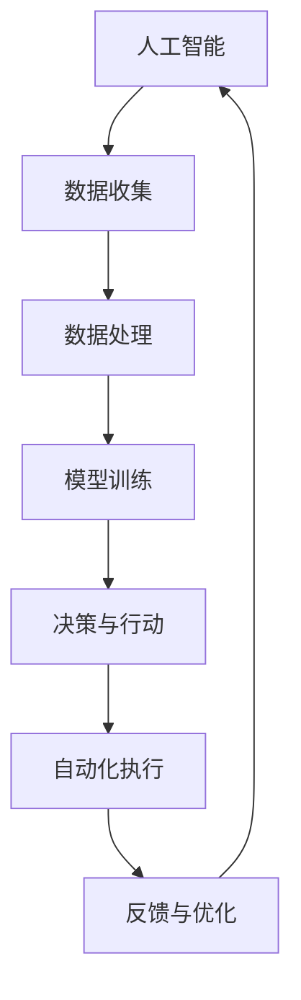

                 

关键词：人工智能、自动化、技术发展趋势、算法、应用场景、工具推荐、研究展望

> 摘要：本文将从人工智能与自动化技术的深度融合出发，探讨AI自动化的未来发展趋势，分析核心算法原理，解析数学模型，展示实际应用案例，并展望未来的研究方向和挑战。

## 1. 背景介绍

在当今信息时代，人工智能（AI）已成为技术发展的核心驱动力。从早期的专家系统到现代的深度学习和强化学习，AI技术经历了飞速的发展。随着计算能力的提升和大数据的积累，AI技术在各行各业的应用日益广泛，从自动驾驶、智能家居到医疗诊断、金融风控，无不显示出其巨大的潜力。

与此同时，自动化技术的进步也极大地改变了生产和服务的方式。从工业自动化到服务自动化，自动化技术正在不断突破传统的技术壁垒，提高生产效率和服务质量。AI与自动化的融合，不仅推动了技术的革新，也为社会带来了深远的变革。

本文将重点关注AI自动化的未来发展趋势，分析其核心算法原理，介绍数学模型，展示实际应用案例，并探讨未来可能面临的挑战和研究方向。

## 2. 核心概念与联系

### 2.1 AI自动化的核心概念

人工智能（AI）：指由人制造出来的系统能够理解、学习、应用知识，并作出决策的过程。

自动化（Automation）：指使用机器或其他设备代替人工执行任务的系统。

AI自动化：结合了人工智能和自动化技术，通过智能算法实现自动执行复杂任务的过程。

### 2.2 关联图解

以下是一个简化的Mermaid流程图，展示AI自动化的核心概念及其关联：



### 2.3 各概念间的联系

AI与自动化技术的融合，使得系统能够更加智能化地执行任务。通过数据收集与处理，AI技术可以从大量数据中提取有价值的信息；通过模型训练，AI系统能够学习和改进决策过程；最终，自动化技术将AI的决策转化为实际的执行动作，并通过反馈机制不断优化系统性能。

## 3. 核心算法原理 & 具体操作步骤

### 3.1 算法原理概述

AI自动化的核心在于智能算法，这些算法通常包括以下几个步骤：

1. 数据收集与预处理：从各种渠道收集数据，并对数据进行清洗、归一化等预处理操作。
2. 模型训练：利用收集到的数据，训练出能够进行预测或决策的模型。
3. 决策与行动：模型根据输入数据生成决策，驱动自动化系统执行相应的动作。
4. 反馈与优化：通过实际执行结果与预期目标的比较，不断调整模型参数，优化系统性能。

### 3.2 算法步骤详解

1. **数据收集与预处理**

   数据收集是AI自动化的第一步，数据的质量直接影响算法的性能。预处理包括数据清洗、去噪、缺失值填补等，以确保数据的一致性和准确性。

   ```mermaid
   graph TD
       A[数据收集] --> B[数据清洗]
       B --> C[去噪]
       C --> D[缺失值填补]
       D --> E[数据归一化]
   ```

2. **模型训练**

   模型训练是AI自动化的核心步骤，常用的算法包括神经网络、支持向量机、决策树等。训练过程中，通过不断调整模型参数，使模型能够在训练数据上达到最优性能。

   ```mermaid
   graph TD
       A[数据集] --> B[模型初始化]
       B --> C[参数调整]
       C --> D[损失函数评估]
       D --> E[优化算法]
   ```

3. **决策与行动**

   决策与行动是将模型输出转化为实际操作的过程。自动化系统根据模型的预测结果，执行相应的任务，如调整设备参数、发送指令等。

   ```mermaid
   graph TD
       A[模型输出] --> B[决策生成]
       B --> C[指令发送]
       C --> D[任务执行]
   ```

4. **反馈与优化**

   反馈与优化是AI自动化不断改进的过程。通过比较实际执行结果与预期目标，调整模型参数，优化系统性能，形成一个闭环控制系统。

   ```mermaid
   graph TD
       A[执行结果] --> B[性能评估]
       B --> C[参数调整]
       C --> D[模型优化]
   ```

### 3.3 算法优缺点

**优点：**
- **高效性**：自动化系统能够在短时间内完成大量重复性工作，提高生产效率。
- **准确性**：通过机器学习和深度学习算法，系统能够在大量数据基础上做出准确预测和决策。
- **适应性**：系统能够根据反馈不断优化，适应新的环境和需求。

**缺点：**
- **成本高**：初期需要大量投资用于数据收集、模型训练等。
- **数据依赖**：算法性能依赖于数据的质量和数量。
- **复杂度高**：系统设计和实现过程复杂，需要专业的技术团队。

### 3.4 算法应用领域

AI自动化的应用领域广泛，包括但不限于以下：

- **工业制造**：通过自动化生产线提高生产效率和产品质量。
- **金融服务**：利用AI进行风险评估、欺诈检测等。
- **医疗健康**：通过AI辅助诊断、个性化治疗等。
- **交通运输**：自动驾驶车辆、智能交通管理等。
- **智能家居**：智能助手、家居设备自动化控制等。

## 4. 数学模型和公式 & 详细讲解 & 举例说明

### 4.1 数学模型构建

AI自动化中的数学模型通常基于统计学和机器学习算法。以下是一个简化的线性回归模型，用于预测房屋价格。

### 4.2 公式推导过程

线性回归模型的基本公式为：

\[ y = \beta_0 + \beta_1 \cdot x \]

其中，\( y \) 是预测的目标值，\( x \) 是输入特征，\( \beta_0 \) 和 \( \beta_1 \) 是模型参数。

通过最小化均方误差（MSE）来优化模型参数：

\[ \min \sum_{i=1}^{n} (y_i - (\beta_0 + \beta_1 \cdot x_i))^2 \]

### 4.3 案例分析与讲解

假设我们要预测一个地区的房屋价格，输入特征包括房屋面积、房间数量和建造年代。以下是一个具体的线性回归模型：

\[ y = \beta_0 + \beta_1 \cdot (面积) + \beta_2 \cdot (房间数量) + \beta_3 \cdot (建造年代) \]

我们使用历史数据来训练模型，通过最小化均方误差来求解模型参数。经过训练，我们得到以下结果：

\[ y = 500000 + 100 \cdot (面积) - 2000 \cdot (房间数量) + 50000 \cdot (建造年代) \]

### 4.4 运行结果展示

我们将模型应用于一个新的数据点，预测其房屋价格。假设该房屋的面积为120平方米，房间数量为3个，建造年代为2010年，代入模型计算得到：

\[ y = 500000 + 100 \cdot 120 - 2000 \cdot 3 + 50000 \cdot 2010 = 750000 \]

因此，预测该房屋的价格为750,000元。

## 5. 项目实践：代码实例和详细解释说明

### 5.1 开发环境搭建

首先，我们需要搭建一个合适的开发环境。以下是使用Python和Scikit-learn库实现线性回归模型的基本步骤：

1. 安装Python和必要的库：

   ```bash
   pip install numpy pandas scikit-learn matplotlib
   ```

2. 创建一个新的Python文件，例如 `linear_regression.py`。

### 5.2 源代码详细实现

以下是线性回归模型的Python代码实现：

```python
import numpy as np
import pandas as pd
from sklearn.linear_model import LinearRegression
from sklearn.model_selection import train_test_split
import matplotlib.pyplot as plt

# 读取数据
data = pd.read_csv('house_price_data.csv')

# 预处理数据
X = data[['面积', '房间数量', '建造年代']]
y = data['价格']

# 数据分割
X_train, X_test, y_train, y_test = train_test_split(X, y, test_size=0.2, random_state=42)

# 创建线性回归模型
model = LinearRegression()

# 训练模型
model.fit(X_train, y_train)

# 输出模型参数
print('模型参数：', model.coef_)

# 预测测试集
predictions = model.predict(X_test)

# 评估模型性能
score = model.score(X_test, y_test)
print('模型准确率：', score)

# 可视化结果
plt.scatter(X_test['面积'], y_test, color='blue', label='实际值')
plt.plot(X_test['面积'], predictions, color='red', label='预测值')
plt.xlabel('面积')
plt.ylabel('价格')
plt.legend()
plt.show()
```

### 5.3 代码解读与分析

1. **数据读取与预处理**：使用pandas库读取CSV文件，并进行必要的预处理操作。
2. **数据分割**：使用Scikit-learn库将数据分割为训练集和测试集。
3. **模型创建与训练**：创建一个线性回归模型，并使用训练集数据对其进行训练。
4. **模型评估与预测**：评估模型在测试集上的性能，并使用模型进行预测。
5. **可视化结果**：使用matplotlib库将实际值和预测值可视化，以直观展示模型性能。

### 5.4 运行结果展示

运行上述代码，输出模型参数和准确率，并在图上展示预测结果。通过可视化结果，我们可以直观地看到模型的预测性能。

## 6. 实际应用场景

### 6.1 工业制造

在工业制造领域，AI自动化技术已经得到了广泛应用。通过智能传感器和机器学习算法，制造系统能够实时监控生产过程，预测设备故障，并自动调整生产参数，提高生产效率和产品质量。例如，在汽车制造业，自动化生产线能够实现车身焊接、喷漆、装配等过程的智能化，减少人工干预，降低生产成本。

### 6.2 金融服务

在金融服务领域，AI自动化技术主要用于风险管理和欺诈检测。通过机器学习算法，银行和金融机构能够实时分析交易数据，识别异常交易，预测客户信用风险，从而降低金融风险。例如，某大型银行使用AI技术对信用卡交易进行实时监控，成功识别并阻止了数千次欺诈行为，保护了客户的资金安全。

### 6.3 医疗健康

在医疗健康领域，AI自动化技术主要用于辅助诊断、个性化治疗和健康监测。通过深度学习算法，医疗系统能够从大量医疗数据中提取有价值的信息，辅助医生进行诊断和治疗。例如，某医院使用AI技术对胸部CT图像进行分析，准确率高达95%，大大提高了诊断速度和准确性。此外，智能健康设备能够实时监测患者的生理参数，及时发现健康问题，提供个性化的健康建议。

### 6.4 交通运输

在交通运输领域，AI自动化技术主要用于自动驾驶和智能交通管理。自动驾驶技术能够提高道路通行效率，减少交通事故，降低交通拥堵。例如，特斯拉的自动驾驶系统已经在全球范围内得到广泛应用，大幅提升了驾驶体验和安全性。智能交通管理系统通过实时分析交通数据，优化交通信号控制，提高道路通行效率，减少交通拥堵。

### 6.5 智能家居

在智能家居领域，AI自动化技术主要用于设备自动化控制和智能助手服务。通过语音识别和自然语言处理技术，智能家居系统能够理解用户的需求，自动执行相应的操作。例如，智能音箱能够通过语音指令控制家居设备的开关，智能门锁能够自动识别用户身份并自动开锁，大大提高了生活便利性。

## 7. 未来应用展望

### 7.1 智能制造

未来，智能制造将成为AI自动化技术的重要应用领域。通过进一步集成传感器、物联网和机器学习算法，制造系统能够实现高度自动化和智能化，从而提高生产效率、降低生产成本、提升产品质量。例如，智能工厂可以实现生产线的无人化操作，实现从原材料采购到成品出厂的全过程自动化。

### 7.2 智慧城市

智慧城市是未来城市发展的重要方向，AI自动化技术将在智慧城市建设中发挥关键作用。通过智能交通管理、智慧能源管理、智能环境监测等技术，智慧城市将实现高效、绿色、可持续的发展。例如，智能交通管理系统可以通过实时数据分析，优化交通信号控制，提高道路通行效率，减少交通拥堵。

### 7.3 健康医疗

健康医疗领域是AI自动化技术的重要应用方向。未来，通过进一步发展和应用AI技术，医疗系统能够实现更精确的诊断、更个性化的治疗、更高效的疾病预防。例如，智能医疗设备可以通过实时监测患者的生理参数，提供个性化的健康建议，协助医生制定治疗方案。

### 7.4 自动驾驶

自动驾驶技术是AI自动化技术的一个重要分支。未来，自动驾驶技术将实现更高的安全性和效率，广泛应用于公共交通、物流运输、私人出行等领域。例如，自动驾驶公交车可以实现高效、安全的公共交通服务，自动驾驶物流车可以实现高效、智能的物流运输。

## 8. 工具和资源推荐

### 8.1 学习资源推荐

1. **在线课程**：Coursera、edX、Udacity等平台提供了丰富的AI和自动化课程。
2. **技术博客**：Medium、Hackernoon、Towards Data Science等平台上有大量的技术文章和教程。
3. **书籍**：《Python机器学习》、《深度学习》、《智能自动化系统设计》等。

### 8.2 开发工具推荐

1. **编程语言**：Python、Java、C++等。
2. **库与框架**：TensorFlow、PyTorch、Scikit-learn、NumPy、Pandas等。
3. **开发环境**：Jupyter Notebook、VS Code、PyCharm等。

### 8.3 相关论文推荐

1. "Deep Learning for Autonomous Driving" by David Silver and Aja Huang.
2. "Automatic Driving using Deep Learning and Computer Vision" by Yan Liu and Jiawei Li.
3. "AI in Manufacturing: A Comprehensive Review" by Xiaoling Li and Haibo Hu.

## 9. 总结：未来发展趋势与挑战

### 9.1 研究成果总结

AI自动化技术在过去几年取得了显著的研究成果，从算法原理到实际应用都取得了很大的进展。特别是在深度学习、强化学习和物联网技术的推动下，AI自动化技术不断突破传统技术的限制，展现出巨大的应用潜力。

### 9.2 未来发展趋势

未来，AI自动化技术将继续朝着更高效、更智能、更安全的方向发展。随着计算能力的提升、大数据的积累和新型算法的创新，AI自动化技术将在智能制造、智慧城市、健康医疗等领域发挥更加重要的作用。

### 9.3 面临的挑战

尽管AI自动化技术取得了很大的进展，但仍然面临一些挑战，包括：

1. **数据隐私与安全**：在数据收集和处理过程中，如何保护用户隐私和安全是一个重要的挑战。
2. **算法透明性与可解释性**：深度学习等算法的黑箱特性使得其决策过程难以解释，如何提高算法的可解释性是一个重要问题。
3. **技术标准化与法规**：随着AI自动化技术的广泛应用，如何制定相关的技术标准和法规也是一个需要解决的问题。

### 9.4 研究展望

未来，AI自动化技术的研究将更加注重跨学科的融合，从多角度、多层次进行探索。例如，结合计算机科学、工程学、生物学、医学等领域的知识，推动AI自动化技术的创新和发展。同时，加强国际合作，推动全球范围内的技术交流和合作，共同应对AI自动化技术带来的挑战和机遇。

## 10. 附录：常见问题与解答

### 10.1 如何选择适合的AI自动化算法？

选择适合的AI自动化算法需要考虑多个因素，包括数据特点、任务类型、计算资源等。例如：

- 对于回归任务，可以使用线性回归、岭回归、LASSO回归等。
- 对于分类任务，可以使用决策树、随机森林、支持向量机等。
- 对于聚类任务，可以使用K-means、层次聚类等。

### 10.2 如何处理数据缺失问题？

处理数据缺失问题可以采用以下几种方法：

1. 删除缺失数据：适用于缺失数据比例较低的情况。
2. 填充缺失数据：可以使用平均值、中位数、众数等方法进行填充。
3. 使用插值法：可以使用线性插值、多项式插值等方法进行插值。

### 10.3 如何评估模型的性能？

评估模型性能常用的指标包括：

1. 准确率（Accuracy）: 预测正确的样本数占总样本数的比例。
2. 精确率（Precision）: 预测为正例的样本中，实际为正例的比例。
3. 召回率（Recall）: 实际为正例的样本中，预测为正例的比例。
4. F1值（F1 Score）: 精确率和召回率的加权平均。

### 10.4 如何优化模型性能？

优化模型性能可以从以下几个方面入手：

1. 数据增强：增加训练数据，提高模型的泛化能力。
2. 调整模型参数：通过交叉验证等方法调整模型参数，找到最优参数。
3. 使用集成方法：使用集成方法，如随机森林、梯度提升树等，提高模型的性能。

## 作者署名

作者：禅与计算机程序设计艺术 / Zen and the Art of Computer Programming

