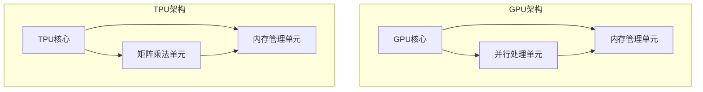

                 

关键词：人工智能，芯片，GPU，TPU，算法优化，深度学习，高性能计算，计算架构，技术创新

> 摘要：本文将深入探讨人工智能领域中的芯片革命，特别是GPU和TPU这两大核心技术的发展历程。我们将分析它们的架构特点、工作原理以及在实际应用中的表现，从而展望未来芯片技术的创新趋势和挑战。

## 1. 背景介绍

### 1.1 人工智能的崛起

人工智能作为计算机科学的一个分支，近年来得到了飞速的发展。特别是深度学习技术的突破，使得人工智能在图像识别、语音识别、自然语言处理等多个领域取得了显著成果。这些成就的背后，离不开高性能计算芯片的支持。传统的CPU虽然在通用计算能力上表现优秀，但在处理大规模并行计算任务时存在性能瓶颈。因此，GPU和TPU等专用芯片应运而生，它们专为人工智能计算而设计，提供了更高的计算效率和性能。

### 1.2 GPU的崛起

GPU（Graphics Processing Unit，图形处理单元）最初是为了满足图形渲染和图像处理的需求而设计的。由于其并行架构和强大的计算能力，GPU很快被引入到科学计算、工程模拟和数据分析等领域。随着深度学习的兴起，GPU在人工智能领域的应用也越来越广泛。特别是NVIDIA推出的CUDA平台，使得开发者能够方便地利用GPU进行深度学习模型的训练和推理。

### 1.3 TPU的崛起

TPU（Tensor Processing Unit，张量处理单元）是谷歌专门为机器学习和深度学习任务设计的专用芯片。TPU在硬件架构上与GPU有所不同，它优化了深度学习算法的关键操作，如矩阵乘法和激活函数，从而大幅提高了计算效率。TPU的出现，标志着专用芯片在人工智能领域的重要突破，也引发了业界对专用芯片的研究热潮。

## 2. 核心概念与联系

### 2.1 GPU与TPU的架构对比

GPU和TPU虽然在用途上都是为了加速人工智能计算，但它们的架构设计有所不同。下面是一个简单的Mermaid流程图，用于描述这两者的架构特点。



### 2.2 GPU与TPU的工作原理

GPU的工作原理主要依赖于其并行处理能力和大量的CUDA核心。当一个深度学习模型被部署到GPU上时，模型中的神经元和权重被映射到GPU的多个核心上，同时进行并行计算。内存管理单元负责在GPU核心和内存之间传输数据，确保数据的快速读取和写入。

TPU的工作原理与GPU有所不同。TPU专门优化了深度学习算法中的关键操作，如矩阵乘法和激活函数。TPU的核心设计注重并行性和低延迟，使得它们能够高效地执行大规模的矩阵运算。内存管理单元则负责管理TPU与外部内存之间的数据传输。

## 3. 核心算法原理 & 具体操作步骤

### 3.1 算法原理概述

GPU和TPU在深度学习中的应用主要依赖于矩阵乘法和激活函数。矩阵乘法是深度学习模型中最基本的操作之一，它涉及两个矩阵的乘积。激活函数则用于引入非线性特性，使得深度学习模型能够更好地拟合复杂的数据分布。

### 3.2 算法步骤详解

#### 3.2.1 GPU的矩阵乘法步骤

1. **数据加载**：将训练数据加载到GPU内存中。
2. **模型部署**：将深度学习模型部署到GPU上，包括权重和神经元。
3. **并行计算**：将模型中的矩阵乘法操作映射到GPU的核心上，同时进行计算。
4. **数据传输**：将计算结果从GPU内存传输回主机内存。
5. **模型更新**：使用计算结果更新模型权重。

#### 3.2.2 TPU的矩阵乘法步骤

1. **数据加载**：将训练数据加载到TPU内存中。
2. **模型部署**：将深度学习模型部署到TPU上，包括权重和神经元。
3. **并行计算**：TPU的核心会自动优化矩阵乘法操作，以实现高效计算。
4. **数据传输**：将计算结果从TPU内存传输回主机内存。
5. **模型更新**：使用计算结果更新模型权重。

### 3.3 算法优缺点

#### 3.3.1 GPU的优缺点

**优点**：
- **并行处理能力**：GPU拥有大量的CUDA核心，能够同时处理多个任务。
- **通用性**：GPU不仅适用于深度学习，还适用于图形渲染、科学计算等领域。

**缺点**：
- **功耗较高**：GPU在运行时会产生较高的热量，需要配备良好的散热系统。
- **编程复杂度**：GPU编程相对复杂，需要开发者具备一定的CUDA编程技能。

#### 3.3.2 TPU的优缺点

**优点**：
- **低延迟**：TPU优化了深度学习算法的关键操作，能够实现低延迟的高效计算。
- **高性能**：TPU专门为深度学习设计，提供了更高的计算性能。

**缺点**：
- **专用性**：TPU主要适用于深度学习任务，其他领域的应用受到限制。
- **成本较高**：TPU芯片的成本较高，对于个人开发者来说可能难以承受。

### 3.4 算法应用领域

GPU和TPU在人工智能领域的应用非常广泛，包括但不限于以下几个方面：

- **图像识别**：GPU和TPU可以用于大规模图像识别任务，如人脸识别、物体检测等。
- **语音识别**：语音识别模型可以使用GPU和TPU进行训练和推理，提高识别准确率。
- **自然语言处理**：自然语言处理任务可以使用GPU和TPU进行文本分类、情感分析等。

## 4. 数学模型和公式 & 详细讲解 & 举例说明

### 4.1 数学模型构建

深度学习中的数学模型主要涉及神经网络、矩阵乘法和激活函数。以下是一个简单的神经网络模型：

$$
Y = \sigma(WX + b)
$$

其中，$X$ 是输入数据，$W$ 是权重矩阵，$b$ 是偏置向量，$\sigma$ 是激活函数。

### 4.2 公式推导过程

假设我们有一个简单的线性模型：

$$
Y = WX + b
$$

其中，$Y$ 是输出，$X$ 是输入，$W$ 是权重矩阵，$b$ 是偏置向量。

我们可以将这个模型视为一个线性变换，其输出可以通过矩阵乘法和加法运算得到。为了引入非线性特性，我们通常会在输出层使用激活函数，如 sigmoid、ReLU 等。

### 4.3 案例分析与讲解

假设我们有一个简单的二分类问题，输入数据为 $X = [x_1, x_2, ..., x_n]$，输出为 $Y = [y_1, y_2]$。我们可以使用神经网络模型进行分类：

$$
y_1 = \sigma(W_1X_1 + b_1)
$$
$$
y_2 = \sigma(W_2X_2 + b_2)
$$

其中，$W_1$ 和 $W_2$ 是权重矩阵，$b_1$ 和 $b_2$ 是偏置向量。

我们可以通过训练数据来优化模型参数，使得分类准确率最高。具体来说，可以使用梯度下降算法来更新权重和偏置向量：

$$
W_1 := W_1 - \alpha \frac{\partial}{\partial W_1} \mathcal{L}(Y, Y')
$$
$$
b_1 := b_1 - \alpha \frac{\partial}{\partial b_1} \mathcal{L}(Y, Y')
$$
$$
W_2 := W_2 - \alpha \frac{\partial}{\partial W_2} \mathcal{L}(Y, Y')
$$
$$
b_2 := b_2 - \alpha \frac{\partial}{\partial b_2} \mathcal{L}(Y, Y')
$$

其中，$\mathcal{L}(Y, Y')$ 是损失函数，$\alpha$ 是学习率。

## 5. 项目实践：代码实例和详细解释说明

### 5.1 开发环境搭建

在本文的代码实例中，我们将使用Python编程语言和TensorFlow框架来搭建深度学习模型。首先，确保你的开发环境中已经安装了Python和TensorFlow。

```bash
pip install tensorflow
```

### 5.2 源代码详细实现

下面是一个简单的神经网络模型，用于实现二分类问题：

```python
import tensorflow as tf

# 定义模型参数
W1 = tf.Variable(tf.random.normal([n_features, n_hidden]))
b1 = tf.Variable(tf.zeros([n_hidden]))
W2 = tf.Variable(tf.random.normal([n_hidden, n_classes]))
b2 = tf.Variable(tf.zeros([n_classes]))

# 定义激活函数
sigma = tf.nn.relu

# 定义前向传播过程
def forward_propagation(X):
    hidden = sigma(tf.matmul(X, W1) + b1)
    output = sigma(tf.matmul(hidden, W2) + b2)
    return output

# 定义损失函数和优化器
loss_function = tf.reduce_mean(tf.nn.softmax_cross_entropy_with_logits(logits=forward_propagation(X), labels=Y))
optimizer = tf.optimizers.SGD(learning_rate=0.001)

# 训练模型
for epoch in range(num_epochs):
    with tf.GradientTape() as tape:
        loss = loss_function(Y, forward_propagation(X))
    grads = tape.gradient(loss, [W1, b1, W2, b2])
    optimizer.apply_gradients(zip(grads, [W1, b1, W2, b2]))

# 模型评估
predicted = forward_propagation(X)
correct_prediction = tf.equal(tf.argmax(predicted, 1), tf.argmax(Y, 1))
accuracy = tf.reduce_mean(tf.cast(correct_prediction, tf.float32))
print("Test accuracy:", accuracy.numpy())

```

### 5.3 代码解读与分析

这段代码实现了基于TensorFlow的简单神经网络模型，用于二分类问题。首先，我们定义了模型参数，包括权重矩阵和偏置向量。然后，我们定义了激活函数和前向传播过程。在前向传播过程中，输入数据经过线性变换和激活函数后得到输出结果。

接下来，我们定义了损失函数和优化器。在本例中，我们使用了softmax交叉熵损失函数和随机梯度下降优化器。在训练过程中，我们使用梯度下降算法来更新模型参数，直到损失函数收敛。

最后，我们使用训练好的模型对测试数据进行评估，并打印出测试准确率。

## 6. 实际应用场景

### 6.1 图像识别

GPU和TPU在图像识别任务中具有广泛的应用。例如，在人脸识别中，GPU可以用于大规模人脸检测和特征提取，而TPU则可以用于快速训练深度学习模型，提高识别准确率。

### 6.2 语音识别

语音识别是另一个GPU和TPU的重要应用领域。GPU可以用于实时语音信号处理，而TPU则可以用于大规模语音数据训练，提高语音识别的准确率和响应速度。

### 6.3 自然语言处理

自然语言处理任务，如文本分类和情感分析，也受益于GPU和TPU的并行计算能力。GPU可以用于大规模文本数据预处理，而TPU则可以用于快速训练深度学习模型，提高文本分类的准确率。

## 7. 工具和资源推荐

### 7.1 学习资源推荐

- 《深度学习》（Ian Goodfellow、Yoshua Bengio、Aaron Courville 著）：这是一本经典的深度学习入门教材，涵盖了深度学习的基础理论和应用案例。
- 《动手学深度学习》（阿斯顿·张、李沐、扎卡里·C. Lipton 著）：这是一本深入浅出的深度学习实战教程，适合初学者和实践者。

### 7.2 开发工具推荐

- TensorFlow：一个开源的深度学习框架，提供了丰富的API和工具，方便开发者搭建和训练深度学习模型。
- PyTorch：一个开源的深度学习框架，与TensorFlow类似，具有灵活的动态计算图和强大的GPU支持。

### 7.3 相关论文推荐

- "Tensor Processing Units: Data-Parallel Multilevel Neural Networks"（Google Research，2016）：介绍了TPU的架构和工作原理。
- "GPU Accelerated Training of Large-Scale Neural Networks"（NVIDIA Research，2011）：介绍了GPU在深度学习训练中的应用。

## 8. 总结：未来发展趋势与挑战

### 8.1 研究成果总结

GPU和TPU的出现，标志着人工智能芯片技术的重大突破。它们在深度学习领域的应用，使得人工智能的计算效率得到了显著提升。同时，随着专用芯片技术的发展，越来越多的领域开始受益于高性能计算芯片。

### 8.2 未来发展趋势

未来，人工智能芯片技术将继续发展，出现更多针对特定任务优化的专用芯片。同时，随着量子计算的兴起，量子芯片可能成为下一代人工智能计算的核心。

### 8.3 面临的挑战

尽管人工智能芯片技术取得了显著进展，但仍然面临一些挑战。首先，专用芯片的设计和制造成本较高，对于个人开发者来说可能难以承受。其次，如何确保专用芯片的安全性和可靠性，也是一个重要的问题。

### 8.4 研究展望

未来，人工智能芯片技术将继续向高性能、低功耗、高可靠性的方向发展。同时，随着人工智能应用的不断拓展，专用芯片将可能在更多领域发挥重要作用。

## 9. 附录：常见问题与解答

### 9.1 什么是GPU？

GPU（Graphics Processing Unit，图形处理单元）最初是为了满足图形渲染和图像处理的需求而设计的。它具有强大的并行计算能力，能够同时处理多个任务。

### 9.2 什么是TPU？

TPU（Tensor Processing Unit，张量处理单元）是谷歌专门为机器学习和深度学习任务设计的专用芯片。它优化了深度学习算法的关键操作，如矩阵乘法和激活函数，从而提高了计算效率。

### 9.3 GPU和TPU的区别是什么？

GPU和TPU都是用于加速人工智能计算的专用芯片，但它们的架构设计有所不同。GPU具有更高的通用性和并行处理能力，但功耗较高。TPU则专门优化了深度学习算法，提供了更高的计算性能，但成本较高。

### 9.4 什么样的任务适合使用GPU，什么样的任务适合使用TPU？

GPU适合通用计算任务，如图像渲染、科学计算和数据分析。TPU则适合深度学习任务，特别是那些需要大规模矩阵运算的任务。

---

作者：禅与计算机程序设计艺术 / Zen and the Art of Computer Programming
----------------------------------------------------------------

以上就是关于“AI芯片革命：从GPU到TPU的演进”的完整文章。本文详细介绍了GPU和TPU在人工智能领域的应用，从架构设计、工作原理到实际应用场景，全面阐述了这两大核心技术的发展历程和未来趋势。希望这篇文章能为读者提供有价值的参考。

