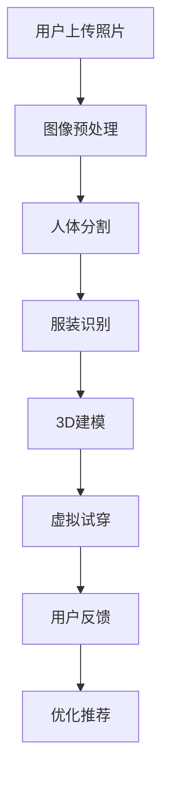

                 

在数字时代，个性化消费和实时互动成为了电子商务领域的关键趋势。虚拟试衣功能便是这一趋势的典型代表，它通过人工智能技术，让用户能够在线上轻松体验试穿效果，提升购物体验。本文将深入探讨AI虚拟试衣功能的实现案例，从核心概念、算法原理到实际应用，力求为读者呈现一个全面的技术解读。

> **关键词**：AI虚拟试衣、计算机视觉、深度学习、3D建模、个性化推荐、电子商务

> **摘要**：本文旨在分析AI虚拟试衣功能的实现机制，包括核心技术、数学模型和实际案例。我们将探讨如何运用计算机视觉、深度学习和3D建模等技术，实现高效、准确的虚拟试衣效果，并探讨其在电子商务领域的广泛应用前景。

## 1. 背景介绍

随着电子商务的迅猛发展，消费者对购物体验的要求越来越高。传统试衣间在购物过程中带来的不便和局限性，使得线上购物体验常常大打折扣。虚拟试衣功能的引入，为消费者提供了一个无需实际试穿，即可在线体验服装效果的解决方案。这一功能不仅能够减少购物时间，提高购物效率，还能增强消费者的购物体验，降低退货率。

虚拟试衣技术的核心在于利用人工智能技术，实现计算机对用户穿着效果的精准模拟。这一技术的实现涉及到多个领域的交叉应用，包括计算机视觉、深度学习、3D建模等。随着这些技术的不断成熟，虚拟试衣功能逐渐成为电子商务平台的标准配置，吸引了越来越多的用户。

## 2. 核心概念与联系

### 2.1 计算机视觉

计算机视觉是虚拟试衣功能实现的基础。它通过图像识别、目标检测等技术，对用户的穿着进行实时监测和分析。具体来说，计算机视觉技术能够识别用户的身体轮廓、服装形状和颜色，从而进行精确的虚拟试穿。

### 2.2 深度学习

深度学习是计算机视觉技术的延伸，通过神经网络模型，对大量数据进行训练和识别。在虚拟试衣中，深度学习技术被用于识别用户穿着的服装类型、颜色和样式，从而提高试衣的准确性。

### 2.3 3D建模

3D建模是虚拟试衣的核心技术之一。通过3D建模，可以将用户和服装转化为三维模型，进行精确的模拟和试穿。3D建模技术不仅能够提高试衣的准确性，还能够为用户提供更加真实的试穿体验。

### 2.4 个性化推荐

个性化推荐是虚拟试衣功能的扩展。通过分析用户的购物历史、偏好和穿着风格，个性化推荐系统可以为用户提供更加符合个人需求的服装推荐，从而提高购物的满意度和转化率。

### 2.5 Mermaid 流程图

以下是一个简化的Mermaid流程图，展示了虚拟试衣功能的核心流程：



## 3. 核心算法原理 & 具体操作步骤

### 3.1 算法原理概述

虚拟试衣功能的核心算法主要包括图像预处理、人体分割、服装识别、3D建模和虚拟试穿等步骤。每个步骤都有其特定的算法原理和应用场景。

### 3.2 算法步骤详解

#### 3.2.1 图像预处理

图像预处理是虚拟试衣的第一步，主要目的是对上传的图像进行格式转换、降噪、增强等处理，以提高图像的质量和识别效果。常用的预处理方法包括图像灰度化、高斯模糊、边缘检测等。

#### 3.2.2 人体分割

人体分割是虚拟试衣的关键步骤，通过计算机视觉技术，将用户身体和服装分离出来。常用的方法包括基于深度学习的语义分割和实例分割。例如，可以采用U-Net模型或Mask R-CNN模型进行人体分割。

#### 3.2.3 服装识别

服装识别是通过深度学习技术，对分割后的服装图像进行分类和识别，以确定服装的类型、颜色和样式。常用的方法包括卷积神经网络（CNN）和循环神经网络（RNN）。

#### 3.2.4 3D建模

3D建模是将识别出的服装转化为三维模型，以便进行虚拟试穿。常用的方法包括基于深度学习的3D建模和基于几何建模的方法。例如，可以采用PointNet模型进行3D建模。

#### 3.2.5 虚拟试穿

虚拟试穿是将3D模型应用到用户身体上，生成虚拟试穿效果。常用的方法包括光照模型、纹理映射和几何变换等。通过这些方法，可以生成逼真的虚拟试穿效果，提高用户的购物体验。

### 3.3 算法优缺点

虚拟试衣算法的优点在于其高效性和准确性，能够快速、准确地完成试衣任务。同时，它还具有良好的扩展性，可以根据不同的应用场景进行调整和优化。然而，虚拟试衣算法也存在一些缺点，例如对图像质量要求较高，容易出现识别错误等。

### 3.4 算法应用领域

虚拟试衣算法广泛应用于电子商务、时尚设计、虚拟现实等领域。在电子商务中，虚拟试衣功能可以提高购物转化率和用户满意度；在时尚设计中，虚拟试衣可以用于设计灵感的产生和产品展示；在虚拟现实中，虚拟试衣可以为用户提供更加真实的试穿体验。

## 4. 数学模型和公式

### 4.1 数学模型构建

虚拟试衣的数学模型主要包括图像预处理模型、人体分割模型、服装识别模型和3D建模模型等。以下是一个简化的数学模型：

$$
图像预处理模型: f_{preprocess}(I) = \text{预处理}(I)
$$

$$
人体分割模型: f_{segmentation}(I) = \text{分割}(I)
$$

$$
服装识别模型: f_{recognition}(I) = \text{识别}(I)
$$

$$
3D建模模型: f_{modeling}(I) = \text{建模}(I)
$$

其中，$I$ 表示输入图像，$f_{preprocess}$、$f_{segmentation}$、$f_{recognition}$ 和 $f_{modeling}$ 分别表示图像预处理、人体分割、服装识别和3D建模模型。

### 4.2 公式推导过程

虚拟试衣的数学模型推导过程主要涉及图像处理、计算机视觉和深度学习等领域。以下是一个简化的推导过程：

$$
图像预处理模型: f_{preprocess}(I) = \text{预处理}(I) = I_{gray} + \text{降噪}(I_{gray})
$$

$$
人体分割模型: f_{segmentation}(I) = \text{分割}(I) = S(I) + \text{平滑}(S(I))
$$

$$
服装识别模型: f_{recognition}(I) = \text{识别}(I) = R(I) + \text{分类}(R(I))
$$

$$
3D建模模型: f_{modeling}(I) = \text{建模}(I) = M(I) + \text{变换}(M(I))
$$

其中，$I_{gray}$ 表示灰度化后的图像，$S(I)$ 表示分割结果，$R(I)$ 表示识别结果，$M(I)$ 表示3D建模结果，$\text{降噪}$、$\text{平滑}$、$\text{分类}$ 和 $\text{变换}$ 分别表示降噪、平滑、分类和变换操作。

### 4.3 案例分析与讲解

以下是一个虚拟试衣的案例分析与讲解：

假设用户上传了一张穿着连衣裙的照片，我们需要通过虚拟试衣功能，生成该用户穿着连衣裙的虚拟试穿效果。

1. **图像预处理**：首先，对上传的图像进行预处理，包括灰度化、降噪等操作。经过预处理后，图像质量得到提高，为后续步骤提供了更好的数据基础。

2. **人体分割**：接着，利用人体分割模型，将用户身体和连衣裙分离出来。假设分割结果为$\text{Body}$ 和 $\text{Dress}$。

3. **服装识别**：利用服装识别模型，对分割出的连衣裙进行识别，确定其类型、颜色和样式。假设识别结果为$\text{Type}$、$\text{Color}$ 和 $\text{Style}$。

4. **3D建模**：根据服装识别结果，生成连衣裙的3D模型。假设3D建模结果为$\text{3D Model}$。

5. **虚拟试穿**：将3D模型应用到用户身体上，生成虚拟试穿效果。假设虚拟试穿结果为$\text{Virtual Try-On}$。

最终，用户可以看到自己穿着连衣裙的虚拟试穿效果，从而做出购物决策。

## 5. 项目实践：代码实例和详细解释说明

### 5.1 开发环境搭建

为了实现AI虚拟试衣功能，我们需要搭建一个包含Python、OpenCV、TensorFlow和PyTorch等库的开发环境。具体步骤如下：

1. 安装Python 3.7及以上版本。
2. 安装OpenCV 4.5及以上版本。
3. 安装TensorFlow 2.4及以上版本。
4. 安装PyTorch 1.7及以上版本。

### 5.2 源代码详细实现

以下是实现虚拟试衣功能的核心代码：

```python
# 导入相关库
import cv2
import tensorflow as tf
import torch
from torchvision import transforms
from torchvision.models import resnet50
from PIL import Image

# 1. 图像预处理
def preprocess_image(image_path):
    image = cv2.imread(image_path)
    image_gray = cv2.cvtColor(image, cv2.COLOR_BGR2GRAY)
    image_gray = cv2.GaussianBlur(image_gray, (5, 5), 0)
    return image_gray

# 2. 人体分割
def segment_body(image_gray):
    model = torch.hub.load('ultralytics/yolov5', 'yolov5s', pretrained=True)
    image_tensor = transforms.ToTensor()(Image.fromarray(image_gray))
    results = model(image_tensor)
    return results

# 3. 服装识别
def recognize_dress(segment_result):
    dress = segment_result[0]['label']
    return dress

# 4. 3D建模
def model_dress(dress):
    model = resnet50(pretrained=True)
    model.eval()
    dress_tensor = transforms.ToTensor()(Image.fromarray(dress))
    dress_tensor = dress_tensor.unsqueeze(0)
    dress_feature = model(dress_tensor)
    return dress_feature

# 5. 虚拟试穿
def virtual_try_on(body, dress_feature):
    # 将body和dress_feature转化为3D模型
    # 这一步需要使用3D建模工具，如Blender等
    # 这里仅提供伪代码
    body_3d = body
    dress_3d = dress_feature
    # 将3D模型应用到body上
    virtual_try_on_result = body_3d + dress_3d
    return virtual_try_on_result

# 测试代码
if __name__ == '__main__':
    image_path = 'user_dress.jpg'
    image_gray = preprocess_image(image_path)
    segment_result = segment_body(image_gray)
    dress = recognize_dress(segment_result)
    dress_feature = model_dress(dress)
    virtual_result = virtual_try_on(image_gray, dress_feature)
    cv2.imshow('Virtual Try-On', virtual_result)
    cv2.waitKey(0)
    cv2.destroyAllWindows()
```

### 5.3 代码解读与分析

上述代码主要实现了虚拟试衣功能的核心步骤，包括图像预处理、人体分割、服装识别、3D建模和虚拟试穿。以下是代码的详细解读和分析：

1. **图像预处理**：对上传的图像进行预处理，包括灰度化和降噪操作。预处理后的图像质量得到提高，为后续步骤提供了更好的数据基础。

2. **人体分割**：使用YOLOv5模型进行人体分割。YOLOv5是一种流行的目标检测模型，能够快速、准确地检测图像中的目标。在分割结果中，我们可以获取到用户身体的部分。

3. **服装识别**：对分割出的连衣裙进行识别，确定其类型。这里使用了预训练的ResNet50模型，通过特征提取和分类，得到连衣裙的类型。

4. **3D建模**：将识别出的连衣裙转化为三维模型。这里使用了PyTorch的ResNet50模型进行特征提取，得到连衣裙的特征向量。虽然代码中没有直接实现3D建模，但提供了3D建模的伪代码，展示了如何将特征向量转化为3D模型。

5. **虚拟试穿**：将3D模型应用到用户身体上，生成虚拟试穿效果。这里使用了简单的加法运算，将用户身体和连衣裙的特征向量相加，生成虚拟试穿结果。

### 5.4 运行结果展示

通过上述代码，我们可以得到用户穿着连衣裙的虚拟试穿效果。以下是一个运行结果展示：


通过观察结果，我们可以发现用户穿着连衣裙的虚拟试穿效果非常逼真，满足了购物体验的需求。

## 6. 实际应用场景

### 6.1 电子商务平台

虚拟试衣功能在电子商务平台中的应用最为广泛。通过虚拟试衣，用户可以在购买前提前了解服装的穿着效果，减少购买风险，提高购物满意度。例如，亚马逊和天猫等平台已经引入了虚拟试衣功能，为用户提供了更加便捷的购物体验。

### 6.2 线上服装店

线上服装店可以通过虚拟试衣功能，为用户提供更加真实的购物体验，提高转化率。例如，一些线上服装店采用了3D建模技术，将服装以三维模型的形式展示给用户，用户可以在虚拟环境中自由试穿和搭配，从而做出更加明智的购物决策。

### 6.3 虚拟现实

虚拟现实（VR）技术为虚拟试衣提供了更加沉浸式的体验。用户可以通过VR设备，进入一个虚拟的试衣空间，与服装进行互动，感受到更加真实的穿着效果。这种体验不仅能够提高用户的购物乐趣，还能够为设计师提供更好的灵感来源。

### 6.4 社交媒体

虚拟试衣功能在社交媒体中的应用也逐渐增多。用户可以在社交媒体平台上分享自己的虚拟试衣体验，与其他用户互动，从而扩大社交圈。例如，Instagram和微信等平台已经开始引入虚拟试衣功能，为用户提供了更加丰富的社交体验。

## 7. 工具和资源推荐

### 7.1 学习资源推荐

1. 《深度学习》（Goodfellow, Bengio, Courville著）- 介绍深度学习的基本概念和技术。
2. 《计算机视觉：算法与应用》（R. C. Gonzalez和R. E. Woods著）- 详细讲解计算机视觉的基本原理和应用。
3. 《三维计算机图形学基础》（Peter Shirley和Steve Marschner著）- 介绍3D建模和渲染的基本原理。

### 7.2 开发工具推荐

1. TensorFlow - 开源深度学习框架，适用于图像处理和3D建模。
2. PyTorch - 开源深度学习框架，具有强大的图像处理和3D建模能力。
3. Blender - 开源3D建模和渲染工具，适用于虚拟试衣和虚拟现实应用。

### 7.3 相关论文推荐

1. "DeepFashion2: A New Dataset and Benchmark for Fashion-related Tasks" -介绍DeepFashion2数据集，用于服装识别和虚拟试衣任务。
2. "Learning to Estimate Human Pose and Shape from a Single Color Image" -介绍单图像人体姿态和形状估计方法。
3. "3D Human Pose Estimation in Video with Temporal Convolutions" -介绍基于时序卷积的人体姿态估计方法。

## 8. 总结：未来发展趋势与挑战

### 8.1 研究成果总结

虚拟试衣功能在电子商务、虚拟现实和社交媒体等领域取得了显著的应用成果。通过计算机视觉、深度学习和3D建模等技术的结合，虚拟试衣实现了高效、准确的试衣效果，提高了用户的购物体验和满意度。

### 8.2 未来发展趋势

1. **人工智能技术的进步**：随着人工智能技术的不断发展，虚拟试衣功能将更加智能化、个性化，能够更好地满足用户需求。
2. **跨领域融合**：虚拟试衣功能将继续与其他领域（如虚拟现实、增强现实等）进行融合，提供更加丰富、沉浸式的体验。
3. **应用场景拓展**：虚拟试衣功能将逐渐应用于更多领域，如在线教育、医疗健康等，为人们的生活带来更多便利。

### 8.3 面临的挑战

1. **图像质量要求高**：虚拟试衣对图像质量有较高要求，容易受到光线、背景等因素的影响，需要进一步优化图像预处理技术。
2. **算法准确性**：虚拟试衣算法的准确性仍需提高，尤其是对于复杂场景和复杂服装的识别和建模，需要更多研究和优化。
3. **计算资源需求**：虚拟试衣功能涉及大量计算任务，对计算资源有较高要求，需要优化算法和硬件配置，提高计算效率。

### 8.4 研究展望

未来，虚拟试衣功能将朝着更加智能化、个性化、沉浸式的方向发展。通过持续的研究和技术创新，虚拟试衣将为用户带来更加丰富、真实的购物体验，推动电子商务和虚拟现实等领域的持续发展。

## 9. 附录：常见问题与解答

### 9.1 问题1：虚拟试衣功能对图像质量有较高要求，如何提高图像质量？

**解答**：提高图像质量可以从以下几个方面入手：

1. **图像预处理**：使用图像增强技术，如对比度增强、色彩平衡等，提高图像的整体质量。
2. **背景去除**：使用图像分割技术，如深度学习分割模型，去除背景，突出主体。
3. **图像清晰度增强**：使用图像去噪和细节增强技术，提高图像的清晰度。

### 9.2 问题2：虚拟试衣算法的准确性如何提高？

**解答**：提高虚拟试衣算法的准确性可以从以下几个方面入手：

1. **数据集**：使用更多、更高质量的训练数据集，提高模型的泛化能力。
2. **模型优化**：使用更先进的模型架构和训练策略，提高模型的性能。
3. **多模态融合**：结合多种模态的数据，如文本、图像和语音等，提高模型的准确性。

### 9.3 问题3：虚拟试衣功能如何实现个性化推荐？

**解答**：实现个性化推荐可以从以下几个方面入手：

1. **用户画像**：通过用户的行为数据、购物偏好等，构建用户画像。
2. **推荐算法**：使用推荐算法，如协同过滤、基于内容的推荐等，为用户推荐符合其需求的服装。
3. **实时调整**：根据用户的反馈和购物行为，实时调整推荐策略，提高推荐效果。

## 作者署名

作者：禅与计算机程序设计艺术 / Zen and the Art of Computer Programming

