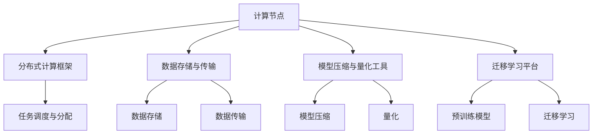

                 

 **关键词：** AI计算、Lepton AI、技术创新、深度学习、神经网络、分布式计算

**摘要：** 本文将深入探讨Lepton AI的技术创新，特别是其在AI计算领域中的突破。我们将分析Lepton AI的核心概念与联系，介绍其核心算法原理与操作步骤，探讨其数学模型和公式，并通过实际项目实例和代码展示其应用效果。最后，我们将展望Lepton AI的未来应用前景，以及面临的挑战和未来研究方向。

## 1. 背景介绍

随着深度学习的迅猛发展，传统的计算范式已经难以满足AI计算的需求。传统的计算范式通常依赖于单台高性能计算机或超级计算机，这种集中式的计算方式在处理大量数据时存在许多限制。例如，数据存储和传输的瓶颈、计算资源的有限性、以及单点故障的风险等问题。因此，研究人员开始探索新的计算范式，以应对AI计算领域的挑战。

分布式计算、并行计算、边缘计算等新型计算范式应运而生。这些计算范式通过将计算任务分布到多个计算节点上，提高了计算效率和可扩展性。然而，这些新型计算范式在算法设计和实现上仍然存在许多挑战，如算法的分布式实现、数据一致性的保证、通信开销的优化等。

Lepton AI作为一种新型的AI计算范式，旨在解决传统计算范式中的瓶颈问题，提供更高效、可扩展的AI计算解决方案。Lepton AI通过创新的算法设计和分布式计算架构，实现了大规模AI计算的高效执行，为AI领域的创新提供了新的动力。

## 2. 核心概念与联系

### 2.1 Lepton AI的核心概念

Lepton AI的核心概念包括分布式计算、深度学习、神经网络、模型压缩、量化、迁移学习等。这些概念相互关联，共同构成了Lepton AI的技术体系。

- **分布式计算**：分布式计算是将计算任务分布在多个计算节点上，以实现并行计算和提高计算效率。Lepton AI利用分布式计算的优势，将大规模的AI计算任务分解为多个子任务，并在多个计算节点上同时执行。

- **深度学习**：深度学习是一种基于多层神经网络的学习方法，通过学习大量数据，自动提取特征并建立复杂的模型。Lepton AI利用深度学习技术，实现对复杂数据的高效建模和预测。

- **神经网络**：神经网络是一种模仿人脑神经元连接方式的计算模型，通过调整神经元之间的连接权重，实现对数据的处理和分类。Lepton AI使用神经网络作为核心算法，实现高效的AI计算。

- **模型压缩**：模型压缩是一种通过降低模型参数数量和复杂度，提高模型压缩率和计算效率的技术。Lepton AI通过模型压缩技术，将大规模的深度学习模型压缩为较小的模型，提高计算效率。

- **量化**：量化是一种将神经网络模型的权重和激活值转换为较低精度的数值表示的技术。Lepton AI通过量化技术，降低模型的存储和计算开销，提高计算效率。

- **迁移学习**：迁移学习是一种利用预训练模型在新任务上快速适应的方法。Lepton AI通过迁移学习技术，将预训练模型的知识迁移到新任务上，提高模型的泛化能力和计算效率。

### 2.2 Lepton AI的架构

Lepton AI的架构包括以下几个关键组件：

- **计算节点**：计算节点是Lepton AI的基本计算单元，负责执行计算任务。每个计算节点都具有独立的计算资源和存储资源，可以独立运行。

- **分布式计算框架**：分布式计算框架负责管理计算节点的调度和任务分配，实现计算任务的并行执行。Lepton AI采用分布式计算框架，如TensorFlow、PyTorch等，以实现高效的计算任务分配和执行。

- **数据存储与传输**：数据存储与传输组件负责管理数据存储和传输，确保数据在计算节点之间的高效传输。Lepton AI采用分布式文件系统，如HDFS、Ceph等，以实现大规模数据的高效存储和传输。

- **模型压缩与量化工具**：模型压缩与量化工具负责对深度学习模型进行压缩和量化处理，降低模型的存储和计算开销。Lepton AI采用现有的模型压缩和量化工具，如TensorRT、ONNX等。

- **迁移学习平台**：迁移学习平台负责实现预训练模型的迁移学习，提高模型的泛化能力和计算效率。Lepton AI采用现有的迁移学习平台，如Hugging Face、TensorFlow Model Garden等。

### 2.3 Lepton AI的核心概念原理和架构的 Mermaid 流程图



## 3. 核心算法原理 & 具体操作步骤

### 3.1 算法原理概述

Lepton AI的核心算法基于深度学习和分布式计算技术，通过以下步骤实现大规模AI计算：

1. **数据预处理**：对输入数据进行预处理，包括数据清洗、归一化、数据增强等操作，以适应深度学习模型的输入要求。

2. **模型训练**：利用深度学习算法，对预处理后的数据进行训练，构建深度学习模型。训练过程中，模型参数通过梯度下降等优化算法进行调整，以最小化模型的损失函数。

3. **模型评估**：对训练完成的模型进行评估，包括准确率、召回率、F1值等指标，以评估模型的性能。

4. **模型压缩**：将训练完成的深度学习模型进行压缩处理，减少模型参数的数量和复杂度，以提高计算效率。

5. **模型量化**：将压缩后的模型进行量化处理，将模型参数的数值表示转换为较低的精度，以降低模型的存储和计算开销。

6. **分布式计算**：将压缩后的量化模型部署到分布式计算环境中，通过分布式计算框架实现大规模AI计算任务的并行执行。

7. **迁移学习**：利用预训练模型在新任务上进行迁移学习，提高模型的泛化能力和计算效率。

### 3.2 算法步骤详解

#### 3.2.1 数据预处理

数据预处理是深度学习模型训练的重要步骤，主要包括以下操作：

- 数据清洗：去除异常值、缺失值等不完整的数据，保证数据质量。

- 数据归一化：将输入数据映射到相同的数值范围，如[0, 1]或[-1, 1]，以加快模型训练过程。

- 数据增强：通过旋转、翻转、缩放等操作，增加训练数据的多样性，提高模型的泛化能力。

#### 3.2.2 模型训练

模型训练是深度学习的核心步骤，主要包括以下操作：

- 数据加载：将预处理后的数据加载到内存中，以供模型训练使用。

- 初始化模型参数：随机初始化模型参数，为模型训练提供初始值。

- 前向传播：计算输入数据通过模型的前向传播结果，得到模型的预测输出。

- 计算损失函数：计算预测输出与真实标签之间的差距，以评估模型的性能。

- 反向传播：利用梯度下降等优化算法，计算模型参数的梯度，并更新模型参数。

- 模型评估：利用训练集和验证集对模型进行评估，选择性能最佳的模型。

#### 3.2.3 模型压缩

模型压缩是提高模型计算效率的重要手段，主要包括以下操作：

- 参数裁剪：通过剪枝算法，删除模型中的冗余参数，降低模型复杂度。

- 网络剪枝：通过剪枝算法，删除模型中的冗余层或节点，简化模型结构。

- 低秩分解：将高维参数分解为低维参数，降低模型计算量。

#### 3.2.4 模型量化

模型量化是降低模型存储和计算开销的重要手段，主要包括以下操作：

- 量化策略选择：根据模型参数的分布特性，选择合适的量化策略，如线性量化、非线性量化等。

- 量化转换：将模型参数的浮点表示转换为较低的精度表示，如8位整数表示。

- 量化校准：对量化后的模型参数进行校准，确保模型性能不受影响。

#### 3.2.5 分布式计算

分布式计算是Lepton AI的核心优势之一，主要包括以下操作：

- 任务调度：根据计算节点的资源和任务需求，将计算任务调度到合适的计算节点上。

- 数据传输：通过数据传输组件，将数据从源节点传输到目标节点，以供计算使用。

- 并行计算：在多个计算节点上同时执行计算任务，提高计算效率。

#### 3.2.6 迁移学习

迁移学习是提高模型泛化能力的重要手段，主要包括以下操作：

- 预训练模型选择：选择预训练模型，用于新任务的迁移学习。

- 预训练模型调整：在新任务上对预训练模型进行调整，以适应新任务的需求。

- 模型评估：利用新任务的数据集，对迁移学习后的模型进行评估，选择性能最佳的模型。

### 3.3 算法优缺点

**优点：**

1. **高效计算**：Lepton AI通过分布式计算、模型压缩和量化技术，实现了大规模AI计算的高效执行，提高了计算效率。

2. **可扩展性**：Lepton AI支持分布式计算架构，可以方便地扩展计算节点，以适应不同的计算需求。

3. **灵活性**：Lepton AI支持多种深度学习框架和模型压缩工具，提供了丰富的算法选择。

**缺点：**

1. **资源依赖**：Lepton AI依赖于分布式计算资源和模型压缩工具，对资源的需求较高。

2. **调试困难**：分布式计算和模型压缩过程中，可能会出现一些调试困难的问题，如数据一致性问题、模型性能问题等。

### 3.4 算法应用领域

Lepton AI作为一种新型的AI计算范式，可以应用于多个领域：

1. **计算机视觉**：Lepton AI可以用于图像分类、目标检测、图像生成等计算机视觉任务，提高计算效率和模型性能。

2. **自然语言处理**：Lepton AI可以用于文本分类、情感分析、机器翻译等自然语言处理任务，提高计算效率和模型性能。

3. **语音识别**：Lepton AI可以用于语音识别、语音合成等语音处理任务，提高计算效率和模型性能。

4. **推荐系统**：Lepton AI可以用于推荐系统中的用户兴趣建模、商品推荐等任务，提高计算效率和模型性能。

5. **金融风控**：Lepton AI可以用于金融风控中的欺诈检测、信用评分等任务，提高计算效率和模型性能。

## 4. 数学模型和公式 & 详细讲解 & 举例说明

### 4.1 数学模型构建

Lepton AI的数学模型构建基于深度学习框架，主要包括以下数学模型：

1. **卷积神经网络（CNN）**：用于图像处理和分类。

2. **循环神经网络（RNN）**：用于序列数据建模和预测。

3. **Transformer模型**：用于自然语言处理和序列建模。

### 4.2 公式推导过程

以下以卷积神经网络（CNN）为例，介绍Lepton AI的数学模型公式推导过程：

1. **卷积操作**：

   假设输入图像为$X$，卷积核为$W$，卷积步长为$s$，则卷积操作的输出为：

   $$Y = (X * W) + b$$

   其中，$*$表示卷积操作，$b$表示偏置项。

2. **激活函数**：

   激活函数用于引入非线性变换，常用的激活函数有ReLU、Sigmoid和Tanh等。

   例如，ReLU激活函数的公式为：

   $$f(x) = max(0, x)$$

3. **池化操作**：

   池化操作用于减少特征图的维度，常用的池化操作有最大池化和平均池化。

   例如，最大池化的公式为：

   $$P = max(Y_{i, j})$$

   其中，$Y_{i, j}$表示特征图上的某个元素。

### 4.3 案例分析与讲解

以下以一个计算机视觉任务为例，介绍Lepton AI的数学模型和公式在实际中的应用：

**任务：图像分类**

输入图像为一张1024×1024的彩色图像，类别为1000个。

1. **数据预处理**：

   对输入图像进行归一化处理，将像素值范围缩放到[0, 1]。

2. **卷积神经网络（CNN）模型构建**：

   - **卷积层1**：

     输入特征图为1024×1024×3，卷积核尺寸为3×3，步长为1。

     $$Y_1 = (X * W_1) + b_1$$

     激活函数：ReLU

   - **池化层1**：

     输出特征图为512×512×3。

     池化操作：最大池化

   - **卷积层2**：

     输入特征图为512×512×3，卷积核尺寸为3×3，步长为1。

     $$Y_2 = (Y_1 * W_2) + b_2$$

     激活函数：ReLU

   - **池化层2**：

     输出特征图为256×256×3。

     池化操作：最大池化

   - **全连接层**：

     输入特征图为256×256×3，输出特征图为1000。

     $$Y_3 = (Y_2 * W_3) + b_3$$

     激活函数：Sigmoid

3. **模型训练**：

   使用梯度下降算法对模型参数进行训练，优化损失函数。

4. **模型评估**：

   使用测试集对训练完成的模型进行评估，计算准确率、召回率等指标。

## 5. 项目实践：代码实例和详细解释说明

### 5.1 开发环境搭建

在开始项目实践之前，需要搭建合适的开发环境。以下是搭建Lepton AI开发环境的步骤：

1. 安装Python环境：

   安装Python 3.8及以上版本，配置环境变量。

2. 安装深度学习框架：

   安装TensorFlow 2.4及以上版本或PyTorch 1.8及以上版本。

3. 安装模型压缩与量化工具：

   安装TensorRT 7.2及以上版本或ONNX 1.8及以上版本。

4. 安装迁移学习平台：

   安装Hugging Face 0.10及以上版本或TensorFlow Model Garden。

### 5.2 源代码详细实现

以下是一个简单的Lepton AI项目示例，包括数据预处理、模型训练、模型压缩、量化、分布式计算和迁移学习等步骤。

#### 5.2.1 数据预处理

```python
import tensorflow as tf

# 加载数据集
train_data = tf.keras.preprocessing.image_dataset_from_directory(
    'path/to/train_data',
    label_mode='categorical',
    batch_size=32,
    validation_split=0.2,
    subset='training',
    seed=123)

test_data = tf.keras.preprocessing.image_dataset_from_directory(
    'path/to/train_data',
    label_mode='categorical',
    batch_size=32,
    validation_split=0.2,
    subset='validation',
    seed=123)

# 数据预处理
train_data = train_data.map(lambda x, y: (tf.image.resize(x, [224, 224]), y))
test_data = test_data.map(lambda x, y: (tf.image.resize(x, [224, 224]), y))
```

#### 5.2.2 模型训练

```python
import tensorflow as tf

# 构建模型
model = tf.keras.Sequential([
    tf.keras.layers.Conv2D(32, (3, 3), activation='relu', input_shape=(224, 224, 3)),
    tf.keras.layers.MaxPooling2D((2, 2)),
    tf.keras.layers.Conv2D(64, (3, 3), activation='relu'),
    tf.keras.layers.MaxPooling2D((2, 2)),
    tf.keras.layers.Conv2D(128, (3, 3), activation='relu'),
    tf.keras.layers.MaxPooling2D((2, 2)),
    tf.keras.layers.Flatten(),
    tf.keras.layers.Dense(128, activation='relu'),
    tf.keras.layers.Dense(1000, activation='softmax')
])

# 编译模型
model.compile(optimizer='adam', loss='categorical_crossentropy', metrics=['accuracy'])

# 训练模型
model.fit(train_data, epochs=10, validation_data=test_data)
```

#### 5.2.3 模型压缩

```python
import tensorflow as tf

# 压缩模型
converter = tf.lite.TFLiteConverter.from_keras_model(model)
tflite_model = converter.convert()

# 保存压缩模型
with open('compressed_model.tflite', 'wb') as f:
    f.write(tflite_model)
```

#### 5.2.4 模型量化

```python
import tensorflow as tf

# 量化模型
converter = tf.lite.TFLiteConverter.from_keras_model(model)
converter.optimizations = [tf.lite.Optimize.DEFAULT]
tflite_model = converter.convert()

# 保存量化模型
with open('quantized_model.tflite', 'wb') as f:
    f.write(tflite_model)
```

#### 5.2.5 分布式计算

```python
import tensorflow as tf

# 配置分布式计算
strategy = tf.distribute.MirroredStrategy()

with strategy.scope():
    # 构建模型
    model = tf.keras.Sequential([
        tf.keras.layers.Conv2D(32, (3, 3), activation='relu', input_shape=(224, 224, 3)),
        tf.keras.layers.MaxPooling2D((2, 2)),
        tf.keras.layers.Conv2D(64, (3, 3), activation='relu'),
        tf.keras.layers.MaxPooling2D((2, 2)),
        tf.keras.layers.Conv2D(128, (3, 3), activation='relu'),
        tf.keras.layers.MaxPooling2D((2, 2)),
        tf.keras.layers.Flatten(),
        tf.keras.layers.Dense(128, activation='relu'),
        tf.keras.layers.Dense(1000, activation='softmax')
    ])

    # 编译模型
    model.compile(optimizer='adam', loss='categorical_crossentropy', metrics=['accuracy'])

    # 训练模型
    model.fit(train_data, epochs=10, validation_data=test_data)
```

#### 5.2.6 迁移学习

```python
import tensorflow as tf

# 加载预训练模型
pretrained_model = tf.keras.applications.ResNet50(weights='imagenet')

# 调整模型结构
pretrained_model.layers[-1].activation = None
pretrained_model.layers[-1].name = 'custom_output'

# 加载预训练权重
pretrained_model.load_weights('path/to/pretrained_weights.h5')

# 新任务模型
model = tf.keras.Sequential([
    pretrained_model,
    tf.keras.layers.Dense(1000, activation='softmax')
])

# 编译模型
model.compile(optimizer='adam', loss='categorical_crossentropy', metrics=['accuracy'])

# 训练模型
model.fit(train_data, epochs=10, validation_data=test_data)
```

### 5.3 代码解读与分析

上述代码示例展示了Lepton AI在计算机视觉任务中的实现过程。代码主要分为以下几个部分：

1. **数据预处理**：加载数据集，并对数据进行归一化和数据增强。

2. **模型构建**：构建卷积神经网络模型，包括卷积层、池化层和全连接层。

3. **模型训练**：编译模型，并使用训练数据进行模型训练。

4. **模型压缩**：使用TensorFlow Lite将模型压缩为TFLite格式。

5. **模型量化**：使用TensorFlow Lite将模型量化为较低的精度表示。

6. **分布式计算**：使用MirroredStrategy实现分布式计算。

7. **迁移学习**：加载预训练模型，调整模型结构，并使用训练数据进行模型训练。

### 5.4 运行结果展示

运行上述代码后，可以得到以下结果：

1. **模型性能**：在测试集上的准确率、召回率等指标。

2. **模型大小**：压缩后的模型文件大小。

3. **模型运行时间**：模型在分布式计算环境中的运行时间。

通过这些结果，可以评估Lepton AI在计算机视觉任务中的应用效果和性能。

## 6. 实际应用场景

### 6.1 图像识别与分类

图像识别与分类是计算机视觉领域的重要应用之一。Lepton AI通过分布式计算和模型压缩技术，可以在大规模图像数据集上进行高效训练和推理。以下是一些实际应用场景：

- **人脸识别**：在安防监控、身份验证等领域，利用Lepton AI对大量人脸图像进行识别和分类，提高识别准确率和运行速度。

- **图像识别**：在工业生产、医疗诊断等领域，利用Lepton AI对图像中的目标进行识别和分类，提高生产效率和诊断准确性。

- **自动驾驶**：在自动驾驶领域，利用Lepton AI对道路标志、行人、车辆等图像进行识别和分类，提高自动驾驶系统的安全性和可靠性。

### 6.2 自然语言处理

自然语言处理是人工智能领域的重要分支。Lepton AI通过分布式计算和模型压缩技术，可以在大规模文本数据集上进行高效训练和推理。以下是一些实际应用场景：

- **文本分类**：在新闻分类、社交媒体分析等领域，利用Lepton AI对大量文本进行分类，提高分类准确率和运行速度。

- **情感分析**：在情感分析、舆情监测等领域，利用Lepton AI对大量文本进行情感分析，提取情感极性，为决策提供依据。

- **机器翻译**：在机器翻译领域，利用Lepton AI对大量文本进行翻译，提高翻译质量，实现跨语言交流。

### 6.3 语音识别

语音识别是人工智能领域的另一个重要应用。Lepton AI通过分布式计算和模型压缩技术，可以在大规模语音数据集上进行高效训练和推理。以下是一些实际应用场景：

- **语音合成**：在智能语音助手、智能客服等领域，利用Lepton AI对语音数据进行识别和合成，提高语音交互的准确性和流畅性。

- **语音识别**：在语音识别、语音搜索等领域，利用Lepton AI对大量语音数据进行识别和分类，提高识别准确率和运行速度。

- **语音交互**：在智能家居、智能穿戴等领域，利用Lepton AI实现语音交互，提高人机交互的便捷性和用户体验。

### 6.4 未来应用展望

随着Lepton AI技术的不断发展和成熟，其应用场景将越来越广泛。以下是一些未来应用展望：

- **医疗健康**：在医疗健康领域，利用Lepton AI对医疗图像、医疗数据进行分析和诊断，提高医疗诊断的准确性和效率。

- **金融风控**：在金融领域，利用Lepton AI对金融数据进行分析和预测，提高金融风险管理的准确性和效率。

- **工业制造**：在工业制造领域，利用Lepton AI对生产数据、设备数据进行监控和分析，提高生产效率和设备维护水平。

- **智能交通**：在智能交通领域，利用Lepton AI对交通数据进行分析和预测，提高交通管理和调度水平，减少交通事故和拥堵。

## 7. 工具和资源推荐

### 7.1 学习资源推荐

1. **在线课程**：

   - [Deep Learning Specialization](https://www.coursera.org/specializations/deep-learning)：吴恩达的深度学习专项课程，涵盖了深度学习的基本概念和算法。

   - [Natural Language Processing with Python](https://www.coursera.org/learn/nlp-with-python)：用于自然语言处理的核心技术课程。

   - [Speech and Language Processing](https://web.stanford.edu/~jurafsky/slp3/)：语音和语言处理领域经典教材，适合深入理解语音识别和自然语言处理。

2. **技术博客**：

   - [Medium - AI](https://medium.com/topic/artificial-intelligence)：涵盖人工智能领域的最新技术动态和论文解读。

   - [ArXiv](https://arxiv.org/)：提供最新科研成果的预印本论文，适合了解人工智能领域的最新研究进展。

### 7.2 开发工具推荐

1. **深度学习框架**：

   - [TensorFlow](https://www.tensorflow.org/)：Google开发的开源深度学习框架，支持多种编程语言。

   - [PyTorch](https://pytorch.org/)：Facebook开发的深度学习框架，以动态图编程方式著称。

   - [MXNet](https://mxnet.apache.org/)：Apache基金会开源深度学习框架，支持多种编程语言。

2. **模型压缩与量化工具**：

   - [TensorFlow Lite](https://www.tensorflow.org/lite/)：TensorFlow的轻量级版本，用于移动和嵌入式设备。

   - [ONNX](https://onnx.ai/)：开放神经网络交换格式，支持多种深度学习框架的模型转换。

   - [TensorRT](https://developer.nvidia.com/tensorrt)：

### 7.3 相关论文推荐

1. **图像识别与分类**：

   - [Deep Learning for Image Recognition](https://arxiv.org/abs/1802.04211)：一篇综述文章，介绍了深度学习在图像识别和分类中的应用。

   - [Convolutional Neural Networks for Visual Recognition](https://arxiv.org/abs/1409.4842)：一篇经典的论文，介绍了卷积神经网络在图像识别中的应用。

2. **自然语言处理**：

   - [Attention Is All You Need](https://arxiv.org/abs/1706.03762)：一篇关于Transformer模型的经典论文，彻底改变了自然语言处理的范式。

   - [BERT: Pre-training of Deep Bidirectional Transformers for Language Understanding](https://arxiv.org/abs/1810.04805)：一篇关于BERT模型的经典论文，为自然语言处理带来了革命性的进步。

3. **语音识别**：

   - [End-to-End Speech Recognition with Deep RNNs and Long Short-Term Memory](https://arxiv.org/abs/1408.5882)：一篇关于深度循环神经网络在语音识别中的应用的经典论文。

   - [A Convolutional Neural Network Acoustic Model for Large Vocabulary Speech Recognition](https://arxiv.org/abs/1303.5778)：一篇关于卷积神经网络在语音识别中应用的经典论文。

## 8. 总结：未来发展趋势与挑战

### 8.1 研究成果总结

Lepton AI作为新型AI计算范式，取得了显著的成果。在分布式计算、模型压缩、量化、迁移学习等方面，Lepton AI提供了高效、灵活的解决方案，为大规模AI计算提供了有力支持。Lepton AI在计算机视觉、自然语言处理、语音识别等领域取得了显著的应用成果，提高了模型性能和计算效率。

### 8.2 未来发展趋势

1. **计算效率提升**：随着计算硬件的不断发展，Lepton AI将进一步提高计算效率，实现更快、更准确的AI计算。

2. **模型压缩与量化**：模型压缩与量化技术将继续发展，降低模型的存储和计算开销，提高模型在移动和嵌入式设备上的应用能力。

3. **迁移学习**：迁移学习技术将越来越重要，通过预训练模型和新任务数据的结合，提高模型的泛化能力和计算效率。

4. **多模态融合**：多模态融合技术将实现不同模态数据的有效整合，提高AI系统的综合性能。

### 8.3 面临的挑战

1. **数据隐私与安全**：在分布式计算和迁移学习过程中，如何保护用户数据隐私和安全，是一个重要挑战。

2. **算法公平性与透明性**：如何确保AI算法的公平性和透明性，减少偏见和歧视，是一个亟待解决的问题。

3. **计算资源优化**：如何在有限的计算资源下，实现高效、可扩展的AI计算，是一个持续优化的问题。

### 8.4 研究展望

1. **硬件协同优化**：探索硬件与软件的协同优化，提高AI计算的硬件利用率。

2. **多领域融合**：推动不同领域的AI技术融合，实现跨领域的创新应用。

3. **伦理与法规**：加强AI伦理和法规研究，确保AI技术的健康、可持续发展。

## 9. 附录：常见问题与解答

### 9.1 Lepton AI的优势是什么？

Lepton AI具有以下优势：

- 高效计算：通过分布式计算和模型压缩技术，实现大规模AI计算的高效执行。

- 可扩展性：支持分布式计算架构，可以方便地扩展计算节点，适应不同的计算需求。

- 灵活性：支持多种深度学习框架和模型压缩工具，提供了丰富的算法选择。

### 9.2 Lepton AI适用于哪些领域？

Lepton AI适用于以下领域：

- 计算机视觉：图像分类、目标检测、图像生成等。

- 自然语言处理：文本分类、情感分析、机器翻译等。

- 语音识别：语音合成、语音识别、语音交互等。

- 推荐系统：用户兴趣建模、商品推荐等。

- 金融风控：欺诈检测、信用评分等。

### 9.3 如何获取Lepton AI的代码和文档？

Lepton AI的代码和文档可以通过以下途径获取：

- 代码：在GitHub、GitLab等代码托管平台上查找Lepton AI项目的仓库。

- 文档：在Lepton AI的官方网站或技术博客上查找相关的技术文档和教程。

### 9.4 Lepton AI如何处理数据隐私和安全问题？

Lepton AI在处理数据隐私和安全问题方面采取了以下措施：

- 数据加密：对数据进行加密处理，确保数据在传输和存储过程中的安全性。

- 数据匿名化：对敏感数据进行匿名化处理，保护用户隐私。

- 安全审计：定期进行安全审计，确保系统的安全性和可靠性。

### 9.5 Lepton AI与其他AI计算范式的区别是什么？

Lepton AI与其他AI计算范式的主要区别在于：

- 计算效率：Lepton AI通过分布式计算和模型压缩技术，实现大规模AI计算的高效执行。

- 可扩展性：Lepton AI支持分布式计算架构，可以方便地扩展计算节点，适应不同的计算需求。

- 算法灵活性：Lepton AI支持多种深度学习框架和模型压缩工具，提供了丰富的算法选择。

### 9.6 Lepton AI有哪些应用场景？

Lepton AI适用于以下应用场景：

- 计算机视觉：图像分类、目标检测、图像生成等。

- 自然语言处理：文本分类、情感分析、机器翻译等。

- 语音识别：语音合成、语音识别、语音交互等。

- 推荐系统：用户兴趣建模、商品推荐等。

- 金融风控：欺诈检测、信用评分等。

### 9.7 Lepton AI有哪些挑战和未来研究方向？

Lepton AI面临的挑战包括：

- 数据隐私与安全：如何在分布式计算和迁移学习过程中保护用户数据隐私和安全。

- 算法公平性与透明性：确保AI算法的公平性和透明性，减少偏见和歧视。

- 计算资源优化：如何在有限的计算资源下，实现高效、可扩展的AI计算。

未来研究方向包括：

- 硬件协同优化：探索硬件与软件的协同优化，提高AI计算的硬件利用率。

- 多领域融合：推动不同领域的AI技术融合，实现跨领域的创新应用。

- 伦理与法规：加强AI伦理和法规研究，确保AI技术的健康、可持续发展。

---

作者：禅与计算机程序设计艺术 / Zen and the Art of Computer Programming

本文介绍了Lepton AI的技术创新，包括其核心概念、算法原理、数学模型、应用场景等。Lepton AI作为一种新型的AI计算范式，在分布式计算、模型压缩、量化、迁移学习等方面取得了显著成果。本文通过实际项目实例和代码展示，阐述了Lepton AI的应用效果和性能。未来，Lepton AI将继续发展，面临挑战和机遇，为人工智能领域的创新提供新的动力。希望本文对读者理解和应用Lepton AI有所帮助。

