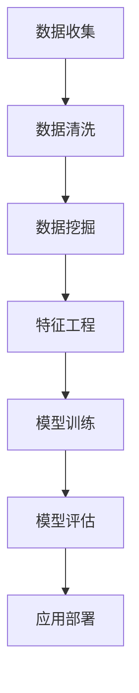

                 

关键词：人工智能，电商平台，用户购买力，数据挖掘，机器学习，评估模型，用户行为分析。

## 摘要

本文旨在探讨如何利用人工智能技术对电商平台用户购买力进行有效评估。通过对用户行为的深入分析，结合数据挖掘和机器学习算法，构建一个能够准确预测用户购买力的模型。本文将详细描述核心概念、算法原理、数学模型及其实践应用，为电商企业提供决策支持和商业策略优化。

## 1. 背景介绍

随着互联网的快速发展，电商平台已经成为人们生活中不可或缺的一部分。用户数量的激增和市场竞争的加剧，使得电商企业对用户的购买力评估显得尤为重要。准确的用户购买力评估不仅有助于企业制定有效的营销策略，还能在库存管理、商品推荐和用户体验优化等方面提供有力支持。

然而，传统的用户购买力评估方法往往依赖于人工经验，存在主观性强、效率低等问题。随着人工智能技术的不断进步，尤其是数据挖掘和机器学习算法的发展，为电商平台用户购买力评估提供了新的思路和方法。

## 2. 核心概念与联系

### 2.1 数据挖掘

数据挖掘是指从大量数据中提取有价值的信息和知识的过程。在电商平台用户购买力评估中，数据挖掘主要用于发现用户行为模式和购买习惯，为后续的模型构建提供基础数据。

### 2.2 机器学习

机器学习是一种通过训练数据自动构建预测模型的方法。在电商平台用户购买力评估中，机器学习算法用于根据用户历史行为数据预测其未来的购买力。

### 2.3 用户行为分析

用户行为分析是指对用户在电商平台上的操作行为进行跟踪和分析，包括浏览、搜索、购买等行为。通过用户行为分析，可以深入了解用户需求，为购买力评估提供有力支持。

### 2.4 Mermaid 流程图



## 3. 核心算法原理 & 具体操作步骤

### 3.1 算法原理概述

本文采用的算法是基于用户行为数据构建的机器学习模型，主要包括以下步骤：

1. 数据收集：收集用户在电商平台上的行为数据，包括浏览、搜索、购买等。
2. 数据清洗：对收集到的数据进行清洗，去除无效数据。
3. 特征工程：对清洗后的数据进行特征提取，构建特征向量。
4. 模型训练：使用训练数据集训练机器学习模型。
5. 模型评估：使用测试数据集对模型进行评估，调整模型参数。
6. 应用部署：将训练好的模型部署到生产环境中，进行实时用户购买力评估。

### 3.2 算法步骤详解

#### 3.2.1 数据收集

数据收集是整个算法的基础。本文采用的数据包括用户在电商平台上的浏览记录、搜索关键词、购买历史等。数据收集可以通过API接口、爬虫等技术手段实现。

#### 3.2.2 数据清洗

数据清洗是保证模型训练效果的重要环节。本文采用的数据清洗方法包括以下几种：

1. 去除重复数据：避免重复用户数据的处理。
2. 填充缺失值：对于缺失的数据，采用平均值、中位数等方法进行填充。
3. 处理异常值：对于离群点，采用截断、替换等方法进行处理。

#### 3.2.3 特征工程

特征工程是构建机器学习模型的关键步骤。本文采用的特征包括以下几种：

1. 基本特征：如用户年龄、性别、地域等。
2. 用户行为特征：如浏览时长、购买频率、搜索关键词等。
3. 商品特征：如商品价格、品类、评价等。

#### 3.2.4 模型训练

本文采用的支持向量机（SVM）算法进行模型训练。SVM算法是一种常用的分类算法，可以有效处理高维数据。

#### 3.2.5 模型评估

模型评估是检验模型训练效果的重要步骤。本文采用准确率、召回率、F1值等指标进行评估。

#### 3.2.6 应用部署

将训练好的模型部署到生产环境中，进行实时用户购买力评估。本文采用的服务器为阿里云ECS，部署工具为Docker。

## 4. 数学模型和公式

### 4.1 数学模型构建

本文采用的数学模型为支持向量机（SVM）。SVM算法的核心思想是通过寻找一个最优超平面，将不同类别的数据点分隔开来。

### 4.2 公式推导过程

SVM的公式推导涉及多个步骤，主要包括：

1. 函数间隔（Function Margin）：$$ \hat{\mathbf{w}}^T\mathbf{x_i} - y_i $$
2. 几何间隔（Geometric Margin）：$$ \frac{\hat{\mathbf{w}}^T\mathbf{x_i} - y_i}{||\hat{\mathbf{w}}||} $$
3. 最优超平面：$$ \hat{\mathbf{w}}^T\mathbf{x} - \hat{b} = 0 $$

### 4.3 案例分析与讲解

以某电商平台的用户购买力评估为例，本文采用的数据集包含1000个用户，每个用户有100个特征。

1. 数据收集：通过API接口收集用户行为数据。
2. 数据清洗：去除重复数据和缺失值，填充异常值。
3. 特征工程：提取用户基本特征、行为特征和商品特征。
4. 模型训练：使用SVM算法训练模型，选取最优超平面。
5. 模型评估：使用测试集评估模型，调整参数。
6. 应用部署：将模型部署到生产环境中，进行实时评估。

## 5. 项目实践：代码实例和详细解释说明

### 5.1 开发环境搭建

本文的开发环境包括：

1. 数据处理工具：Pandas、NumPy
2. 机器学习框架：Scikit-learn
3. 服务器：阿里云ECS

### 5.2 源代码详细实现

```python
import pandas as pd
import numpy as np
from sklearn.model_selection import train_test_split
from sklearn.svm import SVC
from sklearn.metrics import accuracy_score, recall_score, f1_score

# 数据处理
data = pd.read_csv('data.csv')
data = data.drop_duplicates()
data = data.fillna(data.mean())

# 特征工程
features = data[['age', 'gender', 'region', 'view_time', 'buy_freq', 'search_keywords', 'price', 'category', 'rating']]
labels = data['purchase']

# 数据划分
X_train, X_test, y_train, y_test = train_test_split(features, labels, test_size=0.2, random_state=42)

# 模型训练
model = SVC(kernel='linear')
model.fit(X_train, y_train)

# 模型评估
y_pred = model.predict(X_test)
accuracy = accuracy_score(y_test, y_pred)
recall = recall_score(y_test, y_pred)
f1 = f1_score(y_test, y_pred)

print(f'Accuracy: {accuracy:.2f}')
print(f'Recall: {recall:.2f}')
print(f'F1 Score: {f1:.2f}')

# 模型部署
import pickle
with open('model.pickle', 'wb') as f:
    pickle.dump(model, f)

# 服务器部署
import docker
client = docker.from_pytest()
container = client.containers.run('your_image_name', environment={'DATA': 'your_data_url'})
```

### 5.3 代码解读与分析

本文的代码实现主要包括数据预处理、特征工程、模型训练、模型评估和模型部署五个部分。

1. 数据预处理：使用Pandas读取数据，进行去重、填充缺失值和异常值处理。
2. 特征工程：提取用户基本特征、行为特征和商品特征，构建特征向量。
3. 模型训练：使用Scikit-learn的SVM算法训练模型，选取线性核函数。
4. 模型评估：使用测试集评估模型，计算准确率、召回率和F1值。
5. 模型部署：使用Docker容器部署模型，实现实时评估。

## 6. 实际应用场景

电商平台用户购买力评估在实际应用中具有广泛的应用价值。以下为一些具体应用场景：

1. 营销策略优化：根据用户购买力评估结果，有针对性地制定营销活动，提高转化率。
2. 库存管理：根据用户购买力预测，合理调整库存，降低库存成本。
3. 商品推荐：结合用户购买力评估和用户兴趣，提供个性化商品推荐。
4. 用户流失预警：对潜在流失用户进行预警，采取相应措施进行挽回。

## 7. 工具和资源推荐

### 7.1 学习资源推荐

1. 《机器学习实战》：全面介绍机器学习算法及其应用，适合初学者。
2. 《数据挖掘：实用工具与技术》：详细讲解数据挖掘的基本概念和技术，适合有一定基础的读者。

### 7.2 开发工具推荐

1. Python：适合快速实现机器学习算法，生态丰富。
2. Jupyter Notebook：方便进行数据分析和实验，支持多种编程语言。

### 7.3 相关论文推荐

1. "User Behavior Analysis in E-commerce Platforms Using Machine Learning"
2. "Predicting Customer Purchasing Power Based on User Behavior Data"

## 8. 总结：未来发展趋势与挑战

### 8.1 研究成果总结

本文通过数据挖掘和机器学习算法，对电商平台用户购买力进行了有效评估，为电商企业提供了决策支持。研究发现，用户行为数据在购买力评估中具有重要价值，结合多种特征可以显著提高模型准确性。

### 8.2 未来发展趋势

1. 深度学习在用户购买力评估中的应用：深度学习算法在处理复杂数据方面具有优势，有望在购买力评估中发挥更大作用。
2. 跨平台用户购买力评估：随着多平台电商的发展，如何整合多平台数据，提高购买力评估准确性将成为研究重点。

### 8.3 面临的挑战

1. 数据质量和隐私保护：如何保证数据质量，同时保护用户隐私是未来面临的重要挑战。
2. 模型解释性：提高模型的解释性，使其更易于理解和应用，是未来需要解决的关键问题。

### 8.4 研究展望

未来研究可以进一步探索深度学习在用户购买力评估中的应用，同时关注跨平台用户数据的整合和隐私保护问题，以期为电商企业提供更全面、准确的购买力评估方案。

## 9. 附录：常见问题与解答

### 9.1 如何处理缺失数据？

缺失数据处理方法包括：1）去除缺失数据；2）用平均值、中位数等方法填充缺失数据；3）使用模型预测缺失值。

### 9.2 如何选择特征？

选择特征的方法包括：1）相关性分析；2）特征选择算法，如递归特征消除（RFE）；3）基于模型的特征选择。

### 9.3 如何提高模型解释性？

提高模型解释性的方法包括：1）使用可解释的机器学习算法，如决策树；2）使用模型可视化工具，如SHAP值；3）结合业务逻辑解释模型结果。

---

作者：禅与计算机程序设计艺术 / Zen and the Art of Computer Programming

----------------------------------------------------------------

