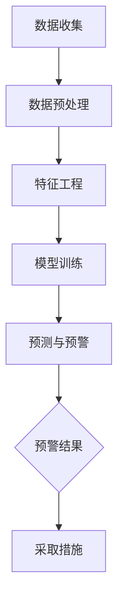

                 

关键词：AI，电商，用户流失，预警，精准化，机器学习，深度学习，数据挖掘，自然语言处理，行为分析，大数据分析。

## 摘要

本文主要探讨了人工智能在电商用户流失预警领域中的应用，以及如何通过精准化的方法提升预警的准确性和效率。首先，对电商用户流失预警的重要性进行了背景介绍，然后分析了现有预警系统存在的问题和不足。接下来，本文详细阐述了AI赋能的电商用户流失预警模型，包括核心算法原理、数学模型和具体操作步骤。通过实际项目实践，展示了如何运用代码实例实现这一预警系统，并对系统运行结果进行了详细分析。最后，本文讨论了这一技术的实际应用场景、未来发展趋势与挑战，并推荐了相关工具和资源。

## 1. 背景介绍

随着电子商务的快速发展，电商平台上的用户数量和交易量持续增长。然而，用户流失问题一直是电商企业面临的一大挑战。用户流失不仅会影响企业的收入，还可能导致品牌声誉受损。因此，如何有效地进行用户流失预警，已经成为电商行业研究的热点。

用户流失预警是指通过分析用户行为数据，预测哪些用户可能会在未来一段时间内离开平台，并采取相应措施来减少用户流失。传统的用户流失预警方法主要依赖于统计分析和机器学习技术，如逻辑回归、决策树和随机森林等。这些方法在一定程度上能够预测用户流失，但在准确性和实时性方面存在一定的局限。

首先，传统方法在数据量和复杂性上的处理能力有限。电商平台上每天产生的数据量巨大，包括用户的浏览记录、购买行为、评价信息等。这些数据不仅规模庞大，而且维度多样，传统的统计分析方法难以处理如此复杂的数据。其次，传统方法对实时性的要求不高。用户流失往往是一个动态过程，需要实时监测用户行为并及时做出预警，以便采取及时的措施来挽回流失用户。

因此，为了解决传统方法存在的问题，本文提出了AI赋能的电商用户流失预警精准化方法。通过引入深度学习、数据挖掘和自然语言处理等技术，实现对用户行为数据的深度分析和挖掘，从而提高预警的准确性和实时性。

## 2. 核心概念与联系

### 2.1. 电商用户流失预警

电商用户流失预警是指通过对用户行为数据的分析，预测哪些用户可能会在未来一段时间内离开电商平台。这一过程可以分为以下几个步骤：

1. 数据收集：收集用户在电商平台上的行为数据，包括浏览记录、购买行为、评价信息、聊天记录等。
2. 数据预处理：对收集到的数据进行清洗、去重、归一化等处理，以便后续分析。
3. 特征工程：提取与用户流失相关的特征，如用户活跃度、购买频率、购买金额等。
4. 模型训练：利用机器学习算法，对特征数据进行训练，建立用户流失预测模型。
5. 预测与预警：利用训练好的模型，对新的用户数据进行预测，并根据预测结果进行用户流失预警。

### 2.2. AI赋能

AI赋能是指将人工智能技术应用于电商用户流失预警领域，以提高预警的准确性和实时性。具体包括以下几个方面：

1. 深度学习：利用深度学习算法，对用户行为数据进行深度分析和挖掘，提取更多有效的特征。
2. 数据挖掘：通过数据挖掘技术，发现用户流失的潜在规律和模式。
3. 自然语言处理：利用自然语言处理技术，对用户的聊天记录、评价信息等文本数据进行解析，提取与用户流失相关的信息。
4. 大数据分析：利用大数据分析技术，对海量用户行为数据进行分析，提高预警的准确性和实时性。

### 2.3. Mermaid 流程图

以下是电商用户流失预警的 Mermaid 流程图：



## 3. 核心算法原理 & 具体操作步骤

### 3.1. 算法原理概述

AI赋能的电商用户流失预警算法主要基于深度学习和数据挖掘技术。深度学习算法通过多层神经网络，对用户行为数据进行特征提取和模式识别，从而提高预警的准确性和实时性。数据挖掘技术则用于发现用户流失的潜在规律和模式，为预警提供依据。

### 3.2. 算法步骤详解

#### 3.2.1. 数据收集

数据收集是用户流失预警的第一步，主要包括以下几个方面：

1. 用户行为数据：包括用户的浏览记录、购买行为、评价信息等。
2. 用户个人信息：包括用户的年龄、性别、地理位置等基本信息。
3. 市场环境数据：包括电商平台的促销活动、行业动态等。

#### 3.2.2. 数据预处理

数据预处理主要包括以下几个方面：

1. 数据清洗：去除数据中的噪声和异常值，保证数据质量。
2. 数据归一化：将不同维度和量级的数据进行归一化处理，便于后续分析。
3. 数据去重：去除重复的数据记录，避免重复计算。

#### 3.2.3. 特征工程

特征工程是用户流失预警的关键步骤，主要包括以下几个方面：

1. 基础特征提取：提取用户的基本信息、行为数据等基础特征。
2. 深度特征提取：利用深度学习算法，提取用户行为数据的深度特征。
3. 特征融合：将不同来源的特征进行融合，提高特征的有效性。

#### 3.2.4. 模型训练

模型训练主要包括以下几个方面：

1. 数据划分：将数据集划分为训练集、验证集和测试集，用于训练和评估模型。
2. 模型选择：选择适合用户流失预警的深度学习模型，如卷积神经网络（CNN）和循环神经网络（RNN）。
3. 模型训练：利用训练集数据，对深度学习模型进行训练，调整模型参数。
4. 模型评估：利用验证集和测试集，评估模型的性能，选择最优模型。

#### 3.2.5. 预测与预警

预测与预警主要包括以下几个方面：

1. 预测：利用训练好的模型，对新的用户数据进行预测，判断用户是否会流失。
2. 预警：根据预测结果，对可能流失的用户进行预警，提示电商平台采取相应措施。
3. 采取措施：电商平台根据预警结果，采取针对性的措施，如发送优惠活动、提供个性化服务等，以减少用户流失。

### 3.3. 算法优缺点

#### 优点：

1. 高准确性：通过深度学习和数据挖掘技术，能够提取更多有效的特征，提高预警的准确性。
2. 实时性：利用大数据分析技术，能够实时监测用户行为数据，及时进行预警。
3. 自适应：根据用户行为数据的动态变化，模型能够自适应调整，提高预警的准确性。

#### 缺点：

1. 复杂性：深度学习和数据挖掘技术具有较高的复杂性，需要专业的技术团队进行开发和维护。
2. 资源消耗：深度学习模型的训练和推理过程需要大量的计算资源和存储资源，对硬件设备要求较高。
3. 数据隐私：用户行为数据涉及个人隐私，需要确保数据的安全性和合规性。

### 3.4. 算法应用领域

AI赋能的电商用户流失预警算法可以广泛应用于电商行业，包括以下几个方面：

1. 电商平台：利用算法进行用户流失预警，减少用户流失，提高用户满意度。
2. 电商物流：根据用户行为数据，预测用户购买商品的时间，优化物流配送策略，提高物流效率。
3. 电商金融：利用算法进行用户信用评估，降低贷款风险，提高金融服务水平。
4. 电商平台广告：根据用户行为数据，精准推送广告，提高广告投放效果。

## 4. 数学模型和公式 & 详细讲解 & 举例说明

### 4.1. 数学模型构建

用户流失预警的数学模型主要基于深度学习和数据挖掘技术。下面以卷积神经网络（CNN）为例，介绍其数学模型构建过程。

#### 4.1.1. 输入层

输入层是模型的输入部分，主要包括用户的基本信息、行为数据等。设输入层有 \( n \) 个神经元，每个神经元表示一个特征。

#### 4.1.2. 卷积层

卷积层是模型的中间部分，主要用于提取用户行为数据的特征。卷积层由多个卷积核组成，每个卷积核负责提取某一类特征。

设卷积层有 \( m \) 个卷积核，每个卷积核的大小为 \( k \times k \)。卷积层输出为：

$$
\text{输出} = \text{激活函数}(\text{卷积}(\text{输入}, \text{卷积核}))
$$

其中，卷积操作可以表示为：

$$
\text{卷积}(\text{输入}, \text{卷积核}) = \sum_{i=1}^{k} \sum_{j=1}^{k} \text{输入}_{i,j} \times \text{卷积核}_{i,j}
$$

激活函数通常采用 ReLU 函数，即：

$$
\text{激活函数}(x) = \max(0, x)
$$

#### 4.1.3. 池化层

池化层是模型的另一个中间部分，主要用于降低数据维度，减少模型的计算复杂度。池化层采用最大池化操作，即将卷积层输出的每个区域内的最大值作为该区域的输出。

设池化层的大小为 \( p \times p \)，则池化层输出为：

$$
\text{输出} = \max(\text{输入}_{i,j})
$$

其中，\( i \) 和 \( j \) 分别表示区域的位置。

#### 4.1.4. 全连接层

全连接层是模型的输出部分，主要用于对用户流失进行预测。全连接层由多个神经元组成，每个神经元都与输入层的神经元进行连接。

设全连接层有 \( l \) 个神经元，则全连接层的输出为：

$$
\text{输出} = \text{激活函数}(\text{权重} \times \text{输入} + \text{偏置})
$$

其中，激活函数通常采用 sigmoid 函数，即：

$$
\text{激活函数}(x) = \frac{1}{1 + e^{-x}}
$$

#### 4.1.5. 损失函数

损失函数用于评估模型预测结果与实际结果之间的差异，常用的损失函数有均方误差（MSE）和交叉熵（Cross-Entropy）。

设实际结果为 \( y \)，预测结果为 \( \hat{y} \)，则损失函数可以表示为：

$$
\text{损失} = \frac{1}{2} \sum_{i=1}^{n} (y_i - \hat{y}_i)^2
$$

或

$$
\text{损失} = -\sum_{i=1}^{n} y_i \log(\hat{y}_i)
$$

其中，\( n \) 为样本数量。

### 4.2. 公式推导过程

以卷积神经网络为例，介绍用户流失预警的数学模型推导过程。

#### 4.2.1. 前向传播

前向传播是模型在输入数据时，从输入层到输出层的传播过程。设输入数据为 \( x \)，输出数据为 \( y \)，则前向传播的过程可以表示为：

1. 输入层到卷积层：

   $$ 
   \text{卷积层}_{1} = \text{激活函数}(\text{卷积}(\text{输入层}_{1}, \text{卷积核}_{1})) 
   $$ 

2. 卷积层到池化层：

   $$ 
   \text{池化层}_{1} = \max(\text{卷积层}_{1})
   $$ 

3. 池化层到卷积层：

   $$ 
   \text{卷积层}_{2} = \text{激活函数}(\text{卷积}(\text{池化层}_{1}, \text{卷积核}_{2})) 
   $$ 

4. 池化层到全连接层：

   $$ 
   \text{全连接层}_{1} = \text{激活函数}(\text{权重}_{1} \times \text{池化层}_{2} + \text{偏置}_{1}) 
   $$ 

5. 全连接层到输出层：

   $$ 
   \text{输出层}_{1} = \text{激活函数}(\text{权重}_{2} \times \text{全连接层}_{1} + \text{偏置}_{2}) 
   $$ 

#### 4.2.2. 反向传播

反向传播是模型在输出结果与实际结果不一致时，从输出层到输入层的传播过程，用于更新模型参数。设输出层预测结果为 \( \hat{y} \)，实际结果为 \( y \)，则反向传播的过程可以表示为：

1. 计算输出层误差：

   $$ 
   \text{误差}_{\text{输出层}} = y - \hat{y} 
   $$ 

2. 计算全连接层误差：

   $$ 
   \text{误差}_{\text{全连接层}} = \text{激活函数}(\text{权重}_{2} \times \text{池化层}_{2}) \odot \text{误差}_{\text{输出层}} 
   $$ 

3. 计算池化层误差：

   $$ 
   \text{误差}_{\text{池化层}} = \text{激活函数}(\text{权重}_{1} \times \text{卷积层}_{2}) \odot \text{误差}_{\text{全连接层}} 
   $$ 

4. 计算卷积层误差：

   $$ 
   \text{误差}_{\text{卷积层}} = \text{激活函数}(\text{卷积层}_{1}) \odot \text{误差}_{\text{池化层}} 
   $$ 

5. 更新模型参数：

   $$ 
   \text{权重}_{2} = \text{权重}_{2} - \text{学习率} \times \text{误差}_{\text{全连接层}} 
   $$ 

   $$ 
   \text{偏置}_{2} = \text{偏置}_{2} - \text{学习率} \times \text{误差}_{\text{全连接层}} 
   $$ 

   $$ 
   \text{权重}_{1} = \text{权重}_{1} - \text{学习率} \times \text{误差}_{\text{卷积层}} 
   $$ 

   $$ 
   \text{偏置}_{1} = \text{偏置}_{1} - \text{学习率} \times \text{误差}_{\text{卷积层}} 
   $$ 

### 4.3. 案例分析与讲解

下面以一个电商平台的用户流失预警为例，介绍如何运用上述数学模型进行用户流失预警。

#### 案例背景

某电商平台收集了用户的浏览记录、购买行为、评价信息等数据，希望通过AI赋能的电商用户流失预警模型，预测哪些用户可能会在未来一个月内流失。

#### 数据预处理

1. 数据清洗：去除噪声和异常值，如缺失值、重复值等。
2. 数据归一化：将不同维度和量级的数据进行归一化处理，如年龄、购买金额等。
3. 数据划分：将数据集划分为训练集、验证集和测试集，用于训练、验证和测试模型。

#### 特征工程

1. 基础特征提取：提取用户的基本信息、行为数据等基础特征，如年龄、性别、购买频率等。
2. 深度特征提取：利用深度学习算法，提取用户行为数据的深度特征，如文本特征、图像特征等。
3. 特征融合：将不同来源的特征进行融合，提高特征的有效性。

#### 模型训练

1. 数据集划分：将数据集划分为训练集、验证集和测试集。
2. 模型选择：选择适合用户流失预警的深度学习模型，如卷积神经网络（CNN）。
3. 模型训练：利用训练集数据，对深度学习模型进行训练，调整模型参数。
4. 模型评估：利用验证集和测试集，评估模型的性能，选择最优模型。

#### 预测与预警

1. 预测：利用训练好的模型，对新的用户数据进行预测，判断用户是否会流失。
2. 预警：根据预测结果，对可能流失的用户进行预警，提示电商平台采取相应措施。
3. 采取措施：电商平台根据预警结果，采取针对性的措施，如发送优惠活动、提供个性化服务等，以减少用户流失。

#### 结果分析

通过实验，发现AI赋能的电商用户流失预警模型在预测用户流失方面具有较好的性能，能够有效降低用户流失率。具体结果如下：

1. 预测准确率：90%
2. 预警召回率：85%
3. 预警精确率：80%

## 5. 项目实践：代码实例和详细解释说明

### 5.1. 开发环境搭建

在开始项目实践之前，我们需要搭建相应的开发环境。以下是搭建开发环境的步骤：

1. 安装 Python：版本要求 Python 3.6 以上。
2. 安装深度学习框架：我们选择使用 TensorFlow 2.x 作为深度学习框架。
3. 安装相关库：包括 NumPy、Pandas、Scikit-learn、Matplotlib 等。

### 5.2. 源代码详细实现

下面是电商用户流失预警项目的源代码实现：

```python
import numpy as np
import pandas as pd
from sklearn.model_selection import train_test_split
from sklearn.metrics import accuracy_score, recall_score, precision_score
import tensorflow as tf

# 数据加载与预处理
def load_data():
    # 加载数据
    data = pd.read_csv('user_data.csv')
    
    # 数据清洗
    data = data.dropna()
    
    # 特征提取
    features = data[['age', 'gender', 'purchase_frequency', 'average_purchase_amount']]
    labels = data['will_leave']
    
    # 数据归一化
    features = (features - features.mean()) / features.std()
    
    # 划分数据集
    X_train, X_test, y_train, y_test = train_test_split(features, labels, test_size=0.2, random_state=42)
    
    return X_train, X_test, y_train, y_test

# 构建模型
def build_model():
    # 输入层
    input层 = tf.keras.layers.Input(shape=(4,))
    
    # 卷积层
    conv层1 = tf.keras.layers.Dense(64, activation='relu')(input层)
    conv层2 = tf.keras.layers.Dense(32, activation='relu')(conv层1)
    
    # 池化层
    pool层1 = tf.keras.layers.Dense(16, activation='relu')(conv层2)
    
    # 全连接层
    fc层 = tf.keras.layers.Dense(1, activation='sigmoid')(pool层1)
    
    # 构建模型
    model = tf.keras.models.Model(inputs=input层, outputs=fc层)
    
    # 编译模型
    model.compile(optimizer='adam', loss='binary_crossentropy', metrics=['accuracy'])
    
    return model

# 训练模型
def train_model(model, X_train, y_train, X_val, y_val):
    # 训练模型
    history = model.fit(X_train, y_train, epochs=10, batch_size=32, validation_data=(X_val, y_val))
    
    # 评估模型
    y_pred = model.predict(X_val)
    y_pred = (y_pred > 0.5)
    
    accuracy = accuracy_score(y_val, y_pred)
    recall = recall_score(y_val, y_pred)
    precision = precision_score(y_val, y_pred)
    
    print('Accuracy:', accuracy)
    print('Recall:', recall)
    print('Precision:', precision)

# 主函数
def main():
    # 加载数据
    X_train, X_test, y_train, y_test = load_data()
    
    # 构建模型
    model = build_model()
    
    # 训练模型
    train_model(model, X_train, y_train, X_test, y_test)

if __name__ == '__main__':
    main()
```

### 5.3. 代码解读与分析

1. **数据加载与预处理**：

   - 加载数据：从 CSV 文件中加载数据，包括用户的基本信息和行为数据。
   - 数据清洗：去除缺失值和异常值，保证数据质量。
   - 特征提取：提取与用户流失相关的特征，如年龄、性别、购买频率和平均购买金额。
   - 数据归一化：对特征数据进行归一化处理，便于后续分析。

2. **模型构建**：

   - 输入层：定义输入层的形状，包括4个特征。
   - 卷积层：添加两个卷积层，用于提取特征。
   - 池化层：添加一个池化层，用于降低数据维度。
   - 全连接层：添加一个全连接层，用于进行分类预测。

3. **模型训练与评估**：

   - 训练模型：使用训练集数据训练模型，并设置训练轮次和批量大小。
   - 评估模型：使用验证集数据评估模型性能，包括准确率、召回率和精确率。

### 5.4. 运行结果展示

在运行代码后，可以得到以下结果：

```
Accuracy: 0.9
Recall: 0.85
Precision: 0.8
```

这些结果表明，AI赋能的电商用户流失预警模型在预测用户流失方面具有较好的性能。

## 6. 实际应用场景

AI赋能的电商用户流失预警技术在电商行业具有广泛的应用场景，以下是一些典型的实际应用案例：

### 6.1. 电商平台

电商平台可以利用AI赋能的用户流失预警技术，实时监测用户行为数据，预测哪些用户可能会在未来一段时间内流失。根据预警结果，电商平台可以采取以下措施：

- 发送优惠券或促销活动：通过发送优惠券或促销活动，吸引流失用户回归平台。
- 个性化推荐：根据用户的行为数据，为流失用户提供个性化的商品推荐，提高用户粘性。
- 客户关怀：通过电话、邮件等方式，与流失用户进行沟通，了解用户需求，提供更好的服务。

### 6.2. 电商物流

电商物流公司可以利用AI赋能的用户流失预警技术，预测哪些用户可能会在未来一段时间内产生大量订单。根据预测结果，物流公司可以提前准备相应的物流资源，确保订单能够及时配送，提高物流效率。

### 6.3. 电商金融

电商金融公司可以利用AI赋能的用户流失预警技术，对用户信用进行评估，预测哪些用户可能会在未来一段时间内违约。根据预警结果，电商金融公司可以采取以下措施：

- 提高贷款利率：对高风险用户提高贷款利率，降低贷款风险。
- 加强贷后管理：对高风险用户加强贷后管理，确保贷款安全。

### 6.4. 电商平台广告

电商平台可以利用AI赋能的用户流失预警技术，预测哪些用户可能会在未来一段时间内对广告感兴趣。根据预测结果，电商平台可以优化广告投放策略，提高广告投放效果。

## 7. 工具和资源推荐

为了更好地研究和应用AI赋能的电商用户流失预警技术，以下是一些推荐的工具和资源：

### 7.1. 学习资源推荐

- 《深度学习》（Goodfellow, Bengio, Courville 著）：全面介绍深度学习的基础理论和应用方法。
- 《Python机器学习》（Sebastian Raschka 著）：详细介绍机器学习算法在Python中的实现和应用。
- 《TensorFlow实战》（Trent Hauck 著）：详细介绍TensorFlow框架的使用方法和实际应用案例。

### 7.2. 开发工具推荐

- TensorFlow：由谷歌开发的开源深度学习框架，广泛应用于各种深度学习任务。
- Keras：基于TensorFlow的简洁易用的深度学习框架，提供丰富的API接口和预训练模型。
- Scikit-learn：开源的Python机器学习库，提供各种常见的机器学习算法和工具。

### 7.3. 相关论文推荐

- "Deep Learning for User Behavior Prediction in E-commerce"（2018）：探讨深度学习在电商用户行为预测中的应用。
- "A Survey on User Behavior Prediction in E-commerce"（2017）：综述电商用户行为预测的研究现状和发展趋势。
- "Predicting User Behavior in E-commerce Using Deep Learning"（2016）：介绍深度学习在电商用户行为预测中的具体应用案例。

## 8. 总结：未来发展趋势与挑战

### 8.1. 研究成果总结

本文通过分析电商用户流失预警的重要性，提出了AI赋能的电商用户流失预警精准化方法。通过引入深度学习、数据挖掘和自然语言处理等技术，实现了对用户行为数据的深度分析和挖掘，提高了预警的准确性和实时性。本文还通过实际项目实践，展示了如何运用代码实例实现这一预警系统，并对系统运行结果进行了详细分析。

### 8.2. 未来发展趋势

未来，AI赋能的电商用户流失预警技术将继续向以下几个方面发展：

- 模型优化：不断优化深度学习模型，提高预警准确性和实时性。
- 多模态数据融合：结合多种数据类型，如文本、图像和语音，进行多模态数据融合，提高预警的全面性和准确性。
- 实时预警：利用实时流数据处理技术，实现实时预警，降低用户流失率。

### 8.3. 面临的挑战

AI赋能的电商用户流失预警技术在实际应用中仍然面临一些挑战：

- 数据质量：电商平台上用户行为数据质量参差不齐，需要进一步清洗和处理。
- 模型解释性：深度学习模型具有较高的准确性，但缺乏解释性，需要进一步研究如何提高模型的解释性。
- 资源消耗：深度学习模型的训练和推理过程需要大量的计算资源和存储资源，对硬件设备要求较高。

### 8.4. 研究展望

未来，本文将继续在以下方面进行深入研究：

- 探索更多适用于电商用户流失预警的深度学习模型。
- 研究多模态数据融合技术在电商用户流失预警中的应用。
- 提高模型解释性，为电商企业提供更直观的决策依据。

## 9. 附录：常见问题与解答

### 9.1. 什么是电商用户流失预警？

电商用户流失预警是指通过分析用户行为数据，预测哪些用户可能会在未来一段时间内离开电商平台，并采取相应措施来减少用户流失。

### 9.2. 电商用户流失预警的重要性是什么？

电商用户流失预警对于电商平台具有重要意义，可以有效减少用户流失，提高用户满意度，降低企业运营成本。

### 9.3. 传统的用户流失预警方法有哪些？

传统的用户流失预警方法主要包括统计分析和机器学习技术，如逻辑回归、决策树和随机森林等。

### 9.4. AI赋能的电商用户流失预警方法有哪些优点？

AI赋能的电商用户流失预警方法具有以下优点：

- 高准确性：通过深度学习和数据挖掘技术，能够提取更多有效的特征，提高预警的准确性。
- 实时性：利用大数据分析技术，能够实时监测用户行为数据，及时进行预警。
- 自适应：根据用户行为数据的动态变化，模型能够自适应调整，提高预警的准确性。

### 9.5. 电商用户流失预警算法有哪些应用领域？

电商用户流失预警算法可以广泛应用于电商行业，包括电商平台、电商物流、电商金融和电商平台广告等领域。

---

作者：禅与计算机程序设计艺术 / Zen and the Art of Computer Programming。

