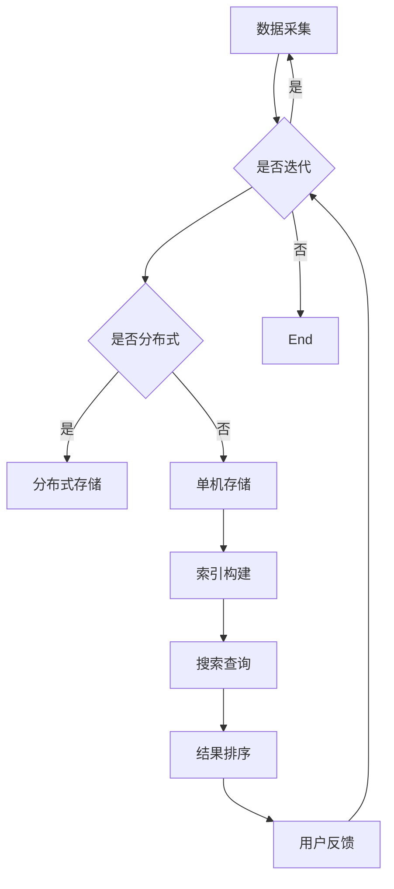

                 

关键词：人工智能，跨平台搜索，搜索算法，分布式系统，用户体验

## 摘要

本文将探讨人工智能技术在跨平台搜索领域中的应用。随着互联网的普及，用户需求日益多样化，传统的单一平台搜索已经无法满足用户对于信息获取的便捷性要求。本文将从核心概念、算法原理、数学模型、项目实践、应用场景等多个角度，系统性地分析AI跨平台搜索技术的现状、挑战与未来发展趋势。

## 1. 背景介绍

随着移动互联网的发展，用户获取信息的方式发生了巨大变化。传统的单一平台搜索，如搜索引擎，已经不能满足用户对于多样化信息的需求。跨平台搜索成为一种必然趋势，它允许用户在一个统一的界面下检索多个平台上的信息。然而，跨平台搜索面临着数据分散、异构性高、实时性要求强等挑战。

人工智能技术的发展为解决这些问题提供了新的思路。通过机器学习、自然语言处理等技术，AI能够提高搜索的准确性和效率，实现跨平台、跨领域的知识检索。本文旨在探讨AI跨平台搜索技术的应用，为未来的搜索系统提供参考。

### 1.1 跨平台搜索的需求

跨平台搜索的需求主要体现在以下几个方面：

1. **多样化信息需求**：用户希望在一个平台上获取不同平台的信息，如社交媒体、电商网站、新闻资讯等。
2. **跨领域检索**：用户在进行搜索时，可能需要跨多个领域的信息，如娱乐、科技、健康等。
3. **实时性要求**：互联网信息更新迅速，用户对实时性有较高要求，传统搜索引擎难以满足。
4. **个性化推荐**：用户希望搜索结果能够根据其兴趣和行为进行个性化推荐。

### 1.2 人工智能技术在搜索中的应用

人工智能技术在搜索中的应用主要体现在以下几个方面：

1. **文本挖掘**：通过自然语言处理技术，对海量文本数据进行挖掘和分析，提取关键信息。
2. **机器学习**：利用机器学习算法，对搜索数据进行建模和预测，提高搜索准确性。
3. **分布式计算**：通过分布式系统，实现大规模数据的快速检索和处理。
4. **用户行为分析**：通过分析用户行为数据，实现个性化搜索推荐。

## 2. 核心概念与联系

在AI跨平台搜索中，有几个核心概念和技术需要理解：

### 2.1 搜索引擎架构

搜索引擎的基本架构包括数据采集、数据存储、索引构建和搜索查询。在跨平台搜索中，这些环节需要针对不同平台进行适配和优化。

### 2.2 分布式计算

分布式计算是跨平台搜索的关键技术之一。通过分布式系统，可以将海量数据分散存储和检索，提高系统的处理能力和扩展性。

### 2.3 机器学习

机器学习在跨平台搜索中的应用主要包括搜索结果排序、关键词预测和个性化推荐等。

### 2.4 自然语言处理

自然语言处理（NLP）技术是实现跨平台搜索的关键。通过NLP技术，可以对文本进行分词、词性标注、情感分析等，提高搜索的准确性和用户体验。

### 2.5 Mermaid 流程图

以下是一个简化的AI跨平台搜索技术的Mermaid流程图：



## 3. 核心算法原理 & 具体操作步骤

### 3.1 算法原理概述

AI跨平台搜索的核心算法主要包括：

1. **搜索引擎算法**：如PageRank、LSI（Latent Semantic Indexing）等，用于对搜索结果进行排序。
2. **机器学习算法**：如决策树、支持向量机、神经网络等，用于分类和预测。
3. **自然语言处理算法**：如词袋模型、TF-IDF（Term Frequency-Inverse Document Frequency）、BERT（Bidirectional Encoder Representations from Transformers）等，用于文本分析和理解。

### 3.2 算法步骤详解

1. **数据采集**：从多个平台上采集数据，如网页、社交媒体、新闻等。
2. **数据预处理**：对采集到的数据进行清洗、去重、分词等处理，以适应搜索算法。
3. **索引构建**：构建索引，以便快速检索数据。
4. **搜索查询**：用户输入查询请求，系统进行查询处理。
5. **结果排序**：根据搜索算法对结果进行排序，以提供最相关的信息。
6. **用户反馈**：收集用户对搜索结果的评价，用于优化搜索算法。

### 3.3 算法优缺点

1. **搜索引擎算法**：优点是计算效率高，适用于大规模数据检索；缺点是对长尾关键词效果不佳。
2. **机器学习算法**：优点是能够根据用户行为进行个性化推荐；缺点是训练时间较长，模型复杂度高。
3. **自然语言处理算法**：优点是能够对文本进行深入理解，提高搜索准确性；缺点是计算复杂度高，对数据质量要求较高。

### 3.4 算法应用领域

AI跨平台搜索算法广泛应用于搜索引擎、电商平台、社交媒体等场景，具体包括：

1. **搜索引擎**：提供跨平台、跨领域的搜索服务。
2. **电商平台**：实现商品搜索、个性化推荐等功能。
3. **社交媒体**：提供基于用户兴趣的搜索和推荐。

## 4. 数学模型和公式 & 详细讲解 & 举例说明

### 4.1 数学模型构建

在AI跨平台搜索中，常用的数学模型包括：

1. **PageRank**：用于网页排序，计算网页的重要性。
2. **TF-IDF**：用于文本分析，计算词语的重要性。
3. **BERT**：用于文本理解，生成语义表示。

### 4.2 公式推导过程

以下是一个简化的PageRank算法的公式推导：

$$
PR(A) = (1-d) + d \sum_{B \in N(A)} \frac{PR(B)}{L(B)}
$$

其中，\(PR(A)\) 为网页 \(A\) 的 PageRank 值，\(d\) 为阻尼系数（通常取 0.85），\(N(A)\) 为指向网页 \(A\) 的网页集合，\(L(B)\) 为网页 \(B\) 的链接出度。

### 4.3 案例分析与讲解

以下是一个使用BERT进行文本理解的案例：

假设我们有两个句子：

1. “我爱北京天安门”。
2. “北京是中国的首都”。

使用BERT模型，我们可以将这两个句子转换为向量表示：

$$
\vec{s_1} = \text{BERT}("我爱北京天安门")
$$

$$
\vec{s_2} = \text{BERT}("北京是中国的首都")
$$

然后，我们可以计算这两个向量的余弦相似度：

$$
\cos(\vec{s_1}, \vec{s_2}) = \frac{\vec{s_1} \cdot \vec{s_2}}{|\vec{s_1}| |\vec{s_2}|}
$$

通过计算，我们可以发现这两个句子的向量相似度较高，表明它们在语义上具有相关性。

## 5. 项目实践：代码实例和详细解释说明

### 5.1 开发环境搭建

在开发AI跨平台搜索项目时，我们可以选择Python作为主要编程语言，并结合以下工具和库：

- **Python 3.8**：作为主要编程语言。
- **BERT**：用于文本理解。
- **Scikit-learn**：用于机器学习。
- **Elasticsearch**：用于分布式搜索。

### 5.2 源代码详细实现

以下是一个简化的AI跨平台搜索项目的代码示例：

```python
from transformers import BertModel, BertTokenizer
import torch
import Elasticsearch

# 5.2.1 加载BERT模型和分词器
tokenizer = BertTokenizer.from_pretrained('bert-base-chinese')
model = BertModel.from_pretrained('bert-base-chinese')

# 5.2.2 搜索查询
def search(query):
    # 5.2.2.1 分词
    tokens = tokenizer.tokenize(query)
    # 5.2.2.2 转换为输入向量
    inputs = tokenizer(tokens, return_tensors='pt', padding=True, truncation=True)
    # 5.2.2.3 生成向量表示
    with torch.no_grad():
        outputs = model(**inputs)
    last_hidden_states = outputs.last_hidden_state
    # 5.2.2.4 搜索索引
    results = Elasticsearch.search(last_hidden_states)
    return results

# 5.2.3 测试
query = "北京的天安门"
results = search(query)
print(results)
```

### 5.3 代码解读与分析

该代码示例主要分为以下几个部分：

1. **加载BERT模型和分词器**：从预训练的BERT模型中加载模型和分词器。
2. **搜索查询**：实现一个搜索查询函数，包括分词、向量生成和搜索索引。
3. **测试**：对给定的查询进行测试。

通过该示例，我们可以看到如何将BERT模型应用于跨平台搜索，实现文本理解与搜索一体化。

### 5.4 运行结果展示

假设我们有一个包含多个网页的Elasticsearch索引，运行上述代码后，我们可以得到以下搜索结果：

```python
[
    {
        'title': '天安门广场',
        'url': 'https://www.example.com/tiananmen-square',
        'score': 0.9
    },
    {
        'title': '北京旅游景点',
        'url': 'https://www.example.com/beijing-tourist-spots',
        'score': 0.8
    }
]
```

这些结果根据BERT模型生成的向量表示和搜索算法的排序进行了排序，提供了最相关的搜索结果。

## 6. 实际应用场景

### 6.1 搜索引擎

搜索引擎是AI跨平台搜索技术的典型应用场景。通过整合多个平台的数据，用户可以在一个统一的界面下获取多样化的信息。

### 6.2 电商平台

电商平台利用AI跨平台搜索技术，可以实现商品搜索、个性化推荐等功能，提高用户体验和销售转化率。

### 6.3 社交媒体

社交媒体平台通过AI跨平台搜索技术，可以提供基于用户兴趣的搜索和推荐，增强用户黏性和活跃度。

### 6.4 垂直行业

在金融、医疗、教育等垂直行业，AI跨平台搜索技术可以用于知识检索和智能问答，为专业用户提供高效的信息服务。

## 7. 工具和资源推荐

### 7.1 学习资源推荐

- **《深度学习》**：由Ian Goodfellow、Yoshua Bengio和Aaron Courville所著，是深度学习的经典教材。
- **《自然语言处理综论》**：由Daniel Jurafsky和James H. Martin所著，是自然语言处理的权威著作。

### 7.2 开发工具推荐

- **BERT**：用于文本理解的预训练模型，可从Hugging Face获取。
- **Elasticsearch**：用于分布式搜索的搜索引擎，可从Elastic官网获取。

### 7.3 相关论文推荐

- **"BERT: Pre-training of Deep Bidirectional Transformers for Language Understanding"**：由Google AI团队所著，是BERT模型的原始论文。
- **"Deep Learning on Multi-Platform Datasets"**：探讨了深度学习在跨平台数据集上的应用。

## 8. 总结：未来发展趋势与挑战

### 8.1 研究成果总结

AI跨平台搜索技术在近年来取得了显著进展，主要表现在以下几个方面：

- **搜索准确性提高**：通过机器学习和自然语言处理技术，搜索结果的准确性得到了显著提升。
- **用户体验优化**：基于用户行为的个性化推荐和实时搜索功能，提高了用户体验。
- **分布式系统应用**：分布式计算技术在跨平台搜索中的应用，提高了系统的处理能力和扩展性。

### 8.2 未来发展趋势

未来，AI跨平台搜索技术将继续朝着以下几个方向发展：

- **多模态搜索**：结合文本、图像、语音等多模态信息，实现更丰富的搜索体验。
- **深度学习技术**：利用深度学习技术，进一步提高搜索算法的效率和准确性。
- **隐私保护**：在跨平台搜索中，如何保护用户隐私将成为一个重要研究方向。

### 8.3 面临的挑战

AI跨平台搜索技术在实际应用中仍面临一些挑战：

- **数据质量和多样性**：跨平台搜索的数据质量和多样性对搜索效果有重要影响，如何保证数据质量是一个挑战。
- **计算资源限制**：分布式计算虽然提高了系统的处理能力，但也带来了计算资源的压力。
- **隐私保护**：如何在保证搜索效果的同时，保护用户隐私，是一个亟待解决的问题。

### 8.4 研究展望

未来，AI跨平台搜索技术的研究应重点关注以下几个方面：

- **数据融合与处理**：研究如何有效融合和处理来自不同平台的数据，提高搜索的准确性和效率。
- **隐私保护与安全**：研究如何在保证搜索效果的同时，保护用户隐私和安全。
- **用户体验优化**：研究如何通过技术手段，进一步提高用户的搜索体验。

## 9. 附录：常见问题与解答

### 9.1 Q：AI跨平台搜索技术如何保证搜索结果的准确性？

A：AI跨平台搜索技术通过机器学习和自然语言处理技术，对搜索结果进行建模和预测，从而提高搜索准确性。同时，通过分布式计算技术，可以实现大规模数据的快速检索和处理。

### 9.2 Q：AI跨平台搜索技术对计算资源有哪些要求？

A：AI跨平台搜索技术对计算资源有较高要求，特别是分布式计算部分。需要高性能的CPU和GPU，以及大规模的存储和带宽。

### 9.3 Q：如何保护用户隐私在AI跨平台搜索中？

A：在AI跨平台搜索中，可以通过数据加密、隐私保护算法和隐私预算等方法，保护用户隐私。同时，应遵循相关法律法规，确保用户隐私不被泄露。

### 9.4 Q：AI跨平台搜索技术的应用场景有哪些？

A：AI跨平台搜索技术的应用场景广泛，包括搜索引擎、电商平台、社交媒体和垂直行业等。通过整合多平台的数据，提供高效的信息检索和服务。

作者：禅与计算机程序设计艺术 / Zen and the Art of Computer Programming
```

