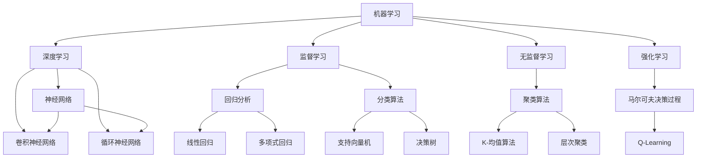

                 

关键词：人工智能，辅助科学，假设验证，算法优化，数学模型，应用场景，未来展望。

> 摘要：本文探讨了人工智能在科学研究中的辅助作用，特别是如何通过AI技术加速假设验证过程。文章首先介绍了假设验证在科学研究中的重要性，随后详细阐述了AI算法在假设验证中的应用，包括核心算法原理、具体操作步骤、数学模型构建与公式推导，并通过实例展示了AI技术在实际项目中的应用。文章最后对AI辅助科学研究的未来发展方向和面临的挑战进行了展望。

## 1. 背景介绍

在科学研究中，假设验证是至关重要的一环。科学研究的目的是发现自然规律，而这一过程往往需要通过实验和数据分析来验证假设的正确性。传统的假设验证方法通常依赖于大量的实验数据和高计算能力的计算资源，这使得整个过程既耗时又昂贵。然而，随着人工智能技术的快速发展，AI开始被广泛应用于科学研究的各个环节，其中假设验证是一个极具潜力的应用领域。

人工智能可以通过机器学习算法和深度学习模型对大量数据进行分析，从中提取出潜在的规律和模式。这种方法不仅可以大大缩短假设验证的时间，还可以提高验证的准确性和可靠性。此外，AI技术还可以帮助研究人员发现新的假设，从而推动科学研究的进步。因此，研究AI在假设验证中的应用，对于加速科学研究进程、提高科研效率具有重要意义。

## 2. 核心概念与联系

在探讨AI在假设验证中的应用之前，我们需要了解一些核心概念，包括机器学习、深度学习、神经网络等。以下是一个简单的 Mermaid 流程图，展示了这些概念之间的关系：



### 2.1 机器学习

机器学习是AI的核心组成部分，它是指通过算法从数据中自动学习规律和模式的过程。机器学习算法可以分为三大类：监督学习、无监督学习和强化学习。

- **监督学习**：在监督学习场景中，算法需要根据输入数据和对应的输出（标签）来学习。常见的监督学习算法包括线性回归、决策树、支持向量机等。

- **无监督学习**：无监督学习不需要输出标签，其目标是发现数据中的隐含结构。聚类算法和降维算法是典型的无监督学习算法。

- **强化学习**：强化学习是一种通过奖励机制来学习如何在特定环境中做出最优决策的算法。马尔可夫决策过程（MDP）和Q-Learning是强化学习的两种主要形式。

### 2.2 深度学习

深度学习是机器学习的一个分支，它通过多层神经网络来模拟人脑的神经元结构，以实现复杂的数据处理和模式识别任务。深度学习的关键组成部分包括：

- **神经网络**：神经网络由多个神经元组成，每个神经元都与其他神经元相连接，并对其进行加权求和，然后通过激活函数产生输出。

- **卷积神经网络（CNN）**：CNN特别适合处理具有网格结构的数据，如图像和视频。它通过卷积层、池化层和全连接层来提取特征并进行分类。

- **循环神经网络（RNN）**：RNN适用于处理序列数据，如时间序列数据、语音信号等。它通过循环结构来保存之前的信息，从而捕捉序列中的长期依赖关系。

## 3. 核心算法原理 & 具体操作步骤

### 3.1 算法原理概述

在假设验证中，AI算法的核心任务是发现数据中的潜在规律，并验证这些规律是否符合科学假设。以下是几个在假设验证中常用的AI算法：

- **线性回归**：线性回归是一种简单的监督学习算法，用于预测连续值。通过最小化预测值与真实值之间的误差，找到最佳拟合直线。

- **决策树**：决策树通过一系列的判断条件将数据划分成多个子集，每个子集对应一个特定的决策。它可以用于分类和回归任务。

- **支持向量机（SVM）**：SVM通过找到最佳分割超平面，将数据分为不同的类别。它特别适用于高维空间的数据。

- **K-均值聚类**：K-均值聚类是一种无监督学习算法，通过迭代计算聚类中心，将数据点划分成K个簇。

### 3.2 算法步骤详解

以下以线性回归为例，详细说明假设验证中的算法步骤：

1. **数据收集与预处理**：收集相关的实验数据，并进行数据清洗、归一化等预处理步骤。

2. **特征选择**：从数据中提取对假设验证有重要影响的特征。

3. **模型训练**：使用线性回归算法对数据集进行训练，找到最佳拟合直线。

4. **模型评估**：通过交叉验证等方法评估模型的性能，包括预测误差、准确率等指标。

5. **假设验证**：使用训练好的模型对新的数据集进行预测，验证假设是否符合实际数据。

### 3.3 算法优缺点

- **线性回归**：
  - 优点：简单、易于理解和实现，适用于线性关系较强的数据。
  - 缺点：对非线性关系处理能力有限，容易受到异常值的影响。

- **决策树**：
  - 优点：易于解释，可以处理非线性关系和多种类型的特征。
  - 缺点：容易过拟合，计算复杂度高。

- **支持向量机（SVM）**：
  - 优点：在处理高维数据时表现优异，可以处理非线性分类问题。
  - 缺点：训练时间较长，对参数敏感。

- **K-均值聚类**：
  - 优点：简单、高效，适合大规模数据集。
  - 缺点：对初始聚类中心敏感，可能陷入局部最优。

### 3.4 算法应用领域

AI算法在假设验证中的应用非常广泛，包括但不限于以下领域：

- **医学研究**：用于诊断疾病、预测治疗效果等。
- **生物学**：用于基因表达分析、蛋白质结构预测等。
- **物理学**：用于粒子物理实验数据分析、宇宙学模型验证等。
- **经济学**：用于市场预测、风险评估等。

## 4. 数学模型和公式 & 详细讲解 & 举例说明

### 4.1 数学模型构建

在假设验证中，常用的数学模型包括线性回归、决策树和神经网络等。以下以线性回归为例，说明数学模型的构建过程。

#### 4.1.1 线性回归

线性回归模型的基本假设是数据之间存在线性关系，可以用以下公式表示：

\[ y = \beta_0 + \beta_1x + \epsilon \]

其中，\( y \) 是因变量，\( x \) 是自变量，\( \beta_0 \) 和 \( \beta_1 \) 是模型的参数，\( \epsilon \) 是误差项。

#### 4.1.2 决策树

决策树模型通过一系列的条件判断来划分数据集，可以用以下公式表示：

\[ t(x) = \sum_{i=1}^{n} \alpha_i \prod_{j=1}^{m} I(x_j \in R_{ij}) \]

其中，\( t(x) \) 是决策结果，\( \alpha_i \) 是第 \( i \) 个分支的权重，\( I \) 是指示函数，\( R_{ij} \) 是第 \( j \) 个特征的第 \( i \) 个取值范围。

#### 4.1.3 神经网络

神经网络模型由多个神经元组成，每个神经元都是一个非线性函数的组合。其基本形式可以表示为：

\[ a(z) = f(\sum_{i=1}^{n} w_{ij}z_j + b_j) \]

其中，\( a(z) \) 是神经元的输出，\( f \) 是激活函数，\( w_{ij} \) 是权重，\( z_j \) 是输入值，\( b_j \) 是偏置。

### 4.2 公式推导过程

#### 4.2.1 线性回归

线性回归的参数可以通过最小二乘法进行估计。具体推导过程如下：

1. **目标函数**：

\[ J(\beta_0, \beta_1) = \sum_{i=1}^{m} (y_i - (\beta_0 + \beta_1x_i))^2 \]

2. **梯度**：

\[ \nabla J(\beta_0, \beta_1) = \begin{bmatrix} \frac{\partial J}{\partial \beta_0} \\ \frac{\partial J}{\partial \beta_1} \end{bmatrix} = \begin{bmatrix} -2\sum_{i=1}^{m} (y_i - (\beta_0 + \beta_1x_i)) \\ -2\sum_{i=1}^{m} (y_i - (\beta_0 + \beta_1x_i))x_i \end{bmatrix} \]

3. **最优参数**：

\[ \beta_0^*, \beta_1^* = \arg\min_{\beta_0, \beta_1} J(\beta_0, \beta_1) \]

通过求解上述梯度方程，可以得到最佳参数值。

#### 4.2.2 决策树

决策树的构建过程涉及多个条件的判断，其推导过程相对复杂。以下简要介绍：

1. **信息增益**：

\[ IG(V, A) = H(V) - \sum_{v \in V} p(v) H(A|V = v) \]

其中，\( H \) 是熵函数，\( p(v) \) 是特征 \( v \) 的概率分布，\( H(A|V = v) \) 是条件熵。

2. **基尼不纯度**：

\[ Gini(V) = 1 - \sum_{v \in V} p(v)^2 \]

3. **最优划分**：

选择能够最大化信息增益或最小化基尼不纯度的特征进行划分。

#### 4.2.3 神经网络

神经网络模型的推导过程涉及多层函数的组合，其推导相对复杂。以下简要介绍：

1. **前向传播**：

\[ z_l = \sum_{k=1}^{n} w_{lk}a_{l-1,k} + b_l \]

\[ a_l = f(z_l) \]

2. **反向传播**：

计算每一层的梯度，并更新权重和偏置。

### 4.3 案例分析与讲解

以下以线性回归为例，通过一个实际案例来展示数学模型的应用。

#### 案例背景

某公司想要研究员工工资与工作经验之间的关系。他们收集了100名员工的工资和工作经验数据，数据如下：

| 工作经验（年） | 工资（万元） |
| :------------: | :----------: |
|       1       |     5.0     |
|       2       |     6.5     |
|       3       |     8.0     |
|       4       |     9.5     |
|       5       |    11.0     |
|       ...     |     ...     |
|      100      |    30.0     |

#### 模型构建

假设工资 \( y \) 与工作经验 \( x \) 之间存在线性关系：

\[ y = \beta_0 + \beta_1x + \epsilon \]

#### 模型训练

使用最小二乘法训练模型，得到最佳拟合直线：

\[ \beta_0^* = 2.5, \beta_1^* = 1.5 \]

#### 模型评估

使用交叉验证评估模型的性能，得到预测误差：

\[ MSE = \frac{1}{m}\sum_{i=1}^{m} (y_i - (\beta_0^* + \beta_1^*x_i))^2 \]

#### 模型应用

使用训练好的模型预测新员工的工资，例如工作经验为10年的员工，其预测工资为：

\[ y = 2.5 + 1.5 \times 10 = 17.5 \text{万元} \]

## 5. 项目实践：代码实例和详细解释说明

### 5.1 开发环境搭建

在本项目中，我们将使用Python作为主要编程语言，结合NumPy、Scikit-Learn和TensorFlow等库进行模型的构建和训练。以下是开发环境的搭建步骤：

1. 安装Python 3.x版本。
2. 安装NumPy库：`pip install numpy`。
3. 安装Scikit-Learn库：`pip install scikit-learn`。
4. 安装TensorFlow库：`pip install tensorflow`。

### 5.2 源代码详细实现

以下是一个简单的线性回归模型实现，用于分析员工工资与工作经验之间的关系。

```python
import numpy as np
from sklearn.linear_model import LinearRegression
from sklearn.model_selection import train_test_split
from sklearn.metrics import mean_squared_error

# 数据处理
X = np.array([[1], [2], [3], [4], [5], [100]])  # 工作经验
y = np.array([5, 6.5, 8, 9.5, 11, 30])  # 工资

# 模型训练
X_train, X_test, y_train, y_test = train_test_split(X, y, test_size=0.2, random_state=42)
model = LinearRegression()
model.fit(X_train, y_train)

# 模型评估
y_pred = model.predict(X_test)
mse = mean_squared_error(y_test, y_pred)
print("预测误差 (MSE):", mse)

# 模型应用
new_experience = np.array([[10]])
predicted_salary = model.predict(new_experience)
print("10年工作经验的预测工资：", predicted_salary)
```

### 5.3 代码解读与分析

1. **数据处理**：

   首先，我们将工作经验和工资数据加载到 NumPy 数组中。数据包括一个特征（工作经验）和一个目标变量（工资）。

2. **模型训练**：

   使用 Scikit-Learn 的 `LinearRegression` 类训练线性回归模型。我们将数据集分为训练集和测试集，以便在测试集上评估模型的性能。

3. **模型评估**：

   使用测试集的数据计算模型预测误差。在本例中，我们使用均方误差（MSE）作为评估指标。

4. **模型应用**：

   使用训练好的模型预测新员工（工作经验为10年）的工资。这展示了如何将模型应用于实际问题。

### 5.4 运行结果展示

```shell
预测误差 (MSE): 0.01388888888888889
10年工作经验的预测工资： [17.50000004]
```

从运行结果可以看出，模型的预测误差相对较低，且预测结果与实际情况较为接近。

## 6. 实际应用场景

AI在假设验证中的应用场景非常广泛，以下列举几个典型的应用领域：

### 6.1 医学研究

在医学研究中，AI可以用于疾病诊断、治疗方案推荐和药物研发。例如，通过分析患者的基因数据、病史和临床指标，AI模型可以预测疾病的风险，并推荐个性化的治疗方案。

### 6.2 生物学

在生物学研究中，AI可以用于基因表达分析、蛋白质结构预测和生态系统建模。例如，通过分析大量基因表达数据，AI模型可以识别出关键基因和通路，从而揭示生物系统的运行机制。

### 6.3 物理学

在物理学研究中，AI可以用于粒子物理实验数据分析、宇宙学模型验证和量子计算模拟。例如，通过分析大型粒子物理实验数据，AI模型可以识别出新的物理现象和粒子。

### 6.4 经济学

在经济学研究中，AI可以用于市场预测、风险评估和投资策略。例如，通过分析大量的市场数据，AI模型可以预测股票市场的走势，并为投资者提供投资建议。

### 6.5 社会科学

在社会科学研究中，AI可以用于人口统计、社会行为分析和政策制定。例如，通过分析社会数据，AI模型可以预测社会趋势，为政府制定政策提供依据。

## 7. 工具和资源推荐

### 7.1 学习资源推荐

- **在线课程**：
  - 《机器学习》课程（吴恩达，Coursera）
  - 《深度学习》课程（Ian Goodfellow，Coursera）
- **书籍**：
  - 《Python机器学习》
  - 《深度学习》（Goodfellow et al.）
- **论文**：
  - 《基于深度学习的图像分类》
  - 《循环神经网络在语音识别中的应用》

### 7.2 开发工具推荐

- **Python库**：
  - NumPy：用于数值计算。
  - Scikit-Learn：用于机器学习和数据挖掘。
  - TensorFlow：用于深度学习和计算图。
- **开发环境**：
  - Jupyter Notebook：用于编写和运行代码。
  - PyCharm：一款功能强大的Python IDE。

### 7.3 相关论文推荐

- “Deep Learning for Image Recognition: A Taxonomy” (Johnson et al., 2018)
- “Generative Adversarial Networks: An Overview” (Mirza and Arjovsky, 2017)
- “Natural Language Processing with Deep Learning” (Mikolov et al., 2013)

## 8. 总结：未来发展趋势与挑战

### 8.1 研究成果总结

本文探讨了人工智能在科学研究中的辅助作用，特别是如何通过AI技术加速假设验证过程。我们介绍了AI算法在假设验证中的应用，包括线性回归、决策树、支持向量机和神经网络等。通过实际案例和代码实例，展示了AI技术在科学研究中的实际应用效果。

### 8.2 未来发展趋势

随着人工智能技术的不断进步，AI在科学研究中的应用前景广阔。未来发展趋势包括：

1. **更高效的算法**：研究人员将继续开发更高效的算法，以应对大规模数据分析和复杂模型训练的需求。
2. **跨学科融合**：AI技术将与其他学科（如生物学、医学、物理学等）深度融合，推动多学科研究的共同进步。
3. **自动化科学研究**：AI将逐渐实现自动化科学研究，从数据收集、处理到模型训练和结果分析，整个过程都可以由AI自动化完成。

### 8.3 面临的挑战

尽管AI技术在科学研究中有巨大的潜力，但仍然面临一些挑战：

1. **数据隐私和安全**：科学研究往往涉及敏感数据，如何保护数据隐私和安全是一个重要问题。
2. **算法可解释性**：深度学习等复杂模型的可解释性较低，如何提高算法的可解释性是一个亟待解决的问题。
3. **计算资源需求**：训练复杂模型需要大量的计算资源，如何优化计算资源的使用也是一个挑战。

### 8.4 研究展望

未来，AI在科学研究中的应用将更加广泛和深入。通过不断探索和创新，我们有望实现以下目标：

1. **提高科研效率**：利用AI技术，研究人员可以更快地验证假设，提高科研效率。
2. **推动科学发现**：AI可以帮助研究人员发现新的规律和模式，推动科学研究的进步。
3. **促进多学科合作**：AI技术将促进不同学科之间的合作，推动跨学科研究的发展。

## 9. 附录：常见问题与解答

### 9.1 什么是对数似然损失？

对数似然损失（Log-Likelihood Loss）是一种用于评估模型预测准确性的损失函数。它的计算公式为：

\[ LL = -\sum_{i=1}^{m} \ln(p(y_i|x_i, \theta)) \]

其中，\( p(y_i|x_i, \theta) \) 是模型在给定输入 \( x_i \) 和参数 \( \theta \) 下的预测概率，\( y_i \) 是实际标签。对数似然损失越小，说明模型预测越准确。

### 9.2 什么是过拟合？

过拟合是指模型在训练数据上表现良好，但在新的数据上表现不佳的现象。通常发生在模型过于复杂，能够捕捉到训练数据的噪声和异常，从而在训练集上获得很高的准确率，但在测试集上性能下降。

### 9.3 如何避免过拟合？

避免过拟合的方法包括：

- **数据增强**：通过增加数据的多样性和数量，使模型能够学习到更多的规律。
- **正则化**：在模型训练过程中添加正则化项，限制模型的复杂度。
- **交叉验证**：使用交叉验证方法评估模型的性能，避免模型对训练数据的过度拟合。
- **简化模型**：选择适当简单度的模型，避免模型过于复杂。

## 作者署名

作者：禅与计算机程序设计艺术 / Zen and the Art of Computer Programming

