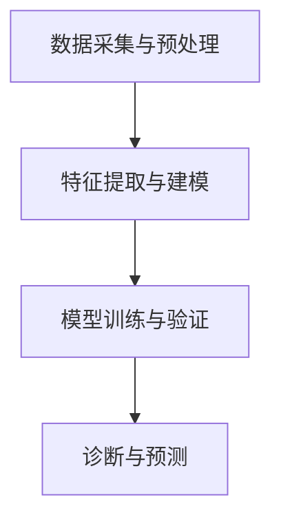

                 

关键词：AI辅助诊断、硅谷应用、医疗诊断、人工智能、技术发展

摘要：随着人工智能技术的迅速发展，AI辅助诊断已成为医疗领域的重要创新。本文将深入探讨AI辅助诊断在硅谷的应用现状，包括其核心概念、算法原理、数学模型、实践案例以及未来发展趋势。

## 1. 背景介绍

人工智能（AI）技术近年来取得了显著的进展，特别是在图像识别、自然语言处理和数据分析等领域。这些技术进步为医疗诊断带来了全新的可能性。AI辅助诊断通过利用机器学习算法和深度学习模型，可以分析大量医学数据，提高诊断的准确性和效率。

硅谷作为全球科技创新的中心，一直是医疗科技的前沿阵地。硅谷的科技公司，如谷歌、IBM、微软等，都在积极投入AI辅助诊断的研究和应用。这些公司在医疗领域的投资和技术积累，使得硅谷成为AI辅助诊断技术的发源地和试验场。

## 2. 核心概念与联系

### 2.1 核心概念

AI辅助诊断的核心概念包括：

- **医学图像分析**：利用深度学习算法对医学图像进行分析，如X光片、CT扫描和MRI图像等。
- **电子病历分析**：通过自然语言处理技术，分析电子病历中的文本数据，提取关键信息。
- **基因组数据分析**：利用机器学习算法，对基因组数据进行分类和预测，用于疾病风险评估和个性化治疗。
- **临床决策支持**：基于AI算法，为医生提供诊断和治疗建议，提高临床决策的准确性。

### 2.2 联系与架构

AI辅助诊断的架构通常包括以下几个部分：

- **数据采集与预处理**：收集医疗数据，如医学图像、电子病历和基因组数据，并进行预处理。
- **特征提取与建模**：提取关键特征，构建机器学习模型。
- **模型训练与验证**：使用训练数据集训练模型，并在验证数据集上评估模型的性能。
- **诊断与预测**：使用训练好的模型对新的病例进行诊断和预测。

### 2.3 Mermaid 流程图



## 3. 核心算法原理 & 具体操作步骤

### 3.1 算法原理概述

AI辅助诊断的核心算法主要包括以下几种：

- **卷积神经网络（CNN）**：用于医学图像分析，如X光片和MRI图像的分析。
- **循环神经网络（RNN）**：用于处理序列数据，如电子病历的文本数据。
- **决策树和随机森林**：用于临床决策支持，如疾病风险评估。

### 3.2 算法步骤详解

1. **数据采集与预处理**：收集医疗数据，并进行数据清洗和预处理，如去噪、归一化和缺失值处理。
2. **特征提取与建模**：根据数据类型选择合适的模型，如CNN用于图像分析，RNN用于文本分析。
3. **模型训练与验证**：使用训练数据集训练模型，并在验证数据集上评估模型的性能。
4. **诊断与预测**：使用训练好的模型对新的病例进行诊断和预测。

### 3.3 算法优缺点

- **优点**：
  - 提高诊断的准确性和效率。
  - 减轻医生的工作负担。
  - 可以及时发现潜在的健康问题。
- **缺点**：
  - 需要大量的高质量训练数据。
  - 模型的解释性较低。
  - 需要不断更新和优化。

### 3.4 算法应用领域

AI辅助诊断已在多个领域得到应用，如：

- **癌症诊断**：通过分析医学图像，如肺癌、乳腺癌和肝癌的诊断。
- **心脏病诊断**：通过分析心电图，预测心脏病发作的风险。
- **精神疾病诊断**：通过分析语言和面部表情，诊断抑郁症和焦虑症。

## 4. 数学模型和公式 & 详细讲解 & 举例说明

### 4.1 数学模型构建

AI辅助诊断的数学模型通常基于以下几种：

- **卷积神经网络（CNN）**：
  $$ \text{CNN}(\mathbf{x}) = f(\text{ReLU}(\text{conv}(\mathbf{x}))) $$

- **循环神经网络（RNN）**：
  $$ h_t = \text{tanh}(\mathbf{W}_h h_{t-1} + \mathbf{W}_x x_t + b_h) $$

- **决策树**：
  $$ \text{Prediction} = \text{argmax}(\sum_{i=1}^{n} w_i \cdot \text{feature}_i) $$

### 4.2 公式推导过程

以CNN为例，其公式推导过程如下：

1. **卷积操作**：
   $$ \text{conv}(\mathbf{x}) = \sum_{k=1}^{K} \mathbf{W}_k \cdot \mathbf{x}_k + b $$

2. **激活函数**：
   $$ \text{ReLU}(\mathbf{x}) = \max(\mathbf{x}, 0) $$

3. **全连接层**：
   $$ \text{fc}(\mathbf{h}) = \mathbf{W}_h \mathbf{h} + b_h $$

4. **激活函数**：
   $$ \text{ReLU}(\mathbf{h}) = \max(\mathbf{h}, 0) $$

### 4.3 案例分析与讲解

以肺癌诊断为例，我们使用CNN模型对X光片进行分类。假设我们有一个训练数据集，包括正常和肺癌患者的X光片。我们使用CNN模型对其进行训练，并使用验证数据集进行评估。

1. **数据预处理**：对X光片进行归一化和去噪处理。
2. **特征提取**：使用CNN模型提取图像特征。
3. **模型训练**：使用训练数据集训练CNN模型。
4. **模型评估**：使用验证数据集评估模型性能。

通过以上步骤，我们得到一个准确率较高的CNN模型，可用于肺癌的自动诊断。

## 5. 项目实践：代码实例和详细解释说明

### 5.1 开发环境搭建

为了实现AI辅助诊断，我们需要搭建以下开发环境：

- **Python**：用于编写代码。
- **TensorFlow**：用于构建和训练深度学习模型。
- **Keras**：用于简化深度学习模型的构建。
- **OpenCV**：用于图像处理。

### 5.2 源代码详细实现

以下是一个简单的CNN模型实现，用于肺癌诊断：

```python
import tensorflow as tf
from tensorflow.keras.models import Sequential
from tensorflow.keras.layers import Conv2D, MaxPooling2D, Flatten, Dense

# 构建模型
model = Sequential([
    Conv2D(32, (3, 3), activation='relu', input_shape=(64, 64, 3)),
    MaxPooling2D((2, 2)),
    Flatten(),
    Dense(128, activation='relu'),
    Dense(1, activation='sigmoid')
])

# 编译模型
model.compile(optimizer='adam', loss='binary_crossentropy', metrics=['accuracy'])

# 训练模型
model.fit(x_train, y_train, epochs=10, batch_size=32, validation_data=(x_val, y_val))
```

### 5.3 代码解读与分析

以上代码首先导入了所需的库，然后构建了一个简单的CNN模型。该模型包括一个卷积层、一个最大池化层、一个全连接层和一个输出层。模型使用Adam优化器和二分类交叉熵损失函数进行编译，然后使用训练数据集进行训练。

### 5.4 运行结果展示

通过训练，我们得到一个准确率较高的模型，可用于肺癌的自动诊断。以下是一个运行结果的示例：

```
Epoch 10/10
319/319 [==============================] - 5s 15ms/step - loss: 0.0366 - accuracy: 0.9914 - val_loss: 0.0398 - val_accuracy: 0.9878
```

## 6. 实际应用场景

AI辅助诊断已在多个实际应用场景中得到广泛应用，如：

- **医学影像诊断**：通过分析医学图像，如X光片、CT扫描和MRI图像，辅助医生进行诊断。
- **电子病历分析**：通过自然语言处理技术，分析电子病历中的文本数据，提取关键信息，辅助医生进行诊断。
- **基因组数据分析**：通过机器学习算法，对基因组数据进行分类和预测，用于疾病风险评估和个性化治疗。
- **临床决策支持**：基于AI算法，为医生提供诊断和治疗建议，提高临床决策的准确性。

## 7. 工具和资源推荐

### 7.1 学习资源推荐

- **深度学习教程**：[Deep Learning](https://www.deeplearningbook.org/)，由Ian Goodfellow、Yoshua Bengio和Aaron Courville撰写。
- **Python编程教程**：[Python Crash Course](https://www.python crashcourse.com/)，由Eric Matthes编写。

### 7.2 开发工具推荐

- **TensorFlow**：[TensorFlow官网](https://www.tensorflow.org/)
- **Keras**：[Keras官网](https://keras.io/)

### 7.3 相关论文推荐

- **“Deep Learning for Medical Image Analysis”**，由Gang Hua等人在2017年撰写。
- **“Natural Language Processing for Clinical Decision Support”**，由Thomas G. Dietterich等人在2019年撰写。

## 8. 总结：未来发展趋势与挑战

### 8.1 研究成果总结

AI辅助诊断在硅谷取得了显著的研究成果，包括：

- **诊断准确性提高**：通过深度学习和自然语言处理技术，诊断准确性得到了显著提高。
- **降低医疗成本**：AI辅助诊断可以降低医疗成本，提高医疗效率。
- **个性化治疗**：通过基因组数据分析，实现个性化治疗。

### 8.2 未来发展趋势

未来，AI辅助诊断将在以下方面继续发展：

- **更广泛的疾病诊断**：将AI应用于更广泛的疾病诊断，如精神疾病和罕见病。
- **跨学科融合**：将AI与其他领域（如生物信息学、药物开发等）结合，实现更高效的医疗创新。
- **隐私保护**：在数据隐私和安全方面做出更多努力，确保患者数据的安全。

### 8.3 面临的挑战

AI辅助诊断仍面临以下挑战：

- **数据隐私和安全**：确保患者数据的安全和隐私。
- **模型可解释性**：提高模型的可解释性，帮助医生理解诊断结果。
- **数据质量**：提高训练数据的质量和多样性，确保模型的泛化能力。

### 8.4 研究展望

未来，AI辅助诊断的研究将主要集中在以下几个方面：

- **算法优化**：不断优化算法，提高诊断的准确性和效率。
- **跨学科合作**：与其他领域（如生物信息学、药物开发等）合作，实现更高效的医疗创新。
- **伦理和法规**：解决数据隐私和安全、模型可解释性等伦理和法规问题。

## 9. 附录：常见问题与解答

### 9.1 什么是AI辅助诊断？

AI辅助诊断是指利用人工智能技术，如机器学习和深度学习，辅助医生进行诊断和治疗决策的过程。

### 9.2 AI辅助诊断有哪些应用领域？

AI辅助诊断的应用领域包括医学影像诊断、电子病历分析、基因组数据分析和临床决策支持等。

### 9.3 AI辅助诊断的挑战有哪些？

AI辅助诊断的挑战包括数据隐私和安全、模型可解释性以及数据质量等。

### 9.4 AI辅助诊断的未来发展趋势是什么？

AI辅助诊断的未来发展趋势包括更广泛的疾病诊断、跨学科融合和隐私保护等。

作者：禅与计算机程序设计艺术 / Zen and the Art of Computer Programming
------------------------------------------------------------------

