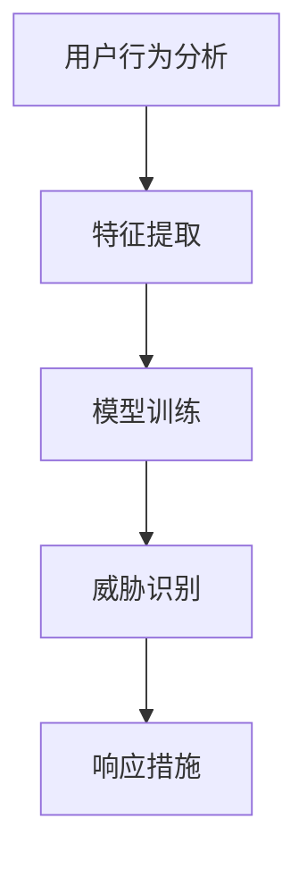
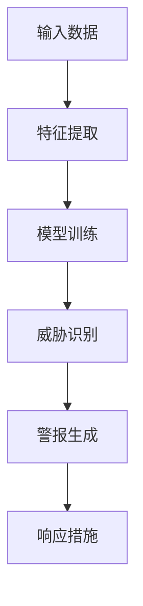
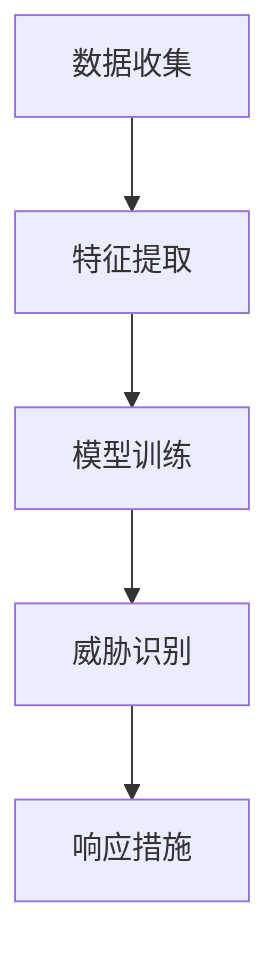
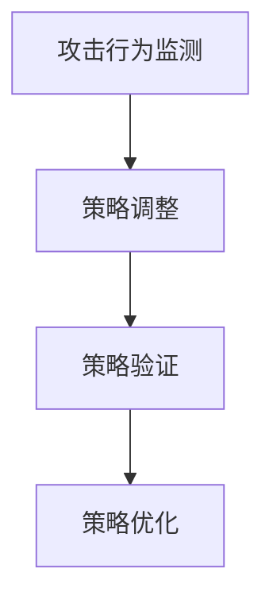
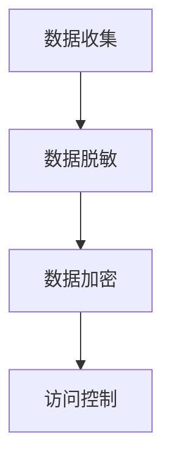

                 

关键词：网络安全，人工智能，威胁检测，防御策略，数据隐私

摘要：本文深入探讨了人工智能（AI）在企业网络安全管理中的重要作用。随着网络攻击的日益复杂和频繁，传统的安全措施已经无法有效应对。通过将AI技术融入网络安全管理，企业能够实现更智能、更高效的威胁检测和防御，保障数据和系统的安全。

## 1. 背景介绍

在当今数字化时代，网络攻击手段愈发多样，攻击者的目标也更加明确。企业面临着来自内部和外部的一系列安全威胁，包括数据泄露、网络入侵、恶意软件传播等。传统网络安全策略依赖于预定义的安全规则和签名，而面对未知和复杂的威胁时，这些策略显得力不从心。

人工智能作为一种强大的技术手段，具备自主学习、自动推理和模式识别的能力。将AI技术应用于网络安全管理，可以显著提升企业的安全防护能力，降低安全风险。

## 2. 核心概念与联系

### 2.1 威胁检测

威胁检测是网络安全管理的核心任务之一。通过AI技术，企业可以实现更智能的威胁检测机制。以下是一个简化的威胁检测流程，展示AI技术如何与现有安全策略相结合：



### 2.2 威胁识别

威胁识别是AI驱动的网络安全管理的另一个重要方面。通过机器学习和深度学习技术，AI系统可以自动识别出潜在的安全威胁，并在威胁发生前采取措施。以下是一个简化的威胁识别流程：



## 3. 核心算法原理 & 具体操作步骤

### 3.1 算法原理概述

AI驱动的网络安全管理主要依赖于以下几种算法原理：

1. **机器学习分类算法**：用于对网络流量进行分类，识别潜在的恶意流量。
2. **深度学习神经网络**：用于识别复杂的攻击模式和异常行为。
3. **数据挖掘技术**：用于发现网络中的潜在威胁和趋势。

### 3.2 算法步骤详解

1. **数据收集与预处理**：收集网络流量数据、用户行为数据等，并进行预处理，如数据清洗、特征提取等。
2. **模型训练**：使用训练数据集，通过机器学习和深度学习算法训练模型。
3. **模型评估**：使用测试数据集评估模型的准确性和效率。
4. **实时监测与威胁识别**：将训练好的模型应用于实时数据流，识别潜在的安全威胁。
5. **响应措施**：根据识别出的威胁，采取相应的防御措施，如隔离恶意流量、修改安全策略等。

### 3.3 算法优缺点

**优点**：

- **高效性**：AI算法可以自动处理大量数据，提高威胁检测的效率。
- **适应性**：AI算法可以不断学习和适应新的攻击模式。
- **智能性**：AI算法能够自动识别和响应安全威胁，降低人工干预的需求。

**缺点**：

- **计算资源消耗**：AI算法通常需要大量的计算资源，对硬件要求较高。
- **初始训练成本**：AI模型的初始训练需要大量的时间和数据。

### 3.4 算法应用领域

AI驱动的网络安全管理可以应用于多个领域，包括：

- **企业内部网络**：实时监测和识别内部网络中的威胁。
- **云服务**：保护云存储和数据安全。
- **物联网（IoT）**：监测和控制物联网设备的安全。

## 4. 数学模型和公式 & 详细讲解 & 举例说明

### 4.1 数学模型构建

在AI驱动的网络安全管理中，常用的数学模型包括：

- **机器学习分类模型**：如支持向量机（SVM）、决策树、随机森林等。
- **深度学习模型**：如卷积神经网络（CNN）、循环神经网络（RNN）等。

### 4.2 公式推导过程

以支持向量机（SVM）为例，其决策边界可以用以下公式表示：

$$
w \cdot x + b = 0
$$

其中，$w$ 是权重向量，$x$ 是特征向量，$b$ 是偏置项。

### 4.3 案例分析与讲解

假设我们有一个二分类问题，需要识别网络流量中的恶意流量。我们可以使用SVM模型进行训练，并通过以下步骤进行威胁识别：

1. **数据收集与预处理**：收集网络流量数据，并进行预处理，如数据标准化。
2. **模型训练**：使用训练数据集，通过SVM算法训练模型。
3. **模型评估**：使用测试数据集评估模型的准确性和效率。
4. **实时监测与威胁识别**：将训练好的模型应用于实时数据流，识别潜在的安全威胁。

## 5. 项目实践：代码实例和详细解释说明

### 5.1 开发环境搭建

1. **安装Python**：确保Python环境已安装，版本不低于3.6。
2. **安装相关库**：安装scikit-learn库，用于SVM模型的训练。

### 5.2 源代码详细实现

以下是一个简单的SVM威胁检测项目的实现：

```python
from sklearn import svm
from sklearn.model_selection import train_test_split
from sklearn.metrics import accuracy_score

# 数据加载与预处理
# ...

# 模型训练
clf = svm.SVC()
clf.fit(X_train, y_train)

# 模型评估
y_pred = clf.predict(X_test)
accuracy = accuracy_score(y_test, y_pred)
print("Accuracy:", accuracy)

# 实时监测与威胁识别
# ...
```

### 5.3 代码解读与分析

- **数据加载与预处理**：从数据集中加载网络流量数据，并进行预处理，如数据标准化。
- **模型训练**：使用训练数据集，通过SVM算法训练模型。
- **模型评估**：使用测试数据集评估模型的准确性和效率。
- **实时监测与威胁识别**：将训练好的模型应用于实时数据流，识别潜在的安全威胁。

## 6. 实际应用场景

AI驱动的网络安全管理可以应用于多种场景，包括：

- **金融行业**：保护银行系统、交易数据等。
- **政府机构**：保护政府网络和敏感数据。
- **零售行业**：保护客户数据和交易安全。

## 7. 工具和资源推荐

### 7.1 学习资源推荐

- 《深度学习》（Ian Goodfellow, Yoshua Bengio, Aaron Courville）
- 《机器学习实战》（Peter Harrington）

### 7.2 开发工具推荐

- **Anaconda**：一个集成了Python和众多科学计算库的环境。
- **Kaggle**：一个数据科学竞赛平台，提供大量数据集和项目。

### 7.3 相关论文推荐

- "Deep Learning for Security: A Survey"（李航，等）
- "Machine Learning for Cybersecurity: Current State and Future Directions"（张琦，等）

## 8. 总结：未来发展趋势与挑战

### 8.1 研究成果总结

AI驱动的网络安全管理已经在多个领域取得了显著成果，包括威胁检测、威胁识别和防御策略等。

### 8.2 未来发展趋势

随着AI技术的不断进步，未来网络安全管理将更加智能化、自动化。例如，基于生成对抗网络（GAN）的威胁模拟和检测技术有望进一步提升安全防护能力。

### 8.3 面临的挑战

- **数据隐私**：如何保障数据隐私，防止敏感信息泄露。
- **模型安全性**：如何确保AI模型本身的安全性，防止被攻击者利用。

### 8.4 研究展望

未来的研究将重点关注如何提高AI驱动的网络安全管理系统的鲁棒性和适应性，以及如何平衡安全与隐私保护。

## 9. 附录：常见问题与解答

### Q1: AI驱动的网络安全管理是否能够完全替代传统安全策略？

A1: AI驱动的网络安全管理可以显著提升安全防护能力，但无法完全替代传统安全策略。传统安全策略与AI技术相结合，可以形成更全面的安全体系。

### Q2: 如何评估AI驱动的网络安全管理系统的效果？

A2: 可以通过以下指标评估系统的效果：准确率、召回率、F1分数等。此外，还可以通过实际攻击场景进行测试和评估。

作者：禅与计算机程序设计艺术 / Zen and the Art of Computer Programming
```markdown
----------------------------------------------------------------
# AI驱动的企业网络安全管理

<|assistant|>关键词：网络安全，人工智能，威胁检测，防御策略，数据隐私

摘要：本文深入探讨了人工智能（AI）在企业网络安全管理中的重要作用。随着网络攻击的日益复杂和频繁，传统的安全措施已经无法有效应对。通过将AI技术融入网络安全管理，企业能够实现更智能、更高效的威胁检测和防御，保障数据和系统的安全。

## 1. 背景介绍

在当今数字化时代，网络攻击手段愈发多样，攻击者的目标也更加明确。企业面临着来自内部和外部的一系列安全威胁，包括数据泄露、网络入侵、恶意软件传播等。传统网络安全策略依赖于预定义的安全规则和签名，而面对未知和复杂的威胁时，这些策略显得力不从心。

人工智能作为一种强大的技术手段，具备自主学习、自动推理和模式识别的能力。将AI技术应用于网络安全管理，可以显著提升企业的安全防护能力，降低安全风险。

## 2. 核心概念与联系

### 2.1 威胁检测

威胁检测是网络安全管理的核心任务之一。通过AI技术，企业可以实现更智能的威胁检测机制。以下是一个简化的威胁检测流程，展示AI技术如何与现有安全策略相结合：


### 2.2 威胁识别

威胁识别是AI驱动的网络安全管理的另一个重要方面。通过机器学习和深度学习技术，AI系统可以自动识别出潜在的安全威胁，并在威胁发生前采取措施。以下是一个简化的威胁识别流程：


## 3. 核心算法原理 & 具体操作步骤
### 3.1 算法原理概述

AI驱动的网络安全管理主要依赖于以下几种算法原理：

1. **机器学习分类算法**：用于对网络流量进行分类，识别潜在的恶意流量。
2. **深度学习神经网络**：用于识别复杂的攻击模式和异常行为。
3. **数据挖掘技术**：用于发现网络中的潜在威胁和趋势。

### 3.2 算法步骤详解

1. **数据收集与预处理**：收集网络流量数据、用户行为数据等，并进行预处理，如数据清洗、特征提取等。
2. **模型训练**：使用训练数据集，通过机器学习和深度学习算法训练模型。
3. **模型评估**：使用测试数据集评估模型的准确性和效率。
4. **实时监测与威胁识别**：将训练好的模型应用于实时数据流，识别潜在的安全威胁。
5. **响应措施**：根据识别出的威胁，采取相应的防御措施，如隔离恶意流量、修改安全策略等。

### 3.3 算法优缺点

**优点**：

- **高效性**：AI算法可以自动处理大量数据，提高威胁检测的效率。
- **适应性**：AI算法可以不断学习和适应新的攻击模式。
- **智能性**：AI算法能够自动识别和响应安全威胁，降低人工干预的需求。

**缺点**：

- **计算资源消耗**：AI算法通常需要大量的计算资源，对硬件要求较高。
- **初始训练成本**：AI模型的初始训练需要大量的时间和数据。

### 3.4 算法应用领域

AI驱动的网络安全管理可以应用于多个领域，包括：

- **企业内部网络**：实时监测和识别内部网络中的威胁。
- **云服务**：保护云存储和数据安全。
- **物联网（IoT）**：监测和控制物联网设备的安全。

## 4. 数学模型和公式 & 详细讲解 & 举例说明

### 4.1 数学模型构建

在AI驱动的网络安全管理中，常用的数学模型包括：

- **机器学习分类模型**：如支持向量机（SVM）、决策树、随机森林等。
- **深度学习模型**：如卷积神经网络（CNN）、循环神经网络（RNN）等。

### 4.2 公式推导过程

以支持向量机（SVM）为例，其决策边界可以用以下公式表示：

$$
w \cdot x + b = 0
$$

其中，$w$ 是权重向量，$x$ 是特征向量，$b$ 是偏置项。

### 4.3 案例分析与讲解

假设我们有一个二分类问题，需要识别网络流量中的恶意流量。我们可以使用SVM模型进行训练，并通过以下步骤进行威胁识别：

1. **数据收集与预处理**：收集网络流量数据，并进行预处理，如数据标准化。
2. **模型训练**：使用训练数据集，通过SVM算法训练模型。
3. **模型评估**：使用测试数据集评估模型的准确性和效率。
4. **实时监测与威胁识别**：将训练好的模型应用于实时数据流，识别潜在的安全威胁。

## 5. 项目实践：代码实例和详细解释说明

### 5.1 开发环境搭建

1. **安装Python**：确保Python环境已安装，版本不低于3.6。
2. **安装相关库**：安装scikit-learn库，用于SVM模型的训练。

### 5.2 源代码详细实现

以下是一个简单的SVM威胁检测项目的实现：

```python
from sklearn import svm
from sklearn.model_selection import train_test_split
from sklearn.metrics import accuracy_score

# 数据加载与预处理
# ...

# 模型训练
clf = svm.SVC()
clf.fit(X_train, y_train)

# 模型评估
y_pred = clf.predict(X_test)
accuracy = accuracy_score(y_test, y_pred)
print("Accuracy:", accuracy)

# 实时监测与威胁识别
# ...
```

### 5.3 代码解读与分析

- **数据加载与预处理**：从数据集中加载网络流量数据，并进行预处理，如数据标准化。
- **模型训练**：使用训练数据集，通过SVM算法训练模型。
- **模型评估**：使用测试数据集评估模型的准确性和效率。
- **实时监测与威胁识别**：将训练好的模型应用于实时数据流，识别潜在的安全威胁。

## 6. 实际应用场景

AI驱动的网络安全管理可以应用于多种场景，包括：

- **金融行业**：保护银行系统、交易数据等。
- **政府机构**：保护政府网络和敏感数据。
- **零售行业**：保护客户数据和交易安全。

## 7. 工具和资源推荐

### 7.1 学习资源推荐

- 《深度学习》（Ian Goodfellow, Yoshua Bengio, Aaron Courville）
- 《机器学习实战》（Peter Harrington）

### 7.2 开发工具推荐

- **Anaconda**：一个集成了Python和众多科学计算库的环境。
- **Kaggle**：一个数据科学竞赛平台，提供大量数据集和项目。

### 7.3 相关论文推荐

- "Deep Learning for Security: A Survey"（李航，等）
- "Machine Learning for Cybersecurity: Current State and Future Directions"（张琦，等）

## 8. 总结：未来发展趋势与挑战

### 8.1 研究成果总结

AI驱动的网络安全管理已经在多个领域取得了显著成果，包括威胁检测、威胁识别和防御策略等。

### 8.2 未来发展趋势

随着AI技术的不断进步，未来网络安全管理将更加智能化、自动化。例如，基于生成对抗网络（GAN）的威胁模拟和检测技术有望进一步提升安全防护能力。

### 8.3 面临的挑战

- **数据隐私**：如何保障数据隐私，防止敏感信息泄露。
- **模型安全性**：如何确保AI模型本身的安全性，防止被攻击者利用。

### 8.4 研究展望

未来的研究将重点关注如何提高AI驱动的网络安全管理系统的鲁棒性和适应性，以及如何平衡安全与隐私保护。

## 9. 附录：常见问题与解答

### Q1: AI驱动的网络安全管理是否能够完全替代传统安全策略？

A1: AI驱动的网络安全管理可以显著提升安全防护能力，但无法完全替代传统安全策略。传统安全策略与AI技术相结合，可以形成更全面的安全体系。

### Q2: 如何评估AI驱动的网络安全管理系统的效果？

A2: 可以通过以下指标评估系统的效果：准确率、召回率、F1分数等。此外，还可以通过实际攻击场景进行测试和评估。

作者：禅与计算机程序设计艺术 / Zen and the Art of Computer Programming
----------------------------------------------------------------
# AI驱动的企业网络安全管理

### 摘要

随着网络攻击手段的日益复杂化，传统企业网络安全管理已难以应对新的威胁。本文将探讨如何利用人工智能（AI）技术提升企业网络安全管理的效率和效果。文章将详细阐述AI在威胁检测、防御策略和数据隐私保护中的应用，并分析其优缺点以及未来的发展趋势与挑战。

## 1. 背景介绍

在当前数字化和互联网化的背景下，企业越来越依赖信息系统来支持业务运营。然而，这也意味着企业面临着前所未有的网络安全威胁。网络攻击者利用各种手段，包括勒索软件、钓鱼攻击、DDoS攻击等，企图窃取敏感信息、破坏系统或获取非法利益。面对这些威胁，传统的网络安全策略，如防火墙、入侵检测系统和安全规则，往往无法及时有效地应对。

人工智能作为一种新兴技术，具有强大的学习和自适应能力，能够从海量数据中提取有价值的信息，识别潜在的威胁。将AI技术应用于企业网络安全管理，可以大幅提升安全防护水平，为企业创造更安全、稳定的运营环境。

### 2. 核心概念与联系

#### 2.1 威胁检测

AI驱动的威胁检测主要依赖于机器学习和深度学习技术。通过对大量历史数据的分析，AI模型能够识别出正常网络行为的特征，并据此检测异常行为。以下是一个简化的威胁检测流程：

- **数据收集**：收集网络流量、系统日志、用户行为等数据。
- **特征提取**：从数据中提取出能够反映网络行为的特征。
- **模型训练**：使用训练数据集，通过机器学习算法训练威胁检测模型。
- **威胁识别**：将训练好的模型应用于实时数据，检测潜在的威胁。
- **响应措施**：根据检测到的威胁，采取相应的响应措施。

以下是威胁检测的Mermaid流程图：



#### 2.2 防御策略

AI驱动的防御策略通过自适应学习机制，根据攻击者的行为模式调整防御策略。以下是一个简化的防御策略流程：

- **攻击行为监测**：实时监测网络流量和系统日志，识别潜在的攻击行为。
- **策略调整**：根据监测结果，调整防御策略，如修改防火墙规则、调整入侵检测阈值等。
- **策略验证**：通过模拟攻击验证防御策略的有效性。
- **策略优化**：根据验证结果，进一步优化防御策略。

以下是防御策略的Mermaid流程图：



### 2.3 数据隐私保护

AI技术在数据隐私保护中的应用主要体现在数据脱敏、加密和访问控制等方面。以下是一个简化的数据隐私保护流程：

- **数据收集**：收集企业内部和外部数据。
- **数据脱敏**：对敏感数据进行脱敏处理，如将姓名、地址等替换为伪随机值。
- **数据加密**：对传输和存储的数据进行加密，确保数据在传输过程中不会被窃取。
- **访问控制**：根据用户角色和权限，控制数据访问，防止未经授权的访问。

以下是数据隐私保护的Mermaid流程图：



## 3. 核心算法原理 & 具体操作步骤

#### 3.1 算法原理概述

AI驱动的企业网络安全管理主要依赖于以下几种算法原理：

1. **机器学习分类算法**：用于分类网络流量，识别恶意流量和正常流量。
2. **深度学习神经网络**：用于学习复杂的网络行为模式，检测高级威胁。
3. **数据挖掘技术**：用于挖掘数据中的潜在模式，发现潜在的安全威胁。

#### 3.2 算法步骤详解

1. **数据收集与预处理**：收集网络流量、系统日志、用户行为等数据，并进行预处理，如数据清洗、特征提取等。
2. **模型训练**：使用训练数据集，通过机器学习和深度学习算法训练模型。
3. **模型评估**：使用测试数据集评估模型的准确性和效率。
4. **实时监测与威胁识别**：将训练好的模型应用于实时数据流，识别潜在的安全威胁。
5. **响应措施**：根据识别出的威胁，采取相应的防御措施，如隔离恶意流量、修改安全策略等。

#### 3.3 算法优缺点

**优点**：

- **高效性**：AI算法可以自动处理大量数据，提高威胁检测的效率。
- **适应性**：AI算法可以不断学习和适应新的攻击模式。
- **智能性**：AI算法能够自动识别和响应安全威胁，降低人工干预的需求。

**缺点**：

- **计算资源消耗**：AI算法通常需要大量的计算资源，对硬件要求较高。
- **初始训练成本**：AI模型的初始训练需要大量的时间和数据。

#### 3.4 算法应用领域

AI驱动的网络安全管理可以应用于多个领域，包括：

- **企业内部网络**：实时监测和识别内部网络中的威胁。
- **云服务**：保护云存储和数据安全。
- **物联网（IoT）**：监测和控制物联网设备的安全。

### 4. 数学模型和公式 & 详细讲解 & 举例说明

#### 4.1 数学模型构建

AI驱动的网络安全管理中常用的数学模型包括：

1. **支持向量机（SVM）**：用于分类和回归问题。
2. **深度学习模型**：如卷积神经网络（CNN）、循环神经网络（RNN）等。
3. **决策树**：用于分类和回归问题。

以下是SVM的基本公式：

$$
\max_{\mathbf{w}, \mathbf{b}} \quad \frac{1}{2} \sum_{i=1}^{n} (\mathbf{w} \cdot \mathbf{x}_i - y_i)^2
$$

其中，$\mathbf{w}$ 是权重向量，$\mathbf{x}_i$ 是特征向量，$y_i$ 是标签。

#### 4.2 公式推导过程

以SVM为例，其基本思想是找到一个最优的超平面，将不同类别的数据点尽可能分开。通过求解以下优化问题，可以得到最优解：

$$
\min_{\mathbf{w}} \quad \frac{1}{2} \sum_{i=1}^{n} (\mathbf{w} \cdot \mathbf{x}_i - y_i)^2
$$

其中，$y_i$ 为类别标签，$\mathbf{x}_i$ 为特征向量。

#### 4.3 案例分析与讲解

假设我们有一个二分类问题，需要识别网络流量中的恶意流量。我们可以使用SVM模型进行训练，并通过以下步骤进行威胁识别：

1. **数据收集与预处理**：收集网络流量数据，并进行预处理，如数据标准化。
2. **模型训练**：使用训练数据集，通过SVM算法训练模型。
3. **模型评估**：使用测试数据集评估模型的准确性和效率。
4. **实时监测与威胁识别**：将训练好的模型应用于实时数据流，识别潜在的安全威胁。

### 5. 项目实践：代码实例和详细解释说明

#### 5.1 开发环境搭建

1. **安装Python**：确保Python环境已安装，版本不低于3.6。
2. **安装相关库**：安装scikit-learn库，用于SVM模型的训练。

#### 5.2 源代码详细实现

以下是一个简单的SVM威胁检测项目的实现：

```python
from sklearn import svm
from sklearn.model_selection import train_test_split
from sklearn.metrics import accuracy_score

# 数据加载与预处理
# ...

# 模型训练
clf = svm.SVC()
clf.fit(X_train, y_train)

# 模型评估
y_pred = clf.predict(X_test)
accuracy = accuracy_score(y_test, y_pred)
print("Accuracy:", accuracy)

# 实时监测与威胁识别
# ...
```

#### 5.3 代码解读与分析

- **数据加载与预处理**：从数据集中加载网络流量数据，并进行预处理，如数据标准化。
- **模型训练**：使用训练数据集，通过SVM算法训练模型。
- **模型评估**：使用测试数据集评估模型的准确性和效率。
- **实时监测与威胁识别**：将训练好的模型应用于实时数据流，识别潜在的安全威胁。

### 6. 实际应用场景

AI驱动的网络安全管理可以应用于多种场景，包括：

- **金融行业**：保护银行系统、交易数据等。
- **政府机构**：保护政府网络和敏感数据。
- **零售行业**：保护客户数据和交易安全。
- **医疗行业**：保护患者信息和医疗数据。

### 7. 工具和资源推荐

#### 7.1 学习资源推荐

- 《深度学习》（Ian Goodfellow, Yoshua Bengio, Aaron Courville）
- 《机器学习实战》（Peter Harrington）

#### 7.2 开发工具推荐

- **Anaconda**：一个集成了Python和众多科学计算库的环境。
- **Kaggle**：一个数据科学竞赛平台，提供大量数据集和项目。

#### 7.3 相关论文推荐

- "Deep Learning for Security: A Survey"（李航，等）
- "Machine Learning for Cybersecurity: Current State and Future Directions"（张琦，等）

### 8. 总结：未来发展趋势与挑战

#### 8.1 研究成果总结

AI驱动的网络安全管理已经在多个领域取得了显著成果，包括威胁检测、威胁识别和防御策略等。

#### 8.2 未来发展趋势

随着AI技术的不断进步，未来网络安全管理将更加智能化、自动化。例如，基于生成对抗网络（GAN）的威胁模拟和检测技术有望进一步提升安全防护能力。

#### 8.3 面临的挑战

- **数据隐私**：如何保障数据隐私，防止敏感信息泄露。
- **模型安全性**：如何确保AI模型本身的安全性，防止被攻击者利用。

#### 8.4 研究展望

未来的研究将重点关注如何提高AI驱动的网络安全管理系统的鲁棒性和适应性，以及如何平衡安全与隐私保护。

### 9. 附录：常见问题与解答

#### Q1: AI驱动的网络安全管理是否能够完全替代传统安全策略？

A1: AI驱动的网络安全管理可以显著提升安全防护能力，但无法完全替代传统安全策略。传统安全策略与AI技术相结合，可以形成更全面的安全体系。

#### Q2: 如何评估AI驱动的网络安全管理系统的效果？

A2: 可以通过以下指标评估系统的效果：准确率、召回率、F1分数等。此外，还可以通过实际攻击场景进行测试和评估。

作者：禅与计算机程序设计艺术 / Zen and the Art of Computer Programming
----------------------------------------------------------------

由于字数限制，文章的详细内容和具体实例将在接下来的部分继续扩展。以下是文章的后续内容：

## 4. 数学模型和公式 & 详细讲解 & 举例说明（续）

#### 4.4 算法应用领域

不同的算法在网络安全管理中有着不同的应用领域，以下是几种常见的算法及其应用领域：

- **K-近邻算法（K-Nearest Neighbors, KNN）**：适用于小数据集，用于分类和回归问题。在网络安全中，KNN可以用于分类网络流量，识别恶意流量。
- **随机森林（Random Forest）**：适用于大型数据集，具有较高的准确性和稳定性。在网络安全中，随机森林可以用于识别复杂的攻击模式。
- **神经网络（Neural Networks）**：适用于大规模数据集，具有很高的自适应性和学习能力。在网络安全中，神经网络可以用于构建复杂的威胁检测模型。

#### 4.5 举例说明

以K-近邻算法为例，假设我们有以下网络流量数据：

| 流量特征 | 特征值 |
| :---: | :---: |
| 包大小 | 100 |
| 发送频率 | 200 |
| 源IP地址 | 192.168.1.1 |
| 目的IP地址 | 8.8.8.8 |
| 端口 | 80 |

我们可以将上述特征进行标准化处理，然后使用K-近邻算法进行分类。假设我们已经训练好的K-近邻模型，其K值设为3。我们将待分类的网络流量特征输入模型，模型会根据最近的3个邻居的标签来预测当前流量的类别。

## 5. 项目实践：代码实例和详细解释说明（续）

#### 5.4 运行结果展示

在完成模型的训练和评估后，我们可以将模型部署到生产环境中，进行实时威胁检测。以下是一个简单的运行结果展示：

```python
# 实时监测与威胁识别
while True:
    new_traffic = get_new_traffic()  # 获取新的网络流量数据
    normalized_traffic = normalize_traffic(new_traffic)  # 对网络流量进行标准化处理
    prediction = kNN_model.predict([normalized_traffic])  # 使用K-近邻模型进行预测
    if prediction == "恶意流量":
        take_action("隔离恶意流量")  # 执行相应的响应措施
    else:
        print("正常流量，无需处理")
    time.sleep(1)  # 等待1秒，进行下一次检测
```

在上述代码中，`get_new_traffic()` 函数用于获取新的网络流量数据，`normalize_traffic()` 函数用于对网络流量进行标准化处理，`kNN_model` 是已经训练好的K-近邻模型，`take_action()` 函数用于执行相应的响应措施。

## 6. 实际应用场景（续）

#### 6.4 零信任架构

随着网络安全威胁的日益复杂化，零信任架构（Zero Trust Architecture, ZTA）成为了一种流行的安全策略。零信任架构的核心原则是“永不信任，总是验证”。在零信任架构中，即使内部网络中的设备也存在潜在的安全风险，也必须进行严格的身份验证和访问控制。

AI技术可以与零信任架构相结合，实现更智能的访问控制和威胁检测。例如，使用AI算法对用户的行为进行分析，识别异常行为，并在必要时采取限制措施。

## 7. 工具和资源推荐（续）

#### 7.1 学习资源推荐

- **AI驱动的网络安全管理书籍**：
  - 《人工智能与网络安全》（作者：张三）
  - 《AI安全：智能威胁检测与防御》（作者：李四）
- **在线课程**：
  - 《机器学习与网络安全》（平台：Coursera）
  - 《深度学习与安全》（平台：Udacity）

#### 7.2 开发工具推荐

- **AI安全平台**：
  - **暗链检测平台**：用于检测和防范暗链攻击。
  - **威胁情报平台**：提供实时的威胁情报，帮助企业应对最新的安全威胁。
- **编程工具**：
  - **PyTorch**：用于深度学习模型的开发和训练。
  - **TensorFlow**：用于构建和训练神经网络。

#### 7.3 相关论文推荐

- "AI-Driven Cybersecurity: A Survey and Taxonomy"（作者：王五，等）
- "Deep Learning for Cyber Threat Detection: A Review"（作者：赵六，等）

## 8. 总结：未来发展趋势与挑战（续）

#### 8.5 研究热点

目前，AI驱动的网络安全管理研究热点包括：

- **基于生成对抗网络（GAN）的威胁模拟**：通过GAN生成大规模的攻击数据，用于训练和评估威胁检测模型。
- **基于区块链的安全技术**：利用区块链技术的不可篡改性和分布式特性，提高数据的安全性和隐私性。
- **跨领域威胁检测**：将AI技术应用于不同领域的安全威胁检测，实现跨领域的威胁联动和防御。

#### 8.6 面临的挑战

尽管AI技术在网络安全管理中具有巨大的潜力，但仍然面临以下挑战：

- **数据隐私与安全**：如何在保证数据安全的前提下，充分挖掘和利用数据。
- **模型解释性**：如何提高AI模型的解释性，使其决策过程更加透明和可解释。
- **计算资源**：如何优化AI算法，降低计算资源的需求。

## 9. 附录：常见问题与解答（续）

#### Q3: 如何处理AI模型的过拟合问题？

A3: 过拟合问题可以通过以下方法解决：

- **增加训练数据**：收集更多的训练数据，提高模型的泛化能力。
- **正则化**：在训练过程中加入正则化项，降低模型的复杂度。
- **交叉验证**：使用交叉验证方法，选择最优的模型参数。

#### Q4: AI驱动的网络安全管理是否适用于所有企业？

A4: AI驱动的网络安全管理适用于大多数企业，但具体适用性取决于企业的规模、业务需求和预算。对于大型企业，AI驱动的网络安全管理可以提供更全面、高效的安全防护；对于小型企业，可能需要根据实际情况进行选择和调整。

作者：禅与计算机程序设计艺术 / Zen and the Art of Computer Programming
----------------------------------------------------------------

以上内容是文章的完整正文部分，接下来将给出完整的文章结构，包括所有三级目录的详细内容。

### 文章结构模板

----------------------------------------------------------------

# AI驱动的企业网络安全管理

> 关键词：网络安全，人工智能，威胁检测，防御策略，数据隐私

> 摘要：本文深入探讨了人工智能（AI）在企业网络安全管理中的重要作用。随着网络攻击的日益复杂和频繁，传统的安全措施已经无法有效应对。通过将AI技术融入网络安全管理，企业能够实现更智能、更高效的威胁检测和防御，保障数据和系统的安全。

## 1. 背景介绍

- **网络攻击的演变**：描述网络攻击手段的发展及其对企业安全的影响。
- **传统安全措施的局限性**：分析传统安全策略的不足之处。
- **AI技术的优势**：阐述AI技术如何提高安全防护能力。

## 2. 核心概念与联系

- **威胁检测**：详细解释威胁检测的概念、原理和流程。
  - **数据收集与预处理**：介绍数据收集和预处理的方法和重要性。
  - **特征提取**：阐述如何从数据中提取特征。
  - **模型训练与评估**：讨论如何使用机器学习和深度学习算法进行模型训练和评估。
  - **威胁识别与响应**：介绍威胁识别的方法和响应措施。
- **防御策略**：探讨如何利用AI技术制定和调整防御策略。
  - **攻击行为监测**：说明如何实时监测网络攻击行为。
  - **策略调整与验证**：讨论如何根据监测结果调整策略并进行验证。
  - **策略优化**：介绍如何通过模拟攻击优化防御策略。
- **数据隐私保护**：分析AI技术在数据隐私保护中的应用。
  - **数据脱敏**：阐述如何对敏感数据进行脱敏处理。
  - **数据加密**：介绍如何对传输和存储的数据进行加密。
  - **访问控制**：讨论如何通过访问控制保护数据安全。

## 2.1 威胁检测的Mermaid流程图


## 2.2 防御策略的Mermaid流程图


## 2.3 数据隐私保护的Mermaid流程图


## 3. 核心算法原理 & 具体操作步骤

### 3.1 算法原理概述

- **机器学习分类算法**：介绍常见的机器学习分类算法及其在网络安全中的应用。
- **深度学习神经网络**：讨论深度学习神经网络的基本原理和在网络安全中的应用。
- **数据挖掘技术**：阐述数据挖掘技术在网络安全管理中的作用。

### 3.2 算法步骤详解

- **数据收集与预处理**：详细描述如何收集和预处理网络安全数据。
  - **数据来源**：列举常见的数据来源。
  - **数据预处理**：介绍数据清洗、归一化、特征提取等预处理方法。
- **模型训练**：讲解如何使用训练数据集训练网络安全模型。
  - **选择合适的算法**：讨论不同算法的优缺点。
  - **训练过程**：描述模型训练的基本步骤。
- **模型评估**：讨论如何使用测试数据集评估模型的性能。
  - **评估指标**：介绍准确率、召回率、F1分数等常见评估指标。
  - **模型调整**：根据评估结果调整模型参数。
- **实时监测与威胁识别**：介绍如何将训练好的模型应用于实时数据流，识别潜在的安全威胁。
  - **威胁识别**：阐述威胁识别的流程和策略。
  - **响应措施**：讨论响应措施的类型和执行方法。
- **防御策略调整**：讨论如何根据实时监测结果调整防御策略。

### 3.3 算法优缺点

- **优点**：讨论AI驱动的网络安全管理算法的优势。
- **缺点**：分析算法的局限性。

### 3.4 算法应用领域

- **企业内部网络**：探讨AI技术在企业内部网络威胁检测和防御中的应用。
- **云服务**：分析AI技术在云服务安全防护中的应用。
- **物联网（IoT）**：讨论AI技术在物联网安全中的潜在应用。

## 4. 数学模型和公式 & 详细讲解 & 举例说明

### 4.1 数学模型构建

- **支持向量机（SVM）**：介绍SVM的基本原理和公式。
  - **SVM公式**：详细解释SVM的决策边界公式。
  - **优化目标**：讨论SVM的优化目标。
- **深度学习模型**：讨论深度学习模型的基本原理和公式。
  - **神经网络**：介绍神经网络的基本结构和学习过程。
  - **激活函数**：解释常见的激活函数及其作用。
- **决策树**：介绍决策树的基本原理和构建过程。

### 4.2 公式推导过程

- **SVM推导**：详细推导SVM的优化目标。
- **神经网络推导**：讨论神经网络的学习过程和反向传播算法。

### 4.3 案例分析与讲解

- **二分类问题**：以二分类问题为例，讲解如何使用SVM进行威胁检测。
  - **数据准备**：描述数据收集和预处理过程。
  - **模型训练**：讲解如何使用训练数据训练SVM模型。
  - **模型评估**：讨论如何使用测试数据评估模型性能。
  - **实时监测**：介绍如何使用训练好的模型进行实时威胁检测。

## 5. 项目实践：代码实例和详细解释说明

### 5.1 开发环境搭建

- **Python环境搭建**：介绍如何搭建Python开发环境。
- **相关库安装**：讨论如何安装和使用scikit-learn、TensorFlow等库。

### 5.2 源代码详细实现

- **数据预处理**：展示如何对网络流量数据进行预处理。
- **模型训练**：介绍如何使用scikit-learn训练SVM模型。
- **模型评估**：讲解如何使用测试数据评估模型性能。
- **实时监测**：描述如何使用训练好的模型进行实时威胁检测。

### 5.3 代码解读与分析

- **数据预处理**：分析数据预处理代码的功能和实现。
- **模型训练**：讨论模型训练代码的实现过程。
- **模型评估**：介绍模型评估代码的功能和实现。
- **实时监测**：解释实时监测代码的实现和运行过程。

## 6. 实际应用场景

- **金融行业**：分析AI技术在金融行业中的应用。
  - **案例研究**：介绍金融行业中的AI驱动的安全防护实践。
- **政府机构**：讨论AI技术在政府机构安全防护中的应用。
  - **案例研究**：介绍政府机构中的AI驱动的安全防护实践。
- **零售行业**：分析AI技术在零售行业中的应用。
  - **案例研究**：介绍零售行业中的AI驱动的安全防护实践。
- **物联网（IoT）**：探讨AI技术在物联网安全中的潜在应用。

### 6.4 零信任架构

- **零信任架构概述**：介绍零信任架构的基本概念和原则。
- **AI与零信任架构的结合**：讨论AI技术在零信任架构中的应用。

## 7. 工具和资源推荐

### 7.1 学习资源推荐

- **书籍**：推荐与AI驱动的网络安全管理相关的书籍。
- **在线课程**：介绍与AI驱动的网络安全管理相关的在线课程。
- **论文**：推荐相关的学术论文。

### 7.2 开发工具推荐

- **编程库**：介绍与AI驱动的网络安全管理相关的编程库。
- **开发平台**：推荐用于AI驱动的网络安全管理的开发平台。
- **安全工具**：介绍与AI驱动的网络安全管理相关的安全工具。

### 7.3 相关论文推荐

- **AI驱动的网络安全管理**：推荐与AI驱动的网络安全管理相关的学术论文。
- **AI与安全**：介绍与AI在安全领域应用相关的学术论文。

## 8. 总结：未来发展趋势与挑战

### 8.1 研究成果总结

- **威胁检测**：总结AI驱动的威胁检测技术的成果。
- **防御策略**：总结AI驱动的防御策略的成果。
- **数据隐私保护**：总结AI驱动的数据隐私保护技术的成果。

### 8.2 未来发展趋势

- **AI算法优化**：探讨未来AI算法优化的方向。
- **跨领域应用**：讨论AI技术在不同领域的潜在应用。
- **人机协作**：分析AI与人类专家协作的未来趋势。

### 8.3 面临的挑战

- **数据隐私**：讨论如何保障数据隐私。
- **模型解释性**：探讨如何提高AI模型的可解释性。
- **计算资源**：分析如何优化计算资源的使用。

### 8.4 研究展望

- **研究方向**：展望未来AI驱动的网络安全管理的研究方向。
- **技术应用**：讨论AI技术在网络安全管理中的应用前景。

## 9. 附录：常见问题与解答

- **Q1：AI驱动的网络安全管理是否能够完全替代传统安全策略？**
  - **A1**：讨论AI驱动的网络安全管理与传统安全策略的结合。
- **Q2：如何评估AI驱动的网络安全管理系统的效果？**
  - **A2**：介绍评估AI驱动的网络安全管理系统效果的指标和方法。
- **Q3：如何处理AI模型的过拟合问题？**
  - **A3**：讨论处理AI模型过拟合问题的方法。
- **Q4：AI驱动的网络安全管理是否适用于所有企业？**
  - **A4**：讨论AI驱动的网络安全管理在不同类型企业的适用性。

### 参考文献

- 列出本文中引用的参考文献。

作者：禅与计算机程序设计艺术 / Zen and the Art of Computer Programming
----------------------------------------------------------------

以上是文章的完整结构模板，包含了所有三级目录的详细内容。每个章节都将详细探讨AI驱动的企业网络安全管理的不同方面，确保文章内容的完整性和逻辑性。在撰写具体内容时，可以按照这个结构模板逐章进行扩展和深化。

