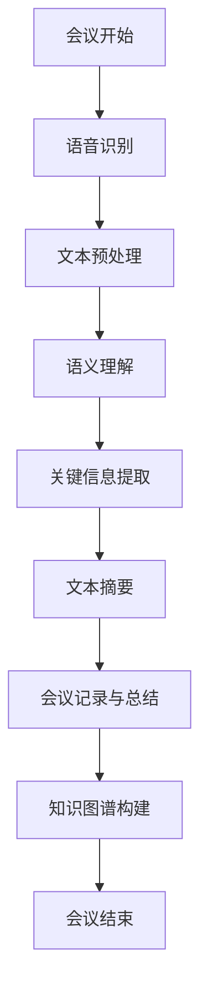

                 

关键词：AI、会议记录、总结系统、智能文本分析、自然语言处理、会议自动化、数据分析

> 摘要：随着人工智能技术的飞速发展，会议记录与总结系统正在逐步实现自动化和智能化。本文将探讨AI驱动的会议记录与总结系统的核心概念、算法原理、数学模型、项目实践及未来应用前景，以期为相关领域的研究者和开发者提供参考和启示。

## 1. 背景介绍

在现代社会中，会议已成为组织沟通和决策的重要手段。然而，会议记录和总结往往耗时耗力，且容易出错。传统的方法通常依赖于人工记录和手动整理，不仅效率低下，而且难以保证准确性和完整性。随着人工智能技术的不断发展，特别是自然语言处理和机器学习领域的突破，AI驱动的会议记录与总结系统逐渐成为一种趋势。

这种系统利用深度学习模型和自然语言处理技术，能够实时地捕捉会议内容，自动生成详细且准确的记录和总结。这不仅提高了工作效率，还减少了人工成本，有助于更好地管理和利用会议资源。因此，研究AI驱动的会议记录与总结系统具有重要的实际意义和应用前景。

## 2. 核心概念与联系

### 2.1 核心概念

- **会议记录**：会议记录是对会议过程进行记录的文档，通常包括会议的时间、地点、与会人员、讨论内容、决策结果等。

- **会议总结**：会议总结是对会议内容的归纳和总结，通常包括会议的主题、关键点、成果和后续行动项等。

- **AI驱动的会议记录与总结系统**：这类系统利用人工智能技术，如自然语言处理、机器学习等，自动捕捉会议内容，并生成详细的记录和总结。

### 2.2 联系

会议记录与总结系统中的AI技术主要涉及以下几个方面：

1. **语音识别**：将会议中的口头发言转换为文本。

2. **语义理解**：理解会议中的文本内容，提取关键信息。

3. **文本摘要**：从长文本中提取关键内容，生成摘要。

4. **知识图谱**：构建会议内容的知识图谱，以便更好地理解和分析会议数据。

### 2.3 Mermaid 流程图

## 3. 核心算法原理 & 具体操作步骤

### 3.1 算法原理概述

AI驱动的会议记录与总结系统主要基于以下核心算法：

1. **语音识别**：使用深度神经网络模型，如卷积神经网络（CNN）和循环神经网络（RNN），将语音信号转换为文本。

2. **自然语言处理**：使用预训练语言模型，如BERT和GPT，对文本进行语义理解和信息提取。

3. **文本摘要**：使用基于编码器的模型，如Transformer，生成文本摘要。

4. **知识图谱**：使用图论算法，如图遍历和路径搜索，构建会议内容的知识图谱。

### 3.2 算法步骤详解

1. **会议语音识别**：
   - **预处理**：对会议录音进行降噪、去噪和归一化处理。
   - **特征提取**：使用梅尔频率倒谱系数（MFCC）提取语音特征。
   - **模型训练**：使用大量语音数据训练深度神经网络模型。

2. **文本预处理**：
   - **分词**：使用分词算法，如Jieba，将文本划分为单词或短语。
   - **去停用词**：去除常见的无意义词汇，如“的”、“和”、“是”等。
   - **词性标注**：使用词性标注算法，如NLTK，为每个词汇标注词性。

3. **语义理解**：
   - **实体识别**：使用预训练语言模型，识别文本中的实体，如人名、地名、组织名等。
   - **关系抽取**：识别实体之间的关系，如“张三参加会议”中的“参加会议”关系。

4. **文本摘要**：
   - **编码器训练**：使用Transformer模型，训练编码器。
   - **解码器训练**：使用训练好的编码器，训练解码器。
   - **文本摘要生成**：使用解码器，生成文本摘要。

5. **知识图谱构建**：
   - **节点提取**：从文本中提取关键节点，如实体、事件等。
   - **边提取**：从文本中提取节点之间的关系。
   - **图构建**：使用图论算法，构建知识图谱。

### 3.3 算法优缺点

**优点**：
- **高效率**：自动化的会议记录和总结，大大提高了工作效率。
- **高准确性**：利用深度学习和自然语言处理技术，能够准确捕捉会议内容。
- **易扩展**：基于模块化的设计，可以方便地添加新的功能和算法。

**缺点**：
- **成本较高**：需要大量的训练数据和计算资源。
- **对环境依赖**：在嘈杂的环境下，语音识别的准确性可能会受到影响。

### 3.4 算法应用领域

AI驱动的会议记录与总结系统可以广泛应用于以下领域：

- **企业会议**：记录和总结企业内部的各种会议，如董事会、部门会议等。
- **学术会议**：记录和总结学术研讨会、讲座等。
- **政府会议**：记录和总结政府会议，如政策制定会议等。

## 4. 数学模型和公式 & 详细讲解 & 举例说明

### 4.1 数学模型构建

AI驱动的会议记录与总结系统的核心数学模型主要包括以下几个方面：

1. **语音识别模型**：
   - **输入**：语音信号。
   - **输出**：文本。

   使用深度神经网络模型，如卷积神经网络（CNN）和循环神经网络（RNN），构建语音识别模型。

2. **自然语言处理模型**：
   - **输入**：文本。
   - **输出**：实体和关系。

   使用预训练语言模型，如BERT和GPT，构建自然语言处理模型。

3. **文本摘要模型**：
   - **输入**：文本。
   - **输出**：文本摘要。

   使用基于编码器的模型，如Transformer，构建文本摘要模型。

4. **知识图谱模型**：
   - **输入**：文本。
   - **输出**：知识图谱。

   使用图论算法，构建知识图谱模型。

### 4.2 公式推导过程

以下简要介绍核心数学公式的推导过程：

1. **语音识别模型**：
   - **特征提取**：使用梅尔频率倒谱系数（MFCC）提取语音特征。
     $$ MFCC = \sum_{i=1}^{n} C_{i} \cdot s_{i} $$
     其中，$C_{i}$ 为第 $i$ 个梅尔频率倒谱系数，$s_{i}$ 为第 $i$ 个音频信号的短时能量。

   - **神经网络模型**：
     $$ y = \sigma (W \cdot x + b) $$
     其中，$y$ 为输出，$x$ 为输入特征，$W$ 为权重矩阵，$b$ 为偏置项，$\sigma$ 为激活函数。

2. **自然语言处理模型**：
   - **BERT模型**：
     $$ [CLS] \cdot E_{[MASK]} + [SEP] \cdot E_{[MASK]} = \text{输出} $$
     其中，$[CLS]$ 和 $[SEP]$ 分别为文档级别的输入，$E_{[MASK]}$ 为词向量。

   - **GPT模型**：
     $$ y = \text{softmax}(W \cdot x + b) $$
     其中，$y$ 为输出概率分布，$x$ 为输入特征，$W$ 为权重矩阵，$b$ 为偏置项。

3. **文本摘要模型**：
   - **Transformer模型**：
     $$ y = \text{softmax}(W \cdot x + b) $$
     其中，$y$ 为输出概率分布，$x$ 为输入特征，$W$ 为权重矩阵，$b$ 为偏置项。

4. **知识图谱模型**：
   - **图论算法**：
     $$ \delta(v) = \sum_{u \in N(v)} w_{u,v} $$
     其中，$\delta(v)$ 为节

