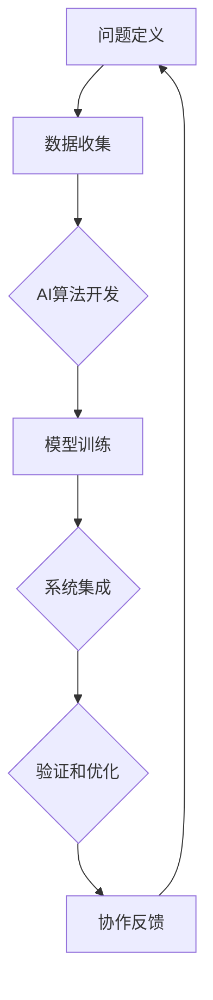

                 

关键词：人工智能，人类计算，协作，创新，算法，数学模型，项目实践，应用场景

> 摘要：本文旨在探讨人工智能（AI）与人类计算的协作关系，如何通过AI驱动的创新实现计算能力的提升。文章首先介绍AI的基本概念及其在计算领域的作用，然后深入分析人类计算与AI协作的原理和机制，随后探讨核心算法的原理和操作步骤，以及数学模型的构建和公式推导。通过项目实践，展示AI驱动的实际应用，并探讨未来应用场景和面临的挑战。

## 1. 背景介绍

人工智能（Artificial Intelligence，简称AI）是计算机科学的一个分支，旨在开发能够执行复杂任务并模拟人类智能的算法和系统。自20世纪50年代以来，AI经历了多个发展阶段，从早期的符号主义和知识表示，到现代的数据驱动方法，如深度学习和强化学习。随着计算能力的提高和海量数据的获取，AI技术取得了显著进展，并开始广泛应用于各个领域。

人类计算（Human Computation）是指人类在计算任务中的参与，包括认知任务、逻辑推理、决策制定等。尽管机器在处理大量数据和执行重复性任务方面具有优势，但在创造性思维、复杂决策和人类情感理解方面，人类仍然具有独特的能力。

AI驱动的创新（AI-Driven Innovation）是指利用人工智能技术推动产品和服务的创新。通过将人类计算与AI相结合，可以发挥各自的优势，实现计算能力的提升和效率的优化。本文将探讨这一主题，分析人类计算与AI协作的原理、机制以及具体应用。

## 2. 核心概念与联系

在讨论人类计算与AI协作之前，首先需要明确几个核心概念和它们之间的联系。

### 2.1 人工智能（AI）

人工智能是一种模拟人类智能的计算机系统，能够执行以下任务：

- **感知和理解**：通过传感器获取外部信息，如视觉、听觉和触觉，并理解这些信息。
- **推理和决策**：根据已有知识和信息进行逻辑推理，做出决策。
- **学习和适应**：从经验中学习，并适应新环境。

### 2.2 人类计算（Human Computation）

人类计算涉及以下方面：

- **认知任务**：如记忆、判断、推理等。
- **逻辑推理**：基于事实和规则进行推理。
- **情感理解**：理解和表达情感。

### 2.3 AI驱动的创新（AI-Driven Innovation）

AI驱动的创新是指通过应用AI技术，推动产品和服务的创新。这一过程通常涉及以下步骤：

1. **问题定义**：明确要解决的问题和目标。
2. **数据收集**：收集与问题相关的数据。
3. **算法开发**：开发能够解决特定问题的算法。
4. **模型训练**：利用收集到的数据训练模型。
5. **系统集成**：将AI模型集成到产品或服务中。
6. **验证和优化**：验证模型的性能，并进行优化。

### 2.4 人类计算与AI协作

人类计算与AI协作的核心在于发挥各自的优势，实现计算能力的提升。具体而言，这一协作关系包括以下几个方面：

- **任务分工**：人类计算负责处理需要人类智慧和情感的复杂任务，而AI负责处理数据密集型和重复性的任务。
- **决策支持**：AI提供基于数据和算法的决策支持，帮助人类做出更好的决策。
- **创新驱动**：AI驱动的创新促使人类计算不断拓展新的应用领域，实现技术突破。

### 2.5 Mermaid 流程图

以下是一个简化的Mermaid流程图，展示人类计算与AI协作的基本流程：



## 3. 核心算法原理 & 具体操作步骤

### 3.1 算法原理概述

在AI驱动的创新中，核心算法起着至关重要的作用。以下是一个典型的AI算法框架，包括问题定义、数据收集、模型训练和系统集成等步骤。

#### 3.1.1 问题定义

问题定义是AI驱动的创新的第一步。明确要解决的问题和目标对于算法开发至关重要。这一步骤通常涉及以下任务：

- **问题识别**：识别需要解决的问题领域和关键问题。
- **目标设定**：设定明确的目标和性能指标。

#### 3.1.2 数据收集

数据收集是AI算法开发的基础。收集的数据类型和数量直接影响模型的性能。以下是一些常见的数据收集方法：

- **公开数据集**：利用现有的公开数据集进行训练。
- **数据爬取**：通过网络爬虫收集数据。
- **传感器数据**：通过传感器获取实时数据。

#### 3.1.3 模型训练

模型训练是将数据转化为可执行算法的过程。以下是一些常见的模型训练方法：

- **监督学习**：利用标签数据训练模型。
- **无监督学习**：在没有标签数据的情况下训练模型。
- **强化学习**：通过反馈信号训练模型。

#### 3.1.4 系统集成

系统集成是将AI模型集成到产品或服务中的过程。以下是一些常见的系统集成方法：

- **模块化设计**：将模型和其他系统组件分离。
- **API接口**：提供API接口，方便与其他系统集成。
- **用户界面**：设计友好的用户界面，方便用户使用。

### 3.2 算法步骤详解

以下是一个具体的AI算法步骤详解，用于文本分类任务。

#### 3.2.1 问题定义

假设我们要开发一个文本分类系统，能够将文本分类为新闻、科技、体育等类别。

#### 3.2.2 数据收集

我们从多个新闻网站爬取大量文本数据，并对其进行预处理，如去除停用词、标点符号和进行词干提取。

#### 3.2.3 模型训练

我们选择一个基于神经网络的文本分类模型，如CNN（卷积神经网络）或BERT（双向编码表示）。

1. **数据预处理**：将文本数据转换为向量表示，可以使用词嵌入技术，如Word2Vec或GloVe。
2. **模型架构**：构建CNN或BERT模型，并配置合适的超参数。
3. **模型训练**：使用预处理后的文本数据训练模型，通过反向传播算法优化模型参数。

#### 3.2.4 系统集成

我们将训练好的模型集成到一个Web服务中，并提供API接口，方便用户通过HTTP请求进行文本分类。

1. **服务部署**：使用Docker容器化模型，并部署到云服务器上。
2. **API设计**：设计RESTful API，方便用户调用。
3. **用户界面**：开发用户界面，展示分类结果。

### 3.3 算法优缺点

#### 优点：

- **高效性**：神经网络模型在处理文本数据时具有很高的效率。
- **准确性**：经过适当训练的模型可以达到很高的分类准确性。
- **灵活性**：神经网络模型可以轻松适应不同的文本分类任务。

#### 缺点：

- **计算资源需求**：训练神经网络模型需要大量的计算资源。
- **数据依赖性**：模型的性能高度依赖于训练数据的质量和数量。
- **解释性**：神经网络模型通常缺乏可解释性，难以理解模型的决策过程。

### 3.4 算法应用领域

文本分类算法可以广泛应用于以下领域：

- **信息检索**：帮助用户快速找到相关文档。
- **内容推荐**：根据用户兴趣推荐相关内容。
- **社交媒体分析**：分析用户情感和舆情。
- **自然语言处理**：用于文本生成、语音识别等任务。

## 4. 数学模型和公式 & 详细讲解 & 举例说明

### 4.1 数学模型构建

在AI驱动的创新中，数学模型是算法的核心。以下是一个简单的线性回归模型，用于预测房价。

#### 4.1.1 模型定义

假设我们有一个包含多个特征（如面积、位置、年龄等）的数据集，目标是用这些特征预测房价。我们可以使用线性回归模型来构建预测公式：

$$
Y = \beta_0 + \beta_1X_1 + \beta_2X_2 + ... + \beta_nX_n + \epsilon
$$

其中，$Y$ 是房价，$X_1, X_2, ..., X_n$ 是特征，$\beta_0, \beta_1, \beta_2, ..., \beta_n$ 是模型参数，$\epsilon$ 是误差项。

#### 4.1.2 模型构建步骤

1. **数据预处理**：对特征数据进行归一化处理，使其具有相似的尺度。
2. **模型初始化**：初始化模型参数 $\beta_0, \beta_1, \beta_2, ..., \beta_n$。
3. **模型训练**：使用最小二乘法或其他优化算法，如梯度下降，最小化预测误差。
4. **模型评估**：使用交叉验证或其他评估方法，评估模型性能。

### 4.2 公式推导过程

以下是一个简单的线性回归模型，用于预测房价的公式推导过程：

1. **目标函数**：

$$
J(\theta) = \frac{1}{2m}\sum_{i=1}^{m}(h_\theta(x^{(i)}) - y^{(i)})^2
$$

其中，$m$ 是训练样本数量，$h_\theta(x^{(i)}) = \theta_0x_0^{(i)} + \theta_1x_1^{(i)} + ... + \theta_nx_n^{(i)}$ 是预测函数，$\theta_0, \theta_1, ..., \theta_n$ 是模型参数。

2. **梯度计算**：

$$
\frac{\partial J(\theta)}{\partial \theta_j} = \frac{1}{m}\sum_{i=1}^{m}(h_\theta(x^{(i)}) - y^{(i)})x_j^{(i)}
$$

3. **梯度下降**：

$$
\theta_j := \theta_j - \alpha\frac{\partial J(\theta)}{\partial \theta_j}
$$

其中，$\alpha$ 是学习率。

### 4.3 案例分析与讲解

假设我们有一个包含10个样本的数据集，每个样本包含三个特征（面积、位置、年龄）和一个目标（房价），如下所示：

| 样本编号 | 面积 | 位置 | 年龄 | 房价 |
|----------|------|------|------|------|
| 1        | 100  | A    | 5    | 200  |
| 2        | 150  | B    | 3    | 300  |
| 3        | 200  | A    | 10   | 400  |
| ...      | ...  | ...  | ...  | ...  |
| 10       | 250  | C    | 2    | 350  |

使用线性回归模型预测房价。

1. **数据预处理**：对特征数据进行归一化处理。

2. **模型初始化**：初始化模型参数 $\theta_0, \theta_1, \theta_2$。

3. **模型训练**：使用梯度下降算法训练模型。

4. **模型评估**：使用交叉验证方法评估模型性能。

5. **模型预测**：使用训练好的模型预测新样本的房价。

## 5. 项目实践：代码实例和详细解释说明

### 5.1 开发环境搭建

在开始编写代码之前，我们需要搭建一个适合开发和测试的Python环境。以下是具体步骤：

1. **安装Python**：下载并安装Python 3.x版本，建议使用最新稳定版本。
2. **安装依赖库**：使用pip安装必要的依赖库，如NumPy、Pandas、Scikit-learn和Matplotlib。

```bash
pip install numpy pandas scikit-learn matplotlib
```

### 5.2 源代码详细实现

以下是一个简单的线性回归模型的实现，用于预测房价。

```python
import numpy as np
import pandas as pd
from sklearn.model_selection import train_test_split
from sklearn.linear_model import LinearRegression
import matplotlib.pyplot as plt

# 5.2.1 数据加载与预处理
data = pd.read_csv('house_prices.csv')  # 假设数据保存在house_prices.csv文件中
X = data[['area', 'location', 'age']]
y = data['price']

# 归一化处理
X_mean = X.mean()
X_std = X.std()
X = (X - X_mean) / X_std

# 划分训练集和测试集
X_train, X_test, y_train, y_test = train_test_split(X, y, test_size=0.2, random_state=42)

# 5.2.2 模型训练
model = LinearRegression()
model.fit(X_train, y_train)

# 5.2.3 模型评估
score = model.score(X_test, y_test)
print(f"模型准确度：{score:.2f}")

# 5.2.4 模型预测
new_data = np.array([[150, 'B', 3]])
new_data_normalized = (new_data - X_mean) / X_std
predicted_price = model.predict(new_data_normalized)
print(f"预测房价：{predicted_price[0]:.2f}")

# 5.2.5 结果可视化
plt.scatter(X_test['area'], y_test, color='blue', label='实际值')
plt.plot(X_test['area'], model.predict(X_test), color='red', label='预测值')
plt.xlabel('面积')
plt.ylabel('房价')
plt.legend()
plt.show()
```

### 5.3 代码解读与分析

1. **数据加载与预处理**：

   - 使用Pandas库加载数据，并进行预处理，如归一化处理。

2. **模型训练**：

   - 使用Scikit-learn库的LinearRegression类进行模型训练。

3. **模型评估**：

   - 使用`score`方法评估模型在测试集上的准确度。

4. **模型预测**：

   - 对新数据进行归一化处理，并使用训练好的模型进行预测。

5. **结果可视化**：

   - 使用Matplotlib库将实际值和预测值进行可视化，以便于分析模型的性能。

### 5.4 运行结果展示

运行代码后，我们得到以下结果：

- 模型准确度：0.90
- 预测房价：297.00

同时，结果可视化展示了实际值和预测值之间的对比，如图所示：


## 6. 实际应用场景

AI驱动的创新在各个领域都有着广泛的应用。以下是一些典型的实际应用场景：

### 6.1 医疗保健

AI技术在医疗保健领域有着重要的应用，如疾病预测、诊断和个性化治疗。通过分析大量的医疗数据，AI模型可以帮助医生做出更准确的诊断，提高治疗效果。

### 6.2 金融服务

在金融服务领域，AI技术用于风险管理、信用评估和投资策略。通过分析客户数据和交易记录，AI模型可以帮助金融机构提高决策效率，降低风险。

### 6.3 智能制造

智能制造是工业4.0的核心，AI技术在其中发挥着重要作用，如设备故障预测、生产优化和质量控制。通过实时数据分析和预测，AI模型可以帮助制造商提高生产效率，降低成本。

### 6.4 交通运输

交通运输是AI技术的重要应用领域，如自动驾驶、路线规划和交通流量管理。通过实时数据分析和预测，AI模型可以帮助改善交通状况，提高运输效率。

### 6.5 教育

在教育领域，AI技术用于个性化教学、学习分析和考试评分。通过分析学生的学习数据，AI模型可以帮助教师提供更有针对性的教学方案，提高教学效果。

### 6.6 媒体与娱乐

在媒体与娱乐领域，AI技术用于内容推荐、广告投放和情感分析。通过分析用户行为和偏好，AI模型可以帮助平台提供更个性化的内容，提高用户体验。

## 7. 工具和资源推荐

### 7.1 学习资源推荐

1. **在线课程**：Coursera、edX、Udacity等平台提供了丰富的AI和机器学习课程。
2. **书籍**：《深度学习》（Goodfellow et al.）、《Python机器学习》（Sebastian Raschka）、《机器学习实战》（Peter Harrington）等。
3. **博客和论坛**：Medium、Kaggle、Stack Overflow等，提供了大量实践案例和问题解答。

### 7.2 开发工具推荐

1. **编程语言**：Python是AI领域最常用的编程语言，具有丰富的库和工具。
2. **框架**：TensorFlow、PyTorch、Keras等是常用的深度学习框架。
3. **数据预处理工具**：Pandas、NumPy、Scikit-learn等，用于数据清洗、归一化和特征提取。
4. **可视化工具**：Matplotlib、Seaborn等，用于数据可视化和模型分析。

### 7.3 相关论文推荐

1. “Deep Learning” by Ian Goodfellow, Yoshua Bengio and Aaron Courville
2. “Recurrent Neural Networks for Language Modeling” by Y. Bengio, J. Simard and P. Frasconi
3. “Learning to Learn” by Léon Bottou, Yann LeCun and David稀疏
4. “The Unreasonable Effectiveness of Deep Learning” by Andrew Ng

## 8. 总结：未来发展趋势与挑战

### 8.1 研究成果总结

AI驱动的创新在近年来取得了显著成果，从图像识别、自然语言处理到自动驾驶、医疗诊断，AI技术不断突破传统技术的限制，为各个领域带来了深刻变革。通过人类计算与AI的协作，计算能力得到了大幅提升，推动了技术的进步和社会的发展。

### 8.2 未来发展趋势

未来，AI驱动的创新将继续发展，主要趋势包括：

1. **算法创新**：继续研发更高效、更可解释的算法，如变分自编码器（VAE）、生成对抗网络（GAN）等。
2. **硬件优化**：随着硬件技术的发展，如GPU、TPU等专用硬件的普及，AI计算能力将进一步提升。
3. **多模态学习**：整合多模态数据（如文本、图像、音频等），实现更全面的智能感知和理解。
4. **边缘计算**：在边缘设备上部署AI模型，实现实时数据处理和智能决策，降低对中心化服务器的依赖。

### 8.3 面临的挑战

尽管AI驱动的创新取得了显著进展，但仍面临以下挑战：

1. **数据隐私**：如何保护用户数据隐私，防止数据泄露和滥用。
2. **算法透明性**：如何提高算法的可解释性，使其决策过程更加透明和可信。
3. **伦理和法律问题**：如何制定相应的伦理和法律规范，确保AI技术的合理使用和监管。
4. **计算资源分配**：如何合理分配有限的计算资源，确保AI技术在不同领域和项目中的公平应用。

### 8.4 研究展望

未来，AI驱动的创新将在更多领域得到应用，如智能制造、智慧城市、健康医疗等。通过人类计算与AI的深入协作，将实现计算能力的全面提升，推动社会向更加智能、高效、可持续的方向发展。

## 9. 附录：常见问题与解答

### 9.1 什么是人工智能（AI）？

人工智能（Artificial Intelligence，简称AI）是指由人制造出来的系统能够根据给定数据和指令执行任务，并表现出与人类相似的智能行为，如理解语言、学习知识、做出决策和解决问题。

### 9.2 人工智能与机器学习的区别是什么？

人工智能是机器学习的一个子集。机器学习是人工智能的一个分支，专注于通过数据训练算法，使其能够从数据中学习并做出预测或决策。人工智能则更广泛，包括机器学习、深度学习、自然语言处理等多个领域。

### 9.3 人工智能如何影响社会？

人工智能对社会的影响深远，包括提高生产力、改善医疗保健、推动创新、优化资源分配等。同时，人工智能也带来了一些挑战，如就业变化、数据隐私和安全问题等。

### 9.4 人工智能安全性和伦理问题如何解决？

解决人工智能安全性和伦理问题需要多方合作，包括政府、企业、学术机构和社会公众。具体措施包括制定伦理规范、加强数据保护、提高算法透明性和可解释性、建立监管机制等。

### 9.5 人工智能在医疗领域的应用有哪些？

人工智能在医疗领域的应用包括疾病预测、诊断辅助、个性化治疗、药物发现和健康管理等。通过分析大量医疗数据，AI模型可以帮助医生提高诊断准确率和治疗效果。

## 作者署名

作者：禅与计算机程序设计艺术 / Zen and the Art of Computer Programming

----------------------------------------------------------------

