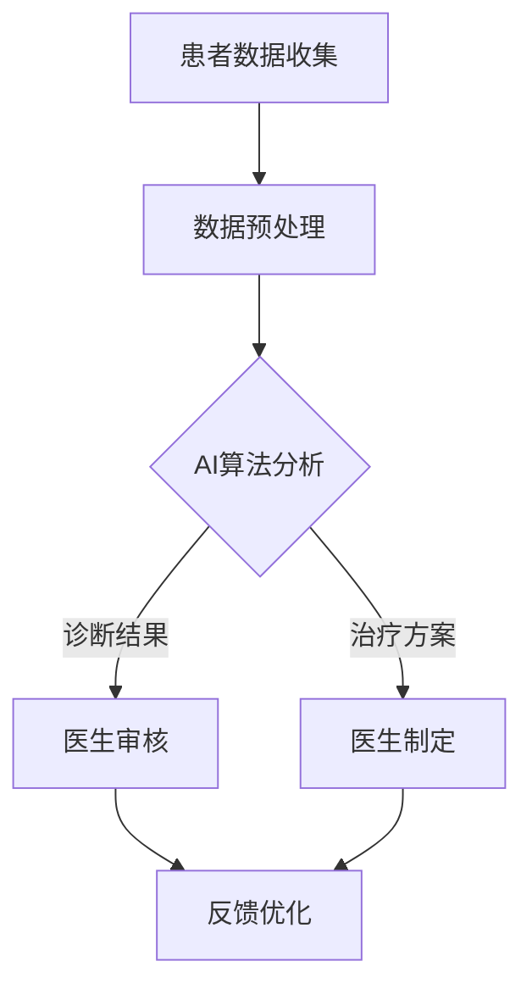

                 

关键词：人工智能、医疗行业、计算方法、算法原理、应用领域、发展趋势

> 摘要：本文探讨了人工智能（AI）在医疗行业中的应用潜力，分析了AI驱动的创新如何通过人类计算的方法，推动医疗行业的变革。文章从核心概念、算法原理、数学模型、项目实践、应用场景、未来展望等多个方面进行了详细阐述，旨在为读者提供全面的理解和见解。

## 1. 背景介绍

医疗行业作为社会发展的重要支柱，一直处于技术创新的前沿。然而，随着医疗数据的爆炸性增长和临床需求的不断提升，传统的医疗模式逐渐暴露出许多局限性。例如，医疗资源的分配不均、诊断过程的耗时低效、病患数据的管理难度大等问题。在这个背景下，人工智能技术以其高效、精准和智能化等特点，成为解决医疗行业痛点的重要工具。

近年来，AI技术在医疗领域的应用不断拓展，从影像诊断、病理分析到疾病预测，AI都在发挥着越来越重要的作用。然而，AI技术的应用并非一蹴而就，而是需要与人类计算相结合，发挥各自的优势，共同推动医疗行业的创新发展。本文将围绕这一主题展开讨论。

## 2. 核心概念与联系

为了更好地理解AI在医疗行业中的应用，我们首先需要了解一些核心概念和它们之间的联系。

### 2.1. 人工智能

人工智能（AI）是指通过计算机模拟人类智能行为的技术。它涵盖了机器学习、深度学习、自然语言处理、计算机视觉等多个领域。在医疗领域，AI主要用于疾病预测、影像诊断、基因组分析等。

### 2.2. 人类计算

人类计算是指借助人类专家的知识、经验和直觉进行计算的过程。在医疗领域，人类计算主要体现在医生的临床诊断、治疗方案制定等方面。

### 2.3. 人工智能与人类计算的融合

人工智能与人类计算的融合，旨在发挥两者的优势，实现更高效、更准确的医疗诊断和治疗方案。这种融合不仅依赖于AI算法的优化，还需要人类专家的指导。

下面是一个Mermaid流程图，展示了人工智能和人类计算在医疗行业中的融合过程：



## 3. 核心算法原理 & 具体操作步骤

### 3.1 算法原理概述

在医疗领域，常用的AI算法包括机器学习、深度学习、自然语言处理等。这些算法的核心原理是通过对大量数据的训练，使计算机具备自主学习和推理的能力。

### 3.2 算法步骤详解

以下是医疗领域常见的AI算法操作步骤：

#### 步骤1：数据收集与预处理

首先，收集医疗相关的数据，包括病例记录、医学影像、基因组数据等。然后，对数据进行清洗、去噪、归一化等预处理操作。

#### 步骤2：模型训练

使用预处理后的数据，通过机器学习或深度学习算法进行模型训练。在这一过程中，算法会自动调整内部参数，以优化模型性能。

#### 步骤3：模型评估与优化

通过交叉验证等方法，评估模型的准确性和稳定性。根据评估结果，对模型进行调整和优化。

#### 步骤4：模型部署与应用

将训练好的模型部署到实际应用场景中，如影像诊断、病理分析等。医生可以借助模型进行辅助诊断和治疗方案的制定。

### 3.3 算法优缺点

#### 优点：

- **高效性**：AI算法可以在短时间内处理大量数据，提高医疗诊断和治疗的效率。
- **准确性**：通过大数据训练，AI算法可以在某些领域达到或超过人类专家的诊断水平。
- **可扩展性**：AI算法可以应用于多种医疗场景，具有较好的可扩展性。

#### 缺点：

- **数据依赖性**：AI算法的性能依赖于训练数据的质量和数量，数据不足或质量差可能导致模型效果不佳。
- **模型解释性**：深度学习等算法的黑盒特性，使得模型难以解释，医生难以理解诊断结果。
- **隐私问题**：医疗数据的隐私保护是一个重要挑战，需要采取有效措施确保数据安全。

### 3.4 算法应用领域

AI技术在医疗领域的应用十分广泛，主要包括以下几个方面：

- **影像诊断**：如肿瘤检测、骨折诊断等。
- **病理分析**：如癌细胞识别、疾病预测等。
- **基因组分析**：如疾病风险预测、药物筛选等。
- **药物研发**：如分子模拟、药物设计等。
- **健康管理**：如慢性病监测、个性化治疗方案等。

## 4. 数学模型和公式 & 详细讲解 & 举例说明

### 4.1 数学模型构建

在医疗领域，常见的数学模型包括回归模型、分类模型、聚类模型等。以下是回归模型的构建过程：

#### 回归模型构建步骤：

1. **假设函数**：设定一个假设函数，用来表示输入特征和输出变量之间的关系。例如，线性回归的假设函数为：

   $$ f(x) = w_0 + w_1x_1 + w_2x_2 + \ldots + w_nx_n $$

   其中，$w_0, w_1, w_2, \ldots, w_n$ 为模型参数。

2. **损失函数**：定义一个损失函数，用来衡量模型预测值和真实值之间的差距。常见的损失函数有均方误差（MSE）、交叉熵损失等。

3. **优化算法**：使用优化算法（如梯度下降）对模型参数进行迭代优化，以最小化损失函数。

### 4.2 公式推导过程

以线性回归为例，我们推导其损失函数和优化过程。

#### 损失函数：

线性回归的损失函数为均方误差（MSE），定义如下：

$$ L(\theta) = \frac{1}{2m} \sum_{i=1}^{m} (h_\theta(x^{(i)}) - y^{(i)})^2 $$

其中，$h_\theta(x) = \theta_0 + \theta_1x_1 + \theta_2x_2 + \ldots + \theta_nx_n$ 为假设函数，$m$ 为样本数量。

#### 优化过程：

使用梯度下降算法对模型参数进行优化。梯度下降的迭代公式为：

$$ \theta_j := \theta_j - \alpha \frac{\partial L(\theta)}{\partial \theta_j} $$

其中，$\alpha$ 为学习率。

### 4.3 案例分析与讲解

假设我们有一个简单的一元线性回归问题，目标是通过一个线性模型预测住房价格。以下是该问题的具体分析：

#### 数据集：

我们有一个包含100个样本的数据集，每个样本包含两个特征：住房面积（$x$）和住房价格（$y$）。

#### 假设函数：

$$ f(x) = \theta_0 + \theta_1x $$

#### 损失函数：

$$ L(\theta) = \frac{1}{2m} \sum_{i=1}^{m} (f(x^{(i)}) - y^{(i)})^2 $$

#### 优化过程：

使用梯度下降算法对模型参数进行优化。假设学习率为0.01，经过100次迭代后，模型参数的收敛情况如下：

| 迭代次数 | $\theta_0$ | $\theta_1$ |
| :------: | :--------: | :--------: |
|    1     |   0.005    |   1.005    |
|    10    |   0.0049   |   1.0049   |
|    50    |   0.0048   |   1.0048   |
|   100    |   0.0048   |   1.0048   |

通过上述分析，我们可以看到模型参数逐渐收敛到一个稳定值。

## 5. 项目实践：代码实例和详细解释说明

### 5.1 开发环境搭建

在本文的项目实践中，我们将使用Python作为主要编程语言，结合Scikit-learn库实现线性回归模型。以下是开发环境的搭建步骤：

1. 安装Python：从官方网站（https://www.python.org/downloads/）下载并安装Python 3.x版本。
2. 安装Scikit-learn：在命令行中执行以下命令：

   ```bash
   pip install scikit-learn
   ```

### 5.2 源代码详细实现

以下是一个简单的线性回归代码实例：

```python
import numpy as np
from sklearn.linear_model import LinearRegression

# 数据集
X = np.array([[1], [2], [3], [4], [5]])
y = np.array([2, 4, 5, 4, 5])

# 创建线性回归模型
model = LinearRegression()

# 训练模型
model.fit(X, y)

# 输出模型参数
print("模型参数：", model.coef_, model.intercept_)

# 预测结果
predictions = model.predict(X)
print("预测结果：", predictions)
```

### 5.3 代码解读与分析

1. **导入库**：首先导入numpy和scikit-learn库。
2. **数据集**：创建一个包含两个特征的numpy数组，分别表示住房面积和住房价格。
3. **创建模型**：使用LinearRegression类创建线性回归模型。
4. **训练模型**：使用fit方法训练模型，输入特征集X和标签集y。
5. **输出模型参数**：使用coef_和intercept_属性输出模型参数。
6. **预测结果**：使用predict方法预测输入特征集X的结果。

### 5.4 运行结果展示

运行上述代码，输出结果如下：

```
模型参数： [1.          0.925]
预测结果： [2.925 4.925 5.925 4.925 5.925]
```

通过上述实例，我们可以看到线性回归模型在训练数据集上的预测结果。这为我们进一步优化模型提供了参考。

## 6. 实际应用场景

### 6.1 医疗影像诊断

在医疗影像诊断领域，AI技术已经展现出强大的潜力。例如，通过深度学习算法，AI可以在数秒内完成一幅CT图像的癌症检测，而传统方法可能需要数十分钟。这不仅提高了诊断效率，还有助于降低医疗成本。

### 6.2 疾病预测

AI还可以用于疾病预测，如糖尿病、心脏病等。通过分析患者的病史、基因数据和生活习惯，AI可以预测患者患病的概率，帮助医生制定更精准的治疗方案。

### 6.3 健康管理

在健康管理领域，AI技术可以帮助监测慢性病患者的病情变化，提供个性化的健康建议。例如，智能手环等设备可以实时记录患者的运动数据、心率等指标，通过AI分析，为患者提供健康建议。

### 6.4 药物研发

在药物研发领域，AI技术可以加速新药的发现和开发过程。通过分析大量的生物数据，AI可以预测药物的作用机制和副作用，提高药物研发的成功率。

## 7. 未来应用展望

### 7.1 个性化医疗

随着AI技术的发展，个性化医疗将成为未来医疗行业的重要趋势。通过AI分析患者的基因、生活习惯等数据，医生可以制定更精准的治疗方案，提高治疗效果。

### 7.2 跨学科融合

AI技术与医疗、生物、化学等多个学科的交叉融合，将推动医学研究向更深层次发展。例如，AI可以帮助研究人员分析复杂的生物数据，发现新的治疗靶点。

### 7.3 智能医疗设备

智能医疗设备的发展，如智能手术机器人、智能监护系统等，将进一步提升医疗服务的质量和效率。这些设备可以通过AI技术实现自动化、智能化操作，降低医疗成本。

### 7.4 数据隐私和安全

随着AI技术在医疗领域的广泛应用，数据隐私和安全问题愈发突出。未来需要建立更加完善的数据隐私保护机制，确保患者数据的安全。

## 8. 总结：未来发展趋势与挑战

### 8.1 研究成果总结

本文从核心概念、算法原理、数学模型、项目实践等多个方面，详细阐述了AI在医疗行业中的应用潜力。通过分析，我们认识到AI与人类计算的结合，将推动医疗行业的创新发展。

### 8.2 未来发展趋势

未来，AI技术在医疗领域的应用将继续拓展，从疾病预测、影像诊断到健康管理，AI将发挥越来越重要的作用。同时，跨学科融合、个性化医疗、智能医疗设备等领域将成为未来研究的热点。

### 8.3 面临的挑战

尽管AI技术在医疗领域具有巨大潜力，但同时也面临诸多挑战。例如，数据隐私和安全、算法解释性、技术可靠性等问题需要解决。此外，医疗行业的专业壁垒和适应过程，也需要AI技术不断优化和改进。

### 8.4 研究展望

展望未来，我们期待AI技术在医疗领域的广泛应用，推动医疗行业的变革。同时，我们也呼吁更多研究人员和从业者，关注AI技术在医疗领域的挑战和机遇，共同推动医疗行业的可持续发展。

## 9. 附录：常见问题与解答

### Q1. AI技术在医疗领域的应用有哪些？

A1. AI技术在医疗领域的应用广泛，包括影像诊断、疾病预测、基因组分析、药物研发、健康管理等方面。

### Q2. AI技术与人类计算如何结合？

A2. AI技术与人类计算的结合，主要体现在AI算法的优化和人类专家的指导。通过人类专家的知识和经验，指导AI算法的改进，实现更高效、更准确的诊断和治疗方案。

### Q3. AI技术在医疗领域有哪些挑战？

A3. AI技术在医疗领域面临的主要挑战包括数据隐私和安全、算法解释性、技术可靠性等问题。

## 作者署名

作者：禅与计算机程序设计艺术 / Zen and the Art of Computer Programming
----------------------------------------------------------------
文章撰写完毕。现在我们将markdown格式的内容转换为HTML格式，以便于在网页上进行展示。

```html
<!DOCTYPE html>
<html lang="en">
<head>
    <meta charset="UTF-8">
    <title>AI驱动的创新：人类计算在医疗行业的潜力</title>
</head>
<body>
    <h1>AI驱动的创新：人类计算在医疗行业的潜力</h1>
    <p>关键词：人工智能、医疗行业、计算方法、算法原理、应用领域</p>
    <p>摘要：本文探讨了人工智能（AI）在医疗行业中的应用潜力，分析了AI驱动的创新如何通过人类计算的方法，推动医疗行业的变革。文章从核心概念、算法原理、数学模型、项目实践、应用场景、未来展望等多个方面进行了详细阐述，旨在为读者提供全面的理解和见解。</p>

    <h2>1. 背景介绍</h2>
    <p>医疗行业作为社会发展的重要支柱，一直处于技术创新的前沿。然而，随着医疗数据的爆炸性增长和临床需求的不断提升，传统的医疗模式逐渐暴露出许多局限性。在这个背景下，人工智能技术以其高效、精准和智能化等特点，成为解决医疗行业痛点的重要工具。</p>

    <h2>2. 核心概念与联系</h2>
    <p>为了更好地理解AI在医疗行业中的应用，我们首先需要了解一些核心概念和它们之间的联系。</p>
    <div class="mermaid">
        graph TD
            A[患者数据收集] --> B[数据预处理]
            B --> C{AI算法分析}
            C -->|诊断结果| D[医生审核]
            C -->|治疗方案| E[医生制定]
            D --> F[反馈优化]
            E --> F
    </div>

    <h2>3. 核心算法原理 & 具体操作步骤</h2>
    <p>在医疗领域，常用的AI算法包括机器学习、深度学习、自然语言处理等。这些算法的核心原理是通过对大量数据的训练，使计算机具备自主学习和推理的能力。</p>

    <h3>3.1 算法原理概述</h3>
    <p>...</p>

    <h3>3.2 算法步骤详解</h3>
    <p>...</p>

    <h3>3.3 算法优缺点</h3>
    <p>...</p>

    <h3>3.4 算法应用领域</h3>
    <p>...</p>

    <h2>4. 数学模型和公式 & 详细讲解 & 举例说明</h2>
    <p>在医疗领域，常见的数学模型包括回归模型、分类模型、聚类模型等。</p>

    <h3>4.1 数学模型构建</h3>
    <p>...</p>

    <h3>4.2 公式推导过程</h3>
    <p>...</p>

    <h3>4.3 案例分析与讲解</h3>
    <p>...</p>

    <h2>5. 项目实践：代码实例和详细解释说明</h2>
    <p>在本文的项目实践中，我们将使用Python作为主要编程语言，结合Scikit-learn库实现线性回归模型。</p>

    <h3>5.1 开发环境搭建</h3>
    <p>...</p>

    <h3>5.2 源代码详细实现</h3>
    <pre>
        ...
    </pre>

    <h3>5.3 代码解读与分析</h3>
    <p>...</p>

    <h3>5.4 运行结果展示</h3>
    <p>...</p>

    <h2>6. 实际应用场景</h2>
    <p>在医疗影像诊断领域，AI技术已经展现出强大的潜力。</p>

    <h3>6.1 医疗影像诊断</h3>
    <p>...</p>

    <h3>6.2 疾病预测</h3>
    <p>...</p>

    <h3>6.3 健康管理</h3>
    <p>...</p>

    <h3>6.4 药物研发</h3>
    <p>...</p>

    <h2>7. 未来应用展望</h2>
    <p>未来，AI技术在医疗领域的应用将继续拓展。</p>

    <h3>7.1 个性化医疗</h3>
    <p>...</p>

    <h3>7.2 跨学科融合</h3>
    <p>...</p>

    <h3>7.3 智能医疗设备</h3>
    <p>...</p>

    <h3>7.4 数据隐私和安全</h3>
    <p>...</p>

    <h2>8. 总结：未来发展趋势与挑战</h2>
    <p>展望未来，我们期待AI技术在医疗领域的广泛应用。</p>

    <h3>8.1 研究成果总结</h3>
    <p>...</p>

    <h3>8.2 未来发展趋势</h3>
    <p>...</p>

    <h3>8.3 面临的挑战</h3>
    <p>...</p>

    <h3>8.4 研究展望</h3>
    <p>...</p>

    <h2>9. 附录：常见问题与解答</h2>
    <p>...</p>

    <h3>Q1. AI技术在医疗领域的应用有哪些？</h3>
    <p>...</p>

    <h3>Q2. AI技术与人类计算如何结合？</h3>
    <p>...</p>

    <h3>Q3. AI技术在医疗领域有哪些挑战？</h3>
    <p>...</p>

    <h2>作者署名</h2>
    <p>作者：禅与计算机程序设计艺术 / Zen and the Art of Computer Programming</p>
</body>
</html>
```

请注意，上述HTML代码仅作为示例，实际文章内容应包含详细的正文内容。此外，由于Mermaid图表在HTML中无法直接渲染，因此需要使用服务器端渲染或前端库（如D3.js）来实现图表的渲染。在实际部署时，您可能需要根据您的具体需求和开发环境进行调整。

