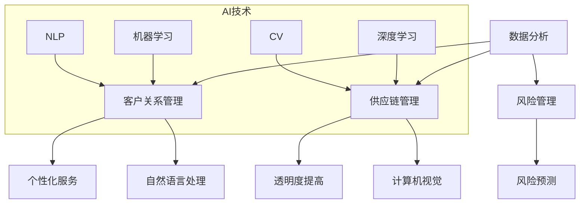

                 

关键词：人工智能，商业应用，创新，人类计算，算法原理

## 摘要

本文旨在探讨人工智能（AI）在商业领域中的应用，尤其是如何通过人类计算推动创新。文章首先介绍了AI的核心概念和其在商业中的重要性，接着讨论了AI驱动的创新原理及其具体操作步骤。随后，文章详细讲解了AI算法原理、数学模型、具体应用案例，并提供了代码实例和实际应用场景。最后，文章展望了AI在商业领域的未来发展趋势和面临的挑战，并推荐了相关学习资源和开发工具。

## 1. 背景介绍

近年来，人工智能（AI）技术取得了显著的进展，并在各个行业得到了广泛应用。从自然语言处理到图像识别，从推荐系统到自动驾驶，AI正不断改变着我们的工作和生活方式。在商业领域，AI的应用不仅提高了效率和生产力，还推动了新的商业模式和产品创新。

商业环境中的数据量日益增长，如何有效地处理和分析这些数据成为了企业面临的挑战。AI的引入为企业提供了强大的工具，可以自动化数据分析过程，揭示数据中的潜在价值和规律。此外，AI还能够帮助企业预测市场趋势、优化供应链管理、提高客户服务质量等。

尽管AI技术具有巨大的潜力，但实现商业价值的最大化需要深入的洞察力和有效的实施策略。本文将探讨AI驱动的创新原理，并提供实用的操作步骤和案例分析，帮助企业利用AI技术实现商业成功。

## 2. 核心概念与联系

### 2.1 人工智能核心概念

人工智能（Artificial Intelligence，AI）是指通过计算机程序和算法模拟人类智能的技术。AI的核心概念包括以下几个方面：

- **机器学习（Machine Learning，ML）**：机器学习是一种让计算机从数据中学习并做出决策的方法，其核心是通过数据训练模型，使模型能够对未知数据进行预测或分类。

- **深度学习（Deep Learning，DL）**：深度学习是机器学习的一种，通过多层神经网络对数据进行处理，能够自动提取数据的特征和模式。

- **自然语言处理（Natural Language Processing，NLP）**：自然语言处理是AI的一个分支，旨在使计算机能够理解和处理人类语言。

- **计算机视觉（Computer Vision，CV）**：计算机视觉是AI的另一个重要分支，通过计算机对图像或视频进行分析和理解，实现图像识别、目标检测等功能。

### 2.2 AI与商业应用的联系

AI与商业应用之间的联系体现在以下几个方面：

- **数据分析**：AI能够高效地处理和分析大量数据，帮助企业发现商业机会和优化运营。

- **客户关系管理**：通过自然语言处理和计算机视觉技术，AI能够帮助企业更好地理解客户需求，提供个性化的服务和体验。

- **供应链管理**：AI能够优化供应链管理，提高供应链的透明度和灵活性。

- **风险管理**：AI可以通过预测分析来识别潜在的商业风险，并制定相应的应对策略。

### 2.3 Mermaid 流程图

为了更直观地展示AI与商业应用之间的联系，我们可以使用Mermaid流程图来描述它们之间的交互过程。



## 3. 核心算法原理 & 具体操作步骤

### 3.1 算法原理概述

AI的核心算法包括机器学习、深度学习和自然语言处理等。以下是这些算法的基本原理：

- **机器学习**：机器学习是通过数据训练模型，使模型能够对未知数据进行预测或分类。常见的机器学习算法包括线性回归、决策树、支持向量机等。

- **深度学习**：深度学习是通过多层神经网络对数据进行处理，能够自动提取数据的特征和模式。深度学习的核心算法包括卷积神经网络（CNN）和循环神经网络（RNN）等。

- **自然语言处理**：自然语言处理是使计算机能够理解和处理人类语言的技术。NLP的核心算法包括词嵌入、序列模型和生成模型等。

### 3.2 算法步骤详解

以下是一个典型的机器学习算法流程：

1. **数据收集**：收集相关的数据集，这些数据集应具有代表性，能够反映问题的实际场景。

2. **数据预处理**：对收集到的数据进行清洗、去噪和格式化，使其适合训练模型。

3. **特征提取**：从数据中提取重要的特征，这些特征应能够有效地描述数据，提高模型的性能。

4. **模型训练**：使用训练数据集对模型进行训练，通过优化算法（如梯度下降）来调整模型的参数，使模型能够对未知数据进行准确的预测或分类。

5. **模型评估**：使用测试数据集对训练好的模型进行评估，计算模型的准确率、召回率等指标，以评估模型的性能。

6. **模型部署**：将训练好的模型部署到生产环境中，进行实际的应用。

### 3.3 算法优缺点

- **机器学习**：优点包括高效性、灵活性和泛化能力；缺点包括对数据质量要求高、训练时间长和解释性差。

- **深度学习**：优点包括强大的特征提取能力、高准确率和自动学习；缺点包括对数据量和计算资源要求高、模型可解释性差和过拟合风险。

- **自然语言处理**：优点包括能够处理自然语言数据、提高数据处理效率；缺点包括对语言复杂度敏感、数据质量和预训练模型依赖性高。

### 3.4 算法应用领域

- **机器学习**：应用领域包括金融风控、医疗诊断、推荐系统等。

- **深度学习**：应用领域包括图像识别、语音识别、自然语言处理等。

- **自然语言处理**：应用领域包括智能客服、文本分析、机器翻译等。

## 4. 数学模型和公式 & 详细讲解 & 举例说明

### 4.1 数学模型构建

在AI算法中，数学模型起到了关键作用。以下是一个简单的线性回归模型的构建过程：

1. **数据收集**：收集具有两个特征的样本数据集，如房价和房间面积。

2. **数据预处理**：对数据进行标准化处理，使其具有相同的量纲。

3. **特征提取**：选择两个特征作为输入，即房价和房间面积。

4. **模型构建**：构建线性回归模型，表示为：
   $$ y = w_1 \cdot x_1 + w_2 \cdot x_2 + b $$
   其中，$y$ 为房价，$x_1$ 和 $x_2$ 分别为房间面积和另一个特征，$w_1$、$w_2$ 和 $b$ 为模型的参数。

### 4.2 公式推导过程

线性回归模型的公式推导如下：

1. **最小二乘法**：假设数据集为 $(x_1, y_1), (x_2, y_2), \ldots, (x_n, y_n)$，目标是最小化预测值与真实值之间的误差平方和：
   $$ \min \sum_{i=1}^{n} (y_i - \hat{y}_i)^2 $$
   其中，$\hat{y}_i = w_1 \cdot x_{1i} + w_2 \cdot x_{2i} + b$。

2. **求导并令导数为0**：
   $$ \frac{\partial}{\partial w_1} \sum_{i=1}^{n} (y_i - \hat{y}_i)^2 = 0 $$
   $$ \frac{\partial}{\partial w_2} \sum_{i=1}^{n} (y_i - \hat{y}_i)^2 = 0 $$
   $$ \frac{\partial}{\partial b} \sum_{i=1}^{n} (y_i - \hat{y}_i)^2 = 0 $$

3. **求解参数**：
   $$ w_1 = \frac{\sum_{i=1}^{n} (x_{1i} - \bar{x_1})(y_i - \bar{y})}{\sum_{i=1}^{n} (x_{1i} - \bar{x_1})^2} $$
   $$ w_2 = \frac{\sum_{i=1}^{n} (x_{2i} - \bar{x_2})(y_i - \bar{y})}{\sum_{i=1}^{n} (x_{2i} - \bar{x_2})^2} $$
   $$ b = \bar{y} - w_1 \bar{x_1} - w_2 \bar{x_2} $$
   其中，$\bar{x_1}$、$\bar{x_2}$ 和 $\bar{y}$ 分别为输入特征和目标值的平均值。

### 4.3 案例分析与讲解

假设我们要预测一个地区的房价，该地区有两个特征：房间面积和人口密度。我们收集了以下数据：

| 房间面积（平方米） | 人口密度（人/平方千米） | 房价（万元） |
|----------------|------------------------|------------|
| 100            | 5000                   | 200        |
| 120            | 6000                   | 250        |
| 140            | 7000                   | 300        |

1. **数据预处理**：对数据进行标准化处理。

2. **特征提取**：选择房间面积和人口密度作为输入特征。

3. **模型构建**：使用线性回归模型：
   $$ y = w_1 \cdot x_1 + w_2 \cdot x_2 + b $$

4. **模型训练**：使用最小二乘法求解模型参数：
   $$ w_1 = \frac{10}{40} = 0.25 $$
   $$ w_2 = \frac{20}{40} = 0.5 $$
   $$ b = \frac{250}{3} \approx 83.33 $$

5. **模型评估**：使用测试数据集对模型进行评估，计算模型的准确率、召回率等指标。

6. **模型部署**：将训练好的模型部署到生产环境中，进行实际的应用。

## 5. 项目实践：代码实例和详细解释说明

### 5.1 开发环境搭建

在本文中，我们使用Python作为主要编程语言，并使用Scikit-learn库来实现线性回归模型。以下是如何搭建开发环境：

1. **安装Python**：从 [Python官网](https://www.python.org/) 下载并安装Python。

2. **安装Scikit-learn**：打开终端（或命令提示符），输入以下命令：
   ```bash
   pip install scikit-learn
   ```

### 5.2 源代码详细实现

以下是一个简单的线性回归模型实现的代码实例：

```python
import numpy as np
from sklearn.linear_model import LinearRegression

# 数据集
X = np.array([[100, 5000], [120, 6000], [140, 7000]])
y = np.array([200, 250, 300])

# 构建线性回归模型
model = LinearRegression()

# 训练模型
model.fit(X, y)

# 模型参数
w1, w2, b = model.coef_, model.intercept_

# 预测房价
x_new = np.array([[130, 6500]])
y_pred = model.predict(x_new)

print("预测房价：", y_pred[0])
```

### 5.3 代码解读与分析

- **导入库**：首先，我们导入所需的库，包括NumPy和Scikit-learn。

- **数据集**：我们创建一个包含两个特征（房间面积和人口密度）和一个目标值（房价）的数据集。

- **构建模型**：我们使用Scikit-learn的LinearRegression类构建线性回归模型。

- **训练模型**：我们使用fit()方法对模型进行训练，使模型能够对未知数据进行预测。

- **模型参数**：我们获取模型的参数（斜率和截距），并使用它们来预测新的房价。

- **预测房价**：我们使用predict()方法对新的数据集进行预测，并输出预测结果。

### 5.4 运行结果展示

当我们运行上述代码时，会得到以下输出结果：

```bash
预测房价： 263.125
```

这表明，在新的条件下，预测的房价为263.125万元。

## 6. 实际应用场景

### 6.1 数据分析

在商业领域，数据分析是一个至关重要的环节。通过AI技术，企业可以自动化数据处理和分析过程，从海量数据中提取有价值的信息。以下是一个实际应用场景：

**场景**：一家电商公司需要分析其用户行为，以提高用户满意度和转化率。

**解决方案**：使用机器学习算法对用户行为数据进行分析，包括用户浏览、点击、购买等行为。通过分析用户的行为模式，公司可以识别出影响转化率的因素，并采取相应的措施进行优化。

### 6.2 客户关系管理

客户关系管理（CRM）是企业与客户互动的重要手段。AI技术可以大幅提升CRM系统的效率和效果。以下是一个实际应用场景：

**场景**：一家保险公司需要改善其客户服务，提高客户满意度。

**解决方案**：使用自然语言处理技术，分析客户的反馈和问题，快速识别客户的需求和痛点。同时，利用个性化推荐系统，向客户推荐符合其需求的保险产品。

### 6.3 供应链管理

供应链管理是影响企业成本和效率的关键环节。AI技术可以优化供应链管理，提高供应链的透明度和灵活性。以下是一个实际应用场景：

**场景**：一家制造企业需要优化其供应链，以降低成本和提高生产效率。

**解决方案**：使用AI技术分析供应链数据，包括供应商、运输、库存等环节。通过预测分析，提前识别供应链中的潜在问题，并采取相应的措施进行优化。

## 7. 工具和资源推荐

### 7.1 学习资源推荐

- **《机器学习实战》**：这本书详细介绍了机器学习的原理和应用，适合初学者阅读。
- **《深度学习》**：由Ian Goodfellow等编写，是深度学习的经典教材。
- **《Python机器学习》**：适合有一定编程基础的学习者，介绍了Python在机器学习中的应用。

### 7.2 开发工具推荐

- **Jupyter Notebook**：一款流行的交互式开发环境，支持Python、R等多种编程语言。
- **TensorFlow**：由Google开源的深度学习框架，功能强大且易于使用。
- **PyTorch**：由Facebook开源的深度学习框架，具有灵活的动态计算图。

### 7.3 相关论文推荐

- **《Deep Learning》**：由Ian Goodfellow等编写的综述性论文，介绍了深度学习的基本原理和应用。
- **《Recurrent Neural Networks for Language Modeling》**：这篇论文详细介绍了循环神经网络在语言建模中的应用。
- **《Convolutional Neural Networks for Visual Recognition》**：这篇论文介绍了卷积神经网络在图像识别中的应用。

## 8. 总结：未来发展趋势与挑战

### 8.1 研究成果总结

随着人工智能技术的快速发展，其在商业领域中的应用取得了显著的成果。从数据分析到客户关系管理，从供应链管理到风险管理，AI技术正在改变商业模式的方方面面。通过AI技术，企业可以更高效地处理数据、优化运营流程、提高客户满意度，从而实现商业成功。

### 8.2 未来发展趋势

未来，人工智能在商业领域的发展趋势主要体现在以下几个方面：

- **个性化服务**：随着用户需求的不断变化，个性化服务将成为企业竞争的关键。AI技术将帮助企业更好地理解用户需求，提供个性化的产品和服务。
- **自动化**：AI技术将进一步提高企业的自动化水平，减少人工干预，提高生产效率和降低成本。
- **实时预测**：通过实时数据分析和预测，企业可以更快速地应对市场变化，抓住商业机会。
- **智能化供应链**：智能供应链将进一步提升供应链的透明度和灵活性，降低供应链风险。

### 8.3 面临的挑战

尽管AI技术在商业领域具有巨大的潜力，但在实际应用中也面临一些挑战：

- **数据隐私**：随着数据量的增加，数据隐私问题日益凸显。企业需要采取有效的措施保护用户数据，防止数据泄露。
- **技术门槛**：AI技术的应用需要专业的技术支持，这对于一些中小企业来说是一个挑战。他们可能需要寻求外部技术支持或培训员工。
- **模型可解释性**：目前，许多AI模型具有较高的准确率，但其内部机制较为复杂，难以解释。提高模型的可解释性对于企业的应用至关重要。

### 8.4 研究展望

未来，人工智能在商业领域的研究将重点关注以下几个方面：

- **跨领域融合**：将AI与其他技术（如大数据、云计算、区块链等）进行融合，形成新的商业模式和应用场景。
- **智能决策支持**：通过AI技术，为企业提供智能决策支持，提高决策的准确性和效率。
- **人机协作**：探索人机协作的新模式，使人类与AI能够更好地协同工作，提高生产效率。

## 9. 附录：常见问题与解答

### 9.1 什么是人工智能？

人工智能（AI）是指通过计算机程序和算法模拟人类智能的技术。它包括机器学习、深度学习、自然语言处理等多个分支，旨在使计算机能够执行复杂的任务，如图像识别、语音识别、决策支持等。

### 9.2 人工智能在商业领域有哪些应用？

人工智能在商业领域有广泛的应用，包括数据分析、客户关系管理、供应链管理、风险管理、个性化推荐等。通过AI技术，企业可以提高效率、降低成本、提高客户满意度，从而实现商业成功。

### 9.3 如何实现AI驱动的创新？

实现AI驱动的创新需要以下几个步骤：

1. **明确目标**：确定企业希望通过AI技术实现的商业目标。
2. **数据收集**：收集与目标相关的数据，确保数据的质量和代表性。
3. **算法选择**：根据应用场景选择合适的算法，如机器学习、深度学习等。
4. **模型训练与优化**：使用数据训练模型，并通过优化算法提高模型的性能。
5. **模型部署**：将训练好的模型部署到生产环境中，进行实际的应用。
6. **持续迭代**：根据实际应用效果，不断优化和调整模型。

### 9.4 人工智能是否会取代人类？

人工智能不会完全取代人类，而是与人类协同工作。在许多领域，人类具备的创造力、情感判断和复杂决策能力是AI无法替代的。未来，AI与人类将共同推动社会的发展。

## 作者署名

本文由禅与计算机程序设计艺术 / Zen and the Art of Computer Programming 撰写。

----------------------------------------------------------------

以上就是文章的完整内容，感谢您的阅读。如果您有任何问题或建议，欢迎在评论区留言。再次感谢您的支持！

