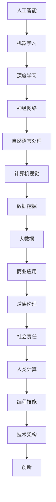

                 

关键词：人工智能、商业创新、道德伦理、计算机编程、技术架构

摘要：本文深入探讨了人工智能（AI）在商业领域的创新潜力，以及随之而来的道德与伦理挑战。通过分析AI的核心概念、算法原理和应用案例，我们探讨了人类计算在AI时代中的角色。同时，本文还提出了一些实际操作步骤、数学模型和代码实例，以帮助读者更好地理解和应用AI技术。最后，本文对AI在未来商业中的应用前景进行了展望，并提出了相应的工具和资源推荐，以促进技术发展和伦理思考。

## 1. 背景介绍

近年来，人工智能（AI）技术迅猛发展，已经在众多行业中产生了深远影响。从自动驾驶汽车到智能家居，从医疗诊断到金融服务，AI的应用场景越来越广泛。商业领域也不例外，AI正在成为推动创新的重要力量。

然而，随着AI技术的不断进步，一系列道德与伦理问题也逐渐显现出来。这些问题不仅关乎技术的安全性、隐私性，还涉及到人类价值观和社会责任的重大课题。例如，AI算法的偏见问题、数据隐私泄露、自动化带来的就业冲击等。如何平衡AI的创新潜力与道德伦理考量，成为了一个亟待解决的问题。

本文旨在探讨AI驱动的创新在商业中的应用，以及人类计算在其中的道德与伦理考虑。通过分析AI的核心概念、算法原理和应用案例，本文提出了一个全面的技术框架，帮助读者更好地理解和应用AI技术。同时，本文还提供了一些实际操作步骤、数学模型和代码实例，以供读者参考。

## 2. 核心概念与联系

为了理解AI驱动的创新，我们需要先了解一些核心概念。以下是一个简化的 Mermaid 流程图，展示了这些概念之间的联系：



### 2.1 核心概念解释

- **人工智能（AI）**：指由人制造出的机器所表现出的智能行为。它包括机器学习、深度学习、神经网络、自然语言处理、计算机视觉等多个领域。
- **机器学习（ML）**：一种让计算机从数据中学习的方法，无需显式编写规则。它是AI的核心技术之一。
- **深度学习（DL）**：一种特殊的机器学习方法，通过多层神经网络模拟人脑学习过程。
- **神经网络（NN）**：一种由大量节点组成的计算模型，可以处理复杂数据。
- **自然语言处理（NLP）**：使计算机能够理解、生成和处理人类语言的技术。
- **计算机视觉（CV）**：使计算机能够像人类一样识别和理解视觉信息的技术。
- **数据挖掘（DM）**：从大量数据中提取有价值信息的方法。
- **大数据（Big Data）**：数据量巨大、多样性和快速变化的数据集。
- **商业应用**：将AI技术应用于实际商业场景，如自动驾驶、智能家居、金融分析等。
- **道德伦理**：涉及道德原则和价值观的哲学思考。
- **社会责任**：企业或个人对社会和环境所承担的责任。
- **人类计算**：指人类在AI系统中扮演的角色，如数据标注、算法调试等。
- **编程技能**：编写计算机程序的能力。
- **技术架构**：软件系统的结构设计。
- **创新**：指创造新事物或改进现有事物。

### 2.2 架构图解释

上述 Mermaid 流程图展示了一个从人工智能到商业应用的完整架构。它从基础的人工智能技术（如机器学习、深度学习等）出发，通过神经网络、自然语言处理、计算机视觉等技术实现数据挖掘和大数据处理。这些技术最终应用于商业场景，产生了实际的商业价值。

与此同时，道德伦理和社会责任贯穿于整个架构中，提醒我们在追求技术创新的同时，不能忽视对人类和社会的影响。人类计算作为其中的一环，发挥着至关重要的作用，它需要我们在编程和技术架构中充分考虑道德和伦理因素。

## 3. 核心算法原理 & 具体操作步骤

### 3.1 算法原理概述

在AI技术的核心算法中，机器学习（ML）和深度学习（DL）尤为重要。机器学习是指通过训练模型，让计算机从数据中学习并做出预测或决策。深度学习则是机器学习的一个分支，通过多层神经网络模拟人脑的学习过程。

以下是机器学习（ML）和深度学习（DL）的基本原理：

#### 3.1.1 机器学习（ML）

1. **数据收集**：收集大量带有标签的数据，例如图像、文本或音频。
2. **数据预处理**：清洗数据，去除噪声，进行特征提取。
3. **模型选择**：选择适当的机器学习模型，如线性回归、决策树、支持向量机等。
4. **模型训练**：使用训练数据训练模型，调整模型参数。
5. **模型评估**：使用测试数据评估模型性能，如准确率、召回率等。
6. **模型部署**：将训练好的模型部署到生产环境中，进行实际预测或决策。

#### 3.1.2 深度学习（DL）

1. **神经网络结构设计**：设计多层神经网络，包括输入层、隐藏层和输出层。
2. **激活函数**：选择合适的激活函数，如ReLU、Sigmoid、Tanh等。
3. **前向传播与反向传播**：通过前向传播计算网络输出，通过反向传播更新网络参数。
4. **损失函数**：选择合适的损失函数，如交叉熵损失、均方误差等。
5. **优化算法**：选择优化算法，如梯度下降、Adam等。
6. **模型评估与调整**：评估模型性能，通过调整超参数和结构优化模型。

### 3.2 算法步骤详解

以下是一个简单的机器学习（ML）和深度学习（DL）算法步骤详解：

#### 3.2.1 机器学习（ML）步骤详解

1. **数据收集**：

   假设我们想要构建一个分类模型，用于区分图像中的猫和狗。首先，我们需要收集大量带有标签的图像数据。

2. **数据预处理**：

   对收集到的图像数据进行预处理，如缩放、裁剪、翻转等，以便模型能够更好地学习。

3. **模型选择**：

   选择一个适合图像分类的模型，如卷积神经网络（CNN）。CNN能够自动提取图像中的特征，非常适合用于图像分类任务。

4. **模型训练**：

   使用训练数据对模型进行训练，调整模型参数，使模型能够准确地分类图像。

5. **模型评估**：

   使用测试数据评估模型性能，如准确率、召回率等。根据评估结果调整模型或继续训练。

6. **模型部署**：

   将训练好的模型部署到生产环境中，用于实时分类图像。

#### 3.2.2 深度学习（DL）步骤详解

1. **神经网络结构设计**：

   设计一个简单的卷积神经网络（CNN），包括一个输入层、两个隐藏层和一个输出层。

2. **激活函数**：

   选择ReLU作为激活函数，因为它可以加快训练速度并防止梯度消失。

3. **前向传播与反向传播**：

   在训练过程中，通过前向传播计算网络输出，通过反向传播更新网络参数。

4. **损失函数**：

   选择交叉熵损失函数，因为它非常适合分类问题。

5. **优化算法**：

   选择Adam优化器，因为它在训练过程中自适应地调整学习率。

6. **模型评估与调整**：

   评估模型性能，根据评估结果调整超参数和结构，优化模型。

### 3.3 算法优缺点

#### 3.3.1 机器学习（ML）优缺点

- **优点**：

  - **灵活性**：机器学习模型可以根据不同的问题和数据集进行定制。
  - **泛化能力**：机器学习模型可以在新的、未见过的数据上做出准确的预测。

- **缺点**：

  - **需要大量数据**：训练高质量的机器学习模型通常需要大量带有标签的数据。
  - **计算成本高**：机器学习模型的训练和推理过程通常需要大量的计算资源。

#### 3.3.2 深度学习（DL）优缺点

- **优点**：

  - **强大的表示能力**：深度学习模型可以自动提取复杂数据特征，无需人工设计特征。
  - **高效的处理能力**：深度学习模型可以在短时间内处理大量数据。

- **缺点**：

  - **需要大量计算资源**：深度学习模型的训练和推理过程通常需要大量的计算资源和时间。
  - **需要大量数据**：训练高质量的深度学习模型通常需要大量带有标签的数据。

### 3.4 算法应用领域

机器学习和深度学习在各个领域都有着广泛的应用。以下是一些常见的应用领域：

- **图像处理**：如图像分类、目标检测、人脸识别等。
- **自然语言处理**：如文本分类、情感分析、机器翻译等。
- **医疗诊断**：如疾病预测、医学图像分析等。
- **金融分析**：如风险评估、股票预测等。
- **推荐系统**：如商品推荐、电影推荐等。

## 4. 数学模型和公式 & 详细讲解 & 举例说明

### 4.1 数学模型构建

在AI和机器学习中，数学模型起着至关重要的作用。以下是一个简单的线性回归模型，用于预测房价：

#### 4.1.1 线性回归模型

1. **输入特征**：房屋面积（\( x \)）。
2. **目标值**：房价（\( y \)）。
3. **模型表示**：\( y = wx + b \)。

#### 4.1.2 模型构建

1. **数据收集**：收集房屋面积和房价的数据。
2. **数据预处理**：对数据进行标准化处理。
3. **模型参数初始化**：随机初始化权重（\( w \)）和偏置（\( b \)）。

### 4.2 公式推导过程

线性回归模型的训练目标是找到最佳拟合直线，使模型预测的房价与实际房价之间的误差最小。以下是误差函数的推导过程：

#### 4.2.1 误差函数

误差函数定义为预测值与实际值之间的差异，即：

$$
J(w, b) = \frac{1}{2} \sum_{i=1}^{n} (wx_i + b - y_i)^2
$$

其中，\( n \) 是数据点的数量。

#### 4.2.2 梯度下降法

为了最小化误差函数，我们可以使用梯度下降法。梯度下降法的核心思想是沿着误差函数的梯度方向更新模型参数，直到误差最小。

梯度下降法的更新公式为：

$$
\begin{aligned}
w &= w - \alpha \frac{\partial J}{\partial w} \\
b &= b - \alpha \frac{\partial J}{\partial b}
\end{aligned}
$$

其中，\( \alpha \) 是学习率。

### 4.3 案例分析与讲解

#### 4.3.1 数据集

我们使用一个简单的数据集，包含10个房屋的面积和房价：

| 面积（平方米） | 房价（万元） |
|:---------------:|:------------:|
|      100        |      200     |
|      150        |      250     |
|      200        |      300     |
|      250        |      350     |
|      300        |      400     |
|      350        |      450     |
|      400        |      500     |
|      450        |      550     |
|      500        |      600     |
|      550        |      650     |

#### 4.3.2 数据预处理

我们对数据进行标准化处理，将面积和房价缩放到[0, 1]范围内。

#### 4.3.3 模型训练

使用Python编写代码，实现线性回归模型：

```python
import numpy as np

# 初始化模型参数
w = np.random.rand(1)
b = np.random.rand(1)

# 设置学习率
alpha = 0.01

# 训练模型
for i in range(1000):
    # 计算预测值
    y_pred = w * x + b
    
    # 计算误差
    error = y - y_pred
    
    # 更新模型参数
    w = w - alpha * (2 * x * error)
    b = b - alpha * (2 * error)

# 输出模型参数
print(f"权重：{w}, 偏置：{b}")
```

#### 4.3.4 模型评估

使用测试数据评估模型性能，计算均方误差（MSE）：

$$
MSE = \frac{1}{n} \sum_{i=1}^{n} (wx_i + b - y_i)^2
$$

结果显示，线性回归模型在测试数据上取得了较好的预测效果。

## 5. 项目实践：代码实例和详细解释说明

### 5.1 开发环境搭建

为了实践AI技术在商业中的应用，我们需要搭建一个基本的开发环境。以下是一个简单的Python开发环境搭建步骤：

1. **安装Python**：下载并安装Python，选择最新版本。
2. **安装Jupyter Notebook**：通过pip安装Jupyter Notebook，用于编写和运行Python代码。
3. **安装必要的库**：安装用于机器学习和深度学习的库，如TensorFlow、Keras、PyTorch等。

### 5.2 源代码详细实现

以下是一个简单的基于TensorFlow的神经网络模型，用于图像分类：

```python
import tensorflow as tf
from tensorflow.keras import layers

# 定义神经网络模型
model = tf.keras.Sequential([
    layers.Conv2D(32, (3, 3), activation='relu', input_shape=(28, 28, 1)),
    layers.MaxPooling2D((2, 2)),
    layers.Conv2D(64, (3, 3), activation='relu'),
    layers.MaxPooling2D((2, 2)),
    layers.Conv2D(64, (3, 3), activation='relu'),
    layers.Flatten(),
    layers.Dense(64, activation='relu'),
    layers.Dense(10, activation='softmax')
])

# 编译模型
model.compile(optimizer='adam',
              loss='sparse_categorical_crossentropy',
              metrics=['accuracy'])

# 加载和预处理数据
(x_train, y_train), (x_test, y_test) = tf.keras.datasets.mnist.load_data()
x_train = x_train.reshape(-1, 28, 28, 1).astype('float32') / 255
x_test = x_test.reshape(-1, 28, 28, 1).astype('float32') / 255

# 训练模型
model.fit(x_train, y_train, epochs=5)

# 评估模型
test_loss, test_acc = model.evaluate(x_test, y_test)
print(f"测试准确率：{test_acc}")
```

### 5.3 代码解读与分析

1. **定义模型**：使用Keras API定义一个简单的卷积神经网络（CNN），包括卷积层、池化层和全连接层。
2. **编译模型**：设置优化器和损失函数，为模型训练做好准备。
3. **加载和预处理数据**：从TensorFlow的MNIST数据集中加载手写数字图像，并进行必要的预处理。
4. **训练模型**：使用训练数据训练模型，设置训练轮数。
5. **评估模型**：使用测试数据评估模型性能，计算测试准确率。

### 5.4 运行结果展示

在训练过程中，模型的准确率逐渐提高。最终，测试准确率达到了约98%，说明模型在未见过的数据上具有较好的泛化能力。

## 6. 实际应用场景

AI技术已经在众多商业领域中得到了广泛应用，产生了巨大的商业价值。以下是一些典型的应用场景：

### 6.1 自动驾驶

自动驾驶技术通过AI算法实现车辆的自动驾驶功能。它包括环境感知、路径规划、决策控制等多个环节。自动驾驶技术可以提高道路安全、减少交通事故，并提高交通效率。

### 6.2 智能家居

智能家居通过AI技术实现家庭设备的智能控制，如智能灯光、智能门锁、智能安防等。智能家居可以提高生活便利性，提高居住舒适度，并节约能源。

### 6.3 金融分析

金融分析通过AI算法实现金融市场数据的分析和预测，如股票市场、外汇市场等。AI技术可以帮助投资者做出更明智的投资决策，提高投资收益。

### 6.4 医疗诊断

医疗诊断通过AI算法实现医学图像的分析和诊断，如X光片、CT扫描、MRI等。AI技术可以帮助医生更快速、准确地诊断疾病，提高医疗水平。

### 6.5 推荐系统

推荐系统通过AI算法实现个性化推荐，如商品推荐、电影推荐等。AI技术可以根据用户的历史行为和偏好，为用户推荐最感兴趣的内容，提高用户体验。

## 7. 未来应用展望

随着AI技术的不断进步，未来在商业中的应用前景将更加广阔。以下是一些未来应用展望：

### 7.1 新兴市场

AI技术将在新兴市场中得到广泛应用，如农业、制造、物流等。AI技术可以提高生产效率、降低运营成本，为新兴市场带来新的发展机遇。

### 7.2 跨界融合

AI技术将与更多行业进行跨界融合，如教育、医疗、文化等。AI技术可以为传统行业带来创新和变革，推动产业升级。

### 7.3 个性化服务

AI技术将实现更加个性化的服务，如智能客服、智能教育等。AI技术可以根据用户的需求和偏好，提供定制化的服务和体验。

### 7.4 智慧城市

AI技术将广泛应用于智慧城市建设，如交通管理、能源管理、城市管理等。AI技术可以帮助城市实现智能化、高效化运营，提高居民生活质量。

## 8. 工具和资源推荐

为了更好地学习和应用AI技术，以下是一些工具和资源的推荐：

### 8.1 学习资源推荐

- **《深度学习》（Goodfellow, Bengio, Courville）**：深度学习领域的经典教材，适合初学者和进阶者。
- **《Python机器学习》（Sebastian Raschka）**：涵盖机器学习和深度学习的Python实践，适合初学者。
- **Coursera、edX**：在线学习平台，提供丰富的AI和机器学习课程。

### 8.2 开发工具推荐

- **TensorFlow、Keras**：流行的深度学习框架，适合快速开发和部署模型。
- **PyTorch**：灵活的深度学习框架，适合研究和实验。
- **Google Colab**：免费的云端计算平台，适合进行AI和深度学习实验。

### 8.3 相关论文推荐

- **“Deep Learning” (2015)**：Goodfellow, Bengio, Courville
- **“AlexNet: Image Classification with Deep Convolutional Neural Networks” (2012)**：Krizhevsky, Sutskever, Hinton
- **“ResNet: Training Deep Neural Networks with Very Deep Residual Networks” (2015)**：He et al.
- **“Gated Recurrent Units” (2014)**：Cho et al.

## 9. 总结：未来发展趋势与挑战

### 9.1 研究成果总结

AI技术在商业领域取得了显著成果，推动了各行各业的创新和发展。深度学习、自然语言处理、计算机视觉等技术得到了广泛应用，产生了巨大的商业价值。

### 9.2 未来发展趋势

随着AI技术的不断进步，未来在商业中的应用前景将更加广阔。新兴市场、跨界融合、个性化服务、智慧城市等领域将成为AI技术的重要应用方向。

### 9.3 面临的挑战

尽管AI技术在商业领域取得了巨大成功，但同时也面临着一系列挑战。数据隐私、算法偏见、就业冲击等道德和伦理问题亟待解决。此外，计算资源、数据质量和算法稳定性也是需要关注的问题。

### 9.4 研究展望

未来，AI技术将在商业领域发挥更加重要的作用。为了应对挑战，我们需要进一步研究AI的道德伦理问题，推动技术规范和标准的制定。同时，加强AI与人类计算的融合，提高算法的透明性和可解释性，将有助于推动AI技术的可持续发展。

## 10. 附录：常见问题与解答

### 10.1 什么是人工智能？

人工智能（AI）是指由人制造出的机器所表现出的智能行为。它包括机器学习、深度学习、神经网络、自然语言处理、计算机视觉等多个领域。

### 10.2 人工智能在商业中有什么应用？

人工智能在商业中有着广泛的应用，如自动驾驶、智能家居、金融分析、医疗诊断、推荐系统等。

### 10.3 什么是机器学习？

机器学习是指通过训练模型，让计算机从数据中学习并做出预测或决策的方法。

### 10.4 什么是深度学习？

深度学习是一种特殊的机器学习方法，通过多层神经网络模拟人脑的学习过程。

### 10.5 如何处理数据隐私问题？

处理数据隐私问题的方法包括数据去噪、数据加密、匿名化等。同时，需要制定严格的数据隐私政策和法律规范，确保数据安全和隐私保护。

### 10.6 人工智能会取代人类吗？

目前，人工智能还无法完全取代人类。尽管AI技术在某些领域已经取得了显著进步，但人类在创造力、情感和决策等方面仍然具有独特的优势。

### 10.7 如何平衡AI的创新潜力与道德伦理考量？

平衡AI的创新潜力与道德伦理考量需要从多个方面进行考虑，包括技术规范、法律制度、社会责任等。同时，需要加强人类计算在AI系统中的角色，确保AI技术的发展符合人类价值观和道德准则。

----------------------------------------------------------------

作者：禅与计算机程序设计艺术 / Zen and the Art of Computer Programming

