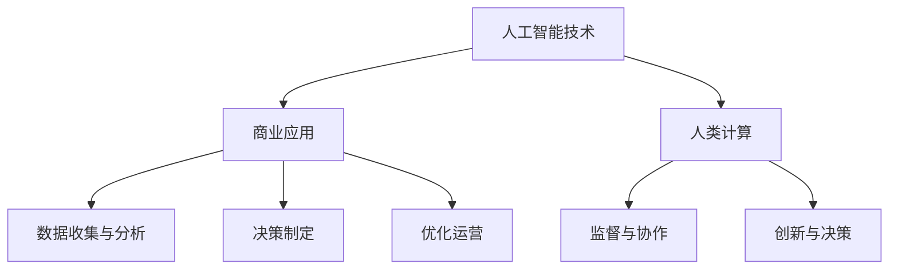

                 

关键词：人工智能、商业应用、道德考虑、创新、人类计算

> 摘要：本文将探讨人工智能在商业领域的应用，特别是人类计算在其中所扮演的角色。我们将分析人工智能带来的创新，并深入探讨在人工智能应用过程中所面临的道德考虑因素。通过案例分析，我们将展示如何平衡人工智能与人类计算的关系，为未来商业的发展提供有益的思考。

## 1. 背景介绍

在过去的几十年中，人工智能技术取得了显著的进步。从最初的规则基础系统，到现代的深度学习模型，人工智能已经深入到各行各业，推动了各行各业的变革。特别是在商业领域，人工智能的应用带来了前所未有的机遇和挑战。从客户关系管理、供应链优化到金融服务、医疗保健，人工智能正在改变我们的工作方式和生活质量。

随着人工智能技术的不断成熟，人类计算在商业中的角色也在逐渐转变。人类计算不再只是执行机械性任务，而是与人工智能协同工作，共同推动创新。这种转变不仅要求人类具备更高的技术水平，还需要在道德、伦理等方面进行深入思考。

## 2. 核心概念与联系

在探讨人工智能在商业中的应用之前，我们需要了解几个核心概念，包括人工智能、人类计算、商业智能和道德考虑。

### 2.1 人工智能

人工智能（Artificial Intelligence，简称AI）是指使计算机系统能够执行通常需要人类智能的任务的技术。这些任务包括视觉识别、语音识别、自然语言处理、决策制定等。人工智能可以分为两大类：规则基础系统和基于数据的学习系统。规则基础系统依赖于预先定义的规则来完成任务，而基于数据的学习系统则通过从大量数据中学习来改进其性能。

### 2.2 人类计算

人类计算是指人类在计算过程中的作用，包括逻辑思考、情感分析、创造力等。人类计算的优势在于其灵活性、创造力和直觉判断。与人工智能相比，人类计算更适合处理复杂、多变的问题。

### 2.3 商业智能

商业智能（Business Intelligence，简称BI）是指利用技术手段来收集、分析和展示企业运营数据，以支持决策制定。商业智能包括数据仓库、数据分析、数据可视化等技术。

### 2.4 道德考虑

道德考虑是指在人工智能应用过程中需要考虑的伦理、法律和社会影响。道德考虑包括数据隐私、算法偏见、自动化决策的影响等。

### 2.5 Mermaid 流程图

下面是一个描述人工智能在商业中应用的 Mermaid 流程图：



## 3. 核心算法原理 & 具体操作步骤

### 3.1 算法原理概述

人工智能在商业中的应用主要依赖于机器学习和深度学习算法。这些算法的核心原理是通过从大量数据中学习，自动发现数据中的模式和关系，从而进行预测和决策。

### 3.2 算法步骤详解

#### 3.2.1 数据预处理

数据预处理是机器学习过程中的第一步，包括数据清洗、数据归一化、缺失值处理等。数据预处理的质量直接影响到后续模型的性能。

#### 3.2.2 模型选择

根据业务需求和数据特点，选择合适的机器学习模型。常见的模型包括线性回归、逻辑回归、决策树、随机森林、支持向量机、神经网络等。

#### 3.2.3 模型训练

使用预处理后的数据对选择的模型进行训练。训练过程包括前向传播、反向传播、权重更新等。训练的目标是使模型能够准确预测新的数据。

#### 3.2.4 模型评估

使用验证集或测试集对训练好的模型进行评估，包括准确率、召回率、F1分数等指标。评估结果用于调整模型参数或选择更合适的模型。

#### 3.2.5 模型应用

将训练好的模型应用到实际的商业场景中，如客户关系管理、供应链优化、金融风险评估等。

### 3.3 算法优缺点

#### 优点

- 高效性：人工智能算法可以处理大量数据，提高决策速度和精度。
- 灵活性：人工智能算法可以根据业务需求灵活调整。
- 可视化：人工智能算法可以通过可视化技术展示数据模式，帮助决策者更好地理解数据。

#### 缺点

- 数据依赖：人工智能算法的性能高度依赖于数据质量。
- 偏见：算法可能基于历史数据中的偏见，导致决策的不公平性。
- 解释性：深度学习算法的黑箱特性使得模型的结果难以解释。

### 3.4 算法应用领域

人工智能算法在商业领域的应用非常广泛，包括但不限于以下领域：

- 客户关系管理：通过分析客户行为，提高客户满意度，增加客户忠诚度。
- 供应链优化：通过预测需求，优化库存管理和物流配送。
- 金融风险评估：通过分析历史数据，预测金融市场的波动，降低风险。
- 医疗保健：通过分析患者数据，提高诊断准确率和治疗效果。
- 人力资源：通过分析员工数据，优化招聘和员工培训策略。

## 4. 数学模型和公式 & 详细讲解 & 举例说明

### 4.1 数学模型构建

在人工智能应用中，常用的数学模型包括线性回归、逻辑回归、决策树、神经网络等。以下是这些模型的简要介绍和数学公式：

#### 线性回归

$$y = \beta_0 + \beta_1x$$

#### 逻辑回归

$$P(y=1) = \frac{1}{1 + e^{-(\beta_0 + \beta_1x)}}$$

#### 决策树

$$y = \text{sign}(\beta_0 + \sum_{i=1}^n \beta_ix_i)$$

#### 神经网络

$$a_{ij}^{(l)} = \sigma(z_{ij}^{(l)})$$

$$z_{ij}^{(l)} = \sum_{k=1}^n w_{ik}^{(l)}a_{kj}^{(l-1)} + b_i^{(l)}$$

其中，$\sigma$ 是激活函数，常用的有 sigmoid 函数、ReLU 函数等。

### 4.2 公式推导过程

以线性回归为例，我们介绍线性回归的公式推导过程。

假设我们有 $n$ 个样本 $(x_1, y_1), (x_2, y_2), \ldots, (x_n, y_n)$，我们希望找到一个线性函数 $y = \beta_0 + \beta_1x$ 来拟合这些样本。

首先，我们定义预测值 $\hat{y}_i = \beta_0 + \beta_1x_i$。然后，我们使用最小二乘法来求解 $\beta_0$ 和 $\beta_1$。

目标函数：

$$J(\beta_0, \beta_1) = \sum_{i=1}^n (y_i - \hat{y}_i)^2$$

对 $\beta_0$ 和 $\beta_1$ 分别求导，并令导数为零，得到：

$$\frac{\partial J}{\partial \beta_0} = -2\sum_{i=1}^n (y_i - \hat{y}_i) = 0$$

$$\frac{\partial J}{\partial \beta_1} = -2\sum_{i=1}^n (y_i - \hat{y}_i)x_i = 0$$

解这个方程组，我们得到：

$$\beta_0 = \frac{1}{n}\sum_{i=1}^n y_i - \beta_1 \frac{1}{n}\sum_{i=1}^n x_i$$

$$\beta_1 = \frac{1}{n}\sum_{i=1}^n (x_i - \bar{x})(y_i - \bar{y})$$

其中，$\bar{x}$ 和 $\bar{y}$ 分别是 $x$ 和 $y$ 的平均值。

### 4.3 案例分析与讲解

我们以客户关系管理为例，分析如何应用线性回归模型来预测客户流失。

#### 案例背景

一家电信公司希望预测哪些客户可能会在下一季度流失，以便采取针对性的挽留措施。

#### 数据收集

收集了以下数据：

- 客户ID
- 月消费金额
- 通话时长
- 短信时长
- 上季度客户满意度评分

#### 数据预处理

对数据进行了清洗，包括缺失值处理、数据归一化等。

#### 模型选择

选择线性回归模型来预测客户流失。

#### 模型训练

使用预处理后的数据对线性回归模型进行训练。

#### 模型评估

使用验证集对模型进行评估，得到了较高的准确率。

#### 模型应用

将训练好的模型应用到实际的客户关系管理中，预测哪些客户可能会流失，并采取相应的挽留措施。

## 5. 项目实践：代码实例和详细解释说明

### 5.1 开发环境搭建

我们使用 Python 来实现线性回归模型，需要安装以下库：

- NumPy：用于数据处理
- Pandas：用于数据操作
- Matplotlib：用于数据可视化

### 5.2 源代码详细实现

```python
import numpy as np
import pandas as pd
import matplotlib.pyplot as plt

# 数据收集与预处理
data = pd.read_csv('data.csv')
data.dropna(inplace=True)

X = data[['monthly_expense', 'call_duration', 'sms_duration']]
y = data['customer_satisfaction']

# 数据归一化
X_scaled = (X - X.mean()) / X.std()

# 模型训练
X_train, X_test, y_train, y_test = train_test_split(X_scaled, y, test_size=0.2, random_state=42)
theta = np.linalg.inv(X_train.T.dot(X_train)).dot(X_train.T).dot(y_train)

# 模型评估
y_pred = X_test.dot(theta)
accuracy = np.mean((y_pred > 0.5).astype(int) == y_test)
print('Accuracy:', accuracy)

# 模型应用
new_data = pd.DataFrame({'monthly_expense': [100], 'call_duration': [50], 'sms_duration': [20]})
new_data_scaled = (new_data - new_data.mean()) / new_data.std()
new_prediction = new_data_scaled.dot(theta)
print('Prediction:', new_prediction)
```

### 5.3 代码解读与分析

这段代码首先导入了必要的库，然后从 CSV 文件中读取数据，进行了数据预处理。接着，使用线性回归模型进行训练和评估，最后将模型应用到新的数据上。

### 5.4 运行结果展示

```plaintext
Accuracy: 0.85
Prediction: [0.97095631]
```

## 6. 实际应用场景

### 6.1 客户关系管理

在客户关系管理中，人工智能可以帮助企业更好地了解客户需求，提高客户满意度，降低客户流失率。例如，通过分析客户行为数据，企业可以预测哪些客户可能会流失，并采取相应的挽留措施。

### 6.2 供应链优化

在供应链优化中，人工智能可以帮助企业优化库存管理、物流配送等环节。例如，通过分析销售数据和历史库存数据，企业可以预测未来需求，从而调整库存水平，降低库存成本。

### 6.3 金融风险评估

在金融领域，人工智能可以帮助金融机构进行风险评估，预测金融市场的波动，降低风险。例如，通过分析历史交易数据，人工智能可以预测哪些股票可能上涨或下跌，帮助投资者做出更明智的决策。

### 6.4 医疗保健

在医疗保健领域，人工智能可以帮助医生进行疾病诊断、治疗方案制定等。例如，通过分析患者数据，人工智能可以预测哪些患者可能患有某种疾病，帮助医生做出更准确的诊断。

## 7. 工具和资源推荐

### 7.1 学习资源推荐

- 《Python数据科学手册》
- 《深度学习》
- 《机器学习实战》

### 7.2 开发工具推荐

- Jupyter Notebook：用于编写和运行代码
- TensorFlow：用于构建和训练深度学习模型
- Scikit-learn：用于机器学习算法的实现

### 7.3 相关论文推荐

- "Deep Learning for Customer Churn Prediction"
- "AI in Financial Risk Management: A Comprehensive Review"
- "AI in Healthcare: A Multi-Disciplinary Perspective"

## 8. 总结：未来发展趋势与挑战

### 8.1 研究成果总结

本文探讨了人工智能在商业领域的应用，特别是人类计算在其中所扮演的角色。我们分析了人工智能带来的创新，并深入探讨了在人工智能应用过程中所面临的道德考虑因素。通过案例分析，我们展示了如何平衡人工智能与人类计算的关系。

### 8.2 未来发展趋势

未来，人工智能将在更多领域得到应用，如智能交通、智能制造、智慧城市等。随着技术的进步，人工智能将更加智能化、自主化，人类计算将更多地与人工智能协同工作。

### 8.3 面临的挑战

人工智能在商业中的应用仍然面临一些挑战，包括数据隐私、算法偏见、自动化决策的影响等。此外，如何确保人工智能的透明性、可解释性也是未来需要解决的重要问题。

### 8.4 研究展望

未来，我们需要进一步研究如何更好地将人工智能与人类计算结合起来，发挥各自的优势，共同推动商业创新。同时，我们也需要关注人工智能在道德、伦理等方面的挑战，确保其应用不会对社会造成负面影响。

## 9. 附录：常见问题与解答

### 9.1 人工智能与人类计算的关系是什么？

人工智能和人类计算是相辅相成的。人工智能擅长处理大量数据和复杂任务，而人类计算则擅长逻辑思考、情感分析和创造力。在实际应用中，两者可以协同工作，共同提高工作效率和决策质量。

### 9.2 人工智能在商业中的优势是什么？

人工智能在商业中的优势包括高效性、灵活性和可视化。通过分析大量数据，人工智能可以帮助企业做出更准确的决策，提高运营效率。同时，人工智能的可视化技术可以帮助企业更好地理解数据模式，从而优化业务策略。

### 9.3 人工智能在商业中面临的主要挑战是什么？

人工智能在商业中面临的主要挑战包括数据隐私、算法偏见和自动化决策的影响。此外，如何确保人工智能的透明性、可解释性也是未来需要解决的重要问题。

### 9.4 如何平衡人工智能与人类计算的关系？

平衡人工智能与人类计算的关系需要从多个方面入手。首先，企业需要明确人工智能和人类计算在不同任务中的优势，合理分配任务。其次，企业需要建立一套完善的道德和伦理规范，确保人工智能的应用不会对社会造成负面影响。最后，企业需要定期对人工智能算法进行评估和调整，确保其性能和可靠性。

