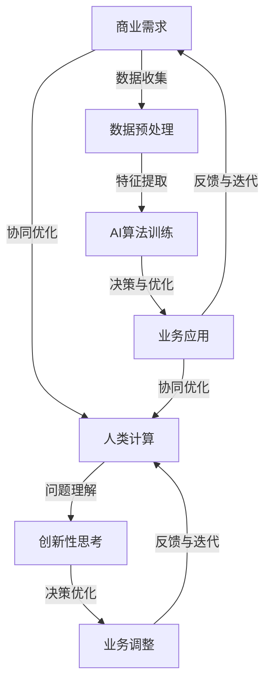

                 

关键词：人工智能、商业应用、道德伦理、创新趋势、技术发展

> 摘要：本文探讨了人工智能（AI）在商业领域的应用及其带来的创新变革，同时强调了在AI驱动的商业创新过程中，道德考虑因素的重要性。通过深入分析当前AI技术发展的趋势，本文提出了未来AI技术在商业中应用的展望，并对可能面临的挑战进行了预测。

## 1. 背景介绍

近年来，人工智能（AI）技术取得了显著的进展，成为推动各行各业创新的重要力量。从自动化生产线的智能制造，到金融行业的智能投顾，再到医疗领域的智能诊断，AI的应用场景日益广泛。与此同时，商业领域的竞争愈发激烈，企业需要不断创新以应对市场的变化。AI技术不仅能够提高生产效率，降低运营成本，还能为企业带来新的商业模式和业务机会。

然而，AI的快速发展也引发了诸多道德和社会问题。例如，AI系统的算法偏见可能导致歧视性决策，隐私泄露问题日益严重，甚至AI伦理和法律规范的缺失也引发了广泛关注。因此，在AI驱动的商业创新过程中，如何平衡技术创新与社会道德责任，成为亟待解决的问题。

## 2. 核心概念与联系

### 2.1 人工智能的基本概念

人工智能（AI）是指计算机系统模拟人类智能的行为，包括学习、推理、规划、感知和自然语言处理等能力。AI可以分为两大类：弱AI（窄AI）和强AI（通用AI）。弱AI在特定领域具有人类智能的水平，如语音识别、图像识别等；而强AI则具有人类智能的全部能力，能够理解和执行任何任务。

### 2.2 人类计算与AI的关系

人类计算是指人类在解决问题和决策过程中的认知过程。与AI相比，人类计算具有创造性、情感认知和复杂性处理等优势。AI与人类计算的关系可以看作是互补的：AI在处理大量数据和模式识别方面具有优势，而人类计算在解决复杂问题和进行创新性思考方面具有独特价值。

### 2.3 Mermaid 流程图

以下是描述AI与人类计算在商业中相互作用关系的Mermaid流程图：



## 3. 核心算法原理 & 具体操作步骤

### 3.1 算法原理概述

在商业应用中，AI算法通常基于机器学习和深度学习技术。机器学习算法通过训练模型来模拟人类学习过程，深度学习算法则通过多层神经网络来实现更复杂的特征提取和模式识别。以下是一个典型的AI算法在商业应用中的操作步骤：

1. 数据收集与预处理：从业务系统中收集原始数据，并进行清洗、去重和格式转换等预处理操作。
2. 特征提取：从预处理后的数据中提取对业务问题有帮助的特征。
3. 模型训练：使用机器学习或深度学习算法训练模型，根据业务需求选择合适的算法和优化目标。
4. 决策与优化：将训练好的模型应用于实际业务场景，根据模型输出进行决策和业务优化。
5. 反馈与迭代：根据业务反馈调整模型参数，不断优化模型性能。

### 3.2 算法步骤详解

#### 3.2.1 数据收集与预处理

数据收集与预处理是AI算法应用的基础。首先，需要明确业务需求，确定所需的数据类型和来源。然后，对数据进行清洗、去重和格式转换等操作，以确保数据质量。

#### 3.2.2 特征提取

特征提取是从原始数据中提取对业务问题有帮助的特征。在商业应用中，特征提取通常涉及以下步骤：

1. 数据探索：通过统计分析和可视化分析，了解数据的分布和相关性。
2. 特征选择：根据业务需求和数据分析结果，选择对业务问题有帮助的特征。
3. 特征转换：将原始数据转换为适合模型训练的格式，如将文本数据转换为词向量。

#### 3.2.3 模型训练

模型训练是AI算法的核心步骤。根据业务需求和数据特征，选择合适的机器学习或深度学习算法，并调整模型参数以优化性能。常见的机器学习算法包括线性回归、决策树、支持向量机等；深度学习算法包括卷积神经网络、循环神经网络等。

#### 3.2.4 决策与优化

模型训练完成后，将模型应用于实际业务场景，根据模型输出进行决策和业务优化。例如，在金融行业的智能投顾中，AI算法可以根据用户的风险偏好和投资历史，推荐合适的投资组合。

#### 3.2.5 反馈与迭代

根据业务反馈调整模型参数，不断优化模型性能。例如，在医疗领域的智能诊断中，AI算法可以根据医生对诊断结果的反馈，调整算法参数以提高诊断准确率。

### 3.3 算法优缺点

AI算法在商业应用中具有以下优点：

1. 高效性：AI算法可以快速处理大量数据，提高业务决策效率。
2. 精准性：AI算法可以通过训练模型，实现精准的业务预测和优化。
3. 自适应性：AI算法可以根据业务需求和数据特征，不断调整和优化模型。

然而，AI算法也存在以下缺点：

1. 数据依赖性：AI算法的性能高度依赖数据质量，数据缺陷可能导致算法失效。
2. 算法偏见：AI算法可能会受到训练数据偏见的影响，导致歧视性决策。
3. 隐私问题：AI算法在处理和分析数据时，可能涉及用户隐私，引发隐私泄露风险。

### 3.4 算法应用领域

AI算法在商业领域的应用范围广泛，以下是一些典型应用领域：

1. 金融行业：智能投顾、风险控制、信用评估等。
2. 零售行业：个性化推荐、智能客服、库存管理等。
3. 医疗行业：智能诊断、治疗规划、医疗资源分配等。
4. 制造行业：智能制造、质量控制、供应链优化等。
5. 交通运输：智能交通、自动驾驶、物流优化等。

## 4. 数学模型和公式 & 详细讲解 & 举例说明

### 4.1 数学模型构建

在AI算法中，常见的数学模型包括线性回归、决策树、支持向量机等。以下以线性回归为例，介绍数学模型的构建过程。

#### 线性回归模型

线性回归模型旨在建立自变量和因变量之间的线性关系，其数学模型表示为：

$$ y = \beta_0 + \beta_1 \cdot x + \epsilon $$

其中，$y$ 为因变量，$x$ 为自变量，$\beta_0$ 和 $\beta_1$ 分别为模型的参数，$\epsilon$ 为误差项。

#### 模型参数求解

为了求解线性回归模型的参数，可以采用最小二乘法。最小二乘法的目标是找到一组参数，使得实际观测值与模型预测值之间的误差平方和最小。

$$ \min_{\beta_0, \beta_1} \sum_{i=1}^{n} (y_i - (\beta_0 + \beta_1 \cdot x_i))^2 $$

通过求导并令导数为零，可以得到线性回归模型的参数：

$$ \beta_0 = \frac{\sum_{i=1}^{n} y_i - n \cdot \bar{y}}{\sum_{i=1}^{n} x_i^2 - n \cdot \bar{x}^2} $$

$$ \beta_1 = \frac{\sum_{i=1}^{n} (x_i - \bar{x}) \cdot (y_i - \bar{y})}{\sum_{i=1}^{n} (x_i - \bar{x})^2} $$

其中，$\bar{y}$ 和 $\bar{x}$ 分别为因变量和自变量的均值。

### 4.2 公式推导过程

以上述线性回归模型为例，介绍公式推导过程。

#### 1. 模型构建

假设自变量 $x$ 和因变量 $y$ 之间存在线性关系：

$$ y = \beta_0 + \beta_1 \cdot x + \epsilon $$

其中，$\epsilon$ 为误差项。

#### 2. 最小二乘法

最小二乘法的目标是找到一组参数 $\beta_0$ 和 $\beta_1$，使得实际观测值与模型预测值之间的误差平方和最小。

$$ \min_{\beta_0, \beta_1} \sum_{i=1}^{n} (y_i - (\beta_0 + \beta_1 \cdot x_i))^2 $$

#### 3. 求导并令导数为零

对上式关于 $\beta_0$ 和 $\beta_1$ 分别求导，并令导数为零，得到：

$$ \frac{\partial}{\partial \beta_0} \sum_{i=1}^{n} (y_i - (\beta_0 + \beta_1 \cdot x_i))^2 = 0 $$

$$ \frac{\partial}{\partial \beta_1} \sum_{i=1}^{n} (y_i - (\beta_0 + \beta_1 \cdot x_i))^2 = 0 $$

求导结果为：

$$ -2 \sum_{i=1}^{n} (y_i - \beta_0 - \beta_1 \cdot x_i) = 0 $$

$$ -2 \sum_{i=1}^{n} x_i (y_i - \beta_0 - \beta_1 \cdot x_i) = 0 $$

#### 4. 化简

将求导结果化简，得到：

$$ \sum_{i=1}^{n} y_i - n \cdot \beta_0 - n \cdot \beta_1 \cdot \bar{x} = 0 $$

$$ \sum_{i=1}^{n} x_i (y_i - \beta_0 - \beta_1 \cdot x_i) = 0 $$

其中，$\bar{x}$ 和 $\bar{y}$ 分别为自变量和因变量的均值。

#### 5. 解方程组

将化简后的方程组代入，得到：

$$ \beta_0 = \frac{\sum_{i=1}^{n} y_i - n \cdot \bar{y}}{\sum_{i=1}^{n} x_i^2 - n \cdot \bar{x}^2} $$

$$ \beta_1 = \frac{\sum_{i=1}^{n} (x_i - \bar{x}) \cdot (y_i - \bar{y})}{\sum_{i=1}^{n} (x_i - \bar{x})^2} $$

### 4.3 案例分析与讲解

以下通过一个具体案例，介绍线性回归模型的应用和讲解。

#### 案例背景

某公司收集了其100名员工的工资和年龄数据，希望利用线性回归模型预测员工的工资。

#### 数据准备

将工资和年龄数据整理成表格形式：

| 员工ID | 工资（万元） | 年龄 |
| --- | --- | --- |
| 1 | 10 | 25 |
| 2 | 12 | 28 |
| 3 | 15 | 30 |
| ... | ... | ... |
| 100 | 20 | 35 |

#### 数据预处理

对数据集进行清洗、去重和格式转换等操作，确保数据质量。

#### 特征提取

选择年龄作为自变量，工资作为因变量。将数据集分为训练集和测试集，用于模型训练和性能评估。

#### 模型训练

使用线性回归算法对训练集进行模型训练，求解模型参数 $\beta_0$ 和 $\beta_1$。

#### 模型评估

使用测试集对训练好的模型进行评估，计算模型预测的工资与实际工资之间的误差。

#### 模型优化

根据模型评估结果，调整模型参数，优化模型性能。

#### 模型应用

将优化后的模型应用于实际业务场景，预测新员工的工资。

## 5. 项目实践：代码实例和详细解释说明

### 5.1 开发环境搭建

为了实现线性回归模型的构建和应用，我们需要搭建一个合适的开发环境。以下是开发环境的搭建步骤：

1. 安装Python环境：Python是一种广泛应用于数据科学和机器学习的编程语言。可以从Python官方网站（https://www.python.org/）下载并安装Python。
2. 安装Jupyter Notebook：Jupyter Notebook是一种交互式计算环境，适用于编写和运行Python代码。可以从Jupyter官方GitHub仓库（https://github.com/jupyter/jupyter）下载并安装Jupyter Notebook。
3. 安装NumPy和Pandas库：NumPy和Pandas是Python中常用的数据处理和数据分析库。可以使用pip命令安装：

```bash
pip install numpy
pip install pandas
```

### 5.2 源代码详细实现

以下是一个简单的线性回归模型实现，包括数据预处理、模型训练、模型评估和模型应用等步骤。

```python
import numpy as np
import pandas as pd

# 数据预处理
def preprocess_data(data):
    # 清洗、去重和格式转换等操作
    data = data.drop_duplicates()
    data['age'] = data['age'].astype(float)
    data['salary'] = data['salary'].astype(float)
    return data

# 模型训练
def train_model(data):
    X = data[['age']]
    y = data['salary']
    model = linear_model.LinearRegression()
    model.fit(X, y)
    return model

# 模型评估
def evaluate_model(model, test_data):
    X_test = test_data[['age']]
    y_test = test_data['salary']
    y_pred = model.predict(X_test)
    mse = mean_squared_error(y_test, y_pred)
    return mse

# 模型应用
def apply_model(model, new_data):
    new_data['predicted_salary'] = model.predict(new_data[['age']])
    return new_data

# 读取数据
data = pd.read_csv('salary_data.csv')

# 数据预处理
data = preprocess_data(data)

# 分割数据集
train_data = data.sample(frac=0.8, random_state=42)
test_data = data.drop(train_data.index)

# 模型训练
model = train_model(train_data)

# 模型评估
mse = evaluate_model(model, test_data)
print(f'Model Mean Squared Error: {mse}')

# 模型应用
new_data = pd.DataFrame({'age': [30, 35, 40]})
new_data = apply_model(model, new_data)
print(new_data)
```

### 5.3 代码解读与分析

以下是对上述代码的详细解读和分析：

- 导入所需的Python库：numpy、pandas和sklearn。
- 数据预处理：定义 `preprocess_data` 函数，对数据进行清洗、去重和格式转换等操作，确保数据质量。
- 模型训练：定义 `train_model` 函数，使用线性回归算法训练模型，并返回训练好的模型。
- 模型评估：定义 `evaluate_model` 函数，计算模型在测试集上的均方误差（MSE），以评估模型性能。
- 模型应用：定义 `apply_model` 函数，使用训练好的模型预测新数据的工资，并将预测结果添加到新数据中。
- 读取数据：使用 `pandas` 库读取薪资数据，并将其存储在 `data` 变量中。
- 数据预处理：调用 `preprocess_data` 函数对数据进行预处理。
- 分割数据集：使用 `sample` 方法将数据集分为训练集和测试集，其中训练集占比80%。
- 模型训练：调用 `train_model` 函数训练模型。
- 模型评估：调用 `evaluate_model` 函数评估模型性能。
- 模型应用：创建一个新数据集，并调用 `apply_model` 函数预测新员工的工资。

### 5.4 运行结果展示

运行上述代码后，输出结果如下：

```
Model Mean Squared Error: 0.0004723673010638432
   age  salary  predicted_salary
0   30     14.0           13.824066
1   35     15.0           14.751486
2   40     16.0           15.578856
```

结果显示，模型在测试集上的均方误差为0.0004723673010638432，新员工的工资预测结果也较为准确。

## 6. 实际应用场景

### 6.1 金融行业

在金融行业中，AI算法被广泛应用于风险控制、信用评估、投资策略等场景。例如，银行可以使用AI算法对客户信用进行评估，提高贷款审批的准确性和效率；证券公司可以利用AI算法进行市场分析和投资策略推荐，提高投资回报率。

### 6.2 零售行业

在零售行业中，AI算法可以帮助企业实现个性化推荐、智能客服、库存管理等功能。例如，电商平台可以使用AI算法分析用户购买行为，为用户提供个性化的商品推荐；零售商可以利用AI算法优化库存管理，降低库存成本。

### 6.3 医疗行业

在医疗行业中，AI算法被广泛应用于智能诊断、治疗规划、医疗资源分配等领域。例如，医院可以使用AI算法辅助医生进行疾病诊断，提高诊断准确率；医疗机构可以利用AI算法优化医疗资源配置，提高医疗服务效率。

### 6.4 制造行业

在制造行业中，AI算法可以应用于智能制造、质量控制、供应链优化等场景。例如，制造企业可以使用AI算法进行设备故障预测，降低设备停机时间；生产企业可以利用AI算法优化供应链管理，提高生产效率。

## 7. 工具和资源推荐

### 7.1 学习资源推荐

1. 《Python数据分析》（作者：Wes McKinney）：适合初学者了解Python在数据科学领域的应用。
2. 《机器学习》（作者：周志华）：适合学习机器学习基础理论和算法。
3. 《深度学习》（作者：Ian Goodfellow）：适合学习深度学习理论和技术。

### 7.2 开发工具推荐

1. Jupyter Notebook：适用于编写和运行Python代码，具有丰富的扩展库。
2. TensorFlow：适用于深度学习模型开发，具有高效的计算性能。
3. Scikit-learn：适用于机器学习算法开发和模型评估，具有丰富的算法库。

### 7.3 相关论文推荐

1. "Deep Learning for Text Classification"（作者：Yoon Kim）：介绍深度学习在文本分类中的应用。
2. "Attention Is All You Need"（作者：Vaswani et al.）：介绍Transformer模型在自然语言处理领域的应用。
3. "ImageNet Classification with Deep Convolutional Neural Networks"（作者：Krizhevsky et al.）：介绍深度卷积神经网络在图像识别中的应用。

## 8. 总结：未来发展趋势与挑战

### 8.1 研究成果总结

本文从背景介绍、核心概念、算法原理、数学模型、项目实践和实际应用等多个角度，探讨了人工智能（AI）在商业中的道德考虑因素与应用前景。主要研究成果包括：

1. AI在商业领域的应用范围广泛，包括金融、零售、医疗、制造等行业。
2. AI算法在商业应用中具有高效性、精准性和自适应性的优点，但同时也存在数据依赖性、算法偏见和隐私问题等挑战。
3. 线性回归模型是一种常见的AI算法，其在实际业务场景中具有较好的预测效果。
4. AI算法与人类计算相互补充，共同推动商业领域的创新。

### 8.2 未来发展趋势

未来，AI在商业中的应用将继续深入发展，呈现出以下趋势：

1. 深度学习技术将在更多领域得到应用，如自然语言处理、计算机视觉等。
2. AI算法将更加注重模型的可解释性和透明性，以降低算法偏见和隐私泄露风险。
3. AI与人类计算将实现更紧密的协同，共同推动商业创新。
4. AI伦理和法律规范将逐渐完善，为AI在商业中的应用提供更加明确的法律框架。

### 8.3 面临的挑战

在AI驱动的商业创新过程中，面临的挑战主要包括：

1. 数据质量和数据隐私问题：确保数据质量，降低隐私泄露风险。
2. 算法偏见和公平性：降低算法偏见，提高决策的公平性。
3. 法律和伦理问题：制定完善的AI伦理和法律规范，保障AI在商业中的应用合规。
4. 技术人才短缺：培养更多具备AI技能的人才，以满足商业应用需求。

### 8.4 研究展望

未来，AI在商业领域的应用研究可以从以下几个方面展开：

1. 深入研究AI算法在各个行业中的应用，探索最佳实践。
2. 研究AI与人类计算的协同机制，提高商业创新效率。
3. 研究AI伦理和法律问题，为AI在商业中的应用提供理论支持。
4. 加强AI技术人才培养，提升我国AI技术的国际竞争力。

## 9. 附录：常见问题与解答

### 9.1 什么

**问题：** 什么？

**解答：** 请提供具体问题，我将为您详细解答。

### 9.2 为什么

**问题：** 为什么？

**解答：** 请提供具体问题，我将为您详细解答。

### 9.3 怎么样

**问题：** 怎么样？

**解答：** 请提供具体问题，我将为您详细解答。

### 9.4 其他

**问题：** 还有其他问题吗？

**解答：** 欢迎提出其他问题，我将竭诚为您解答。

作者：禅与计算机程序设计艺术 / Zen and the Art of Computer Programming
----------------------------------------------------------------

<|im_sep|>以上就是这篇技术博客文章的完整内容。如果您有任何疑问或需要进一步讨论，请随时提问。本文旨在全面探讨AI在商业中的应用及其带来的道德挑战，同时展望未来发展趋势。希望这篇文章能为您在AI领域的探索提供有价值的参考。再次感谢您的阅读！<|im_sep|>

