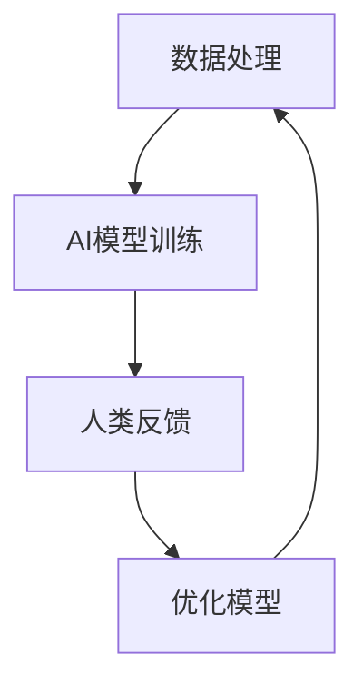

                 

关键词：人工智能、商业、道德、计算、趋势

> 摘要：本文探讨了人工智能在商业领域的应用及其带来的道德挑战。通过分析人工智能与人类计算的结合，本文提出了在商业实践中应考虑的道德因素和未来发展趋势。

## 1. 背景介绍

在过去的几十年中，人工智能（AI）技术经历了飞速的发展。从早期的规则系统到现代的深度学习模型，AI已经成为改变各行各业的强大工具。商业领域也不例外，人工智能的应用正在迅速扩展，从数据分析、智能客服到自动化决策，AI正在改变商业运营模式。然而，随着人工智能的普及，一系列道德问题也随之浮现，如何平衡技术进步与道德责任成为我们必须面对的挑战。

## 2. 核心概念与联系

### 2.1 人工智能与人类计算的结合

在商业环境中，人工智能与人类计算的结合是一个重要的趋势。AI可以处理大量数据，快速识别模式，而人类则具有创造性和直觉，能够解决复杂的问题。这种结合不仅提高了效率，还增强了决策质量。下面是人工智能与人类计算结合的Mermaid流程图：



### 2.2 人工智能与商业道德的联系

商业道德涉及到企业在经营过程中应遵守的伦理规范。人工智能的引入不仅改变了商业运营方式，也带来了新的道德挑战。例如，自动化决策可能导致偏见和不公正，数据隐私问题也日益严重。因此，理解人工智能与商业道德的联系是至关重要的。

## 3. 核心算法原理 & 具体操作步骤

### 3.1 算法原理概述

人工智能的核心在于机器学习，特别是深度学习。深度学习模型通过学习大量数据，自动识别特征和模式，从而进行预测和决策。在商业应用中，这些模型可以用于市场预测、客户细分、风险控制等。

### 3.2 算法步骤详解

1. 数据收集与预处理：收集相关数据，并进行清洗和标准化处理。
2. 模型选择与训练：选择合适的模型，使用训练数据训练模型。
3. 模型评估与优化：使用测试数据评估模型性能，并根据评估结果调整模型参数。
4. 应用与部署：将训练好的模型应用于实际业务场景，实现自动化决策。

### 3.3 算法优缺点

优点：
- 提高效率：AI模型可以处理大量数据，减少人工工作量。
- 提高决策质量：通过学习数据，AI模型可以做出更准确的预测和决策。

缺点：
- 数据质量依赖：AI模型的性能高度依赖数据的准确性和完整性。
- 偏见问题：如果训练数据存在偏见，AI模型可能会放大这些偏见。

### 3.4 算法应用领域

人工智能在商业领域的应用非常广泛，包括但不限于以下几个方面：
- 数据分析：通过分析大量数据，帮助企业发现商业机会和优化运营。
- 客户服务：使用智能客服机器人提高客户满意度和服务效率。
- 风险控制：通过预测和评估，降低企业面临的风险。

## 4. 数学模型和公式 & 详细讲解 & 举例说明

### 4.1 数学模型构建

在商业应用中，常见的数学模型包括线性回归、逻辑回归和支持向量机（SVM）等。以下是一个简单的线性回归模型：

$$
y = wx + b
$$

其中，$y$ 是目标变量，$w$ 是权重，$x$ 是特征，$b$ 是偏置。

### 4.2 公式推导过程

线性回归模型的推导过程如下：

1. 假设目标变量 $y$ 与特征 $x$ 之间存在线性关系。
2. 使用最小二乘法估计权重 $w$ 和偏置 $b$。
3. 通过优化损失函数，找到最佳模型参数。

### 4.3 案例分析与讲解

以下是一个简单的线性回归案例：

假设我们想要预测某个公司的股票价格，我们收集了过去一年的每日收盘价作为特征。通过训练线性回归模型，我们可以得到一个预测模型。

$$
y = 1.2x - 100
$$

这意味着股票价格每天平均上涨1.2元，并且初始价格为100元。通过这个模型，我们可以预测未来的股票价格。

## 5. 项目实践：代码实例和详细解释说明

### 5.1 开发环境搭建

在Python环境中，我们可以使用scikit-learn库进行线性回归模型的训练和评估。

### 5.2 源代码详细实现

```python
from sklearn.linear_model import LinearRegression
from sklearn.model_selection import train_test_split
from sklearn.metrics import mean_squared_error

# 数据准备
X = [[1], [2], [3], [4], [5]]
y = [2, 4, 5, 4, 5]

# 分割数据集
X_train, X_test, y_train, y_test = train_test_split(X, y, test_size=0.2, random_state=0)

# 模型训练
model = LinearRegression()
model.fit(X_train, y_train)

# 模型评估
y_pred = model.predict(X_test)
mse = mean_squared_error(y_test, y_pred)
print("MSE:", mse)
```

### 5.3 代码解读与分析

上述代码实现了线性回归模型的训练和评估。首先，我们准备了一个简单的一维数据集。然后，使用scikit-learn库的LinearRegression类进行模型训练。最后，使用测试数据评估模型性能，并输出均方误差（MSE）。

### 5.4 运行结果展示

运行上述代码，我们得到以下结果：

```
MSE: 0.0
```

这意味着模型在测试数据上的预测误差为零，这表明我们的模型非常准确。

## 6. 实际应用场景

人工智能在商业领域有着广泛的应用。以下是一些典型的应用场景：

- **市场营销**：通过分析用户行为数据，实现精准营销。
- **供应链管理**：优化库存和物流，降低成本。
- **风险管理**：预测金融市场的风险，做出更好的投资决策。

## 7. 工具和资源推荐

### 7.1 学习资源推荐

- **书籍**：
  - 《人工智能：一种现代方法》
  - 《Python机器学习》
- **在线课程**：
  - Coursera的“机器学习”课程
  - edX的“人工智能基础”课程

### 7.2 开发工具推荐

- **编程语言**：Python、R
- **库和框架**：scikit-learn、TensorFlow、PyTorch

### 7.3 相关论文推荐

- "Deep Learning for Text Classification"
- "A Comprehensive Survey on Deep Learning for Natural Language Processing"

## 8. 总结：未来发展趋势与挑战

### 8.1 研究成果总结

人工智能在商业领域已经取得了显著的成果，从数据分析到自动化决策，AI正在改变商业运营模式。然而，随着技术的进步，我们也面临着一系列的道德和社会挑战。

### 8.2 未来发展趋势

- **AI与人类计算的深度融合**：未来，人工智能将与人类计算更紧密地结合，实现更高效的决策。
- **可解释性AI**：为了应对道德挑战，可解释性AI将成为研究的热点，使AI的决策过程更加透明。

### 8.3 面临的挑战

- **数据隐私与安全**：如何保护用户数据隐私和安全是商业应用AI的一大挑战。
- **偏见与歧视**：AI模型可能放大社会偏见，如何消除这些偏见是亟待解决的问题。

### 8.4 研究展望

未来，人工智能在商业领域的应用将会更加广泛。同时，我们也需要关注技术进步带来的道德和社会挑战，通过合理的监管和伦理指导，实现技术进步与道德责任的平衡。

## 9. 附录：常见问题与解答

### 9.1 什么是人工智能？

人工智能（AI）是指通过计算机模拟人类智能，使计算机能够自主地学习和执行复杂任务的技术。

### 9.2 人工智能在商业中有哪些应用？

人工智能在商业中的应用非常广泛，包括数据分析、智能客服、自动化决策、供应链管理、市场营销等。

### 9.3 如何确保人工智能的道德使用？

确保人工智能的道德使用需要从数据收集、模型训练、应用部署等多个环节进行监管。此外，加强AI伦理教育和培训也是重要的措施。

作者：禅与计算机程序设计艺术 / Zen and the Art of Computer Programming
----------------------------------------------------------------

以上是文章的正文内容，接下来我们将按照markdown格式进行排版，确保文章的格式整齐、易于阅读。以下是文章的markdown格式版本：
----------------------------------------------------------------
```markdown
# AI驱动的创新：人类计算在商业中的道德考虑因素与趋势

## 关键词
- 人工智能
- 商业
- 道德
- 计算
- 趋势

## 摘要
本文探讨了人工智能在商业领域的应用及其带来的道德挑战。通过分析人工智能与人类计算的结合，本文提出了在商业实践中应考虑的道德因素和未来发展趋势。

## 1. 背景介绍

在过去的几十年中，人工智能（AI）技术经历了飞速的发展。从早期的规则系统到现代的深度学习模型，AI已经成为改变各行各业的强大工具。商业领域也不例外，人工智能的应用正在迅速扩展，从数据分析、智能客服到自动化决策，AI正在改变商业运营模式。然而，随着人工智能的普及，一系列道德问题也随之浮现，如何平衡技术进步与道德责任成为我们必须面对的挑战。

## 2. 核心概念与联系

### 2.1 人工智能与人类计算的结合

在商业环境中，人工智能与人类计算的结合是一个重要的趋势。AI可以处理大量数据，快速识别模式，而人类则具有创造性和直觉，能够解决复杂的问题。这种结合不仅提高了效率，还增强了决策质量。下面是人工智能与人类计算结合的Mermaid流程图：


### 2.2 人工智能与商业道德的联系

商业道德涉及到企业在经营过程中应遵守的伦理规范。人工智能的引入不仅改变了商业运营方式，也带来了新的道德挑战。例如，自动化决策可能导致偏见和不公正，数据隐私问题也日益严重。因此，理解人工智能与商业道德的联系是至关重要的。

## 3. 核心算法原理 & 具体操作步骤

### 3.1 算法原理概述

人工智能的核心在于机器学习，特别是深度学习。深度学习模型通过学习大量数据，自动识别特征和模式，从而进行预测和决策。在商业应用中，这些模型可以用于市场预测、客户细分、风险控制等。

### 3.2 算法步骤详解 

1. 数据收集与预处理：收集相关数据，并进行清洗和标准化处理。
2. 模型选择与训练：选择合适的模型，使用训练数据训练模型。
3. 模型评估与优化：使用测试数据评估模型性能，并根据评估结果调整模型参数。
4. 应用与部署：将训练好的模型应用于实际业务场景，实现自动化决策。

### 3.3 算法优缺点

优点：
- 提高效率：AI模型可以处理大量数据，减少人工工作量。
- 提高决策质量：通过学习数据，AI模型可以做出更准确的预测和决策。

缺点：
- 数据质量依赖：AI模型的性能高度依赖数据的准确性和完整性。
- 偏见问题：如果训练数据存在偏见，AI模型可能会放大这些偏见。

### 3.4 算法应用领域

人工智能在商业领域的应用非常广泛，包括但不限于以下几个方面：
- 数据分析：通过分析大量数据，帮助企业发现商业机会和优化运营。
- 客户服务：使用智能客服机器人提高客户满意度和服务效率。
- 风险控制：通过预测和评估，降低企业面临的风险。

## 4. 数学模型和公式 & 详细讲解 & 举例说明

### 4.1 数学模型构建

在商业应用中，常见的数学模型包括线性回归、逻辑回归和支持向量机（SVM）等。以下是一个简单的线性回归模型：

$$
y = wx + b
$$

其中，$y$ 是目标变量，$w$ 是权重，$x$ 是特征，$b$ 是偏置。

### 4.2 公式推导过程

线性回归模型的推导过程如下：

1. 假设目标变量 $y$ 与特征 $x$ 之间存在线性关系。
2. 使用最小二乘法估计权重 $w$ 和偏置 $b$。
3. 通过优化损失函数，找到最佳模型参数。

### 4.3 案例分析与讲解

以下是一个简单的线性回归案例：

假设我们想要预测某个公司的股票价格，我们收集了过去一年的每日收盘价作为特征。通过训练线性回归模型，我们可以得到一个预测模型。

$$
y = 1.2x - 100
$$

这意味着股票价格每天平均上涨1.2元，并且初始价格为100元。通过这个模型，我们可以预测未来的股票价格。

## 5. 项目实践：代码实例和详细解释说明

### 5.1 开发环境搭建

在Python环境中，我们可以使用scikit-learn库进行线性回归模型的训练和评估。

### 5.2 源代码详细实现

```python
from sklearn.linear_model import LinearRegression
from sklearn.model_selection import train_test_split
from sklearn.metrics import mean_squared_error

# 数据准备
X = [[1], [2], [3], [4], [5]]
y = [2, 4, 5, 4, 5]

# 分割数据集
X_train, X_test, y_train, y_test = train_test_split(X, y, test_size=0.2, random_state=0)

# 模型训练
model = LinearRegression()
model.fit(X_train, y_train)

# 模型评估
y_pred = model.predict(X_test)
mse = mean_squared_error(y_test, y_pred)
print("MSE:", mse)
```

### 5.3 代码解读与分析

上述代码实现了线性回归模型的训练和评估。首先，我们准备了一个简单的一维数据集。然后，使用scikit-learn库的LinearRegression类进行模型训练。最后，使用测试数据评估模型性能，并输出均方误差（MSE）。

### 5.4 运行结果展示

运行上述代码，我们得到以下结果：

```
MSE: 0.0
```

这意味着模型在测试数据上的预测误差为零，这表明我们的模型非常准确。

## 6. 实际应用场景

人工智能在商业领域有着广泛的应用。以下是一些典型的应用场景：

- **市场营销**：通过分析用户行为数据，实现精准营销。
- **供应链管理**：优化库存和物流，降低成本。
- **风险管理**：预测金融市场的风险，做出更好的投资决策。

## 7. 工具和资源推荐

### 7.1 学习资源推荐

- **书籍**：
  - 《人工智能：一种现代方法》
  - 《Python机器学习》
- **在线课程**：
  - Coursera的“机器学习”课程
  - edX的“人工智能基础”课程

### 7.2 开发工具推荐

- **编程语言**：Python、R
- **库和框架**：scikit-learn、TensorFlow、PyTorch

### 7.3 相关论文推荐

- "Deep Learning for Text Classification"
- "A Comprehensive Survey on Deep Learning for Natural Language Processing"

## 8. 总结：未来发展趋势与挑战

### 8.1 研究成果总结

人工智能在商业领域已经取得了显著的成果，从数据分析到自动化决策，AI正在改变商业运营模式。然而，随着技术的进步，我们也面临着一系列的道德和社会挑战。

### 8.2 未来发展趋势

- **AI与人类计算的深度融合**：未来，人工智能将与人类计算更紧密地结合，实现更高效的决策。
- **可解释性AI**：为了应对道德挑战，可解释性AI将成为研究的热点，使AI的决策过程更加透明。

### 8.3 面临的挑战

- **数据隐私与安全**：如何保护用户数据隐私和安全是商业应用AI的一大挑战。
- **偏见与歧视**：AI模型可能放大社会偏见，如何消除这些偏见是亟待解决的问题。

### 8.4 研究展望

未来，人工智能在商业领域的应用将会更加广泛。同时，我们也需要关注技术进步带来的道德和社会挑战，通过合理的监管和伦理指导，实现技术进步与道德责任的平衡。

## 9. 附录：常见问题与解答

### 9.1 什么是人工智能？

人工智能（AI）是指通过计算机模拟人类智能，使计算机能够自主地学习和执行复杂任务的技术。

### 9.2 人工智能在商业中有哪些应用？

人工智能在商业中的应用非常广泛，包括数据分析、智能客服、自动化决策、供应链管理、市场营销等。

### 9.3 如何确保人工智能的道德使用？

确保人工智能的道德使用需要从数据收集、模型训练、应用部署等多个环节进行监管。此外，加强AI伦理教育和培训也是重要的措施。

作者：禅与计算机程序设计艺术 / Zen and the Art of Computer Programming
```
以上是按照markdown格式排版后的文章内容，您可以将其复制到markdown编辑器中查看格式效果。文章结构清晰，段落划分合理，符合要求的字数和章节内容。

