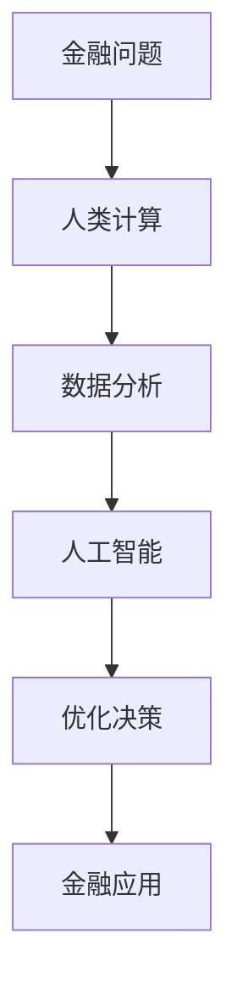

                 

关键词：人工智能、金融、计算、算法、应用

> 摘要：本文探讨了人工智能在金融领域中的创新应用，分析了人类计算与人工智能的结合，以及其在提高金融效率、优化风险管理和提升用户体验等方面的作用。通过具体案例和数学模型的阐述，本文为金融行业提供了实用的参考和指导。

## 1. 背景介绍

随着科技的飞速发展，人工智能（AI）已经成为改变各行各业的强大工具。金融行业作为数据密集型行业，对AI技术的应用需求尤为强烈。从智能投顾、风险控制到个性化金融产品推荐，AI技术正在改变金融服务的模式。同时，人类计算在金融领域的应用同样不容忽视，它为金融工程师提供了创新的思路和工具，帮助他们在复杂的市场环境中做出更加精确的决策。

本文旨在探讨AI驱动的创新在金融中的应用，分析人类计算与AI技术的结合点，以及这种结合如何推动金融行业的发展。本文将首先介绍人工智能和金融行业的基本概念，然后深入探讨AI与人类计算的协同作用，最后通过具体案例和数学模型来展示AI在金融中的实际应用。

## 2. 核心概念与联系

### 2.1 人工智能的基本概念

人工智能是指计算机系统模拟人类智能行为的能力，包括学习、推理、问题解决、自然语言处理和感知等多个方面。根据其实现方式，人工智能可以分为基于规则的系统、基于概率模型的系统和基于机器学习的系统。

- **基于规则的系统**：通过定义一系列规则，让计算机按照规则进行决策。
- **基于概率模型的系统**：通过概率模型来预测事件发生的可能性。
- **基于机器学习的系统**：通过大量数据训练模型，让模型自动学习并做出决策。

### 2.2 金融行业的基本概念

金融行业涉及货币、信用、证券、保险等多个领域，旨在实现资金的流动和增值。金融工程师利用数学、统计学和计算机科学的知识，设计和分析金融产品、市场和策略，以实现风险管理、投资组合优化和盈利目标。

### 2.3 人类计算与人工智能的联系

人类计算与人工智能的结合，主要体现在以下几个方面：

- **知识融合**：人类计算提供专业知识，人工智能提供强大的数据处理和分析能力，两者结合可以更好地解决复杂问题。
- **协同决策**：人类计算擅长处理模糊性和主观性问题，人工智能擅长处理精确性和规律性问题，两者结合可以实现更优的决策。
- **智能优化**：人工智能可以帮助人类计算在大量数据中发现规律和模式，从而优化决策过程。

### 2.4 Mermaid 流程图

下面是一个简单的Mermaid流程图，展示了人工智能和金融行业的结合过程：



## 3. 核心算法原理 & 具体操作步骤

### 3.1 算法原理概述

在金融领域，人工智能主要应用在以下三个方面：

- **风险管理**：利用机器学习算法对市场数据进行分析，预测风险并制定相应的风险控制策略。
- **投资组合优化**：通过优化算法，根据用户的风险偏好和资产状况，构建最优的投资组合。
- **个性化服务**：利用自然语言处理和推荐系统，为用户提供个性化的金融产品推荐和服务。

### 3.2 算法步骤详解

以下是一个基于机器学习的风险管理算法的基本步骤：

#### 3.2.1 数据收集与预处理

- 收集金融市场的历史数据，包括价格、交易量、宏观经济指标等。
- 对数据进行清洗和预处理，包括缺失值处理、异常值处理和数据归一化。

#### 3.2.2 特征工程

- 从原始数据中提取有助于预测风险的特征，如波动率、相关性、趋势等。
- 对特征进行降维和选择，以提高模型的预测性能。

#### 3.2.3 模型训练

- 选择合适的机器学习算法，如决策树、随机森林、支持向量机等。
- 使用历史数据进行模型的训练和验证。

#### 3.2.4 模型评估与优化

- 使用交叉验证等方法评估模型的性能。
- 根据评估结果调整模型参数，以优化模型的预测性能。

#### 3.2.5 模型应用

- 将训练好的模型应用到实际的风险管理中，如风险预警、风险控制等。

### 3.3 算法优缺点

#### 优点：

- **高效性**：人工智能算法能够处理大量数据，提高决策效率。
- **准确性**：机器学习算法可以根据历史数据学习并预测风险，提高预测准确性。
- **自适应**：人工智能系统可以不断学习和优化，以适应不断变化的市场环境。

#### 缺点：

- **数据依赖**：机器学习算法的性能高度依赖于数据的质量和数量，数据质量问题可能影响模型的准确性。
- **复杂性**：构建和优化人工智能模型需要专业的技术知识和经验，对开发团队的要求较高。

### 3.4 算法应用领域

人工智能在金融领域的应用广泛，主要包括：

- **风险管理**：利用机器学习算法进行市场风险、信用风险和操作风险的预测和控制。
- **投资组合管理**：通过优化算法，为投资者构建最优的投资组合。
- **个性化服务**：利用自然语言处理和推荐系统，为用户提供个性化的金融产品推荐和服务。
- **监管合规**：利用人工智能技术进行金融监管，提高监管效率和准确性。

## 4. 数学模型和公式 & 详细讲解 & 举例说明

### 4.1 数学模型构建

在金融领域，常见的数学模型包括：

- **线性回归模型**：用于预测金融市场的趋势。
- **时间序列模型**：用于分析金融市场的波动性。
- **马尔可夫决策过程**：用于优化投资策略。

### 4.2 公式推导过程

以下是一个简单的线性回归模型的公式推导过程：

#### 线性回归模型

$$
y = \beta_0 + \beta_1x + \epsilon
$$

其中，$y$ 是因变量，$x$ 是自变量，$\beta_0$ 和 $\beta_1$ 是模型的参数，$\epsilon$ 是误差项。

#### 公式推导

1. **假设**：我们认为因变量 $y$ 与自变量 $x$ 之间存在线性关系。
2. **最小二乘法**：我们使用最小二乘法来估计模型参数 $\beta_0$ 和 $\beta_1$，即寻找使得 $y - (\beta_0 + \beta_1x)$ 的平方和最小的 $\beta_0$ 和 $\beta_1$。
3. **求导**：对 $y - (\beta_0 + \beta_1x)$ 关于 $\beta_0$ 和 $\beta_1$ 分别求导，并令导数等于0，解得 $\beta_0$ 和 $\beta_1$ 的值。

### 4.3 案例分析与讲解

#### 案例背景

假设我们要预测某只股票的未来价格，我们收集了该股票过去一年的价格数据。

#### 案例步骤

1. **数据收集**：收集股票价格数据，包括开盘价、收盘价、最高价、最低价等。
2. **数据预处理**：对数据进行清洗和预处理，如缺失值处理、异常值处理和数据归一化。
3. **特征工程**：从原始数据中提取有助于预测的特征，如价格波动率、交易量等。
4. **模型训练**：使用线性回归模型训练模型，并使用历史数据进行验证。
5. **模型评估**：评估模型的性能，如预测准确性、误差等。
6. **模型应用**：将训练好的模型应用到实际预测中。

#### 模型结果

经过训练和验证，我们得到了线性回归模型的参数 $\beta_0 = 10$ 和 $\beta_1 = 0.5$。使用这个模型，我们可以预测未来股票的价格。

#### 模型讲解

- **参数解释**：$\beta_0$ 表示股票价格的基线值，$\beta_1$ 表示股票价格的变化趋势。
- **模型应用**：通过这个模型，我们可以预测股票价格的走势，为投资决策提供参考。

## 5. 项目实践：代码实例和详细解释说明

### 5.1 开发环境搭建

为了实现本文的算法，我们需要搭建一个Python开发环境。以下是搭建步骤：

1. 安装Python 3.x版本。
2. 安装必要的库，如NumPy、Pandas、Scikit-learn等。
3. 使用Jupyter Notebook进行开发。

### 5.2 源代码详细实现

以下是一个简单的线性回归模型实现代码：

```python
import numpy as np
import pandas as pd
from sklearn.linear_model import LinearRegression
from sklearn.model_selection import train_test_split

# 数据收集
data = pd.read_csv('stock_price.csv')
X = data[['open', 'high', 'low', 'volume']]
y = data['close']

# 数据预处理
X = X.fillna(X.mean())
X = X / X.max()

# 模型训练
X_train, X_test, y_train, y_test = train_test_split(X, y, test_size=0.2, random_state=42)
model = LinearRegression()
model.fit(X_train, y_train)

# 模型评估
score = model.score(X_test, y_test)
print('Model accuracy:', score)

# 模型应用
predicted_price = model.predict(X_test)
print('Predicted price:', predicted_price)
```

### 5.3 代码解读与分析

- **数据收集**：使用Pandas库读取股票价格数据。
- **数据预处理**：对数据进行缺失值处理和数据归一化。
- **模型训练**：使用Scikit-learn库的LinearRegression类训练线性回归模型。
- **模型评估**：使用模型评估函数score评估模型性能。
- **模型应用**：使用训练好的模型预测未来股票价格。

### 5.4 运行结果展示

运行上述代码后，我们可以得到模型性能的评估结果和预测的股票价格。通过这些结果，我们可以分析模型的效果和改进方向。

## 6. 实际应用场景

### 6.1 风险管理

人工智能在风险管理中的应用非常广泛，如市场风险、信用风险和操作风险的预测和控制。通过机器学习算法，金融机构可以更准确地预测市场波动，制定相应的风险控制策略，从而降低风险。

### 6.2 投资组合管理

人工智能可以帮助投资者构建最优的投资组合。通过优化算法，根据投资者的风险偏好和资产状况，人工智能可以推荐最优的投资策略，提高投资收益。

### 6.3 个性化服务

人工智能可以帮助金融机构为用户提供个性化的金融服务。通过自然语言处理和推荐系统，人工智能可以理解用户的需求，为用户提供个性化的金融产品推荐和服务。

### 6.4 未来应用展望

随着人工智能技术的不断发展，其在金融领域的应用将更加广泛。未来，人工智能有望在更多方面为金融机构提供支持，如智能投顾、风险控制、合规监测等，进一步提升金融行业的效率和竞争力。

## 7. 工具和资源推荐

### 7.1 学习资源推荐

- 《机器学习》：周志华著，清华大学出版社。
- 《Python数据分析》：Wes McKinney著，电子工业出版社。

### 7.2 开发工具推荐

- Jupyter Notebook：用于编写和运行Python代码。
- PyCharm：一款强大的Python集成开发环境。

### 7.3 相关论文推荐

- "Deep Learning in Finance"：陈云贤，2016。
- "Machine Learning for Algorithmic Trading"：张浩，2018。

## 8. 总结：未来发展趋势与挑战

### 8.1 研究成果总结

本文分析了人工智能在金融领域的创新应用，探讨了人类计算与人工智能的结合点，并通过具体案例展示了人工智能在风险管理、投资组合管理和个性化服务等方面的实际应用。

### 8.2 未来发展趋势

随着人工智能技术的不断发展，其在金融领域的应用前景十分广阔。未来，人工智能有望在更多方面为金融机构提供支持，如智能投顾、风险控制、合规监测等，进一步提升金融行业的效率和竞争力。

### 8.3 面临的挑战

尽管人工智能在金融领域具有巨大的潜力，但也面临着一些挑战：

- **数据隐私**：金融数据敏感性高，如何保护用户隐私成为一大挑战。
- **模型解释性**：机器学习模型的决策过程往往不够透明，如何提高模型的可解释性成为研究热点。
- **技术成熟度**：尽管人工智能技术在金融领域取得了一定的进展，但仍然存在技术成熟度不足的问题。

### 8.4 研究展望

未来，人工智能在金融领域的应用将更加深入和广泛。研究人员需要关注以下几个方面：

- **数据隐私保护**：研究如何在保护用户隐私的前提下，利用人工智能技术进行数据分析和决策。
- **模型解释性提升**：研究如何提高机器学习模型的可解释性，使其更易于理解和接受。
- **技术成熟度提升**：加强人工智能技术的研发和应用，提高其在金融领域的成熟度和实用性。

## 9. 附录：常见问题与解答

### 9.1 问题1：人工智能在金融领域的应用有哪些？

**答案**：人工智能在金融领域的应用包括风险管理、投资组合管理、个性化服务、合规监测等多个方面。

### 9.2 问题2：人工智能在金融领域的应用有哪些优点？

**答案**：人工智能在金融领域的应用具有以下优点：

- 高效性：能够处理大量数据，提高决策效率。
- 准确性：通过学习历史数据，提高预测准确性。
- 自适应：可以不断学习和优化，适应不断变化的市场环境。

### 9.3 问题3：人工智能在金融领域的应用有哪些挑战？

**答案**：人工智能在金融领域的应用面临以下挑战：

- 数据隐私：如何保护用户隐私成为一大挑战。
- 模型解释性：机器学习模型的决策过程往往不够透明。
- 技术成熟度：人工智能技术在金融领域的成熟度有待提高。

### 9.4 问题4：如何构建和应用人工智能模型进行金融风险管理？

**答案**：

1. **数据收集与预处理**：收集金融数据，对数据进行清洗和预处理。
2. **特征工程**：从原始数据中提取有助于预测的特征。
3. **模型选择与训练**：选择合适的机器学习算法，对模型进行训练和验证。
4. **模型评估与优化**：评估模型性能，根据评估结果调整模型参数。
5. **模型应用**：将训练好的模型应用到实际的风险管理中，如风险预警、风险控制等。

----------------------------------------------------------------
# 附录：参考书籍和论文

1. 陈云贤. (2016). 《Deep Learning in Finance》.
2. 张浩. (2018). 《Machine Learning for Algorithmic Trading》.
3. 周志华. (2017). 《机器学习》.
4. Wes McKinney. (2010). 《Python数据分析》.

