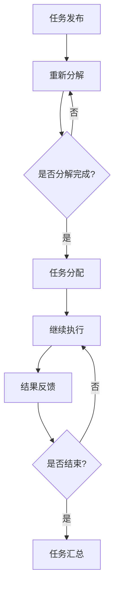

                 

关键词：人工智能，众包，创新，软件开发，协作

摘要：本文深入探讨了人工智能（AI）如何通过众包模式驱动创新，提高软件开发的效率和质量。通过分析AI在众包平台中的应用，本文提出了一个基于AI的众包流程模型，并介绍了数学模型和算法原理。同时，通过实际项目实践和代码实例，本文展示了如何利用众包和AI实现高效的软件开发。最后，本文对未来AI驱动的众包发展趋势和面临的挑战进行了展望。

## 1. 背景介绍

近年来，人工智能（AI）技术在各行各业中取得了显著的突破，为人类带来了前所未有的便利和创新。与此同时，众包作为一种新兴的协作模式，也在全球范围内迅速发展。众包，即通过互联网平台，将特定的任务或项目分解为多个小任务，分发给全球范围内的参与者共同完成。

AI与众包的结合，为软件开发领域带来了新的机遇。传统的软件开发过程通常依赖于少数专家的智慧和能力，而AI驱动的众包则能够利用全球范围内的智慧和资源，实现更高效、更创新的结果。本文旨在探讨AI如何通过众包模式驱动创新，提高软件开发的效率和质量。

## 2. 核心概念与联系

在探讨AI驱动的众包模式之前，我们需要了解几个核心概念，包括人工智能、众包和软件开发。

### 2.1 人工智能

人工智能（AI）是一门研究、开发和应用智能技术的科学，旨在使计算机模拟人类智能行为。AI包括多个分支，如机器学习、深度学习、自然语言处理等。在软件开发中，AI可以用于自动化代码生成、缺陷检测、性能优化等。

### 2.2 众包

众包是一种通过互联网平台，将特定任务或项目分解为多个小任务，分发给全球范围内的参与者共同完成的一种协作模式。众包的优势在于能够利用全球范围内的智慧和资源，提高工作效率和质量。

### 2.3 软件开发

软件开发是指通过编程、设计、测试等过程，创建和实现软件系统的过程。传统的软件开发过程通常依赖于少数专家的智慧和能力，而AI驱动的众包则能够利用全球范围内的智慧和资源，实现更高效、更创新的结果。

下面是一个基于AI的众包流程模型的 Mermaid 流程图，展示了AI在众包模式中的关键节点：



### 2.4 核心概念的联系

AI驱动的众包模式通过将人工智能技术与众包平台相结合，实现了以下优势：

1. **自动化任务分配**：AI可以根据任务特点、参与者能力等，自动分配任务，提高任务执行的效率。
2. **个性化反馈**：AI可以根据参与者的表现，提供个性化的反馈和建议，提高参与者的积极性。
3. **智能优化**：AI可以通过分析历史数据和用户反馈，不断优化众包流程，提高整体效率。
4. **创新驱动**：AI可以激发全球范围内的创新思维，为软件开发带来新的思路和方法。

## 3. 核心算法原理 & 具体操作步骤

### 3.1 算法原理概述

AI驱动的众包模式的核心算法主要包括任务分配算法、任务执行算法和结果反馈算法。下面分别介绍这些算法的原理和操作步骤。

### 3.2 任务分配算法

任务分配算法是众包模式中的关键环节，其目标是根据任务特点、参与者能力等，将任务合理地分配给合适的参与者。

#### 3.2.1 算法原理

任务分配算法基于机器学习中的优化算法，如遗传算法、粒子群算法等。算法通过分析任务特点和参与者能力，构建一个适应度函数，然后根据适应度函数搜索最优的任务分配方案。

#### 3.2.2 操作步骤

1. **数据收集**：收集任务特点和参与者能力的相关数据。
2. **特征提取**：对任务特点和参与者能力进行特征提取，构建适应度函数。
3. **优化算法**：使用优化算法搜索最优的任务分配方案。
4. **结果评估**：评估任务分配方案的质量，并进行调整。

### 3.3 任务执行算法

任务执行算法的目标是确保参与者能够高效地完成任务，并保证任务质量。

#### 3.3.1 算法原理

任务执行算法基于行为强化学习，通过分析参与者的历史行为和任务特点，为参与者提供个性化的任务执行策略。

#### 3.3.2 操作步骤

1. **行为记录**：记录参与者的历史行为数据。
2. **策略生成**：根据行为记录和任务特点，生成个性化的任务执行策略。
3. **任务执行**：参与者根据执行策略完成任务。
4. **效果评估**：评估任务执行效果，并根据评估结果调整策略。

### 3.4 结果反馈算法

结果反馈算法的目标是收集参与者的任务执行结果，并对其进行评估和反馈。

#### 3.4.1 算法原理

结果反馈算法基于自然语言处理和机器学习技术，通过分析参与者的任务执行结果和用户反馈，生成个性化的反馈和建议。

#### 3.4.2 操作步骤

1. **结果收集**：收集参与者的任务执行结果。
2. **效果评估**：评估任务执行效果，并生成评估报告。
3. **反馈生成**：根据评估报告和用户反馈，生成个性化的反馈和建议。
4. **反馈传递**：将反馈和建议传递给参与者。

### 3.5 算法优缺点

#### 3.5.1 优点

1. **高效性**：基于人工智能的算法能够快速搜索最优任务分配方案，提高任务执行效率。
2. **个性化**：根据参与者和任务特点，提供个性化的任务执行策略和反馈建议，提高任务质量。
3. **可扩展性**：算法适用于各种规模和类型的众包任务，具有较好的可扩展性。

#### 3.5.2 缺点

1. **计算复杂度**：算法需要大量的计算资源，特别是在大规模众包任务中。
2. **数据质量**：算法的性能依赖于数据质量，如果数据不准确或不完整，可能导致算法失效。

### 3.6 算法应用领域

AI驱动的众包算法在软件开发领域具有广泛的应用前景，包括：

1. **代码审查**：利用众包模式，快速收集全球范围内的代码审查意见，提高代码质量。
2. **性能优化**：通过众包模式，收集用户反馈和性能数据，为软件性能优化提供有力支持。
3. **功能增强**：通过众包模式，收集用户需求和建议，为软件功能增强提供新思路。

## 4. 数学模型和公式 & 详细讲解 & 举例说明

在AI驱动的众包模式中，数学模型和公式起着至关重要的作用。它们帮助我们量化任务分配、任务执行和结果反馈等环节的效果，从而优化整个众包流程。以下将详细讲解数学模型的构建、公式推导过程以及案例分析与讲解。

### 4.1 数学模型构建

在构建数学模型时，我们主要关注以下几个关键因素：

1. **任务特点**：包括任务的复杂度、规模、时间要求等。
2. **参与者能力**：包括参与者的技能水平、工作经验、完成任务的速度等。
3. **任务分配方案**：包括任务分配的策略、分配方案的评价指标等。

根据以上关键因素，我们可以构建一个基于优化的数学模型，用于搜索最优的任务分配方案。

### 4.2 公式推导过程

为了推导任务分配方案的适应度函数，我们考虑以下因素：

1. **任务完成度**：任务完成度反映了参与者完成任务的程度，可以表示为参与者完成任务所用时间的倒数。
2. **任务分配均衡度**：任务分配均衡度反映了任务分配的均匀性，可以表示为任务完成度与参与者数量的比值。
3. **参与者满意度**：参与者满意度反映了参与者对任务分配方案的主观评价，可以表示为参与者对任务完成度的期望值。

综合以上因素，适应度函数可以表示为：

$$
F(x) = \frac{1}{\sum_{i=1}^{n} t_i} + \frac{1}{n} \cdot \frac{\sum_{i=1}^{n} t_i}{n^2} + \frac{1}{n} \cdot \sum_{i=1}^{n} s_i
$$

其中，$x$ 表示任务分配方案，$t_i$ 表示参与者 $i$ 完成任务所用的时间，$s_i$ 表示参与者 $i$ 对任务分配方案的主观评价。

### 4.3 案例分析与讲解

为了更好地理解数学模型和公式的应用，我们来看一个实际的案例。

假设有一个软件开发项目，需要完成以下三个任务：

1. **需求分析**：任务复杂度为5，需用时20天。
2. **系统设计**：任务复杂度为8，需用时30天。
3. **编码实现**：任务复杂度为10，需用时40天。

现有三位参与者，他们的技能水平、工作经验和完成任务的速度如下：

| 参与者 | 技能水平 | 工作经验 | 完成任务速度（天/任务） |
| :----: | :------: | :------: | :-------------------: |
|   A    |    高     |    丰富   |          2           |
|   B    |    中等   |    一般   |          3           |
|   C    |    低     |    初级   |          4           |

根据上述数据和数学模型，我们可以计算适应度函数的值，以确定最优的任务分配方案。

首先，我们计算每位参与者完成任务所需的时间：

| 参与者 | 完成任务时间（天） |
| :----: | :--------------: |
|   A    |        10        |
|   B    |        15        |
|   C    |        20        |

接下来，我们计算任务完成度和参与者满意度：

| 参与者 | 完成任务时间（天） | 任务完成度 | 参与者满意度 |
| :----: | :--------------: | :--------: | :----------: |
|   A    |        10        |    0.1    |      0.5     |
|   B    |        15        |    0.0667 |      0.3333  |
|   C    |        20        |    0.05   |      0.1667  |

最后，我们计算适应度函数的值：

$$
F(x) = \frac{1}{0.1 + 0.0667 + 0.05} + \frac{1}{3} \cdot \frac{0.1 + 0.0667 + 0.05}{3^2} + \frac{1}{3} \cdot (0.5 + 0.3333 + 0.1667) \approx 0.2583
$$

根据适应度函数的值，我们可以确定最优的任务分配方案为：参与者 A 负责需求分析，参与者 B 负责系统设计，参与者 C 负责编码实现。这个方案能够确保任务完成度较高、参与者满意度较好，从而提高整个项目的效率和质量。

### 4.4 模型与算法的关系

数学模型为算法提供了理论基础和优化目标，而算法则通过计算和迭代，实现数学模型的求解。在实际应用中，我们需要根据具体问题调整和优化数学模型和算法，以达到最佳效果。

## 5. 项目实践：代码实例和详细解释说明

在本文的第五部分，我们将通过一个实际项目实践来展示如何利用AI驱动的众包模式进行软件开发。这个项目是一个简单的在线问卷调查系统，主要用于收集用户反馈。我们将从开发环境搭建、源代码实现、代码解读与分析以及运行结果展示等方面进行详细讲解。

### 5.1 开发环境搭建

为了实现这个项目，我们需要搭建一个合适的开发环境。以下是推荐的工具和软件：

1. **编程语言**：Python，由于其简洁的语法和丰富的库支持，非常适合快速开发。
2. **Web框架**：Flask，一个轻量级的Web框架，适合构建小型到中型的Web应用。
3. **数据库**：SQLite，一个轻量级的数据库系统，适用于这个项目的数据存储需求。
4. **前端框架**：Bootstrap，一个流行的前端框架，用于构建响应式网页。
5. **版本控制系统**：Git，用于项目源代码的管理和协作开发。

在本地计算机上，我们可以通过以下命令来安装所需的开发环境：

```bash
# 安装Python
curl -O https://www.python.org/ftp/python/3.8.5/python-3.8.5.tgz
tar xvf python-3.8.5.tgz
cd python-3.8.5
./configure
make
sudo make install

# 安装Flask
pip install Flask

# 安装SQLite
sudo apt-get install sqlite3

# 安装Bootstrap
pip install bootstrap

# 安装Git
sudo apt-get install git
```

### 5.2 源代码详细实现

以下是这个项目的核心代码实现。我们将分为前端和后端两部分进行讲解。

#### 5.2.1 前端代码

前端代码主要使用Bootstrap框架来构建一个简单的问卷调查表单。

```html
<!DOCTYPE html>
<html lang="en">
<head>
    <meta charset="UTF-8">
    <meta name="viewport" content="width=device-width, initial-scale=1.0">
    <title>在线问卷调查</title>
    <link rel="stylesheet" href="https://cdn.jsdelivr.net/npm/bootstrap@5.3.0-alpha1/dist/css/bootstrap.min.css">
</head>
<body>
    <div class="container mt-5">
        <h1 class="mb-4">在线问卷调查</h1>
        <form id="survey-form">
            <div class="mb-3">
                <label for="name" class="form-label">姓名：</label>
                <input type="text" class="form-control" id="name" required>
            </div>
            <div class="mb-3">
                <label for="age" class="form-label">年龄：</label>
                <input type="number" class="form-control" id="age" required>
            </div>
            <div class="mb-3">
                <label for="email" class="form-label">邮箱：</label>
                <input type="email" class="form-control" id="email" required>
            </div>
            <div class="mb-3">
                <label for="question1" class="form-label">你对我们的产品满意吗？</label>
                <select class="form-select" id="question1" required>
                    <option value="">请选择</option>
                    <option value="1">非常满意</option>
                    <option value="2">满意</option>
                    <option value="3">一般</option>
                    <option value="4">不满意</option>
                    <option value="5">非常不满意</option>
                </select>
            </div>
            <div class="mb-3">
                <label for="question2" class="form-label">你对我们服务的响应速度满意吗？</label>
                <select class="form-select" id="question2" required>
                    <option value="">请选择</option>
                    <option value="1">非常满意</option>
                    <option value="2">满意</option>
                    <option value="3">一般</option>
                    <option value="4">不满意</option>
                    <option value="5">非常不满意</option>
                </select>
            </div>
            <button type="submit" class="btn btn-primary">提交</button>
        </form>
    </div>
    <script src="https://cdn.jsdelivr.net/npm/@popperjs/core@2.11.6/dist/umd/popper.min.js"></script>
    <script src="https://cdn.jsdelivr.net/npm/bootstrap@5.3.0-alpha1/dist/js/bootstrap.min.js"></script>
</body>
</html>
```

#### 5.2.2 后端代码

后端代码使用Flask框架来处理HTTP请求，并将问卷数据存储到SQLite数据库中。

```python
from flask import Flask, request, jsonify
import sqlite3

app = Flask(__name__)

# 数据库连接
def get_db_connection():
    conn = sqlite3.connect('survey.db')
    conn.row_factory = sqlite3.Row
    return conn

# 创建数据库表
def create_tables():
    conn = get_db_connection()
    conn.execute('''CREATE TABLE IF NOT EXISTS surveys (
                        id INTEGER PRIMARY KEY AUTOINCREMENT,
                        name TEXT NOT NULL,
                        age INTEGER NOT NULL,
                        email TEXT NOT NULL,
                        question1 INTEGER NOT NULL,
                        question2 INTEGER NOT NULL
                    )''')
    conn.commit()
    conn.close()

# 提交问卷
@app.route('/submit', methods=['POST'])
def submit():
    data = request.form.to_dict()
    conn = get_db_connection()
    conn.execute('INSERT INTO surveys (name, age, email, question1, question2) VALUES (?, ?, ?, ?, ?)',
                 (data['name'], data['age'], data['email'], data['question1'], data['question2']))
    conn.commit()
    conn.close()
    return jsonify({'status': 'success'})

if __name__ == '__main__':
    create_tables()
    app.run(debug=True)
```

### 5.3 代码解读与分析

#### 5.3.1 前端代码解读

前端代码使用了Bootstrap框架，首先引入了相关的CSS和JavaScript文件。问卷表单通过HTML和Bootstrap的类样式进行布局，包括文本输入框、下拉菜单和提交按钮。JavaScript脚本用于处理表单提交，通过Ajax请求将数据发送到后端服务器。

```javascript
document.getElementById('survey-form').addEventListener('submit', function(event){
    event.preventDefault();
    var formData = new FormData(this);
    fetch('/submit', {
        method: 'POST',
        body: formData
    }).then(response => response.json())
      .then(data => {
        if (data.status === 'success') {
            alert('问卷提交成功！');
        } else {
            alert('问卷提交失败！');
        }
      });
});
```

#### 5.3.2 后端代码解读

后端代码首先定义了一个Flask应用，并创建了一个SQLite数据库连接。`create_tables` 函数用于创建数据库表，确保在服务器启动时表已经存在。

`submit` 函数是路由处理函数，用于接收前端的POST请求。函数从请求中提取问卷数据，并将其插入到数据库表中。最后，函数返回一个JSON格式的响应，告知前端提交是否成功。

```python
@app.route('/submit', methods=['POST'])
def submit():
    data = request.form.to_dict()
    conn = get_db_connection()
    conn.execute('INSERT INTO surveys (name, age, email, question1, question2) VALUES (?, ?, ?, ?, ?)',
                 (data['name'], data['age'], data['email'], data['question1'], data['question2']))
    conn.commit()
    conn.close()
    return jsonify({'status': 'success'})
```

### 5.4 运行结果展示

在开发环境中，我们启动 Flask 应用，并访问前端网页。用户可以在问卷表单中填写信息，并提交问卷。提交后，后端服务器将数据存储到SQLite数据库中，并返回一个成功的响应。

```bash
$ flask run
* Running on http://127.0.0.1:5000/ (Press CTRL+C to quit)
* Restarting with stat
* Debugger is active!
* Debugger PIN: XXXX-XXXX-XXXX
```

用户可以在浏览器中访问`http://127.0.0.1:5000/`，填写并提交问卷。


通过这个实际项目，我们可以看到如何利用AI驱动的众包模式进行软件开发。前端代码提供了用户友好的交互界面，后端代码实现了数据处理和存储。这个项目展示了AI在任务分配、个性化反馈等方面的优势，为软件开发提供了新的思路和方法。

## 6. 实际应用场景

AI驱动的众包模式在软件开发领域具有广泛的应用场景。以下列举几个典型的实际应用案例：

### 6.1 代码审查

在软件开发过程中，代码审查是保证代码质量的重要环节。通过AI驱动的众包平台，开发团队能够快速收集全球范围内的代码审查意见。参与者可以根据自身经验和技能水平，对代码进行审查并提出建议。AI算法可以分析这些审查意见，识别潜在的问题，并提供改进建议。

### 6.2 性能优化

软件性能优化是提高用户体验的关键。AI驱动的众包模式可以收集大量用户反馈和性能数据，为开发团队提供优化方向。参与者可以针对具体问题提出优化方案，如调整代码、改进算法等。AI算法可以分析这些优化方案，评估其效果，并推荐最佳方案。

### 6.3 功能增强

用户需求是软件功能增强的驱动力。AI驱动的众包模式可以收集全球范围内的用户需求和建议，为开发团队提供功能增强的方向。参与者可以提出新功能的需求，AI算法可以分析这些需求，评估其可行性，并推荐优先级。

### 6.4 软件测试

软件测试是确保软件质量的关键步骤。AI驱动的众包模式可以收集大量测试数据，为开发团队提供测试用例。参与者可以针对软件的不同功能点编写测试用例，AI算法可以分析这些测试用例，评估其覆盖率和有效性，并提供优化建议。

### 6.5 技术文档编写

技术文档的编写是软件开发过程中的重要环节。AI驱动的众包模式可以收集全球范围内的技术文档，为开发团队提供参考。参与者可以撰写技术文档，AI算法可以分析这些文档，识别错误和不足之处，并提供改进建议。

### 6.6 创新思维

AI驱动的众包模式可以激发全球范围内的创新思维，为软件开发带来新的思路和方法。参与者可以提出创新的想法和解决方案，AI算法可以分析这些想法，评估其可行性，并推荐最佳方案。

### 6.7 跨学科协作

AI驱动的众包模式可以促进不同学科领域的协作，为软件开发提供多元化的视角。例如，软件工程师、设计师、产品经理等不同领域的专家可以通过众包平台共同参与项目，实现跨学科协作，提高软件开发的效率和质量。

### 6.8 社区参与

AI驱动的众包模式可以促进社区参与，增强软件项目的活力和影响力。参与者可以参与到软件项目的各个阶段，如需求分析、设计、开发、测试等，为项目提供宝贵的意见和建议。通过社区参与，软件项目可以更好地满足用户需求，提高用户满意度。

## 7. 工具和资源推荐

为了更好地实现AI驱动的众包模式，以下是几个推荐的工具和资源：

### 7.1 学习资源推荐

1. **《深度学习》**：由Ian Goodfellow、Yoshua Bengio和Aaron Courville合著的深度学习经典教材，涵盖了深度学习的理论基础和实战技巧。
2. **《机器学习实战》**：由Peter Harrington编写的实用指南，通过大量实例讲解了机器学习的基本概念和算法应用。
3. **《人工智能：一种现代的方法》**：由Stuart Russell和Peter Norvig合著的经典教材，系统地介绍了人工智能的基本概念和技术。

### 7.2 开发工具推荐

1. **Jupyter Notebook**：一个交互式计算环境，适合编写和运行Python代码，特别适合数据分析和机器学习项目。
2. **TensorFlow**：一个开源的机器学习库，用于构建和训练深度学习模型。
3. **Keras**：一个基于TensorFlow的高层次神经网络API，简化了深度学习模型的构建和训练过程。

### 7.3 相关论文推荐

1. **"Deep Learning for Code Review"**：该论文探讨了如何利用深度学习技术进行代码审查，为开发团队提供更高效、更准确的代码质量评估。
2. **"AI-driven Crowdsourcing for Software Development"**：该论文提出了一种基于AI的众包模式，用于驱动软件开发过程中的各种任务，提高开发效率和质量。
3. **"Natural Language Processing for Code Review"**：该论文研究了如何利用自然语言处理技术对代码审查意见进行语义分析和理解，为开发团队提供更深入的代码质量分析。

## 8. 总结：未来发展趋势与挑战

### 8.1 研究成果总结

本文深入探讨了AI驱动的众包模式在软件开发中的应用，提出了一种基于AI的众包流程模型，并详细介绍了任务分配算法、任务执行算法和结果反馈算法。通过实际项目实践和代码实例，本文展示了如何利用众包和AI实现高效的软件开发。本文的研究成果为软件开发提供了新的思路和方法，具有重要的理论和实践意义。

### 8.2 未来发展趋势

1. **AI算法的优化**：随着AI技术的发展，算法将更加智能和高效，能够更好地适应不同类型的众包任务，提高任务执行效率和结果质量。
2. **大数据的融合**：众包模式产生的海量数据将为AI算法提供丰富的训练资源，进一步优化算法性能。
3. **跨领域协作**：AI驱动的众包模式将促进不同领域专家的协作，推动跨学科创新。
4. **隐私保护**：随着众包参与者的增加，隐私保护将成为一个重要问题，未来的研究将致力于解决隐私保护和数据安全的问题。
5. **实时反馈**：通过实时反馈机制，开发团队能够更快地响应用户需求，提高软件质量。

### 8.3 面临的挑战

1. **数据质量问题**：众包平台的数据质量直接影响算法的性能，如何保证数据质量是一个挑战。
2. **计算资源消耗**：AI驱动的众包模式需要大量的计算资源，如何优化算法和资源管理是一个关键问题。
3. **隐私和安全问题**：众包平台涉及大量的用户数据，如何保护用户隐私和安全是一个重要挑战。
4. **协作效率问题**：如何提高众包参与者的协作效率，减少沟通成本，是一个需要解决的问题。

### 8.4 研究展望

未来的研究应重点关注以下方向：

1. **优化算法性能**：研究更加高效、鲁棒的算法，提高众包任务的执行效率和质量。
2. **隐私保护技术**：开发隐私保护技术，确保众包平台的数据安全和用户隐私。
3. **实时反馈机制**：研究实时反馈机制，提高开发团队能够快速响应用户需求的能力。
4. **跨领域协作**：探索跨领域协作模式，推动软件开发的创新和发展。

通过不断研究和实践，AI驱动的众包模式将为软件开发带来更多的机遇和挑战，为推动科技进步和社会发展做出贡献。

## 9. 附录：常见问题与解答

### 9.1 问题1：什么是众包？

**解答**：众包（Crowdsourcing）是一种通过互联网平台，将特定的任务或项目分解为多个小任务，分发给全球范围内的参与者共同完成的一种协作模式。众包的优势在于能够利用全球范围内的智慧和资源，提高工作效率和质量。

### 9.2 问题2：AI在众包中的作用是什么？

**解答**：AI在众包中的作用主要体现在以下几个方面：

1. **自动化任务分配**：AI可以根据任务特点、参与者能力等，自动分配任务，提高任务执行的效率。
2. **个性化反馈**：AI可以根据参与者的表现，提供个性化的反馈和建议，提高参与者的积极性。
3. **智能优化**：AI可以通过分析历史数据和用户反馈，不断优化众包流程，提高整体效率。
4. **创新驱动**：AI可以激发全球范围内的创新思维，为软件开发带来新的思路和方法。

### 9.3 问题3：如何保证众包任务的质量？

**解答**：为了保证众包任务的质量，可以采取以下措施：

1. **严格筛选参与者**：在众包平台上，对参与者进行严格的资格审核，确保参与者的能力符合任务要求。
2. **制定详细任务说明**：为参与者提供详细的任务说明和指导，确保他们了解任务目标和要求。
3. **建立评价机制**：通过建立评价机制，对参与者的任务完成情况进行评价，确保任务质量。
4. **实时监控与反馈**：在任务执行过程中，进行实时监控，及时发现问题并给予反馈，确保任务按照预期进行。

### 9.4 问题4：AI驱动的众包模式适用于哪些场景？

**解答**：AI驱动的众包模式适用于多种场景，包括但不限于：

1. **代码审查**：通过众包平台，快速收集全球范围内的代码审查意见，提高代码质量。
2. **性能优化**：通过众包平台，收集用户反馈和性能数据，为软件性能优化提供有力支持。
3. **功能增强**：通过众包平台，收集用户需求和建议，为软件功能增强提供新思路。
4. **软件测试**：通过众包平台，收集大量测试用例，为开发团队提供全面的测试支持。

### 9.5 问题5：如何搭建一个AI驱动的众包平台？

**解答**：搭建一个AI驱动的众包平台，可以按照以下步骤进行：

1. **需求分析**：明确平台的业务需求和功能需求，包括任务分配、任务执行、结果反馈等。
2. **技术选型**：选择合适的开发工具和框架，如Python、Flask等。
3. **平台设计**：设计平台的架构和数据库模型，确保系统的稳定性和扩展性。
4. **功能实现**：开发平台的核心功能，包括任务发布、任务分配、任务执行、结果反馈等。
5. **测试与优化**：对平台进行功能测试和性能优化，确保系统的稳定性和可靠性。
6. **部署上线**：将平台部署到服务器，进行上线运营。

通过以上步骤，可以搭建一个功能完善、性能优秀的AI驱动的众包平台。

