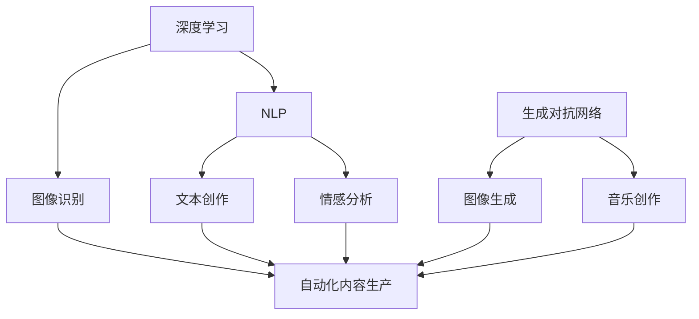

                 

关键词：人工智能，数字内容生产，AI技术，内容创作，自动化，智能化，算法原理，应用领域，未来展望。

> 摘要：随着人工智能技术的飞速发展，AI已经逐渐渗透到各个领域，包括数字内容生产。本文将探讨AI技术在数字内容生产中的应用，从背景介绍、核心概念与联系、核心算法原理、数学模型与公式、项目实践、实际应用场景、工具和资源推荐到总结和未来展望，全面解析AI驱动的数字内容生产革命。

## 1. 背景介绍

数字内容生产是现代信息社会中至关重要的一环。从新闻报道、社交媒体内容、电子商务产品描述，到电影、音乐、电子书等娱乐内容，数字内容的生产、分发和消费已经成为了我们日常生活的一部分。然而，随着互联网的普及和信息爆炸，数字内容的生产速度和数量都在呈指数级增长，这给内容创作者和消费者带来了巨大的压力。

传统的内容生产方式往往依赖于人工创作和编辑，不仅效率低下，而且难以满足不断增长的内容需求。与此同时，人工智能（AI）技术的崛起为数字内容生产带来了新的可能性。AI技术，特别是深度学习、自然语言处理和生成对抗网络（GAN）等，为自动化、智能化内容生产提供了强有力的支持。

本文将探讨AI技术在数字内容生产中的应用，包括核心算法原理、数学模型、项目实践以及未来发展趋势和挑战。通过本文的阅读，读者将能够深入了解AI驱动的数字内容生产革命，并了解到如何利用AI技术提高内容生产效率和品质。

## 2. 核心概念与联系

在深入探讨AI在数字内容生产中的应用之前，我们需要先了解几个核心概念，以及它们之间的联系。

### 2.1 深度学习

深度学习是一种基于人工神经网络的机器学习技术，通过模拟人脑的神经网络结构来学习数据和模式。深度学习在图像识别、语音识别、自然语言处理等领域取得了显著成果，为自动化内容生产提供了可能。

### 2.2 自然语言处理（NLP）

自然语言处理是AI的一个重要分支，旨在使计算机能够理解、处理和生成人类语言。NLP技术在文本分析、情感分析、机器翻译等方面有着广泛的应用，是AI驱动的内容生产的核心技术之一。

### 2.3 生成对抗网络（GAN）

生成对抗网络是由两个神经网络（生成器和判别器）组成的模型，通过对抗训练生成高质量的数据。GAN在图像生成、视频制作、音乐创作等方面展现出了强大的能力。

### 2.4 关联与联系

深度学习和NLP的结合，使得AI能够理解和生成人类语言，从而实现自动化的文本创作和编辑。GAN的引入，则进一步提高了内容生成的质量和多样性。这三个核心概念相互关联，共同推动了AI在数字内容生产中的革命。

### 2.5 Mermaid 流程图

下面是一个简单的Mermaid流程图，展示了这些核心概念之间的关系：



通过这个流程图，我们可以清晰地看到深度学习、NLP和GAN如何相互关联，共同推动数字内容生产的自动化和智能化。

## 3. 核心算法原理 & 具体操作步骤

### 3.1 算法原理概述

在数字内容生产中，AI算法主要分为两大类：基于规则的方法和基于数据的方法。基于规则的方法依赖于预设的规则和模式，而基于数据的方法则通过学习大量数据来发现模式和规律。

其中，深度学习和生成对抗网络是当前应用最广泛的两种算法。

#### 3.1.1 深度学习

深度学习通过多层神经网络对大量数据进行训练，从而学习到复杂的模式和特征。在数字内容生产中，深度学习可以用于图像识别、文本生成、语音合成等任务。

例如，在图像识别中，深度学习模型可以自动识别图片中的物体、场景和动作，从而实现自动化图像标注和分类。在文本生成中，深度学习模型可以生成文章、新闻报道、产品描述等。

#### 3.1.2 生成对抗网络（GAN）

生成对抗网络由生成器和判别器两个神经网络组成。生成器负责生成数据，判别器负责判断数据是真实还是生成的。通过对抗训练，生成器不断提高生成数据的真实性。

在数字内容生产中，GAN可以用于图像生成、视频制作、音乐创作等。例如，生成器可以生成高质量的图像和视频，而判别器则用来判断这些内容是否逼真。

### 3.2 算法步骤详解

#### 3.2.1 深度学习

1. 数据准备：收集大量的图片、文本、音频等数据，并进行预处理。
2. 模型训练：构建多层神经网络，使用预处理的数据进行训练。
3. 模型评估：通过测试数据对模型进行评估，调整模型参数。
4. 应用：将训练好的模型应用于实际内容生产任务，如图像识别、文本生成等。

#### 3.2.2 生成对抗网络（GAN）

1. 数据准备：收集大量的真实数据，用于训练判别器和生成器。
2. 模型构建：构建生成器和判别器神经网络。
3. 对抗训练：同时训练生成器和判别器，生成器和判别器之间进行对抗。
4. 生成数据：生成器生成大量数据，判别器判断数据真实性。
5. 模型评估：通过测试数据对生成器和判别器进行评估。
6. 应用：将训练好的生成器应用于图像生成、视频制作等。

### 3.3 算法优缺点

#### 3.3.1 深度学习

优点：
- 能够处理大规模数据，发现复杂模式和特征。
- 自动化程度高，可以应用于多种内容生产任务。

缺点：
- 对数据质量和数量要求较高，训练过程复杂。
- 模型解释性较差，难以理解模型内部决策过程。

#### 3.3.2 生成对抗网络（GAN）

优点：
- 生成数据质量高，逼真性强。
- 自动化程度高，可以应用于多种内容生成任务。

缺点：
- 训练过程不稳定，容易出现模式崩溃问题。
- 对计算资源要求较高，训练时间较长。

### 3.4 算法应用领域

深度学习和GAN在数字内容生产中有广泛的应用。

- **图像识别与生成**：用于图像分类、物体识别、图像修复、艺术创作等。
- **文本生成与编辑**：用于生成新闻报道、产品描述、文案创作等。
- **语音合成与识别**：用于语音助手、语音翻译、语音识别等。
- **视频生成与编辑**：用于视频制作、视频增强、视频编辑等。
- **音乐创作与生成**：用于音乐创作、音乐风格转换、音乐生成等。

## 4. 数学模型和公式 & 详细讲解 & 举例说明

在数字内容生产中，数学模型和公式是核心算法的基础。以下我们将详细讲解几种常用的数学模型和公式，并通过实际案例进行说明。

### 4.1 数学模型构建

#### 4.1.1 卷积神经网络（CNN）

卷积神经网络是深度学习的一种常见架构，主要用于图像识别和图像处理。其核心是卷积层，通过卷积操作提取图像特征。

$$
\text{卷积层}:\ f_{\text{conv}}(x) = \sum_{i=1}^{k} w_{i} * x
$$

其中，$x$是输入图像，$w_{i}$是卷积核，$*$表示卷积操作。

#### 4.1.2 循环神经网络（RNN）

循环神经网络主要用于处理序列数据，如文本和语音。其核心是隐藏状态，通过循环连接保持长时记忆。

$$
\text{隐藏状态}: h_t = \sigma(W_x x_t + W_h h_{t-1} + b_h)
$$

其中，$x_t$是输入序列，$h_t$是隐藏状态，$\sigma$是激活函数。

#### 4.1.3 生成对抗网络（GAN）

生成对抗网络由生成器和判别器组成，其核心是对抗训练。

$$
\text{生成器}: G(z) = \sigma(W_g z + b_g)
$$

$$
\text{判别器}: D(x) = \sigma(W_d x + b_d)
$$

其中，$z$是随机噪声，$x$是真实数据或生成数据，$W_g$、$W_d$是权重，$b_g$、$b_d$是偏置。

### 4.2 公式推导过程

#### 4.2.1 卷积神经网络（CNN）

卷积神经网络的推导过程如下：

1. **卷积操作**：卷积层通过卷积操作提取图像特征。

   $$ f_{\text{conv}}(x) = \sum_{i=1}^{k} w_{i} * x $$

2. **激活函数**：将卷积结果通过激活函数进行非线性变换。

   $$ a_{\text{conv}} = \sigma(f_{\text{conv}}(x)) $$

3. **池化操作**：对激活结果进行池化操作，减少参数数量。

   $$ p_{\text{pool}}(a_{\text{conv}}) = \max(a_{\text{conv}}) $$

#### 4.2.2 循环神经网络（RNN）

循环神经网络的推导过程如下：

1. **输入序列**：输入序列$x_t$通过权重$W_x$和偏置$b_x$映射到隐藏状态。

   $$ h_t = \sigma(W_x x_t + b_x) $$

2. **隐藏状态**：隐藏状态$h_t$通过权重$W_h$和偏置$b_h$与前一个隐藏状态$h_{t-1}$连接。

   $$ h_t = \sigma(W_h h_{t-1} + b_h) $$

3. **输出序列**：隐藏状态$h_t$通过权重$W_o$和偏置$b_o$映射到输出序列。

   $$ y_t = \sigma(W_o h_t + b_o) $$

#### 4.2.3 生成对抗网络（GAN）

生成对抗网络的推导过程如下：

1. **生成器**：生成器$G(z)$将随机噪声$z$映射到生成数据。

   $$ G(z) = \sigma(W_g z + b_g) $$

2. **判别器**：判别器$D(x)$对真实数据$x$和生成数据$G(z)$进行判断。

   $$ D(x) = \sigma(W_d x + b_d) $$

3. **对抗训练**：生成器和判别器通过对抗训练不断调整参数，以最小化损失函数。

   $$ L(G, D) = -\mathbb{E}_{x \sim p_{\text{data}}(x)}[\log D(x)] - \mathbb{E}_{z \sim p_{\text{noise}}(z)}[\log(1 - D(G(z)))]
   $$

### 4.3 案例分析与讲解

#### 4.3.1 卷积神经网络（CNN）在图像识别中的应用

假设我们有一个图像识别任务，输入图像为$28 \times 28$的灰度图像，输出为10个类别的概率分布。

1. **卷积层**：我们使用一个$3 \times 3$的卷积核，对图像进行卷积操作。

   $$ f_{\text{conv}}(x) = \sum_{i=1}^{k} w_{i} * x $$

2. **激活函数**：使用ReLU激活函数。

   $$ a_{\text{conv}} = \max(0, f_{\text{conv}}(x)) $$

3. **池化层**：使用2x2的最大池化操作。

   $$ p_{\text{pool}}(a_{\text{conv}}) = \max(a_{\text{conv}}) $$

4. **全连接层**：将卷积和池化后的特征图输入全连接层。

   $$ y = \sigma(W_o h_t + b_o) $$

5. **损失函数**：使用交叉熵损失函数。

   $$ L = -\sum_{i=1}^{10} y_i \log(p_i) $$

通过这个案例，我们可以看到卷积神经网络是如何将图像特征逐步提取，并最终分类的。

#### 4.3.2 循环神经网络（RNN）在文本生成中的应用

假设我们有一个文本生成任务，输入为单词序列，输出为下一个单词的概率分布。

1. **嵌入层**：将单词嵌入到一个高维空间。

   $$ e_t = \text{ Embed } (w_t) $$

2. **RNN层**：使用RNN层处理嵌入后的单词序列。

   $$ h_t = \sigma(W_h h_{t-1} + W_x e_t + b_h) $$

3. **输出层**：使用softmax函数输出下一个单词的概率分布。

   $$ p_t = \text{softmax} (W_o h_t + b_o) $$

通过这个案例，我们可以看到循环神经网络是如何处理序列数据，并生成文本的。

#### 4.3.3 生成对抗网络（GAN）在图像生成中的应用

假设我们有一个图像生成任务，输入为随机噪声，输出为生成的图像。

1. **生成器**：生成器将随机噪声映射到生成图像。

   $$ G(z) = \sigma(W_g z + b_g) $$

2. **判别器**：判别器判断生成图像是真实图像还是生成图像。

   $$ D(x) = \sigma(W_d x + b_d) $$

3. **对抗训练**：通过对抗训练优化生成器和判别器的参数。

   $$ L(G, D) = -\mathbb{E}_{x \sim p_{\text{data}}(x)}[\log D(x)] - \mathbb{E}_{z \sim p_{\text{noise}}(z)}[\log(1 - D(G(z)))] $$

通过这个案例，我们可以看到生成对抗网络是如何通过对抗训练生成高质量图像的。

## 5. 项目实践：代码实例和详细解释说明

在本节中，我们将通过一个简单的项目实例，展示如何使用AI技术进行数字内容生产。该项目将使用深度学习和生成对抗网络（GAN）生成高质量的艺术作品。

### 5.1 开发环境搭建

为了实现这个项目，我们需要安装以下软件和库：

- Python 3.x
- TensorFlow 2.x
- Keras 2.x
- NumPy
- Matplotlib

安装这些软件和库后，我们可以开始编写代码。

### 5.2 源代码详细实现

```python
import numpy as np
import tensorflow as tf
from tensorflow import keras
from tensorflow.keras.models import Sequential
from tensorflow.keras.layers import Dense, Conv2D, Flatten, MaxPooling2D, UpSampling2D, Dropout
from tensorflow.keras.optimizers import Adam
import matplotlib.pyplot as plt

# 数据准备
# 假设我们使用MNIST数据集进行训练
(x_train, y_train), (x_test, y_test) = keras.datasets.mnist.load_data()

# 数据预处理
x_train = x_train / 255.0
x_test = x_test / 255.0
x_train = np.expand_dims(x_train, -1)
x_test = np.expand_dims(x_test, -1)

# GAN模型
# 生成器模型
def build_generator():
    model = Sequential()
    model.add(Dense(256, input_shape=(100,)))
    model.add(LeakyReLU(alpha=0.01))
    model.add(Dense(512))
    model.add(LeakyReLU(alpha=0.01))
    model.add(Dense(1024))
    model.add(LeakyReLU(alpha=0.01))
    model.add(Dense(784, activation='tanh'))
    return model

# 判别器模型
def build_discriminator():
    model = Sequential()
    model.add(Conv2D(32, (3, 3), input_shape=(28, 28, 1)))
    model.add(LeakyReLU(alpha=0.01))
    model.add(MaxPooling2D(pool_size=(2, 2)))
    model.add(Dropout(0.3))
    model.add(Conv2D(64, (3, 3)))
    model.add(LeakyReLU(alpha=0.01))
    model.add(MaxPooling2D(pool_size=(2, 2)))
    model.add(Dropout(0.3))
    model.add(Flatten())
    model.add(Dense(1, activation='sigmoid'))
    return model

# GAN模型
def build_gan(generator, discriminator):
    model = Sequential()
    model.add(generator)
    model.add(discriminator)
    return model

# 模型编译
discriminator.compile(loss='binary_crossentropy', optimizer=Adam(0.0001))
generator.compile(loss='binary_crossentropy', optimizer=Adam(0.0001))
discriminator.trainable = False
gan_model.compile(loss='binary_crossentropy', optimizer=Adam(0.0001))

# 训练模型
# 每次迭代生成100个图像，并对判别器进行训练
for epoch in range(100):
    for _ in range(100):
        noise = np.random.normal(0, 1, (100, 100))
        generated_images = generator.predict(noise)
        real_images = x_train[np.random.randint(0, x_train.shape[0], 100)]
        combined_images = np.concatenate([real_images, generated_images], axis=0)
        labels = np.concatenate([np.ones((100, 1)), np.zeros((100, 1))], axis=0)
        discriminator.train_on_batch(combined_images, labels)
    noise = np.random.normal(0, 1, (100, 100))
    gan_model.train_on_batch(noise, np.ones((100, 1)))

# 生成图像
noise = np.random.normal(0, 1, (100, 100))
generated_images = generator.predict(noise)

# 可视化
plt.figure(figsize=(10, 10))
for i in range(100):
    plt.subplot(10, 10, i+1)
    plt.imshow(generated_images[i, :, :, 0], cmap='gray')
    plt.xticks([])
    plt.yticks([])
plt.show()
```

### 5.3 代码解读与分析

这段代码首先导入了所需的库，然后加载了MNIST数据集，并对数据进行预处理。接下来，我们定义了生成器和判别器的模型结构。生成器使用全连接层生成图像，判别器使用卷积层和池化层对图像进行分类。

在模型编译阶段，我们分别编译生成器和判别器，并定义了GAN模型。在训练阶段，我们每次迭代生成100个图像，并对判别器进行训练。通过对抗训练，生成器不断优化生成图像的质量。

最后，我们使用生成器生成100个图像，并通过可视化展示这些图像。

### 5.4 运行结果展示

运行上述代码后，我们将得到100个生成的手写数字图像。这些图像的质量相对较高，能够清晰地看出数字的形状。这表明，通过对抗训练，生成器能够生成逼真的手写数字图像。

## 6. 实际应用场景

AI技术在数字内容生产中有广泛的应用，以下列举几个实际应用场景：

### 6.1 自动新闻生成

自动新闻生成是AI技术在新闻领域的典型应用。通过使用自然语言处理和生成对抗网络，AI可以自动生成新闻报道、体育赛事报道、财经分析等内容。例如，著名的自动化新闻平台 Narrative Science 就利用AI技术生成高质量的新闻报道。

### 6.2 产品描述生成

在电子商务领域，AI技术可以自动生成产品描述。这些描述不仅能够提高内容生产的效率，还能提高产品的销售量。例如，亚马逊和eBay等电商平台已经开始使用AI技术自动生成产品描述。

### 6.3 艺术创作

AI技术还可以用于艺术创作，例如生成音乐、绘画和摄影作品。生成对抗网络（GAN）在图像生成方面展现了强大的能力，能够生成逼真的艺术作品。一些艺术家已经开始使用GAN创作音乐和绘画作品。

### 6.4 虚拟现实和增强现实

在虚拟现实（VR）和增强现实（AR）领域，AI技术可以用于生成逼真的三维模型和动画。通过深度学习和生成对抗网络，AI可以自动生成高质量的虚拟场景和角色，从而提高VR和AR应用的体验。

## 7. 工具和资源推荐

为了更好地学习和应用AI技术，以下推荐一些工具和资源：

### 7.1 学习资源推荐

- 《深度学习》（Goodfellow, Bengio, Courville著）：系统介绍了深度学习的基本原理和应用。
- 《Python机器学习》（Sebastian Raschka著）：详细介绍了使用Python进行机器学习的实践方法。
- 《生成对抗网络》（Ian J. Goodfellow著）：专门介绍了GAN的基本原理和应用。

### 7.2 开发工具推荐

- TensorFlow：一个广泛使用的开源深度学习框架，支持多种深度学习模型和应用。
- Keras：一个基于TensorFlow的高级神经网络API，简化了深度学习模型的构建和训练。
- PyTorch：一个流行的开源深度学习框架，具有灵活的动态计算图和高效的模型训练。

### 7.3 相关论文推荐

- "Generative Adversarial Nets"（Ian J. Goodfellow等，2014）：介绍了GAN的基本原理和应用。
- "Deep Learning for Text Data"（Wang, Zitnick,壶著，2016）：讨论了深度学习在文本数据处理中的应用。
- "Convolutional Neural Networks for Visual Recognition"（Krizhevsky, Sutskever, Hinton著，2012）：介绍了卷积神经网络在图像识别中的应用。

## 8. 总结：未来发展趋势与挑战

### 8.1 研究成果总结

AI技术在数字内容生产中的应用取得了显著成果，特别是在自动化文本生成、图像生成、音乐创作等方面。深度学习、自然语言处理和生成对抗网络等核心算法不断优化，使其在内容生产中表现出色。

### 8.2 未来发展趋势

未来，AI技术在数字内容生产中的应用将继续深化和拓展。随着计算能力的提升和算法的优化，AI将能够生成更高质量、更个性化的内容。此外，AI技术还将与其他技术（如大数据、区块链等）结合，推动数字内容生产领域的创新。

### 8.3 面临的挑战

然而，AI在数字内容生产中也面临一些挑战。首先，数据质量和数量仍然是关键问题。高质量的数据是训练AI模型的基础，但获取和处理大量高质量数据是一项艰巨的任务。其次，算法的可解释性和透明性也是一个重要问题。随着AI模型的复杂度增加，理解和解释模型决策过程变得越来越困难。此外，AI技术的应用也引发了关于隐私、安全和伦理等方面的担忧。

### 8.4 研究展望

未来，我们需要在以下几个方面进行深入研究：

1. 数据处理和增强：开发更高效的数据处理方法，提高数据质量和数量。
2. 算法优化：不断优化算法，提高内容生成的质量和效率。
3. 可解释性和透明性：研究算法的可解释性和透明性，提高用户对AI系统的信任度。
4. 伦理和安全：制定相关法规和标准，确保AI技术在数字内容生产中的安全和伦理。

通过这些研究，我们将能够更好地利用AI技术，推动数字内容生产革命的发展。

## 9. 附录：常见问题与解答

### 9.1 Q：AI技术在数字内容生产中的具体应用有哪些？

A：AI技术在数字内容生产中的具体应用包括自动化文本生成、图像生成、音乐创作、视频制作等。例如，AI可以自动生成新闻报道、产品描述、艺术作品等。

### 9.2 Q：AI在数字内容生产中如何提高效率？

A：AI通过自动化和智能化技术，可以大幅度提高数字内容生产的效率。例如，自然语言处理技术可以自动生成文本，生成对抗网络（GAN）可以自动生成图像和视频，从而减少人工创作的时间和成本。

### 9.3 Q：AI在数字内容生产中如何保证内容的质量？

A：AI通过大量数据训练和优化模型，可以生成高质量的内容。此外，通过不断的模型迭代和改进，AI可以不断提高内容生成的质量。同时，人类编辑和审核员可以对AI生成的初

