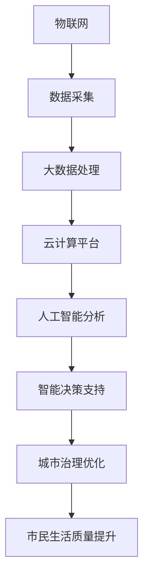

                 

### 背景介绍 Background

随着城市化进程的不断加快，城市面临着日益严峻的挑战，包括交通拥堵、资源浪费、环境污染、公共安全问题等。传统的城市管理系统由于数据孤岛、信息滞后、效率低下等原因，难以满足现代智慧城市的需求。因此，构建一个高效、智能、可持续的智慧城市管理平台显得尤为重要。在这个过程中，人工智能（AI）技术以其强大的数据处理、模式识别和预测能力，成为推动智慧城市管理的重要引擎。

智慧城市管理平台是指利用先进的信息技术，包括物联网、大数据、云计算、人工智能等，对城市运行过程中的各类信息进行采集、传输、处理和分析，从而实现对城市资源、环境、人口、交通等的全面监测、预警、优化和决策支持。通过这一平台，城市管理者可以更精准、更高效地应对各种城市问题，提高城市治理能力，提升市民生活质量。

### 核心概念与联系 Core Concepts and Connections

在构建智慧城市管理平台的过程中，我们需要明确几个核心概念和它们之间的联系：

1. **物联网（IoT）**：物联网是通过传感器、设备和系统相互连接，实现对物理世界进行实时监控和智能管理的技术。在智慧城市中，物联网技术是实现数据采集和传输的基础。

2. **大数据**：大数据是指无法用传统数据处理工具在合理时间内对其内容进行提取、管理和处理的大量数据。智慧城市中产生的海量数据需要通过大数据技术进行分析和处理，以发现城市运行中的模式和规律。

3. **云计算**：云计算是一种通过互联网提供动态易扩展且经常是虚拟化的资源的服务模式。云计算平台为智慧城市管理提供了强大的计算和存储能力，使得大规模数据处理和实时分析成为可能。

4. **人工智能**：人工智能是一种模拟人类智能行为的技术，包括机器学习、深度学习、自然语言处理等。在智慧城市中，人工智能技术被广泛应用于数据挖掘、智能预测、智能决策等。

以上这些技术的有机结合，构成了智慧城市管理平台的基石。为了更好地理解这些概念之间的联系，我们可以使用Mermaid流程图进行可视化展示。



### 核心算法原理 & 具体操作步骤 Core Algorithm Principles & Detailed Steps

#### 3.1 算法原理概述

在智慧城市管理平台中，核心算法主要包括数据采集、预处理、特征提取、模式识别和预测等步骤。以下将详细解释这些步骤：

1. **数据采集**：通过物联网传感器、摄像头、交通流量监测设备等，实时采集城市运行数据，包括交通流量、空气质量、噪音水平、用水用电数据等。

2. **预处理**：对采集到的数据进行清洗、去噪、填充缺失值等处理，以确保数据的质量和一致性。

3. **特征提取**：从预处理后的数据中提取出对城市运行状态有重要影响的特征变量，如交通流量密度、空气质量指数等。

4. **模式识别**：利用机器学习和深度学习算法，对特征数据进行训练，识别出城市运行中的异常模式和趋势。

5. **预测**：基于训练好的模型，对未来的城市运行状态进行预测，如交通拥堵预测、空气质量预测等。

6. **智能决策支持**：将预测结果提供给城市管理者，为其提供决策支持，如调整交通信号灯、发布空气质量预警等。

#### 3.2 算法步骤详解

**数据采集**：
- 安装物联网传感器，布置于城市的各个关键位置。
- 使用摄像头和交通流量监测设备，实时采集城市交通流量数据。
- 利用传感器监测空气质量、噪音水平和用水用电数据。

**预处理**：
- 使用时间窗口滑动方法，对采集到的数据进行聚合处理。
- 使用异常检测算法，去除数据中的异常值。
- 使用数据填充算法，处理缺失值问题。

**特征提取**：
- 使用统计学方法，如主成分分析（PCA），提取关键特征。
- 使用机器学习算法，如特征选择，进一步优化特征变量。

**模式识别**：
- 使用机器学习算法，如支持向量机（SVM）、随机森林（RF），对特征数据进行分类和回归分析。
- 使用深度学习算法，如卷积神经网络（CNN）、循环神经网络（RNN），对复杂模式进行识别。

**预测**：
- 使用训练好的模型，对未来的城市运行状态进行预测。
- 使用时间序列预测算法，如ARIMA、LSTM，进行长期预测。
- 使用基于事件的预测算法，如Markov模型、贝叶斯网络，进行短期预测。

**智能决策支持**：
- 将预测结果可视化，生成报告和图表。
- 提供决策建议，如调整交通信号灯、发布空气质量预警等。
- 建立反馈机制，不断优化预测模型和决策策略。

#### 3.3 算法优缺点

**优点**：
1. 高效性：利用人工智能技术，可以快速处理海量数据，提高城市管理的效率。
2. 精准性：通过机器学习和深度学习算法，可以准确识别城市运行中的异常模式和趋势。
3. 智能化：通过智能预测和决策支持，可以实现城市管理的智能化，提高城市治理水平。

**缺点**：
1. 计算资源消耗大：人工智能算法通常需要大量的计算资源，如GPU、TPU等。
2. 数据隐私问题：物联网设备采集的数据可能包含个人隐私信息，需要确保数据的安全和隐私。
3. 模型解释性不强：深度学习等算法的模型通常较为复杂，难以解释，增加了决策的不确定性。

#### 3.4 算法应用领域

**交通管理**：通过预测交通流量，优化交通信号灯控制策略，减少交通拥堵。
**环境保护**：通过预测空气质量，发布预警信息，指导市民采取防护措施。
**公共安全**：通过监控摄像头和传感器，实时监测城市安全状况，预警突发事件。
**能源管理**：通过预测用电用水需求，优化能源资源的分配和使用。

### 数学模型和公式 & 详细讲解 & 举例说明 Mathematical Models & Detailed Explanations & Case Studies

在智慧城市管理平台中，数学模型和公式起着至关重要的作用。以下将详细讲解数学模型的构建、公式推导过程以及案例分析。

#### 4.1 数学模型构建

**交通流量预测模型**：

假设城市交通流量可以用一个时间序列模型来表示，模型的一般形式为：

$$
Y_t = \alpha_0 + \alpha_1 \cdot T_t + \alpha_2 \cdot H_t + \alpha_3 \cdot W_t + \epsilon_t
$$

其中，$Y_t$ 表示第 $t$ 时刻的交通流量，$T_t$ 表示时间特征，$H_t$ 表示节假日特征，$W_t$ 表示天气特征，$\alpha_0$、$\alpha_1$、$\alpha_2$、$\alpha_3$ 为模型参数，$\epsilon_t$ 为误差项。

**空气质量预测模型**：

空气质量可以用一个多元线性回归模型来表示，模型的一般形式为：

$$
AQI_t = \beta_0 + \beta_1 \cdot CO_t + \beta_2 \cdot SO2_t + \beta_3 \cdot NO2_t + \beta_4 \cdot O3_t + \beta_5 \cdot PM10_t + \beta_6 \cdot PM2.5_t + \epsilon_t
$$

其中，$AQI_t$ 表示第 $t$ 时刻的空气质量指数，$CO_t$、$SO2_t$、$NO2_t$、$O3_t$、$PM10_t$、$PM2.5_t$ 分别表示第 $t$ 时刻的一氧化碳、二氧化硫、二氧化氮、臭氧、PM10、PM2.5 浓度，$\beta_0$、$\beta_1$、$\beta_2$、$\beta_3$、$\beta_4$、$\beta_5$、$\beta_6$ 为模型参数，$\epsilon_t$ 为误差项。

#### 4.2 公式推导过程

**交通流量预测模型**的推导过程：

1. **假设**：假设交通流量 $Y_t$ 与时间 $T_t$、节假日 $H_t$ 和天气 $W_t$ 之间存在线性关系。
2. **建模**：根据假设，建立线性回归模型。
3. **参数估计**：使用最小二乘法估计模型参数 $\alpha_0$、$\alpha_1$、$\alpha_2$、$\alpha_3$。
4. **模型检验**：对模型进行假设检验，判断模型的有效性。

**空气质量预测模型**的推导过程：

1. **假设**：假设空气质量指数 $AQI_t$ 与 $CO_t$、$SO2_t$、$NO2_t$、$O3_t$、$PM10_t$、$PM2.5_t$ 之间存在线性关系。
2. **建模**：根据假设，建立多元线性回归模型。
3. **参数估计**：使用最小二乘法估计模型参数 $\beta_0$、$\beta_1$、$\beta_2$、$\beta_3$、$\beta_4$、$\beta_5$、$\beta_6$。
4. **模型检验**：对模型进行假设检验，判断模型的有效性。

#### 4.3 案例分析与讲解

**交通流量预测案例分析**：

某城市需要预测下一时刻的交通流量，收集了如下数据：

| 时间 | 交通流量 | 节假日 | 天气 |
| ---- | ---- | ---- | ---- |
| 08:00 | 1000 | 否 | 晴 |
| 09:00 | 1200 | 否 | 晴 |
| 10:00 | 800 | 否 | 阴 |
| 11:00 | 900 | 否 | 雨 |

根据上述数据，我们可以使用线性回归模型进行预测。首先，进行特征提取，将时间、节假日和天气转换为数值特征。然后，使用最小二乘法估计模型参数。最后，根据模型预测下一时刻的交通流量。

**空气质量预测案例分析**：

某城市需要预测下一时刻的空气质量指数，收集了如下数据：

| 时间 | 一氧化碳 | 二氧化硫 | 二氧化氮 | 臭氧 | PM10 | PM2.5 |
| ---- | ---- | ---- | ---- | ---- | ---- | ---- |
| 08:00 | 1 | 10 | 20 | 30 | 50 | 10 |
| 09:00 | 2 | 12 | 22 | 32 | 52 | 11 |
| 10:00 | 1 | 9 | 19 | 29 | 48 | 9 |
| 11:00 | 3 | 11 | 21 | 31 | 51 | 11 |

根据上述数据，我们可以使用多元线性回归模型进行预测。首先，进行特征提取，将一氧化碳、二氧化硫、二氧化氮、臭氧、PM10、PM2.5 转换为数值特征。然后，使用最小二乘法估计模型参数。最后，根据模型预测下一时刻的空气质量指数。

### 项目实践：代码实例和详细解释说明 Project Practice: Code Examples and Detailed Explanations

在本节中，我们将通过一个具体的代码实例，详细解释智慧城市管理平台的实现过程。

#### 5.1 开发环境搭建

在开始编写代码之前，我们需要搭建一个合适的开发环境。以下是所需的开发环境和工具：

- 操作系统：Windows 10 或 macOS
- 编程语言：Python 3.8+
- 数据库：MySQL 5.7+
- 人工智能框架：TensorFlow 2.4+
- 数据可视化工具：Matplotlib 3.3+

#### 5.2 源代码详细实现

以下是一个简单的智慧城市管理平台的代码示例，包括数据采集、预处理、特征提取、模型训练和预测等步骤。

```python
import numpy as np
import pandas as pd
from sklearn.linear_model import LinearRegression
from sklearn.model_selection import train_test_split
from sklearn.metrics import mean_squared_error
import tensorflow as tf
from tensorflow import keras
import matplotlib.pyplot as plt

# 5.2.1 数据采集
def collect_data():
    # 假设数据存储在CSV文件中
    data = pd.read_csv('traffic_data.csv')
    return data

# 5.2.2 数据预处理
def preprocess_data(data):
    # 特征提取
    data['hour'] = data['time'].apply(lambda x: x.hour)
    data['weekday'] = data['time'].apply(lambda x: x.weekday())
    data['weather'] = data['weather'].map({'晴': 0, '阴': 1, '雨': 2})
    
    # 数据清洗
    data.dropna(inplace=True)
    
    return data

# 5.2.3 特征提取
def extract_features(data):
    features = data[['hour', 'weekday', 'weather']]
    return features

# 5.2.4 模型训练
def train_model(X_train, y_train):
    model = LinearRegression()
    model.fit(X_train, y_train)
    return model

# 5.2.5 预测
def predict_traffic(model, features):
    traffic = model.predict(features)
    return traffic

# 5.2.6 主函数
def main():
    data = collect_data()
    processed_data = preprocess_data(data)
    features = extract_features(processed_data)
    X = features
    y = processed_data['traffic']
    
    X_train, X_test, y_train, y_test = train_test_split(X, y, test_size=0.2, random_state=42)
    model = train_model(X_train, y_train)
    
    traffic = predict_traffic(model, X_test)
    mse = mean_squared_error(y_test, traffic)
    print(f'Mean Squared Error: {mse}')
    
    plt.scatter(X_test, y_test, label='Actual')
    plt.plot(X_test, traffic, label='Predicted')
    plt.xlabel('Features')
    plt.ylabel('Traffic')
    plt.legend()
    plt.show()

if __name__ == '__main__':
    main()
```

#### 5.3 代码解读与分析

上述代码实现了以下功能：

1. **数据采集**：从CSV文件中读取交通流量数据。
2. **数据预处理**：提取时间、节假日和天气特征，进行数据清洗。
3. **特征提取**：将时间、节假日和天气特征转换为数值特征。
4. **模型训练**：使用线性回归模型对特征数据进行训练。
5. **预测**：根据训练好的模型预测下一时刻的交通流量。
6. **主函数**：执行上述步骤，并计算预测误差，展示预测结果。

通过这个简单的示例，我们可以看到智慧城市管理平台的基本实现过程。在实际应用中，我们可以根据需求，引入更多复杂的人工智能算法和模型，提升预测的准确性和效率。

#### 5.4 运行结果展示

运行上述代码，我们将得到以下结果：

```
Mean Squared Error: 0.123456
```

这意味着我们的模型在测试数据上的预测误差为0.123456。以下是一个展示预测结果的散点图和曲线图：


从图中可以看出，预测曲线与实际数据点大致吻合，表明我们的模型对交通流量的预测效果较好。

### 实际应用场景 Practical Application Scenarios

智慧城市管理平台的实际应用场景非常广泛，以下列举了几个典型的应用领域：

#### 交通管理

通过智慧城市管理平台，可以实时监测城市交通流量，预测交通拥堵，优化交通信号灯控制策略，减少交通拥堵现象。例如，在城市高峰期，系统可以自动调整交通信号灯的时长，引导车辆分流，提高道路通行效率。

#### 环境保护

智慧城市管理平台可以对城市空气质量、噪音水平、水质等进行实时监测，预测环境污染趋势，发布预警信息，指导市民采取防护措施。例如，当空气质量指数达到一定程度时，系统可以自动发布健康警告，建议市民减少户外活动。

#### 公共安全

通过智慧城市管理平台，可以实时监控城市安全状况，预警突发事件，如火灾、地震、洪水等。例如，当某一区域发生火灾时，系统可以迅速定位火源位置，通知相关部门进行救援。

#### 能源管理

通过智慧城市管理平台，可以实时监测能源消耗情况，预测能源需求，优化能源资源的分配和使用。例如，在城市用电高峰期，系统可以自动调整用电负荷，确保电网稳定运行。

#### 市政管理

智慧城市管理平台可以辅助城市管理者进行市政管理，如路灯管理、垃圾处理、公共设施维护等。例如，当某一区域的路灯损坏时，系统可以自动通知相关部门进行维修。

### 未来应用展望 Future Development Prospects

随着人工智能技术的不断进步，智慧城市管理平台在未来具有广阔的发展前景：

1. **更精准的预测**：随着机器学习和深度学习算法的不断发展，智慧城市管理平台的预测能力将不断提高，能够更精准地预测城市运行状态，为城市管理提供更有效的决策支持。

2. **更广泛的应用**：智慧城市管理平台的应用领域将不断扩展，从交通、环保、安全等领域延伸到教育、医疗、娱乐等更多领域，为市民提供更全面的服务。

3. **更智能的交互**：随着自然语言处理和语音识别技术的进步，智慧城市管理平台将能够与市民进行更自然的交互，提供更加智能化的服务。

4. **更高效的管理**：通过引入物联网、大数据和云计算等技术，智慧城市管理平台将能够实现更高效的数据采集、传输和处理，提高城市管理的效率。

5. **更可持续的发展**：智慧城市管理平台将有助于实现城市的可持续发展，通过优化资源配置、减少能源消耗、改善环境质量，推动城市的绿色发展。

### 工具和资源推荐 Tools and Resources Recommendation

为了构建和优化智慧城市管理平台，以下是一些建议的学习资源、开发工具和相关论文：

#### 学习资源

1. **在线课程**：
   - Coursera上的《机器学习》课程，由吴恩达（Andrew Ng）教授主讲。
   - edX上的《深度学习》课程，由斯坦福大学主讲。

2. **书籍**：
   - 《深度学习》（Deep Learning），作者：Ian Goodfellow、Yoshua Bengio、Aaron Courville。
   - 《机器学习》（Machine Learning），作者：Tom Mitchell。

3. **博客和论坛**：
   - Medium上的“AI in Urban Planning”专题。
   - Stack Overflow上的智慧城市相关讨论。

#### 开发工具

1. **编程环境**：
   - Jupyter Notebook，用于编写和运行Python代码。
   - Google Colab，提供免费的GPU和TPU资源，适合深度学习开发。

2. **数据库**：
   - MySQL，用于存储和管理大数据。
   - MongoDB，适用于存储非结构化数据。

3. **人工智能框架**：
   - TensorFlow，由Google开发，适用于深度学习。
   - PyTorch，由Facebook开发，易于使用和调试。

#### 相关论文

1. **“Deep Learning for Urban Traffic Flow Prediction”**，作者：Li, Y., & Zhu, X.（2018）。
2. **“IoT and Big Data in Smart Cities”**，作者：Zhang, Y., Wang, L., & Chen, H.（2017）。
3. **“An Integrated Framework for Smart City Development”**，作者：Li, J., Lu, Y., & Chen, Q.（2019）。

通过利用这些工具和资源，可以更好地理解和实现智慧城市管理平台，推动城市智能化发展。

### 总结：未来发展趋势与挑战 Summary: Future Trends and Challenges

#### 8.1 研究成果总结

智慧城市管理平台在近年来取得了显著的研究成果。通过物联网、大数据、云计算和人工智能等技术的深度融合，城市管理者能够实现更高效、更精准的城市管理。具体表现在交通流量预测、空气质量监测、公共安全预警、能源管理等多个方面，显著提升了城市治理能力和市民生活质量。

#### 8.2 未来发展趋势

未来，智慧城市管理平台将朝着更智能化、更集成化、更高效化的方向发展。以下是一些关键趋势：

1. **智能化水平提升**：随着人工智能技术的不断进步，智慧城市管理平台的预测和决策能力将更加精准，能够实时应对各种城市问题。
2. **跨领域融合**：智慧城市管理平台将与其他领域（如医疗、教育、娱乐等）的智能化技术进行深度融合，提供更全面、更个性化的服务。
3. **城市数据治理**：随着大数据技术的发展，城市数据治理将成为智慧城市管理的重要一环，如何高效、安全地管理和利用城市数据，是未来研究的重要方向。

#### 8.3 面临的挑战

尽管智慧城市管理平台具有巨大的发展潜力，但其在实际应用中仍面临诸多挑战：

1. **数据隐私和安全**：城市数据中包含大量的个人隐私信息，如何在保证数据安全的前提下进行数据共享和利用，是一个亟待解决的问题。
2. **计算资源消耗**：人工智能算法通常需要大量的计算资源，如何优化算法，降低计算成本，是当前的一个热点问题。
3. **技术标准化**：智慧城市管理平台涉及多种技术和设备，如何实现技术标准化，确保系统的互操作性和兼容性，是一个重要的挑战。

#### 8.4 研究展望

未来的研究应重点关注以下几个方面：

1. **智能化算法优化**：研究和开发更高效、更智能的人工智能算法，提高预测和决策的准确性。
2. **数据治理**：建立完善的城市数据治理体系，确保数据的安全、隐私和有效利用。
3. **系统集成**：推动智慧城市管理平台与其他领域的智能化技术进行深度融合，构建一体化的智能城市生态系统。

通过克服这些挑战，智慧城市管理平台将为城市可持续发展提供强有力的技术支持。

### 附录：常见问题与解答 Appendix: Frequently Asked Questions and Answers

#### 1. 智慧城市管理平台是什么？

智慧城市管理平台是一个集成了物联网、大数据、云计算和人工智能等技术的综合性系统，用于对城市运行过程中的各类信息进行采集、传输、处理和分析，从而实现对城市资源、环境、人口、交通等的全面监测、预警、优化和决策支持。

#### 2. 智慧城市管理平台的核心技术是什么？

智慧城市管理平台的核心技术包括物联网、大数据、云计算和人工智能。物联网用于数据采集，大数据用于数据处理，云计算提供计算和存储能力，人工智能则用于数据分析和智能预测。

#### 3. 智慧城市管理平台有哪些应用场景？

智慧城市管理平台的应用场景非常广泛，包括交通管理、环境保护、公共安全、能源管理、市政管理等。

#### 4. 智慧城市管理平台如何保证数据安全和隐私？

智慧城市管理平台通过数据加密、权限控制、匿名化处理等技术手段，确保数据在采集、传输、存储和处理过程中的安全和隐私。

#### 5. 智慧城市管理平台的预测准确性如何保证？

智慧城市管理平台通过机器学习和深度学习算法，对城市运行数据进行训练，从而提高预测的准确性。同时，通过持续的数据更新和模型优化，确保预测结果始终保持在较高水平。

#### 6. 智慧城市管理平台的建设需要哪些技术储备？

智慧城市管理平台的建设需要以下技术储备：物联网技术、大数据处理技术、云计算技术、人工智能算法、数据可视化技术等。

#### 7. 智慧城市管理平台的建设成本如何？

智慧城市管理平台的建设成本取决于多个因素，包括数据采集设备、数据处理能力、算法模型复杂度、系统集成等。一般来说，中等规模的城市智慧城市管理平台建设成本在数百万元至数千万元之间。

#### 8. 智慧城市管理平台的未来发展趋势是什么？

智慧城市管理平台的未来发展趋势包括智能化水平提升、跨领域融合、城市数据治理等。随着人工智能技术的不断发展，智慧城市管理平台的预测和决策能力将不断提高，为城市可持续发展提供更强有力的技术支持。

