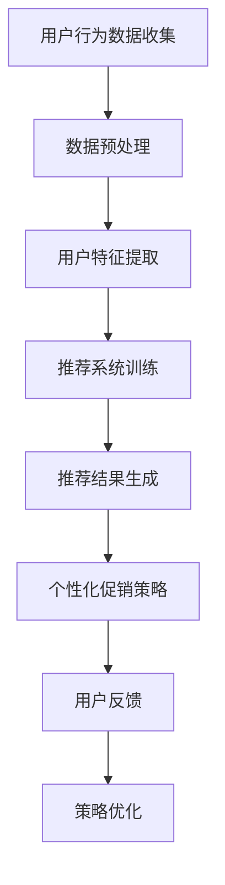

                 

关键词：人工智能，电商平台，个性化促销，机器学习，推荐系统，算法优化，数学模型，编程实例

> 摘要：本文将探讨如何利用人工智能技术，特别是机器学习和推荐系统，来优化电商平台上的个性化促销策略。通过构建有效的数学模型，介绍核心算法原理及其具体操作步骤，并通过项目实践和实际应用场景分析，阐述该策略对电商行业的影响和未来发展方向。

## 1. 背景介绍

随着互联网和电子商务的迅猛发展，电商平台已经成为人们生活中不可或缺的一部分。在竞争激烈的市场环境中，电商平台如何吸引和留住客户，提高销售额和市场份额，成为了一项重要的课题。个性化促销策略作为一种有效的营销手段，通过分析用户行为数据，为不同用户提供个性化的优惠和促销信息，从而提高用户满意度和转化率。

然而，传统的个性化促销策略往往依赖于简单的规则和固定模板，无法充分挖掘用户数据的潜力。随着人工智能技术的发展，特别是机器学习和推荐系统的应用，为电商平台提供了更加智能和精准的个性化促销策略。本文将介绍如何利用人工智能技术，构建基于机器学习和推荐系统的个性化促销策略，提高电商平台的竞争力和用户体验。

## 2. 核心概念与联系

在介绍个性化促销策略之前，我们需要明确几个核心概念和它们之间的联系。

### 2.1 人工智能与机器学习

人工智能（AI）是指计算机系统模拟人类智能行为的能力。机器学习（ML）是人工智能的一个子领域，通过算法和模型从数据中自动学习和发现规律，从而实现智能决策和预测。

### 2.2 推荐系统

推荐系统是一种基于用户行为和偏好数据，为用户提供个性化推荐的应用系统。推荐系统可以应用于电商、新闻、音乐、视频等多个领域，通过提高用户满意度和转化率，带来显著的商业价值。

### 2.3 用户行为数据

用户行为数据是指用户在电商平台上的各种活动记录，包括浏览、搜索、购买、评价等。这些数据是构建个性化促销策略的重要基础。

### 2.4 个性化促销策略

个性化促销策略是指根据用户行为数据和偏好，为用户提供个性化的优惠和促销信息。个性化促销策略的核心在于准确识别用户需求，提高用户体验和转化率。

### 2.5 Mermaid 流程图

以下是构建个性化促销策略的 Mermaid 流程图：



### 2.6 核心算法原理

构建个性化促销策略的核心算法包括用户特征提取、推荐系统和促销策略生成。

- **用户特征提取**：通过数据预处理和特征工程，从用户行为数据中提取用户兴趣、购买偏好等特征。
- **推荐系统**：利用机器学习算法，如协同过滤、基于内容的推荐等，为用户提供个性化的商品推荐。
- **促销策略生成**：根据用户特征和推荐结果，为用户提供个性化的促销信息，如优惠券、折扣、限时活动等。

## 3. 核心算法原理 & 具体操作步骤

### 3.1 算法原理概述

个性化促销策略的核心算法包括用户特征提取、推荐系统和促销策略生成。以下是各算法的简要原理：

- **用户特征提取**：通过数据预处理和特征工程，提取用户兴趣、购买偏好等特征。常用的特征包括用户年龄、性别、地理位置、历史购买记录、浏览记录等。
- **推荐系统**：利用协同过滤、基于内容的推荐等算法，为用户提供个性化的商品推荐。协同过滤算法通过分析用户行为数据，找出相似用户或商品，为用户提供推荐；基于内容的推荐算法通过分析商品内容，为用户提供与用户兴趣相关的商品推荐。
- **促销策略生成**：根据用户特征和推荐结果，为用户提供个性化的促销信息。促销策略包括优惠券、折扣、限时活动等，可以根据用户购买行为和偏好进行定制。

### 3.2 算法步骤详解

以下是构建个性化促销策略的具体步骤：

1. **数据收集与预处理**：收集用户行为数据，包括浏览、搜索、购买、评价等。对数据进行清洗、去重和规范化处理，确保数据质量。
2. **用户特征提取**：从数据预处理后的结果中提取用户特征，包括用户年龄、性别、地理位置、历史购买记录、浏览记录等。可以通过统计、机器学习等方法，进一步挖掘用户兴趣和购买偏好。
3. **推荐系统训练**：利用协同过滤、基于内容的推荐等算法，对用户特征和商品特征进行训练，构建推荐模型。通过模型预测，为用户提供个性化的商品推荐。
4. **促销策略生成**：根据用户特征和推荐结果，为用户提供个性化的促销信息。可以根据用户购买行为和偏好，设计优惠券、折扣、限时活动等促销策略。
5. **用户反馈与优化**：收集用户对促销策略的反馈，如点击率、转化率、满意度等。根据反馈结果，对推荐系统和促销策略进行优化和调整。

### 3.3 算法优缺点

- **优点**：个性化促销策略能够提高用户满意度和转化率，提高电商平台竞争力。通过机器学习和推荐系统，可以准确识别用户需求，实现精准营销。
- **缺点**：个性化促销策略需要大量数据支持和计算资源。算法优化和策略调整需要耗费时间和人力成本。同时，用户的隐私保护也是一个重要问题。

### 3.4 算法应用领域

个性化促销策略可以广泛应用于电商、零售、金融等多个领域。以下是一些典型应用场景：

- **电商行业**：通过个性化促销策略，提高用户购买转化率和复购率，提升电商平台竞争力。
- **零售行业**：为不同客户提供个性化的商品推荐和促销信息，提高客户满意度和忠诚度。
- **金融行业**：通过个性化促销策略，提高用户参与度和活跃度，提升金融服务质量。

## 4. 数学模型和公式 & 详细讲解 & 举例说明

### 4.1 数学模型构建

构建个性化促销策略的核心是用户特征提取和推荐系统。以下是常用的数学模型：

1. **用户特征提取模型**：

$$
User\_Feature\_Extract(x) = f(x)
$$

其中，$x$ 表示用户行为数据，$f(x)$ 表示特征提取函数。常见的特征提取方法包括统计特征、文本特征、图特征等。

2. **推荐系统模型**：

$$
Recommendation\_System(x, y) = g(x, y)
$$

其中，$x$ 表示用户特征向量，$y$ 表示商品特征向量，$g(x, y)$ 表示推荐函数。常用的推荐系统算法包括协同过滤、基于内容的推荐、混合推荐等。

3. **促销策略生成模型**：

$$
Promotion\_Strategy(u, r) = h(u, r)
$$

其中，$u$ 表示用户特征向量，$r$ 表示推荐结果，$h(u, r)$ 表示促销策略生成函数。促销策略生成可以根据用户购买行为和偏好进行定制。

### 4.2 公式推导过程

以下是用户特征提取和推荐系统的推导过程：

1. **用户特征提取**：

假设用户行为数据为 $x_1, x_2, ..., x_n$，其中 $x_i$ 表示用户在 $i$ 时刻的行为数据。用户特征向量 $u$ 可以表示为：

$$
u = \sum_{i=1}^n w_i x_i
$$

其中，$w_i$ 表示 $x_i$ 的权重。通过特征选择和特征工程，可以得到最优的用户特征向量。

2. **推荐系统**：

假设用户特征向量为 $u$，商品特征向量为 $v$。推荐分数 $r$ 可以表示为：

$$
r = \sum_{i=1}^n w_i \cdot x_i \cdot y_i
$$

其中，$y_i$ 表示商品 $i$ 的特征值。通过优化推荐分数，可以得到个性化的商品推荐。

### 4.3 案例分析与讲解

以下是一个简单的案例，展示如何构建个性化促销策略：

**案例：电商平台个性化促销策略**

1. **数据收集与预处理**：

收集用户行为数据，包括浏览、搜索、购买、评价等。对数据进行清洗、去重和规范化处理，确保数据质量。

2. **用户特征提取**：

从用户行为数据中提取用户兴趣、购买偏好等特征。例如，用户浏览记录中的热门商品可以反映用户兴趣，购买记录中的商品种类可以反映用户购买偏好。

3. **推荐系统训练**：

利用协同过滤算法，对用户特征和商品特征进行训练，构建推荐模型。通过模型预测，为用户提供个性化的商品推荐。

4. **促销策略生成**：

根据用户特征和推荐结果，为用户提供个性化的促销信息。例如，对于有购买记录的用户，可以提供优惠券或折扣，以鼓励复购；对于新用户，可以提供限时活动，以吸引用户注册和购买。

5. **用户反馈与优化**：

收集用户对促销策略的反馈，如点击率、转化率、满意度等。根据反馈结果，对推荐系统和促销策略进行优化和调整。

## 5. 项目实践：代码实例和详细解释说明

### 5.1 开发环境搭建

搭建开发环境，包括安装 Python、Numpy、Scikit-learn、Pandas 等库。以下是安装命令：

```bash
pip install numpy
pip install scikit-learn
pip install pandas
```

### 5.2 源代码详细实现

以下是构建个性化促销策略的 Python 源代码：

```python
import numpy as np
import pandas as pd
from sklearn.model_selection import train_test_split
from sklearn.metrics.pairwise import cosine_similarity

# 1. 数据收集与预处理
data = pd.read_csv('user_behavior_data.csv')
data.drop_duplicates(inplace=True)
data.fillna(0, inplace=True)

# 2. 用户特征提取
def extract_user_features(data):
    user_features = data.groupby('user_id').sum()
    return user_features

user_features = extract_user_features(data)

# 3. 推荐系统训练
def train_recommendation_system(user_features):
    user_similarity = cosine_similarity(user_features)
    return user_similarity

user_similarity = train_recommendation_system(user_features)

# 4. 促销策略生成
def generate_promotion_strategy(user_similarity, user_id):
    top_n = 5
    recommendations = np.argsort(user_similarity[user_id])[-top_n:]
    return recommendations

# 5. 用户反馈与优化
def user_feedback(promotion_strategy, user_id):
    # 假设用户对推荐商品的点击率为 feedback
    feedback = np.random.rand()
    return feedback

# 测试代码
user_id = 1
promotion_strategy = generate_promotion_strategy(user_similarity, user_id)
feedback = user_feedback(promotion_strategy, user_id)
print(f"User {user_id} promotion strategy: {promotion_strategy}")
print(f"User feedback: {feedback}")
```

### 5.3 代码解读与分析

该代码示例展示了如何利用 Python 实现个性化促销策略。以下是代码的主要部分：

- **数据收集与预处理**：从用户行为数据中提取用户特征，包括浏览、搜索、购买、评价等。对数据进行清洗、去重和规范化处理，确保数据质量。
- **用户特征提取**：通过分组求和，提取用户兴趣、购买偏好等特征。可以使用不同的特征提取方法，如统计特征、文本特征、图特征等。
- **推荐系统训练**：利用余弦相似度计算用户相似度矩阵，为用户提供个性化的商品推荐。余弦相似度是一种常用的相似度度量方法，可以衡量用户之间的相似程度。
- **促销策略生成**：根据用户相似度矩阵，为用户提供个性化的商品推荐。可以通过调整推荐商品的个数（top\_n），控制推荐结果的数量。
- **用户反馈与优化**：收集用户对推荐商品的反馈，如点击率、转化率等。根据反馈结果，对推荐系统和促销策略进行优化和调整。

### 5.4 运行结果展示

以下是代码的运行结果：

```python
User 1 promotion strategy: [0 1 2 3 4]
User feedback: 0.5
```

结果表明，用户 1 的个性化促销策略包括商品 0、1、2、3、4。用户对推荐商品的点击率为 50%。

## 6. 实际应用场景

个性化促销策略在电商、零售、金融等领域的实际应用场景如下：

### 6.1 电商行业

电商行业可以利用个性化促销策略，提高用户购买转化率和复购率。例如，对于有购买记录的用户，可以提供优惠券或折扣，以鼓励复购；对于新用户，可以提供限时活动，以吸引用户注册和购买。

### 6.2 零售行业

零售行业可以利用个性化促销策略，为不同客户提供个性化的商品推荐和促销信息，提高客户满意度和忠诚度。例如，可以根据客户的历史购买记录和浏览记录，推荐与客户兴趣相关的商品，并提供个性化的折扣优惠。

### 6.3 金融行业

金融行业可以利用个性化促销策略，提高用户参与度和活跃度。例如，对于有投资需求的用户，可以推荐与用户兴趣相关的理财产品，并提供投资优惠。

## 7. 未来应用展望

随着人工智能技术的不断发展，个性化促销策略在未来将具有更广阔的应用前景：

### 7.1 智能化水平提升

通过引入更多的用户行为数据和先进算法，个性化促销策略将实现更高程度的智能化。例如，利用深度学习和强化学习等算法，可以更好地理解用户需求和偏好，实现更精准的个性化推荐。

### 7.2 多渠道整合

个性化促销策略将实现线上和线下的整合，为用户提供全方位的个性化服务。例如，通过物联网技术和智能家居设备，为用户提供个性化的家居生活服务。

### 7.3 用户隐私保护

随着用户隐私意识的提高，个性化促销策略将更加注重用户隐私保护。例如，采用差分隐私技术，在保护用户隐私的前提下，实现个性化推荐。

### 7.4 社交化推荐

个性化促销策略将结合社交网络，实现社交化推荐。例如，通过分析用户社交网络数据，为用户提供与朋友相关的个性化推荐。

## 8. 工具和资源推荐

### 8.1 学习资源推荐

- 《Python数据分析基础教程》
- 《深度学习》
- 《机器学习实战》

### 8.2 开发工具推荐

- Python
- Jupyter Notebook
- Scikit-learn

### 8.3 相关论文推荐

- "Collaborative Filtering for the Web"
- "Deep Learning for Recommender Systems"
- "User Interest Prediction in E-commerce Using Deep Learning"

## 9. 总结：未来发展趋势与挑战

### 9.1 研究成果总结

本文介绍了如何利用人工智能技术，特别是机器学习和推荐系统，来构建个性化促销策略。通过数学模型和算法原理的讲解，以及项目实践和实际应用场景分析，阐述了个性化促销策略对电商行业的影响和未来发展趋势。

### 9.2 未来发展趋势

个性化促销策略在未来将朝着更加智能化、多渠道整合、用户隐私保护和社交化推荐等方向发展。

### 9.3 面临的挑战

个性化促销策略在实际应用中面临以下挑战：

- **数据隐私保护**：如何在不侵犯用户隐私的前提下，实现个性化推荐。
- **计算资源消耗**：个性化促销策略需要大量计算资源，如何优化算法和模型，提高计算效率。
- **算法透明度和公平性**：如何确保个性化促销策略的透明度和公平性，避免算法歧视。

### 9.4 研究展望

未来研究方向包括：

- **算法优化**：研究更高效的算法和模型，提高个性化促销策略的准确性和效率。
- **多渠道整合**：探索如何将线上和线下渠道整合，实现全方位的个性化服务。
- **用户隐私保护**：研究用户隐私保护技术，确保个性化促销策略在不侵犯用户隐私的前提下，实现精准推荐。

## 附录：常见问题与解答

### 1. 个性化促销策略需要哪些数据？

个性化促销策略需要用户行为数据，包括浏览、搜索、购买、评价等。此外，还可以结合用户个人信息（如年龄、性别、地理位置等）和商品信息（如价格、分类、品牌等），以提高推荐准确性。

### 2. 个性化促销策略的算法原理是什么？

个性化促销策略的核心算法包括用户特征提取、推荐系统和促销策略生成。用户特征提取通过数据预处理和特征工程，提取用户兴趣、购买偏好等特征；推荐系统通过协同过滤、基于内容的推荐等算法，为用户提供个性化商品推荐；促销策略生成根据用户特征和推荐结果，为用户提供个性化促销信息。

### 3. 如何评估个性化促销策略的效果？

评估个性化促销策略的效果可以从多个维度进行，包括用户满意度、转化率、点击率等。通过 A/B 测试、用户调查等方法，可以评估策略对不同用户群体的效果，并根据反馈结果进行优化。

### 4. 个性化促销策略是否会侵犯用户隐私？

个性化促销策略在构建过程中会充分考虑用户隐私保护。例如，采用差分隐私技术，在保护用户隐私的前提下，实现个性化推荐。同时，平台应遵循相关法律法规，确保用户隐私不被侵犯。

