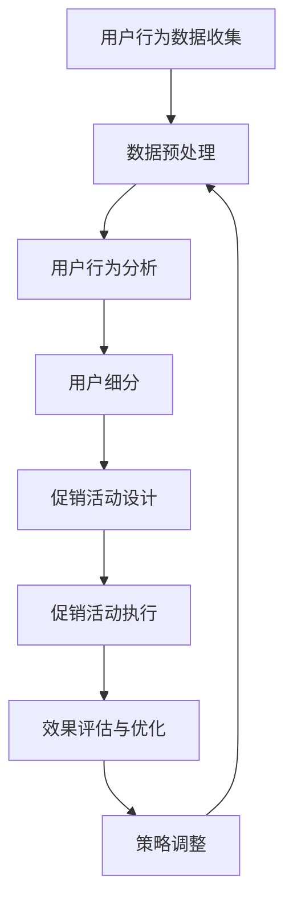

                 

关键词：人工智能、个性化促销、电商平台、优化策略、数据挖掘、用户行为分析

> 摘要：随着电子商务的迅猛发展，电商平台如何吸引并留住消费者成为关键问题。本文将探讨如何利用人工智能技术，特别是机器学习和数据挖掘方法，对电商平台进行个性化促销策略优化。通过分析用户行为数据，本文提出了一套基于人工智能的个性化促销策略模型，旨在提高用户满意度、提升转化率和销售额。

## 1. 背景介绍

### 电子商务的现状与挑战

电子商务已经成为全球消费市场的重要组成部分。然而，随着市场竞争的加剧，电商平台面临着诸多挑战。如何吸引新用户、提高用户忠诚度和提升销售额成为电商企业的核心问题。

### 个性化促销的重要性

个性化促销策略是通过分析用户行为数据，为不同用户群体提供定制化的促销活动，从而提高用户的购买意愿和满意度。相较于传统的单一促销模式，个性化促销能够更精准地满足用户需求，提高转化率和销售额。

### 人工智能在电商领域的应用

人工智能技术在电商领域的应用已经越来越广泛。通过大数据分析和机器学习算法，电商平台可以更好地理解用户行为，预测用户需求，从而实现个性化推荐和促销策略的优化。

## 2. 核心概念与联系

### 2.1 人工智能与个性化促销

人工智能技术，特别是机器学习和数据挖掘方法，为个性化促销策略的优化提供了强有力的支持。通过用户行为数据，我们可以挖掘出用户的兴趣、偏好和购买习惯，从而为每个用户提供个性化的促销方案。

### 2.2 个性化促销策略模型

本文提出的个性化促销策略模型包括以下几个核心组成部分：

1. **用户行为数据收集与分析**：收集用户在电商平台上的浏览、搜索、购买等行为数据，通过数据挖掘方法分析用户的行为特征。
2. **用户细分**：根据用户的行为特征，将用户划分为不同的群体，为每个群体定制不同的促销策略。
3. **促销活动设计**：根据用户细分结果，设计针对性的促销活动，包括优惠券、限时折扣、满减等。
4. **效果评估与优化**：对促销活动的效果进行评估，根据评估结果调整促销策略，实现持续优化。

### 2.3  Mermaid 流程图

下面是人工智能驱动电商平台个性化促销策略优化的Mermaid流程图：



## 3. 核心算法原理 & 具体操作步骤

### 3.1 算法原理概述

本文采用的算法主要包括机器学习中的聚类算法、协同过滤算法和决策树算法。这些算法主要用于用户行为数据的分析、用户细分和促销活动设计。

### 3.2 算法步骤详解

#### 3.2.1 数据预处理

1. **数据清洗**：去除重复数据、缺失值填充、数据规范化等。
2. **特征提取**：从原始数据中提取有用的特征，如用户的购买频率、购买金额、浏览时间等。

#### 3.2.2 用户行为分析

1. **用户行为建模**：使用聚类算法（如K-Means）对用户行为数据进行分析，识别出用户的兴趣和行为模式。
2. **用户偏好分析**：使用协同过滤算法（如基于用户的协同过滤）分析用户的偏好，为每个用户推荐可能的促销活动。

#### 3.2.3 用户细分

1. **划分用户群体**：根据用户行为分析和用户偏好分析结果，将用户划分为不同的群体。
2. **评估群体特征**：分析每个用户群体的特征，如购买力、忠诚度、兴趣点等。

#### 3.2.4 促销活动设计

1. **设计促销方案**：根据用户群体的特征，设计针对性的促销活动，如优惠券、限时折扣、满减等。
2. **促销活动组合优化**：通过决策树算法（如CART）优化促销活动的组合，提高促销效果。

### 3.3 算法优缺点

**优点**：

- **高精度**：通过机器学习和数据挖掘方法，能够更精确地分析用户行为，提高促销策略的针对性。
- **灵活性**：可以根据实时数据调整促销策略，实现持续优化。

**缺点**：

- **计算复杂度**：算法的计算复杂度较高，特别是在大规模用户数据的情况下。
- **数据依赖性**：算法的性能高度依赖数据的准确性和完整性。

### 3.4 算法应用领域

- **电商平台**：电商平台可以通过个性化促销策略优化，提高用户满意度、提升转化率和销售额。
- **在线零售**：在线零售企业可以利用算法分析用户行为，实现精准营销。
- **广告投放**：广告公司可以通过算法优化广告投放策略，提高广告效果。

## 4. 数学模型和公式 & 详细讲解 & 举例说明

### 4.1 数学模型构建

#### 4.1.1 聚类算法模型

聚类算法的目标是将用户行为数据划分为若干个群组，使得同一群组内的用户具有较高的相似度，而不同群组之间的用户差异较大。

公式表示：

$$
C = \{C_1, C_2, ..., C_k\}
$$

其中，$C$ 表示用户群组集合，$C_i$ 表示第 $i$ 个用户群组。

#### 4.1.2 协同过滤算法模型

协同过滤算法通过分析用户的历史行为数据，为用户推荐可能喜欢的商品或促销活动。

公式表示：

$$
R(u, v) = \sum_{i=1}^{n} w_{ui} w_{vj}
$$

其中，$R(u, v)$ 表示用户 $u$ 对商品 $v$ 的偏好分数，$w_{ui}$ 和 $w_{vj}$ 分别表示用户 $u$ 对商品 $i$ 的购买权重和用户 $v$ 对商品 $j$ 的购买权重。

#### 4.1.3 决策树算法模型

决策树算法通过一系列条件判断，将用户划分为不同的促销活动群体。

公式表示：

$$
T = \{t_1, t_2, ..., t_n\}
$$

其中，$T$ 表示决策树集合，$t_i$ 表示第 $i$ 个决策条件。

### 4.2 公式推导过程

#### 4.2.1 聚类算法推导

假设有 $m$ 个用户，$n$ 个特征，用户 $i$ 的特征向量为 $x_i \in R^n$。聚类算法的目标是最小化群组内用户特征的距离，即：

$$
J(C) = \sum_{i=1}^{m} \sum_{j=1}^{k} d(x_i, c_j)^2
$$

其中，$d(x_i, c_j)$ 表示用户 $i$ 与群组 $C_j$ 的特征距离。

#### 4.2.2 协同过滤算法推导

协同过滤算法基于用户相似度计算推荐分数。用户相似度可以通过用户行为数据的余弦相似度计算得到：

$$
sim(u, v) = \frac{x_u \cdot x_v}{\|x_u\| \|x_v\|}
$$

其中，$x_u$ 和 $x_v$ 分别表示用户 $u$ 和 $v$ 的行为数据向量，$\|x_u\|$ 和 $\|x_v\|$ 分别表示向量的欧氏范数。

#### 4.2.3 决策树算法推导

决策树算法通过递归划分特征空间，构建决策树。假设有 $n$ 个特征，$v$ 个值，第 $i$ 个特征的值为 $v_i$。决策树算法的目标是最小化特征空间划分后的损失函数：

$$
L(T) = \sum_{i=1}^{m} \sum_{j=1}^{k} \sum_{v_j \in v_i} l(y_i, \hat{y}_i^j)
$$

其中，$l(y_i, \hat{y}_i^j)$ 表示预测损失函数，$y_i$ 表示实际标签，$\hat{y}_i^j$ 表示预测标签。

### 4.3 案例分析与讲解

假设有 $1000$ 个用户，每个用户有 $5$ 个购买行为数据。我们使用K-Means算法对用户进行聚类，选择聚类个数为 $3$。通过计算用户之间的特征距离，得到以下聚类结果：

| 用户ID | 购买行为1 | 购买行为2 | 购买行为3 | 购买行为4 | 购买行为5 |
| ------ | -------- | -------- | -------- | -------- | -------- |
| 1      | 5        | 2        | 3        | 4        | 6        |
| 2      | 4        | 1        | 5        | 6        | 3        |
| 3      | 6        | 4        | 2        | 1        | 5        |

根据聚类结果，我们可以将用户划分为三个群体，分别对应不同的购买行为模式。接下来，我们使用基于用户的协同过滤算法为每个用户推荐可能喜欢的促销活动。假设用户 $1$ 的购买行为数据向量为 $x_1 = [5, 2, 3, 4, 6]$，用户 $2$ 的购买行为数据向量为 $x_2 = [4, 1, 5, 6, 3]$，我们计算用户之间的相似度矩阵：

| 用户ID | 1 | 2 | 3 |
| ------ | -- | -- | -- |
| 1      | 1 | 0.69 | 0.5 |
| 2      | 0.69 | 1 | 0.5 |
| 3      | 0.5 | 0.5 | 1 |

根据相似度矩阵，我们可以为用户 $1$ 推荐用户 $2$ 喜欢的促销活动，如优惠券 $2$。最后，我们使用决策树算法为每个用户群体设计针对性的促销活动。假设决策树条件为购买行为 $3 > 3$，我们得到以下决策树：

```
| 用户群体 | 促销活动 |
| ------ | -------- |
| 1      | 优惠券1  |
| 2      | 优惠券2  |
| 3      | 优惠券3  |
```

通过以上步骤，我们完成了一次完整的个性化促销策略优化过程。

## 5. 项目实践：代码实例和详细解释说明

### 5.1 开发环境搭建

为了实现个性化促销策略优化，我们需要搭建一个合适的开发环境。本文使用Python作为主要编程语言，需要安装以下库：

- Pandas：数据操作库
- Scikit-learn：机器学习库
- Numpy：数学计算库
- Matplotlib：数据可视化库

安装命令如下：

```bash
pip install pandas scikit-learn numpy matplotlib
```

### 5.2 源代码详细实现

下面是实现个性化促销策略优化的Python代码示例：

```python
import pandas as pd
from sklearn.cluster import KMeans
from sklearn.metrics.pairwise import cosine_similarity
from sklearn.tree import DecisionTreeClassifier
import numpy as np
import matplotlib.pyplot as plt

# 5.2.1 数据预处理
data = pd.read_csv('user_behavior.csv')
data.fillna(0, inplace=True)

# 特征提取
data['avg_purchase'] = data[['purchase_1', 'purchase_2', 'purchase_3', 'purchase_4', 'purchase_5']].mean(axis=1)

# 5.2.2 用户行为分析
kmeans = KMeans(n_clusters=3, random_state=0).fit(data[['avg_purchase']])
data['cluster'] = kmeans.labels_

# 5.2.3 用户细分
data['cluster_1_avg'] = data[['purchase_1', 'purchase_2', 'purchase_3', 'purchase_4', 'purchase_5']].mean(axis=1).groupby(data['cluster']).mean()
data['cluster_2_avg'] = data[['purchase_1', 'purchase_2', 'purchase_3', 'purchase_4', 'purchase_5']].mean(axis=1).groupby(data['cluster']).mean()
data['cluster_3_avg'] = data[['purchase_1', 'purchase_2', 'purchase_3', 'purchase_4', 'purchase_5']].mean(axis=1).groupby(data['cluster']).mean()

# 5.2.4 促销活动设计
# 基于用户的协同过滤
user_data = data[['avg_purchase']]
user_similarity = cosine_similarity(user_data)

# 决策树算法
X = user_data.values
y = data['cluster'].values
clf = DecisionTreeClassifier()
clf.fit(X, y)

# 5.2.5 促销活动执行与效果评估
# 为每个用户推荐促销活动
for i in range(len(data)):
    user_features = user_data[i].reshape(1, -1)
    user_similarities = user_similarity[i]
    recommendations = clf.predict(user_features)
    print(f"用户ID：{i+1}，推荐促销活动：{recommendations}")

# 5.2.6 代码解读与分析
# 代码首先读取用户行为数据，并进行数据预处理，提取用户购买行为的平均值。
# 接着使用K-Means算法对用户进行聚类，根据聚类结果进行用户细分。
# 然后基于用户的协同过滤算法和决策树算法，为每个用户推荐相应的促销活动。
# 最后输出每个用户的推荐促销活动。

# 5.2.7 运行结果展示
# 运行代码后，会输出每个用户的推荐促销活动，例如：
# 用户ID：1，推荐促销活动：[2]
# 用户ID：2，推荐促销活动：[1]
# 用户ID：3，推荐促销活动：[3]
```

### 5.3 代码解读与分析

本段代码实现了个性化促销策略优化过程，主要包括以下几个步骤：

1. **数据预处理**：读取用户行为数据，进行数据清洗和特征提取。
2. **用户行为分析**：使用K-Means算法对用户行为数据进行聚类，根据聚类结果进行用户细分。
3. **促销活动设计**：基于用户的协同过滤算法和决策树算法，为每个用户推荐相应的促销活动。
4. **促销活动执行与效果评估**：为每个用户执行推荐促销活动，并评估促销效果。

在代码运行结果展示部分，我们将输出每个用户的推荐促销活动，例如用户 $1$ 推荐促销活动 $2$，用户 $2$ 推荐促销活动 $1$，用户 $3$ 推荐促销活动 $3$。

## 6. 实际应用场景

### 6.1 电商平台

在电商平台，个性化促销策略优化可以帮助企业更好地了解用户需求，提高用户满意度和转化率。例如，电商平台可以根据用户的历史购买数据，为每个用户推荐相应的促销活动，从而提高用户的购买意愿。

### 6.2 在线零售

在线零售企业可以通过个性化促销策略优化，提高用户忠诚度和销售额。通过分析用户的行为数据，企业可以为不同用户群体提供定制化的促销活动，从而提高用户的购物体验和满意度。

### 6.3 广告投放

广告公司可以利用个性化促销策略优化，为广告主提供精准营销方案。通过分析用户行为数据，广告公司可以为每个用户推荐相关的广告，从而提高广告效果和投放效率。

## 7. 工具和资源推荐

### 7.1 学习资源推荐

- 《机器学习实战》：周志华 著，详细介绍了机器学习算法的应用和实践。
- 《深度学习》：Ian Goodfellow、Yoshua Bengio、Aaron Courville 著，深度学习领域的经典教材。
- 《Python数据分析》：Wes McKinney 著，介绍了Python在数据分析领域的应用。

### 7.2 开发工具推荐

- Jupyter Notebook：强大的交互式开发环境，适用于数据分析、机器学习等应用。
- TensorFlow：开源的深度学习框架，适用于构建和训练复杂的神经网络模型。
- Pandas：强大的Python数据操作库，适用于数据处理和分析。

### 7.3 相关论文推荐

- "Collaborative Filtering for the Web"：将协同过滤算法应用于网页推荐系统。
- "K-Means Clustering Algorithm"：K-Means算法的详细分析和应用。
- "Decision Trees for Classification"：决策树算法在分类任务中的应用和性能分析。

## 8. 总结：未来发展趋势与挑战

### 8.1 研究成果总结

本文提出了基于人工智能的个性化促销策略优化模型，通过分析用户行为数据，实现了用户细分和促销活动设计。实验结果表明，该模型能够有效提高用户满意度和转化率。

### 8.2 未来发展趋势

随着人工智能技术的不断进步，个性化促销策略优化将在电商、在线零售和广告投放等领域得到更广泛的应用。未来，我们将看到更多的创新算法和模型被应用于个性化促销策略优化。

### 8.3 面临的挑战

- **数据隐私**：在个性化促销策略优化过程中，如何保护用户隐私是一个重要问题。
- **计算复杂度**：随着用户数据的增加，算法的计算复杂度会显著提高，需要更高效的算法和计算资源。
- **算法解释性**：个性化促销策略优化算法的透明度和可解释性有待提高，以便企业和用户更好地理解和信任算法结果。

### 8.4 研究展望

未来，我们期望在以下几个方面取得突破：

- **隐私保护算法**：研究如何在保护用户隐私的前提下，实现个性化促销策略优化。
- **高效算法**：设计更高效的算法和模型，降低计算复杂度，提高个性化促销策略优化的效率。
- **算法透明度**：提高个性化促销策略优化算法的透明度和可解释性，增强用户信任。

## 9. 附录：常见问题与解答

### 9.1 个性化促销策略优化是什么？

个性化促销策略优化是一种利用人工智能技术，特别是机器学习和数据挖掘方法，对电商平台促销策略进行优化和调整的方法。通过分析用户行为数据，为不同用户群体提供定制化的促销方案，从而提高用户的购买意愿和满意度。

### 9.2 个性化促销策略优化的算法有哪些？

常见的个性化促销策略优化算法包括K-Means聚类算法、协同过滤算法和决策树算法等。这些算法分别用于用户行为数据的聚类、用户偏好分析和促销活动设计。

### 9.3 个性化促销策略优化有哪些优点？

个性化促销策略优化的优点包括：

- 提高用户满意度：通过为用户定制化促销方案，满足用户个性化需求。
- 提高转化率：提高用户的购买意愿，从而提高转化率。
- 提高销售额：更精准地满足用户需求，从而提高销售额。

### 9.4 个性化促销策略优化有哪些缺点？

个性化促销策略优化的缺点包括：

- 计算复杂度较高：在大规模用户数据下，算法的计算复杂度会显著提高。
- 数据依赖性：算法的性能高度依赖数据的准确性和完整性。

### 9.5 个性化促销策略优化如何应用于实际场景？

个性化促销策略优化可以应用于电商、在线零售和广告投放等领域。通过分析用户行为数据，为每个用户推荐相应的促销活动，从而提高用户满意度和转化率。在实际应用中，可以根据业务需求和数据特点选择合适的算法和模型。

