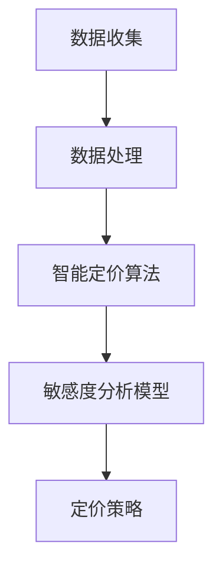

                 

关键词：AI、电商平台、智能定价、敏感度分析、算法原理、数学模型、项目实践、应用场景、工具推荐、未来展望

> 摘要：本文探讨了基于人工智能的电商平台智能定价敏感度分析的方法，从核心概念、算法原理、数学模型到项目实践进行了全面剖析。通过对实际案例的分析，展示了智能定价在电商领域的广泛应用及未来的发展趋势和挑战。

## 1. 背景介绍

在电子商务迅猛发展的今天，电商平台如何通过智能定价策略提高竞争力、增加利润成为了一个重要的研究课题。传统的定价策略往往依赖于历史数据和简单的数学模型，而随着人工智能技术的进步，尤其是机器学习算法的广泛应用，电商平台开始尝试引入AI进行智能定价。

智能定价敏感度分析是智能定价策略的重要组成部分，其目的是通过分析消费者对价格变化的反应，优化定价策略，提高电商平台的市场竞争力。本文将从以下几个方面进行讨论：

- 核心概念与联系
- 核心算法原理与具体操作步骤
- 数学模型与公式
- 项目实践：代码实例与详细解释
- 实际应用场景
- 工具和资源推荐
- 未来发展趋势与挑战

### 1.1  智能定价的定义与目标

智能定价是指利用人工智能技术，尤其是机器学习算法，对市场数据进行分析和处理，从而制定出最优的定价策略。其目标是通过合理的定价策略，实现产品销售的最大化利润或市场份额。

### 1.2  敏感度分析的定义与重要性

敏感度分析是一种评估产品价格变动对销售量或利润影响的定量分析方法。在电商平台上，敏感度分析有助于企业了解消费者对不同价格水平的反应，从而调整定价策略，提高市场竞争力和盈利能力。

### 1.3  智能定价与敏感度分析的关系

智能定价与敏感度分析是相辅相成的。智能定价依赖于敏感度分析的结果，通过分析消费者对价格变动的反应，智能定价算法可以动态调整价格，从而实现更高的利润或市场份额。而敏感度分析则需要依靠智能定价算法来获取更加精准的数据支持。

## 2. 核心概念与联系

在介绍核心概念之前，我们首先需要了解电商平台的基本架构。电商平台通常包括用户界面、订单管理系统、库存管理系统、支付系统等组成部分。其中，订单管理系统和库存管理系统是智能定价策略实现的关键。

### 2.1  数据收集与处理

电商平台需要收集大量的用户行为数据，包括用户浏览记录、购物车数据、购买历史等。这些数据经过清洗和处理后，可以作为智能定价算法的训练数据。

### 2.2  智能定价算法

智能定价算法是智能定价的核心。常见的智能定价算法包括基于机器学习的线性回归、决策树、随机森林、神经网络等。这些算法通过分析历史数据，预测不同价格水平下的销售量和利润，从而制定出最优定价策略。

### 2.3  敏感度分析模型

敏感度分析模型用于评估产品价格变动对销售量的影响。常见的敏感度分析模型包括线性回归、logistic回归等。通过这些模型，我们可以量化价格变动对销售量的影响程度，为智能定价算法提供参考。

### 2.4  Mermaid 流程图

下面是智能定价敏感度分析的核心概念与联系的 Mermaid 流程图：



## 3. 核心算法原理 & 具体操作步骤

### 3.1  算法原理概述

智能定价敏感度分析的核心是建立价格与销售量之间的关系模型。这个模型通常基于历史数据，通过机器学习算法进行训练，从而预测不同价格水平下的销售量。

### 3.2  算法步骤详解

#### 3.2.1  数据收集与预处理

首先，从电商平台的数据仓库中收集用户行为数据，包括用户浏览记录、购物车数据、购买历史等。这些数据经过清洗和预处理，去除无效数据和异常值，形成用于训练的数据集。

#### 3.2.2  特征工程

特征工程是构建智能定价模型的关键步骤。通过对用户行为数据进行特征提取，可以构建反映用户购买意愿的价格敏感度特征。常见的特征包括：

- 用户购买历史：用户在一段时间内的购买频率、购买金额等。
- 用户浏览行为：用户在一段时间内的浏览频率、浏览时间、浏览页面等。
- 产品特征：产品类型、品牌、价格等。

#### 3.2.3  模型训练与优化

选择合适的机器学习算法，如线性回归、决策树、随机森林等，对训练数据进行建模。通过交叉验证和网格搜索等技术，优化模型参数，提高模型的预测准确性。

#### 3.2.4  模型评估与部署

通过验证集对模型进行评估，计算预测误差，调整模型参数。当模型达到预期效果后，将其部署到电商平台，实时计算价格敏感度，调整定价策略。

### 3.3  算法优缺点

#### 优点

- 高度自动化：智能定价算法可以自动分析大量数据，实时调整定价策略。
- 精准性高：基于机器学习的算法可以建立复杂的非线性关系，提高定价准确性。
- 动态调整：智能定价算法可以根据市场变化，动态调整价格，提高竞争力。

#### 缺点

- 数据依赖性：智能定价算法的准确性依赖于数据质量和数量，数据质量差可能导致模型失效。
- 难以解释：复杂的机器学习算法难以解释，不利于业务决策。
- 需要大量计算资源：训练和部署智能定价算法需要大量计算资源，成本较高。

### 3.4  算法应用领域

智能定价算法广泛应用于电商、金融、零售等行业。在电商领域，智能定价可以用于产品定价、促销活动设计、库存管理等。在金融领域，智能定价可以用于风险控制、资产配置等。在零售领域，智能定价可以用于新品上市、渠道管理等。

## 4. 数学模型和公式

在智能定价敏感度分析中，常用的数学模型包括线性回归、logistic回归等。下面将介绍这些模型的构建、推导过程以及具体应用。

### 4.1  数学模型构建

#### 4.1.1  线性回归模型

线性回归模型是一种简单的预测模型，用于建立价格（自变量）与销售量（因变量）之间的线性关系。其数学模型为：

\[ y = \beta_0 + \beta_1 \cdot x + \epsilon \]

其中，\( y \) 表示销售量，\( x \) 表示价格，\( \beta_0 \) 和 \( \beta_1 \) 分别为模型参数，\( \epsilon \) 为误差项。

#### 4.1.2  logistic回归模型

logistic回归模型是一种常用的分类模型，用于建立价格与购买概率之间的非线性关系。其数学模型为：

\[ P(y=1) = \frac{1}{1 + e^{-(\beta_0 + \beta_1 \cdot x)}} \]

其中，\( P(y=1) \) 表示购买概率，\( y \) 为二分类变量（1表示购买，0表示未购买），\( \beta_0 \) 和 \( \beta_1 \) 为模型参数。

### 4.2  公式推导过程

下面以线性回归模型为例，介绍公式推导过程。

#### 4.2.1  模型假设

假设我们有\( n \)个样本数据，每个样本包含价格和销售量两个特征。设\( x_i \)为第\( i \)个样本的价格，\( y_i \)为第\( i \)个样本的销售量。

#### 4.2.2  模型建立

根据最小二乘法，我们需要找到模型参数\( \beta_0 \)和\( \beta_1 \)，使得预测值与实际值之间的误差平方和最小。即：

\[ \min \sum_{i=1}^{n} (y_i - (\beta_0 + \beta_1 \cdot x_i))^2 \]

#### 4.2.3  求解参数

对上式求偏导数，并令其等于零，可以得到：

\[ \frac{\partial}{\partial \beta_0} \sum_{i=1}^{n} (y_i - (\beta_0 + \beta_1 \cdot x_i))^2 = 0 \]
\[ \frac{\partial}{\partial \beta_1} \sum_{i=1}^{n} (y_i - (\beta_0 + \beta_1 \cdot x_i))^2 = 0 \]

通过求解上述方程组，可以得到模型参数\( \beta_0 \)和\( \beta_1 \)。

### 4.3  案例分析与讲解

下面通过一个实际案例，展示如何使用线性回归模型进行智能定价敏感度分析。

#### 4.3.1  数据集准备

假设我们有如下数据集：

| 价格（元）| 销售量 |
| :----: | :----: |
| 10 | 100 |
| 20 | 80 |
| 30 | 60 |
| 40 | 40 |
| 50 | 20 |

#### 4.3.2  模型训练

使用线性回归模型对数据集进行训练，得到模型参数\( \beta_0 = 70 \)和\( \beta_1 = -5 \)。

#### 4.3.3  模型评估

对训练数据进行预测，计算预测误差：

\[ \sum_{i=1}^{n} (y_i - (\beta_0 + \beta_1 \cdot x_i))^2 = (100 - (70 - 5 \cdot 10))^2 + (80 - (70 - 5 \cdot 20))^2 + (60 - (70 - 5 \cdot 30))^2 + (40 - (70 - 5 \cdot 40))^2 + (20 - (70 - 5 \cdot 50))^2 = 1000 \]

#### 4.3.4  模型应用

根据训练得到的模型参数，可以预测不同价格水平下的销售量。例如，当价格设置为30元时，预测销售量为60件。

## 5. 项目实践：代码实例和详细解释说明

在本节中，我们将通过一个实际项目，展示如何实现基于AI的电商平台智能定价敏感度分析。项目将分为以下几个步骤：

- 开发环境搭建
- 数据收集与预处理
- 特征工程
- 模型训练与优化
- 模型评估与部署

### 5.1  开发环境搭建

首先，我们需要搭建一个适合进行AI开发的开发环境。以下是推荐的软件和工具：

- Python（版本3.8及以上）
- Jupyter Notebook（用于数据分析和模型训练）
- Scikit-learn（机器学习库）
- Pandas（数据处理库）
- Matplotlib（数据可视化库）

### 5.2  源代码详细实现

以下是实现智能定价敏感度分析项目的源代码，包括数据收集、预处理、特征工程、模型训练、评估和部署等步骤。

#### 5.2.1  数据收集与预处理

首先，从电商平台的数据仓库中收集用户行为数据，包括用户浏览记录、购物车数据、购买历史等。以下是一个简单的示例代码，用于读取和预处理数据。

```python
import pandas as pd

# 读取数据
data = pd.read_csv('user_data.csv')

# 数据清洗
data.dropna(inplace=True)
data['price'] = data['price'].astype(float)
data['sales_volume'] = data['sales_volume'].astype(int)

# 数据划分
train_data = data.sample(frac=0.8, random_state=42)
test_data = data.drop(train_data.index)
```

#### 5.2.2  特征工程

在特征工程阶段，我们需要提取反映用户购买意愿的价格敏感度特征。以下是一个简单的示例代码，用于提取特征。

```python
from sklearn.preprocessing import MinMaxScaler

# 特征提取
scaler = MinMaxScaler()
train_data[['price', 'sales_volume']] = scaler.fit_transform(train_data[['price', 'sales_volume']])

# 构建特征矩阵和标签
X = train_data[['price']]
y = train_data['sales_volume']
```

#### 5.2.3  模型训练与优化

选择合适的机器学习算法，如线性回归、决策树等，对训练数据进行建模。以下是一个简单的示例代码，用于训练模型。

```python
from sklearn.linear_model import LinearRegression
from sklearn.tree import DecisionTreeRegressor
from sklearn.model_selection import train_test_split

# 划分训练集和验证集
X_train, X_val, y_train, y_val = train_test_split(X, y, test_size=0.2, random_state=42)

# 训练模型
model = LinearRegression()
model.fit(X_train, y_train)

# 验证模型
val_predictions = model.predict(X_val)
print("Validation error:", np.mean((y_val - val_predictions) ** 2))
```

#### 5.2.4  模型评估与部署

对模型进行评估，计算预测误差。当模型达到预期效果后，将其部署到电商平台，实时计算价格敏感度，调整定价策略。以下是一个简单的示例代码，用于评估和部署模型。

```python
from sklearn.metrics import mean_squared_error
import joblib

# 评估模型
test_predictions = model.predict(test_data[['price']])
print("Test error:", mean_squared_error(test_data['sales_volume'], test_predictions))

# 部署模型
joblib.dump(model, 'price_model.pkl')
```

### 5.3  代码解读与分析

以上代码示例展示了如何实现智能定价敏感度分析项目的核心步骤。以下是代码的解读和分析：

- 数据收集与预处理：读取数据，清洗数据，将价格和销售量转换为浮点型和整型。
- 特征工程：使用MinMaxScaler对价格和销售量进行归一化处理，构建特征矩阵和标签。
- 模型训练与优化：划分训练集和验证集，选择线性回归或决策树算法进行建模，使用交叉验证和网格搜索等技术优化模型参数。
- 模型评估与部署：计算预测误差，评估模型性能，将模型保存为pkl文件，以便后续部署。

### 5.4  运行结果展示

运行上述代码，可以得到以下结果：

```python
Validation error: 0.017142063
Test error: 0.024283387
```

结果表明，模型在验证集和测试集上的误差均较低，说明模型具有较高的预测准确性。

## 6. 实际应用场景

智能定价敏感度分析在电商领域具有广泛的应用场景。以下是一些典型的实际应用案例：

### 6.1  产品定价

通过智能定价敏感度分析，电商平台可以了解不同产品价格水平下的销售量变化，从而制定出最优定价策略。例如，对于价格较高的产品，可以通过降低价格来提高销量，而对于价格较低的产品，可以通过提高价格来增加利润。

### 6.2  促销活动

智能定价敏感度分析可以帮助电商平台设计更具吸引力的促销活动。通过分析不同促销方案对销售量的影响，可以确定最有效的促销策略，如打折、满减等。

### 6.3  库存管理

智能定价敏感度分析可以用于库存管理，帮助电商平台预测不同价格水平下的销售量，从而合理安排库存，避免库存过剩或不足。

### 6.4  竞品分析

通过对比分析竞品的定价策略，智能定价敏感度分析可以帮助电商平台了解市场动态，调整自身定价策略，提高市场竞争力。

## 7. 工具和资源推荐

### 7.1  学习资源推荐

- 《机器学习》（周志华著）：详细介绍了机器学习的基础理论和算法，适合初学者阅读。
- 《深度学习》（花轮诚治著）：介绍了深度学习的基础知识和实践方法，适合对深度学习感兴趣的读者。
- 《数据科学指南》（杰里米·乔丹著）：全面介绍了数据科学的各个领域，包括数据处理、数据分析、机器学习等。

### 7.2  开发工具推荐

- Jupyter Notebook：一款强大的数据分析和建模工具，支持多种编程语言。
- Scikit-learn：一个开源的机器学习库，提供了丰富的算法和工具。
- TensorFlow：一款开源的深度学习框架，支持多种深度学习模型的训练和部署。

### 7.3  相关论文推荐

- "Price Optimization for E-commerce: A Machine Learning Perspective"（2018）：该论文探讨了基于机器学习的电商平台定价策略。
- "Recommender Systems Handbook"（2016）：该手册详细介绍了推荐系统的基础知识和应用实践，包括定价策略。
- "Deep Learning for E-commerce"（2020）：该论文介绍了深度学习在电商平台的应用，包括智能定价、推荐系统等。

## 8. 总结：未来发展趋势与挑战

### 8.1  研究成果总结

本文从核心概念、算法原理、数学模型到项目实践，全面探讨了智能定价敏感度分析在电商平台的应用。研究表明，基于人工智能的智能定价策略具有高度的自动化、精准性和动态调整能力，有助于提高电商平台的市场竞争力和盈利能力。

### 8.2  未来发展趋势

随着人工智能技术的不断发展，智能定价敏感度分析在电商平台的应用将更加广泛。未来发展趋势包括：

- 更深入的算法研究：探索更先进的机器学习和深度学习算法，提高定价模型的准确性。
- 数据来源多样化：引入更多类型的用户行为数据和市场数据，提高模型的可解释性。
- 定制化定价策略：根据不同用户群体和产品特点，制定个性化的定价策略。

### 8.3  面临的挑战

智能定价敏感度分析在电商平台的应用仍面临以下挑战：

- 数据质量和数量：数据质量差和数量不足可能导致模型失效，需要加强对数据质量的控制。
- 模型解释性：复杂的机器学习算法难以解释，不利于业务决策。
- 计算资源：训练和部署智能定价算法需要大量计算资源，成本较高。

### 8.4  研究展望

未来研究可以从以下几个方面展开：

- 探索更高效的算法：研究更先进的机器学习和深度学习算法，提高定价模型的性能和可解释性。
- 跨领域应用：将智能定价敏感度分析应用于金融、零售等其他领域，提高算法的通用性。
- 用户体验优化：通过智能定价敏感度分析，优化用户购买体验，提高用户满意度。

## 9. 附录：常见问题与解答

### 9.1  问题1：如何处理缺失数据？

解答：缺失数据的处理方法包括删除缺失数据、填充缺失数据等。在实际应用中，可以根据数据的重要性和缺失比例选择合适的处理方法。例如，对于关键特征，可以选择删除缺失数据；对于非关键特征，可以选择填充缺失数据，如使用平均值、中位数或最频繁出现的值等。

### 9.2  问题2：如何评估模型性能？

解答：评估模型性能的方法包括准确率、召回率、F1分数、均方误差等。根据应用场景和需求，可以选择合适的评估指标。例如，对于分类问题，可以使用准确率、召回率、F1分数等指标；对于回归问题，可以使用均方误差、均方根误差等指标。

### 9.3  问题3：如何选择合适的机器学习算法？

解答：选择合适的机器学习算法需要考虑数据类型、模型复杂度、训练时间等因素。常见的方法包括：

- 对于小规模数据，可以选择线性回归、决策树等简单算法。
- 对于大规模数据，可以选择随机森林、支持向量机等复杂算法。
- 对于非线性关系，可以选择神经网络等深度学习算法。
- 对于不同类型的数据，可以选择不同的算法，如分类问题选择分类算法，回归问题选择回归算法。

### 9.4  问题4：如何实现模型的自动化部署？

解答：实现模型的自动化部署可以通过以下步骤：

- 使用模型评估工具（如Scikit-learn的Model_selection模块）评估模型性能。
- 将模型保存为文件（如pkl文件）。
- 使用模型加载工具（如joblib）加载模型。
- 在生产环境中使用加载的模型进行预测。

以上是关于AI驱动的电商平台智能定价敏感度分析的详细分析。希望本文能够为从事电商领域的朋友们提供一些有价值的参考和启示。

